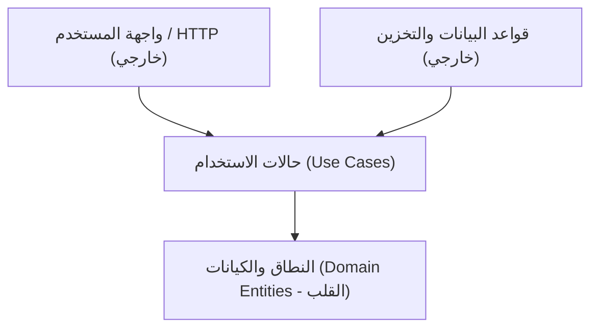

# مبادئ المعمارية النظيفة بلغة Go (Clean Architecture Principles)

تهدف المعمارية النظيفة (Clean Architecture) إلى إنتاج أنظمة برمجية تتسم بالخصائص التالية:

1. **استقلالية الأطر البرمجية (Framework Independence)**: المعمارية لا تعتمد على وجود مكتبة برمجية معينة. يتيح لك ذلك استخدام أطر العمل كأدوات، بدلاً من حشر نظامك في قيودها المحدودة.
2. **قابلية الاختبار السريع (Testability)**: يمكن اختبار قواعد العمل دون الحاجة لعناصر الواجهة (UI)، أو قاعدة البيانات، أو خادم الويب، أو أي عنصر خارجي آخر.
3. **استقلالية واجهة المستخدم (UI Independence)**: يمكن تغيير واجهة المستخدم بسهولة دون التأثير على بقية النظام (مثلاً استبدال واجهة الويب بواجهة سطر أوامر CLI دون تغيير سطر واحد في منطق العمل).
4. **استقلالية قاعدة البيانات (Database Independence)**: يمكنك التبديل بين PostgreSQL أو MySQL أو MongoDB أو التخزين في الذاكرة دون أن تتأثر قواعد عملك المؤسسية.

---

## قاعدة التبعيات الصارمة (The Dependency Rule)

تتحكم قاعدة التبعيات في اتجاه كل سهم في النظام البرمجي:

> **يجب أن تشير تبعيات الكود المصدري دائماً إلى الداخل، باتجاه السياسات العليا (Higher-level Policies).**

- لا يمكن لأي شيء في دائرة داخلية أن يعرف أي شيء على الإطلاق عن شيء ما في دائرة خارجية.
- أسماء الدوال، أو الكلاسات، أو المتغيرات، أو أي كيان برمجي آخر موجود في دائرة خارجية، يجب ألا يُذكر اسمه أو يُستورد داخل دائرة داخلية.

---

## تطويع المعمارية لأسلوب Go القياسي (Idiomatic Go)

تتميز لغة Go بالبساطة وتجنب التعقيد الزائد (No Enterprise Overkill). لذا نطبق المعمارية في Go بالقواعد التالية:

- تجنب حزم الـ Interfaces الضخمة المعرفة مسبقاً.
- تطبيق مبدأ: **"Accept interfaces, return structs"**.
- تعريف الواجهة (Interface) في الحزمة التي **تستهلكها** (`usecase`) وليس في الحزمة التي تنفذها (`adapters/storage`).
- تجنب أطر عمل حقن التبعيات التي تعتمد على الـ Reflection (مثل wire أو dig إن لم تدعُ الحاجة)؛ فالربط اليدوي الصريح في الـ Composition Root أسرع وأوضح وأسهل في التتبع واكتشاف الأخطاء وقت البناء (Compile-time Safety).
