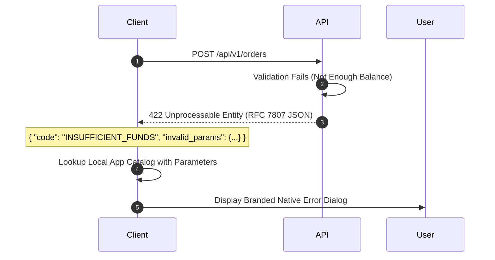

# PEP Middleware, Context Injection & RFC 7807 Problem Details

---

## 1. Request Lifecycle & Context Injection (PEP)

The **Policy Enforcement Point (PEP)** for internationalization is implemented as an HTTP middleware (or gRPC interceptor). It ensures that every goroutine servicing an incoming request has immediate, type-safe access to:

1. The negotiated `language.Tag`.
2. A ready-to-use message formatter (`*message.Printer` or `*i18n.Localizer`).

### Critical Rule: Unexported Context Keys

Context keys MUST NEVER be primitive types (e.g. `string` or `int`), because third-party libraries or concurrent packages could inadvertently collide and overwrite the locale. Always use an unexported struct:

```go
type contextKey struct{ name string }

var (
 localeContextKey  = &contextKey{name: "locale"}
 printerContextKey = &contextKey{name: "printer"}
)
```

---

## 2. Decoupled Transport Boundary: Machine-Readable Keys vs. Localized UI

A common anti-pattern in API design is sending localized UI messages directly in the API error payload for interactive mobile/web clients.

### The Recommended Architecture

1. **API Responses emit Semantic Error Codes**:
   The response payload contains a standardized machine key (e.g. `INSUFFICIENT_FUNDS`, `ITEM_OUT_OF_STOCK`), status codes, and parameterized metadata (e.g., `{"available": 5, "requested": 10}`).
2. **Client Apps Render Localized Phrasing**:
   Frontend clients (Flutter, React) maintain their own UI catalogs and format the error locally.
3. **Backend Renders RFC 7807 Details**:
   The `detail` field in RFC 7807 contains a localized fallback string for non-interactive clients, API consoles, or logging agents.



---

## 3. RFC 7807 Problem Details Standard

All localized error responses must implement **RFC 7807 (Problem Details for HTTP APIs)**:

```json
{
  "type": "https://api.cashflow.com/errors/insufficient-balance",
  "title": "رصيد الحساب غير كافٍ",
  "status": 422,
  "code": "INSUFFICIENT_BALANCE",
  "detail": "الرصيد المتاح 450.50 ر.س لا يكفي لإتمام عملية بقيمة 1,200.00 ر.س.",
  "language": "ar-SA",
  "invalid_params": {
    "available_balance": 450.50,
    "required_amount": 1200.00
  }
}
```

---

## 4. Production Middleware & Error Handler Code

```go
package i18n

import (
 "context"
 "encoding/json"
 "net/http"

 "golang.org/x/text/language"
 "golang.org/x/text/message"
)

type Middleware struct {
 matcher  language.Matcher
 fallback language.Tag
}

func NewMiddleware(supported []language.Tag, fallback language.Tag) *Middleware {
 return &Middleware{
  matcher:  language.NewMatcher(supported),
  fallback: fallback,
 }
}

func (m *Middleware) Handler(next http.Handler) http.Handler {
 return http.HandlerFunc(func(w http.ResponseWriter, r *http.Request) {
  // Resolve language
  var candidates []language.Tag
  if q := r.URL.Query().Get("lang"); q != "" {
   if t, err := language.Parse(q); err == nil {
    candidates = append(candidates, t)
   }
  }
  if len(candidates) == 0 {
   if accept := r.Header.Get("Accept-Language"); accept != "" {
    tags, _, _ := language.ParseAcceptLanguage(accept)
    candidates = append(candidates, tags...)
   }
  }

  resolved := m.fallback
  if len(candidates) > 0 {
   tag, _, _ := m.matcher.Match(candidates...)
   resolved = tag
  }

  printer := message.NewPrinter(resolved)

  // Inject into context
  ctx := context.WithValue(r.Context(), localeContextKey, resolved)
  ctx = context.WithValue(ctx, printerContextKey, printer)

  w.Header().Set("Content-Language", resolved.String())
  next.ServeHTTP(w, r.WithContext(ctx))
 })
}

// ProblemDetails provides RFC 7807 compliant error serialization.
type ProblemDetails struct {
 Type     string         `json:"type"`
 Title    string         `json:"title"`
 Status   int            `json:"status"`
 Code     string         `json:"code"`
 Detail   string         `json:"detail"`
 Language string         `json:"language"`
 Params   map[string]any `json:"invalid_params,omitempty"`
}

func WriteProblem(w http.ResponseWriter, r *http.Request, status int, code, titleKey, detailKey string, params map[string]any) {
 ctx := r.Context()
 printer, ok := ctx.Value(printerContextKey).(*message.Printer)
 if !ok {
  printer = message.NewPrinter(language.Arabic)
 }
 locale, ok := ctx.Value(localeContextKey).(language.Tag)
 if !ok {
  locale = language.Arabic
 }

 prob := ProblemDetails{
  Type:     "https://api.cashflow.com/errors/" + code,
  Title:    printer.Sprintf(titleKey),
  Status:   status,
  Code:     code,
  Detail:   printer.Sprintf(detailKey),
  Language: locale.String(),
  Params:   params,
 }

 w.Header().Set("Content-Type", "application/problem+json")
 w.WriteHeader(status)
 _ = json.NewEncoder(w).Encode(prob)
}
```
