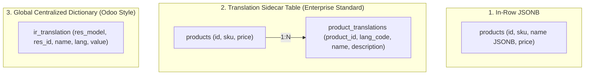

# Multilingual Database Persistence & Architectural Boundaries

---

## 1. The Separation of Master Data vs. Application Messages

A critical architectural dividing line exists between:

1. **Static Application Messages:** Strings authored by developers, stored in code/version control, and managed via CI/CD.
2. **Dynamic Domain Master Data:** Entity names and descriptions created by users (e.g. Products, Chart of Accounts, Categories, Warehouse locations) stored in the relational database.

Dynamic master data must NEVER be mixed into JSON/XLIFF code catalogs. Instead, the persistence layer must support multilingual persistence.

---

## 2. Comparison of Database Persistence Patterns in PostgreSQL



### Comparative Analysis

| Architectural Metric | In-Row JSONB Columns | Translation Sidecar Tables | Centralized Dictionary Table |
| :--- | :--- | :--- | :--- |
| **Relational Integrity (FKs)** | None | **Strict (ON DELETE CASCADE)** | None |
| **Query Complexity** | Simple (`SELECT name->>'ar'`) | Requires `LEFT JOIN` with Fallback | Complex polymorphic JOINs |
| **Linguistic Full-Text Search** | Requires complex GIN indexes | **Native (`to_tsvector('arabic', name)`)** | Difficult across millions of rows |
| **Multi-Tenancy Isolation** | Natural | Natural (inherits tenant scoping) | Risk of cross-tenant leakage |
| **Write Contention** | High (updates lock entire row) | Low (isolated to translation row) | Very High (global bottleneck) |
| **Recommended Scope** | Simple catalogs, flat entities | **ERP Core Entities (Accounts, Items)** | Dynamic runtime metadata |

---

## 3. The Enterprise Standard: PostgreSQL Sidecar Implementation

### DDL Schema

```sql
CREATE TABLE products (
    id UUID PRIMARY KEY DEFAULT gen_random_uuid(),
    company_id UUID NOT NULL, -- Multi-tenant isolation
    sku VARCHAR(50) NOT NULL,
    price NUMERIC(15, 2) NOT NULL,
    created_at TIMESTAMPTZ NOT NULL DEFAULT NOW(),
    CONSTRAINT uk_products_company_sku UNIQUE (company_id, sku)
);

CREATE TABLE product_translations (
    product_id UUID NOT NULL REFERENCES products(id) ON DELETE CASCADE,
    lang_code VARCHAR(10) NOT NULL, -- e.g. 'ar-SA', 'en-US'
    name VARCHAR(255) NOT NULL,
    description TEXT,
    PRIMARY KEY (product_id, lang_code)
);

-- Full-Text Search index specifically tuned for Arabic morphology
CREATE INDEX idx_product_trans_ar_fts ON product_translations 
USING GIN (to_tsvector('arabic', name)) 
WHERE lang_code LIKE 'ar%';

-- Full-Text Search index specifically tuned for English morphology
CREATE INDEX idx_product_trans_en_fts ON product_translations 
USING GIN (to_tsvector('english', name)) 
WHERE lang_code LIKE 'en%';
```

---

## 4. Architectural Boundaries: Where MUST the Backend Translate?

There are five definitive scenarios where translation **MUST** occur on the backend:

1. **Transactional Email Dispatch:**
   - Password reset links, order confirmations, daily financial summaries.
   - Locale must be derived from the **target recipient user** (`user.preferred_lang`), not the worker executing the asynchronous job.
2. **Official Printed Financial Documents (PDFs):**
   - Tax invoices (ZATCA e-Invoicing requirements), official receipts, account balance statements.
   - Must be permanently rendered with the recipient customer's locale and proper RTL text shaping.
3. **Push Notifications & SMS Alerts:**
   - Mobile notifications sent via Apple APNs, Firebase FCM, or Twilio/SMS gateways.
4. **User Audit Trail & Activity Feeds:**
   - Persistent operational event history presented across different users (e.g., "أحمد قام باعتماد السند رقم 105").
5. **B2B Webhooks & Third-Party APIs:**
   - Integrations where external partner systems consume raw formatted text without a dedicated client UI.
