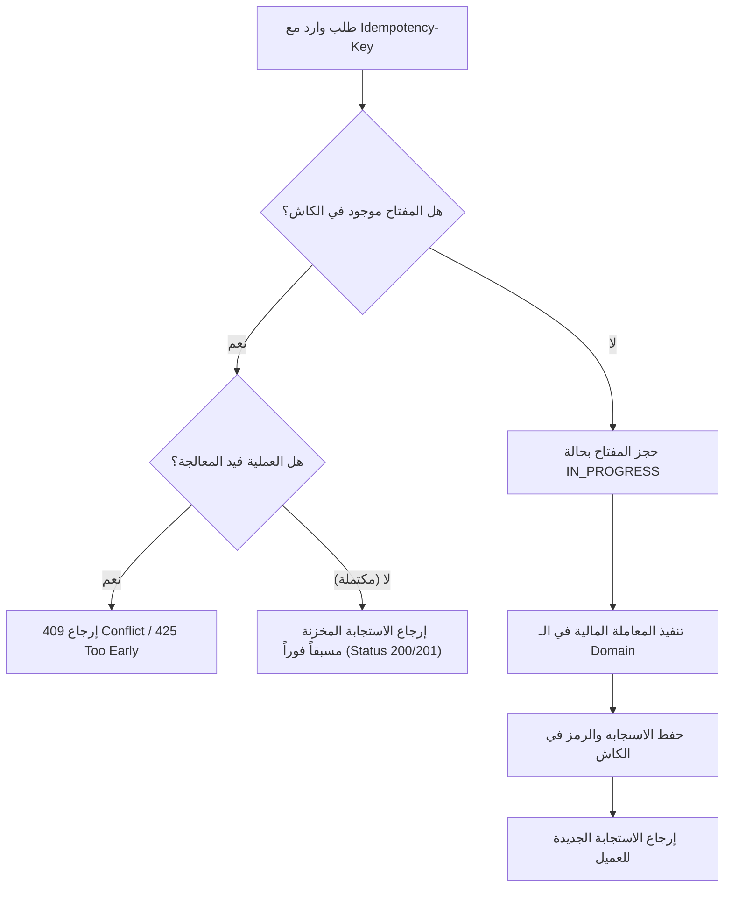

# مفاتيح منع التكرار للعمليات المالية (Idempotency for Financial Operations)

في العمليات المالية (مثل إنشاء دفعة مالية، أو ترحيل قيد، أو إصدار فاتورة)، قد يرسل العميل طلباً ويحدث انقطاع في الاتصال أثناء انتظار الاستجابة (Network Timeout). لا يعلم العميل هل تمت المعاملة بنجاح أم فشلت، فيعيد إرسال الطلب مجدداً.

- **بدون Idempotency**: سيتم خصم المبلغ من العميل مرتين!
- **مع Idempotency**: يكتشف الخادم تكرار المفتاح، ويعيد نتيجة العملية الأولى فوراً دون تكرار الخصم.

---

## 1. الترويسة القياسية (`Idempotency-Key`)

يرسل العميل مع الطلب ترويسة فريدة (مثل UUID v4):
`Idempotency-Key: 9b1deb4d-3b7d-4bad-9bdd-2b0d7b3dcb6d`

---

## 2. دورة المعالجة المعمارية

---

## 3. مدة صلاحية المفتاح (TTL)

تُخزن مفاتيح الـ Idempotency في مخزن سريع (مثل Redis أو جدول مخصص في PostgreSQL) لمدة تتراوح بين **24 إلى 48 ساعة**، وهي كافية لتغطية أي محاولات إعادة إرسال ناتجة عن انقطاع الشبكة.
