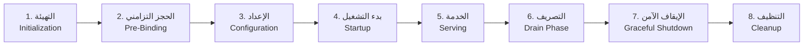

# معايير قياس دورة حياة الخادم (Server Lifecycle) في Go

> المراجع الرسمية: [pkg.go.dev/net/http](https://pkg.go.dev/net/http#Server)، [pkg.go.dev/net#Listen](https://pkg.go.dev/net#Listen)، و [go.dev/doc](https://go.dev/doc/)

---

## المراحل الأساسية لدورة حياة الخادم



---

## المعيار ١: التهيئة والسجلات الاحترافية (Initialization & Multi-Target Logging)

أفضل ممارسات Go تتطلب سجلات مزدوجة قابلة للقراءة آلياً (JSON) في الإنتاج مع حفظها بالملفات، وملونة وقابلة للقراءة بشرياً في الطرفية أثناء التطوير:

- **Terminal Mode**: استخدام مخصص لـ `slog.Handler` (Pretty Handler) مع تلوين المستويات بواسطة ANSI.
- **Production Mode**: استخدام `slog.JSONHandler` وتخزين الأحداث في ملفات مهيكلة (`logs/app.log` و `logs/error.log`).
- **تنسيق الوقت**: الالتزام بتنسيق واضح مثل `2006-01-02 03:04:05 PM`.

---

## المعيار ٢: الحجز التزامني المسبق للمنافذ (Synchronous Listener Pre-Binding)

حجز منافذ TCP بشكل تزامني في الخيط الرئيسي لمنع سباق المنافذ (Port Race Conditions) والفشل بعد بدء الاعتماديات:

```go
ln, err := net.Listen("tcp", addr)
if err != nil {
    return fmt.Errorf("bind listener %s: %w", addr, err)
}
defer ln.Close()
```

---

## المعيار ٣: المهلات الصارمة للشبكة (Strict Server Timeouts)

لا يُسمح باستخدام القيم الصفرية (Zero-values) لخادم `http.Server` في بيئات الإنتاج:
- `ReadHeaderTimeout`: (2s) لحماية الخادم من هجمات Slowloris.
- `ReadTimeout`: (5s–15s) لحماية الخادم من قراءة الأجسام البطيئة.
- `WriteTimeout`: (10s–30s) لضمان عدم بقاء الاتصالات معلقة.
- `IdleTimeout`: (120s) لإدارة اتصالات Keep-Alive بكفاءة.
- `MaxHeaderBytes`: (1 MB) لمنع فيضان ذاكرة الترويسات.

---

## المعيار ٤: فحوصات الجاهزية والضجيج (Health Probes & Noise Reduction)

| الفحص | المسار | الغرض | القاعدة |
| :--- | :--- | :--- | :--- |
| **Liveness** | `/livez` | هل العملية حية ومستجيبة؟ | لا تفحص قاعدة البيانات |
| **Readiness** | `/readyz` | هل الخدمة جاهزة لتلقي المرور؟ | تفحص الاتصال بقاعدة البيانات |

> [!TIP]
> **تقليل الضجيج (Log Suppression)**: يجب عدم تسجيل الطلبات الناجحة لفحوصات الجاهزية (`/livez`, `/readyz`) لتقليل استهلاك مساحة السجلات، مع ضمان تسجيل أي فشل (`Status >= 400`) فوراً.

---

## المعيار ٥: مرحلة التصريف ثنائية الطور (Two-Stage Drain Phase)

1. التقاط إشارة الإيقاف من نظام التشغيل.
2. جعل الجاهزية غير نشطة (`ready = false`) فوراً عبر فحص `/readyz`.
3. الانتظار لفترة زمنية محددة (Drain Duration مثل 5s) للسماح لـ Ingress وموزعات الحمل بعزل هذه الحاوية وسحبها من المسارات النشطة قبل إغلاق المستمعين.

---

## المعيار ٦: الإيقاف الآمن المنسق (Coordinated Graceful Shutdown)

حسب توثيق [`Server.Shutdown`](https://pkg.go.dev/net/http#Server.Shutdown):

```go
shutdownCtx, cancel := context.WithTimeout(context.Background(), 10*time.Second)
defer cancel()

if err := srv.Shutdown(shutdownCtx); err != nil {
    log.Printf("server forced to shutdown: %v", err)
    _ = srv.Close()
}
```

---

## المعيار ٧: التنظيف الحتمي بالترتيب العكسي (Deterministic Reverse-Order Cleanup)

يتم تحرير الموارد بالترتيب العكسي الدقيق لإنشائها:
1. إغلاق خوادم HTTP وانتظار الطلبات النشطة.
2. إيقاف عمال الخلفية (Background Workers).
3. إغلاق مجمعات اتصال قواعد البيانات.
4. إغلاق ومزامنة ملفات السجلات (`logFile.Sync()`).

---

## الملخص: جدول المعايير المحدثة لدورة حياة الخادم

| # | المعيار | الأهمية | النطاق |
| :-- | :--- | :--- | :--- |
| 1 | **الفشل السريع في التهيئة** | 🔴 حرج | إعدادات بيئية واعتماديات صلبة |
| 2 | **الحجز التزامني المسبق للمنافذ** | 🔴 حرج | منع تضارب المنافذ قبل Goroutines |
| 3 | **المهلات الصارمة للخادم** | 🔴 حرج | Read/ReadHeader/Write/Idle Timeouts |
| 4 | **السجلات المهيكلة متعددة الأهداف** | 🔴 حرج | TTY ملون + ملفات JSON مهيكلة |
| 5 | **فحوصات الصحة وتقليل الضجيج** | 🔴 حرج | عزل /livez عن /readyz وحجب 200 OK |
| 6 | **مرحلة التصريف (Drain Phase)** | 🟠 عالي | منع فقدان الطلبات أثناء النشر |
| 7 | **الإيقاف الآمن المتزامن** | 🔴 حرج | srv.Shutdown بمهلة سياق محددة |
| 8 | **التنظيف بالترتيب العكسي** | 🔴 حرج | إغلاق العمال ثم قواعد البيانات ثم السجلات |
| 9 | **التوافق مع إشارات POSIX** | 🟠 عالي | استخدام kill -TERM أو kill -15 |
