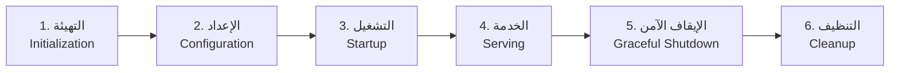

# معايير قياس دورة حياة الخادم (Server Lifecycle) في Go

> حسب المصادر الرسمية: [pkg.go.dev/net/http](https://pkg.go.dev/net/http#Server) و [go.dev/doc](https://go.dev/doc/)

---

## المراحل الأساسية لدورة حياة الخادم



---

## المعيار ١: التهيئة والسجلات الاحترافية (Initialization & Logging)

### نمط السجلات المزدوج (Dual-Mode Logging)
أفضل ممارسات Go تتطلب سجلات قابلة للقراءة آلياً (JSON) في الإنتاج، وملونة وقابلة للقراءة بشرياً في التطوير:
- **Terminal Mode**: استخدام مخصص لـ `slog.Handler` (مثل Pretty Handler) مع تلوين المستويات.
- **Production Mode**: استخدام `slog.JSONHandler` القياسي.
- **تنسيق الوقت**: الالتزام بتنسيق واضح مثل `2006-01-02 03:04:05 PM`.

---

## المعيار ٢: الإعداد والمراقبة (Configuration & Observability)

### المقاييس (Metrics)
الخادم الاحترافي يجب أن يكون "صندوقاً زجاجياً" يكشف عن حالته عبر مسار `/metrics`:
- **النظام**: الذاكرة (Alloc, Heap, Sys)، عدد الـ Goroutines، وقت العمل (Uptime).
- **حركة المرور**: تتبع عدد الطلبات الناجحة (`2xx`) والأخطاء (`4xx`, `5xx`) ومتوسط وقت الاستجابة (Latency).
- **قاعدة البيانات**: مراقبة حالة الـ Connection Pool (النشطة، الخاملة، والانتظارات).

---

## المعيار ٣: التشغيل غير المحجوز (Non-blocking Startup)

حسب النمط الرسمي المُعتمد، يجب تشغيل الخادم في **goroutine منفصلة**:

```go
go func() {
    if err := srv.ListenAndServe(); err != nil && !errors.Is(err, http.ErrServerClosed) {
        log.Fatalf("listen: %s\n", err)
    }
}()
```

---

## المعيار ٤: فحوصات الجاهزية والضجيج (Health Checks & Noise)

| الفحص | المسار | الغرض | القاعدة |
|:---|:---|:---|:---|
| **Liveness** | `/livez` | هل العملية حية؟ | لا تفحص DB |
| **Readiness** | `/readyz` | هل يمكنه الخدمة؟ | افحص DB |
| **Metrics** | `/metrics` | التتبع الحي | استثناء من السجلات الناجحة |

> [!TIP]
> **تقليل الضجيج (Log Suppression)**: يجب عدم تسجيل الطلبات الناجحة لنقاط المراقبة (`/metrics`, `/livez`) لتقليل حجم السجلات، مع ضمان تسجيل الأخطاء فقط.

---

## المعيار ٥: الإيقاف الآمن (Graceful Shutdown)

حسب توثيق [`Server.Shutdown`](https://pkg.go.dev/net/http#Server.Shutdown):

```go
ctx, cancel := context.WithTimeout(context.Background(), 5*time.Second)
defer cancel()

if err := srv.Shutdown(ctx); err != nil {
    log.Fatal("Server forced to shutdown:", err)
}
```

---

## المعيار ٦: نمط مرحلة التصريف (Drain Phase)

1. استقبال إشارة الإيقاف.
2. جعل الجاهزية (`ready`) خاطئة (`false`).
3. الانتظار قليلاً (Drain) للسماح لموزع الحمل بإزالة التطبيق.
4. البدء في `Shutdown`.

---

## الملخص: جدول المعايير المحدث

| # | المعيار | الأهمية |
|:--|:---|:---|
| 1 | **المهلات الزمنية** (Read/Write/Idle) | 🔴 حرج |
| 2 | **التشغيل غير المحجوز** | 🔴 حرج |
| 3 | **السجلات الاحترافية** (TTY/JSON) | 🔴 حرج |
| 4 | **المقاييس الحية** (/metrics) | 🔴 حرج |
| 5 | **إدارة الـ DB Pool** | 🔴 حرج |
| 6 | **الإيقاف الآمن** | 🔴 حرج |
| 7 | **مرحلة التصريف** | 🟠 عالي |
| 8 | **تقليل ضجيج السجلات** | 🟠 عالي |
