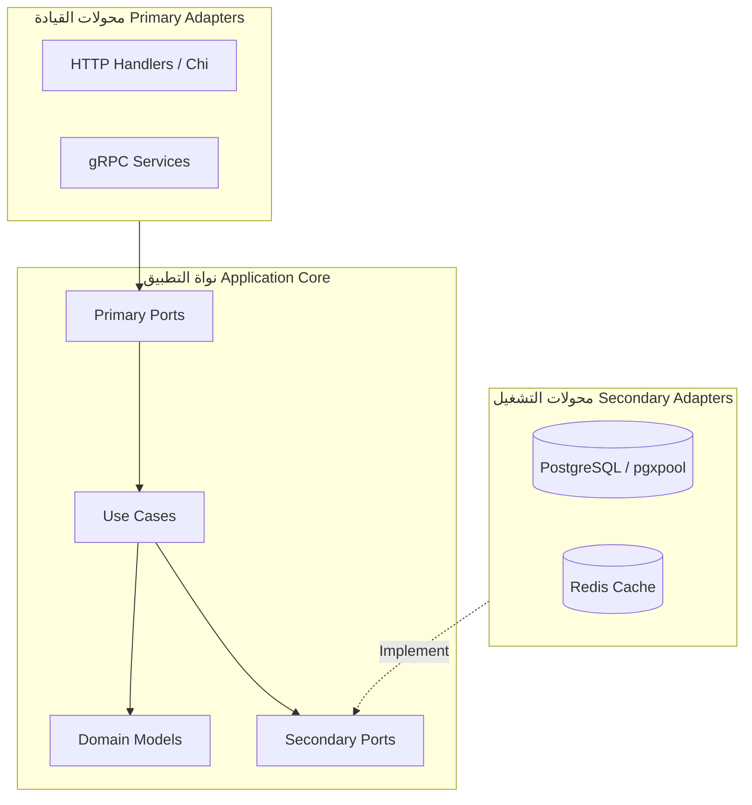
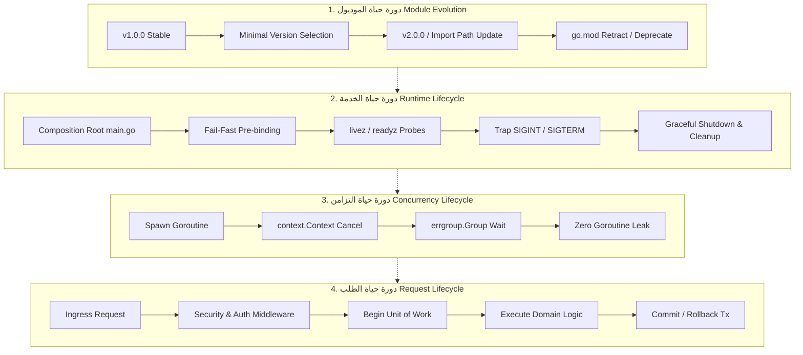
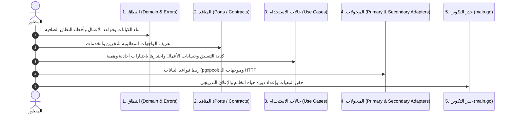

# معمارية وهيكلة مشاريع Go: المعايير الرسمية، التوسع، ودورات الحياة

تحدد هذه المهارة المعايير الهندسية والأنماط المعمارية المعتمدة رسمياً في مجتمع وشركة Google لبناء هياكل برمجية قوية وقابلة للتطوير والنمو في لغة Go (Golang). تغطي المهارة التوجيهات الرسمية لتنظيم الموديولات، قواعد التسمية وتصميم الواجهات، تفكيك الأنماط المضادة (مثل تنظيم الملفات حسب النوع)، وتفصيل دورات الحياة الشاملة للموديول، والخدمة، والتزامن، والطلب الواحد.

---

## 1. الفلسفة الأساسية والمصادر الرسمية

### 1.1 المبادئ التأسيسية لتصميم Go

* **البساطة وتجنب التعقيد العرضي (Simplicity is Complicated):** وضوح تدفق البيانات والقراءة المباشرة أولى من التجريدات الذهنية الزائدة.
* **التكوين بدلاً من الوراثة (Composition over Inheritance):** الاعتماد على دمج الهياكل (`struct embedding`) والواجهات الضمنية (`implicit interfaces`).
* **الوضوح الصريح على السحر الخفي (Explicit over Implicit):** التبعيات تُحقن يدوياً بشكل شجري صريح دون أطر عمل خفية قائمة على الانعكاس السحري، والأخطاء تُعامل كقيم اعتيادية قابلة للفحص.

### 1.2 التوجيهات الرسمية لفريق Go (Official Documentation)

1. **التوثيق الرسمي [go.dev/doc/modules/layout](https://go.dev/doc/modules/layout):** البدء بهيكل مسطح للمكتبات البسيطة، والتوسع التدريجي نحو `cmd/` للبرامج التنفيذية، واستخدام `internal/` لحماية التغليف البرمجي.
2. **موقف فريق Go من مستودع `golang-standards/project-layout` (Issue #117):**
   * أكد **Russ Cox** وفريق Go رسمياً أن المستودع الشهير **ليس معياراً رسمياً للغة Go**، والمكتبة القياسية لا تستخدمه.
   * تجنب ظاهرة "Cargo Culting" (أي إنشاء مجلدات مثل `pkg/`, `api/`, `third_party/` بدون حاجة وظيفية صريحة).
3. **دليل أسلوب Google الرسمي ([Google Go Style Guide](https://google.github.io/styleguide/go/)):**
   * تسمية الحزم بحروف صغيرة مفردة دون شرطات.
   * حظر إنشاء حزم عامة مبهمة مثل `util`, `helper`, `common`, `base`.
   * مقروءة الحزمة عند الاستدعاء (*Call-Site Readability*).

---

## 2. الهيكلية المعمارية القياسية للمشاريع الإنتاجية (Standard Project Layout)

للمشاريع المتوسطة والضخمة (Modular Monoliths أو خدمات الـ Backend المتقدمة)، يُعتمد الهيكل المعماري المنظم رأسياً:

```text
my-service/
├── cmd/                      # نقاط الدخول للبرامج التنفيذية المستقلة (Binaries)
│   ├── server/               # خادم الويب وواجهات API
│   │   └── main.go           # Composition Root (ربط التبعيات فقط)
│   └── migrate/              # أداة تشغيل ترحيلات قاعدة البيانات
│       └── main.go
├── internal/                 # كود محمي ومغلف على مستوى المترجم (Compiler-Enforced)
│   ├── core/                 # منطق الأعمال النقي (النواة الخالية من التبعيات الخارجية)
│   │   ├── domain/           # الكيانات النقية وقواعد العمل (Entities & Value Objects)
│   │   │   ├── account.go
│   │   │   └── transaction.go
│   │   └── ports/            # واجهات المنافذ والعقود التجريدية (Contracts)
│   │       ├── repositories.go
│   │       └── services.go
│   ├── usecases/             # حالات الاستخدام وتنسيق العمليات التجارية (Application Services)
│   │   ├── transfer_funds.go
│   │   └── create_account.go
│   ├── adapters/             # المحولات والبنية التحتية (Ports & Adapters)
│   │   ├── primary/          # محولات الدخول والقيادة (Driving / Inbound)
│   │   │   ├── http/         # موجهات ووسائط ومعالجات REST API
│   │   │   │   ├── handler.go
│   │   │   │   ├── routes.go
│   │   │   │   └── middleware.go
│   │   │   └── grpc/         # واجهات ومتحكمات gRPC
│   │   └── secondary/        # محولات الخروج والتشغيل (Driven / Outbound)
│   │       ├── postgres/     # تطبيقات المستودعات (pgxpool / SQL queries)
│   │       │   ├── account_repo.go
│   │       │   └── uow.go
│   │       └── redis/        # التخزين المؤقت والأقفال الموزعة
│   └── platform/             # وحدات المنصة المشتركة والخدمية المساعدة
│       ├── config/           # إعدادات البيئة والتحقق منها
│       ├── logger/           # التسجيل الهيكلي (slog)
│       └── telemetry/        # مقاييس الأداء والتتبع الموزع
├── migrations/               # ملفات ترحيل SQL الثنائية المرقمة
├── docs/                     # التحليلات والمستندات ومخططات المعمارية
├── Makefile                  # أتمتة البناء والفحص والتشغيل
├── go.mod
└── go.sum
```

### 2.1 قواعد التغليف في `internal/`

* أي حزمة تقع داخل `internal/` لا يمكن استيرادها إلا من خلال الحزم الشقيقة أو الأب في نفس الشجرة البرمجية.
* يمنع المترجم (`go build`) تلقائياً أي استيراد لهذه الحزم من مشاريع أو موديولات خارجية.
* **القاعدة:** اجعل كل كود منطق الأعمال والتطبيقات الداخلية داخل `internal/`، ولا تُنشئ مجلد `pkg/` إلا إذا كنت تصنع مكتبة عامة مفتوحة للاستيراد الخارجي.

### 2.2 الهيكلة حسب الميزة (Feature-based) مقابل الطبقات (Layer-based)

> [!WARNING]
> **النمط المضاد (Anti-Pattern):** تقسيم المشروع أفقياً إلى مجلدات عامة مثل:
> `/models`, `/controllers`, `/services`, `/helpers`
> **لماذا يفشل في Go؟**
>
> 1. يؤدي إلى كارثة الاستيراد الدائري المتكرر (`import cycle not allowed`)؛ لأن المترجم يمنع أي علاقة تبعية حلقية.
> 2. تدني التماسك الوظيفي (*Low Cohesion*) وتشتيت ملفات النطاق الواحد في مجلدات متفرقة.
> 3. تشويه أسماء الأنواع عند الاستدعاء: `models.User`, `controllers.UserController`.

**البديل المعتمد:** التقسيم الرأسي حسب النطاق الوظيفي (*Package by Feature / Domain*)، بحيث تظل الكيانات وواجهاتها ومنطقها مجتمعة، وتتواصل الحزم عبر العقود والواجهات المحددة من جهة المستهلك.

---

## 3. المعايير والمقاييس الهندسية (Engineering Standards)



### 3.1 قواعد تسمية الحزم (Package Naming Rules)

1. **اسم مفرد وقصير:** `user` وليس `users`.
2. **حروف صغيرة بدون رموز:** `billing` أو `usermgmt` وليس `user_management` أو `userManagement`.
3. **منع التكرار اللفظي (No Stuttering):** النوع داخل الحزمة يسمى `account.Service` وليس `account.AccountService` (لأن استدعاءه في الكود سيكون `account.Service`).
4. **حظر الحزم المبهمة:** يمنع منعاً باتاً إنشاء حزم باسم `util`, `helper`, `common`. استبدلها بحزم نوعية مركزة مثل `crypto/hash` أو `timeutil`.

### 3.2 معايير تصميم الواجهات (Interface Design)

> [!IMPORTANT]
> **القاعدة الذهبية:** **"Accept interfaces, return structs"** (اقبل الواجهات كمعاملات للمدخلات، وأرجع هياكل ملموسة كمخرجات).

1. **الواجهات يملكها المستهلك (Consumer-Defined Interfaces):**
   الواجهة تُعرّف في الحزمة التي **تطلب الخدمة** بالقدر الأدنى المطلوب فقط، وليس في الحزمة التي تنفذها.

```go
//a ✅ الحزمة المستهلكة (Usecase) تعرّف بالدقة ما تحتاجه
package usecase

import (
    "context"
    "github.com/company/project/internal/core/domain"
)

type AccountFinder interface {
    FindByID(ctx context.Context, id string) (*domain.Account, error)
}

type TransferService struct {
    accounts AccountFinder
}

func NewTransferService(af AccountFinder) *TransferService {
    return &TransferService{accounts: af}
}
```

1. **الواجهات الدقيقة وحيدة الوظيفة (Single-Method Interfaces):**
   اقتداءً بالمكتبة القياسية (`io.Reader`, `io.Writer`)، الواجهات المكونة من طريقة واحدة أو اثنتين توفر أقصى درجات المرونة وسهولة الاختبار والعزل.

### 3.3 مقاييس الاقتران والتماسك (Coupling & Cohesion)

1. **الرسم البياني غير الحلقي الموجه (DAG - Directed Acyclic Graph):** شجرة التبعيات في Go يجب أن تسير في اتجاه أحادي. التبعيات تتجه دائماً للداخل نحو النطاق المستقر (`domain`).
2. **معامل عدم الاستقرار ($I = \frac{C_e}{C_a + C_e}$):**
   * $C_a$ (Afferent Coupling): عدد الحزم التي تعتمد على هذه الحزمة.
   * $C_e$ (Efferent Coupling): عدد الحزم التي تعتمد عليها هذه الحزمة خارجياً.
   * الحزم الأساسية في النطاق يجب أن تمتلك استقراراً عالياً ($I \approx 0$).

### 3.4 معالجة الأخطاء الدلالية (Semantic Error Handling)

* **الأخطاء قيم (Errors are values):** معالجة صريحة لكل خطأ دون تجاهل.
* **التغليف الدلالي بالسياق عبر `%w`:**

  ```go
  if err := repo.Save(ctx, account); err != nil {
      return fmt.Errorf("failed to persist account %s: %w", account.ID, err)
  }
  ```

* **الفحص الآمن:** استخدام `errors.Is` للمقارنة مع أخطاء الحراس (Sentinel Errors)، واستخدام `errors.As` لاستخراج أنواع الأخطاء المخصصة.

---

## 4. دورات الحياة الشاملة (Macro & Micro Lifecycles)



### 4.1 دورة حياة الموديول والبرمجية (Module Evolution Lifecycle)

1. **وعد التوافقية العكسية (Go 1 Compatibility Promise):** ضمان استمرار عمل الكود مع تحديثات الإصدارات.
2. **قانون هايروم (Hyrum's Law):** إخفاء التفاصيل غير الأساسية عبر جعل الحقول والدوال غير مصدّرة (`unexported`) لمنع اعتماد المستهلكين على سلوكيات ضمنية قابلة للتغير.
3. **إصدارات المسار الدلالي (Semantic Import Versioning):**
   * عند إطلاق تغيير جذري كاسر للتوافقية (`Major Version v2+`)، يجب تعديل مسار الموديول صراحة في `go.mod`:

     ```go
     module github.com/company/project/v2
     ```

4. **خوارزمية الاختيار الأدنى للإصدارات (Minimal Version Selection - MVS):** اختيار أقدم إصدار متاح يفي بمتطلبات التبعية لضمان ثبات البناء وتكراريته المتطابقة (*Deterministic Builds*).
5. **إدارة التقاعد والتراجع (`retract` في `go.mod`):**

   ```go
   retract [v1.0.0, v1.0.2] // سحب الإصدارات لوجود ثغرة أمنية أو خطأ جسيم
   ```

### 4.2 دورة حياة تشغيل الخادم (Runtime & Service Lifecycle)

1. **نقطة التكوين الصريح (Composition Root) في `main.go`:**
   * تجميع وحقن كافة التبعيات في شجرة تسلسلية واضحة داخل دالة `main()`.
   * حظر استخدام دوال `init()` للأعمال المعقدة أو الاتصالات الخارجية لمنع الآثار الجانبية غير القابلة للاختبار.
2. **فحوصات الجاهزية والحياة (Health Probes):**
   * `/livez`: فحص بقاء العملية ونبضها.
   * `/readyz`: فحص قدرة النظام الفعلية على خدمة العملاء (جاهزية قاعدة البيانات، ترحيل البيانات، شحن الذاكرة المؤقتة).
3. **الإغلاق التدريجي الآمن (Graceful Shutdown):**
   * التقاط إشارات النظام `SIGINT` و `SIGTERM` عبر `signal.NotifyContext`.
   * تحويل فحص الجاهزية `/readyz` إلى الفشل فوراً لوقف استقبال حركة المرور من موازن الحمل.
   * استدعاء `srv.Shutdown(shutdownCtx)` مع مهلة محددة لإكمال الطلبات المفتوحة.
   * إيقاف معالجي الخلفية (*Background Workers*) والانتظار حتى انتهاء المهام.
   * إغلاق اتصالات قواعد البيانات ومصادر البنية التحتية بالترتيب العكسي للتهيئة.

```go
//a النمط الإنتاجي المعياري لدورة حياة الخادم
package main

import (
    "context"
    "errors"
    "log/slog"
    "net/http"
    "os"
    "os/signal"
    "syscall"
    "time"
)

func RunServer(ctx context.Context, handler http.Handler, port string) error {
    srv := &http.Server{
        Addr:         ":" + port,
        Handler:      handler,
        ReadTimeout:  10 * time.Second,
        WriteTimeout: 15 * time.Second,
        IdleTimeout:  60 * time.Second,
    }

    serverErr := make(chan error, 1)
    go func() {
        if err := srv.ListenAndServe(); err != nil && !errors.Is(err, http.ErrServerClosed) {
            serverErr <- err
        }
    }()

    select {
    case <-ctx.Done():
        slog.Info("shutdown signal received, initiating graceful teardown...")
        shutdownCtx, cancel := context.WithTimeout(context.Background(), 10*time.Second)
        defer cancel()
        return srv.Shutdown(shutdownCtx)
    case err := <-serverErr:
        return err
    }
}
```

### 4.3 دورة حياة التزامن (Concurrency Lifecycle)

* **مبدأ Dave Cheney:** *"لا تطلق Goroutine دون معرفة متى وكيف ستتوقف."*
* استخدام `context.Context` وتمريره لجميع العمليات لمراقبة الإلغاء عبر `<-ctx.Done()`.
* استخدام `golang.org/x/sync/errgroup` لتنسيق المهام المتوازية وضمان انتظار اكتمالها والتقاط الأخطاء دون تسريب للـ Goroutines.

### 4.4 دورة حياة الطلب الواحد (Request Lifecycle)

1. **النقل (Transport):** استخراج الترويسات، إنشاء `context.Context`، وتوليد أو تمرير معرف الطلب الموزع `Correlation ID`.
2. **البرمجيات الوسيطة (Middleware Pipeline):** الحماية والتعافي من الهلع (*Panic Recovery*)، التحقق من المصادقة والتفويض، وفحص معدل الاستهلاك (*Rate Limiting*).
3. **المحول الأولي (Controller / Handler):** استلام البيانات والتحقق من صحتها البنيوية (Validation) وتمريرها لحالات الاستخدام كمدخلات نظيفة.
4. **حالة الاستخدام (Use Case):** تطبيق قواعد العمل وتنسيق التعديلات عبر المعاملة المالية (*Unit of Work*).
5. **المحول الثانوي (Repository / DB):** تنفيذ استعلامات SQL عبر معاملات متصلة مع التراجع التلقائي (*Rollback*) في حال وقوع أي خطأ، والتثبيت الصريح (*Commit*) عند النجاح.

---

## 5. مصفوفة المقارنة المعمارية (Architecture Decision Matrix)

| المعيار | الهيكل المسطح (Flat) | الهيكل المعياري المتكامل (Modular Monolith) | الخدمات المصغرة (Microservices) |
| :--- | :--- | :--- | :--- |
| **حجم المشروع** | صغير، أدوات CLI، مكتبات | **متوسط إلى ضخم (موصى به لمعظم التطبيقات)** | مشاريع هائلة بفرق هندسية مستقلة |
| **منع الحلقات الدائرية** | لا يوجد تقسيم لحزم متعددة | ممتاز بفضل الفصل الرأسي وعقود الواجهات | ممتاز بفضل العزل الفيزيائي عبر الشبكة |
| **حماية التغليف** | ضعيفة (كافة الأنواع متاحة) | قوية جداً عبر حدود `internal/` | صارمة عبر بروتوكولات الشبكة |
| **تكلفة الصيانة والتشغيل** | منخفضة جداً | **اقتصادية ومرنة ومحكمة** | مرتفعة ومعقدة تشغيلياً |

---

## 6. قائمة التحقق للتدقيق الإنتاجي (Production Checklist)

عند مراجعة أو بناء أي مشروع Go، تأكد من استيفاء المعايير التالية:

* [ ] **التغليف السليم:** كافة الحزم الخاصة بالخدمة موجودة داخل `internal/`، ولا يُستخدم `pkg/` إلا للمكتبات الموجهة صراحة للاستيراد الخارجي.
* [ ] **الفصل الرأسي:** الحزم مقسمة حسب النطاق والميزة (*Package by Feature*)، ولا توجد مجلدات هلامية أفقية مثل `models/`, `controllers/`, `helpers/`.
* [ ] **التسمية الصحيحة:** لا توجد حزم بأسماء عامة (`util`, `common`)، والأسماء مفردة وبأحرف صغيرة دون تكرار للنوع.
* [ ] **الواجهات الرشيقة:** الالتزام بقاعدة *Accept interfaces, return structs*، والواجهات تُعرّف في طبقة المستهلك بحجم صغير ومركّز.
* [ ] **الأخطاء الدلالية:** تغليف الأخطاء يتم باستخدام `%w` والتحقق عبر `errors.Is` و `errors.As`.
* [ ] **التهيئة المركزية:** وجود Composition Root واضح داخل `main.go` دون اعتماد على دوال `init()` ذات الآثار الجانبية.
* [ ] **الجاهزية والإغلاق:** دعم مسارات `/livez` و `/readyz` مع إغلاق آمن بالترتيب العكسي للتهيئة ومهلة محددة.
* [ ] **انعدام تسريب الذاكرة:** جميع الـ Goroutines تدار عبر `context.Context` أو `errgroup` أو قنوات إغلاق محكمة.

---

## 7. دليل التطبيق العملي والمشروع النموذجي (Practical Usage & Starter Service)

تحتوي هذه المهارة على مشروع نموذجي حي وقابل للبناء والتشغيل مباشرة داخل مجلد المهارة في المسار:
📂 **[`examples/starter-service/`](file:///home/osm/StudioProjects/cashflow/cashflow_backend/.agents/skills/go-structure/examples/starter-service)**

### 7.1 خطوات تطبيق المهارة عند إنشاء خدمة أو ميزة جديدة



1. **الخطوة 1: البدء بالنطاق الصافي (Domain First):**
   * ابدأ بإنشاء الكيانات والقواعد المستقلة تماماً عن أي إطار عمل أو قاعدة بيانات.
   * انظر: [`internal/core/domain/wallet.go`](file:///home/osm/StudioProjects/cashflow/cashflow_backend/.agents/skills/go-structure/examples/starter-service/internal/core/domain/wallet.go).
2. **الخطوة 2: تعريف المنافذ التجريدية (Ports):**
   * عرّف ما تحتاجه حالة الاستخدام فقط عبر واجهات صغيرة.
   * انظر: [`internal/core/ports/repositories.go`](file:///home/osm/StudioProjects/cashflow/cashflow_backend/.agents/skills/go-structure/examples/starter-service/internal/core/ports/repositories.go).
3. **الخطوة 3: صياغة حالات الاستخدام واختبارها (Use Cases & Unit Tests):**
   * تطبيق قاعدة *Accept interfaces, return structs*.
   * كتابة اختبارات أحادية سريعة بنسبة 100% دون الحاجة لتشغيل Docker أو قواعد بيانات حقيقية.
   * انظر: [`internal/usecases/transfer.go`](file:///home/osm/StudioProjects/cashflow/cashflow_backend/.agents/skills/go-structure/examples/starter-service/internal/usecases/transfer.go) واختباره في [`internal/usecases/transfer_test.go`](file:///home/osm/StudioProjects/cashflow/cashflow_backend/.agents/skills/go-structure/examples/starter-service/internal/usecases/transfer_test.go).
4. **الخطوة 4: تطوير المحولات الأولية والثانوية (Adapters):**
   * محول الدخول HTTP/REST: معالجة الـ DTO ومطابقة الأخطاء لرموز الحالة، وتوفير `/livez` و `/readyz`.
   * انظر: [`internal/adapters/primary/http/handler.go`](file:///home/osm/StudioProjects/cashflow/cashflow_backend/.agents/skills/go-structure/examples/starter-service/internal/adapters/primary/http/handler.go) و [`internal/adapters/primary/http/server.go`](file:///home/osm/StudioProjects/cashflow/cashflow_backend/.agents/skills/go-structure/examples/starter-service/internal/adapters/primary/http/server.go).
   * محول الخروج الثانوي: تنفيذ المستودع الفعلي وتنسيق المعاملات.
   * انظر: [`internal/adapters/secondary/memory/wallet_repo.go`](file:///home/osm/StudioProjects/cashflow/cashflow_backend/.agents/skills/go-structure/examples/starter-service/internal/adapters/secondary/memory/wallet_repo.go).
5. **الخطوة 5: ربط النظام في جذر التكوين وإدارة دورة الحياة (Composition Root & Lifecycle):**
   * حقن التبعيات يدوياً في `main.go` دون دوال `init()` ذات آثار جانبية.
   * اعتراض إشارات `SIGINT` و `SIGTERM` عبر `signal.NotifyContext` وتفريغ حركة المرور والمهام بأمان (*Graceful Shutdown*).
   * انظر: [`cmd/server/main.go`](file:///home/osm/StudioProjects/cashflow/cashflow_backend/.agents/skills/go-structure/examples/starter-service/cmd/server/main.go).

### 7.2 تشغيل المشروع النموذجي والتحقق منه

```bash
# الانتقال لمجلد المشروع النموذجي
cd .agents/skills/go-structure/examples/starter-service

# تشغيل الاختبارات الأحادية والتأكد من نجاحها في أجزاء من الثانية
go test -v ./...

# بناء المشروع وتشغيله
go run ./cmd/server
```
