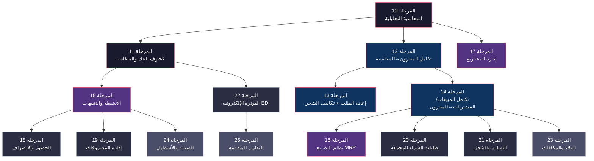

# إعادة بناء Odoo 19.0 — خطة الميزات المتقدمة (المراحل 10–25)

## السياق

تم إتمام **المراحل 0–9** بالكامل من [الخطة الأصلية](file:///home/osm/StudioProjects/cashflow_backend/docs/infrastructure_implementation_plan.md).
المشروع الحالي [cashflow_backend](file:///home/osm/StudioProjects/cashflow_backend) يحتوي على ~36,974 سطر Go ويغطي: البنية التحتية، الشركاء، المنتجات، المحاسبة الأساسية، المبيعات، المشتريات، المخزون، CRM، المدفوعات، الموارد البشرية.

**الهدف**: تنفيذ الميزات المتقدمة المُستخلصة من تحليل 632 موديول في Odoo 19.0.

---

## نظرة عامة على المراحل



---

## المرحلة 10: المحاسبة التحليلية (Analytic Accounting)

**الهدف**: بناء نظام تتبع التكاليف والإيرادات حسب الأبعاد (مشروع، قسم، حملة) — يتخلل كل العمليات المالية.

**مصدر Odoo**: `addons/analytic/models/`

**يعتمد على**: المرحلة 3 (المحاسبة الأساسية)

### Domain Entities

```go
// internal/domain/analytic/analytic.go
type AnalyticPlan struct {
    ID          int64
    Name        string
    ParentID    *int64
    DefaultApplicability string // optional, mandatory, unavailable
    Active      bool
    CreatedAt   time.Time
    UpdatedAt   time.Time
}

type AnalyticAccount struct {
    ID        int64
    Name      string
    Code      string
    PlanID    int64
    RootPlanID int64
    Active    bool
    Balance   decimal.Decimal // computed: sum of lines
    CreatedAt time.Time
    UpdatedAt time.Time
}

type AnalyticLine struct {
    ID            int64
    AccountID     int64
    Date          time.Time
    Amount        decimal.Decimal
    UnitAmount    decimal.Decimal
    PartnerID     *int64
    ProductID     *int64
    MoveLineID    *int64    // ربط بسطر القيد المحاسبي
    GeneralAccountID *int64 // الحساب المحاسبي العام
    Category      string   // invoice, vendor_bill, manual, employee
    CompanyID     int64
    CreatedAt     time.Time
}

type AnalyticDistribution struct {
    ID          int64
    AccountID   int64
    Percentage  decimal.Decimal // 0-100
    // polymorphic: يُستخدم في invoice lines, SO lines, PO lines, etc.
}
```

### API Endpoints

```
# Analytic Plans
POST   /api/v1/analytic-plans
GET    /api/v1/analytic-plans
GET    /api/v1/analytic-plans/{id}
PUT    /api/v1/analytic-plans/{id}
DELETE /api/v1/analytic-plans/{id}

# Analytic Accounts
POST   /api/v1/analytic-accounts
GET    /api/v1/analytic-accounts
GET    /api/v1/analytic-accounts/{id}
PUT    /api/v1/analytic-accounts/{id}
DELETE /api/v1/analytic-accounts/{id}
GET    /api/v1/analytic-accounts/{id}/balance   رصيد الحساب التحليلي

# Analytic Lines
POST   /api/v1/analytic-lines
GET    /api/v1/analytic-lines                   مع فلترة بالتاريخ/الحساب/الشريك
GET    /api/v1/analytic-lines/{id}
```

### بنية الملفات

```
internal/domain/analytic/
├── analytic.go          # Entities + validation
├── ports.go             # Repository interfaces
internal/usecase/analytic/
├── analytic_usecase.go  # Business logic
internal/adapters/http/analytic/
├── handler.go
├── dto.go
├── routes.go
internal/adapters/storage/analytic/
├── postgres_repo.go
├── memory_repo.go
migrations/
├── XXXXXX_create_analytic_tables.up.sql
├── XXXXXX_create_analytic_tables.down.sql
```

**تقدير الجهد**: ~3 أيام

---

## المرحلة 11: كشوف الحسابات البنكية والمطابقة (Bank Reconciliation)

**الهدف**: استيراد كشوف البنك ومطابقتها مع الفواتير والمدفوعات — يُكمل الدورة المحاسبية.

**مصدر Odoo**: `addons/account/models/account_bank_statement.py`, `account_bank_statement_line.py`, `account_reconcile_model.py`, `account_partial_reconcile.py`, `account_full_reconcile.py`

**يعتمد على**: المرحلة 3 (المحاسبة), المرحلة 8 (المدفوعات)

### Domain Entities

```go
// internal/domain/accounting/bank_statement.go
type BankStatement struct {
    ID              int64
    Name            string
    JournalID       int64
    Date            time.Time
    BalanceStart    decimal.Decimal
    BalanceEnd      decimal.Decimal
    BalanceEndReal  decimal.Decimal
    State           StatementState // open, confirmed
    Lines           []BankStatementLine
    CompanyID       int64
    CreatedAt       time.Time
    UpdatedAt       time.Time
}

type BankStatementLine struct {
    ID              int64
    StatementID     int64
    Date            time.Time
    Name            string       // وصف العملية
    Ref             string       // مرجع خارجي
    PartnerID       *int64
    Amount          decimal.Decimal
    AccountID       *int64
    IsReconciled    bool
    MoveID          *int64       // القيد المحاسبي المُطابق
    CreatedAt       time.Time
}

// internal/domain/accounting/reconcile.go
type ReconcileModel struct {
    ID            int64
    Name          string
    RuleType      string // writeoff_button, writeoff_suggestion, invoice_matching
    MatchLabel    string // contains, not_contains, match_regex
    MatchLabelParam string
    MatchPartner  bool
    MatchAmount   string // lower, greater, between
    Lines         []ReconcileModelLine
    Active        bool
}

type ReconcileModelLine struct {
    ID            int64
    ModelID       int64
    AccountID     int64
    AmountType    string // percentage, fixed, regex
    AmountString  string
    Label         string
    TaxIDs        []int64
}

type PartialReconcile struct {
    ID              int64
    DebitMoveLineID int64
    CreditMoveLineID int64
    Amount          decimal.Decimal
    CompanyID       int64
    CreatedAt       time.Time
}

type FullReconcile struct {
    ID                int64
    PartialReconcileIDs []int64
    ReconciledLines   []int64
    CreatedAt         time.Time
}

// internal/domain/accounting/cash_rounding.go
type CashRounding struct {
    ID              int64
    Name            string
    Rounding        decimal.Decimal // 0.05, 0.10, 1.00
    Strategy        string          // biggest_tax, add_invoice_line
    ProfitAccountID *int64
    LossAccountID   *int64
}
```

### API Endpoints

```
# Bank Statements
POST   /api/v1/bank-statements
GET    /api/v1/bank-statements
GET    /api/v1/bank-statements/{id}
PUT    /api/v1/bank-statements/{id}
POST   /api/v1/bank-statements/{id}/confirm
POST   /api/v1/bank-statements/import            استيراد من CSV/OFX

# Bank Statement Lines
GET    /api/v1/bank-statements/{id}/lines
POST   /api/v1/bank-statement-lines/{id}/reconcile    مطابقة يدوية
POST   /api/v1/bank-statement-lines/{id}/auto-reconcile  مطابقة تلقائية

# Reconcile Models (قواعد المطابقة)
CRUD   /api/v1/reconcile-models

# Cash Rounding
CRUD   /api/v1/cash-rounding
```

### بنية الملفات

```
internal/domain/accounting/
├── bank_statement.go       # NEW
├── reconcile.go            # NEW
├── cash_rounding.go        # NEW
internal/usecase/accounting/
├── bank_statement_usecase.go  # NEW
├── reconcile_usecase.go       # NEW
internal/adapters/http/accounting/
├── bank_statement_handler.go  # NEW
├── bank_statement_dto.go      # NEW
├── reconcile_handler.go       # NEW
internal/adapters/storage/accounting/
├── bank_statement_postgres.go # NEW
├── reconcile_postgres.go      # NEW
```

**تقدير الجهد**: ~4-5 أيام

---

## المرحلة 12: تكامل المخزون ↔ المحاسبة (Stock-Account Integration)

**الهدف**: إنشاء قيود محاسبية تلقائية عند كل حركة مخزون — أهم تكامل مفقود.

**مصدر Odoo**: `addons/stock_account/models/`

**يعتمد على**: المرحلة 3 (المحاسبة), المرحلة 6 (المخزون), المرحلة 10 (التحليلية)

### المنطق الأساسي

عند تأكيد عملية استلام أو تسليم (`StockPicking.Validate()`):
1. لكل `StockMove` في العملية
2. احسب قيمة البضاعة (الكمية × تكلفة الوحدة)
3. أنشئ قيد محاسبي (`AccountMove`) تلقائي:

| العملية | مدين | دائن |
|---------|------|------|
| استلام بضاعة | المخزون (أصل) | بضاعة بالطريق |
| تسليم بضاعة | تكلفة البضاعة المباعة (مصروف) | المخزون (أصل) |
| نقل داخلي | مخزون الوجهة | مخزون المصدر |

### Domain Entities

```go
// internal/domain/stock/valuation.go
type StockValuation struct {
    ID             int64
    ProductID      int64
    MoveID         int64       // StockMove
    AccountMoveID  *int64      // القيد المحاسبي
    Quantity       decimal.Decimal
    UnitCost       decimal.Decimal
    Value          decimal.Decimal
    Type           string      // in, out, internal
    CreatedAt      time.Time
}

// إضافات على الكيانات الموجودة:
// - ProductTemplate: إضافة AccountIDs (stock_input, stock_output, stock_valuation)
// - StockLocation: إضافة ValuationAccountID
// - StockMove: إضافة AccountMoveID (ربط بالقيد المحاسبي)
```

### API Endpoints

```
GET    /api/v1/stock/valuations                     تقييم المخزون
GET    /api/v1/stock/valuations/by-product/{id}     تقييم منتج محدد
GET    /api/v1/products/{id}/stock-value            القيمة الإجمالية للمخزون
```

### بنية الملفات

```
internal/domain/stock/
├── valuation.go            # NEW
internal/usecase/stock/
├── valuation_usecase.go    # NEW — يُنشئ القيود المحاسبية
internal/adapters/storage/stock/
├── valuation_postgres.go   # NEW
```

> [!IMPORTANT]
> هذه المرحلة تتطلب تعديل `stock_usecase.go` الحالي لاستدعاء `valuation_usecase` عند تأكيد عملية Picking.

**تقدير الجهد**: ~4 أيام

---

## المرحلة 13: إعادة الطلب التلقائي + تكاليف الشحن الموزعة

**الهدف**: أتمتة إدارة المخزون — إعادة طلب تلقائية عند انخفاض الكميات + توزيع تكاليف الشحن.

**مصدر Odoo**: `addons/stock/models/stock_orderpoint.py`, `addons/stock_landed_costs/`

**يعتمد على**: المرحلة 6 (المخزون), المرحلة 12 (تكامل المخزون↔المحاسبة)

### Domain Entities

```go
// internal/domain/stock/orderpoint.go
type Orderpoint struct {
    ID            int64
    Name          string
    ProductID     int64
    WarehouseID   int64
    LocationID    int64
    MinQty        decimal.Decimal  // الحد الأدنى — يُطلق إعادة الطلب
    MaxQty        decimal.Decimal  // الحد الأقصى — الكمية المطلوبة
    QtyMultiple   decimal.Decimal  // مضاعف الطلب (مثل: طلب بمضاعفات 12)
    LeadDays      int              // أيام التوريد
    Trigger       OrderpointTrigger // auto, manual
    Active        bool
    SnoozedUntil  *time.Time       // تأجيل مؤقت
    CompanyID     int64
    CreatedAt     time.Time
    UpdatedAt     time.Time
}

type OrderpointTrigger string
const (
    OrderpointTriggerAuto   OrderpointTrigger = "auto"
    OrderpointTriggerManual OrderpointTrigger = "manual"
)

// internal/domain/stock/landed_cost.go
type LandedCost struct {
    ID            int64
    Name          string
    Date          time.Time
    State         LandedCostState // draft, done, cancel
    PickingIDs    []int64         // عمليات الاستلام المستهدفة
    CostLines     []LandedCostLine
    ValuationAdj  []ValuationAdjustment // التعديلات المحسوبة
    AccountMoveID *int64          // القيد المحاسبي
    CompanyID     int64
    CreatedAt     time.Time
    UpdatedAt     time.Time
}

type LandedCostLine struct {
    ID            int64
    LandedCostID  int64
    Name          string
    ProductID     int64         // منتج التكلفة (شحن، جمارك، تأمين)
    AccountID     int64
    Amount        decimal.Decimal
    SplitMethod   SplitMethod   // equal, by_quantity, by_current_cost_price, by_weight, by_volume
}

type SplitMethod string
const (
    SplitEqual       SplitMethod = "equal"
    SplitByQuantity  SplitMethod = "by_quantity"
    SplitByCost      SplitMethod = "by_current_cost_price"
    SplitByWeight    SplitMethod = "by_weight"
    SplitByVolume    SplitMethod = "by_volume"
)

type ValuationAdjustment struct {
    ID            int64
    LandedCostID  int64
    CostLineID    int64
    MoveID        int64         // StockMove
    ProductID     int64
    OriginalCost  decimal.Decimal
    AdditionalCost decimal.Decimal
    FinalCost     decimal.Decimal
}
```

### API Endpoints

```
# Reorder Rules
CRUD   /api/v1/reorder-rules
POST   /api/v1/reorder-rules/run              تشغيل فحص يدوي
GET    /api/v1/reorder-rules/suggestions       اقتراحات إعادة الطلب

# Landed Costs
CRUD   /api/v1/landed-costs
POST   /api/v1/landed-costs/{id}/compute       حساب التوزيع
POST   /api/v1/landed-costs/{id}/validate      تأكيد وإنشاء القيد
```

### Background Worker

```go
// إضافة في internal/infrastructure/worker/
// Cron job يعمل يومياً:
// 1. يفحص جميع Orderpoints النشطة
// 2. يقارن المخزون الحالي بالحد الأدنى
// 3. يُنشئ أوامر شراء تلقائياً إذا لزم الأمر
```

**تقدير الجهد**: ~4-5 أيام

---

## المرحلة 14: تكامل المبيعات/المشتريات ↔ المخزون

**الهدف**: عند تأكيد أمر بيع → إنشاء عملية تسليم تلقائياً. عند تأكيد أمر شراء → إنشاء عملية استلام تلقائياً.

**مصدر Odoo**: `addons/sale_stock/`, `addons/purchase_stock/`

**يعتمد على**: المرحلة 4 (المبيعات), المرحلة 5 (المشتريات), المرحلة 6 (المخزون), المرحلة 12

### المنطق الأساسي

```
تأكيد Sale Order
  └─→ إنشاء StockPicking (outgoing) تلقائي
       └─→ لكل SaleOrderLine → إنشاء StockMove
            └─→ عند Validate → إنشاء AccountMove (عبر المرحلة 12)

تأكيد Purchase Order
  └─→ إنشاء StockPicking (incoming) تلقائي
       └─→ لكل PurchaseOrderLine → إنشاء StockMove
            └─→ عند Validate → إنشاء AccountMove
```

### التعديلات المطلوبة

```go
// تعديل internal/domain/sale/order.go
type SaleOrder struct {
    // ... الحقول الحالية ...
    PickingIDs    []int64    // NEW: عمليات التسليم المرتبطة
    DeliveryState string     // NEW: nothing, partial, full
}

type SaleOrderLine struct {
    // ... الحقول الحالية ...
    QtyDelivered  decimal.Decimal // NEW: الكمية المُسلّمة فعلاً
    RouteID       *int64          // NEW: مسار التوريد
}

// تعديل internal/domain/purchase/order.go
type PurchaseOrder struct {
    // ... الحقول الحالية ...
    PickingIDs    []int64    // NEW: عمليات الاستلام المرتبطة
    ReceiptState  string     // NEW: nothing, partial, full
}

type PurchaseOrderLine struct {
    // ... الحقول الحالية ...
    QtyReceived   decimal.Decimal // NEW: الكمية المُستلمة فعلاً
}
```

### API Endpoints

```
# لا endpoints جديدة — التكامل يحدث تلقائياً عند:
POST   /api/v1/sale-orders/{id}/confirm      → يُنشئ Delivery Order
POST   /api/v1/purchase-orders/{id}/confirm  → يُنشئ Receipt

# endpoints مُحسّنة:
GET    /api/v1/sale-orders/{id}/deliveries    عمليات التسليم المرتبطة
GET    /api/v1/purchase-orders/{id}/receipts  عمليات الاستلام المرتبطة
```

### بنية الملفات

```
internal/usecase/sale/
├── sale_stock_usecase.go      # NEW — تكامل المبيعات↔المخزون
internal/usecase/purchase/
├── purchase_stock_usecase.go  # NEW — تكامل المشتريات↔المخزون
```

**تقدير الجهد**: ~4 أيام

---

## المرحلة 15: نظام الأنشطة والتنبيهات (Activities & Notifications)

**الهدف**: بناء نظام أنشطة polymorphic مرتبط بأي كيان — مهام، مكالمات، اجتماعات، متابعات.

**مصدر Odoo**: `addons/mail/models/mail_activity.py`, `mail_activity_type.py`, `mail_activity_mixin.py`

**يعتمد على**: المرحلة 0 (البنية التحتية), المرحلة 1 (الشركاء)

### Domain Entities

```go
// internal/domain/activity/activity.go
type ActivityType struct {
    ID            int64
    Name          string
    Summary       string
    ResModel      string      // "" = all models
    Category      string      // default, meeting, call, upload_file
    DelayCount    int          // عدد الأيام الافتراضية
    DelayUnit     string       // days, weeks, months
    Icon          string
    Active        bool
}

type Activity struct {
    ID             int64
    TypeID         int64
    Summary        string
    Note           string
    DateDeadline   time.Time
    UserID         int64        // المسؤول عن التنفيذ
    RequestPartnerID *int64     // من طلب النشاط
    ResModel       string       // "partner", "sale_order", "invoice", etc.
    ResID          int64        // ID الكيان المرتبط
    State          ActivityState // overdue, today, planned
    Done           bool
    DoneDate       *time.Time
    Feedback       string       // ملاحظات عند الإنجاز
    CreatedAt      time.Time
    CreatedBy      int64
}

type ActivityState string
const (
    ActivityOverdue ActivityState = "overdue"
    ActivityToday   ActivityState = "today"
    ActivityPlanned ActivityState = "planned"
)
```

### API Endpoints

```
# Activity Types
CRUD   /api/v1/activity-types

# Activities
POST   /api/v1/activities
GET    /api/v1/activities                         كل الأنشطة (مع فلترة)
GET    /api/v1/activities/my                       أنشطتي
GET    /api/v1/activities/overdue                   المتأخرة
GET    /api/v1/activities/{id}
PUT    /api/v1/activities/{id}
POST   /api/v1/activities/{id}/done                إنجاز النشاط
DELETE /api/v1/activities/{id}

# Polymorphic: أنشطة مرتبطة بأي كيان
GET    /api/v1/{model}/{id}/activities             أنشطة كيان محدد
POST   /api/v1/{model}/{id}/activities             إنشاء نشاط لكيان
```

### بنية الملفات

```
internal/domain/activity/
├── activity.go
├── ports.go
internal/usecase/activity/
├── activity_usecase.go
internal/adapters/http/activity/
├── handler.go
├── dto.go
├── routes.go
internal/adapters/storage/activity/
├── postgres_repo.go
├── memory_repo.go
```

**تقدير الجهد**: ~3 أيام

---

## المرحلة 16: نظام التصنيع (Manufacturing — MRP)

**الهدف**: بناء نظام تصنيع كامل — قوائم مواد، أوامر تصنيع، مراكز عمل.

**مصدر Odoo**: `addons/mrp/models/`

**يعتمد على**: المرحلة 2 (المنتجات), المرحلة 6 (المخزون), المرحلة 14 (تكامل المخزون)

### Domain Entities

```go
// internal/domain/manufacturing/bom.go
type BillOfMaterials struct {
    ID              int64
    Code            string
    ProductID       int64
    ProductQty      decimal.Decimal
    UoMID           int64
    Type            BomType           // normal, phantom (kit)
    Lines           []BomLine
    Operations      []RoutingOperation
    ReadyToProduce  string            // all_available, asap
    Consumption     string            // flexible, warning, strict
    Active          bool
    CompanyID       int64
    CreatedAt       time.Time
    UpdatedAt       time.Time
}

type BomLine struct {
    ID          int64
    BomID       int64
    ProductID   int64
    Quantity    decimal.Decimal
    UoMID       int64
    OperationID *int64  // مرحلة التصنيع التي تستهلك فيها
}

// internal/domain/manufacturing/workcenter.go
type Workcenter struct {
    ID            int64
    Name          string
    Code          string
    CostPerHour   decimal.Decimal
    TimeStart     float64  // وقت الإعداد (دقائق)
    TimeStop      float64  // وقت التنظيف
    Capacity      float64  // السعة
    Active        bool
}

type RoutingOperation struct {
    ID            int64
    BomID         int64
    WorkcenterID  int64
    Name          string
    Sequence      int
    TimeMode      string  // manual, computed
    TimeCycleManual float64
}

// internal/domain/manufacturing/production.go
type ProductionOrder struct {
    ID              int64
    Name            string            // "MO/2026/0001"
    ProductID       int64
    BomID           int64
    ProductQty      decimal.Decimal
    QtyProduced     decimal.Decimal
    UoMID           int64
    State           ProductionState
    DatePlannedStart time.Time
    DatePlannedEnd   time.Time
    DateStart        *time.Time
    DateDone         *time.Time
    Priority         string           // 0, 1 (urgent)
    SourceDocument   string           // SO reference
    MoveRawIDs       []int64          // StockMoves للمواد الخام
    MoveFinishedIDs  []int64          // StockMoves للمنتج النهائي
    Workorders       []Workorder
    CompanyID        int64
    CreatedAt        time.Time
    UpdatedAt        time.Time
}

type ProductionState string
const (
    ProductionDraft     ProductionState = "draft"
    ProductionConfirmed ProductionState = "confirmed"
    ProductionProgress  ProductionState = "progress"
    ProductionDone      ProductionState = "done"
    ProductionCancel    ProductionState = "cancel"
)

type Workorder struct {
    ID              int64
    ProductionID    int64
    WorkcenterID    int64
    OperationID     int64
    Name            string
    Sequence        int
    State           WorkorderState   // blocked, ready, progress, done, cancel
    DurationExpected float64
    Duration         float64
    DateStart        *time.Time
    DateDone         *time.Time
}

// internal/domain/manufacturing/unbuild.go
type UnbuildOrder struct {
    ID          int64
    ProductID   int64
    BomID       int64
    Quantity    decimal.Decimal
    LocationID  int64
    LotID       *int64
    CompanyID   int64
    CreatedAt   time.Time
}
```

### API Endpoints

```
# Bill of Materials
CRUD   /api/v1/boms
GET    /api/v1/boms/{id}/structure              هيكل BOM (شجرة المواد)
GET    /api/v1/boms/{id}/cost                   تكلفة التصنيع المحسوبة

# Workcenters
CRUD   /api/v1/workcenters

# Production Orders
CRUD   /api/v1/production-orders
POST   /api/v1/production-orders/{id}/confirm    تأكيد أمر التصنيع
POST   /api/v1/production-orders/{id}/start      بدء التصنيع
POST   /api/v1/production-orders/{id}/produce    تسجيل إنتاج (جزئي/كامل)
POST   /api/v1/production-orders/{id}/done       إنهاء
POST   /api/v1/production-orders/{id}/cancel     إلغاء

# Workorders
GET    /api/v1/production-orders/{id}/workorders
POST   /api/v1/workorders/{id}/start
POST   /api/v1/workorders/{id}/done

# Unbuild
POST   /api/v1/unbuild-orders                    تفكيك منتج
```

### بنية الملفات

```
internal/domain/manufacturing/
├── bom.go
├── workcenter.go
├── production.go
├── unbuild.go
├── ports.go
internal/usecase/manufacturing/
├── bom_usecase.go
├── production_usecase.go
internal/adapters/http/manufacturing/
├── handler.go
├── dto.go
├── routes.go
internal/adapters/storage/manufacturing/
├── postgres_repo.go
├── memory_repo.go
```

**تقدير الجهد**: ~7 أيام

---

## المرحلة 17: إدارة المشاريع (Project Management)

**الهدف**: بناء نظام إدارة مشاريع ومهام مع مراحل Kanban وتبعيات ومعالم.

**مصدر Odoo**: `addons/project/models/`

**يعتمد على**: المرحلة 1 (الشركاء), المرحلة 10 (المحاسبة التحليلية)

### Domain Entities

```go
// internal/domain/project/project.go
type Project struct {
    ID                int64
    Name              string
    Description       string
    PartnerID         *int64
    ManagerID         *int64
    StageID           int64
    DateStart         *time.Time
    DateEnd           *time.Time
    Active            bool
    AllowMilestones   bool
    AllowSubtasks     bool
    AllowDependencies bool
    AnalyticAccountID *int64
    CompanyID         int64
    CreatedAt         time.Time
    UpdatedAt         time.Time
}

type ProjectStage struct {
    ID       int64
    Name     string
    Sequence int
    Fold     bool  // مطوي في Kanban
}

// internal/domain/project/task.go
type Task struct {
    ID            int64
    Name          string
    ProjectID     int64
    StageID       int64
    AssigneeIDs   []int64
    ParentID      *int64           // subtask
    DependOnIDs   []int64          // task dependencies
    Priority      TaskPriority     // normal, urgent
    DateDeadline  *time.Time
    DateAssign    *time.Time
    State         TaskState
    Description   string
    MilestoneID   *int64
    Tags          []int64
    Sequence      int
    EstimatedHours float64
    ActualHours    float64
    CompanyID     int64
    CreatedAt     time.Time
    UpdatedAt     time.Time
}

type TaskState string
const (
    TaskInProgress       TaskState = "in_progress"
    TaskChangesRequested TaskState = "changes_requested"
    TaskApproved         TaskState = "approved"
    TaskDone             TaskState = "done"
    TaskCancelled        TaskState = "cancelled"
)

// internal/domain/project/milestone.go
type Milestone struct {
    ID          int64
    Name        string
    ProjectID   int64
    DateDeadline *time.Time
    IsReached   bool
    ReachedDate *time.Time
    Sequence    int
}

type TaskTag struct {
    ID    int64
    Name  string
    Color string
}
```

### API Endpoints

```
# Projects
CRUD   /api/v1/projects
CRUD   /api/v1/project-stages

# Tasks
CRUD   /api/v1/tasks
GET    /api/v1/projects/{id}/tasks               مهام مشروع محدد
GET    /api/v1/projects/{id}/tasks/kanban         مهام مجمعة بالمرحلة
PUT    /api/v1/tasks/{id}/stage                   نقل مهمة لمرحلة أخرى
PUT    /api/v1/tasks/{id}/assign                  تعيين مسؤول
GET    /api/v1/tasks/{id}/subtasks
GET    /api/v1/tasks/my                           مهامي

# Milestones
CRUD   /api/v1/projects/{id}/milestones
POST   /api/v1/milestones/{id}/reach              تحقيق المعلم

# Tags
CRUD   /api/v1/task-tags
```

**تقدير الجهد**: ~4-5 أيام

---

## المرحلة 18: الحضور والانصراف (HR Attendance) ✅

**الهدف**: تسجيل حضور وانصراف الموظفين مع حساب ساعات العمل والأعمال الإضافية.

**مصدر Odoo**: `addons/hr_attendance/models/`

**يعتمد على**: المرحلة 9 (الموارد البشرية), المرحلة 15 (الأنشطة)

### Domain Entities

```go
// internal/domain/hr/attendance.go
type Attendance struct {
    ID           int64
    EmployeeID   int64
    CheckIn      time.Time
    CheckOut     *time.Time
    WorkedHours  float64    // computed: CheckOut - CheckIn
    OvertimeHours float64   // computed: based on rules
    CompanyID    int64
    CreatedAt    time.Time
}

type OvertimeRuleset struct {
    ID           int64
    Name         string
    CompanyID    int64
    Rules        []OvertimeRule
    Active       bool
}

type OvertimeRule struct {
    ID              int64
    RulesetID       int64
    DayOfWeek       *int            // 0=Mon, nil=all
    DailyThreshold  float64         // ساعات العمل اليومية
    WeeklyThreshold float64
    Multiplier      float64         // مضاعف الأجر (1.5x, 2x)
}
```

### API Endpoints

```
POST   /api/v1/attendance/check-in                 تسجيل حضور
POST   /api/v1/attendance/check-out                 تسجيل انصراف
GET    /api/v1/attendance                           سجل الحضور (مع فلترة)
GET    /api/v1/attendance/today                     حضور اليوم
GET    /api/v1/employees/{id}/attendance            سجل موظف
GET    /api/v1/employees/{id}/overtime              ساعات العمل الإضافي
CRUD   /api/v1/overtime-rulesets
```

**تقدير الجهد**: ~3 أيام

---

## المرحلة 19: إدارة المصروفات (Expenses)

**الهدف**: تسجيل مصروفات الموظفين واعتمادها وصرفها — مع ربط محاسبي وتحليلي.

**مصدر Odoo**: `addons/hr_expense/models/`

**يعتمد على**: المرحلة 3 (المحاسبة), المرحلة 9 (HR), المرحلة 10 (التحليلية), المرحلة 15 (الأنشطة)

### Domain Entities

```go
// internal/domain/expense/expense.go
type ExpenseReport struct {
    ID              int64
    Name            string
    EmployeeID      int64
    ManagerID       *int64
    State           ExpenseState     // draft, reported, approved, done, refused
    PaymentMode     string           // own_account, company_account
    TotalAmount     decimal.Decimal  // computed
    TotalTax        decimal.Decimal  // computed
    Lines           []ExpenseLine
    AccountMoveID   *int64           // القيد المحاسبي بعد الاعتماد
    CompanyID       int64
    CreatedAt       time.Time
    UpdatedAt       time.Time
}

type ExpenseState string
const (
    ExpenseDraft    ExpenseState = "draft"
    ExpenseReported ExpenseState = "reported"
    ExpenseApproved ExpenseState = "approved"
    ExpenseDone     ExpenseState = "done"
    ExpenseRefused  ExpenseState = "refused"
)

type ExpenseLine struct {
    ID                int64
    ReportID          int64
    Name              string
    ProductID         *int64
    UnitAmount        decimal.Decimal
    Quantity          decimal.Decimal
    TotalAmount       decimal.Decimal
    TaxIDs            []int64
    Date              time.Time
    AccountID         *int64
    AnalyticAccountID *int64
    Description       string
    AttachmentIDs     []int64
}
```

### API Endpoints

```
# Expense Reports
CRUD   /api/v1/expense-reports
POST   /api/v1/expense-reports/{id}/submit         تقديم للمدير
POST   /api/v1/expense-reports/{id}/approve         اعتماد
POST   /api/v1/expense-reports/{id}/refuse          رفض
POST   /api/v1/expense-reports/{id}/post            ترحيل (إنشاء قيد محاسبي)
GET    /api/v1/expense-reports/to-approve            بانتظار الاعتماد

# Expense Lines
POST   /api/v1/expense-lines
PUT    /api/v1/expense-lines/{id}
DELETE /api/v1/expense-lines/{id}
```

**تقدير الجهد**: ~3-4 أيام

---

## المرحلة 20: طلبات الشراء المجمعة (Purchase Requisitions)

**الهدف**: اتفاقيات شراء إطارية وقوالب شراء متكررة — لإدارة العلاقة طويلة المدى مع الموردين.

**مصدر Odoo**: `addons/purchase_requisition/models/`

**يعتمد على**: المرحلة 5 (المشتريات), المرحلة 14 (تكامل المشتريات↔المخزون)

### Domain Entities

```go
// internal/domain/purchase/requisition.go
type PurchaseRequisition struct {
    ID              int64
    Name            string
    Type            RequisitionType  // blanket_order, purchase_template
    VendorID        *int64
    UserID          int64            // مسؤول المشتريات
    DateStart       *time.Time
    DateEnd         *time.Time
    State           RequisitionState // draft, confirmed, done, cancel
    CurrencyID      int64
    Lines           []PurchaseRequisitionLine
    PurchaseOrderIDs []int64          // أوامر الشراء المُنشأة
    Description     string
    CompanyID       int64
    CreatedAt       time.Time
    UpdatedAt       time.Time
}

type RequisitionType string
const (
    RequisitionBlanket  RequisitionType = "blanket_order"
    RequisitionTemplate RequisitionType = "purchase_template"
)

type PurchaseRequisitionLine struct {
    ID              int64
    RequisitionID   int64
    ProductID       int64
    Quantity        decimal.Decimal
    UoMID           int64
    PriceUnit       decimal.Decimal
    ScheduleDate    *time.Time
}
```

### API Endpoints

```
CRUD   /api/v1/purchase-requisitions
POST   /api/v1/purchase-requisitions/{id}/confirm
POST   /api/v1/purchase-requisitions/{id}/close
POST   /api/v1/purchase-requisitions/{id}/cancel
POST   /api/v1/purchase-requisitions/{id}/create-po   إنشاء أمر شراء من الاتفاقية
```

**تقدير الجهد**: ~2-3 أيام

---

## المرحلة 21: التسليم والشحن (Delivery Carriers)

**الهدف**: إدارة شركات الشحن وحساب تكاليف التوصيل تلقائياً.

**مصدر Odoo**: `addons/delivery/models/`

**يعتمد على**: المرحلة 4 (المبيعات), المرحلة 6 (المخزون), المرحلة 14 (التكامل)

### Domain Entities

```go
// internal/domain/delivery/carrier.go
type DeliveryCarrier struct {
    ID              int64
    Name            string
    CarrierType     string          // fixed, based_on_rules
    DeliveryType    string          // own, external
    FixedPrice      decimal.Decimal
    FreeOverAmount  *decimal.Decimal // شحن مجاني فوق هذا المبلغ
    Rules           []DeliveryPriceRule
    ProductID       int64            // منتج الشحن في الفاتورة
    Active          bool
    CompanyID       int64
    CreatedAt       time.Time
    UpdatedAt       time.Time
}

type DeliveryPriceRule struct {
    ID          int64
    CarrierID   int64
    Variable    string          // weight, volume, quantity, price
    Operator    string          // <=, >=, ==
    MaxValue    decimal.Decimal
    Price       decimal.Decimal
    Sequence    int
}

type DeliveryZipPrefix struct {
    ID          int64
    CarrierID   int64
    ZipFrom     string
    ZipTo       string
    Price       decimal.Decimal
}
```

### API Endpoints

```
CRUD   /api/v1/delivery-carriers
POST   /api/v1/delivery-carriers/{id}/rate        حساب تكلفة الشحن لطلب
GET    /api/v1/sale-orders/{id}/shipping-rates     خيارات الشحن المتاحة
POST   /api/v1/sale-orders/{id}/add-shipping       إضافة تكلفة الشحن للطلب
```

**تقدير الجهد**: ~2-3 أيام

---

## المرحلة 22: الفوترة الإلكترونية (EDI)

**الهدف**: إرسال واستقبال الفواتير إلكترونياً بتنسيقات معيارية (UBL/ZATCA).

**مصدر Odoo**: `addons/account_edi/`, `addons/account_edi_ubl_cii/`

**يعتمد على**: المرحلة 3 (المحاسبة), المرحلة 11 (كشوف البنك)

### Domain Entities

```go
// internal/domain/accounting/edi.go
type EDIFormat struct {
    ID       int64
    Name     string
    Code     string     // "ubl_2_1", "zatca", "peppol"
    Active   bool
}

type EDIDocument struct {
    ID          int64
    MoveID      int64           // الفاتورة
    FormatID    int64
    State       EDIState        // to_send, sent, to_cancel, cancelled, error
    XMLContent  string          // محتوى XML
    ErrorMsg    string
    SentAt      *time.Time
    CreatedAt   time.Time
}

type EDIState string
const (
    EDIToSend    EDIState = "to_send"
    EDISent      EDIState = "sent"
    EDIToCancel  EDIState = "to_cancel"
    EDICancelled EDIState = "cancelled"
    EDIError     EDIState = "error"
)
```

### API Endpoints

```
CRUD   /api/v1/edi-formats
POST   /api/v1/invoices/{id}/edi/send              إرسال فاتورة إلكترونياً
GET    /api/v1/invoices/{id}/edi/status             حالة الإرسال
GET    /api/v1/invoices/{id}/edi/xml                تحميل XML
POST   /api/v1/edi/receive                          استقبال فاتورة إلكترونية
```

**تقدير الجهد**: ~4-5 أيام

---

## المرحلة 23: الولاء والمكافآت (Loyalty & Rewards)

**الهدف**: برامج ولاء العملاء مع قواعد كسب النقاط ومكافآت متنوعة.

**مصدر Odoo**: `addons/loyalty/models/`

**يعتمد على**: المرحلة 1 (الشركاء), المرحلة 2 (المنتجات), المرحلة 4 (المبيعات), المرحلة 14

### Domain Entities

```go
// internal/domain/loyalty/loyalty.go
type LoyaltyProgram struct {
    ID            int64
    Name          string
    ProgramType   string   // loyalty, promotion, gift_card, discount, promo_code
    CurrencyID    int64
    Rules         []LoyaltyRule
    Rewards       []LoyaltyReward
    Active        bool
    DateFrom      *time.Time
    DateTo        *time.Time
    CompanyID     int64
}

type LoyaltyRule struct {
    ID            int64
    ProgramID     int64
    MinimumQty    decimal.Decimal
    MinimumAmount decimal.Decimal
    ProductIDs    []int64     // منتجات مؤهلة
    CategoryIDs   []int64     // فئات مؤهلة
    RewardPoints  decimal.Decimal
    Mode          string      // auto, with_code
    Code          string
}

type LoyaltyReward struct {
    ID            int64
    ProgramID     int64
    RewardType    string       // discount, product, free_shipping
    DiscountMode  string       // percent, per_point, per_order
    Discount      decimal.Decimal
    DiscountMaxAmount *decimal.Decimal
    ProductID     *int64
    RequiredPoints decimal.Decimal
}

type LoyaltyCard struct {
    ID          int64
    ProgramID   int64
    PartnerID   int64
    Code        string
    Points      decimal.Decimal
    ExpireDate  *time.Time
}
```

### API Endpoints

```
CRUD   /api/v1/loyalty-programs
CRUD   /api/v1/loyalty-programs/{id}/rules
CRUD   /api/v1/loyalty-programs/{id}/rewards
GET    /api/v1/partners/{id}/loyalty-cards           بطاقات العميل
POST   /api/v1/loyalty/earn                          كسب نقاط
POST   /api/v1/loyalty/redeem                        استبدال نقاط
GET    /api/v1/loyalty/check/{code}                  التحقق من كود خصم
```

**تقدير الجهد**: ~3-4 أيام

---

## المرحلة 24: الصيانة وإدارة الأسطول (Maintenance & Fleet)

**الهدف**: إدارة المعدات وطلبات الصيانة + إدارة المركبات والعقود.

**مصدر Odoo**: `addons/maintenance/`, `addons/fleet/`

**يعتمد على**: المرحلة 9 (HR), المرحلة 15 (الأنشطة)

### Domain Entities

```go
// internal/domain/maintenance/maintenance.go
type Equipment struct {
    ID              int64
    Name            string
    CategoryID      int64
    TechnicianID    *int64
    OwnerID         *int64
    Department      string
    Location        string
    SerialNumber    string
    Model           string
    WarrantyDate    *time.Time
    NextServiceDate *time.Time
    CostCenter      *int64
    Active          bool
    CompanyID       int64
}

type EquipmentCategory struct {
    ID     int64
    Name   string
    Color  string
}

type MaintenanceRequest struct {
    ID              int64
    Name            string
    EquipmentID     int64
    RequestDate     time.Time
    CloseDate       *time.Time
    TechnicianID    *int64
    OwnerID         *int64
    MaintenanceType string       // corrective, preventive
    Priority        string       // 0, 1, 2, 3
    Stage           RequestStage // new, in_progress, repaired, scrap
    Duration        float64
    Description     string
    CompanyID       int64
}

// internal/domain/fleet/fleet.go
type Vehicle struct {
    ID              int64
    Name            string      // computed: brand + model + plate
    LicensePlate    string
    ModelID         int64
    DriverID        *int64
    FuelType        string      // gasoline, diesel, electric, hybrid
    AcquisitionDate *time.Time
    Odometer        float64
    State           string      // new_request, active, inactive
    CompanyID       int64
}

type VehicleModel struct {
    ID       int64
    BrandID  int64
    Name     string
}

type VehicleBrand struct {
    ID   int64
    Name string
}

type VehicleLogService struct {
    ID         int64
    VehicleID  int64
    ServiceType string
    Date       time.Time
    Amount     decimal.Decimal
    VendorID   *int64
    Notes      string
}

type VehicleContract struct {
    ID             int64
    VehicleID      int64
    Type           string          // leasing, insurance, maintenance
    StartDate      time.Time
    ExpirationDate time.Time
    Amount         decimal.Decimal
    InsuranceCompanyID *int64
    Active         bool
}

type VehicleOdometer struct {
    ID        int64
    VehicleID int64
    Date      time.Time
    Value     float64
    Unit      string  // km, miles
}
```

### API Endpoints

```
# Maintenance
CRUD   /api/v1/equipment
CRUD   /api/v1/equipment-categories
CRUD   /api/v1/maintenance-requests
POST   /api/v1/maintenance-requests/{id}/start
POST   /api/v1/maintenance-requests/{id}/close
GET    /api/v1/maintenance-requests/dashboard        إحصائيات

# Fleet
CRUD   /api/v1/vehicles
CRUD   /api/v1/vehicle-models
CRUD   /api/v1/vehicle-brands
CRUD   /api/v1/vehicles/{id}/services
CRUD   /api/v1/vehicles/{id}/contracts
POST   /api/v1/vehicles/{id}/odometer
GET    /api/v1/vehicles/{id}/cost-report             تقرير التكاليف
```

**تقدير الجهد**: ~4-5 أيام

---

## المرحلة 25: التقارير المتقدمة ولوحات المعلومات (Advanced Reports & Dashboards)

**الهدف**: تقارير مالية مفصّلة + تقارير مخزون + لوحات KPI لجميع الأنظمة.

**مصدر Odoo**: `addons/account/models/account_report.py`, `addons/board/`, `addons/digest/`

**يعتمد على**: جميع المراحل السابقة

### التقارير المالية

```
GET /api/v1/reports/general-ledger            دفتر الأستاذ العام
GET /api/v1/reports/partner-ledger            دفتر أستاذ الشركاء
GET /api/v1/reports/aged-receivable           تقادم المستحقات (مفصّل)
GET /api/v1/reports/aged-payable              تقادم الذمم الدائنة
GET /api/v1/reports/tax-report                تقرير الضرائب
GET /api/v1/reports/cash-flow-statement       قائمة التدفقات النقدية
GET /api/v1/reports/trial-balance/detailed    ميزان مراجعة مفصّل
```

### تقارير المخزون

```
GET /api/v1/reports/stock-valuation           تقرير تقييم المخزون
GET /api/v1/reports/stock-aging               تقادم المخزون
GET /api/v1/reports/stock-movement            حركة المخزون بالفترة
GET /api/v1/reports/stock-forecast            توقعات المخزون
```

### تقارير المبيعات والمشتريات

```
GET /api/v1/reports/sales-analysis            تحليل المبيعات (منتج/شريك/فترة)
GET /api/v1/reports/purchase-analysis         تحليل المشتريات
GET /api/v1/reports/margin-analysis           تحليل هوامش الربح
```

### لوحات KPIs

```
GET /api/v1/dashboard/overview                لوحة عامة
GET /api/v1/dashboard/accounting              KPIs محاسبية
GET /api/v1/dashboard/sales                   KPIs مبيعات
GET /api/v1/dashboard/inventory               KPIs مخزون
GET /api/v1/dashboard/hr                      KPIs موارد بشرية
```

### Domain Entity

```go
// internal/domain/report/report.go
type ReportConfig struct {
    DateFrom     *time.Time
    DateTo       *time.Time
    CompanyID    *int64
    JournalIDs   []int64
    AccountIDs   []int64
    PartnerIDs   []int64
    ProductIDs   []int64
    GroupBy       []string  // date, partner, product, account
    Comparison    bool      // مقارنة بفترة سابقة
}

type DashboardKPI struct {
    Key         string
    Label       string
    Value       interface{}
    Change      float64       // % change vs previous period
    Trend       string        // up, down, stable
    Unit        string        // currency, percentage, count
}
```

**تقدير الجهد**: ~5-6 أيام

---

## ملخص المراحل والتبعيات

| المرحلة | النظام | يعتمد على | الجهد | الأولوية | الحالة |
|---------|--------|-----------|-------|----------|--------|
| **10** | المحاسبة التحليلية | M3 | 3 أيام | 🔴 حرج | ✅ |
| **11** | كشوف البنك والمطابقة | M3, M8 | 4-5 أيام | 🔴 حرج | ⬜ |
| **12** | تكامل المخزون↔المحاسبة | M3, M6, M10 | 4 أيام | 🔴 حرج | ✅ |
| **13** | إعادة الطلب + تكاليف الشحن | M6, M12 | 4-5 أيام | 🔴 حرج | ⬜ |
| **14** | تكامل المبيعات/المشتريات↔المخزون | M4, M5, M6, M12 | 4 أيام | 🔴 حرج | ⬜ |
| **15** | الأنشطة والتنبيهات | M0, M1 | 3 أيام | 🟡 مهم | ⬜ |
| **16** | التصنيع MRP | M2, M6, M14 | 7 أيام | 🟡 مهم | ✅ |
| **17** | إدارة المشاريع | M1, M10 | 4-5 أيام | 🟡 مهم | ⬜ |
| **18** | الحضور والانصراف | M9, M15 | 3 أيام | 🟡 مهم | ✅ |
| **19** | إدارة المصروفات | M3, M9, M10, M15 | 3-4 أيام | 🟡 مهم | ⬜ |
| **20** | طلبات الشراء المجمعة | M5, M14 | 2-3 أيام | 🟢 مفيد | ⬜ |
| **21** | التسليم والشحن | M4, M6, M14 | 2-3 أيام | 🟢 مفيد | ⬜ |
| **22** | الفوترة الإلكترونية EDI | M3, M11 | 4-5 أيام | 🟢 مفيد | ⬜ |
| **23** | الولاء والمكافآت | M1, M2, M4, M14 | 3-4 أيام | 🟢 مفيد | ⬜ |
| **24** | الصيانة والأسطول | M9, M15 | 4-5 أيام | 🟢 مفيد | ⬜ |
| **25** | التقارير المتقدمة | الكل | 5-6 أيام | 🟢 مفيد | ⬜ |

**الإجمالي التقريبي**: 55-75 يوم عمل

---

## Verification Plan

### Automated Tests (لكل مرحلة)
```bash
make test          # Unit tests for domain + usecase
make test-race     # Race condition detection
make lint          # Static analysis
```

### Integration Tests
- المرحلة 12: التحقق من إنشاء قيود محاسبية صحيحة عند Validate picking
- المرحلة 14: SO confirm → delivery created → validate → invoice → payment → reconcile
- المرحلة 16: Create BOM → Create MO → confirm → consume → produce → done

### Manual Verification
- `make run` واختبار كل API عبر curl/Postman
- التحقق من صحة القيود المحاسبية (balanced entries) في كل تكامل
- اختبار الـ workflows الكاملة (end-to-end)
