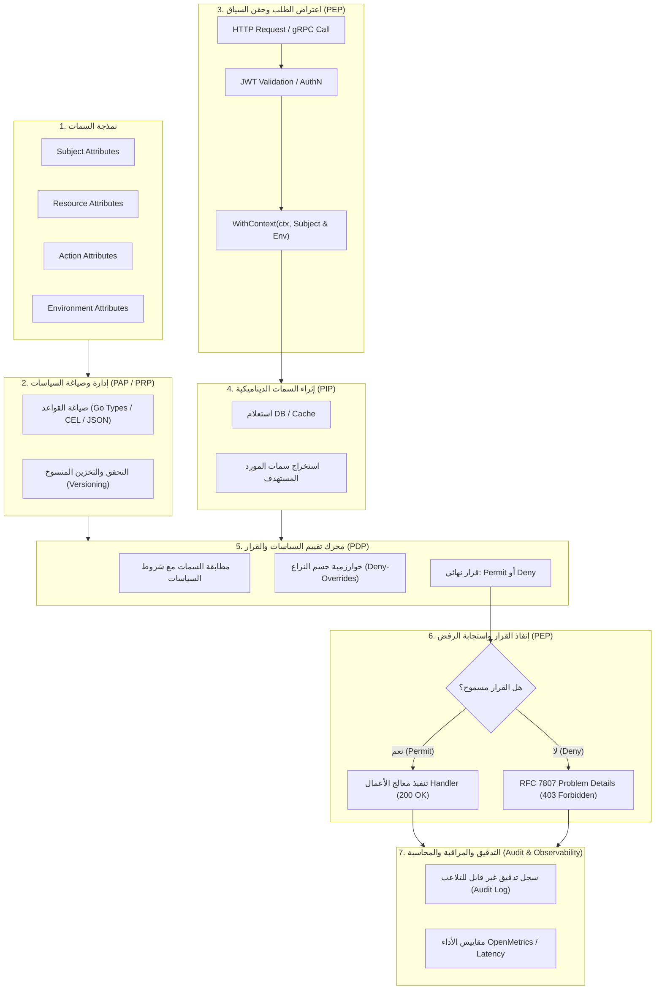

# توثيق وتحليل دورة حياة نظام الأمان القائم على السمات (ABAC) في منظومة لغة Go

---

## 1. المقدمة والتعريف المعياري (Executive Summary)

يُعد نظام **التحكم بالوصول القائم على السمات (Attribute-Based Access Control - ABAC)** أحد أكثر نماذج الأمان تطوراً ودقة في حماية الموارد والبيانات، حيث تم تعريفه واعتماده دولياً من قِبل المعهد الوطني للمعايير والتقنية (NIST) عبر الوثيقة المعيارية **NIST SP 800-162** ومواصفات **XACML**.

بخلاف نظام التحكم التقليدي القائم على الأدوار (**RBAC**)، الذي يمنح الصلاحيات بناءً على مسميات وظيفية ثابتة (مثل `Admin` أو `Manager`)، يعتمد نظام **ABAC** على تقييم ديناميكي متعدد الأبعاد يجمع أربع فئات من السمات (Attributes) في اللحظة الزمنية الفاصلة لوقوع الطلب:

1. **سمات الفاعل (Subject Attributes)**: هوية المستخدم، دوره، قسمه، مستواه الإداري، والشركة أو المستأجر التابع له (`tenant_id`/`company_id`).
2. **سمات المورد (Resource Attributes)**: مالك المورد (`owner_id`)، تصنيف حساسية البيانات، القسم المالك، الحالة التشغيلية (`status`)، والقيمة المالية (`amount`).
3. **سمات الإجراء (Action Attributes)**: الفعل المطلوب تنفيذه (`Read`, `Create`, `Update`, `Delete`, `Approve`, `Export`).
4. **سمات البيئة والسياق (Environmental Attributes)**: التوقيت الزمني للطلب (ساعات العمل)، عنوان الـ IP، الموقع الجغرافي، حالة أمان الجهاز (Device Posture)، واستخدام بروتوكول التشفير المتبادل (`mTLS`).

---

## 2. الموقف والفلسفة الرسمية لموقع ومصادر لغة Go (go.dev)

عند فحص المصادر والتوثيقات الرسمية لموقع لغة Go الرسمي ([go.dev](https://go.dev))، والوثائق الأمنية المباشرة ([go.dev/doc/security](https://go.dev/doc/security/)، [go.dev/security/policy](https://go.dev/security/policy/)، و [go.dev/security/best-practices](https://go.dev/security/best-practices))، يتضح الآتي:

### 2.1 فلسفة المكتبة القياسية: التجريد والتركيبية (Minimalism & Composition)

- **لا تفرض Go إطار عمل أمني أو تفويض (Authorization Framework) جاهزاً داخل المكتبة القياسية (`Standard Library`)**: تتبع لغة Go فلسفة واضحة وصارمة بفصل أساسيات اللغة ونواة النظام عن أطر عمل الأعمال (Framework-agnostic). على النقيض من منصات أخرى مثل Java (التي تعتمد Spring Security) أو Python (التي تحوي Django Auth)، فإن Go تعتبر التحكم بالوصول مسألة خاصة بمنطق التطبيق ومجال العمل (Domain Concern).
- **توفير اللبنات التأسيسية الصلبة (Cryptographic & Concurrency Primitives)**:
  المكتبة القياسية توفر كل ما يلزم لبناء أي نظام أمان متقدم مثل ABAC بأعلى مستويات الأداء والأمان:
  - حزم التشفير القياسية: `crypto/tls` لتأمين قناة الاتصال وشهادات الهوية، `crypto/x509` للتحقق من هوية الأطراف، و `crypto/subtle` لإجراء المقارنات الثابتة زمنياً (Constant-time comparison) لمنع هجمات التوقيت (Timing Attacks).
  - حزمة معالجة الطلبات وسياقها: `net/http` لإنشاء سلاسل الوسطاء (Middleware Chains)، وحزمة `context.Context` المخصصة لنقل وحقن سمات الطلب وهوية الفاعل بأمان عبر خيوط المعالجة المتزامنة (Goroutines).
  - التزامن الآمن: حزم `sync` و `sync/atomic` لإدارة الذاكرة المؤقتة لقواعد السياسات دون الوقوع في تضارب التزامن (Race Conditions).

### 2.2 أدوات فحص دورة حياة الأمان الرسمية (Official Go Security Toolchain)

توفر Go رسمياً منظومة متكاملة لضمان أمان دورة حياة أي نظام أمان يُبنى بها:

1. **أداة `govulncheck` الرسمية**: أداة تحليل أمني ثابت وديناميكي تكشف أي ثغرات معروفة في التبعيات أو مكتبات معالجة السياسات عبر قاعدة بيانات ثغرات Go الرسمية ([vuln.go.dev](https://vuln.go.dev)).
2. **كاشف تضارب البيانات المتزامنة (`go test -race`)**: اختبار إلزامي في أنظمة الأمان متعددة المسارات لضمان عدم وجود تسريب لسمات السياق بين Goroutines.
3. **الاختبار العشوائي الذكي (`go test -fuzz`)**: اختبار رسمي مدمج باللغة لاكتشاف حالات الفشل والتجاوزات الصفرية في معالجة نصوص وحزم السمات.
4. **الفاحص الثابت (`go vet`)**: تحليل بنائي لكشف الأخطاء التكوينية المحتملة.

---

## 3. المشاريع المرجعية القيادية لنظام ABAC في منظومة Go الرسمية

رغم عدم وجود حزمة ABAC في المكتبة القياسية، إلا أن منظومة Go المفتوحة والرسمية التابعة لـ Google و CNCF تملك أكبر وأشهر تطبيقات ABAC في العالم:

### 3.1 محرك Kubernetes ABAC الرسمي (`k8s.io/apiserver`)

يُعد مشروع **Kubernetes** (المكتوب بالكامل بلغة Go تحت مظلة CNCF و Google) المرجع العالمي الأهم لتطبيق ABAC البرمجي في Go.

- في حزمة `k8s.io/apiserver/pkg/authorization/authorizer/abac` و `pkg/apis/abac/types.go`، يتم تعريف سياسة الـ ABAC في Go كبنية واضحة:

```go
type PolicySpec struct {
    User            string `json:"user,omitempty"`
    Group           string `json:"group,omitempty"`
    Readonly        bool   `json:"readonly,omitempty"`
    APIGroup        string `json:"apiGroup,omitempty"`
    Resource        string `json:"resource,omitempty"`
    Namespace       string `json:"namespace,omitempty"`
    NonResourcePath string `json:"nonResourcePath,omitempty"`
}
```

- واجهة `authorizer.Attributes` المرجعية التي تمثل مستودع السمات:

```go
type Attributes interface {
    GetUser() user.Info
    GetVerb() string
    IsReadOnly() bool
    GetNamespace() string
    GetResource() string
    GetSubresource() string
    GetName() string
    GetAPIGroup() string
    IsResourceRequest() bool
    GetPath() string
}
```

### 3.2 محرك Google CEL للغة Go (`google/cel-go`)

طوّرت Google حزمة **Common Expression Language (CEL)** المكتوبة بلغة Go خصيصاً لحل معضلة تقييم سياسات الـ ABAC الحساسة.

- يتميز بأنه لغة تعبيرية سريعة جداً، خفيفة، وغير قابلة للتكرار اللانهائي (Non-Turing complete)، مما يمنع ثغرات تعطيل الخدمة (ReDoS / DoS).
- تُستخدم CEL اليوم كمعيار رسمي في تقييم سياسات ABAC في:
  - شروط التفويض في سحابة Google Cloud IAM Conditions.
  - سياسات التحقق والقبول في Kubernetes (`ValidatingAdmissionPolicy`).
  - مرشحات التفويض في Envoy Proxy و Istio Service Mesh.

### 3.3 محرك Open Policy Agent (OPA) / Rego

مشروع CNCF مكتوب بالكامل بلغة Go، يتيح فصل سياسات ABAC عن منطق الخدمة وإدارتها كشيفرة برمجية (Policy-as-Code).

---

## 4. المراحل السبع لدورة حياة نظام الأمان ABAC في بيئة Go

وفق المعيار المعماري المشترك بين NIST SP 800-162 والأنماط المعمارية للغة Go، تتألف دورة حياة نظام الأمان ABAC من سبع مراحل متتابعة ومحكمة:



---

### تفصيل مراحل دورة الحياة

### المرحلة 1: نمذجة وهيكلة السمات (Attribute Modeling & Schema Definition)

- **الهدف**: تحديد السمات اللازمة لاتخاذ قرارات التفويض، وتصميمها كأنواع بيانات صلبة وآمنة في Go (Strongly-Typed Structs).
- **التنفيذ في Go**:
  - `Subject`: المعرف (`UserID`)، الأدوار (`Roles`)، القسم (`Department`)، الشركة/المستأجر (`CompanyID`).
  - `Resource`: المالك (`OwnerID`)، القسم (`Department`)، الحالة (`Status`)، المبلغ المالي (`Amount`).
  - `Action`: الفعل مثل `read`، `create`، `update`، `approve`.
  - `Environment`: توقيت الطلب (`RequestTime`)، عنوان `ClientIP`، القناة (`IsInternalNetwork`).

### المرحلة 2: صياغة وإدارة السياسات (Policy Administration & Authoring - PAP / PRP)

- **الهدف**: صياغة قواعد الأمان وتخزينها والتحقق من سلامتها الهيكلية.
- **التنفيذ في Go**:
  - يمكن أن تكون السياسات دوال برمجية صريحة (Pure Go Rule Closures) لضمان أعلى سرعة تنفيذ، أو تعبيرات declarative بلغة Google CEL أو JSON.
  - **مبدأ الفشل الآمن (Fail-Closed / Default Deny)**: أي طلب لا تطابقه سياسة صريحة تمنحه الوصول يتم رفضه تلقائياً.

### المرحلة 3: التقاط الطلب وحقن السياق (Request Interception & Context Propagation - PEP)

- **الهدف**: اعتراض الطلب فور وصوله، والتحقق من هوية المرسل (Authentication)، ثم استخراج سمات الفاعل والبيئة وتمريرها في خط أنابيب المعالجة.
- **التنفيذ في Go**:
  - يتم هذا عبر **Go HTTP Middleware** أو **gRPC Interceptor**.
  - استخراج بيانات الـ JWT الصالحة بعد فك التشفير والتأكد من التوقيع ومدة الصلاحية (`exp`).
  - حقن السمات داخل `context.Context` باستخدام مفاتيح خاصة (Unexported Context Key Types) لمنع التصادم بين الحزم.

### المرحلة 4: استرجاع السمات الديناميكية (Dynamic Attribute Enrichment - PIP)

- **الهدف**: نقطة معلومات السياسة (Policy Information Point). في نظام ABAC الحقيقي، سمات المورد لا تأتي مع الـ Token بل تعيش داخل قاعدة البيانات (مثل: هل الفاتورة تابعة للشركة نفسها؟ ما هي حالتها؟).
- **التنفيذ في Go**:
  - تقوم طبقة الـ Repository أو الـ UseCase بالاستعلام عن السجل وجلب سماته (`ResourceAttributes`) قبل طلب التقييم النهائي.

### المرحلة 5: محرك تقييم السياسات وحسم القرار (Policy Decision Point - PDP)

- **الهدف**: تلقي سمات الفاعل، المورد، الإجراء، والبيئة، ومطابقتها مقابل السياسات المحملة.
- **خوارزميات حل النزاع (Combining Algorithms)**:
  - **Deny-Overrides (الرفض أولاً)**: إذا انطبقت أي سياسة تمنع الوصول، يُلغى أي سماح آخر فوراً (المعيار الأكثر أماناً للأنظمة المالية).
  - **First-Applicable**: تطبيق أول سياسة تنطبق على الحالة.
- **مخرجات القرار**: قرار قاطع (`Permit` أو `Deny`) مع توضيح سبب القرار (Audit Reason).

### المرحلة 6: إنفاذ القرار واستجابة الرفض الآمنة (Policy Enforcement Point - PEP)

- **الهدف**: تطبيق القرار الصادر من الـ PDP.
- **التنفيذ في Go**:
  - في حال السماح (`Permit`): يُستدعى `next.ServeHTTP(w, r)`.
  - في حال الرفض (`Deny`): يُقطع تنفيذ الطلب فوراً وتُعاد استجابة معيارية بصيغة **RFC 7807 Problem Details** برمز `403 Forbidden`.
  - **منع تسريب المعلومات (Information Disclosure Prevention)**: يجب ألا تحتوي رسالة الخطأ العامة الموجهة للمستخدم على أي تفاصيل داخلية عن قواعد الأمان أو أسماء الحقول الحساسة.

### المرحلة 7: المراجعة المحاسبية والتدقيق والمراقبة (Audit, Accounting & Observability)

- **الهدف**: تسجيل مسار أمني غير قابل للتلاعب (Tamper-evident Security Trail) لكل قرار تفويض.
- **التنفيذ في Go**:
  - تدوين سجلات هيكلية (Structured Logs عبر `log/slog`).
  - تسجيل: `subject_id`, `company_id`, `resource_type`, `action`, `decision`, `reason`, `latency_ns`, `client_ip`.
  - تصدير مقاييس Prometheus: عدد قرارات الرفض (`authz_denied_total`)، ومتوسط زمن استجابة التقييم (`authz_eval_duration_seconds`).

---

## 5. تطبيق برمجي معياري كامل في Go (Idiomatic Production Reference Code)

يوضح المثال التالي تطبيقاً معمارياً متكاملاً لدورة حياة ABAC وفق أعلى معايير Go النظيفة (Clean Architecture):

```go
package main

import (
 "context"
 "encoding/json"
 "fmt"
 "log/slog"
 "net/http"
 "os"
 "time"
)

// ============================================================================
// 1. المرحلة الأولى: نمذجة السمات (Attribute Modeling)
// ============================================================================

type SubjectAttributes struct {
 UserID     string   `json:"user_id"`
 CompanyID  string   `json:"company_id"`
 Department string   `json:"department"`
 Roles      []string `json:"roles"`
}

type ResourceAttributes struct {
 Type       string  `json:"type"`        // مثل: "invoice", "bank_account"
 OwnerID    string  `json:"owner_id"`
 CompanyID  string  `json:"company_id"`  // للعزل المتعدد للمستأجرين Multi-Tenancy
 Department string  `json:"department"`
 Amount     float64 `json:"amount"`
 Status     string  `json:"status"`      // مثل: "draft", "posted", "approved"
}

type ActionAttributes struct {
 Verb string `json:"verb"` // مثل: "read", "create", "update", "approve"
}

type EnvironmentAttributes struct {
 RequestTime time.Time `json:"request_time"`
 ClientIP    string    `json:"client_ip"`
}

type EvaluationContext struct {
 Subject     SubjectAttributes
 Resource    ResourceAttributes
 Action      ActionAttributes
 Environment EnvironmentAttributes
}

// ============================================================================
// 2. المرحلة الثانية: إدارة وصياغة السياسات (Policy Authoring - PAP)
// ============================================================================

type PolicyDecision int

const (
 DecisionDeny PolicyDecision = iota
 DecisionAllow
)

type PolicyRule interface {
 Name() string
 Evaluate(ctx EvaluationContext) (decision PolicyDecision, reason string)
}

// مثال لسياسة ABAC: اعتماد الفواتير المالية عالية القيمة
// الشرط: لا يمكن اعتماد فاتورة تتجاوز 10,000 ريال إلا إذا كان المستخدم مدير مالي
// ومن نفس قسم الفاتورة وضمن ساعات العمل الرسمية
type HighValueInvoiceApprovalPolicy struct{}

func (p HighValueInvoiceApprovalPolicy) Name() string {
 return "HighValueInvoiceApprovalPolicy"
}

func (p HighValueInvoiceApprovalPolicy) Evaluate(c EvaluationContext) (PolicyDecision, string) {
 if c.Resource.Type != "invoice" || c.Action.Verb != "approve" {
  return DecisionAllow, "Policy not applicable"
 }

 // عزل الشركات والمستأجرين (إلزامي)
 if c.Subject.CompanyID != c.Resource.CompanyID {
  return DecisionDeny, "Cross-tenant access violation"
 }

 // قيود المبالغ المالية الكبيرة
 if c.Resource.Amount > 10000.0 {
  hasManagerRole := false
  for _, r := range c.Subject.Roles {
   if r == "finance_manager" || r == "cfo" {
    hasManagerRole = true
    break
   }
  }
  if !hasManagerRole {
   return DecisionDeny, "Approving invoices > 10,000 requires finance_manager or cfo role"
  }

  if c.Subject.Department != c.Resource.Department {
   return DecisionDeny, "Manager cannot approve invoices outside their department"
  }
 }

 // شرط البيئة: السماح بالاعتماد فقط خلال أيام الأسبوع
 weekday := c.Environment.RequestTime.Weekday()
 if weekday == time.Friday || weekday == time.Saturday {
  return DecisionDeny, "Financial approvals are blocked during weekend off-hours"
 }

 return DecisionAllow, "All ABAC conditions satisfied"
}

// ============================================================================
// 3. المرحلة الخامسة: محرك تقييم السياسات والقرار (PDP Engine)
// ============================================================================

type PolicyDecisionPoint struct {
 policies []PolicyRule
 logger   *slog.Logger
}

func NewPDP(logger *slog.Logger, policies ...PolicyRule) *PolicyDecisionPoint {
 return &PolicyDecisionPoint{
  policies: policies,
  logger:   logger,
 }
}

// Evaluate ينفذ خوارزمية Deny-Overrides (الرفض الصارم)
func (pdp *PolicyDecisionPoint) Evaluate(evalCtx EvaluationContext) (bool, string) {
 start := time.Now()

 for _, rule := range pdp.policies {
  decision, reason := rule.Evaluate(evalCtx)
  if decision == DecisionDeny {
   pdp.logger.Warn("ABAC evaluation denied",
    "rule", rule.Name(),
    "user_id", evalCtx.Subject.UserID,
    "company_id", evalCtx.Subject.CompanyID,
    "resource", evalCtx.Resource.Type,
    "reason", reason,
    "duration_us", time.Since(start).Microseconds(),
   )
   return false, fmt.Sprintf("Access denied by rule %s: %s", rule.Name(), reason)
  }
 }

 pdp.logger.Info("ABAC evaluation allowed",
  "user_id", evalCtx.Subject.UserID,
  "company_id", evalCtx.Subject.CompanyID,
  "resource", evalCtx.Resource.Type,
  "duration_us", time.Since(start).Microseconds(),
 )
 return true, "Access permitted"
}

// ============================================================================
// 4. المراحل 3 و 6: وسيط الاعتراض وحقن السياق والإنفاذ (PEP Middleware)
// ============================================================================

type contextKey string

const subjectContextKey contextKey = "abac.subject"

func WithSubject(ctx context.Context, sub SubjectAttributes) context.Context {
 return context.WithValue(ctx, subjectContextKey, sub)
}

func GetSubject(ctx context.Context) (SubjectAttributes, bool) {
 sub, ok := ctx.Value(subjectContextKey).(SubjectAttributes)
 return sub, ok
}

// ABACAuthenticationEnforcementMiddleware يحاكي فك تشفير الهوية واعتراض الطلب
func ABACAuthenticationEnforcementMiddleware(next http.Handler) http.Handler {
 return http.HandlerFunc(func(w http.ResponseWriter, r *http.Request) {
  // في الواقع يتم استخراجها من توكن JWT المشفر والموقع
  dummySubject := SubjectAttributes{
   UserID:     "usr_99812",
   CompanyID:  "comp_demo_sa",
   Department: "accounting",
   Roles:      []string{"finance_manager"},
  }

  ctx := WithSubject(r.Context(), dummySubject)
  next.ServeHTTP(w, r.WithContext(ctx))
 })
}

// استجابة الخطأ القياسية وفق معيار RFC 7807 Problem Details
type ProblemDetails struct {
 Type     string `json:"type"`
 Title    string `json:"title"`
 Status   int    `json:"status"`
 Detail   string `json:"detail"`
 Instance string `json:"instance"`
}

func writeForbidden(w http.ResponseWriter, r *http.Request, detail string) {
 w.Header().Set("Content-Type", "application/problem+json")
 w.WriteHeader(http.StatusForbidden)
 _ = json.NewEncoder(w).Encode(ProblemDetails{
  Type:     "https://cashflow.io/errors/forbidden",
  Title:    "Forbidden",
  Status:   http.StatusForbidden,
  Detail:   detail,
  Instance: r.URL.Path,
 })
}

// ============================================================================
// 5. سيناريو المعالجة الكامل داخل نقطة النهاية (Endpoint & PIP Execution)
// ============================================================================

func ApproveInvoiceHandler(pdp *PolicyDecisionPoint) http.HandlerFunc {
 return func(w http.ResponseWriter, r *http.Request) {
  subject, ok := GetSubject(r.Context())
  if !ok {
   writeForbidden(w, r, "Unauthenticated subject context")
   return
  }

  // المرحلة 4 (PIP): جلب سمات المورد من قاعدة البيانات
  targetInvoice := ResourceAttributes{
   Type:       "invoice",
   OwnerID:    "usr_11024",
   CompanyID:  "comp_demo_sa",
   Department: "accounting",
   Amount:     15000.0,
   Status:     "draft",
  }

  // تجميع السياق الرباعي
  evalCtx := EvaluationContext{
   Subject:  subject,
   Resource: targetInvoice,
   Action: ActionAttributes{
    Verb: "approve",
   },
   Environment: EnvironmentAttributes{
    RequestTime: time.Now(),
    ClientIP:    r.RemoteAddr,
   },
  }

  // المرحلة 5: تقييم الـ PDP
  allowed, reason := pdp.Evaluate(evalCtx)
  if !allowed {
   // المرحلة 6: إنفاذ الرفض (PEP)
   writeForbidden(w, r, reason)
   return
  }

  // تنفيذ العملية المالية بنجاح
  w.Header().Set("Content-Type", "application/json")
  w.WriteHeader(http.StatusOK)
  _ = json.NewEncoder(w).Encode(map[string]string{
   "status":  "approved",
   "message": "Invoice approved successfully under ABAC policy",
  })
 }
}

func main() {
 logger := slog.New(slog.NewJSONHandler(os.Stdout, &slog.HandlerOptions{Level: slog.LevelInfo}))
 pdp := NewPDP(logger, HighValueInvoiceApprovalPolicy{})

 mux := http.NewServeMux()
 mux.Handle("POST /invoices/approve", ABACAuthenticationEnforcementMiddleware(ApproveInvoiceHandler(pdp)))

 logger.Info("Starting server with ABAC protection on :8080")
 // _ = http.ListenAndServe(":8080", mux)
}
```

---

## 6. جدول مقارنة: RBAC التقليدي مقابل ABAC المتقدم

| وجه المقارنة | التحكم القائم على الأدوار (RBAC) | التحكم القائم على السمات (ABAC) |
| :--- | :--- | :--- |
| **أساس القرار** | الدور الوظيفي فقط (`Role == "Manager"`) | تقييم متعدد السمات (الفاعل + المورد + الإجراء + البيئة) |
| **مستوى الدقة (Granularity)** | خشن (Coarse-grained) | فائق الدقة (Fine-grained) حتى مستوى الحقل والقيمة |
| **تضخم الصلاحيات (Role Explosion)** | مرتفع جداً؛ يتطلب إنشاء مئات الأدوار لكل سيناريو | منعدم؛ يتم التعبير عن القواعد عبر سمات ديناميكية |
| **حساسية السياق والبيئة** | معدومة تماماً | متأصلة (الوقت، موقع الـ IP، حالة الجهاز، الأمان) |
| **عزل المستأجرين (Multi-Tenancy)** | معرض لثغرات BOLA/IDOR في حال نسيان فحص الشركة | إلزامي ومدمج في قلب شروط السياسة (`Subject.CompanyID == Resource.CompanyID`) |
| **الأداء الحسابي** | سريع جداً ($O(1)$) بمجرد فحص وجود الدور | يتطلب وقت تقييم ($O(N)$ للسياسات) وعملية استعلام سمات إضافية (PIP) |

---

## 7. قائمة تدقيق الجاهزية للإنتاج (Production Security Checklist)

عند تطبيق نظام أمان ABAC في مشاريع Go الإنتاجية، يجب التحقق التام من البنود التالية:

- [ ] **الفشل الآمن (Default Deny / Fail-Closed)**: في حال عدم تطابق أي سياسة، أو حدوث خطأ أثناء جلب السمات، يجب أن يكون القرار الافتراضي هو **الرفض القاطع (Deny)**.
- [ ] **حماية عزل المستأجرين (Impenetrable Tenant Boundary)**: كل فحص سياسة يجب أن يتضمن شرط تطابق `company_id` لمنع ثغرات BOLA و IDOR.
- [ ] **أمان الذاكرة وتضارب التزامن (`-race`)**: التأكد من أن دوال تقييم السياسات في الـ PDP نقية ومجردة من الآثار الجانبية (Thread-safe Pure Functions).
- [ ] **حماية الـ Context Key Collision**: استخدام أنواع مفاتيح غير مصدّرة (`type contextKey string`) لحقن سمات الهوية في `context.Context`.
- [ ] **منع تسريب تفاصيل السياسات للمهاجمين**: إرجاع رسائل أخطاء عامة عبر معيار **RFC 7807 Problem Details** دون الإفصاح عن شروط الأمان الداخلية للمنظومة.
- [ ] **التدقيق الأمني المستمر (Audit Trail)**: تدوين كافة قرارات الرفض والسماح في سجلات مهيكلة (JSON Structured Logs) للرجوع إليها ومراقبتها في منصات الأمان (SIEM).
- [ ] **فحص الثغرات الآلي المستمر (`govulncheck`)**: دمج أداة Go الرسمية في مسار النشر المستمر (CI/CD) للتحقق المستمر من خلو التبعيات من الثغرات.

---

## 8. المراجع والمصادر الرسمية المعتمدة

1. **وثائق الأمان الرسمية لموقع Go**:
   - [Go Security Overview & Decisions](https://go.dev/doc/security/)
   - [Go Security Best Practices](https://go.dev/security/best-practices)
   - [Go Vulnerability Database & Management](https://go.dev/security/vuln/)
2. **المعايير المرجعية العالمية للأمان**:
   - **NIST SP 800-162**: *Guide to Attribute Based Access Control (ABAC) Definition and Considerations*.
   - **RFC 7807**: *Problem Details for HTTP APIs*.
3. **المشاريع المرجعية للغة Go في التحكم بالوصول**:
   - [Kubernetes Authorizer ABAC Package](https://github.com/kubernetes/kubernetes/tree/master/pkg/auth/authorizer/abac)
   - [Google Common Expression Language (CEL) for Go](https://github.com/google/cel-go)
   - [Open Policy Agent (OPA)](https://github.com/open-policy-agent/opa)
   - [Casbin Authorization Library in Go](https://github.com/casbin/casbin)
