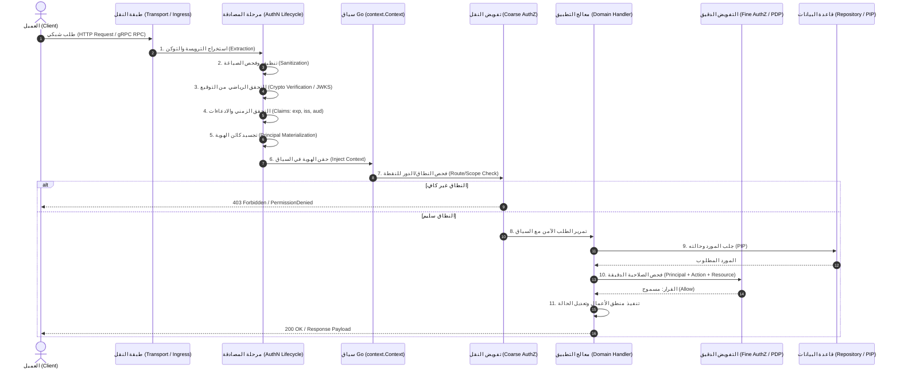
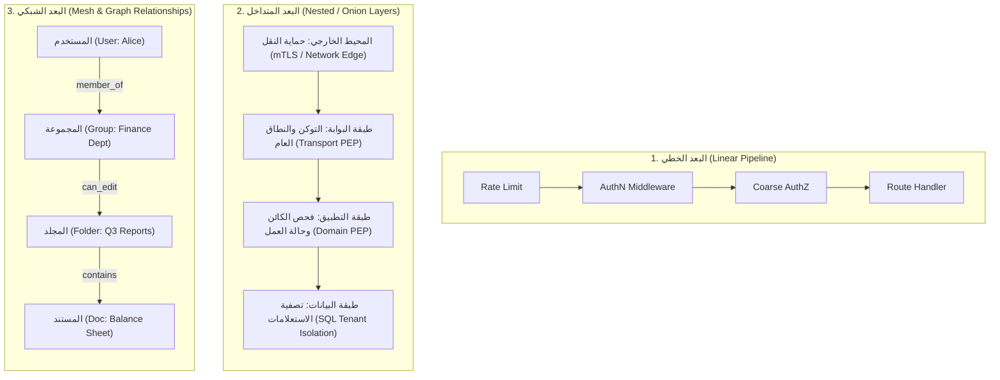
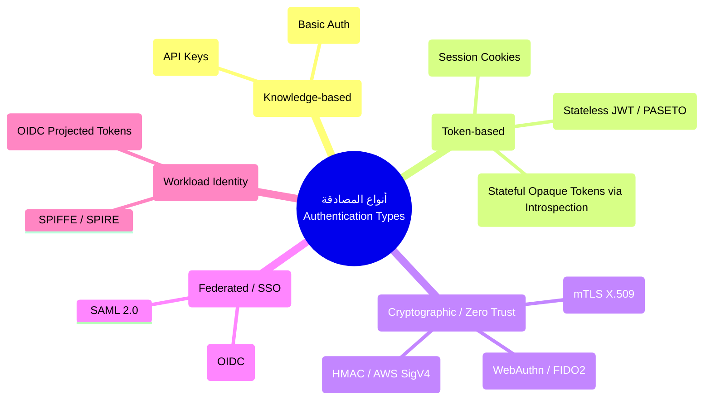

# التحليل المعماري والهندسي الشامل لطبقات المصادقة (Authentication) والتفويض (Authorization) في Go: معايير طبقة النقل (Transport/API Layer)، دورات الحياة، الواجهات الموحدة، والهياكل المعمارية

---

## 1. المقدمة والملخص التنفيذي (Executive Summary)

تُمثل قضيتا **المصادقة (Authentication - AuthN)** و**التفويض (Authorization - AuthZ)** الركيزتين الجوهريتين لأمان أي نظام برمجي حديث. وفي الأنظمة الموزعة والخدمات المصغرة (Microservices) والتطبيقات المكتوبة بلغة **Go**، تُعد **طبقة النقل (Transport/API Layer)** خط الدفاع الأول ومقطوعة التفتيش الحدودية (Border Inspection Ingress) التي تصطدم بها حركة المرور الشبكية (HTTP/REST, gRPC, WebSocket).

### الإشكالية الهندسية المحورية (The Core Problem)
يقع العديد من المطورين والمهندسين في خطأين معماريين رئيسيين:
1. **الخلط بين المصادقة والتفويض (AuthN vs AuthZ Conflation):** معاملتهما كوحدة واحدة متجانسة توضع في نقطة واحدة (Middleware واحد)، مما يؤدي إلى تشابك منطق إثبات الهوية بمنطق التدقيق في الصلاحيات.
2. **تسرب مسؤوليات المجال إلى طبقة النقل (Domain Leakage into Transport):** محاولة تنفيذ التفويض الدقيق (Fine-Grained Authorization) وفحص ملكية الموارد وحالات الأعمال (Business States) داخل وسيط الـ HTTP Router أو الـ gRPC Interceptor مباشرة؛ أو العكس: إهمال التفويض الخشن في طبقة النقل مما يسمح للطلبات غير المصرح لها باختراق مكدس الشبكة واستهلاك موارد الذاكرة والمنطق الداخلي قبل اكتشاف الرفض.

### التمييز الحاسم بين المفهومين
* **المصادقة (Authentication - AuthN):** تجيب بدقة عن السؤال: **"مَن أنت؟" (Who are you?)**. وظيفتها استخراج البراهين (Credentials, Tokens, Certificates)، التحقق من صحتها وتوقيعها الرياضي، وتحويلها إلى كينونة هوية آمنة وثابتة تُعرف بـ **الفاعل أو الهوية الرئيسية (Principal / Subject)**.
* **التفويض (Authorization - AuthZ):** يجيب بدقة عن السؤال: **"ما الذي يُسمح لك بفعله؟" (What are you allowed to do?)**. وظيفته مقارنة هوية الفاعل (Principal) والفعل المطلوب (Action) والمورد المستهدف (Resource) مع مجموعة سياسات (Policies) وسياق بيئي (Context) لاتخاذ قرار قاطع: **سماح (Allow) أو منع (Deny)**.

### مصفوفة الفصل المعماري المبدئي

| البُعد | المصادقة (AuthN) | التفويض الخشن (Coarse-Grained AuthZ) | التفويض الدقيق (Fine-Grained AuthZ) |
| :--- | :--- | :--- | :--- |
| **الموقع المعماري** | طبقة النقل (Transport Middleware / Interceptor) | طبقة النقل (Route / Method Level) | طبقة التطبيق / المجال (Use Case / Domain Core) |
| **المدخلات** | Headers, Tokens, Cookies, TLS Certs | Principal, Route Pattern, HTTP Method / RPC Name | Principal, Entity ID, Object Attributes, Business State |
| **المسؤولية** | التحقق من صحة التوقيع والهوية وحقن الـ Context | التحقق من النطاق (Scope) أو الدور العام (Global Role) | التحقق من ملكية البيانات (Ownership) والحدود والقيود |
| **كود الخطأ القياسي** | `401 Unauthorized` / `codes.Unauthenticated` | `403 Forbidden` / `codes.PermissionDenied` | `403 Forbidden` أو `404 Not Found` (لمنع تسريب وجود المورد) |

---

## 2. المرجعيات والمعايير القياسية الدولية ومنظومة Go (Standards & Official Ecosystem References)

لا يتم بناء حلول المصادقة والتفويض في Go بشكل عشوائي، بل تستند إلى معايير عالمية (RFCs و NIST) وتطبيقات معيارية في مجتمع Go:

### أولاً: المعايير الدولية الرسمية (IETF & NIST Standards)
1. **RFC 6749 & RFC 6750 (OAuth 2.0 Authorization Framework & Bearer Token Usage):**
   - يحدد دور الـ Resource Server، وكيفية نقل رموز الوصول (Access Tokens) عبر ترويسة `Authorization: Bearer <token>`.
2. **RFC 7519 (JSON Web Token - JWT):**
   - البنية القياسية للرموز الموقعة رقمياً، مع ادعاءات قياسية (Standard Claims): `iss` (المصدر)، `sub` (المعرف)، `aud` (الجمهور)، `exp` (تاريخ الانتهاء)، `nbf` (غير صالح قبل)، `iat` (تاريخ الإصدار)، `jti` (المعرف الفريد).
3. **RFC 9068 (JWT Profile for OAuth 2.0 Access Tokens):**
   - المعيار الإلزامي الحديث لهيكلة رموز الوصول المبنية على JWT لضمان قابلية التشغيل البيني الآمن.
4. **RFC 7662 (OAuth 2.0 Token Introspection):**
   - بروتوكول التحقق المباشر من صحة الرموز المبهمة (Opaque Tokens) بالرجوع لخادم الهوية (Authorization Server).
5. **معيار NIST SP 800-162 (Guide to Attribute Based Access Control - ABAC):**
   - المرجع الشامل لنمذجة التحكم بالوصول المبني على السمات المعمارية (Subject, Object, Action, Environment).
6. **معيار NIST SP 800-207 (Zero Trust Architecture):**
   - مبدأ "عدم الثقة مطلقاً، والتحقق المستمر دائماً"، وفرض المصادقة المتبادلة (mTLS) عند كل طبقة نقل.
7. **معمارية XACML / NIST للأمان الفيدرالي:**
   - تقسيم منظومة التفويض إلى 4 كيانات حاسمة:
     - **PEP (Policy Enforcement Point):** نقطة فرض السياسة (عادة Middleware في Go).
     - **PDP (Policy Decision Point):** نقطة اتخاذ القرار (محرك السياسات مثل OPA أو Casbin).
     - **PIP (Policy Information Point):** نقطة جمع البيانات (مستودعات البيانات لجلب سمات المورد).
     - **PAP (Policy Administration Point):** نقطة إدارة وكتابة السياسات.

### ثانياً: المصادر والوثائق الرسمية للغة Go
1. **المكتبة القياسية للغة Go (`net/http` و `context`):**
   - [pkg.go.dev/net/http](https://pkg.go.dev/net/http): معيار `http.Handler` والدالة `ServeHTTP(ResponseWriter, *Request)` باعتبارها حجر الزاوية لخط أنابيب الوسطاء (Middleware Pipeline).
   - [pkg.go.dev/context](https://pkg.go.dev/context): التوجيه الرسمي الصارم لاستخدام `context.Context` لنقل بيانات الهوية عبر الحدود الزمنية للتنفيذ، مع فرض استخدام أنواع مفاتيح غير مصدّرة (Unexported Key Types) لمنع التصادم.
2. **المشروع الرسمي لـ gRPC في Go (`google.golang.org/grpc`):**
   - [grpc.io/docs/languages/go](https://grpc.io/docs/languages/go/): وثائق الاعتماد واعتراض الطلبات عبر `grpc.UnaryServerInterceptor` و `grpc.StreamServerInterceptor`.
   - إدارة البيانات الوصفية عبر الحزمة القياسية `google.golang.org/grpc/metadata`.
   - أمان النقل عبر حزم `google.golang.org/grpc/credentials`.
3. **مكتبات المصادقة القياسية المعتمدة من مجتمع Go:**
   - `golang.org/x/oauth2`: العميل الرسمي لـ OAuth 2.0 تحت إشراف فريق Go.
   - `github.com/coreos/go-oidc/v3`: العميل المرجعي لـ OpenID Connect والتحقق من التوقيع عبر JWKS (JSON Web Key Sets).
   - `golang.org/x/crypto`: الخوارزميات التشفيرية المعتمدة (Bcrypt, Argon2, Ed25519).
4. **محركات التفويض الرائدة في مجتمع Go (Policy Engines):**
   - **Open Policy Agent (OPA):** [github.com/open-policy-agent/opa](https://github.com/open-policy-agent/opa) - محرك السياسات المفتوح المصدر المعتمد من CNCF، يستخدم لغة Rego لتقييم السياسات بصيغة تصريحية (Declarative).
   - **Casbin:** [github.com/casbin/casbin/v2](https://github.com/casbin/casbin/v2) - محرك تفويض مدمج عالي الكفاءة يدعم نماذج PERM (Policy, Effect, Request, Matchers).
   - **Google Zanzibar Implementations:** المحركات المبنية على الورقة البحثية لشركة Google للتفويض القائم على العلاقات (ReBAC):
     - **SpiceDB (Authzed):** [github.com/authzed/authzed-go](https://github.com/authzed/authzed-go)
     - **OpenFGA (CNCF Sandbox / Auth0):** [openfga.dev](https://openfga.dev)
     - **Ory Keto:** [github.com/ory/keto](https://github.com/ory/keto)

---

## 3. الهيكلية المعمارية وموقع الطبقات (Architectural Placement)

وفق مبادئ **المعمارية السداسية (Hexagonal / Ports and Adapters)** و**المعمارية النظيفة (Clean Architecture)**، يتم توزيع المصادقة والتفويض عبر طبقات النظام بأسلوب الدفاع في العمق (Defense-in-Depth):

```mermaid
flowchart TD
    subgraph EdgePerimeter ["1. حافة الشبكة والبوابة الخارجية (Edge Ingress & Gateway)"]
        Client["العميل الخارجي (Browser / Mobile / 3rd Party)"]
        Ingress["موزع الأحمال / البوابة<br/>(API Gateway / Reverse Proxy)"]
        Client -->|طلب الشبكة عبر TLS| Ingress
        Ingress -.->|إنهاء TLS / فحص mTLS الأولي| Ingress
    end

    subgraph TransportLayer ["2. طبقة النقل داخل Go (Transport / API Boundary)"]
        direction TB
        MuxOrServer["Router (net/http Mux) أو gRPC Server"]
        
        subgraph Pipeline ["خط وسائط النقل (Transport Interceptors Pipeline)"]
            T1["Trace & Request ID Middleware"]
            T2["Rate Limiter & Timeout"]
            T3["🔐 المصادقة النقلية (Transport AuthN PEP)<br/>- استخراج التوكن<br/>- فحص التوقيع الرقمي والتشفير<br/>- بناء كائن Principal وحقنه في Context"]
            T4["🛡️ التفويض الخشن (Transport Coarse AuthZ PEP)<br/>- فحص النطاقات (Scopes)<br/>- فحص الأدوار العامة (Global Roles)<br/>- قيود الطرق (Method/Route Permission)"]
            
            T1 --> T2 --> T3 --> T4
        end

        MuxOrServer --> Pipeline
    end

    subgraph CoreBoundary ["3. الحدود المعمارية (Application Boundary - DTOs & Context)"]
        ContextWithPrincipal["السياق المحمي (context.Context)<br/>يحمل كائن Principal المنيع"]
        Pipeline --> ContextWithPrincipal
    end

    subgraph ApplicationLayer ["4. طبقة التطبيق وحالات الاستخدام (Application / Use Cases)"]
        UseCase["معالج حالة الاستخدام (Use Case Handler)<br/>نقي، لا يعرف HTTP أو gRPC"]
        FineAuthZPEP["🛡️ نقطة فحص التفويض الدقيق (Domain PEP)<br/>- التحقق من ملكية المورد<br/>- قيود حالة العمل (Workflow State)<br/>- استدعاء محرك القرارات (PDP)"]
        
        ContextWithPrincipal --> UseCase
        UseCase --> FineAuthZPEP
    end

    subgraph PDPAndPIP ["5. محركات السياسات والبيانات (PDP & PIP)"]
        PDP["محرك قرار السياسة (PDP)<br/>(OPA / Casbin / Zanzibar / Cedar)"]
        DB[(قاعدة البيانات / المستودع)<br/>(PIP - جلب سمات الكائن وعزل المستأجر Tenant Isolation)]
        
        FineAuthZPEP -->|فحص السياسة| PDP
        FineAuthZPEP -->|جلب المورد وحالته| DB
    end
```

### القواعد الصارمة لتوزيع المسؤوليات:
1. **طبقة النقل تملك فك التشفير الشكلي:** مسؤولة عن البروتوكول الشبكي (قراءة الترويسات، التعامل مع ملفات تعريف الارتباط Cookies، استخراج شهادات العميل في mTLS).
2. **المنطق التجاري (Domain Logic) لا يعرف الرموز التشفيرية:** لا يجوز إطلاقاً تمرير `*http.Request` أو `token string` أو `Header` إلى طبقة التطبيق أو الـ Domain. فقط كائن الهوية المطهر `*Principal` يُمرر عبر `context.Context`.
3. **التفويض المسبق (Pre-Authorization / Coarse-Grained):** يقع في طبقة النقل لمنع استهلاك خوادم التطبيق في عمليات محكوم عليها بالفشل سلفاً (Fast Fail).
4. **التفويض اللاحق (Post/Fine-Grained Authorization):** يقع داخل طبقة التطبيق لأن معرفة "هل يملك المستخدم حق تعديل الفاتورة رقم 987؟" يتطلب قراءة الفاتورة والتأكد من أنها تتبع لمستأجره (Tenant) وفي حالة "مسودة" وليست "معتمدة".

---

## 4. هل توجد واجهات برمجية موحدة (Unified Interfaces) في Go؟

### فلسفة Go التصميمية: غياب الواجهات المتجانسة الضخمة
في لغات أخرى (مثل Java Spring Security)، تجد واجهات متجانسة ضخمة مثل `AuthenticationManager` أو `AccessDecisionManager`. 
في **Go**، الفلسفة المعمارية الرسمية ترفض التجريدات الضخمة (Monolithic Abstractions) وتعتمد على:
* **واجهات صغيرة وموجهة لغرض واحد (Small, Composable Interfaces).**
* **الاعتماد على الدوال (First-Class Functions) ونمط الـ Middleware / Decorator.**
* **استخدام `context.Context` كناقل قياسي محايد للبروتوكول.**

### تصميم الواجهات المعمارية الموحدة في المنظومات المتقدمة
رغم عدم وجود واجهة موحدة في المكتبة القياسية لكل أنواع الأمان، إلا أن المعايير الهندسية الراسخة تجمع على الواجهات التجريدية التالية لربط HTTP و gRPC معاً:

```go
package security

import (
	"context"
	"errors"
	"time"
)

// Common Error Definitions
var (
	ErrUnauthenticated = errors.New("security: unauthenticated, invalid or missing credentials")
	ErrTokenExpired    = errors.New("security: token has expired")
	ErrPermissionDenied = errors.New("security: permission denied, insufficient privileges")
)

// HeaderCarrier واجهة تجريدية لاستخراج الترويسات أياً كان البروتوكول (HTTP أو gRPC Metadata)
type HeaderCarrier interface {
	Get(key string) string
}

// Subject هوية الكيان المصادق عليه (مستخدم، خدمة، تطبيق، جهاز)
type Subject interface {
	ID() string
	TenantID() string
	Roles() []string
	HasRole(role string) bool
	HasScope(scope string) bool
}

// Principal كائن الهوية النهائي المنيع والمطهر
type Principal struct {
	ID         string
	TenantID   string
	Email      string
	Roles      map[string]struct{}
	Scopes     map[string]struct{}
	Attributes map[string]any
	IssuedAt   time.Time
	ExpiresAt  time.Time
}

func (p *Principal) HasRole(role string) bool {
	_, ok := p.Roles[role]
	return ok
}

func (p *Principal) HasScope(scope string) bool {
	_, ok := p.Scopes[scope]
	return ok
}

// Authenticator واجهة موحدة للتحقق من المصادقة واستخراج الهوية
type Authenticator interface {
	// Authenticate تفحص الطلب وتستخرج الهوية، وترجع Principal مطهر
	Authenticate(ctx context.Context, carrier HeaderCarrier) (*Principal, error)
}

// TokenParser واجهة متخصصة بفك تشفير والتحقق من الرموز (JWT, PASETO)
type TokenParser interface {
	ParseAndVerify(ctx context.Context, rawToken string) (*Principal, error)
}

// Resource يمثل المورد الخاضع للتفويض
type Resource struct {
	Type       string         // e.g., "invoice", "report", "user"
	ID         string         // e.g., "inv_12345"
	TenantID   string         // e.g., "tenant_88"
	Attributes map[string]any // e.g., {"status": "draft", "amount": 5000}
}

// Action نوع العملية المطلوب تنفيذها
type Action string

const (
	ActionCreate Action = "create"
	ActionRead   Action = "read"
	ActionUpdate Action = "update"
	ActionDelete Action = "delete"
	ActionApprove Action = "approve"
)

// Authorizer واجهة موحدة لفحص التفويض (Policy Enforcement Point)
type Authorizer interface {
	// Authorize تتخذ قراراً قاطعاً بالسماح أو المنع
	Authorize(ctx context.Context, sub *Principal, act Action, res Resource) (bool, error)
}
```

### إدارة السياق (`context.Context`) بأمان ومنع التصادم (Context Safety)
وفق التوثيق الرسمي لحزمة `context`، يجب استخدام نوع مفتاح خاص غير مصدّر (Unexported Key Type) لمنع التضارب بين الحزم:

```go
package security

import "context"

type contextKey struct{}

var principalContextKey = contextKey{}

// InjectPrincipal يحقن الهوية داخل السياق بطريقة آمنة
func InjectPrincipal(ctx context.Context, p *Principal) context.Context {
	return context.WithValue(ctx, principalContextKey, p)
}

// ExtractPrincipal يسترجع الهوية من السياق مع فحص النوع
func ExtractPrincipal(ctx context.Context) (*Principal, bool) {
	p, ok := ctx.Value(principalContextKey).(*Principal)
	return p, ok && p != nil
}

// MustExtractPrincipal يستخرج الهوية أو يعيد خطأ فادحاً للمسارات المحمية إجبارياً
func MustExtractPrincipal(ctx context.Context) (*Principal, error) {
	p, ok := ExtractPrincipal(ctx)
	if !ok {
		return nil, ErrUnauthenticated
	}
	return p, nil
}
```

---

## 5. دورة الحياة الكاملة (The Complete Lifecycle)

تنقسم معالجة الأمان إلى دورتي حياة متعاقبتين ومنفصلتين بدقة: **دورة حياة المصادقة** تليها **دورة حياة التفويض**.



### أولاً: دورة حياة المصادقة التفصيلية (Authentication Lifecycle - 6 خطوات)

1. **مرحلة الاستخراج (Extraction Phase):**
   - استخراج البراهين الخام من حامل البيانات:
     - في **HTTP:** ترويسة `Authorization: Bearer <token>` أو ملف تعريف ارتباط موقع `Cookie: session_id=...` أو ترويسة `X-API-Key`.
     - في **gRPC:** استخراج الـ Metadata عبر `metadata.FromIncomingContext(ctx)` ومفتاح `authorization`.
     - في **mTLS:** استخراج شهادة العميل من `tls.ConnectionState.PeerCertificates`.
2. **مرحلة التنقية والفحص الشكلي (Sanitization & Structural Validation):**
   - التأكد من مطابقة النمط القياسي (Format Syntax). مثلاً: التأكد من وجود كلمة `Bearer ` متبوعة بثلاثة أجزاء مفصولة بنقاط في JWT (`header.payload.signature`).
   - استبعاد الأحرف الخبيثة أو المحارف غير الصالحة، وفصل الطلبات المشبوهة فوراً دون استهلاك عمليات تشفير مكلفة.
3. **مرحلة التحقق التشفيري والموثوقية (Cryptographic Verification & Trust):**
   - التأكد من خوارزمية التوقيع (منع هجوم `alg: "none"` أو الخلط بين RSA و HMAC).
   - جلب المفاتيح العامة (Public Keys) من خادم الهوية عبر بروتوكول JWKS مع تطبيق تخزين مؤقت آمن (In-Memory Cache with TTL).
   - التحقق الرياضي من توقيع الرمز لمنع أي تلاعب بالبيانات المحمولة.
4. **مرحلة فحص الادعاءات والصلاحية الزمنية (Claims & Temporal Validation):**
   - فحص `exp` (تاريخ الانتهاء) مع هامش زمني طفيف (Clock Skew Tolerance: 30-60 ثانية).
   - فحص `nbf` (Not Before) و `iat` (Issued At) لمنع استخدام الرموز المستقبلية أو المشوهة زمنياً.
   - فحص `iss` (المصدر - Issuer) والتأكد من مطابقته لنطاق خادم المصادقة المعتمد.
   - فحص `aud` (الجمهور - Audience) للتأكد من أن الرمز مخصص لهذه الخدمة تحديداً وليس لخدمة أخرى داخل المؤسسة (منع هجمات Token Forwarding).
   - التحقق من عدم إلغاء الرمز (Revocation Check): فحص قائمة الرموز الملغاة أو فحص إصدار جلسة المستخدم (Token Versioning / Blacklist عبر Redis).
5. **مرحلة تجسيد كائن الهوية (Principal Materialization):**
   - تحويل الادعاءات المعتمدة إلى كائن Go نقي ومحكم الأنواع `*Principal`.
   - استخراج المعرف الأساسي (`sub` -> `ID`)، معرف المنظمة أو المستأجر (`tenant_id`)، الأدوار (`roles`)، والنطاقات (`scopes`).
6. **مرحلة إثراء السياق والتسليم (Context Enrichment & Hand-off):**
   - حقن كائن الـ `Principal` داخل `context.Context` عبر دالة آمنة ومغلفة.
   - إنشاء طلب جديد مع السياق المعدل (في HTTP: `r.WithContext(ctx)`؛ وفي gRPC: استدعاء الـ `handler(ctx, req)`).

---

### ثانياً: دورة حياة التفويض التفصيلية (Authorization Lifecycle - 6 خطوات)

1. **مرحلة استرجاع الهوية من السياق (Principal Retrieval):**
   - يستقبل وسيط التفويض السياق (`context.Context`) ويستخرج منه كائن الـ `Principal`.
   - إذا لم يوجد كائن هوية، يُرفض الطلب فوراً بخطأ `401 Unauthorized` لأن التفويض مشروط بوجود مصادقة مسبقة.
2. **مرحلة تحديد الهدف والعملية (Target & Action Mapping):**
   - تحديد العملية المطلوبة (Action): مثل قراءة أو كتابة أو حذف (تُستنتج من طريقة HTTP مثل `GET -> read`, `POST -> create`, `DELETE -> delete`، أو من اسم دالة gRPC مثل `/billing.v1.InvoiceService/ApproveInvoice -> approve`).
   - تحديد نوع المورد المستهدف (Resource Type) ومساره.
3. **مرحلة تقييم التفويض الخشن في النقل (Transport Coarse Evaluation):**
   - مقارنة نطاقات الرمز (Scopes) مع العملية المستهدفة. مثال: هل يمتلك الرمز نطاق `invoices:write`؟
   - فحص الأدوار العامة للمستخدم (e.g., `user.HasRole("admin")`).
   - إذا أخفق، يُرفض الطلب بخطأ `403 Forbidden` (في HTTP) أو `codes.PermissionDenied` (في gRPC) ويتوقف قطار المعالجة فوراً.
4. **مرحلة إثراء بيانات المورد والمجال (Domain/PIP Enrichment):**
   - في طبقة التطبيق (Use Case)، يتم استدعاء قاعدة البيانات أو المستودع (PIP) لجلب المورد الحقيقي المطلوب التعامل معه وفحص:
     - معرف المستأجر للمورد (Resource Tenant ID).
     - مالك المورد الأصلي (Owner ID).
     - الحالة التجارية الحالية للمورد (Status: Active, Archived, Locked).
5. **مرحلة تقييم السياسة الدقيقة (Fine-Grained Policy Decision - PDP):**
   - تمرير رباعية القرار الكاملة إلى محرك السياسات (PDP):
     $$\text{Decision} = \text{Evaluate}(\text{Subject}, \text{Action}, \text{Resource}, \text{Environment})$$
   - تقييم القواعد المعقدة:
     - هل المستخدم هو مالك الفاتورة؟ (ABAC)
     - هل يتبع المستخدم نفس الفرع والقسم؟ (ABAC)
     - هل يمتلك المستخدم علاقة "مُراجع" على المجلد الحاوي للفاتورة؟ (ReBAC / Zanzibar)
6. **مرحلة فرض القرار والتدقيق الأمني (Enforcement & Audit Logging):**
   - إذا جاء القرار بالمنع (Deny):
     - تسجيل محاولة الوصول الفاشلة في سجلات التدقيق الأمني (Security Audit Log) متضمنة الـ `User ID`, `IP`, `Resource ID`, و `Timestamp`.
     - إرجاع خطأ `ErrPermissionDenied` أو إخفاء وجود المورد بإرجاع `404 Not Found` إذا كانت سياسة الأمان تقتضي منع الكشف عن وجود الموارد المحمية (Information Disclosure Prevention).
   - إذا جاء القرار بالسماح (Allow):
     - تنفيذ العملية وتمرير البيانات بنجاح.

---

## 6. الهياكل المعمارية: هل هي خطية، متداخلة، أم شبكية؟

تتخذ علاقة مستويات المصادقة والتفويض في الأنظمة المتقدمة **ثلاثة أبعاد هندسية متزامنة**، وليست مجرد بعد واحد:



### 1. المستوى الخطي (Linear Pipeline / Filter Chain)
* **الوصف:** هو الترتيب التسلسلي الصارم الذي تمر به حزمة الشبكة داخل وسائط النقل (Middleware Chain / Interceptor Chain).
* **آلية العمل:**
  $$\text{Request} \longrightarrow \text{M1 (Tracing)} \longrightarrow \text{M2 (AuthN)} \longrightarrow \text{M3 (Coarse AuthZ)} \longrightarrow \text{M4 (Route)}$$
* **الخصائص:** كل مرحلة خطية إما أن تُمرر الطلب للخطوة التالية عبر استدعاء `next.ServeHTTP(w, r)` أو تقطع الخط تماماً (Short-Circuit) وترجع رمز الخطأ.
* **الحدود:** ينتهي البعد الخطي عند وصول الطلب إلى معالج التطبيق (Handler)، لأنه يعجز عن معرفة البيانات الدقيقة للمورد قبل قراءته من قاعدة البيانات.

### 2. المستوى المتداخل (Nested / Onion Architecture - Defense in Depth)
* **الوصف:** نمط الحلقات المتداخلة (طبقات البصلة) حيث تُحاط النواة الحساسة للنظام بعدة طبقات أمان مستقلة تزداد دقة وتخصصاً كلما اقتربنا من المركز.
* **المستويات الأربعة المتداخلة:**
  1. **الحلقة الأولى (Perimeter Layer):** مصادقة النقل المتبادل (mTLS) عند البوابة لعزل الشبكة.
  2. **الحلقة الثانية (Transport Ingress Layer):** فحص صحة التوكن والتأكد من الأدوار العامة (Coarse RBAC).
  3. **الحلقة الثالثة (Domain/Application Layer):** فحص قواعد الأعمال والتفويض الدقيق (Fine-Grained ABAC) وحالة الكيان التجاري.
  4. **الحلقة الرابعة (Data/Persistence Layer):** التصفية التلقائية للاستعلامات لضمان عزل المستأجرين (Row-Level Security & Tenant Filtering) مثل إضافة `WHERE tenant_id = ?` إجبارياً على مستوى الـ ORM أو الـ SQL Driver.

### 3. المستوى الشبكي (Graph & Relationship Mesh)
* **الوصف:** التفويض ليس دائماً جدولاً ثابتاً من الشروط، بل هو في جوهره **شبكة علاقات موجهة (Directed Graph)** وفق نموذج **Google Zanzibar (ReBAC)** أو **Service Mesh**.
* **كيف تتجلى الشبكية؟**
  - **على مستوى الخدمات (Service Mesh):** في البنى السحابية الموزعة، تتواصل الخدمات مع بعضها عبر شبكة (Mesh)، حيث يتم التحقق من هوية كل خدمة عبر شهادات هوية العمل المشفرة (SPIFFE/SPIRE IDs) وسياسات مصادقة متبادلة مشبكة (East-West Traffic Security).
  - **على مستوى البيانات والصلاحيات (ReBAC Graph):** عندما تسأل: "هل يستطيع المستخدم *علي* قراءة ملف *الميزانية*؟"، لا توجد قاعدة مباشرة تقول "نعم"، بل يقوم المحرك بتتبع رسم بياني:
    - *علي* عضو في فريق *المحاسبة*.
    - فريق *المحاسبة* يملك صلاحية عرض على مجلد *التقارير المالية*.
    - مجلد *التقارير المالية* يحتوي على ملف *الميزانية*.
    - $\rightarrow$ إذن، يتم منح الوصول بناءً على اجتياز العقد في الرسم البياني (Graph Traversal).

---

## 7. تصنيف الأنواع والنماذج التقنية (Taxonomy of Types & Paradigms)

### أولاً: أنواع تقنيات المصادقة (Authentication Types)



1. **الرموز عديمة الحالة (Stateless JWT / PASETO):**
   - **الآلية:** يحمل الرمز بيانات الهوية والصلاحيات داخله موقعة رياضياً. تتحقق الخدمة من صحة الرمز باستخدام المفتاح العام دون الحاجة للاتصال بأي قاعدة بيانات.
   - **المزايا:** أداء فائق، سهولة التوسع الأفقي (Horizontal Scaling).
   - **العيوب:** صعوبة إلغاء الرمز الفوري (Revocation) قبل انتهاء مدة الصلاحية.
2. **الرموز المبهمة ذات الحالة (Stateful Opaque Tokens):**
   - **الآلية:** رمز عشوائي غير مفهوم (UUID أو خيط عشوائي). ترسل الخدمة طلباً إلى خادم الهوية (Token Introspection RFC 7662) أو تفحص Redis للتحقق منه.
   - **المزايا:** إمكانية الإلغاء الفوري في أي لحظة.
   - **العيوب:** تسبب عبئاً شبكياً وزمن وصول إضافي (Network Latency).
3. **المصادقة المتبادلة لشهادات TLS (mTLS X.509):**
   - **الآلية:** يتحقق العميل من الخادم ويتحقق الخادم من هوية العميل عبر شهادة رقمية موقعة من مرجع مصادقة (CA) خاص أثناء مصافحة الـ TLS.
   - **المزايا:** أمان تشفيري مطلق من الطبقة الرابعة للشبكة، حماية من هجمات Man-in-the-Middle، مناسبة جداً للاتصال بين الخدمات المصغرة (Service-to-Service).
4. **توقيع الطلبات الرقمي (HMAC Request Signing / SigV4):**
   - **الآلية:** يقوم العميل بحساب بصمة رقمية لمكونات الطلب (Path, Headers, Timestamp, Body) باستخدام مفتاح سري مشترك (Secret Key) ويرسل التوقيع في الترويسة.
   - **المزايا:** تضمن سلامة البيانات (Integrity) وعدم التلاعب بمحتوى الطلب، وتمنع هجمات إعادة الإرسال (Replay Attacks).

---

### ثانياً: نماذج التفويض المعمارية (Authorization Models)

| النموذج | الاسم الكامل | الفكرة الأساسية | الأنسب لـ |
| :--- | :--- | :--- | :--- |
| **RBAC** | Role-Based Access Control | ربط الصلاحيات بالأدوار، وربط الأدوار بالمستخدمين (User $\rightarrow$ Role $\rightarrow$ Permission). | الأنظمة الإدارية التقليدية، الشركات ذات الهياكل الهرمية الثابتة. |
| **ABAC** | Attribute-Based Access Control | تقييم ديناميكي لقواعد منطقية تعتمد على سمات الفاعل والمورد والبيئة (Subject, Resource, Env). | المؤسسات الكبرى، الأنظمة التي تتطلب قيوداً معقدة (الوقت، الموقع، مبالغ مالية). |
| **ReBAC** | Relationship-Based Access Control | فحص العلاقات المباشرة وغير المباشرة بين الكيانات عبر رسم بياني للعلاقات (نموذج Google Zanzibar). | الأنظمة متعددة المستأجرين، منصات التعاون ومشاركة الملفات (مثل Google Docs). |
| **PBAC** | Policy-Based Access Control | كتابة السياسات ككود تصريحي مستقل (Declarative Policy-as-Code) يُدار خارج شفرة التطبيق (OPA Rego / Cedar). | المعماريات السحابية، الخدمات المصغرة الموزعة، توحيد سياسات البنية التحتية والبرمجيات. |
| **Scopes** | OAuth 2.0 Scopes | تحديد نطاقات تشغيلية مسبقة يوافق عليها المستخدم للعملاء الخارجيين (Delegated Authorization). | الواجهات البرمجية المفتوحة للتكامل مع تطبيقات الطرف الثالث (Public APIs). |

---

## 8. التطبيق العملي بلغة Go (Production-Ready Go Implementations)

فيما يلي التطبيق الهندسي النموذجي المتوافق مع معايير Go الصارمة، ويوضح توحيد منطق المصادقة والتفويض بين خادم `net/http` وخادم `gRPC`.

### 1. طبقة التحقق والمصادقة الموحدة (Unified Core AuthN Logic)

```go
package security

import (
	"context"
	"crypto/rsa"
	"errors"
	"fmt"
	"strings"
	"time"

	"github.com/golang-jwt/jwt/v5"
)

// CustomClaims الادعاءات القياسية والخاصة بنظامنا
type CustomClaims struct {
	TenantID string   `json:"tenant_id"`
	Roles    []string `json:"roles"`
	Scopes   []string `json:"scopes"`
	jwt.RegisteredClaims
}

// JWTTokenValidator مدقق الرموز المعتمد على المفاتيح العامة
type JWTTokenValidator struct {
	publicKey *rsa.PublicKey
	issuer    string
	audience  string
}

func NewJWTTokenValidator(pubKey *rsa.PublicKey, issuer, audience string) *JWTTokenValidator {
	return &JWTTokenValidator{
		publicKey: pubKey,
		issuer:    issuer,
		audience:  audience,
	}
}

// ValidateToken فحص التوقيع وصحة الادعاءات واستخراج Principal
func (v *JWTTokenValidator) ValidateToken(ctx context.Context, rawToken string) (*Principal, error) {
	if rawToken == "" {
		return nil, ErrUnauthenticated
	}

	token, err := jwt.ParseWithClaims(rawToken, &CustomClaims{}, func(t *jwt.Token) (any, error) {
		// منع هجوم تغيير الخوارزمية (Alg confusion attack)
		if _, ok := t.Method.(*jwt.SigningMethodRSA); !ok {
			return nil, fmt.Errorf("unexpected signing method: %v", t.Header["alg"])
		}
		return v.publicKey, nil
	},
		jwt.WithIssuer(v.issuer),
		jwt.WithAudience(v.audience),
		jwt.WithLeeway(30*time.Second), // السماح بفارق توقيت زمني بسيط بين السيرفرات
	)

	if err != nil {
		if errors.Is(err, jwt.ErrTokenExpired) {
			return nil, ErrTokenExpired
		}
		return nil, fmt.Errorf("%w: %v", ErrUnauthenticated, err)
	}

	claims, ok := token.Claims.(*CustomClaims)
	if !ok || !token.Valid {
		return nil, ErrUnauthenticated
	}

	// تحويل الأدوار والنطاقات إلى خرائط Map للبحث الفوري O(1)
	rolesMap := make(map[string]struct{}, len(claims.Roles))
	for _, r := range claims.Roles {
		rolesMap[r] = struct{}{}
	}

	scopesMap := make(map[string]struct{}, len(claims.Scopes))
	for _, s := range claims.Scopes {
		scopesMap[s] = struct{}{}
	}

	return &Principal{
		ID:         claims.Subject,
		TenantID:   claims.TenantID,
		Roles:      rolesMap,
		Scopes:     scopesMap,
		IssuedAt:   claims.IssuedAt.Time,
		ExpiresAt:  claims.ExpiresAt.Time,
		Attributes: make(map[string]any),
	}, nil
}
```

---

### 2. وسيط HTTP القياسي (`net/http` Authentication & Coarse AuthZ Middleware)

```go
package security

import (
	"net/http"
	"strings"
)

// HTTPHeaderCarrier محول من *http.Request إلى واجهة HeaderCarrier
type HTTPHeaderCarrier struct {
	req *http.Request
}

func (h HTTPHeaderCarrier) Get(key string) string {
	return h.req.Header.Get(key)
}

// HTTPAuthMiddleware وسيط المصادقة لبروتوكول HTTP
func HTTPAuthMiddleware(validator *JWTTokenValidator) func(http.Handler) http.Handler {
	return func(next http.Handler) http.Handler {
		return http.HandlerFunc(func(w http.ResponseWriter, r *http.Request) {
			authHeader := r.Header.Get("Authorization")
			if authHeader == "" {
				http.Error(w, `{"error":"unauthorized","message":"missing authorization header"}`, http.StatusUnauthorized)
				return
			}

			parts := strings.SplitN(authHeader, " ", 2)
			if len(parts) != 2 || !strings.EqualFold(parts[0], "Bearer") {
				http.Error(w, `{"error":"unauthorized","message":"invalid bearer scheme"}`, http.StatusUnauthorized)
				return
			}

			principal, err := validator.ValidateToken(r.Context(), parts[1])
			if err != nil {
				http.Error(w, `{"error":"unauthorized","message":"invalid or expired token"}`, http.StatusUnauthorized)
				return
			}

			// حقن الهوية في السياق الآمن
			ctx := InjectPrincipal(r.Context(), principal)
			next.ServeHTTP(w, r.WithContext(ctx))
		})
	}
}

// RequireScopeMiddleware وسيط تفويض خشن يفحص نطاق الـ OAuth المطلوبة
func RequireScopeMiddleware(scope string) func(http.Handler) http.Handler {
	return func(next http.Handler) http.Handler {
		return http.HandlerFunc(func(w http.ResponseWriter, r *http.Request) {
			principal, err := MustExtractPrincipal(r.Context())
			if err != nil {
				http.Error(w, `{"error":"unauthorized"}`, http.StatusUnauthorized)
				return
			}

			if !principal.HasScope(scope) {
				http.Error(w, `{"error":"forbidden","message":"insufficient scope privileges"}`, http.StatusForbidden)
				return
			}

			next.ServeHTTP(w, r)
		})
	}
}
```

---

### 3. معترض gRPC الرسمي (`grpc.UnaryServerInterceptor`)

```go
package security

import (
	"context"
	"strings"

	"google.golang.org/grpc"
	"google.golang.org/grpc/codes"
	"google.golang.org/grpc/metadata"
	"google.golang.org/grpc/status"
)

// GRPCUnaryAuthInterceptor معترض المصادقة الأحادي لـ gRPC
func GRPCUnaryAuthInterceptor(validator *JWTTokenValidator) grpc.UnaryServerInterceptor {
	return func(
		ctx context.Context,
		req any,
		info *grpc.UnaryServerInfo,
		handler grpc.UnaryHandler,
	) (any, error) {
		// 1. استخراج Metadata من سياق الطلب القادم
		md, ok := metadata.FromIncomingContext(ctx)
		if !ok {
			return nil, status.Error(codes.Unauthenticated, "missing metadata")
		}

		// 2. استخراج ترويسة authorization
		values := md.Get("authorization")
		if len(values) == 0 || values[0] == "" {
			return nil, status.Error(codes.Unauthenticated, "missing authorization token")
		}

		parts := strings.SplitN(values[0], " ", 2)
		if len(parts) != 2 || !strings.EqualFold(parts[0], "Bearer") {
			return nil, status.Error(codes.Unauthenticated, "invalid bearer scheme")
		}

		// 3. التحقق من التوكن باستخدام نفس منطق التحقق النقي
		principal, err := validator.ValidateToken(ctx, parts[1])
		if err != nil {
			return nil, status.Error(codes.Unauthenticated, "invalid credentials")
		}

		// 4. حقن الهوية في الـ Context وتمرير الطلب للمعالج
		newCtx := InjectPrincipal(ctx, principal)
		return handler(newCtx, req)
	}
}
```

---

### 4. محرك التفويض الدقيق في طبقة التطبيق (Domain PEP & PDP Engine)

يوضح هذا المثال كيفية تنفيذ التفويض الدقيق داخل المعمارية النظيفة بالاعتماد على نموذج السياسات والتكامل مع مستودع البيانات:

```go
package app

import (
	"context"
	"errors"
	"security"
)

// InvoiceRepository واجهة للتعامل مع قاعدة البيانات (PIP)
type InvoiceRepository interface {
	GetByID(ctx context.Context, tenantID, invoiceID string) (*Invoice, error)
	Update(ctx context.Context, inv *Invoice) error
}

type Invoice struct {
	ID       string
	TenantID string
	OwnerID  string
	Status   string // "draft", "approved", "paid"
	Amount   float64
}

// ApproveInvoiceUseCase حالة استخدام نقية في طبقة التطبيق
type ApproveInvoiceUseCase struct {
	repo       InvoiceRepository
	authorizer security.Authorizer
}

func (uc *ApproveInvoiceUseCase) Execute(ctx context.Context, invoiceID string) error {
	// 1. استخراج الهوية الموثوقة من السياق
	principal, err := security.MustExtractPrincipal(ctx)
	if err != nil {
		return err // ErrUnauthenticated
	}

	// 2. جلب المورد من قاعدة البيانات مع عزل المستأجر (Tenant Isolation)
	invoice, err := uc.repo.GetByID(ctx, principal.TenantID, invoiceID)
	if err != nil {
		return err
	}

	// 3. تمثيل المورد بكافة سماته للتفويض الدقيق (PIP -> Resource Representation)
	res := security.Resource{
		Type:     "invoice",
		ID:       invoice.ID,
		TenantID: invoice.TenantID,
		Attributes: map[string]any{
			"owner_id": invoice.OwnerID,
			"status":   invoice.Status,
			"amount":   invoice.Amount,
		},
	}

	// 4. فحص التفويض الدقيق عبر استدعاء محرك السياسات (PDP)
	allowed, err := uc.authorizer.Authorize(ctx, principal, security.ActionApprove, res)
	if err != nil {
		return err
	}
	if !allowed {
		return security.ErrPermissionDenied
	}

	// 5. التحقق من منطق العمل والتنفيذ
	if invoice.Status != "draft" {
		return errors.New("cannot approve invoice not in draft status")
	}

	invoice.Status = "approved"
	return uc.repo.Update(ctx, invoice)
}
```

---

## 9. المقارنات المعمارية ومصفوفات المفاضلة (Architectural Trade-offs & Decision Matrix)

### جدول 1: مقارنة تقنيات المصادقة (AuthN Mechanisms Comparison)

| المعيار | JWT (Stateless Bearer) | الرموز المبهمة (Opaque Token) | شهادات العميل (mTLS X.509) | توقيع HMAC (SigV4) |
| :--- | :--- | :--- | :--- | :--- |
| **مكان التخزين** | في الرمز نفسه (Client) | قاعدة بيانات / Redis (Server) | ملفات الشهادات / HSM | مفتاح سري مشترك |
| **زمن الاستجابة (Latency)** | فائق الصغر ($\approx 0.1\text{ms}$ محلياً) | يحتاج لطلب شبكي ($\approx 5-20\text{ms}$) | شبه معدوم بعد المصافحة | فائق الصغر ($\approx 0.05\text{ms}$) |
| **إمكانية الإلغاء (Revocation)** | صعبة ومعقدة قبل الانتهاء | فورية ومباشرة | عبر قوائم CRL / OCSP | فورية بإلغاء المفتاح |
| **أمان نقل الحمولة** | عرضة للتجسس إن لم يشفر | آمنة، الرمز مجرد مؤشر | آمنة ومشفرة في Layer 4 | تضمن عدم التلاعب بالبيانات |
| **حجم الترويسة (Overhead)** | كبير (0.5KB - 2KB) | صغير جداً (32 - 64 bytes) | لا يوجد استهلاك للترويسات | صغير (توقيع + بصمة) |
| **أفضل حالة استخدام** | الواجهات العامة للويب والموبايل | الأنظمة المصرفية والمالية الحرجة | التواصل الداخلي بين الـ Microservices | التكامل المبرمج بين الخوادم B2B |

---

### جدول 2: مقارنة محركات ونماذج التفويض (AuthZ Engines & Models)

| المعيار | Casbin (`casbin/v2`) | Open Policy Agent (OPA) | Google Zanzibar (SpiceDB / Keto) | Go Native Handlers (Hardcoded) |
| :--- | :--- | :--- | :--- | :--- |
| **النموذج المدعوم** | PERM: RBAC, ABAC, ACL | PBAC (لغة Rego التصريحية) | ReBAC (Graph Relationships) | شروط برمجية (`if/else`) |
| **نمط النشر** | مكتبة مدمجة داخل تطبيق Go | خادم مستقل أو Sidecar / WASM | خادم وقاعدة بيانات مستقلة | داخل كود المصدر |
| **المرونة وتعديل السياسات** | عالية (تعديل ملف أو قاعدة بيانات) | فائقة (تحديث السياسة دون إعادة البناء) | فائقة (إدارة العلاقات كبيانات حية) | منعدمة (تتطلب Recompile و Deploy) |
| **أداء فحص الصلاحية** | ميكروثانية (In-Memory Engine) | ميكروثانية (لو كان مدمجاً أو Sidecar) | ملي ثانية (اجتياز عقد شبكية) | أسرع أداء ممكن (Native CPU instructions) |
| **التعامل مع ملايين العلاقات** | محدود، يتطلب تحميل البيانات | يتطلب تمرير البيانات أو تحميلها | الأفضل عالمياً (حل مشكلة Trillion Objects) | مستحيل برمجياً بدون بنية معقدة |
| **أفضل حالة استخدام** | تطبيقات متوسطة وكبيرة في خدمة واحدة | بيئات Kubernetes و Cloud-Native | منصات التعاون وإدارة الملفات والمستأجرين | تطبيقات بسيطة جداً لا تتغير أدوارها |

---

## 10. القواعد الذهبية وأفضل الممارسات الهندسية في Go (Best Practices & Golden Rules)

لضمان بناء نظام أمان متين وقابل للصيانة والتدقيق وخالٍ من الثغرات في لغة Go، يجب الالتزام الصارم بالقواعد الهندسية التالية:

### 1. قاعدة الفشل السريع والأمان الافتراضي (Fail-Fast & Secure by Default)
* أي مسار برمجى (Route/RPC) يجب أن يكون **محمياً افتراضياً (Closed by default)** ما لم يُصرّح علناً بأنه عام (Public Exemption).
* تحقق من صحة البيانات والبراهين في أول مليمتر من طبقة النقل؛ لا تسمح لطلب غير مصادق عليه باستهلاك دورات المعالج (CPU Cycles) أو فتح اتصالات قاعدة البيانات.

### 2. منع تسرب الأنواع الترويسية لطبقة الأعمال (No Protocol Leakage)
* لا تقم إطلاقاً بتمرير `*http.Request` أو `metadata.MD` أو سلاسل الرموز الخام إلى طبقة المجال (Domain Core).
* استخدم كائن `*Principal` موحداً ومطهراً، محقوناً في الـ `context.Context`.

### 3. استخدام أنواع المفاتيح الخاصة في السياق (Unexported Context Key Types)
* لا تستخدم `string` أو أنواعاً عامة كمفاتيح للـ `context.WithValue`.
* عرّف نوع بنية فارغة خاصة: `type contextKey struct{}`. هذا يضمن استحالة تعديل أو تجاوز المفتاح من حزم خارجية.

### 4. التمييز الدقيق بين أخطاء 401 و 403 (HTTP 401 vs 403 / gRPC Equivalence)
* أرجع `401 Unauthorized` (أو `codes.Unauthenticated`) فقط عندما تفشل المصادقة (التوكن مفقود، منتهي الصلاحية، توقيعه غير صحيح).
* أرجع `403 Forbidden` (أو `codes.PermissionDenied`) عندما تكون الهوية معروفة ومثبتة تماماً، ولكنها لا تملك الصلاحية للعملية المطلوبة.
* إياك وإرجاع `401` إذا كان التوكن سليماً لكن الصلاحية غير كافية، فهذا يتسبب في جعل تطبيقات الهاتف تعيد توجيه المستخدم لصفحة تسجيل الدخول بشكل خاطئ وغير مبرر.

### 5. التحصين ضد هجمات الخلط الخوارزمي في JWT (Alg Confusion Defense)
* في مكتبات فك JWT، تحقق دائماً من أن نوع خوارزمية التوقيع في الترويسة (`t.Header["alg"]`) يطابق بالضبط النوع المتوقع (مثلاً RSA أو ECDSA).
* ارفض أي توكن يستخدم خوارزمية `none` أو يحاول فرض توقيع HMAC باستخدام المفتاح العام الخاص بـ RSA.

### 6. عزل المستأجرين المتعددين في الطبقة الدنيا (Multi-Tenancy at Data Layer)
* لا تعتمد على طبقة النقل فقط لعزل المستأجرين.
* يجب أن تُمرر هوية المستأجر (`tenant_id`) المستخرجة من الـ `Principal` إلى جميع استعلامات قاعدة البيانات كشرط إلزامي (`WHERE tenant_id = ?`) أو استخدام ميزة Row-Level Security (RLS) في PostgreSQL لضمان عدم إمكانية تسريب بيانات بين المستأجرين حتى في حال وجود ثغرة برمجية في الكود.

### 7. تسجيل التدقيق الأمني (Structured Security Audit Logging)
* سجل كل حالة رفض تفويض (Authorization Denial) كسجل تدقيق أمني عالي الأهمية (Security Event) مع تضمين: معرف المستخدم، عنوان الـ IP، المورد المطلوب، نوع العملية، والتاريخ اللحظي بصيغة ISO-8601.
* لا تسجل إطلاقاً أسرار المستخدمين (Passswords, Raw Tokens, Private Keys) في سجلات التطبيق (Logs) لمنع تسربها.

### 8. استخدام بروتوكولات الفحص الدوري (Key Rotation & JWKS Caching)
* عند استخدام خوادم الهوية (Keycloak, Auth0, Okta)، استخدم مكتبات تدعم جلب المفاتيح دورياً (JWKS Cache) مع دعم التحديث التلقائي عند مواجهة معرف مفتاح غير معروف (`kid`) لإتمام عملية تدوير المفاتيح (Key Rotation) بدون أي انقطاع في الخدمة.

---

## 11. الخاتمة (Conclusion)

إن الفصل المعماري الدقيق بين المصادقة (AuthN) والتفويض (AuthZ) داخل طبقة النقل (Transport/API Layer) في Go هو الفارق الحاسم بين الأنظمة الهشة والمتشابكة والأنظمة المؤسسية الآمنة والقابلة للتوسع. 

من خلال حصر المصادقة والتفويض الخشن داخل **وسائط النقل ومُعترِضات الطلبات (Middleware & Interceptors)**، وتجسيد هوية مطهرة غير قابلة للتعديل (`Principal`) تُحقن في سياق Go القياسي (`context.Context`)، ونقل التفويض الدقيق وفحص الموارد إلى **طبقة التطبيق والسياسات (Use Cases & PDP)**، يحقق المهندس أعلى درجات النظافة المعمارية وأفضل استجابة أمنية ممكنة متوافقة مع معايير الثقة المعدومة (Zero Trust Architecture).
