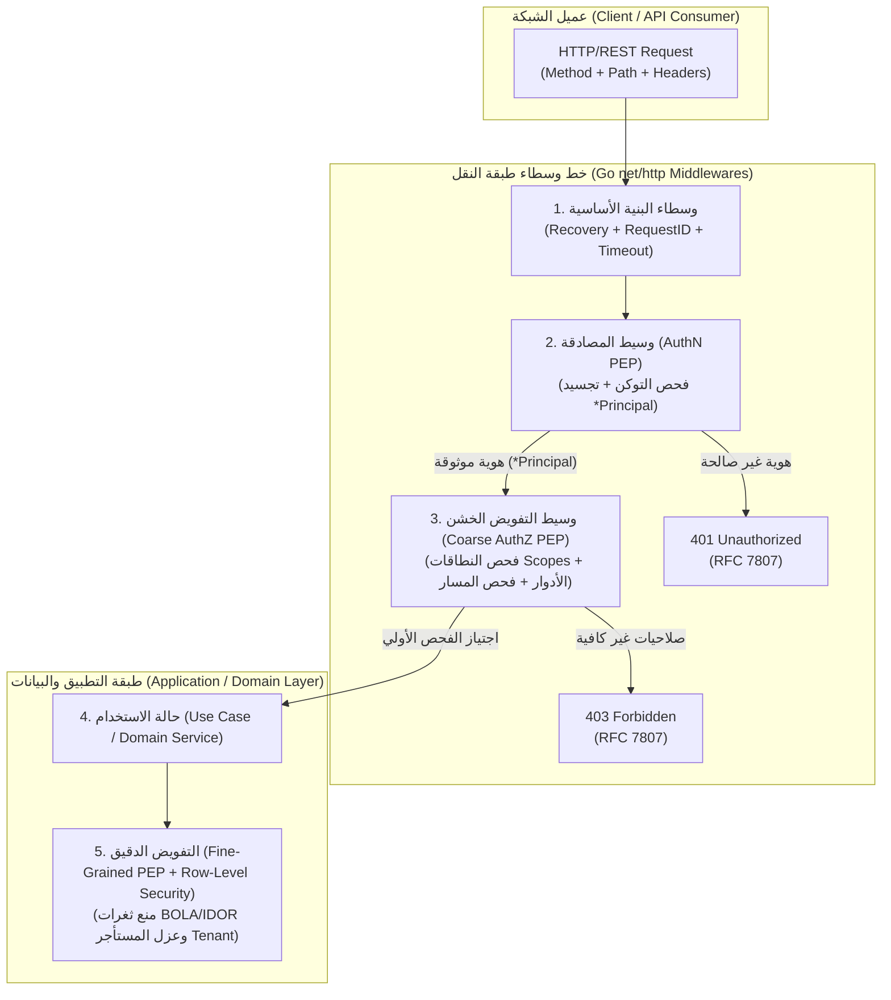
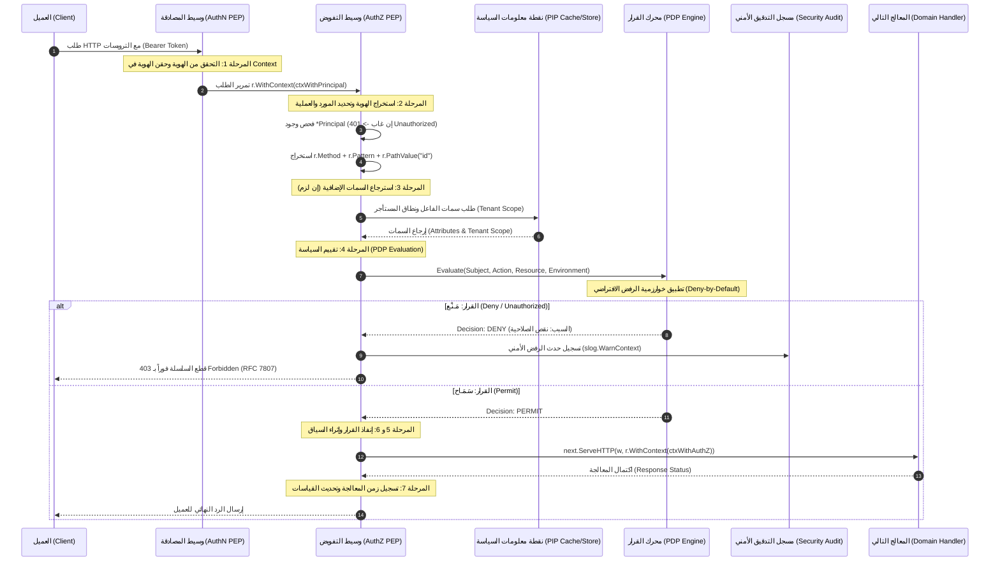

# تحليل معماري شامل: دورة حياة التفويض (Authorization Lifecycle) داخل وسطاء (Middlewares) لغة Go

---

## 1. المقدمة والتعريف المعياري (Executive Summary & Formal Standards)

تُمثل عملية **التفويض (Authorization - AuthZ)** الركن الثاني والأساسي في أمن التطبيقات والخدمات الخلفية. وإذا كانت **المصادقة (Authentication - AuthN)** تجيب عن تساؤل: *"مَن هو الفاعل؟ (Who is the subject?)"*، فإن **التفويض (Authorization - AuthZ)** يجيب عن تساؤل: *"ما الذي يُسمح لهذا الفاعل بتنفيذه، على أي مورد، وتحت أي ظروف بيئية؟ (What actions can this subject perform on which resource under what conditions?)"*.

في هندسة برمجيات **Go** عالية الأداء، لا يقتصر التفويض على مجرد فحص شرطي داخل دالة، بل هو **دورة حياة متعددة المراحل (Multi-Stage Lifecycle)** تبدأ فور وصول الطلب الشبكي عبر طبقة النقل (Transport Layer)، وتمر بسلسلة الوسطاء (**Middleware Pipeline**)، وصولاً إلى منطق الأعمال ومستوى السجلات في قاعدة البيانات (Row-Level Security).



### 1.1 المعايير المرجعية الرسمية (Normative References)

يستند هذا التحليل إلى المراجع الرسمية المعتمدة دولياً ومن قِبل مطوري لغة Go:

1. **المصادر الرسمية لموقع Go ([go.dev](https://go.dev))**:
   - حزمة المكتبة القياسية [`net/http`](https://pkg.go.dev/net/http): واجهات `Handler` و `HandlerFunc` وآليات تركيب الوسطاء عبر الدوال ذات الرتب الأعلى.
   - حزمة المكتبة القياسية [`context`](https://pkg.go.dev/context): التوجيه الرسمي لنقل بيانات الهوية عبر `context.WithValue` واستخدام أنواع المفاتيح الخاصة غير المصدّرة (`unexported contextKey`).
   - مقالة مدونة Go الرسمية: *"Go Concurrency Patterns: Context"* للكاتب Sameer Ajmani ([go.dev/blog/context](https://go.dev/blog/context)).
   - مقالة مدونة Go الرسمية: *"Contexts and structs"* للكاتبين Jean de Klerk و Matt T. Proud ([go.dev/blog/context-and-structs](https://go.dev/blog/context-and-structs)).
   - مقالة مدونة Go الرسمية: *"Routing Enhancements for Go 1.22"* للكاتب Jonathan Amsterdam ([go.dev/blog/routing-enhancements](https://go.dev/blog/routing-enhancements)) حول استخراج المتغيرات من المسارات عبر `r.PathValue()`.
   - التوثيق الأمني المباشر للغة: [go.dev/security/best-practices](https://go.dev/security/best-practices).
   - حزمة التشفير القياسية [`crypto/subtle`](https://pkg.go.dev/crypto/subtle): دالة `ConstantTimeCompare` لمنع هجمات التوقيت (Side-Channel Timing Attacks).
   - حزمة التزامن الخفيف [`sync/atomic`](https://pkg.go.dev/sync/atomic) و [`sync.RWMutex`](https://pkg.go.dev/sync): لتحديث جداول السياسات دون إيقاف المعالجة (Hot Reloading).

2. **معايير المعهد الوطني الأمريكي للمعايير والتقنية (NIST & ANSI)**:
   - **NIST SP 800-162**: دليل معمارية التحكم بالوصول القائم على السمات (ABAC) ونموذج المكونات الفيدرالي:
     - **PEP** (Policy Enforcement Point): نقطة إنفاذ السياسات (المتواجدة داخل الوسيط).
     - **PDP** (Policy Decision Point): نقطة اتخاذ القرار (المحرك الذي يفصل بين السماح والمنع).
     - **PIP** (Policy Information Point): نقطة تزويد السمات والبيانات (مستودع الكيانات والبيئة).
     - **PAP** (Policy Administration Point): نقطة إدارة وتحديث السياسات.
   - **ANSI/INCITS 359-2012**: المعيار المعماري للتحكم بالوصول القائم على الأدوار (RBAC).

3. **معايير IETF الدولية**:
   - **RFC 6749 / RFC 6750**: إطار تفويض OAuth 2.0، ونطاقات الوصول (`scopes`).
   - **RFC 7519**: رموز الويب بتنسيق JSON (JWT Claims).
   - **RFC 7807 / RFC 9457**: تنسيق أخطاء واجهات البرمجة المعياري (Problem Details for HTTP APIs).

4. **إرشادات أمان التطبيقات (OWASP API Security Top 10)**:
   - **API1:2023 - Broken Object Level Authorization (BOLA / IDOR)**.
   - **API5:2023 - Broken Function Level Authorization (BFLA)**.

---

## 2. فلسفة لغة Go الرسمية تجاه الـ Middlewares والتفويض

تتبنى لغة Go نهجاً برمجياً فريداً يختلف جذرياً عن الأطر الثقيلة في لغات أخرى (مثل Spring Security في Java أو NestJS Guards في TypeScript). ترتكز الفلسفة الرسمية لـ Go على المبادئ التالية:

### 2.1 غياب أطر العمل المفروضة والمكتبة القياسية الخفيفة (Standard Library Primacy)

لا توفر المكتبة القياسية لـ Go حزمة مخصصة باسم `authz` أو `rbac`. هذا ليس نقصاً في اللغة، بل هو **قرار تصميمي مقصود (Deliberate Design Decision)**:

- تمنح Go المطورين اللبنات التأسيسية فائقة السرعة (`net/http.Handler`) لإنشاء خطوط المعالجة بأسلوب تركيبي حر (`Composition over Framework Monopoly`).
- الـ Middleware في Go هو مجرد دالة تقبل `http.Handler` وتُرجع `http.Handler`:
  $$\text{Middleware} = f(\text{http.Handler}) \to \text{http.Handler}$$
- هذا التجريد البسيط يتيح دمج أي محرك تفويض خارجي (مثل Casbin أو Open Policy Agent - OPA أو محرك داخلي مكتوب يدوياً) دون أي قيود على بنية النظام.

### 2.2 عدم المساس بكائن الطلب الأصلي (Request Immutability & Concurrency Safety)

تنص وثائق Go الرسمية في حزمة `net/http` على أن كائن الطلب `*http.Request` يجب معاملته ككائن غير قابل للتعديل المباشر أثناء انتقاله بين الوسطاء المتزامنين:

- **القاعدة الذهبية**: عند حقن أي بيانات (مثل هوية المستخدم `Principal` أو قرار التفويض) في السياق، **يجب استخدام `r.WithContext(ctx)`** التي تُرجع نسخة سطحية جديدة (`Shallow Copy`) من الطلب مع السياق المحدث.
- تعديل الطلب في مكانه أو مشاركة مؤشرات غير آمنة بين Goroutines يؤدي إلى **Data Races** وانهيار الخادم تحت الضغط العالي.

```go
// الممارسة الرسمية المعتمدة في Go:
ctx := context.WithValue(r.Context(), principalKey, userPrincipal)
next.ServeHTTP(w, r.WithContext(ctx)) // تمرير النسخة المحمية
```

### 2.3 تحصين مفاتيح السياق بنوع غير مصدّر (Type-Safe Context Keying)

تحذر وثائق [`pkg.go.dev/context`](https://pkg.go.dev/context) صراحة من استخدام الأنواع الأولية البدائية مثل `string` أو `int` كمفاتيح داخل `context.WithValue`:
> *"To avoid allocating when assigning to an interface{}, context keys often have concrete type struct{}. Alternatively, the exported context key variable's static type should be a pointer or interface."*

إذا استخدمت حزمة مفتاحاً نصياً مثل `"user"`، واستخدمت حزمة خارجية أخرى نفس الكلمة، سيحدث تصادم كارثي للبيانات (Key Collision). الحل الرسمي الإلزامي في Go هو تعريف نوع بنية فارغة خاصة غير مصدّرة:

```go
// تعريف مفتاح خاص غير قابل للتصادم خارج هذه الحزمة
type contextKey struct{}

var principalContextKey = contextKey{}
```

### 2.4 الفصل المعماري بين النقل ومنطق الأعمال (Transport vs. Domain Decoupling)

الوسيط (Middleware) يقع حصراً في **طبقة النقل (Transport Layer)**. تشدد معايير Go النظيفة على منع تسريب أي تفاصيل نقل (مثل `*http.Request`، ترويسات HTTP، كعكات الجلسات، رموز التوكن الخام) إلى دوال طبقة الأعمال (Use Cases / Domain Layer). الوسيط يتولى فك تشفير وتطهير البيانات ثم يحقن فقط نموذج الهوية المطهر داخل `context.Context`.

---

## 3. دورة حياة التفويض السباعية داخل Middleware (The 7-Stage Authorization Lifecycle)

تتألف دورة حياة التفويض المتكاملة داخل وسيط Go من **سبع مراحل متتابعة ودقيقة**، تضمن الفشل السريع (Fail-Fast)، وحماية الذاكرة، والامتثال لمعايير Zero Trust:



---

### المرحلة 1: الاستلام والتحقق من سلامة الهوية (Ingress & Subject Extraction)

عند دخول الطلب إلى وسيط التفويض (`AuthZ Middleware`)، فإن الفرضية الأساسية هي أن وسيط المصادقة (`AuthN Middleware`) قد نفّذ مهمته مسبقاً.

- **التحقق من الشرط المسبق (Pre-Condition Check)**: يستخرج وسيط التفويض كائن الهوية `*Principal` من سياق الطلب `r.Context()`.
- **معالجة الغياب**: إذا لم يجد الوسيط كائن الهوية، فهذا يعني إما:
  1. وجود خطأ في ترتيب سلسلة الوسطاء (أصبح وسيط التفويض قبل وسيط المصادقة).
  2. محاولة تجاوز وسيط المصادقة.
- **رد الفعل المعياري**: في هذه الحالة، يجب على الوسيط **الفشل الفوري السريع (Fail-Fast)** وإرجاع **`401 Unauthorized`**، وتسجيل خطأ بنيوي في الخادم (`slog.ErrorContext`).

```go
principal, ok := contextkeys.GetPrincipal(r.Context())
if !ok || principal == nil {
    audit.LogSecurityAnomaly(r.Context(), "authz_middleware_missing_principal")
    problem.Write(w, http.StatusUnauthorized, "Authentication credentials are required.")
    return
}
```

---

### المرحلة 2: استبانة العملية والمورد المستهدف (Action & Resource Resolution)

يقوم الوسيط بتحديد طرفي معادلة التفويض:

1. **العملية المطلوبة (Action)**:
   - في بروتوكول HTTP، تُستنتج العملية الأساسية من طريقة الطلب (`r.Method`):
     - `GET` / `HEAD` $\to$ `read`
     - `POST` $\to$ `create`
     - `PUT` / `PATCH` $\to$ `update`
     - `DELETE` $\to$ `delete`
   - يمكن أيضاً تحديد عمليات دقيقة عبر دوال التغليف الخاصة (مثل عملية `approve_transfer` أو `export_ledger`).
2. **المورد المستهدف (Resource)**:
   - بدءاً من **Go 1.22+**، تتيح المكتبة القياسية استخراج معرّفات الموارد المتغيرة مباشرة عبر `r.PathValue("name")` ومطابقة المسارات بدقة عالية:
     - مسار: `GET /api/v1/accounts/{accountId}`
     - استخراج: `accountID := r.PathValue("accountId")`
   - يُحدد الوسيط فئة المورد (`resource_type = "account"`) ومعرّف المورد إن وُجد.

---

### المرحلة 3: نقطة معلومات السياسة وإثراء السمات (Policy Information Point - PIP)

في الأنظمة البسيطة (Flat RBAC)، قد تكفي الأدوار الموجودة داخل رمز الـ JWT (مثل `roles: ["accountant"]`). ولكن في الأنظمة المالية والمؤسسية المتقدمة:

- قد يحتاج الوسيط لبيانات سياقية وبيئية لا توجد في التوكن (مثل: هل المستأجر `TenantID` نشط؟ هل الحساب تحت التجميد القضائي؟ هل عنوان IP ضمن النطاق المسموح؟).
- يتم استرجاع هذه السمات من **PIP (Policy Information Point)**.
- **قاعدة الأداء العالي في Go**: لمنع تدمير معدل المعالجة (Throughput) نتيجة الاستعلام المتكرر من قاعدة البيانات في كل طلب، يجب أن تستخدم طبقة PIP:
  1. ذاكرة تخزين مؤقت داخلية (In-Memory L1 Cache) محمية بـ `sync.RWMutex`.
  2. أو ذاكرة موزعة فائقة السرعة (Redis L2 Cache) بمهلة استجابة صارمة (Timeout < 5ms).

---

### المرحلة 4: تقييم السياسة واتخاذ القرار (Policy Decision Point - PDP Evaluation)

يُرسل وسيط التفويض رباعية المدخلات القياسية إلى محرك السياسة:
$$\text{Decision} = \text{PDP}(\text{Subject}, \text{Action}, \text{Resource}, \text{Environment})$$

ترتكز فلسفة اتخاذ القرار في Go على القواعد الصارمة التالية:

1. **مبدأ المنع الافتراضي (Deny-by-Default)**: إذا لم توجد قاعدة صريحة تمنح الإذن، فالقرار الحتمي هو **الرفض (DENY)**.
2. **خوارزمية دمج القرارات (Decision Combining)**: خوارزمية **Deny-Overrides**؛ أي إذا سمحت قاعدة ومنعت قاعدة أخرى، يُرجّح المنع فوراً.
3. **الفشل المغلق (Fail-Closed)**: إذا حدث أي خطأ تقني داخلي أثناء استشارة السياسة (مثل انتهاء مهلة Context أو خطأ في الاتصال)، يُعامل الطلب كأنه ممنوع تماماً.

---

### المرحلة 5: إنفاذ القرار وقطع السلسلة (Policy Enforcement Point - PEP Action)

بناءً على نتيجة الـ PDP:

#### أ. مسار الرفض (Denial Flow - Short-Circuiting)

- **قطع السلسلة الفوري**: يمتنع الوسيط تماماً عن استدعاء `next.ServeHTTP(w, r)`.
- **تسجيل حدث التدقيق الأمني (Security Audit)**: تسجيل الحدث بمستوى `slog.WarnContext` متضمناً هوية المستخدم، المعرّف، المورد المطلوب، نوع العملية، وسبب الرفض.
- **توليد استجابة RFC 7807 برمز `403 Forbidden`**:
  - الرمز الدلالي الصارم: `403 Forbidden` (أو `codes.PermissionDenied` في gRPC).
  - **منع تسريب تفاصيل النظام الداخلي (Information Leakage)**: يجب ألا تذكر رسالة الخطأ تفاصيل تكوين السياسات الداخلية أو قواعد البيانات.

#### ب. مسار السماح (Permit Flow - Context Propagation)

- يقوم الوسيط بتسجيل بيانات التفويض المعتمَدة.
- يتم إنشاء سياق جديد يحمل وثيقة قرار التفويض، وتمرير نسخة سطحية من الطلب `r.WithContext(authzCtx)` إلى المعالج التالي في السلسلة:

  ```go
  next.ServeHTTP(w, r.WithContext(authzCtx))
  ```

---

### المرحلة 6: التفويض الدقيق على مستوى الكيانات (Fine-Grained / Domain Authorization)

**تحذير معماري حاسم**: من أخطر الأخطاء الشائعة في هندسة البرمجيات هو الاعتقاد بأن **الـ Middleware يستطيع وحده إنجاز 100% من مهام التفويض**.

| وجه المقارنة | تفويض الوسيط (Middleware / Coarse-Grained AuthZ) | تفويض النطاق (Domain / Fine-Grained AuthZ) |
| :--- | :--- | :--- |
| **المستوى** | مستوى النقل والمسارات والوظائف العامة (Functional Level). | مستوى سجلات البيانات الفردية وعزل الشركات (Object / Row Level). |
| **التغطية الأمنية** | يحمي من ثغرات **BFLA** (Broken Function Level Auth). | يحمي من ثغرات **BOLA / IDOR** (Broken Object Level Auth). |
| **معرفة الكيان** | يعرف فقط أن المسار هو `/api/v1/invoices/99` وأن العملية هي `DELETE`. | يعلم هل الفاتورة `99` تابعة للشركة `Tenant_A` وهل هي مدفوعة بالفعل أم مسودة. |
| **مكان التنفيذ** | داخل دوال وسطاء `net/http` (HTTP Middleware Chain). | داخل طبقة النطاق والتطبيق (`Application Use Case` و `Repository`). |

> **التكامل المعماري**: يتولى الوسيط الفحص الخشن الأولي (Fast-Fail)، وعندما يمر الطلب، تتولى طبقة الـ Use Case فحص الصلاحية الدقيقة بالاستعلام عن الكيان المالي الملموس من قاعدة البيانات والتأكد من مطابقة `tenant_id` وحالة الوثيقة.

---

### المرحلة 7: الخروج وتسجيل مؤشرات الأداء (Egress, Metrics & Post-Execution Audit)

بعد عودة التنفيذ من المعالجات اللاحقة (`next.ServeHTTP`):

- يحسب الوسيط الزمن المستغرق لاتخاذ قرار التفويض ($\Delta t$).
- تصدير المقاييس القياسية لمراقبة الأداء (OpenTelemetry / Prometheus Metrics):
  - `authz_eval_duration_seconds` (مخطط توزيع أزمنة تقييم السياسات).
  - `authz_decisions_total{status="permit|deny", policy="rbac|abac"}`.
- التحقق من عدم حدوث تجاوزات بعدية.

---

## 4. الفروق الجوهرية بين استجابات الخطأ: 401 Unauthorized مقابل 403 Forbidden

يعد الخلط بين رمزي الخطأ `401` و `403` من أكثر الأخطاء انتشاراً في واجهات برمجة التطبيقات، وله عواقب وخيمة على تجربة المستخدم والأمان:

```text
┌─────────────────────────────────────────────────────────────────────────────────┐
│                      تدفق التحقق الأمني والفصل الدلالي                          │
└─────────────────────────────────────────────────────────────────────────────────┘
                                         │
                                         ▼
                            هل تم تقديم إثبات هوية صحيح؟
                                (Valid Credentials?)
                                    /        \
                            لا (No)           نعم (Yes)
                               /                \
                              ▼                  ▼
                    ┌──────────────────┐    هل يمتلك الفاعل الصلاحية؟
                    │ 401 Unauthorized │    (Has Required Permission?)
                    │ (RFC 7807)       │           /        \
                    └──────────────────┘   لا (No)           نعم (Yes)
                                            /                  \
                                           ▼                    ▼
                                 ┌─────────────────┐   ┌─────────────────┐
                                 │  403 Forbidden  │   │  200 OK / Next  │
                                 │  (RFC 7807)     │   │  ServeHTTP      │
                                 └─────────────────┘   └─────────────────┘
```

1. **`401 Unauthorized` (المصادقة مفقودة أو غير صحيحة)**:
   - يُرجعها **وسيط المصادقة (AuthN Middleware)** فقط.
   - تعني: *"أنت غير معروف للنظام، يرجى تقديم توكن صالح أو تسجيل الدخول من جديد"*.
   - استجابة العميل التلقائية: توجيه المستخدم لصفحة تسجيل الدخول، أو محاولة تجديد التوكن عبر Refresh Token.
2. **`403 Forbidden` (الهوية معروفة ولكن الصلاحية مرفوضة)**:
   - يُرجعها **وسيط التفويض (AuthZ Middleware)** ومحرك السياسات.
   - تعني: *"نحن نعلم تماماً مَن أنت (هويتك صحيحة)، ولكنك لا تملك الامتيازات الكافية لتنفيذ هذا الإجراء"*.
   - استجابة العميل التلقائية: عرض رسالة حظر صلاحيات (Permission Denied)، **دون تسجيل خروج المستخدم**.

---

## 5. الأنماط الهندسية لتنفيذ وسطاء التفويض في Go (Production Architecture Patterns)

### النمط 1: مصنع الوسطاء المغلّف (Closure Factory Pattern)

النمط القياسي الأكثر كفاءة في Go لإنشاء وسطاء تفويض يقبلون بارامترات ديناميكية (مثل الصلاحية المطلوبة):

```go
// RequirePermission يُرجع وسيطاً يفحص صلاحية معينة
func RequirePermission(perm string, authorizer Authorizer) func(http.Handler) http.Handler {
    return func(next http.Handler) http.Handler {
        return http.HandlerFunc(func(w http.ResponseWriter, r *http.Request) {
            // تنفيذ دورة حياة التفويض
            ctx := r.Context()
            principal, ok := contextkeys.GetPrincipal(ctx)
            if !ok || principal == nil {
                problem.Write(w, http.StatusUnauthorized, "Authentication required")
                return
            }

            if !authorizer.HasPermission(ctx, principal, perm) {
                audit.LogDeniedAccess(ctx, principal.ID, perm, r.URL.Path)
                problem.Write(w, http.StatusForbidden, "Insufficient permissions to perform this action")
                return
            }

            next.ServeHTTP(w, r)
        })
    }
}
```

### النمط 2: حماية مسارات Go 1.22 عبر المجموعات الفرعية (Subrouting Guard Pattern)

مع تحسينات موجه المسارات في Go 1.22 (`http.ServeMux`)، يمكن تنظيم وتطبيق الوسطاء على مجموعات محددة من المسارات بنظافة معمارية تامة:

```go
func RegisterRoutes(mainMux *http.ServeMux, authN, requireAdmin func(http.Handler) http.Handler) {
    // 1. مسارات عامة لا تتطلب مصادقة أو تفويض
    mainMux.HandleFunc("GET /healthz", HealthHandler)
    mainMux.HandleFunc("POST /api/v1/auth/login", LoginHandler)

    // 2. موجه مخصص للعمليات المحمية
    protectedMux := http.NewServeMux()
    protectedMux.HandleFunc("GET /api/v1/invoices/{id}", GetInvoiceHandler)
    protectedMux.HandleFunc("POST /api/v1/invoices", CreateInvoiceHandler)

    // 3. موجه مخصص لعمليات الإدارة العليا (يتطلب دور Admin)
    adminMux := http.NewServeMux()
    adminMux.HandleFunc("POST /api/v1/admin/users", CreateUserHandler)
    adminMux.HandleFunc("DELETE /api/v1/admin/tenants/{id}", DeleteTenantHandler)

    // تركيب طبقات الحماية
    protectedHandler := authN(protectedMux)
    adminHandler := authN(requireAdmin(adminMux))

    mainMux.Handle("/api/v1/invoices/", protectedHandler)
    mainMux.Handle("/api/v1/admin/", adminHandler)
}
```

### النمط 3: التحديث الساخن للسياسات بدون أقفال خانقة (Zero-Lock Policy Hot-Reloading)

في بيئات التشغيل الإنتاجية التي تضم ملايين العمليات المتزامنة، يُعد استخدام `sync.Mutex` العادي لفحص الصلاحيات داخل الـ Middleware كارثة أدائية تُجمد الـ Goroutines. الحل المعياري في Go هو استخدام **`sync/atomic.Pointer`** أو **`sync.RWMutex`**:

```go
type FastMemoryPDP struct {
    policies atomic.Pointer[PolicyEngine]
}

func (p *FastMemoryPDP) HasPermission(role, action string) bool {
    // قراءة ذرية بدون أي قفل (Zero Lock Contention)
    engine := p.policies.Load()
    if engine == nil {
        return false // Fail-Closed
    }
    return (*engine).Check(role, action)
}

func (p *FastMemoryPDP) HotReload(newEngine PolicyEngine) {
    // تبديل المحرك ذرياً في الذاكرة دون انقطاع قراءة أي طلب نشط
    p.policies.Store(&newEngine)
}
```

---

## 6. تطبيق برمجي إنتاجي متكامل بلغة Go 1.22+ (Complete Production Implementation)

فيما يلي كود برمجي متكامل يوضح دورة حياة التفويض كاملة داخل وسيط HTTP، متوافقاً 100% مع المكتبة القياسية لـ Go، ومعايير RFC 7807، ونقل الهوية الآمن:

```go
package authz

import (
 "context"
 "encoding/json"
 "log/slog"
 "net/http"
 "sync/atomic"
 "time"
)

// -------------------------------------------------------------------------
// 1. مفاتيح السياق غير المصدّرة لحماية البيانات من التصادم (Context Security)
// -------------------------------------------------------------------------

type contextKey struct{}

var principalKey = contextKey{}

// Principal يمثل كائن الهوية المطهر الناتج عن وسيط المصادقة
type Principal struct {
 ID          string            `json:"id"`
 TenantID    string            `json:"tenant_id"`
 Roles       []string          `json:"roles"`
 Permissions map[string]struct{} `json:"-"`
}

// InjectPrincipal يحقن كائن الهوية في السياق
func InjectPrincipal(ctx context.Context, p *Principal) context.Context {
 return context.WithValue(ctx, principalKey, p)
}

// GetPrincipal يستخرج الهوية من السياق بنوع آمن
func GetPrincipal(ctx context.Context) (*Principal, bool) {
 p, ok := ctx.Value(principalKey).(*Principal)
 return p, ok && p != nil
}

// -------------------------------------------------------------------------
// 2. مغلف الأخطاء المعياري وفق مواصفة RFC 7807 (Problem Details)
// -------------------------------------------------------------------------

type ProblemDetails struct {
 Type     string `json:"type"`
 Title    string `json:"title"`
 Status   int    `json:"status"`
 Detail   string `json:"detail"`
 Instance string `json:"instance,omitempty"`
}

func writeProblem(w http.ResponseWriter, status int, title, detail, path string) {
 w.Header().Set("Content-Type", "application/problem+json")
 w.Header().Set("X-Content-Type-Options", "nosniff")
 w.WriteHeader(status)
 _ = json.NewEncoder(w).Encode(ProblemDetails{
  Type:     "about:blank",
  Title:    title,
  Status:   status,
  Detail:   detail,
  Instance: path,
 })
}

// -------------------------------------------------------------------------
// 3. واجهة محرك اتخاذ قرار التفويض (PDP Interface & Implementation)
// -------------------------------------------------------------------------

type DecisionPoint interface {
 Authorize(ctx context.Context, p *Principal, requiredPermission string) bool
}

type InvertedIndexPDP struct {
 // يمكن توسيعها لمحركات OPA أو Casbin أو تخزين في الذاكرة
}

func (pdp *InvertedIndexPDP) Authorize(ctx context.Context, p *Principal, requiredPermission string) bool {
 if p == nil || p.Permissions == nil {
  return false // Fail-Closed: منع افتراضي قطعي
 }
 _, allowed := p.Permissions[requiredPermission]
 return allowed
}

// -------------------------------------------------------------------------
// 4. وسيط التفويض وإنفاذ السياسة (Authorization PEP Middleware)
// -------------------------------------------------------------------------

type SecurityLogger interface {
 WarnContext(ctx context.Context, msg string, args ...any)
}

// AuthorizeMiddleware يبني وسيطاً ينفذ دورة حياة التفويض كاملة
func AuthorizeMiddleware(requiredPermission string, pdp DecisionPoint, logger SecurityLogger) func(http.Handler) http.Handler {
 return func(next http.Handler) http.Handler {
  return http.HandlerFunc(func(w http.ResponseWriter, r *http.Request) {
   startTime := time.Now()
   ctx := r.Context()

   // [المرحلة 1]: استخراج الهوية والتحقق من الشرط المسبق
   principal, ok := GetPrincipal(ctx)
   if !ok {
    logger.WarnContext(ctx, "unauthenticated request reached authorization middleware",
     "path", r.URL.Path,
     "method", r.Method,
    )
    writeProblem(w, http.StatusUnauthorized, "Unauthorized", "Authentication is required to access this resource.", r.URL.Path)
    return
   }

   // [المرحلة 2 و 3 و 4]: استبانة العملية واستشارة محرك القرار PDP
   isAllowed := pdp.Authorize(ctx, principal, requiredPermission)

   // [المرحلة 5]: إنفاذ القرار
   if !isAllowed {
    // تدقيق أمني عالي الأهمية للرفض
    logger.WarnContext(ctx, "security access denied",
     "subject_id", principal.ID,
     "tenant_id", principal.TenantID,
     "required_permission", requiredPermission,
     "method", r.Method,
     "path", r.URL.Path,
     "duration_ns", time.Since(startTime).Nanoseconds(),
    )

    // قطع السلسلة بـ 403 Forbidden دون كشف أسرار النظام
    writeProblem(w, http.StatusForbidden, "Forbidden", "You lack sufficient permissions to perform this action.", r.URL.Path)
    return
   }

   // [المرحلة 6]: السماح وتمرير النسخة المحمية للطلب
   // المعالج التالي يستلم السياق الموثوق به ويستكمل التفويض الدقيق على الكيانات
   next.ServeHTTP(w, r)

   // [المرحلة 7]: بعد انتهاء المعالجة - تسجيل مؤشرات الأداء إن لزم
  })
 }
}
```

---

## 7. مصفوفة مكافحة الأنماط والمخاطر الشائعة (Anti-Patterns & Traps)

توضح هذه المصفوفة الأخطاء الشائعة والبديل المعماري الصحيح وفق أفضل الممارسات الموثقة:

| النمط المضاد (Anti-Pattern) | العواقب والمخاطر الأمنية | النهج المعماري الصحيح في Go |
| :--- | :--- | :--- |
| **دمج AuthN و AuthZ في وسيط واحد** | خرق مبدأ المسؤولية الفردية (SRP)، واستحالة تطبيق وسطاء منفصلين للمسارات المختلفة. | الفصل الصارم: وسيط المصادقة يسبق دائماً وسيط التفويض في السلسلة. |
| **استخدام مفاتيح نصوص خام في Context** (`context.WithValue(ctx, "user", u)`) | حدوث تصادم مفاتيح (Key Collisions) مع مكتبات خارجية أخرى. | تعريف نوع مخصص غير مصدّر: `type ctxKey struct{}`. |
| **محاولة حل BOLA/IDOR داخل الـ Middleware فقط** | ثغرات سرقة البيانات بين الشركات والمستأجرين لأن الوسيط يجهل حالة الكيان في قاعدة البيانات. | حصر دور الوسيط في التفويض الوظيفي (BFLA)، وإلزام طبقة الـ Use Case و RLS بالتحقق من ملكية الكيان. |
| **تعديل الطلب مباشرة دون `r.WithContext()`** | حدوث سباقات بيانات (Data Races) بين الـ Goroutines وانهيار الخادم تحت الضغط. | استخدام `r.WithContext(newCtx)` الذي يُنتج نسخة سطحية جديدة وآمنة للتزامن. |
| **إرجاع 401 بدلاً من 403 عند نقص الصلاحية** | قيام العميل بحذف جلسة المستخدم وتوجيهه لصفحة تسجيل الدخول رغم صحة هويته. | الالتزام الصارم بـ 401 فقط للمصادقة المفقودة، و 403 لعجز الصلاحيات. |
| **تسريب تفاصيل السياسة في ردود الخطأ** | منح المهاجمين خريطة دقيقة لتسميات الصلاحيات ونظام الأمان الداخلي. | إرجاع رسالة موحدة ومقتضبة مطابقة لـ RFC 7807، وتسجيل التفاصيل داخلياً في السجلات الأمنية فقط. |
| **استخدام أقفال استبعاد عامة (`sync.Mutex`)** | تجميد الخادم وانخفاض معدل نقل البيانات (Throughput Collapse). | استخدام هياكل قراءة غير مقفلة (`sync/atomic.Pointer` أو `sync.RWMutex`). |

---

## 8. الخاتمة والتوصيات التنفيذية لمشروع Cashflow

1. **الاعتماد على إمكانيات Go 1.22+**: استغلال التوجيه المحسن في المكتبة القياسية لربط وسطاء التفويض بمجموعات محددة من المسارات، واستخراج معرّفات الموارد المتغيرة مباشرة عبر `r.PathValue()`.
2. **تثبيت حراس PEP عند المداخل**: جعل كل وسيط تفويض يعمل كـ Policy Enforcement Point مستقل، يطبق قاعدة المنع الافتراضي (Deny-by-Default).
3. **الدفاع في العمق (Defense in Depth)**: عدم الاكتفاء بالـ Middlewares؛ بل فرض فحص عزل الشركات (`tenant_id`) ومطابقة الملكية في كل استعلام استرجاع أو تحديث في قاعدة البيانات (Row-Level Security).
4. **التدقيق الأمني المستمر**: تسجيل كل محاولة وصول مرفوضة مع بصمة الفاعل الكاملة لدعم تحليلات مركز العمليات الأمنية (SOC).
