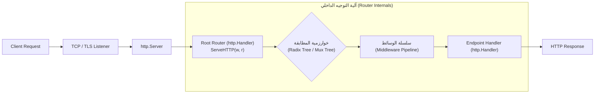
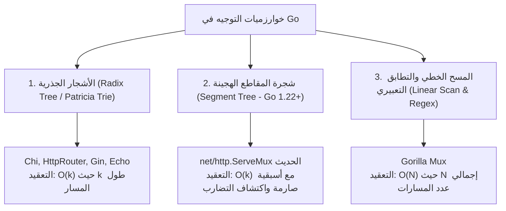
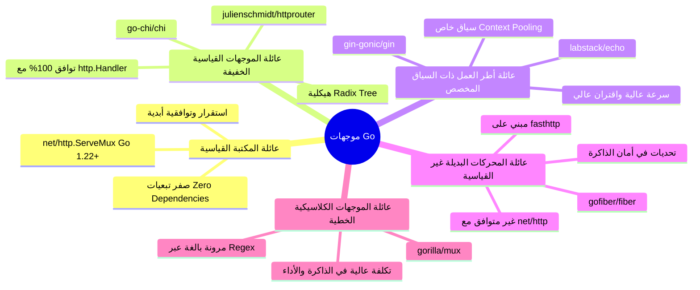
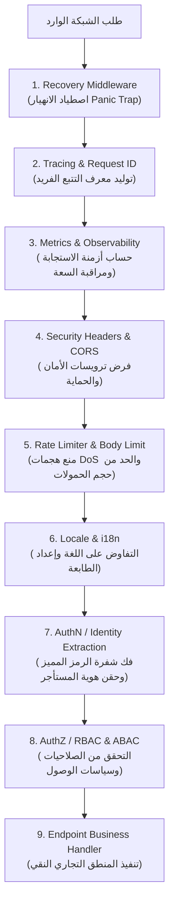

# التحليل المعماري والهندسي الشامل لموجهات لغة Go (Go Routers Architecture): الآليات، الأنواع، مصفوفة الاختيار، وأفضل الممارسات الإنتاجية

---

## 1. المقدمة والملخص التنفيذي (Executive Summary)

تُمثل **موجهات الشبكة (HTTP Routers / Multiplexers)** في لغة **Go** حجر الأساس وعصب الدخول الرئيسي (Ingress Gateway) لأي خدمة ويب أو بنية سحابية موزعة (Microservices). تتميز لغة Go بفلسفة معمارية صارمة ترتكز على **البساطة، الصراحة (Explicitness)، والتكوين البرمجي عبر الواجهات القياسية (Composition over Inheritance)** بدلاً من الاعتماد على أطر العمل العملاقة والغامضة (Black-box Frameworks).

تاريخياً، كان التوجيه في Go يعتمد على واجهة أساسية واحدة داخل المكتبة القياسية:

```go
type Handler interface {
    ServeHTTP(ResponseWriter, *Request)
}
```

حتى الإصدار **Go 1.21**، كان الموجه المدمج `http.ServeMux` بسيطاً للغاية، إذ كان يقتصر على مطابقة البادئة (Prefix Matching) والتطابق التام للسلاسل النصية دون دعم مدمج لطرائق HTTP (مثل `GET`, `POST`) أو المتغيرات الديناميكية داخل المسار (`/users/{id}`). هذا القصور دفع مجتمع Go على مدار عقد كامل لتطوير ترسانة من الموجهات الخارجية التي اعتمدت هياكل بيانات متقدمة كأشجار البادئات الجذرية (Radix Trees / Patricia Tries) مثل `httprouter` و `chi`، أو أطر عمل متكاملة ذات سياق مخصص مثل `gin` و `echo`.

مع إطلاق **Go 1.22** في أوائل عام 2024 (الورقة الهندسية والمدونة الرسمية لفريق Go بقيادة *Jonathan Amsterdam*)، تلقى `http.ServeMux` أكبر ترقية معمارية في تاريخه، حيث أُضيف دعم أصيل لطرائق HTTP والمتغيرات البرمجية (`Wildcards`) وقواعد أسبقية صارمة تُفحص عند الإقلاع (Compile/Startup Panic on Conflict).

### أهداف هذه الوثيقة

تهدف هذه الدراسة إلى تقديم تحليل معماري ومقارنة هندسية استناداً إلى **المصادر الرسمية للغة Go** (المدونة الرسمية، وثائق `net/http`، مقترحات التصميم RFCs، والمصادر مفتوحة المصدر القياسية) لتغطية:

1. **كيف يتم التعامل مع التوجيه في Go**: ميكانيكا العمل تحت الغطاء (Under the Hood)، الواجهات الأساسية، دورة حياة الطلب، وخوارزميات المطابقة.
2. **تصنيف الموجهات وأنواعها**: دراسة تفصيلية لخمس عائلات رئيسية من الموجهات في بيئة Go.
3. **مصفوفة اتخاذ القرار (When to Use Which)**: تحليل المزايا والمثالب والتكلفة الحوسبية ومخاطر سلاسل التوريد (Supply Chain Risks) لكل نوع.
4. **أفضل الممارسات الإنتاجية (Production Best Practices)**: بناء سلاسل الوسائط (Middleware Pipelines)، حماية السياق (`context.Context`)، الالتزام بمعايير RFC (مثل RFC 9110 و RFC 7807)، وأمان تسوية المسارات (Path Traversal Protection).

---

## 2. المرجعيات والمصادر الرسمية المعتمدة (Official References)

تستند هذه الدراسة المعمارية إلى المراجع القياسية التالية:

1. **مدونة Go الرسمية (Official Go Blog):**
   - المقال المرجعي: *"Routing Enhancements for Go 1.22"* — بقلم Jonathan Amsterdam (13 فبراير 2024).
   - الرابط: [go.dev/blog/routing-enhancements](https://go.dev/blog/routing-enhancements)
2. **الوثائق الرسمية للمكتبة القياسية (`net/http`):**
   - حزمة التوجيه وأنماط المسارات: [pkg.go.dev/net/http#hdr-Patterns](https://pkg.go.dev/net/http#hdr-Patterns)
   - واجهات `http.Handler` و `http.ServeMux` وتوابع `Request.PathValue`.
3. **مقترح تصميم توجيه Go 1.22 (Go Design Proposal & Discussions):**
   - مقترح تحسين المطابقة: [Go Issue #61410](https://github.com/golang/go/issues/61410) و [Discussion #60227](https://github.com/golang/go/discussions/60227).
4. **معايير هندسة الإنترنت ذات الصلة (RFC Standards):**
   - **RFC 9110 (HTTP Semantics):** معايير أساليب HTTP، واستجابة `405 Method Not Allowed` وفرض ترويسة `Allow`.
   - **RFC 3986 (Uniform Resource Identifier):** المعايير القياسية لتركيب المسارات وتسويتها (Path Normalization).
   - **RFC 7807 / RFC 9457 (Problem Details for HTTP APIs):** التنسيق القياسي لرسائل أخطاء الموجهات وتطبيقات HTTP.
5. **مستودعات الموجهات المفتوحة المصدر القياسية في مجتمع Go:**
   - **Chi Router:** [github.com/go-chi/chi](https://github.com/go-chi/chi) (الموجه المعتمد في هذا المشروع).
   - **HttpRouter:** [github.com/julienschmidt/httprouter](https://github.com/julienschmidt/httprouter).
   - **Gin Web Framework:** [github.com/gin-gonic/gin](https://github.com/gin-gonic/gin).
   - **Echo Framework:** [github.com/labstack/echo](https://github.com/labstack/echo).
   - **Fiber Framework:** [github.com/gofiber/fiber](https://github.com/gofiber/fiber).

---

## 3. المبادئ التأسيسية: كيف تعمل موجهات Go تحت الغطاء؟ (Under the Hood)

### 3.1 الواجهة الذهبية `http.Handler` وتجريد الخادم

في لغة Go، أي كائن يمكنه معالجة طلب HTTP هو كائن يحقق واجهة `http.Handler`:

```go
package http

type Handler interface {
    ServeHTTP(ResponseWriter, *Request)
}
```

الموجه في جوهره (سواء كان `http.ServeMux` أو `chi.Mux`) ليس سوى `http.Handler` عملاق! مهمته الوحيدة تنحصر في:

1. استلام الطلب الخام `*http.Request` ومستقبل الاستجابة `http.ResponseWriter`.
2. فحص خصائص الطلب: أسلوب HTTP (Method)، المسار (Path)، والنطاق (Host).
3. البحث في جدول أو شجرة التوجيه الداخلية لاختيار الـ `Handler` الفرعي المناسب.
4. تفويض التنفيذ إليه عبر استدعاء دالة `ServeHTTP` الخاصة به.



### 3.2 محول الدوال `http.HandlerFunc`

لتبسيط كتابة المعالجات كدوال عادية دون الحاجة لإنشاء `struct` وتطبيق الواجهة يدوياً، توفر Go محول النوع `http.HandlerFunc`:

```go
type HandlerFunc func(ResponseWriter, *Request)

// ServeHTTP ينفذ الدالة نفسها، مما يجعل HandlerFunc محققاً لواجهة Handler
func (f HandlerFunc) ServeHTTP(w ResponseWriter, r *Request) {
    f(w, r)
}
```

هذا النمط التكويني الأنيق يُعد من أعظم ركائز Go، حيث يسمح بمعاملة الدوال ككائنات من الدرجة الأولى (First-Class Citizens) وربطها بسلاسة مع أي موجه يلتزم بالمعيار.

---

### 3.3 خوارزميات التوجيه وهياكل البيانات (Routing Data Structures & Algorithms)

تختلف موجهات Go جذرياً في طريقة تخزين ومطابقة المسارات، وتندرج تحت ثلاث خوارزميات رئيسية:



#### 1. الأشجار الجذرية (Radix Tree / Patricia Trie)

- **آلية العمل:** شجرة بحث مضغوطة تشترك فيها المسارات في البادئات المشتركة (Common Prefixes). بدلاً من تخزين كل مسار كعقد مستقلة لكل حرف، تُدمج الحواف التي ليس لها تفرعات.
- **مثال:** المسارات `/users`, `/users/{id}`, `/users/{id}/orders` يتم تمثيلها كعقدة جذر `/users` تتفرع إلى عقدة ديناميكية `{id}` والتي بدورها تتفرع إلى `/orders`.
- **التعقيد الزمني:** $O(k)$ حيث $k$ هو طول المسار النصي للطلب القادم، وهو **مستقل تماماً** عن إجمالي عدد المسارات المسجلة في التطبيق ($N$).
- **المحركات المتبنية:** `httprouter`, `chi`, `gin`, `echo`.

#### 2. شجرة المقاطع الهجينة في Go 1.22+ (`net/http.ServeMux`)

- **آلية العمل:** يقسم الموجه المسار إلى مقاطع مفصولة بشرطة مائلة (`/`). يقوم ببناء شجرة تعتمد على مفاتيح المقاطع: مقاطع ثابتة (Literal Segments)، مقاطع متغيرة مفردة (`{param}`)، ومقاطع متغيرة متعددة (`{param...}`).
- **التعقيد الزمني:** $O(m)$ حيث $m$ هو عدد مقاطع المسار، مع زمن بحث سريع جداً مستند إلى جداول تجزئة داخلية للمقاطع الثابتة.

#### 3. المسح الخطي والتطابق التعبيري (Linear Array of Matchers)

- **آلية العمل:** تُخزن المسارات في مصفوفة مرتبة، وعند وصول الطلب يتم المرور تتابعياً ($Linear\ Iteration$) على كل مسار واختبار شروطه (Regex, Method, Headers, Queries).
- **التعقيد الزمني:** $O(N \cdot M)$ حيث $N$ هو عدد المسارات، و $M$ تكلفة تنفيذ التعبير النمطي.
- **المحركات المتبنية:** `gorilla/mux`.

---

## 4. التصنيف الشامل لأنواع الموجهات في Go (Taxonomy of Go Routers)

تنقسم الموجهات في بيئة عمل Go إلى خمس عائلات رئيسية تتباين في فلسفتها وتوافقيتها وأدائها:



---

### 4.1 العائلة الأولى: موجه المكتبة القياسية المطور (`net/http.ServeMux` في Go 1.22+)

أحدثت Go 1.22 ثورة في التوجيه المدمج بحل معضلتين رئيسيتين دون المساس باستقرار اللغة:

#### 1. بنية الأنماط المدعومة (Pattern Syntax)

تأخذ صيغة النمط في Go 1.22+ الشكل العام: `[METHOD ][HOST]/[PATH]`

- **مطابقة الطريقة (Method Matching):**

  ```go
  mux.HandleFunc("GET /items", getItemsHandler)
  mux.HandleFunc("POST /items", createItemHandler)
  ```

- **المعاملات المتغيرة الفردية (Single-segment Wildcard `{name}`):**
  تطابق مقطعاً واحداً فقط حتى علامة `/`:

  ```go
  mux.HandleFunc("GET /users/{id}", getUserHandler)
  ```

  داخل المعالج، يتم استخراج القيمة عبر الدالة الرسمية:

  ```go
  id := r.PathValue("id")
  ```

- **المعاملات المتغيرة المتعددة (Multi-segment Wildcard `{name...}`):**
  تطابق جميع المقاطع المتبقية في نهاية المسار (تصلح لخدمة الملفات أو المسارات الهرمية):

  ```go
  mux.HandleFunc("GET /static/{filepath...}", fileServerHandler)
  ```

- **المطابقة التامة للنهاية (`{$}`):**
  افتراضياً، أي مسار ينتهي بـ `/` يعتبر مسار بادئة (Prefix)، وإذا أردت أن يطابق المسار `/admin/` فقط دون أن يطابق `/admin/settings`، يتم إنهاؤه بـ `{$}`:

  ```go
  mux.HandleFunc("GET /admin/{$}", adminDashboardHandler)
  ```

#### 2. خوارزمية حسم النزاع والأسبقية الصارمة (Precedence & Conflict Resolution)

تتبع Go 1.22 قاعدة هندسية رياضية صارمة: **النمط الأكثر تحديداً (Most Specific) يفوز دائماً بصرف النظر عن ترتيب التسجيل في الكود:**

1. النمط الذي يحدد أسلوباً (`GET /path`) يفوق النمط العام (`/path`).
2. النمط الذي يحدد نطاقاً (`example.com/path`) يفوق النمط بدون نطاق.
3. المقطع الثابت (`/items/new`) أكثر تحديداً من المتغير (`/items/{id}`).
4. المتغير الفردي (`{id}`) أكثر تحديداً من المتغير الشامل (`{path...}`).

> [!IMPORTANT]
> **اكتشاف التضارب والانهيار الفوري (Panic on Ambiguity):**
> إذا وجد الموجه نمطين متداخلين يتعذر رياضيّاً تحديد أيهما أكثر تخصيصاً (مثال: `/users/{id}` و `/{entity}/123`)، يقوم الخادم بـ `panic` فوراً أثناء الإقلاع (`Startup Time`) مع طباعة رسالة تفصيلية تشرح المسارات المتنازعة بدلاً من التصرف بغموض وقت التشغيل.

---

### 4.2 العائلة الثانية: الموجهات القياسية الخفيفة (Idiomatic `net/http` Compatible Routers)

هذه الفئة هي **المعيار الذهبي لشركات التقنية والأنظمة الإنتاجية الكبرى**. لا تعيد اختراع العجلة، وتلتزم 100% بتوقيع `http.Handler` القياسي، ولكنها توفر إمكانيات هندسية متقدمة في تجميع المسارات وإدارة سلاسل الوسائط (Middleware Composition).

#### 1. موجه Chi (`github.com/go-chi/chi/v5`) — الخيار المعتمد في المشروع

- **الفلسفة:** مبني بالكامل على مكتبة Go القياسية، **صفر اعتمادات خارجية (Zero External Dependencies)**، كود نظيف وصغير جداً (~1000 سطر شجرة جذرية).

- **أبرز الإمكانيات المعمارية:**
  - تجميع المسارات المنطقي وتفريعها: `r.Route("/api/v1", func(r chi.Router) { ... })`.
  - تطبيق وسائط متخصصة على مجموعات فرعية دون التأثير على بقية التطبيق:

    ```go
    r.Group(func(r chi.Router) {
        r.Use(authMiddleware)
        r.Get("/profile", getProfile)
    })
    ```

  - حقن واستخراج معاملات المسار في الـ Context القياسي: `chi.URLParam(r, "id")`.
  - وسائط مدمجة احترافية وقابلة للإيقاف: `middleware.RequestID`, `middleware.RealIP`, `middleware.Logger`, `middleware.Recoverer`, `middleware.Timeout`.
  - توافق مطلق: أي وسيطة في Chi هي دالة قياسية:

    ```go
    func(http.Handler) http.Handler
    ```

#### 2. موجه HttpRouter (`github.com/julienschmidt/httprouter`)

- **الفلسفة:** مهووس بالأداء الأقصى وتخفيض تخصيصات الذاكرة إلى الصفر (Zero Allocations).

- **المزايا:**
  - أول من ابتكر استخدام Radix Tree فائق السرعة في Go.
  - التزام صارم بمعيار RFC 9110: يقوم تلقائياً بإنشاء ردود `405 Method Not Allowed` مع ترويسة `Allow` تحتوي على الطرائق المتاحة للمسار دون أي كود إضافي.
  - معالجة ذكية وتلقائية للشرطات المائلة في نهاية المسارات (Automatic Trailing Slash Redirects).
- **العيوب والمثالب:**
  - توقيع المعالج تاريخياً كان مخصصاً: `Handle(w, r, Params)` مما تطلب محولات للعمل مع `http.Handler`.
  - شجرته الجذرية صارمة جداً؛ لا تسمح بوجود مسار ديناميكي ومسار بنهاية عامة (Catch-All) على نفس التفرع إذا تداخلت.

---

### 4.3 العائلة الثالثة: أطر العمل متكاملة المكونات ذات السياق المخصص (Custom-Context Web Frameworks)

تستبدل هذه الأطر توقيع الدالة القياسي `http.Handler` بكائن سياق خاص يغلف الطلب والاستجابة معاً.

#### 1. إطار عمل Gin (`github.com/gin-gonic/gin`)

- **آلية العمل:** يعتمد على شجرة جذرية مأخوذة من HttpRouter، ولكنه يمرر كائناً ضخماً اسمه `*gin.Context` لكل دالة معالجة:

  ```go
  func(c *gin.Context)
  ```

- **المزايا:**
  - سهولة وسرعة تطوير واجهات REST البدائية للفرق المبتدئة.
  - معالجة وتضمين JSON جاهز: `c.JSON(200, data)` و `c.ShouldBindJSON(&req)`.
  - مجتمع ضخم جداً ومكتبات وسائط جاهزة.

- **المثالب والتحذيرات المعمارية:**
  - **الارتباط الوثيق (Vendor Lock-in):** تلتصق طبقات التطبيق بكائن `*gin.Context`، مما يمنع نقل الكود إلى مكتبات أخرى أو مشاركته مع بروتوكولات أخرى مثل gRPC.
  - **خطر التزامن (Concurrency Hazard with Goroutines):** يقوم Gin بتدوير كائنات السياق في الذاكرة عبر `sync.Pool` لتسريع الأداء. إذا أطلقت `go routine` داخل معالج واستخدمت `c` مباشرة بعد انتهاء المعالج الأصلي، سيحدث **تلف في الذاكرة وسباق بيانات (Data Race)** لأن السياق يعاد استخدامه لطلب عميل آخر! الحل الإجباري هو عمل نسخة يدوية: `cCopy := c.Copy()`.

#### 2. إطار عمل Echo (`github.com/labstack/echo/v4`)

- **آلية العمل:** مشابه لـ Gin لكنه يتميز بتصميم كودي أكثر أناقة وتماسكاً، مع واجهة `echo.Context`.

- **المزايا:** يدعم ربط البيانات المتقدم، وتضمين WebSocket، ومعالجة مركزية قوية للأخطاء عبر `echo.HTTPErrorHandler`.

---

### 4.4 العائلة الرابعة: الموجهات المبنية على بدائل `net/http` (Fasthttp-based Routers)

#### إطار عمل Fiber (`github.com/gofiber/fiber/v2` / `v3`)

- **الفلسفة:** مبني فوق محرك `valyala/fasthttp` بدلاً من المكتبة القياسية `net/http`، محاكياً بيئة `Express.js` الخاصة بـ Node.js لجذب مطوري JavaScript إلى Go.

- **المزايا الظاهرية:** نتائج قياس أداء استعراضية (Micro-benchmarks) عالية السرعة جداً بفضل تفادي تخصيصات الذاكرة بالكامل وتجاوز مكتبة Go القياسية.
- **المخاطر والعيوب المعمارية الخطيرة (Architectural Pitfalls):**
  1. **القطيعة التامة مع معايير Go:** لا يتوافق إطلاقاً مع واجهة `http.Handler`. لا يمكنك استخدام أي مكتبة قياسية (مثل حزم Prometheus القياسية، وسائط المصادقة الرسمية، أو مكتبات OpenTelemetry القياسية) دون كتابة محولات مخصصة مكلفة.
  2. **خطر إعادة تدوير مصفوفات البايت (Zero-Copy Buffer Hazards):** للحفاظ على الصفرية في التخصيص، يعيد `fasthttp` استخدام مصفوفات البايت الخاصة بالطلب. قراءة البيانات أو ترويسات الطلب وتخزينها في متغيرات مستمرة أو تمريرها إلى Goroutine ينتج عنه بيانات تالفة فور إرسال الرد، ما لم تستدعِ دوال النسخ العميق يدويّاً `c.Immutable()`.
  3. **قيود على بروتوكولات HTTP الحديثة:** تعقيدات في دعم HTTP/2 و HTTP/3 مقارنة بالدعم الطبيعي في `net/http`.

---

### 4.5 العائلة الخامسة: الموجهات التاريخية بالمسح الخطي والتعابير النمطية (Linear & Regex Routers)

#### موجه Gorilla Mux (`github.com/gorilla/mux`)

- **الفلسفة:** كان الموجه القياسي الفعلي لمجتمع Go بين عامي 2012 و 2018 بفضل مرونته غير المسبوقة في مطابقة أي جزء من الطلب (Regex في المسارات، المطابقة بناءً على ترويسات مخصصة `Headers("X-App-Version", "v2")`، معاملات الاستعلام `Queries("page", "{page}")`، أو حتى بروتوكولات التشفير).

- **المثالب:**
  - يعتمد على الفحص الخطي والتعابير النمطية مما يجعله بطيئاً جداً ومكلفاً في استهلاك المعالج وتخصيص الذاكرة مع نمو عدد المسارات ($O(N)$).
  - توقف مشروعه لفترة عن الصيانة النشطة قبل أن تتبناه مؤسسات جديدة، ولم يعد خياراً مفضلاً للمشاريع الحديثة عالية الأداء.

---

## 5. مصفوفة المقارنة المعمارية الشاملة (Comparative Matrix)

يوضح الجدول التالي تحليلاً هندسياً دقيقاً عبر أهم المحاور المعمارية:

| المعيار الهندسي | Go 1.22+ `ServeMux` | Chi (`chi/v5`) | HttpRouter | Gin (`gin-gonic`) | Fiber (`fasthttp`) |
| :--- | :--- | :--- | :--- | :--- | :--- |
| **هيكل البيانات / الخوارزمية** | شجرة مقاطع هجينة (Segment Tree) | شجرة بادئات جذرية (Radix Tree) | شجرة بادئات جذرية مضغوطة | شجرة بادئات مخصصة لكل طريقة | شجرة مدمجة لـ fasthttp |
| **التعقيد الزمني للمطابقة** | $O(k)$ | $O(k)$ | $O(k)$ | $O(k)$ | $O(k)$ |
| **التوافق مع `http.Handler`** | أصيل 100% (Native) | أصيل 100% (Native) | عبر محول بسيط | عبر محولات `WrapH/F` | **غير متوافق إطلاقاً** |
| **الاعتمادات الخارجية (Dependencies)** | **صفر (ضمن Go)** | **صفر (صفر حزم خارجية)** | صفر (حزم خارجية) | متعددة وكبيرة | متعددة وخاصة بـ fasthttp |
| **تجميع المسارات (Route Grouping)** | بدائي (يتطلب تركيب يدوي) | **استثنائي (`r.Route` / `r.Group`)** | محدود جداً | ممتاز (`r.Group`) | ممتاز (`app.Group`) |
| **وسائط متخصصة للمجموعات** | معقد ويتطلب Wrapper | **سلس ومباشر (`r.Use`)** | غير مدعوم أصيلاً | ممتاز | ممتاز |
| **استخراج المعاملات** | `r.PathValue("id")` | `chi.URLParam(r, "id")` | `ps.ByName("id")` | `c.Param("id")` | `c.Params("id")` |
| **دعم RFC 9110 (رد 405 تلقائي)** | مدمج جزئياً (يولد 405) | يدعم مع وسيطة مخصصة | **تلقائي وصارم مع Allow** | يدعم عبر إعدادات الراوتر | يدعم عبر إعدادات |
| **مخاطر الذاكرة مع الـ Goroutines** | **آمن تماماً (Safe)** | **آمن تماماً (Safe)** | **آمن تماماً (Safe)** | يتطلب `c.Copy()` بحذر | **خطير جداً (تلف بايتات)** |
| **الاستقرار المستقبلي (Longevity)** | استقرار أبدي بموجب Go 1 Promise | عالي جداً ومستقر ومجرب | عالي ومستقر كودياً | مرتبط بفرق المجتمع | مرتبط بتطوير fasthttp |

---

## 6. دليل اتخاذ القرار المعماري: متى تستخدم كل نوع؟ (Decision Framework)

```mermaid
flowchart TD
    Start["اختيار الموجه للخدمة البرمجية"] --> Q1{"هل تتطلب معايير مشروعك<br/>التوافق مع معايير Go القياسية net/http؟"}
    
    Q1 -- لا / نريد شبه كود Node.js لأداء أولي -- --> FiberChoice["Fiber<br/>(فقط للخدمات المنعزلة ومبرمجي Node.js السابقين)"]
    Q1 -- نعم (المعيار الإنتاجي الموصى به) --> Q2{"هل تحتاج إلى بنية سريعة جداً لمشروع صغير<br/>مع رغبة قاطعة في عدم إضافة أي سطر لـ go.mod؟"}
    
    Q2 -- نعم (صفر تبعيات على الإطلاق) --> Q3{"هل يحتوي التطبيق على مسارات هرمية عميقة<br/>وسلاسل وسائط معقدة ومخصصة لكل نطاق؟"}
    Q3 -- لا (مشروع بسيط / خدمة وحيدة) --> StdLib["المكتبة القياسية Go 1.22+ ServeMux"]
    Q3 -- نعم (مسارات كثيرة ومصادقة معقدة) --> ChiChoice["Chi Router (الموصى به للإنتاج)"]
    
    Q2 -- لا / مستعد لاستخدام مكتبة متوافقة تماماً --> Q4{"هل تبني معمارية نظيفة (Clean Architecture)<br/>أو خدمات مصغرة مؤسسية (Enterprise Backend)؟"}
    Q4 -- نعم --> ChiChoice
    Q4 -- لا / نريد قالباً جاهزاً مع Bindings وسرعة إنتاج -- --> GinChoice["Gin / Echo Framework"]
```

### 1. متى تختار المكتبة القياسية `net/http.ServeMux` (Go 1.22+)؟

- **خدمات الـ Microservices الصغيرة والمستقلة:** التي لا تتعدى بضع مسارات (مثل خوادم الـ Webhooks، أو أدوات تجميع المقاييس).

- **المكتبات مفتوحة المصدر (SDKs & Libraries):** إذا كنت تبني أداة يعتمد عليها مطورون آخرون، فإن استخدام `ServeMux` يحمي مستخدميك من فرض تبعيات خارجية على مشاريعهم.
- **السياسات الأمنية الصارمة (Zero Third-Party Dependency Policies):** في البيئات الحكومية أو العسكرية أو المالية المشددة التي تحظر أي حزمة خارجية لتجنب هجمات سلاسل التوريد (Supply Chain Attacks).

### 2. متى تختار `Chi`؟ (الخيار المعتمد في `cashflow_backend`)

- **الأنظمة المؤسسية وتطبيقات المعمارية النظيفة (Clean Architecture / DDD):**
  الخيار المثالي عندما تحتاج إلى تقسيم النظام إلى سياقات محددة (Bounded Contexts) مثل: `auth`, `billing`, `inventory`، حيث يتولى كل نطاق تسجيل مساراته الخاصة ووسائطه المستقلة:

  ```go
  r.Route("/api/v1", func(r chi.Router) {
      r.Mount("/auth", auth.Routes())
      r.Mount("/invoices", invoices.Routes())
  })
  ```

- **الحاجة الماسة لسلامة السياق والتزامن:** عندما يعمل نظامك مع قواعد بيانات ومعالجات غير متزامنة (Goroutines) ومهام خلفية وتود تمرير `context.Context` بأمان تام دون الخوف من أخطاء الذاكرة.

- **البقاء داخل نظام Go القياسي:** يتيح لك تبديل الخوادم، استخدام مكتبات قياسية من أي مصدر خارجي، وربطها بسلاسة.

### 3. متى تختار `Gin` أو `Echo`؟

- **تطبيقات الـ Monolith التقليدية للشركات الناشئة:** حيث تكون سرعة طرح المنتج في السوق (Time to Market) هي الأولوية، ويحتاج الفريق لحزم جاهزة للتوليد، والـ Validation، ودمج قوالب HTML/JSON دون كتابة كود أساسي.

- **الفرق المعتادة على أسلوب Spring Boot أو Django:** التي تفضل وجود "إطار عمل" يملي عليها بعض المفاهيم الجاهزة.

### 4. متى تختار (أو تبتعد عن) `Fiber`؟

- **متى تختار:** في حالات نادرة جداً تتطلب معالجة مئات آلاف الطلبات التافهة في الثانية الواحدة (High-throughput simple caching proxy) دون الحاجة لأي منطق تجاري عميق أو مكتبات وسائط معقدة.

- **متى تبتعد عنه (تحذير معماري):** في كافة التطبيقات المالية والمصرفية والمؤسسية (مثل هذا المشروع `cashflow_backend`)؛ لأن مخاطر تلف الذاكرة الناتجة عن تدوير الـ Buffers، وفقدان التوافقية مع المكتبة القياسية ومراقبة الأداء تجعله عبئاً هندسياً خطيراً.

---

## 7. أفضل الممارسات الهندسية والإنتاجية (Production Best Practices)

لضمان بناء نظام توجيه عالي الاعتمادية، يجب تطبيق المعايير الهندسية التالية:

### 7.1 هيكلية خط أنابيب الوسائط الصارم (Deterministic Middleware Pipeline)

لا يجوز ترتيب وسائط المعالجة عشوائياً. الترتيب الصحيح يحدد أمن واستقرار الخادم:



1. **التعافي من الانهيار (Recovery):** يجب أن يكون أول وسيط يتم تنفيذه لضمان اصطياد أي `panic` داخلي وإرجاع `500 Internal Server Error` بدلاً من إسقاط كامل الخادم وخروجه من الخدمة.
2. **معرف الطلب وتتبع الأثر (Request ID & Tracing):** حقن معرف فريد (`X-Request-ID`) مبكراً في السياق وترويسات الاستجابة لمرافقة كافة السجلات والأخطاء اللاحقة.
3. **الأمان وحماية الموارد:** فرض حدود على حجم جسم الطلب (`http.MaxBytesReader`) لمنع استهلاك الذاكرة العشوائية بواسطة حمولات ضخمة ضارة.

---

### 7.2 أمان السياق ومفاتيح الأنواع غير المصدرة (Type-Safe Unexported Context Keys)

عند تمرير بيانات من الموجه أو الوسائط إلى المعالجات عبر `r.Context()`، يُمنع منعاً باتاً استخدام النصوص البدائية (`string`) كمفاتيح لتجنب التصادم بين الحزم (Collisions):

```go
// ❌ ممارسة خاطئة وخطيرة
ctx = context.WithValue(ctx, "user_id", "12345")

// ✅ الممارسة الإنتاجية القياسية
type contextKey struct {
    name string
}

var (
    userIDContextKey   = &contextKey{name: "user_id"}
    tenantIDContextKey = &contextKey{name: "tenant_id"}
)

func SetUserID(ctx context.Context, userID string) context.Context {
    return context.WithValue(ctx, userIDContextKey, userID)
}

func GetUserID(ctx context.Context) (string, bool) {
    val, ok := ctx.Value(userIDContextKey).(string)
    return val, ok
}
```

---

### 7.3 أمان تسوية المسارات ومنع ثغرات العبور (Path Traversal Protection)

عند التعامل مع مسارات ديناميكية تتضمن خدمة ملفات أو مقاطع غير مقيدة، يجب تنظيف المسار دائماً:

```go
cleanPath := path.Clean(r.URL.Path)
if strings.Contains(cleanPath, "..") {
    http.Error(w, "Invalid path traversal attempt", http.StatusBadRequest)
    return
}
```

الموجهات القياسية الحديثة مثل `Chi` و Go 1.22+ تقوم بتسوية المسارات افتراضياً، ولكن يجب الانتباه عند استخدام المسارات المفتوحة `{filepath...}`.

---

### 7.4 الامتثال لمعيار RFC 7807 / RFC 9457 لمعالجة 404 و 405

الموجهات الاحترافية لا تعيد نصوصاً فارغة عند الخطأ، بل تعيد تفاصيل موحدة بصيغة Problem Details:

```go
func MethodNotAllowedCustomHandler(w http.ResponseWriter, r *http.Request) {
    w.Header().Set("Content-Type", "application/problem+json")
    w.WriteHeader(http.StatusMethodNotAllowed)
    
    // تسجيل ترويسة Allow بالطرائق المسموحة طبقاً لـ RFC 9110
    json.NewEncoder(w).Encode(map[string]any{
        "type":     "https://api.cashflow.local/errors/method-not-allowed",
        "title":    "Method Not Allowed",
        "status":   http.StatusMethodNotAllowed,
        "detail":   fmt.Sprintf("HTTP method %s is not supported on this endpoint", r.Method),
        "instance": r.URL.Path,
    })
}
```

---

## 8. أمثلة برمجية مقارنة وتطبيقية (Code Implementations)

### 8.1 تطبيق موجه Go 1.22+ القياسي الحديث

يوضح هذا المثال كيفية استغلال إمكانيات `net/http.ServeMux` الحديثة:

```go
package main

import (
    "fmt"
    "net/http"
    "time"
)

func main() {
    mux := http.NewServeMux()

    // 1. مسار بمطابقة دقيقة لطريقة GET ومعامل مسار فردي
    mux.HandleFunc("GET /api/v1/customers/{id}", func(w http.ResponseWriter, r *http.Request) {
        customerID := r.PathValue("id")
        fmt.Fprintf(w, "Customer ID: %s\n", customerID)
    })

    // 2. مسار إضافة جديد لنفس الرابط ولكن بطريقة POST
    mux.HandleFunc("POST /api/v1/customers", func(w http.ResponseWriter, r *http.Request) {
        w.WriteHeader(http.StatusCreated)
        fmt.Fprintf(w, "Customer created successfully\n")
    })

    // 3. مسار يطابق مقاطع متعددة (Catch-All) لخدمة الوثائق
    mux.HandleFunc("GET /docs/{filepath...}", func(w http.ResponseWriter, r *http.Request) {
        filePath := r.PathValue("filepath")
        fmt.Fprintf(w, "Serving doc file: %s\n", filePath)
    })

    // 4. مطابقة تامة للصفحة الرئيسية دون البادئات الفرعية عبر {$}
    mux.HandleFunc("GET /{$}", func(w http.ResponseWriter, r *http.Request) {
        fmt.Fprintf(w, "Welcome to CashFlow Core Engine\n")
    })

    server := &http.Server{
        Addr:         ":8080",
        Handler:      mux,
        ReadTimeout:  5 * time.Second,
        WriteTimeout: 10 * time.Second,
    }

    server.ListenAndServe()
}
```

---

### 8.2 تطبيق موجه Chi المعتمد في المشروع (`cashflow_backend`)

يوضح هذا المثال المعمارية الإنتاجية المطبقة في هذا المشروع مع العزل النطاقي والوسائط الهرمية:

```go
package main

import (
    "context"
    "encoding/json"
    "net/http"
    "time"

    "github.com/go-chi/chi/v5"
    "github.com/go-chi/chi/v5/middleware"
)

func main() {
    r := chi.NewRouter()

    // 1. حزمة الوسائط العالمية الأساسية
    r.Use(middleware.RequestID)
    r.Use(middleware.RealIP)
    r.Use(middleware.Logger)
    r.Use(middleware.Recoverer)
    r.Use(middleware.Timeout(30 * time.Second))

    // 2. معالجة مخصصة للأخطاء وفق معايير RFC
    r.NotFound(func(w http.ResponseWriter, r *http.Request) {
        w.Header().Set("Content-Type", "application/problem+json")
        w.WriteHeader(http.StatusNotFound)
        json.NewEncoder(w).Encode(map[string]any{
            "title":  "Resource Not Found",
            "status": 404,
            "path":   r.URL.Path,
        })
    })

    // 3. مسار الفحص الحيوي (بدون أي مصادقة)
    r.Get("/livez", func(w http.ResponseWriter, r *http.Request) {
        w.WriteHeader(http.StatusOK)
        w.Write([]byte(`{"status":"UP"}`))
    })

    // 4. تجميع مسارات واجهة برمجة التطبيقات المنطقية (API Versioning)
    r.Route("/api/v1", func(r chi.Router) {
        // تفريع مسارات الهوية والمصادقة
        r.Mount("/auth", authSubRouter())

        // تفريع مسارات العمليات المالية المحمية
        r.Group(func(r chi.Router) {
            r.Use(MockAuthMiddleware) // وسيطة مصادقة خاصة بالمجموعة
            r.Mount("/invoices", invoiceSubRouter())
        })
    })

    http.ListenAndServe(":8080", r)
}

func authSubRouter() http.Handler {
    r := chi.NewRouter()
    r.Post("/login", func(w http.ResponseWriter, r *http.Request) {
        w.Write([]byte(`{"token":"jwt-example-token"}`))
    })
    return r
}

func invoiceSubRouter() http.Handler {
    r := chi.NewRouter()
    r.Get("/", func(w http.ResponseWriter, r *http.Request) {
        w.Write([]byte(`[{"id":"inv-001","amount":150.00}]`))
    })
    r.Get("/{id}", func(w http.ResponseWriter, r *http.Request) {
        invoiceID := chi.URLParam(r, "id")
        w.Write([]byte(`{"id":"` + invoiceID + `","amount":150.00}`))
    })
    return r
}

func MockAuthMiddleware(next http.Handler) http.Handler {
    return http.HandlerFunc(func(w http.ResponseWriter, r *http.Request) {
        token := r.Header.Get("Authorization")
        if token == "" {
            http.Error(w, "Unauthorized", http.StatusUnauthorized)
            return
        }
        ctx := context.WithValue(r.Context(), "user_authenticated", true)
        next.ServeHTTP(w, r.WithContext(ctx))
    })
}
```

---

## 9. الخلاصة والتوصيات الهندسية لمشروع `cashflow_backend`

1. **صحة القرار المعماري الحالي:**
   إن اعتماد مشروع `cashflow_backend` على **`github.com/go-chi/chi/v5`** هو القرار الهندسي الأكثر نضجاً وملاءمة لطبيعة المشروع المالية؛ للأسباب التالية:
   - يحافظ على توافقية كاملة 100% مع واجهة `http.Handler` القياسية.
   - يتيح تجميعاً فائق النظافة للمسارات النطاقية المتعددة (محاسبة، فواتير، مخزون، نقاط بيع) عبر نمط `r.Route` و `r.Mount`.
   - يمنع تماماً أخطاء الذاكرة التزامنية الشائعة في أطر مثل `Gin` و `Fiber`.
   - لا يضيف أي تبعية خارجية غير موثوقة إلى `go.mod` (حزمة Chi خالية من أي مكتبات طرف ثالث).

2. **التكامل مع Go 1.22+ ServeMux:**
   على الرغم من أن `net/http.ServeMux` أصبح قوياً في Go 1.22، إلا أنه لا يزال يفتقر إلى راحة تجميع المسارات وتطبيق الوسائط المعزولة لكل مجموعة فرعية دون كتابة كود تزيين (Boilerplate Wrappers) كثيف. بالتالي، يظل `Chi` الخيار الأفضل للأنظمة الكبيرة، بينما يعتبر `ServeMux` الخيار الأفضل لأي أدوات داخلية أو خدمات مستقلة دقيقة مستقبلاً.

3. **قواعد التطوير المستقبلية المقترحة للفريق:**
   - منع استخدام أطر عمل غير متوافقة مع المعيار القياسي في أي خدمة تابعة للمشروع.
   - إلزامية تمرير المعرفات عبر مفاتيح سياق خاصة غير مصدرة ومحمية بالأنواع (`type-safe context keys`).
   - اعتماد صيغة RFC 7807 / RFC 9457 في كافة ردود الأخطاء الناجمة عن الموجه (404 و 405 و 500).
