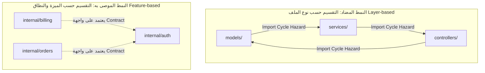
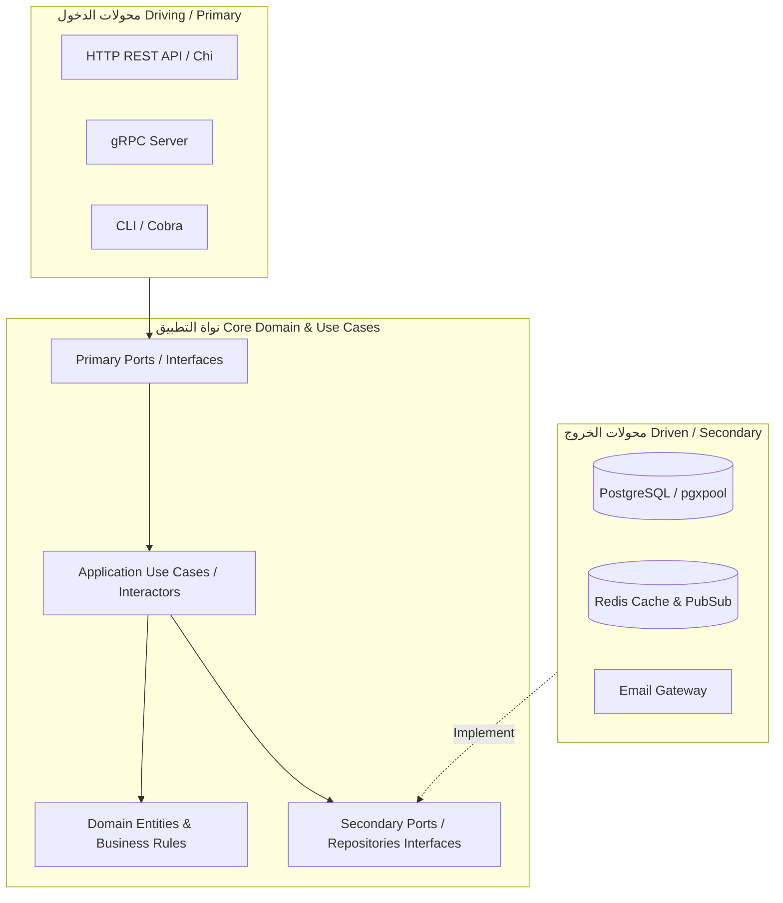
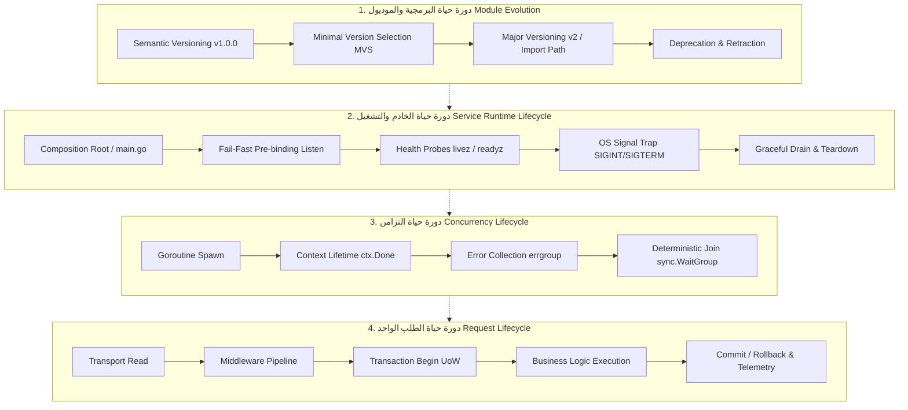

# الدليل المرجعي الشامل لهيكلة مشاريع Go، المعايير الهندسية، ودورات الحياة (Go Scalable Architecture, Official Standards & Lifecycles)

---

## 1. المقدمة الفلسفية والمصادر الرسمية لفريق Go (Go Philosophy & Official Stance)

### 1.1 فلسفة لغة Go في التصميم

تتميز لغة Go (Golang) برؤية تصميمية وضعها مؤسسوها (*Rob Pike, Ken Thompson, Robert Griesemer*) لمواجهة التحديات الهندسية المعقدة في الأنظمة الموزعة والبرمجيات الضخمة بشركة Google. وتتلخص فلسفتها المعمارية في:

* **البساطة ليست خياراً ثانوياً (Simplicity is Complicated):** البساطة في Go تعني التخلص من التعقيد العرضي (*Accidental Complexity*) والتركيز على وضوح تدفق البيانات والقابلية العالية للقراءة والصيانة (*Readability & Maintainability*).
* **التكوين بدلاً من الوراثة (Composition over Inheritance):** لا توجد شجرات وراثة معقدة، بل دمج للأنواع (`struct embedding`) وواجهات ضمنية سريعة الحركة (`implicit interfaces`).
* **الوضوح الصريح على السحر الخفي (Explicit over Implicit):** لا توجد انعكاسات سحرية للتحكم بالتدفق (*no magic reflection frameworks*)؛ بل تبعيات واضحة ومحقونة يدوياً، ومعالجة صريحة للأخطاء كقيم اعتيادية (*errors are values*).

---

### 1.2 التوجيه الرسمي: توثيق "Organizing a Go module"

أصدر فريق Go الرسمي دليلاً معيارياً واضحاً تحت عنوان **[Organizing a Go module](https://go.dev/doc/modules/layout)** لوضع أسس تنظيم المشروعات وتجنب التعقيد غير المبرر:

1. **ابدأ بسيطاً ووسع عند الحاجة (Evolve Gradually):** تنصح Go بالبدء بهيكل مسطح (*Flat Layout*) في جذر المشروع إذا كانت الحزمة تقدم وظيفة محددة، ثم الانتقال تدريجياً لإنشاء مجلدات متخصصة مع نمو المشروع.
2. **فصل البرامج التنفيذية عن المكتبات المشتركة:** استخدام مجلد `cmd/` لكل برنامج تنفيذي مستقل (Binary)، بحيث يحتوي كل مسار فرعي على دالة `main()`.
3. **حماية التغليف الداخلي عبر `internal/`:** اعتماد آلية التغليف المدعومة من المترجم نفسه لحجب الحزم التي لا ينبغي تصديرها للعالم الخارجي.
4. **تجنب تضخيم المسارات دون فائدة وظيفية:** كل مجلد في Go هو حزمة (`package`)، لذا يجب ألا يُنشأ المجلد إلا إذا كان يمثل وحدة تجريد وظيفية متكاملة ذات اسم دلالي.

---

### 1.3 حقيقة مستودع `golang-standards/project-layout` وتوضيح Russ Cox الرسمي

انتشر في مجتمع المطورين مستودع شهير على GitHub باسم `golang-standards/project-layout`، مما دفع الكثيرين للاعتقاد بأنه معيار رسمي إلزامي للغة Go.

> [!IMPORTANT]
> **موقف فريق Go الرسمي (Issue #117):**  
> في عام 2021، تدخّل **Russ Cox** (قائد فريق تطوير Go في Google) في النقاش الشهير على المستودع مؤكداً بصراحة:  
> *"This is not an official Go standard. ... The standard library and the Go tool themselves don't use this layout. Nobody in the Go team recommends this."*  
> وأوضح أن إطلاق اسم "standards" عليه يُعد تضليلاً هندسياً قاد العديد من الفرق إلى الوقوع في فخ **"Cargo Culting"** (أي نسخ مجلدات فارغة أو غير مفهومة مثل `pkg/`, `api/`, `third_party/`, `web/` دون حاجة فعلية لها).

الدرس الأساسي هنا هو: **لا تبنِ هيكلاً لمشروعك لمجرد تقليد قالب جاهز؛ بل ابنِ الهيكل بناءً على حدود النطاق (Domain Boundaries) والمتطلبات الفعلية للتطبيق.**

---

### 1.4 مرجعية Google Go Style Guide (Decisions & Best Practices)

توفر وثيقة [Google Go Style Guide](https://google.github.io/styleguide/go/) تفصيلاً معيارياً لأسلوب التصميم وهيكلة الحزم في المشاريع الإنتاجية الضخمة:

* **تسمية الحزم (Package Naming):** يجب أن تكون الأسماء قصيرة، بأحرف صغيرة فقط، ومفردة، وواضحة المعنى بدون علامات سفلية (`_`).
* **منع الحزم العامة الهلامية:** حظر تسميات مثل `util`، `helper`، `common`، أو `base`. الحزم يجب أن تصف **ما تقدمه** وليس **نوع الكود بداخلها**.
* **موقع استدعاء الحزمة (Call-Site Readability):** عند استدعاء الوظيفة في الكود الخارجي يجب أن يبدو الاستدعاء طبيعياً وواضحاً (مثال: `user.FindByID` وليس `userservice.FindByID` أو `util.FindUser`).

---

## 2. تشريح هياكل مشاريع Go من البسيط إلى الموسع (Evolutionary Project Layouts)

### 2.1 الهيكل المسطح الأساسي (Basic / Flat Layout)

يُوصى به للمكتبات، الأدوات البرمجية متواضعة الحجم، والخدمات متناهية الصغر (Microservices) ذات النطاق الفردي:

```text
my-service/
├── go.mod
├── go.sum
├── main.go
├── server.go
├── handler.go
├── storage.go
└── storage_test.go
```

**المزايا:** صفر تعقيد، صفر دورات استيراد (Circular Imports)، سهولة التنقل، وسرعة التطوير.

---

### 2.2 هيكل الأنظمة المعقدة والخدمات الموسعة (Standard Modular Server Layout)

عندما ينمو النظام ليصبح نظاماً ضخماً، أو "Modular Monolith"، أو خدمة خلفية تجارية متقدمة (مثل منصات ERP أو المحافظ المالية)، يتحول الهيكل إلى النظام التالي:

```text
my-backend/
├── cmd/
│   ├── server/
│   │   └── main.go           # نقطة الدخول الرئيسية لخادم الويب والواجهات
│   └── migrate/
│       └── main.go           # أداة سطر الأوامر لتشغيل ترحيل قواعد البيانات
├── internal/                 # الكود المحمي والمغلف تماماً (لا يمكن استيراده خارجياً)
│   ├── core/                 # النطاق والمنطق التجاري النقي (Pure Domain & Entities)
│   │   ├── domain/
│   │   │   ├── account.go
│   │   │   └── transaction.go
│   │   └── ports/            # الواجهات والعقود (Contracts & Abstractions)
│   │       ├── repositories.go
│   │       └── services.go
│   ├── usecases/             # حالات الاستخدام وتنسيق العمليات التجارية
│   │   ├── transfer_funds.go
│   │   └── audit_logs.go
│   ├── adapters/             # المحولات والبنية التحتية (Adapters & Integrations)
│   │   ├── primary/          # محولات القيادة والدخول (Driving / Inbound)
│   │   │   ├── http/         # أجهزة التحكم والموجهات ووسطاء الـ HTTP
│   │   │   │   ├── handler.go
│   │   │   │   ├── routes.go
│   │   │   │   └── middleware.go
│   │   │   └── grpc/         # سيرفر وخدمات gRPC
│   │   └── secondary/        # محولات التشغيل والخروج (Driven / Outbound)
│   │       ├── postgres/     # تطبيقات المستودعات عبر pgxpool أو SQL
│   │       │   ├── account_repo.go
│   │       │   └── uow.go
│   │       └── redis/        # التخزين المؤقت والأقفال الموزعة
│   └── platform/             # وحدات المنصة المشتركة (Config, Telemetry, Log)
│       ├── config/
│       ├── logger/
│       └── metrics/
├── pkg/                      # (اختياري) مكتبات عامة مصممة للاستيراد من قبل مشاريع خارجية
├── migrations/               # ملفات SQL الترحيلية المرقمة
├── docs/                     # التحليلات والمستندات ومخططات النظام
├── Makefile                  # أتمتة مهام البناء والفحص والتشغيل
├── go.mod
└── go.sum
```

---

### 2.3 حقيقة المجلد `internal/` والحماية على مستوى المترجم

منذ إصدار **Go 1.4**، وفّر مترجم Go ميزة ثورية مدعومة على مستوى أداة البناء (`go build` / `go test`):

```text
/a/b/c/internal/d/e/f
```

أي حزمة تقع داخل مسار يتضمن المجلد `internal/` **لا يمكن استيرادها إلا بواسطة الكود البرمجي الواقع في الشجرة الشقيقة أو الشجرة الأب للمجلد `internal`**.

```go
// محاولة استيراد حزمة من مشروع خارجي:
import "github.com/company/repo/internal/secrets" 

// نتيجة الترجمة:
// build error: use of internal package github.com/company/repo/internal/secrets not allowed
```

* **الأهمية الهندسية:**  
  1. منع تسريب التفاصيل الداخلية والمخاطر الأمنية خارج الوحدة البرمجية.
  2. ضمان حرية المطور في إعادة هيكلة (`Refactor`) الكود الداخلي دون الخوف من كسر التوافقية العكسية مع المستخدمين الخارجيين.

---

### 2.4 حقيقة المجلد `pkg/` ومخاطر استخدامه دون مبرر

* في مجتمع Go، يُعد استخدام مجلد `pkg/` موضوع نقاش مستمر:
  * **الاستخدام السليم:** عندما تكون هناك حزمة برمجية عامة ومستقرة، ترغب صراحة في أن يستوردها مطورون آخرون في مشاريعهم الخارجية (مثل مكتبة تشفير مخصصة أو SDK مشترك).
  * **الاستخدام السيئ (Anti-pattern):** وضع جميع ملفات المشروع داخل `pkg/` لمجرد الهروب من المجلد الجذري، مما يلغي حماية التغليف التي يقدمها `internal/`، ويتيح للمشاريع الخارجية الارتباط بتفاصيل تنفيذية قابلة للتغير.

---

### 2.5 الهيكلة حسب الطبقات (Layer-Based) مقابل الهيكلة حسب النطاق (Feature-Based)



#### لماذا يفشل نمط `models/` و `controllers/` و `services/` في Go؟

في بيئات أخرى (مثل Ruby on Rails أو Spring Boot أو Django)، قد يكون تقسيم المشروع لمجلدات أفقية حسب النوع أمراً شائعاً. أما في Go:

1. **كارثة الاستيراد الدائري (`import cycle not allowed`):** مترجم Go يمنع تماماً أي حلقة استيراد بين الحزم. إذا احتاج `models` نوعاً من `services`، واحتاج `services` نوعاً من `models`، سيفشل البناء فوراً!
2. **فقدان الدلالة والسياق (Low Cohesion):** وضع جميع الكيانات في حزمة واحدة باسم `models` يجعل استدعاء النوع في الكود غامضاً وسلبياً: `models.User`، `models.Invoice`، `models.Stock`، بدلاً من التجمع المنطقي: `billing.Invoice` و `inventory.Stock`.
3. **التوصية الرسمية:** قسّم الحزم رأسياً بناءً على الوظيفة أو النطاق التجاري (*Package by Feature / Domain*)، بحيث تظل الملفات ذات الاهتمام المشترك مجتمعة داخل الحزمة الواحدة.

---

## 3. معمارية المنظومة المتقدمة (Clean & Hexagonal Architecture in Go)

تُطبق معمارية المنافذ والمحولات (Hexagonal / Ports & Adapters) أو المعمارية النظيفة (Clean Architecture) في Go باتباع قاعدة التدفق أحادي المسار للتبعيات (*Dependency Inversion Principle*):



### 3.1 قواعد التبعية الصارمة (The Dependency Rule)

1. **النواة الصافية (Domain Core):** يجب ألا تستورد أي حزمة من طبقات المحولات، قواعد البيانات، أو أطر العمل (لا تعتمد على `database/sql` أو `net/http` أو `pgx`). النطاق يتكون من أنواع بسيطة (Pure Go Structs) ومنطق أعمال خالص.
2. **المنافذ (Ports):** الواجهات البرمجية تُعرّف في طبقة النطاق والتطبيق للتعبير عما يحتاجه المنطق التجاري من العالم الخارجي.
3. **المحولات (Adapters):** المحولات تقع في الأطراف وتُنفذ العقود المحددة بواسطة النواة.

---

## 4. المعايير الهندسية والمقاييس والتوصيات الرسمية (Engineering Standards & Metrics)

### 4.1 قواعد تسمية الحزم (Package Naming Standards)

وفق مقال **[Package names](https://go.dev/blog/package-names)** من إعداد *Sameer Ajmani* ودليل أسلوب Google:

| القاعدة | النمط السيئ (Bad) | النمط الموصى به (Good) | التعليل الرسمي |
| :--- | :--- | :--- | :--- |
| **اسم مفرد ومختصر** | `accounts/` | `account/` | في Go، اسم الحزمة يسبق النوع دائماً (`account.New()`). الجمع يسبب ركاكة لغوية. |
| **حروف صغيرة بدون شرطات** | `user_management/` | `usermgmt/` أو `user/` | تمنع لغة Go علامات التشكيل والفواصل والشرطات السفلية في أسماء الحزم. |
| **منع تكرار اسم الحزمة بالنوع** | `user.UserService` | `user.Service` | منع الحشو عند الاستدعاء (`user.Service` واضحة ومقروءة تماماً). |
| **منع الحزم الهلامية** | `common/` أو `util/` | `hash/` أو `timeutil/` | الحزم العامة تجذب الأكواد العشوائية وتؤدي إلى ترابط متشابك يصعب صيانته. |
| **منع تسمية الحزمة بنوع العمل** | `interfaces/` | `storage/` | الواجهات تُوضع حيث تُستخدم أو مع النطاق، وليس في حزمة معزولة اسمها interfaces. |

---

### 4.2 معايير تصميم الواجهات (Interface Design Standards)

> [!TIP]
> **قاعدة Jack Lindamood الشهيرة:**  
> **"Accept interfaces, return structs"** (اقبل الواجهات كمعاملات في الدوال، وأرجع كائنات ملموسة).

#### المبادئ الرسمية للواجهات في Go

1. **الواجهة ملك للمستهلك (Consumer-Defined Interfaces):**  
   في Go، الواجهات ضمنية (`implicitly satisfied`). لذلك، لا تقم بإنشاء واجهة بجوار الهيكل المنفذ لها وتصدرهما سوياً! بل دع الحزمة التي **تحتاج** إلى الخدمة هي من تُعرّف الواجهة بالقدر الأدنى الذي تحتاجه.

```go
// ❌
package postgres

type UserRepository interface {
    Create(ctx context.Context, u *User) error
    Update(ctx context.Context, u *User) error
    Delete(ctx context.Context, id string) error
    FindByID(ctx context.Context, id string) (*User, error)
    FindByEmail(ctx context.Context, email string) (*User, error)
    ListAll(ctx context.Context) ([]*User, error)
}
```

```go
// ✅
package usecase

// تحتاج حالة الاستخدام فقط إلى التحقق من وجود المستخدم
type UserFinder interface {
    FindByID(ctx context.Context, id string) (*domain.User, error)
}

type OrderService struct {
    users UserFinder // اقبل الواجهة الصغيرة
}

func NewOrderService(uf UserFinder) *OrderService { // أرجع الكائن الملموس
    return &OrderService{users: uf}
}
```

1. **الواجهات الصغيرة وحيدة الوظيفة (Single-Method Interfaces):**  
   اقتداءً بالمكتبة القياسية لـ Go (`io.Reader`, `io.Writer`, `fmt.Stringer`)، الواجهات المكونة من دالة واحدة أو دالتين هي الأكثر مرونة وقابلية لإعادة الاستخدام والتركيب (*Composability*).

---

### 4.3 مقاييس الاقتران والتماسك الهندسي (Cohesion & Coupling Metrics)

1. **مبدأ الرسم البياني غير الحلقي الموجه (Acyclic Dependencies Principle - ADP):**  
   مترجم Go يفرض هذا المبدأ كقاعدة بناء صارمة. يجب ألا توجد حلقة في شجرة التبعيات.
2. **الاقتران الوارد والصادر (Afferent & Efferent Coupling):**
   * **Afferent Coupling ($C_a$):** عدد الحزم الخارجية التي تعتمد على هذه الحزمة (مقياس للمسؤولية).
   * **Efferent Coupling ($C_e$):** عدد الحزم الخارجية التي تعتمد عليها هذه الحزمة (مقياس للهشاشة).
   * **معامل عدم الاستقرار ($I$):**
     $$I = \frac{C_e}{C_a + C_e}$$
     حيث $I = 0$ تعني حزمة شديدة الاستقرار والأهمية (مثل `core/domain`)، و $I = 1$ تعني حزمة شديدة التغير وعدم الاستقرار (مثل محولات الـ HTTP أو ملفات سطر الأوامر `cmd/`).
3. **مبدأ التبعيات المستقرة (Stable Dependencies Principle):**  
   يجب أن تتجه الأسهم والتبعيات دائماً نحو المكونات الأكثر استقراراً ($I$ أقل).

---

### 4.4 معايير معالجة الأخطاء (Error Handling Standards)

وفقاً لميزات Go 1.13 وما بعدها والدليل الرسمي لـ Go Wiki:

* **الأخطاء قيم عادية وليست استثناءات:** (`Errors are values`).
* **التغليف الدلالي (Error Wrapping):** استخدام الفعل `%w` مع `fmt.Errorf` لإضافة سياق للخطأ مع الحفاظ على إمكانية فحصه واستخراجه:

  ```go
  if err := repo.Save(ctx, order); err != nil {
      return fmt.Errorf("failed to process order %s: %w", order.ID, err)
  }
  ```

* **فحص الأخطاء الدلالية (Sentinel Errors):** استخدام `errors.Is` بدلاً من المساواة المباشرة `==`.
* **استخراج الأخطاء المخصصة (Custom Error Types):** استخدام `errors.As` لاستخراج معلومات الخطأ التفصيلية بدلاً من التحويل القسري (`Type Assertion`).

---

## 5. دورات الحياة الشاملة في Go (Macro & Micro Lifecycles)

تتكامل دورات الحياة في لغة Go على مستويات متعددة: من مستوى تطور النظام والمكتبات عبر السنوات، إلى مستوى تشغيل الخدمة، وإدارة التزامن، وحتى معالجة الطلب اللحظي.



---

### 5.1 أولاً: دورة حياة البرمجية والموديول (Software & Module Evolution Lifecycle)

#### 1. وعد التوافقية العكسية (Go 1 Compatibility Promise) وقانون هايروم (Hyrum's Law)

يلتزم مشروع Go بضمان عدم كسر أي كود يعمل على Go 1.x عند الترقية لإصدارات أحدث. ولتحقيق ذلك في مشاريعك:

* ينص **قانون هايروم** على: *"مع وجود عدد كافٍ من مستخدمي واجهة برمجية، فإن جميع السلوكيات القابلة للملاحظة للنظام سيتم الاعتماد عليها من قبل شخص ما، بغض النظر عما ينص عليه العقد المكتوب."*
* لذلك، يجب تصدير الحقول والأنواع الضرورية فقط، وإبقاء البقية غير مصدّرة (`unexported`) لتجنب الارتباط غير المقصود.

#### 2. إصدارات المسار الدلالي (Semantic Import Versioning)

في نظام Go Modules:

* الإصدارات الصغرى وإصدارات التصحيح (`v1.1.0`, `v1.2.3`) تحتفظ بنفس مسار الاستيراد.
* **التغييرات الكاسرة للتوافقية (Major Versions v2+):** يفرض نظام Go تغيير مسار الاستيراد صراحةً:

  ```go
  module github.com/company/project/v2
  ```

  هذا يتيح لتطبيق واحد استيراد كل من `v1` و `v2` من نفس المكتبة في نفس الوقت دون تعارض الأسماء (*Diamond Dependency Problem Resolution*).

#### 3. خوارزمية الاختيار الأدنى للإصدارات (Minimal Version Selection - MVS)

على عكس مديري الحزم في اللغات الأخرى (مثل npm أو pip التي تختار أحدث إصدار متوافق تلقائياً)، تختار خوارزمية MVS في Go **أقدم إصدار متاح يفي بالحد الأدنى المطلوب**، مما يضمن ثباتاً مطلقاً وقابلية إنتاج مطابقة للبيئات في كل بناء (*Reproducible Builds*).

#### 4. إدارة التراجع والتقاعد (`retract` & `deprecated`)

يوفر ملف `go.mod` توجيهات رسمية لإدارة دورة حياة الحزم المعيبة أو المتقاعدة:

```go
// في ملف go.mod
module github.com/company/project

go 1.22

// سحب إصدار كشف فيه خلل أمني حرج
retract (
    v1.0.5 // يحتوي على ثغرة تسريب بيانات الذاكرة
    [v1.1.0, v1.1.2] // مشاكل عدم استقرار مع قاعدة البيانات
)

// الإعلان عن تقاعد دالة أو حزمة عبر تعليق Godoc الرسمي
// Deprecated: Use NewSecureService instead.
```

---

### 5.2 ثانياً: دورة حياة تشغيل الخدمة (Runtime & Service Lifecycle)

#### 1. جذر التكوين الصريح (Composition Root) في `main.go`

يجب أن تحتوي دالة `main()` على تهيئة جميع التبعيات وحقنها يدوياً بشكل شجري تسلسلي وواضح دون استدعاءات خفية:

```go
package main

import (
    "context"
    "log/slog"
    "os"
    "os/signal"
    "syscall"
    "time"

    "github.com/company/project/internal/adapters/secondary/postgres"
    "github.com/company/project/internal/adapters/primary/http"
    "github.com/company/project/internal/platform/config"
    "github.com/company/project/internal/usecases"
)

func main() {
    // 1. إعداد المسجل الموجه المنظم (slog)
    logger := slog.New(slog.NewJSONHandler(os.Stdout, nil))
    slog.SetDefault(logger)

    // 2. تحميل الإعدادات والتحقق الصارم منها
    cfg, err := config.Load()
    if err != nil {
        logger.Error("failed to load configuration", "error", err)
        os.Exit(1)
    }

    // 3. تهيئة سياق الإيقاف المبكر المرتبط بإشارات النظام
    ctx, stop := signal.NotifyContext(context.Background(), syscall.SIGINT, syscall.SIGTERM)
    defer stop()

    // 4. ربط التبعيات (Composition Root)
    pool, err := postgres.NewPool(ctx, cfg.DatabaseURL)
    if err != nil {
        logger.Error("failed to initialize db pool", "error", err)
        os.Exit(1)
    }
    defer pool.Close()

    accountRepo := postgres.NewAccountRepository(pool)
    transferUseCase := usecases.NewTransferUseCase(accountRepo)
    server := http.NewServer(cfg.HTTPPort, transferUseCase, logger)

    // 5. إطلاق الخادم في Goroutine مع الإغلاق الآمن
    if err := server.Run(ctx); err != nil {
        logger.Error("server terminated abnormally", "error", err)
        os.Exit(1)
    }

    logger.Info("application exited cleanly")
}
```

#### 2. تحذيرات رسمية حول الاستخدام العشوائي لدوال `init()`

تنصح وثائق Go وأدلة أسلوب Google بتجنب كتابة منطق معقد أو تهيئة اتصالات خارجية داخل دوال `init()`:

* دوال `init()` تعمل قبل `main()` ولا تقبل تمرير معاملات أو إرجاع أخطاء.
* تؤدي إلى حالة غير منضبطة وتجعل كتابة الاختبارات المعزولة مستحيلة.
* **الاستثناء المسموح:** تسجيل المعالجات الثابتة البسيطة (مثل برامج ترميز الصور أو محركات SQL drivers المدمجة).

#### 3. معايير فحوصات الجاهزية والحياة (Liveness vs Readiness Probes)

* **`/livez` (Liveness):** يفحص ما إذا كانت العملية قيد التشغيل وقادرة على الاستجابة. في حال فشله، يقوم منسق الحاويات (مثل Kubernetes) بإعادة تشغيل الحاوية.
* **`/readyz` (Readiness):** يفحص ما إذا كانت الخدمة قادرة فعلياً على معالجة طلبات المستخدمين (مثل التحقق من جاهزية بركة اتصالات قاعدة البيانات، ترحيل البيانات، وتحميل الذاكرة المؤقتة). في حال فشله، يتم استبعاد الحاوية مؤقتاً من توجيه حركة المرور (*Traffic Routing*) دون قتلها.

#### 4. آلية الإغلاق التدريجي الآمن (Graceful Shutdown)

تتضمن دورة الإغلاق الآمن الخطوات التالية بالترتيب العكسي:

1. استلام إشارة النظام (`SIGTERM`/`SIGINT`).
2. تحويل حالة فحص الجاهزية `/readyz` إلى الفشل فوراً لمنع توجيه طلبات جديدة من موازن الحمل.
3. استدعاء `http.Server.Shutdown(shutdownCtx)` مع مهلة زمنية محددة (*Timeout Deadline*) لإنهاء الطلبات المفتوحة حالياً.
4. إيقاف معالجي الخلفية (*Background Workers*) والانتظار حتى انتهاء المهام النشطة.
5. تفريغ وإغلاق اتصالات قواعد البيانات ومخازن التخزين المؤقت (`pgxpool.Close()`, `redis.Close()`).

---

### 5.3 ثالثاً: دورة حياة الـ Goroutines والمزامنة (Concurrency Lifecycle)

> [!CAUTION]
> **القاعدة الذهبية لإدارة التزامن في Go (Dave Cheney):**  
> *"Never start a goroutine without knowing how and when it will stop."*  
> (إطلاق Goroutine دون آلية خروج واضحة يتسبب في تسريبات الذاكرة الصامتة Goroutine Leaks التي تُسقط الخوادم في الإنتاج).

#### معايير دورة حياة المعالجات المتزامنة

1. **التحكم بالسياق المشترك (`context.Context`):** مراقبة قناة `<-ctx.Done()` باستمرار لإنهاء العمليات الطويلة عند انقطاع الاتصال أو نفاد المهلة.
2. **التنسيق الجماعي الحتمي باستخدام `errgroup`:**

```go
package worker

import (
    "context"
    "fmt"
    "golang.org/x/sync/errgroup"
)

type Supervisor struct {
    workers []Worker
}

func (s *Supervisor) Start(ctx context.Context) error {
    // إنشاء مجموعة عمل ترتبط بإلغاء السياق عند أول خطأ
    g, gCtx := errgroup.WithContext(ctx)

    for i, w := range s.workers {
        worker := w
        workerID := i
        g.Go(func() error {
            if err := worker.Execute(gCtx); err != nil {
                return fmt.Errorf("worker %d failed: %w", workerID, err)
            }
            return nil
        })
    }

    // الانتظار الحتمي لجميع الـ Goroutines
    if err := g.Wait(); err != nil {
        return fmt.Errorf("worker pool encountered error: %w", err)
    }

    return nil
}
```

---

### 5.4 رابعاً: دورة حياة الطلب الواحد (Request & Transaction Lifecycle)

يمر كل طلب يصل إلى الخادم برحلة منضبطة عبر طبقات النظام:

```text
HTTP Client Request
      │
      ▼
1. Transport Layer (Context Creation, Correlation ID, Tracing, Metrics)
      │
      ▼
2. Middleware Pipeline (Recovery, AuthN/AuthZ, Rate Limiting, Logging)
      │
      ▼
3. Primary Adapter / Controller (Request Decoding & DTO Validation)
      │
      ▼
4. Application Use Case (Domain Logic Coordination)
      │
      ▼
5. Unit of Work / DB Transaction (Begin Tx -> Execute Queries -> Commit/Rollback)
      │
      ▼
6. Secondary Adapter / Repository (SQL Execution via pgxpool)
      │
      ▼
7. Response Encoding (JSON/Protobuf Serialization -> HTTP 200/4xx/5xx)
```

#### ضمانات السلامة الحسابية في المعاملات المالية (Unit of Work Pattern)

* فتح المعاملة يتم داخل سياق موحد يضمن التراجع التلقائي (`Rollback`) في حال حدوث أي خطأ أو حالة هلع غير متوقعة (`panic`).
* الالتزام الصارم بتمرير نفس متغير `context.Context` عبر كافة المستويات لحمل مهلة انتهاء الطلب (*Timeout*) وبيانات التتبع الموزع (*Distributed Trace ID*).

---

## 6. مصفوفة الأنماط المعمارية ومقارنة الاستخدام (Architecture Comparison Matrix)

| المعيار الهندسي | الهيكل المسطح (Flat Layout) | الهيكل المعياري المتكامل (Modular Monolith) | معمارية الخدمات المصغرة (Microservices) |
| :--- | :--- | :--- | :--- |
| **التعقيد الأولي** | منخفض جداً | متوسط ومضبوط | مرتفع جداً |
| **سرعة البناء والتطوير** | فائقة السرعة | عالية ومستقرة | تتطلب بنية تحتية ثقيلة |
| **مقاومة دورات الاستيراد** | معدومة (نفس الحزمة) | ممتازة عبر التجريد الصارم | ممتازة (عزل كامل عبر الشبكة) |
| **حدود النطاق وعزل النطاقات** | ضعيفة | قوية جداً عبر `internal/` | صارمة عبر واجهات API خارجية |
| **التكلفة التشغيلية** | متواضعة | اقتصادية للغاية | باهظة (شبكات، تتبع، تنسيق) |
| **متى يُوصى باستخدامه؟** | للمكتبات، الأدوات، النماذج السريعة | **الخيار القياسي لمعظم منصات المؤسسات الحديثة** | للأنظمة الهائلة ذات الفرق المستقلة المتعددة |

---

## 7. قائمة التحقق للجاهزية الإنتاجية (Production Architecture Checklist)

قبل إطلاق أي خدمة مبنية بلغة Go إلى بيئة الإنتاج، تأكد من استيفاء المعايير التالية:

### ✅ هيكلة الحزم والتبعيات

* [ ] لا توجد أي حزم هلامية عامة باسم `util` أو `helper` أو `common`.

* [ ] الكود الخاص بالمنطق الداخلي والتطبيقي مغلف ومحمي بالكامل داخل مجلد `internal/`.
* [ ] الحزم البرمجية منظمة رأسياً حسب النطاق الوظيفي (*Package by Feature*) وليس أفقياً حسب نوع الملفات.
* [ ] الواجهات البرمجية تُعرف من قبل الحزم المستهلكة لها وليس الحزم المنفذة.
* [ ] شجرة التبعيات تتجه باتجاه أحادي غير حلقي (Directed Acyclic Graph).

### ✅ المعايير والتنفيذ البرمجي

* [ ] الالتزام بقاعدة: قبول الواجهات كمعاملات وإرجاع الهياكل الملموسة (*Accept interfaces, return structs*).

* [ ] تغليف الأخطاء يتم باستخدام `%w` واسترجاعها والتحقق منها عبر `errors.Is` و `errors.As`.
* [ ] تجنب استخدام متغيرات الحالة المشتركة العامة (*Package-level global state*) وقصر الاعتماد على الحقن الصريح للتبعيات.
* [ ] دوال `init()` لا تقوم بتنفيذ اتصالات شبكية أو عمليات خارجية تسبب آثارا جانبية غير متوقعة.

### ✅ دورة الحياة والموثوقية

* [ ] تهيئة النظام تعتمد نمط **Composition Root** الصريح داخل `main.go`.

* [ ] دعم مسارات الفحص التشغيلي `/livez` و `/readyz` مع التحقق الفعلي من بركة قاعدة البيانات.
* [ ] تطبيق دورة الإغلاق التدريجي الآمن (*Graceful Shutdown*) مع إيقاف الخادم وسحب المهام وإغلاق اتصالات قواعد البيانات بمهلة زمنية محددة.
* [ ] كل Goroutine يتم إطلاقها تمتلك آلية إنهاء محددة ومربوطة بـ `context.Context` أو `sync.WaitGroup` / `errgroup` لمنع تسريب الذاكرة.

---

## 8. المراجع والمصادر الرسمية المعتمدة (Official References)

1. **وثيقة تنظيم الموديولات الرسمية في Go:**  
   [Go Official Documentation: Organizing a Go module](https://go.dev/doc/modules/layout)
2. **مقال تسمية الحزم الرسمي (Sameer Ajmani):**  
   [The Go Blog: Package names](https://go.dev/blog/package-names)
3. **مقال تنظيم كود Go (Andrew Gerrand):**  
   [The Go Blog: Organizing Go code](https://go.dev/blog/organizing-go-code)
4. **دليل كتابة كود Go الفعّال:**  
   [Effective Go](https://go.dev/doc/effective_go)
5. **ملاحظات مراجعة كود Go الرسمية:**  
   [Go Wiki: CodeReviewComments](https://go.dev/wiki/CodeReviewComments)
6. **دليل أسلوب وأفضل ممارسات Google للغة Go:**  
   [Google Go Style Guide: Decisions & Best Practices](https://google.github.io/styleguide/go/)
7. **تعليق Russ Cox الرسمي حول معايير هيكلة المشاريع:**  
   [GitHub: golang-standards/project-layout Issue #117](https://github.com/golang-standards/project-layout/issues/117)
8. **وعد التوافقية العكسية لـ Go 1:**  
   [Go 1 and the Future of Go Programs](https://go.dev/doc/go1compat)
9. **إصدارات الوحدات البرمجية وخوارزمية MVS:**  
   [Go Modules Reference: Minimal Version Selection](https://go.dev/ref/mod#minimal-version-selection)
