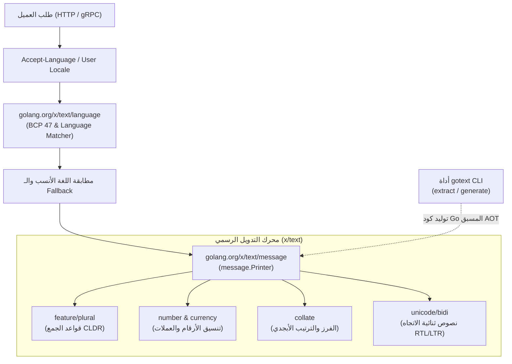
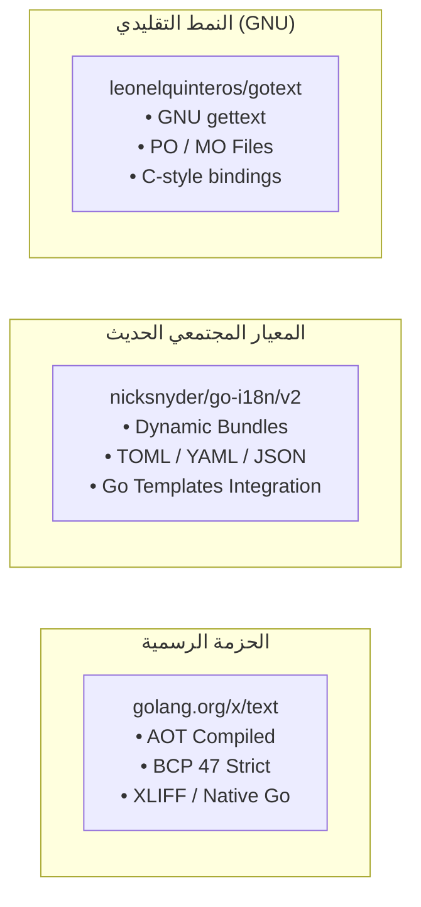
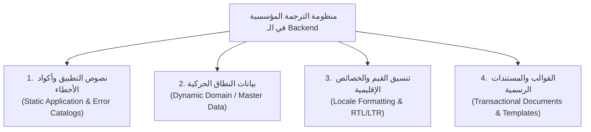
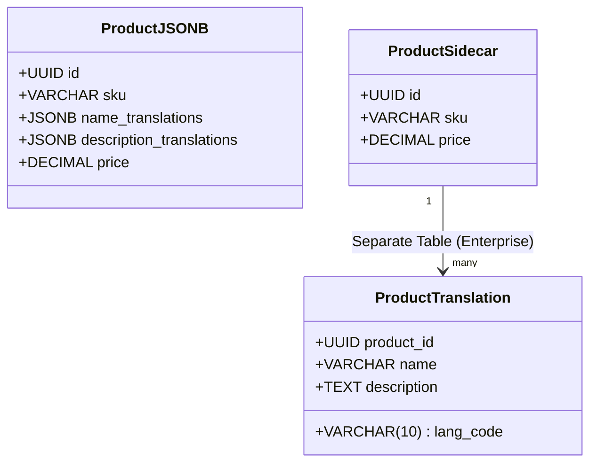
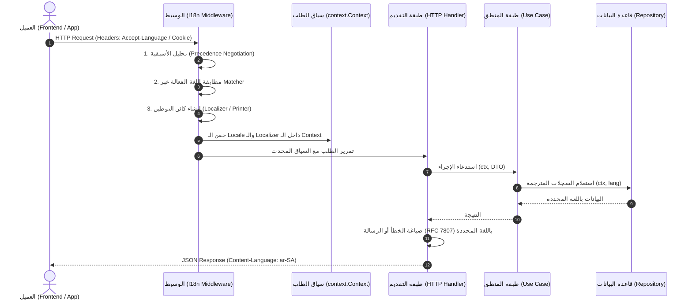
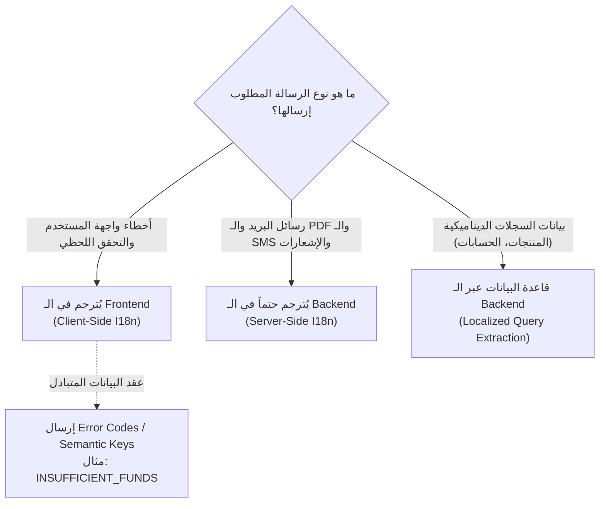

# التوثيق والتحليل المعماري الشامل لأنظمة الترجمة والتدويل (i18n & l10n) في الواجهات الخلفية للغة Go

---

## 1. المقدمة والملخص التنفيذي (Executive Summary)

تُمثل عملية **التدويل (Internationalization - i18n)** و**التوطين (Localization - l10n)** ركيزة محورية في بناء الأنظمة والخدمات الخلفية المؤسسية (Enterprise Backend Systems). لا تقتصر الترجمة على مجرد استبدال مفردات لغوية، بل هي منظومة متكاملة تشمل:

1. **مطابقة اللغات ومعالجة الوسوم اللغوية (Language Tag Matching & Negotiation)** وفق معايير عالمية مثل **BCP 47** و **ISO 639/3166**.
2. **صياغة الرسائل والتعويض النصي وقواعد الجمع (Pluralization & Formatting)** المستندة إلى مستودع البيانات الإقليمية الموحد **Unicode CLDR**.
3. **تنسيق القيم الإقليمية (Locale-Sensitive Formatting)** للأرقام، والعملات، والتواريخ، والاتجاهات (RTL / LTR).
4. **معمارية إدارة البيانات المترجمة في قواعد البيانات (Multilingual Data Persistence)** للفصل الصارم بين النصوص الساكنة لرمز التطبيق وبيانات العمليات المتغيرة.
5. **تحديد الحدود الفاصلة للترجمة (Translation Boundaries)** بين طبقة الواجهة الخلفية (Backend) وواجهة المستخدم (Frontend) وفق مبادئ المعمارية النظيفة (Clean Architecture).

يقدم هذا التقرير تحليلاً هندسياً شاملاً ومستفيضاً مستنداً إلى المصادر الرسمية لنواة لغة Go ([go.dev](https://go.dev)) ومستودعاتها الفرعية الرسمية، إضافة إلى أفضل الممارسات المعمارية في كبرى المنصات والأنظمة المؤسسية المكتوبة بـ Go.

---

## 2. الموقف والفلسفة الرسمية لمنظومة لغة Go (The Official Go Ecosystem)

### 2.1 فلسفة النواة والمكتبة القياسية (Standard Library Minimalism)

تتبع لغة Go فلسفة واضحة في تصميم مكتبتها القياسية (`stdlib`):

- **حزم النصوص الأساسية فقط داخل النواة:** تحوي مكتبة Go القياسية حزم التعامل مع النصوص الأساسية مثل `strings`, `bytes`, `unicode`, `unicode/utf8`, و `text/template`.
- **نقل التدويل المتقدم إلى المستودع الفرعي الرسمي (`golang.org/x/text`):** لتفادي تضخيم النواة (Binary Bloat) والارتباط بدورة إصدارات Go الثابتة، وضعت Google وفريق Go كافة أدوات التدويل، والتعامل مع Unicode CLDR، والوسوم، والترجمة المتقدمة داخل المستودع الفرعي الرسمي التابع لمشروع Go: `golang.org/x/text`.

> [!NOTE]
> مستودعات `golang.org/x/...` هي مشاريع رسمية يشرف عليها ويطورها فريق نواة Go ومهندسو Google، وتُعتبر المرجع المصدري الرسمي والمعتمد للغة Go، رغم أنها ليست خاضعة لـ Go 1 Compatibility Promise بذات صرامة المكتبة القياسية لتتيح مواكبة تحديثات إصدارات معيار Unicode الدولي باستمرار.

### 2.2 المعايير الدولية المعتمدة رسمياً في Go

يعتمد تصميم مكتبات التدويل في Go على معيارين دوليين صريحين:

1. **معيار IETF BCP 47 (RFC 5646 / RFC 4647):** لتحديد وسوم اللغات وهرميات اللهجات والأقاليم (مثل `ar-SA`, `en-US`, `zh-Hans-CN`).
2. **معيار Unicode CLDR (Common Locale Data Repository):** المصدر العالمي الموحد لبيانات اللغات، بما يشمل قواعد الجمع الحسابي للأعداد، وأسماء الشهور، وتنسيقات العملات والفواصل العشرية.

---

## 3. تفكيك الحزم الرسمية لمنظومة `golang.org/x/text`

يُعد مستودع `golang.org/x/text` الترسانة الرسمية لتطوير تطبيقات Go العالمية. تتكامل حزمه عبر هيكلية مترابطة:



---

### 3.1 حزمة وسوم ومطابقة اللغات (`golang.org/x/text/language`)

تتعامل هذه الحزمة مع تمثيل اللغات وتحليلها ومطابقتها وفق مواصفة BCP 47.

#### أ. المفاهيم الأساسية

- **`language.Tag`**: بنية آمنة خفيفة تُمثل وسم لغة موثوق ومدقق (مثل `language.Arabic`, `language.English`, `language.SaudiArabia`).
- **`language.Matcher`**: محرك مطابقة عالي الأداء يعتمد على خوارزميات BCP 47 لمقارنة اللغات المدعومة في التطبيق مع اللغات التي يطلبها العميل، مع حساب درجات الثقة (Confidence Levels: `Exact`, `High`, `Low`, `No`).

#### ب. آلية الـ Fallback الهرمية (Hierarchical Fallback)

عندما يطلب العميل لهجة غير متوفرة نصياً، يبحث المحرك عن أقرب لغة أصلية (Parent Language):

1. `ar-EG` (العربية المصرية) -> إن لم تتوفر -> يسقط إلى `ar` (العربية الفصحى العامة).
2. `zh-HK` (الصينية التقليدية - هونغ كونغ) -> تسقط إلى `zh-Hant` (الصينية التقليدية العامة) قبل السقوط إلى الصينية المبسطة.
3. إذا تعذر التطابق بالكامل -> يتم اختيار اللغة الافتراضية للنظام (Default Server Language).

```go
package main

import (
 "fmt"
 "golang.org/x/text/language"
)

func ExampleMatcher() {
 // اللغات التي يدعمها تطبيقنا في الـ Backend
 serverTags := []language.Tag{
  language.AmericanEnglish, // الافتراضية الأولى
  language.Arabic,          // ar
  language.Make("ar-SA"),   // ar-SA
  language.French,          // fr
 }
 matcher := language.NewMatcher(serverTags)

 // محاكاة ترويسة قادمة من متصفح العميل
 userAcceptHeader := "ar-EG,ar;q=0.9,en-US;q=0.8"
 userTags, _, _ := language.ParseAcceptLanguage(userAcceptHeader)

 // مطابقة أفضل لغة مدعومة
 matchedTag, index, confidence := matcher.Match(userTags...)
 fmt.Printf("Matched: %v, Index: %d, Confidence: %v\n", matchedTag, index, confidence)
 // النتيجة: Matched: ar, Index: 1, Confidence: High
}
```

---

### 3.2 حزمة طباعة وتنسيق الرسائل (`golang.org/x/text/message`)

تُعد `message.Printer` البديل المباشر متعدد اللغات لـ `fmt.Printf` و `fmt.Sprintf`.

#### المزايا التقنية

1. **استبدال تلقائي لـ `fmt`:** تملك دوال مطابقة تماماً (`Sprintf`, `Fprintf`, `Printf`, `Sprint`).
2. **التنسيق الإقليمي التلقائي للأرقام:** عند تمرير رقم مثل `1250000.50`، يقوم `message.Printer` للغة الألمانية بطباعته بصيغة `1.250.000,50`، وللغة الإنجليزية `1,250,000.50`، وللغة العربية بالأرقام المعتمدة محلياً والفواصل العربية دون تدخل يدوي.
3. **التكامل مع قواميس الترجمة المترجمة مسبقاً (Compiled Catalogs).**

```go
p := message.NewPrinter(language.Arabic)
// تنسيق أوتوماتيكي للأرقام وفق خصائص اللغة العربية
p.Printf("إجمالي الفاتورة هو: %.2f ريال\n", 15420.75)
```

---

### 3.3 قواعد الجمع الحسابي المتقدمة (`golang.org/x/text/feature/plural`)

تعد قواعد الجمع اللغوي (Pluralization) واحدة من أصعب تحديات التدويل عالمياً. تختلف اللغات في صيغ الجمع:

- الإنجليزية تحتوي على صيغتين فقط: **`one`** و **`other`** (1 item, 2 items).
- الروسية والبولندية تحتويان على **`one`**, **`few`**, **`many`**.
- **اللغة العربية** هي اللغة الأكثر تعقيداً في العالم في تصنيف CLDR، حيث تملك **6 تصنيفات جمع بالتمام والكمال:**
  1. **`zero` (صفر):** "لا توجد منتجات"
  2. **`one` (مفرد):** "منتج واحد"
  3. **`two` (مثنى):** "منتجان اثنان"
  4. **`few` (جمع قلة 3 إلى 10):** "3 منتجات"
  5. **`many` (جمع كثرة 11 إلى 99):** "15 منتجاً"
  6. **`other` (الجموع الأخرى 100، 1000...):** "100 منتج"

تقوم حزمة `plural` الرسمية بالتعامل تلقائياً مع هذه القواعد المعقدة وفق قيم الـ Count الممررة، دون الحاجة لكتابة جمل `switch` و `if/else` يدخل فيها المطور في أخطاء لغوية وحسابية.

---

### 3.4 أداة سطر الأوامر الرسمية (`golang.org/x/text/cmd/gotext`)

تُعد `gotext` الأداة الرسمية الموازية لأداة `go` للتعامل مع الترجمة في دورة حياة التطوير (DevOps & Build Cycle):

#### الوظائف الأساسية

1. **`gotext extract`:** تقوم بمسح الكود المصدري في ملفات `.go`، والبحث عن أي استدعاءات لكائنات `message.Printer` واستخراج السلاسل النصية المكتوبة في الكود تلقائياً.
2. **`gotext generate`:** تحويل ملفات الترجمة بعد تعبئتها من قِبل المترجمين إلى **شفرة Go برمجية خالصة ومترجمة مسبقاً (Compiled Go Catalog)** داخل مجلد الحزمة.
3. **دعم تنسيق XLIFF و JSON:** تولد ملفات الترجمة بصيغة **XLIFF (XML Localization Interchange File Format)**، وهي الصيغة القياسية العالمية المعتمدة لدى دور الترجمة وبرمجيات الترجمة بمساعدة الحاسوب (CAT Tools).

#### فلسفة الأداء الفائق (AOT Catalog Compilation)

بدلاً من قراءة ملفات JSON أو YAML أو XML من القرص في كل مرة يُقلع فيها الخادم، يقوم `gotext generate` بإنشاء جدول مصطلحات ثابت (Lookup Table) محقون داخل ثنائية التطبيق (Binary). ينتج عن ذلك:

- **Zero-Allocation String Lookup:** البحث عن الترجمة يتم بعمليات فهرسة مصفوفات سريعة جداً.
- **استهلاك شبه معدوم لوحدة المعالجة المركزية (O(1) Memory Access).**
- **عدم وجود اعتمادية على قراءة ملفات خارجية في حاويات Docker أو بيئات الإنتاج.**

---

### 3.5 الحزم الشقيقة المرافقة في `x/text`

| الحزمة | الوظيفة التقنية |
| :--- | :--- |
| **`golang.org/x/text/collate`** | فرز النصوص وترتيبها أبجدياً حسب قواعد اللغة الإقليمية (Collation)؛ حيث يختلف الترتيب الأبجدي لحرف "أ" و "إ" و "آ" في العربية، أو الحروف ذات الحركات في الألمانية والإسبانية. |
| **`golang.org/x/text/currency`** | إدارة رموز العملات وتنسيقها محلياً (مثال: ر.س مقابل SAR وموضع الرمز قبل أو بعد الرقم). |
| **`golang.org/x/text/number`** | تحويل الأرقام إلى نصوص وصيغ مئوية وهندسية وعلمية وفق خصائص الـ Locale. |
| **`golang.org/x/text/cases`** | التعامل مع تكبير وتصغير الحروف (Casing) وفق القواعد الخاصة ببعض اللغات (مثل تعامل التركية الخاص مع حرفي `i` و `İ`). |
| **`golang.org/x/text/unicode/bidi`** | محرك خوارزمية Unicode ثنائية الاتجاه للتحقق من سلامة النصوص المختلطة بين العربية (RTL) والإنجليزية (LTR). |

---

## 4. المقارنة المعمارية: التقنيات والمكتبات البديلة في بيئة Go

بجانب الحزمة الرسمية `x/text`، برزت في مجتمع مطوري Go أدوات ومكتبات اكتسبت انتشاراً واسعاً، كل منها يخاطب حاجة معمارية محددة:



### 4.1 مكتبة `github.com/nicksnyder/go-i18n/v2`

تُعد المكتبة الأكثر شعبية وعملية في مشاريع الـ Microservices وتطبيقات الويب المكتوبة بـ Go.

#### المعمارية الأساسية

- **`i18n.Bundle`:** كائن مركزي واحد يتم إنشاؤه عند إقلاع الخادم، ويُحمّل كافة ملفات الترجمة (JSON, TOML, YAML).
- **`i18n.Localizer`:** كائن خفيف الوزن يُنشأ لكل طلب وارد (Per-Request) استناداً إلى لغة المستخدم الحالية، ويستخدم مرجعاً إلى الـ `Bundle`.
- **دعم Go Templates:** تسمح بصياغة رسائل معقدة وقوالب ديناميكية باستخدام صيغة قوالب Go القياسية `{{.Name}}` مع دعم فئات الجمع الست للـ CLDR.

### 4.2 مكتبات GNU gettext (`gotext` / `gettext-go`)

تعتمد على نسق ملفات GNU Gettext التقليدي (`.po` للترجمة البشرية، و `.mo` للترجمة المجمعة ثنائياً). تُستخدم عندما تكون المؤسسة تمتلك بالفعل فريق ترجمة مركزي أو بنية سحابية موحدة تعتمد أدوات مثل Poedit, Transifex, أو Crowdin.

---

### 4.3 جدول المقارنة الشامل بين التقنيات في Go

| المعيار الهندسي | `golang.org/x/text` (الرسمية) | `nicksnyder/go-i18n/v2` (المجتمعية) | `leonelquinteros/gotext` (gettext) |
| :--- | :--- | :--- | :--- |
| **الجهة الراعية** | فريق Go الرسمي / Google | Nick Snyder والمجتمع مفتوح المصدر | مجتمع Go |
| **صيغ ملفات الترجمة** | XLIFF 1.2 / كود Go المولد | JSON, TOML, YAML | `.po` / `.mo` (GNU Gettext) |
| **طريقة التحميل (Loading)** | تجميع مسبق بكود Go (AOT Compile) | تحميل في الذاكرة (Runtime Parsing / Embed) | قراءة ملفات ثنائية `.mo` من القرص أو الذاكرة |
| **استهلاك الذاكرة وسرعة القراءة** | **فائقة جداً (الأسرع على الإطلاق)** | ممتازة جداً (خرائط ميموري مؤمنة) | جيدة جداً |
| **قواعد الجمع (Pluralization)** | دعم كامل لـ CLDR | دعم كامل لـ CLDR (توليد آلي) | دعم معادلات C-Expression لقواعد gettext |
| **نظام القوالب (Templating)** | `printf` style (%s, %d, %v) | Go `text/template` style (`{{.Field}}`) | C-printf style (`%s`, `%d`) |
| **التعامل مع BCP 47 Matcher** | **أصلي ودقيق جداً (الأعلى عالمياً)** | يعتمد على وسوم لغوية مدمجة | يعتمد على أسماء المجلدات ومحددات POSIX |
| **سهولة الصيانة للمطورين** | متوسطة (تتطلب فهم XLIFF و gotext) | **عالية وبسيطة للغاية** | متوسطة (تعتمد على أدوات gettext) |
| **حالات الاستخدام المثالية** | تطبيقات الـ High-throughput، النظم الحساسة للذاكرة | خدمات REST / gRPC APIs المؤسسية | التوافق مع أنظمة تراثية أو منصات ترجمة سحابية |

---

## 5. التصنيفات والفئات الأربعة للترجمة في الأنظمة الخلفية (Backend Categories)

في أي نظام مؤسسي متكامل، تنقسم عناصر الترجمة إلى **أربع فئات معمارية منفصلة**، لكل منها دورة حياة وتخزين مختلفان:



---

### الفئة الأولى: نصوص التطبيق الساكنة ورسائل الأخطاء (Static App & Error Catalogs)

- **طبيعتها:** نصوص ثابتة يكتبها المطور، مثل نصوص أخطاء التحقق (Validation Errors)، رسائل الاستجابة الموحدة (RFC 7807 Problem Details)، وعناوين الحقول.
- **التخزين:** ملفات كود أو ملفات مدمجة (`embed.FS`) داخل ثنائية الـ Go Backend.
- **التحديث:** مرتبط بدورة حياة نشر البرمجية (Deployment Pipeline).

### الفئة الثانية: بيانات النطاق الحركية (Dynamic Domain / Master Data)

- **طبيعتها:** البيانات الحية التي يُدخلها المستخدم في النظام وتتغير باستمرار (أسماء المنتجات، مجموعات السلع، أسماء الحسابات في شجرة الحسابات المالية، أسماء المستودعات).
- **التخزين:** جداول قاعدة البيانات (Relational Database Storage).
- **التحديث:** فوري في وقت التشغيل عبر عمليات الـ CRUD دون إعادة بناء للتطبيق.

### الفئة الثالثة: تنسيق القيم والخصائص الإقليمية (Locale Formatting & BiDi)

- **طبيعتها:** لا تتعلق بمفردات لغوية بل بقوانين العرض والقياس (تنسيق فواصل الآلاف، أسماء العملات ومواقعها، تقويم أم القرى الهجري مقابل الميلادي، اتجاه واجهات المستخدم من اليمين لليسار RTL).
- **المعالجة:** خوارزميات قياسية عبر `x/text/currency` و `x/text/number` أو دوال التنسيق المساعدة.

### الفئة الرابعة: القوالب والمستندات الرسمية الصادرة من الخادم (Transactional Documents)

- **طبيعتها:** مستندات كاملة يتم تصييرها (Rendered) حصراً في الـ Backend وتُرسل لأطراف خارجية أو تُطبع كملفات غير قابلة للتعديل.
  - الفواتير الضريبية الإلكترونية بصيغة PDF.
  - رسائل البريد الإلكتروني التنبيهية والإجرائية (HTML Templates).
  - إشعارات الجوال والرسائل النصية (Push Notifications & SMS).
- **الخصوصية:** يتم التوطين بناءً على **لغة المستلم (Recipient Language)**، وليس بالضرورة لغة المستخدم الحالي للنظام.

---

## 6. استراتيجيات تخزين البيانات المترجمة ديناميكياً في قواعد البيانات (Database Design)

عند تصميم قاعدة بيانات علائقية (مثل PostgreSQL) في تطبيق مكتوب بلغة Go، توجد ثلاثة أنماط معمارية لتخزين البيانات متعددة اللغات:



---

### النمط الأول: أعمدة JSONB متعددة اللغات (In-Row JSONB Multilingual)

يتم تخزين الترجمات لجميع اللغات في نفس السطر داخل حقل بصيغة JSONB:

```sql
CREATE TABLE products (
    id UUID PRIMARY KEY DEFAULT gen_random_uuid(),
    sku VARCHAR(50) NOT NULL UNIQUE,
    name JSONB NOT NULL, -- مثال: {"ar": "كمبيوتر محمول", "en": "Laptop", "fr": "Ordinateur portable"}
    description JSONB,
    price NUMERIC(15, 2) NOT NULL,
    created_at TIMESTAMPTZ DEFAULT NOW()
);

-- إنشاء فهرس GIN للبحث السريع داخل نصوص JSONB
CREATE INDEX idx_products_name_gin ON products USING GIN (name);
```

#### قراءة البيانات في Go عبر الاستعلام السريع مع الـ Fallback

```sql
SELECT 
    id, 
    sku,
    COALESCE(name->>$1, name->>'en', name->>'ar') AS localized_name,
    price 
FROM products;
```

- **المزايا:**
  - بساطة استثنائية، وسرعة قراءة فائقة (تجنب الـ `JOIN`).
  - دعم أصلي في محرك Go عبر `pgx` و `json.RawMessage`.
- **العيوب:**
  - غياب القيود المرجعية (Foreign Key Integrity) الصارمة على مستوى اللغات.
  - صعوبة دعم الفهرسة النصية الكاملة (Full-Text Search) لكل لغة على حدة بقواميس صرفية مستقلة.

---

### النمط الثاني: جداول الترجمة الملحقة (Translation Sidecar Tables) - المعيار المؤسسي

الفصل الصارم بين الكيان الأصلي وترجماته، وهو النمط المتبع في أنظمة ERP الكبرى:

```sql
-- الجدول الأساسي
CREATE TABLE products (
    id UUID PRIMARY KEY DEFAULT gen_random_uuid(),
    sku VARCHAR(50) NOT NULL UNIQUE,
    price NUMERIC(15, 2) NOT NULL,
    created_at TIMESTAMPTZ DEFAULT NOW()
);

-- جدول الترجمات الملحق
CREATE TABLE product_translations (
    product_id UUID NOT NULL REFERENCES products(id) ON DELETE CASCADE,
    lang_code VARCHAR(10) NOT NULL, -- مثال: ar-SA, en-US
    name VARCHAR(255) NOT NULL,
    description TEXT,
    PRIMARY KEY (product_id, lang_code)
);

CREATE INDEX idx_product_translations_lang ON product_translations (lang_code);
```

#### استعلام SQL الذكي في Go مع Fallback مزدوج

```sql
SELECT 
    p.id, 
    p.sku, 
    p.price,
    COALESCE(curr_t.name, fb_t.name, 'N/A') AS name,
    COALESCE(curr_t.description, fb_t.description, '') AS description
FROM products p
LEFT JOIN product_translations curr_t 
    ON curr_t.product_id = p.id AND curr_t.lang_code = $1
LEFT JOIN product_translations fb_t 
    ON fb_t.product_id = p.id AND fb_t.lang_code = 'en'
WHERE p.id = $2;
```

- **المزايا:**
  - تكامل علائقي متين (ACID & Constraints).
  - إمكانية إنشاء فهارس بحث نصي مستقلة (PostgreSQL `tsvector`) لكل لغة مع قاموسها المورفولوجي الخاص (`arabic`, `english`, إلخ).
- **العيوب:**
  - الحاجة إلى استعلامات `JOIN` إضافية.

---

### النمط الثالث: قاموس الترجمات المركزي الموحد (Global Centralized Catalog) - نمط Odoo

جدول وحيد على مستوى النظام بالكامل يخزن كافة ترجمات الكيانات (`ir_translation` style):

```sql
CREATE TABLE global_translations (
    id BIGSERIAL PRIMARY KEY,
    model_name VARCHAR(100) NOT NULL, -- 'product', 'account', 'partner'
    res_id UUID NOT NULL,
    field_name VARCHAR(100) NOT NULL, -- 'name', 'description'
    lang_code VARCHAR(10) NOT NULL,
    value TEXT NOT NULL,
    UNIQUE (model_name, res_id, field_name, lang_code)
);
```

- **المزايا:** توحيد شامل لعمليات تصدير واستيراد ملفات الترجمة لجميع جداول النظام في واجهة تحكم واحدة.
- **العيوب:** يصبح هذا الجدول عنق زجاجة هائل (Bottleneck) للأداء عند وصول النظام لملايين السجلات، ولا يدعم قيود المفاتيح الأجنبية (`FOREIGN KEY`).

---

## 7. معمارية معالجة اللغة ودورة حياة الطلب في Go Server



### 7.1 خط أنابيب تحديد اللغة والأسبقية (Negotiation & Precedence Pipeline)

تعتمد الأنظمة الاحترافية على ترتيب أسبقية صارم ومتعدد المستويات لتحديد اللغة المطلوبة للطلب:

1. **المعامل الصريح في الرابط (Query Parameter):** `?lang=ar` (أعلى أولوية، مفيد للمشاركة المباشرة والاختبار).
2. **ترويسة التفضيل المخصص:** `X-App-Language: ar-SA`.
3. **ترويسة المتصفح القياسية:** `Accept-Language: ar-SA,ar;q=0.9,en-US;q=0.8`.
4. **تفضيل المستخدم المخزن (User Profile Preference):** المسترجع من رمز الـ JWT أو جلسة المستخدم المسجل.
5. **اللغة الافتراضية للمستأجر/الشركة (Tenant Default):** في الأنظمة متعددة الشركات (Multi-Tenancy).
6. **لغة الخادم الافتراضية (System Fallback):** في حال عدم تطابق أي خيار مما سبق.

---

## 8. الجدلية المعمارية الكبرى: أين تتم الترجمة؟ الـ Backend أم الـ Frontend؟

تُعد هذه المسألة واحدة من أهم القرارات المعمارية في هندسة النظم الحديثة:



### 8.1 متى يجب أن يُترجم الـ Frontend؟ (مبدأ Semantic Error Codes)

وفقاً لأفضل ممارسات هندسة الـ RESTful و gRPC APIs:

- **لا ينبغي للـ Backend أن يُلزم الواجهة بنص خطأ جامد.**
- يجب أن يُرجع الـ Backend **رموز خطأ دلالية موحدة وقابلة للقراءة آلياً (Machine-Readable Error Codes)** متوافقة مع مواصفة **RFC 7807**:

```json
{
  "type": "https://api.cashflow.com/errors/insufficient-stock",
  "title": "Insufficient Stock",
  "status": 422,
  "code": "STOCK_INSUFFICIENT",
  "detail": "Requested quantity exceeds available inventory.",
  "invalid_params": {
    "product_id": "8b087a1d-a0b4-4b57-a37c-d6b71f30e668",
    "available": 3,
    "requested": 5
  }
}
```

**السبب المعماري:** يتيح ذلك للـ Frontend (سواء كان تطبيق Flutter، أو موقع React، أو تطبيق جوال أصلي) عرض الخطأ بالأسلوب اللغوي والشكل البصري المناسب للواجهة، مع استبدال المتغيرات محلياً دون إجهاد الخادم.

### 8.2 الحالات الإلزامية الخمس التي يتحتم فيها على الـ Backend الترجمة

هناك قنوات لا يمكن الاعتماد فيها على الـ Frontend، وهنا **يلتزم الـ Backend بالترجمة الكاملة والتنسيق الصارم**:

1. **رسائل البريد الإلكتروني الإجرائية (Transactional Emails):** مثل إشعارات إعادة تعيين كلمة المرور، أو تأكيد التحويل المالي، أو إرسال الفواتير.
2. **المستندات والتقارير القانونية والمالية (PDF Reports & Invoices):** فواتير ضريبة القيمة المضافة، وسندات القبض، وموازين المراجعة، والتي يجب أن تكون مطابقة للأنظمة الضريبية وتُولد بصيغ PDF نهائية.
3. **إشعارات الجوال والرسائل النصية (Push Notifications & SMS Gateways):** حيث تُرسل النصوص مباشرة إلى خوادم مثل Apple APNs أو Firebase FCM أو مزودي الـ SMS.
4. **سجلات التدقيق الإجرائي الموجهة للمستخدم (User Audit Trails):** السجلات التاريخية للعمليات مثل: "قام فلان باعتماد السند رقم 102".
5. **واجهات التكامل مع الأنظمة الخارجية (B2B Integrations / Public Webhooks):** عند التكامل مع أنظمة عملاء أو واجهات لا تملك تطبيقنا البصري.

---

## 9. الدليل البرمجي التطبيقي المتكامل (Production Reference in Go)

يوضح المثال التالي كيف يُبنى نظام تدويل مؤسسي متين داخل خادم Go باستخدام حزمة `golang.org/x/text` الرسمية ونمط سياق الطلب المتزامن (Context-Driven I18n Middleware):

### 9.1 وسيط استخلاص ومطابقة اللغة وحقن المنسق (I18n Middleware)

```go
package i18n

import (
 "context"
 "net/http"

 "golang.org/x/text/language"
 "golang.org/x/text/message"
)

type contextKey string

const (
 LocaleContextKey  contextKey = "app.locale"
 PrinterContextKey contextKey = "app.printer"
)

// I18nManager يدير اللغات المدعومة ومحرك المطابقة
type I18nManager struct {
 matcher  language.Matcher
 fallback language.Tag
}

// NewI18nManager ينشئ مديراً جديداً مع اللغات المدعومة
func NewI18nManager(supported []language.Tag, fallback language.Tag) *I18nManager {
 return &I18nManager{
  matcher:  language.NewMatcher(supported),
  fallback: fallback,
 }
}

// Middleware وسيط HTTP لفحص الطلبات وتعيين اللغة ومطبعتها
func (m *I18nManager) Middleware(next http.Handler) http.Handler {
 return http.HandlerFunc(func(w http.ResponseWriter, r *http.Request) {
  // 1. فحص معامل الرابط ?lang= أولاً
  langParam := r.URL.Query().Get("lang")
  
  var userTags []language.Tag
  if langParam != "" {
   if t, err := language.Parse(langParam); err == nil {
    userTags = append(userTags, t)
   }
  }

  // 2. فحص ترويسة Accept-Language في حال عدم وجود معامل
  if len(userTags) == 0 {
   acceptLang := r.Header.Get("Accept-Language")
   if acceptLang != "" {
    parsedTags, _, _ := language.ParseAcceptLanguage(acceptLang)
    userTags = parsedTags
   }
  }

  // 3. مطابقة أفضل لغة ممكنة
  var matchedTag language.Tag
  if len(userTags) > 0 {
   tag, _, _ := m.matcher.Match(userTags...)
   matchedTag = tag
  } else {
   matchedTag = m.fallback
  }

  // 4. إنشاء الـ Printer الرسمي للغة المحددة
  printer := message.NewPrinter(matchedTag)

  // 5. حقن اللغة والـ Printer في سياق الطلب (Context)
  ctx := context.WithValue(r.Context(), LocaleContextKey, matchedTag)
  ctx = context.WithValue(ctx, PrinterContextKey, printer)

  // 6. تعيين ترويسة الاستجابة لإعلام العميل باللغة المفعلة
  w.Header().Set("Content-Language", matchedTag.String())

  // تمرير الطلب للطبقات اللاحقة
  next.ServeHTTP(w, r.WithContext(ctx))
 })
}

// GetPrinter يستخرج الـ Printer بأمان من سياق الطلب
func GetPrinter(ctx context.Context) *message.Printer {
 if p, ok := ctx.Value(PrinterContextKey).(*message.Printer); ok {
  return p
 }
 return message.NewPrinter(language.Arabic) // افتراضي
}

// GetLocale يستخرج وسم اللغة بأمان من سياق الطلب
func GetLocale(ctx context.Context) language.Tag {
 if t, ok := ctx.Value(LocaleContextKey).(language.Tag); ok {
  return t
 }
 return language.Arabic // افتراضي
}
```

---

### 9.2 استهلاك الترجمة في طبقة الـ HTTP Handler وعوائد الأخطاء

```go
package handlers

import (
 "encoding/json"
 "net/http"

 "myproject/internal/i18n"
)

// ProblemDetails هيكلية استجابة الخطأ القياسية (RFC 7807)
type ProblemDetails struct {
 Type     string `json:"type"`
 Title    string `json:"title"`
 Status   int    `json:"status"`
 Code     string `json:"code"`
 Detail   string `json:"detail"`
 Language string `json:"language"`
}

func OrderCheckoutHandler(w http.ResponseWriter, r *http.Request) {
 ctx := r.Context()
 printer := i18n.GetPrinter(ctx)
 locale := i18n.GetLocale(ctx)

 // محاكاة خطأ نقص في الرصيد المالي
 availableBalance := 450.50
 requiredAmount := 1200.00

 // نستخدم printer لصياغة رسالة مترجمة تراعي خصائص الأرقام في لغة العميل
 errorMessage := printer.Sprintf(
  "الرصيد المتاح لديك هو %.2f وهو غير كافٍ لإتمام عملية بقيمة %.2f",
  availableBalance,
  requiredAmount,
 )

 resp := ProblemDetails{
  Type:     "https://api.cashflow.com/errors/insufficient-balance",
  Title:    printer.Sprintf("رصيد الحساب غير كافٍ"),
  Status:   http.StatusUnprocessableEntity,
  Code:     "INSUFFICIENT_BALANCE",
  Detail:   errorMessage,
  Language: locale.String(),
 }

 w.Header().Set("Content-Type", "application/problem+json")
 w.WriteHeader(http.StatusUnprocessableEntity)
 _ = json.NewEncoder(w).Encode(resp)
}
```

---

## 10. التوصيات المعمارية لمشروع CashFlow Backend

بناءً على المعطيات الهندسية المتقدمة أعلاه، ولضمان أعلى درجات الموثوقية والأداء في نظام **CashFlow**:

1. **اعتماد `nicksnyder/go-i18n/v2` للرسائل والقوالب:** نظراً لكون ملفات الترجمة الحالية للمشروع مخزنة بصيغة JSON داخل مجلد `/i18n/ar_SA.json`، فإن استخدام `go-i18n/v2` يعد الخيار الأنسب والأسلس للتكامل الفوري، مع دعمه الكامل لقواعد جمع CLDR ودمج الملفات باستخدام `embed.FS`.
2. **اعتماد `golang.org/x/text/language` كمعيار لمطابقة اللغات:** استغلال `language.Matcher` في الـ Middleware لمعالجة ترويسات `Accept-Language` بدقة خوارزمية قياسية.
3. **تطبيق معيار الرموز الدلالية (Semantic Error Codes) للواجهات:** إرسال الأخطاء لعميل Flutter بصيغة كود آلي (`code: "INVALID_CREDENTIALS"`) ليقوم التطبيق بعرضها أو ترجمتها، مع تضمين تفاصيل مترجمة مساعدة (`detail`).
4. **اعتماد نمط جداول الترجمة الملحقة (Sidecar Tables) في PostgreSQL:** لبيانات الحسابات المالية (Chart of Accounts)، والأصناف، ومراكز التكلفة؛ لضمان دعم التدقيق المحاسبي الصارم، والفهرسة النصية متعددة اللغات مع عزل سياق كل شركة (Multi-Tenancy).
5. **توليد الفواتير الضريبية والـ PDF بلغة العميل (Recipient Locale):** توطين مولد تقارير الـ PDF بحيث يعتمد لغة العميل المخزنة في سجله (`customer.preferred_language`) بصرف النظر عن لغة الموظف الذي ضغط زر "طباعة الفاتورة".
