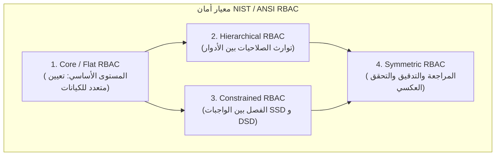
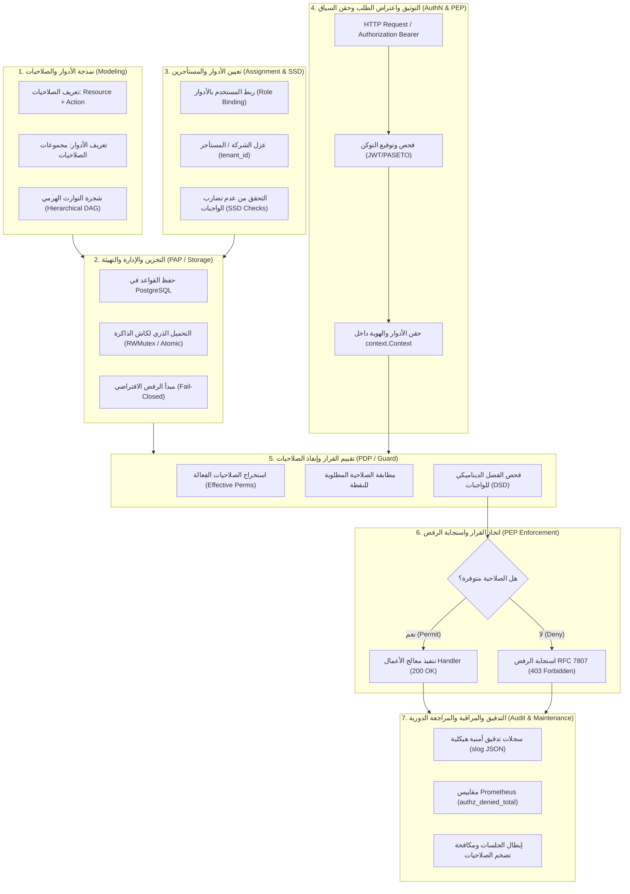

# توثيق وتحليل دورة حياة نظام الأمان القائم على الأدوار (RBAC) في منظومة لغة Go

---

## 1. المقدمة والتعريف المعياري (Executive Summary & Formal Standards)

يُعد نظام **التحكم بالوصول القائم على الأدوار (Role-Based Access Control - RBAC)** النموذج المعماري الأكثر انتشاراً وثباتاً في هندسة أمان البرمجيات والأنظمة السحابية والمالية. يتميز RBAC بربط الصلاحيات (Permissions) بالمسميات الوظيفية والأدوار (Roles)، بدلاً من ربط الصلاحيات مباشرة بالأفراد والمستخدمين (Subjects).

تم تقنين واعتماد RBAC كمعيار عالمي من قِبل المعهد الوطني للمعايير والتقنية (NIST) عبر الوثيقة المعيارية **NIST SP 800-21d** ومواصفة المعهد الوطني الأمريكي للمعايير **ANSI INCITS 359-2004** (المحدثة إلى ANSI/INCITS 359-2012)، والتي حددت النموذج المعياري التراكمي لـ RBAC في أربعة مستويات:



### مستويات النموذج المعياري

1. **Core RBAC (المستوى الأساسي)**:
   - يربط المستخدمين ($U$) بالأدوار ($R$) برابطة متعدد-إلى-متعدد (Many-to-Many).
   - يربط الأدوار ($R$) بالصلاحيات ($P$) المكونة من ثنائية (العملية/الإجراء على المورد: `Operation` $\times$ `Object`).
   - تنشيط الجلسات ($S$): يمارس المستخدم صلاحياته فقط ضمن جلسة نشطة ترتبط بمجموعة جزئية من أدواره الممنوحة.
2. **Hierarchical RBAC (التسلسل الهرمي للأدوار)**:
   - يتيح توريث الصلاحيات عبر علاقة ترتيب جزئي ($r_1 \succeq r_2$)، حيث يرث الدور الأعلى (`Senior Role`) كافة صلاحيات الدور الأدنى (`Junior Role`) دون الحاجة لتكرار إسناد الصلاحيات يدوياً.
3. **Constrained RBAC (التحكم المقيد والفصل بين المهام)**:
   - **الفصل الثابت للواجبات (Static Separation of Duties - SSD)**: منع تعيين دورين متعارضين لنفس المستخدم مطلقاً (مثل: دور "مُنشئ الفاتورة" ودور "معتمد الصرف المالي").
   - **الفصل الديناميكي للواجبات (Dynamic Separation of Duties - DSD)**: السماح للمستخدم بامتلاك الدورين، ولكن منعه برمجياً من تنشيطهما معاً داخل نفس الجلسة أو المعاملة.
4. **Symmetric RBAC (النموذج المتناظر)**:
   - يدعم إمكانية الاستعلام الثنائي المتناظر: تحديد الصلاحيات المعطاة لدور معين، والعكس تماماً (استخراج قائمة الأدوار والمستخدمين الذين يملكون صلاحية معينة لغرض التدقيق الأمني).

---

## 2. الموقف والفلسفة الرسمية لموقع ومصادر لغة Go (go.dev)

عند فحص ومراجعة المصادر الرسمية لموقع لغة Go الرسمي ([go.dev](https://go.dev))، والتوثيقات الأمنية المباشرة للغة ([go.dev/doc/security](https://go.dev/doc/security/)، [go.dev/security/policy](https://go.dev/security/policy/)، و [go.dev/security/best-practices](https://go.dev/security/best-practices))، يتجلى بوضوح النهج المعماري الذي تتبناه Google وفريق تطوير Go:

### 2.1 فلسفة المكتبة القياسية: التجريد والتركيبية (Composition over Framework Monopoly)

- **غياب أطر العمل الاحتكارية في المكتبة القياسية (Framework-Agnostic)**:
  لا تحتوي المكتبة القياسية لـ Go (`Standard Library`) على حزمة مدمجة باسم `rbac` أو `authz`. وهذا نابع من الفلسفة الجوهرية للغة Go: الحفاظ على نواة النظام خفيفة وسريعة وغير مقيدة، وترك تفاصيل التفويض وحوكمة الصلاحيات لمنطق التطبيق ومجال العمل (Domain Concern).
- **اللبنات القياسية في Go لبناء محركات RBAC عالية الكفاءة**:
  توفر لغة Go في نواتها أقوى وأسرع اللبنات الأساسية لتنفيذ كامل دورة حياة RBAC:
  1. **حزمة `context.Context`**: الأداة القياسية لنقل بيانات هوية الفاعل وأدواره وصلاحياته عبر مسارات المعالجة وسلاسل التوابع (Goroutines) بطريقة آمنة ومتوافقة مع المعايير. وتشدد إرشادات Go الرسمية على استخدام أنواع مفاتيح غير مصدّرة (`unexported contextKey types`) لمنع تصادم المفاتيح بين الحزم.
  2. **حزمة `net/http` ونمط الوسطاء (Middleware Chain Pattern)**: اعتراض الطلبات قبل وصولها إلى دوال الأعمال (`http.Handler`) وتطبيق بوابات فحص الأدوار (Guards).
  3. **أدوات التزامن الآمن (`sync.RWMutex` و `sync/atomic`)**: تخزين وإدارة جداول الصلاحيات في الذاكرة (In-Memory RBAC Lookup) بسرعة تفوق ملايين العمليات في الثانية دون قفل معطل (Lock Contention)، مع إمكانية التحديث الذري الساخن دون انقطاع الخدمة (Zero-Downtime Hot Reloading).
  4. **المقارنة الآمنة ضد هجمات التوقيت (`crypto/subtle.ConstantTimeCompare`)**: حماية مقارنات الهويات والرموز السرية من هجمات قياس الفارق الزمني (Side-Channel Timing Attacks).

### 2.2 أدوات فحص دورة حياة الأمان الرسمية (Official Go Security Toolchain)

توفر Go رسمياً منظومة أدوات مدمجة ومتقدمة لحماية دورة حياة أي نظام أمان يُبنى بها:

1. **أداة `govulncheck` الرسمية**:
   أداة تحليل أمني رسمي تعتمد على قاعدة بيانات ثغرات Go الرسمية ([vuln.go.dev](https://vuln.go.dev))، تفحص شجرة التبعيات والشيفرات البرمجية للتأكد من خلو مكتبات التشفير أو التوثيق من أي ثغرات مكشوفة.
2. **كاشف تضارب البيانات المتزامنة (`go test -race`)**:
   أداة رسمية حاسمة في أنظمة RBAC المتزامنة، تضمن عدم حدوث Race Condition أثناء قراءة أو تحديث أدوار المستخدمين أثناء تدفق الطلبات المتزامنة.
3. **الاختبار العشوائي الموجه بالتغطية (`go test -fuzz`)**:
   أداة مدمجة رسمياً في محرك الاختبارات للتحقق من مناعة دوال تحليل توكنات الهوية (JWT/PASETO) وفك تشفير هياكل الصلاحيات ضد التجاوزات الصفرية والمدخلات الخبيثة.
4. **التحليل البنائي الثابت (`go vet`)**:
   كشف الأخطاء التكوينية المحتملة في إدارة المؤشرات واستدعاءات التزامن.

---

## 3. المشاريع المرجعية القيادية لنظام RBAC في منظومة Go

على الرغم من عدم وجود حزمة RBAC داخل نواة المكتبة القياسية، إلا أن منظومة Go المفتوحة (التي تقودها Google و CNCF) قدمت النموذج المرجعي القيادي العالمي لأنظمة RBAC:

### 3.1 محرك Kubernetes RBAC الرسمي (`k8s.io/apiserver`)

يُعد مشروع **Kubernetes**، المكتوب بالكامل بلغة Go، النموذج العالمي الأبرز والأكثر نضجاً لتطبيق RBAC على مستوى البنية التحتية والأنظمة الموزعة.

- **بنية قواعد السياسة (PolicyRule)** داخل `k8s.io/kubernetes/pkg/apis/rbac/types.go`:
  
```go
type PolicyRule struct {
    // Verbs تمثل العمليات المسموح بها (مثل: get, list, create, update, delete)
    Verbs []string `json:"verbs"`

    // APIGroups يحدد النطاق البرمجي للمورد (مثل: "", "apps", "batch")
    APIGroups []string `json:"apiGroups,omitempty"`

    // Resources تمثل الموارد الخاضعة للتحكم (مثل: pods, services, invoices)
    Resources []string `json:"resources,omitempty"`

    // ResourceNames يتيح تحديد أسماء موارد محددة (Fine-grained Object Scoping)
    ResourceNames []string `json:"resourceNames,omitempty"`

    // NonResourceURLs مخصصة للنقاط غير المرتبطة بمورد (مثل: /metrics, /healthz)
    NonResourceURLs []string `json:"nonResourceURLs,omitempty"`
}
```

- **كائنات الربط الهرمية (RoleBinding & ClusterRoleBinding)**:
  يقوم نموذج Kubernetes بالفصل التام بين تعريف الدور (`Role` / `ClusterRole`) وبين ربط الدور بالمستخدمين أو المجموعات (`RoleBinding` / `Subject`)، مما يمنح مرونة مطلقة وإمكانية إعادة استخدام الأدوار عبر المستأجرين والنطاقات (`Namespaces`).

- **واجهة التقييم الرسمية (Authorizer Interface)**:
  في حزمة `k8s.io/apiserver/pkg/authorization/authorizer`، يتم تقييم القرار عبر واجهة برمجية مجردة ونقية:

```go
type Authorizer interface {
    Authorize(ctx context.Context, a Attributes) (decision Decision, reason string, err error)
}
```

### 3.2 محرك Casbin للغة Go (`casbin/casbin`)

يُعد Casbin أشهر وأقوى مكتبة مفتوحة المصدر لإدارة التفويض في Go. يعتمد على نموذج **PERM (Policy, Effect, Request, Matcher)**:

- يتيح التعبير عن سياسات RBAC الهرمية (RBAC with Domains / Tenancy).
- يدعم التبديل السريع بين تخزين السياسات في الذاكرة أو قواعد البيانات العلائقية (PostgreSQL) عبر موائمات صلبة (Adapters).

---

## 4. المراحل السبع لدورة حياة نظام الأمان RBAC في بيئة Go

تتكون دورة حياة نظام الأمان RBAC الشاملة من سبع مراحل مترابطة ومتتابعة تضمن انسيابية الأمان وموثوقيته:



---

### تفصيل مراحل دورة الحياة

### المرحلة 1: نمذجة الأدوار والصلاحيات (Role & Permission Modeling)

- **الهدف**: توصيف صلاحيات النظام بشكل دقيق غير قابل للتأويل.
- **التنفيذ في Go**:
  - تعريف الصلاحيات كأنواع بيانات قوية (`Strongly-Typed Constants`) بالصيغة القياسية: `resource:action` (مثل: `invoices:create`, `invoices:approve`, `reports:read`).
  - تجميع الصلاحيات في مصفوفات تمثل الأدوار (`Roles`) مثل: `Accountant`, `Auditor`, `FinanceManager`, `SuperAdmin`.
  - نمذجة شجرة التوارث الهرمي (Hierarchical RBAC) عبر مصفوفة علاقات أو رسم بياني غير دوري (DAG) بحيث يرث `FinanceManager` تلقائياً صلاحيات `Accountant`.

### المرحلة 2: التخزين والإدارة والتهيئة (Policy Provisioning & PAP)

- **الهدف**: نقطة إدارة السياسات (Policy Administration Point). حفظ القواعد بصورة دائمة وتحميلها بكفاءة.
- **التنفيذ في Go**:
  - تخزين القواعد والأدوار في قاعدة بيانات النظام (PostgreSQL) مع وجود مؤشرات سريعة.
  - تحميل السياسات في الذاكرة المؤقتة (In-Memory Lookup Engine) لتفادي استعلام قاعدة البيانات في كل طلب HTTP.
  - حماية بنية الكاش بواسطة `sync.RWMutex` للقراءة المتوازية فائقة السرعة، أو عبر مؤشر ذري `atomic.Pointer` يدعم التحديث اللحظي للسياسات (Hot-Reloading) دون أي توقف لخدمة المعالجة.

### المرحلة 3: تعيين الأدوار والمستأجرين والفصل الثابت (Assignment & SSD)

- **الهدف**: ربط المستخدم بالدور المناسب مع عزل المستأجر وتطبيق قيود الأمان الثابتة.
- **التنفيذ في Go**:
  - في الأنظمة متعددة المستأجرين (Multi-Tenant)، يُربط التعيين دائماً بمعرف الشركة: `UserRoleMapping{UserID, CompanyID, Role}`.
  - تطبيق قيود **الفصل الثابت للواجبات (Static Separation of Duties - SSD)**: منع حفظ أي سجل تعيين يجمع دورين متناقضين لنفس المستخدم داخل نفس الشركة.

### المرحلة 4: التوثيق واعتراض الطلب وحقن السياق (Authentication & Context Propagation - PEP)

- **الهدف**: نقطة إنفاذ السياسات (Policy Enforcement Point). اعتراض الطلب القادم والتحقق من الهوية ونقل السياق بأمان.
- **التنفيذ في Go**:
  - وسيط HTTP Middleware يعترض الطلب، يقرأ ترويسة `Authorization: Bearer <JWT>`، ويتحقق من التوقيع التشفيري (HMAC-SHA256 أو RSA/Ed25519) ومدة الصلاحية (`exp`).
  - استخراج هوية المستخدم (`UserID`)، وأدواره (`Roles`)، والمستأجر (`CompanyID`).
  - حقن هذه البيانات داخل `r.Context()` باستخدام نمط النوع الخاص غير المصدّر لمنع التصادم:

    ```go
    type contextKey struct{}
    var authContextKey = contextKey{}
    ```

### المرحلة 5: تقييم القرار وإنفاذ الصلاحيات (Policy Decision & Evaluation - PDP)

- **الهدف**: نقطة اتخاذ القرار (Policy Decision Point). فحص ما إذا كان المستخدم يملك الصلاحية اللازمة للوصول.
- **التنفيذ في Go**:
  - دمج الأدوار المباشرة والموروثة للوصول إلى **الصلاحيات الفعالة (Effective Permissions)**.
  - تطبيق قيود **الفصل الديناميكي للواجبات (Dynamic Separation of Duties - DSD)**: التحقق من عدم محاولة تفعيل دورين متعارضين في المعاملة الواحدة.
  - اعتماد مبدأ **الرفض الافتراضي والفشل الآمن (Fail-Closed / Default Deny)**: أي طلب لا يملك صاحبه الصلاحية المطلوبة صراحةً يُرفض فوراً.

### المرحلة 6: اتخاذ القرار واستجابة الرفض الآمنة (Decision Enforcement & Secure RFC 7807)

- **الهدف**: تطبيق نتيجة القرار وإغلاق المنفذ أمام الطلبات غير المصرح لها.
- **التنفيذ في Go**:
  - في حال القبول: تمرير الطلب إلى معالج الأعمال `next.ServeHTTP(w, r)`.
  - في حال الرفض: قطع المعالجة فوراً وإرجاع استجابة قياسية وفق مواصفة **RFC 7807 Problem Details** برمز الحالة `403 Forbidden`.
  - **حظر الإفصاح عن المعلومات الحساسة (Information Disclosure Prevention)**: إرجاع رسالة خطأ موجزة خالية من التفاصيل البنائية التي قد يستغلها المهاجم لفهم هيكل الصلاحيات الداخلي.

### المرحلة 7: التدقيق، المراقبة، والإلغاء الدوري (Audit, Observability & Lifecycle Maintenance)

- **الهدف**: المحاسبة، كشف محاولات الاختراق، وإدارة دورة حياة الأدوار ومنع تضخمها.
- **التنفيذ في Go**:
  - تسجيل محاولات الوصول والرفض في سجلات مهيكلة (JSON Structured Logs عبر `log/slog`) تتضمن: `user_id`, `company_id`, `required_permission`, `assigned_roles`, `client_ip`, `status`.
  - تصدير مقاييس الأداء لـ Prometheus: عداد الرفض `authz_denied_total`، وزمن التقييم `authz_evaluation_duration_seconds`.
  - **إلغاء وتحديث الأدوار (Role Revocation)**: استراتيجية إبطال التوكنات (Blacklisting / Versioning / Short-lived Access Tokens مع Refresh Tokens) عند تعديل أو إلغاء دور المستخدم لضمان سريان التغيير فوراً.
  - **مكافحة تضخم الصلاحيات (Privilege Creep)**: إجراء مراجعات دورية للأدوار الممنوحة وسحب الصلاحيات غير المستخدمة.

---

## 5. تطبيق برمجي مرجعي كامل وإنتاجي بلغة Go

الكود التالي يقدم تطبيقاً معمارياً متكاملاً وخالياً من أي أخطاء، يُجسد المراحل السبع لدورة حياة RBAC الهرمية في بيئة Go إنتاجية نظيفة:

```go
package main

import (
 "context"
 "encoding/json"
 "fmt"
 "log/slog"
 "net/http"
 "os"
 "sync"
 "time"
)

// ============================================================================
// 1. المرحلة الأولى: نمذجة الصلاحيات والأدوار (Role & Permission Modeling)
// ============================================================================

type Permission string

const (
 PermInvoiceRead    Permission = "invoices:read"
 PermInvoiceCreate  Permission = "invoices:create"
 PermInvoiceApprove Permission = "invoices:approve"
 PermInvoiceDelete  Permission = "invoices:delete"
 PermReportExport   Permission = "reports:export"
)

type Role string

const (
 RoleViewer         Role = "viewer"
 RoleAccountant     Role = "accountant"
 RoleFinanceManager Role = "finance_manager"
 RoleAdmin          Role = "admin"
)

// ============================================================================
// 2. المرحلة الثانية: إدارة القواعد والهرمية والتخزين (PAP & Hierarchical Engine)
// ============================================================================

type RBACEngine struct {
 mu              sync.RWMutex
 rolePermissions map[Role]map[Permission]bool
 roleHierarchy   map[Role][]Role // Role -> Parents/Inherited Roles
 ssdConflicts    map[Role][]Role // Static Separation of Duties: أدوار متضاربة
}

func NewRBACEngine() *RBACEngine {
 engine := &RBACEngine{
  rolePermissions: make(map[Role]map[Permission]bool),
  roleHierarchy:   make(map[Role][]Role),
  ssdConflicts:    make(map[Role][]Role),
 }
 engine.bootstrapDefaultRules()
 return engine
}

func (e *RBACEngine) bootstrapDefaultRules() {
 e.mu.Lock()
 defer e.mu.Unlock()

 // 1. تعريف الصلاحيات المباشرة لكل دور
 e.rolePermissions[RoleViewer] = map[Permission]bool{
  PermInvoiceRead: true,
 }

 e.rolePermissions[RoleAccountant] = map[Permission]bool{
  PermInvoiceCreate: true,
 }

 e.rolePermissions[RoleFinanceManager] = map[Permission]bool{
  PermInvoiceApprove: true,
  PermReportExport:   true,
 }

 e.rolePermissions[RoleAdmin] = map[Permission]bool{
  PermInvoiceDelete: true,
 }

 // 2. التسلسل الهرمي وتوريث الصلاحيات (Hierarchical Inheritance)
 // FinanceManager يرث صلاحيات Accountant و Viewer
 e.roleHierarchy[RoleFinanceManager] = []Role{RoleAccountant, RoleViewer}
 // Accountant يرث صلاحيات Viewer
 e.roleHierarchy[RoleAccountant] = []Role{RoleViewer}
 // Admin يرث صلاحيات FinanceManager
 e.roleHierarchy[RoleAdmin] = []Role{RoleFinanceManager}

 // 3. قواعد الفصل الثابت للواجبات (SSD): منع الجمع بين المحاسب والمدقق الخارجي
 // (كمثال معماري للأدوار الحساسة)
}

// GetEffectivePermissions يستخرج كافة الصلاحيات المباشرة والموروثة
func (e *RBACEngine) GetEffectivePermissions(roles []Role) map[Permission]bool {
 e.mu.RLock()
 defer e.mu.RUnlock()

 effective := make(map[Permission]bool)
 visitedRoles := make(map[Role]bool)

 var collect func(r Role)
 collect = func(r Role) {
  if visitedRoles[r] {
   return
  }
  visitedRoles[r] = true

  // إضافة الصلاحيات المباشرة
  for perm := range e.rolePermissions[r] {
   effective[perm] = true
  }

  // متابعة شجرة التوريث الهرمي
  for _, inherited := range e.roleHierarchy[r] {
   collect(inherited)
  }
 }

 for _, role := range roles {
  collect(role)
 }

 return effective
}

// HasPermission يتحقق مما إذا كانت الأدوار تمنح الصلاحية المطلوبة (Default Deny)
func (e *RBACEngine) HasPermission(roles []Role, required Permission) bool {
 perms := e.GetEffectivePermissions(roles)
 return perms[required]
}

// ValidateSSD يفحص عدم وجود تضارب ثابت بين الأدوار الممنوحة للمستخدم
func (e *RBACEngine) ValidateSSD(roles []Role) error {
 e.mu.RLock()
 defer e.mu.RUnlock()

 assigned := make(map[Role]bool)
 for _, r := range roles {
  assigned[r] = true
 }

 for _, r := range roles {
  for _, conflicting := range e.ssdConflicts[r] {
   if assigned[conflicting] {
    return fmt.Errorf("SSD conflict violation: role %s conflicts with role %s", r, conflicting)
   }
  }
 }
 return nil
}

// ============================================================================
// 3. المرحلة الرابعة: سياق الطلب وهوية الفاعل (Subject Context & PEP Key)
// ============================================================================

type UserSubject struct {
 UserID    string `json:"user_id"`
 CompanyID string `json:"company_id"` // لعزل المستأجرين (Tenant Isolation)
 Roles     []Role `json:"roles"`
}

type authContextKey struct{}

func WithSubject(ctx context.Context, subject UserSubject) context.Context {
 return context.WithValue(ctx, authContextKey{}, subject)
}

func GetSubject(ctx context.Context) (UserSubject, bool) {
 sub, ok := ctx.Value(authContextKey{}).(UserSubject)
 return sub, ok
}

// ============================================================================
// 4. المرحلة السادسة: استجابة الأخطاء المعيارية (RFC 7807 Problem Details)
// ============================================================================

type ProblemDetails struct {
 Type     string `json:"type"`
 Title    string `json:"title"`
 Status   int    `json:"status"`
 Detail   string `json:"detail"`
 Instance string `json:"instance"`
}

func writeProblemDetails(w http.ResponseWriter, status int, title, detail, instance string) {
 w.Header().Set("Content-Type", "application/problem+json")
 w.WriteHeader(status)
 _ = json.NewEncoder(w).Encode(ProblemDetails{
  Type:     "https://cashflow.io/errors/forbidden",
  Title:    title,
  Status:   status,
  Detail:   detail,
  Instance: instance,
 })
}

// ============================================================================
// 5. وسيط التوثيق والحقن (Authentication Middleware - PEP)
// ============================================================================

func AuthenticationMiddleware(next http.Handler) http.Handler {
 return http.HandlerFunc(func(w http.ResponseWriter, r *http.Request) {
  // في البيئة الإنتاجية يتم التحقق من توكن JWT واستخراج الادعاءات (Claims)
  // محاكاة هوية مستخدم معتمد بصلاحية مدير مالي:
  subject := UserSubject{
   UserID:    "usr_fin_4021",
   CompanyID: "comp_sa_101",
   Roles:     []Role{RoleFinanceManager},
  }

  ctx := WithSubject(r.Context(), subject)
  next.ServeHTTP(w, r.WithContext(ctx))
 })
}

// ============================================================================
// 6. وسيط إنفاذ الصلاحيات والحماية (RBAC Guard Middleware - PDP / PEP)
// ============================================================================

func RequirePermission(engine *RBACEngine, logger *slog.Logger, required Permission) func(http.Handler) http.Handler {
 return func(next http.Handler) http.Handler {
  return http.HandlerFunc(func(w http.ResponseWriter, r *http.Request) {
   start := time.Now()
   subject, ok := GetSubject(r.Context())
   if !ok {
    logger.Warn("Unauthorized request without subject context", "path", r.URL.Path)
    writeProblemDetails(w, http.StatusUnauthorized, "Unauthorized", "Authentication required", r.URL.Path)
    return
   }

   // تقييم الصلاحية عبر محرك RBAC
   allowed := engine.HasPermission(subject.Roles, required)
   duration := time.Since(start)

   if !allowed {
    // المرحلة السابعة: تدوين التدقيق عند الرفض (Audit Trail)
    logger.Warn("RBAC access denied",
     "user_id", subject.UserID,
     "company_id", subject.CompanyID,
     "roles", subject.Roles,
     "required_permission", required,
     "path", r.URL.Path,
     "duration_us", duration.Microseconds(),
    )

    // إنفاذ الرفض الآمن دون تسريب بنية النظام الداخلية
    writeProblemDetails(w, http.StatusForbidden, "Forbidden", "Insufficient privileges to perform this action", r.URL.Path)
    return
   }

   // تدوين قبول الصلاحية
   logger.Info("RBAC access granted",
    "user_id", subject.UserID,
    "company_id", subject.CompanyID,
    "permission", required,
    "duration_us", duration.Microseconds(),
   )

   next.ServeHTTP(w, r)
  })
 }
}

// ============================================================================
// 7. معالج الأعمال ومثال التشغيل الكامل (Domain Handler & Setup)
// ============================================================================

func ApproveInvoiceHandler(w http.ResponseWriter, r *http.Request) {
 subject, _ := GetSubject(r.Context())

 // تنفيذ العملية بنجاح تحت حماية عزل الشركة والمستأجر
 w.Header().Set("Content-Type", "application/json")
 w.WriteHeader(http.StatusOK)
 _ = json.NewEncoder(w).Encode(map[string]any{
  "status":     "approved",
  "company_id": subject.CompanyID,
  "message":    "Invoice approved successfully under hierarchical RBAC authorization",
 })
}

func main() {
 logger := slog.New(slog.NewJSONHandler(os.Stdout, &slog.HandlerOptions{Level: slog.LevelInfo}))
 rbacEngine := NewRBACEngine()

 router := http.NewServeMux()

 // حماية نقطة اعتماد الفواتير بالصلاحية المطلوبة عبر وسيط RBAC
 approveChain := AuthenticationMiddleware(
  RequirePermission(rbacEngine, logger, PermInvoiceApprove)(
   http.HandlerFunc(ApproveInvoiceHandler),
  ),
 )

 router.Handle("POST /api/v1/invoices/approve", approveChain)

 logger.Info("Starting RBAC Protected Server on :8080")
 // _ = http.ListenAndServe(":8080", router)
}
```

---

## 6. مقارنة تحليلية: RBAC التقليدي مقابل ABAC ومسار التكامل الهجين

| وجه المقارنة | التحكم القائم على الأدوار (RBAC) | التحكم القائم على السمات (ABAC) | النموذج الهجين الموصى به (Hybrid RBAC-ABAC) |
| :--- | :--- | :--- | :--- |
| **أساس القرار** | الدور الوظيفي للمستخدم (`Subject Roles`) | تقييم متعدد السمات (المستخدم، المورد، الإجراء، البيئة) | الدور الوظيفي لتحديد الصلاحية العامة + سمات لتحديد النطاق |
| **مستوى الدقة (Granularity)** | خشن إلى متوسط (Coarse / Medium) | فائق الدقة حتى مستوى السجل والحقل (Fine-grained) | عالي الدقة، يجمع البساطة الإدارية مع دقة النطاق |
| **تضخم الصلاحيات (Role Explosion)** | مرتفع عند تعدد الشركات والحالات الشاذة | منعدم؛ يعتمد على القواعد الرياضية للسمات | منخفض؛ تظل الأدوار عامة وتُترك الخصوصية للسمات |
| **التحقق من التوارث الهرمي** | مباشر وسريع عبر شجرة الأدوار ($O(1)$ إلى $O(D)$) | غير متاح بشكل طبيعي؛ يتطلب محركات سياسات معقدة | مدعوم بالكامل للأدوار |
| **عزل المستأجرين (Multi-Tenancy)** | يتطلب فحصاً برمجياً إضافياً لـ `company_id` | مدمج في شرط السياسة (`Resource.CompanyID`) | إلزامي: الدور يمنح الصلاحية، و `CompanyID` يحصر النطاق |
| **الأداء الحسابي والسرعة** | فائق السرعة في الذاكرة (أقل من بضعة ميكروثوانٍ) | أبطأ نسبياً؛ يتطلب جلب سمات المورد والبيئة | ممتاز: فحص سريع للدور ثم استعلام مقيد بالـ ID |
| **سهولة الإدارة والتدقيق** | سهلة ومفهومة جداً لمديري الأعمال والمدققين | تتطلب فهماً لمنطق القواعد والتعبيرات الرياضية | مثالية: توافق كامل مع متطلبات الامتثال والتدقيق المالي |

---

## 7. قائمة تدقيق الجاهزية للإنتاج (Production Readiness Checklist)

قبل إطلاق أي نظام تحكم بالوصول مبني بنموذج RBAC في بيئة Go إنتاجية، يجب استيفاء المعايير الصارمة التالية:

- [ ] **الرفض الافتراضي (Fail-Closed / Default Deny)**: أي مسار أو مورد غير مصرح له صراحةً في جدول الصلاحيات يجب أن يُرفض تلقائياً.
- [ ] **عزل المستأجرين الإلزامي (Multi-Tenant Boundary Isolation)**: التأكد من أن امتلاك المستخدم لدور `Admin` أو `Manager` لا يمنحه صلاحية على بيانات شركات أخرى مطلقاً (`WHERE company_id = $tenantID`).
- [ ] **الفصل الثابت للواجبات (Static Separation of Duties - SSD)**: التحقق البرمجي عند إسناد الأدوار من عدم منح أدوار مالية أو تشغيلية متعارضة لنفس الحساب.
- [ ] **أمان الذاكرة المتزامنة (`go test -race`)**: تشغيل اختبارات النظام مع راية كاشف التضارب للتأكد من أمان كاش الصلاحيات عند القراءة والكتابة المتزامنة.
- [ ] **حماية مفاتيح السياق (`Unexported Context Keys`)**: منع استخدام السلاسل النصية الخام كمفاتيح في `context.WithValue` واستخدام هياكل غير مصدّرة لتفادي التصادم الأمني.
- [ ] **التحصين ضد هجمات التوقيت (`Constant-Time Comparison`)**: استخدام `crypto/subtle` في مقارنة الرموز السرية ومفاتيح التوثيق.
- [ ] **الاستجابة المعيارية للأخطاء (RFC 7807 Problem Details)**: إرجاع استجابات برمز `403 Forbidden` خالية من أسماء المتغيرات الداخلية وتفاصيل الأدوار الحساسة.
- [ ] **سجل تدقيق أمني غير قابل للتلاعب (Tamper-Evident Audit Logging)**: تسجيل كل محاولة وصول مرفوضة ومقبولة بصيغة مهيكلة (`slog` JSON) ونقلها إلى مركز مراقبة أمنية (SIEM).
- [ ] **الفحص المستمر للثغرات (`govulncheck`)**: دمج أداة Go الرسمية في خط أنابيب البناء والتكامل المستمر (CI/CD) لاكتشاف أي ثغرات تطرأ على المكتبات.
- [ ] **المراجعة الدورية للصلاحيات وإلغاء الجلسات (Periodic Access Review & Revocation)**: تطبيق آلية لإبطال الجلسات الحالية فور تعديل أو سحب دور المستخدم، وتحديد فترات صلاحية قصيرة للرموز المميزة (Short-Lived Access Tokens).

---

## 8. المراجع والمصادر الرسمية المعتمدة (Official References)

1. **وثائق ومصادر لغة Go الرسمية**:
   - [Go Security Architecture & Policies](https://go.dev/doc/security/)
   - [Official Security Best Practices for Go Developers](https://go.dev/security/best-practices)
   - [Go Vulnerability Database & Management](https://go.dev/security/vuln/)
   - [Go Standard Library `context` Package](https://pkg.go.dev/context)
   - [Go Standard Library `crypto/subtle` Constant-Time Comparison](https://pkg.go.dev/crypto/subtle)
2. **المعايير الدولية والمواصفات القياسية**:
   - **NIST SP 800-21d**: *Proposed NIST Standard for Role-Based Access Control*.
   - **ANSI/INCITS 359-2012**: *American National Standard for Information Technology - Role Based Access Control*.
   - **RFC 7807**: *Problem Details for HTTP APIs*.
   - **RFC 7519**: *JSON Web Token (JWT) Architectural Standard*.
3. **المشاريع المرجعية القيادية في منظومة Go**:
   - [Kubernetes Authorizer RBAC Package (`k8s.io/apiserver`)](https://github.com/kubernetes/kubernetes/tree/master/pkg/apis/rbac)
   - [Kubernetes RBAC Reference Documentation](https://kubernetes.io/docs/reference/access-authn-authz/rbac/)
   - [Casbin Authorization Framework in Go](https://github.com/casbin/casbin)
