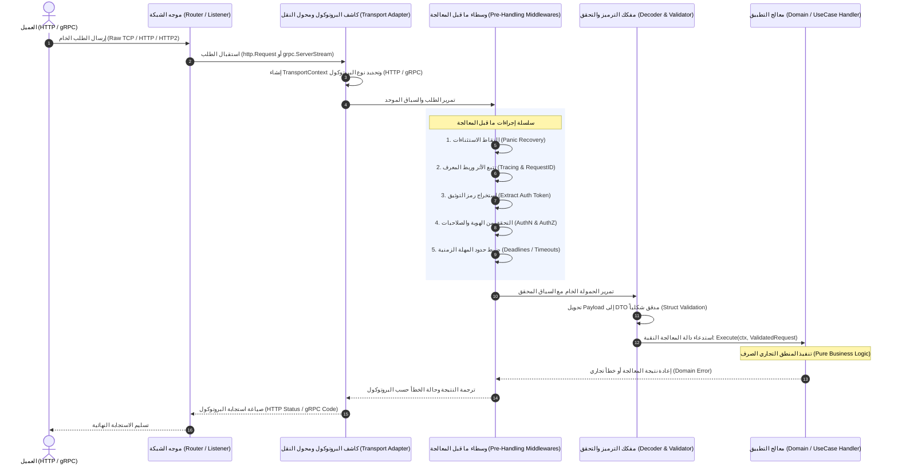

# التحليل المعماري والهندسي الشامل لطبقة النقل (Transport Layer) في Go: توحيد واجهات HTTP و gRPC قبل وصول الطلب إلى المعالجة (Handling)

---

## 1. المقدمة والملخص التنفيذي (Executive Summary)

في معمارية الأنظمة الموزعة والخدمات المصغرة (Microservices) المبنية بلغة **Go**، تُمثل **طبقة النقل (Transport Layer)** البوابة الحدودية الأولى (Edge Ingress) التي تستقبل طلبات الشبكة الخام، وتفك شفراتها، وتتحقق من هويتها، قبل تمريرها إلى المنطق التجاري الداخلي (Core Business Logic / Application Use Cases).

يواجه مهندسو البرمجيات معضلة معمارية شائعة عند الحاجة إلى دعم بروتوكولين متزامنين لنفس الخدمة:

1. **بروتوكول HTTP/REST (JSON):** مخصص لواجهات الويب، وتطبيقات الهاتف، والتكاملات الخارجية مع أطراف ثالثة (Public APIs).
2. **بروتوكول gRPC (Protobuf over HTTP/2):** مخصص للاتصال الداخلي عالي الأداء بين الخدمات المصغرة (Service-to-Service East-West Traffic) أو البث اللحظي (Streaming).

### الإشكالية الهندسية المحورية (The Core Engineering Problem)

إذا تعامل المنطق التجاري (Handler / Service) مباشرة مع كائنات بروتوكولية منخفضة المستوى مثل `*http.Request` أو هياكل Protobuf المتولدة تلقائياً، يحدث **تسرب بروتوكولي (Protocol Leakage)** يؤدي إلى:

- اقتران وثيق (Tight Coupling) بالشبكة ونوع الاتصال.
- تكرار كود المصادقة (Authentication)، وتسجيل العمليات (Logging)، وتتبع الأثر (Distributed Tracing)، والتحقق من صحة البيانات (Validation) مرتين: مرة لـ HTTP ومرة لـ gRPC.
- صعوبة بالغة في كتابة اختبارات الوحدة (Unit Testing) دون محاكاة كاملة لخوادم الشبكة والـ Context البرمجي الخاص بكل بروتوكول.

### الهدف من هذا التحليل

يقدم هذا التقرير تحليلاً هندسياً شاملاً ومستفيضاً مستنداً إلى **المصادر الرسمية للغة Go** والمجتمعات المعمارية القياسية (`net/http`, `google.golang.org/grpc`, `Go kit`, `ConnectRPC`, `gRPC-Gateway`, و `Clean Architecture`) للإجابة بدقة على:

1. **كيفية بناء واجهة تجريدية (Transport Interface)** تستقبل الطلب من الـ Router أياً كان مصدره (HTTP أو gRPC).
2. **كيفية تحديد كينونة البروتوكول المعالِج للطلب** وتغطيته داخل الـ Interface أو السياق (`context.Context`).
3. **دورة حياة ما قبل المعالجة (Pre-Handling Pipeline):** ما هي الإجراءات الصارمة التي يجب أن يخضع لها الطلب (استخراج البيانات الوصفية، التحقق الأمني، استخلاص الهوية، تتبع الأثر) قبل تسليمه إلى الـ Handling النقي.

---

## 2. المرجعيات والمصادر الرسمية لمنظومة Go (Official Go Ecosystem References)

تعتمد معايير هندسة طبقة النقل في Go على وثائق ومستودعات رسمية تشرف عليها شركة Google وفرق تطوير Go و gRPC:

1. **المكتبة القياسية للغة Go (`net/http`):**
   - الوثائق الرسمية: [pkg.go.dev/net/http](https://pkg.go.dev/net/http)
   - الواجهة المحورية: `http.Handler` والدالة `ServeHTTP(ResponseWriter, *Request)`. تمثل معيار Go الذهبي للتجريد التكويني (Composable Abstraction).
2. **المشروع الرسمي لـ gRPC في Go (`google.golang.org/grpc`):**
   - الوثائق الرسمية: [grpc.io/docs/languages/go](https://grpc.io/docs/languages/go/) و [pkg.go.dev/google.golang.org/grpc](https://pkg.go.dev/google.golang.org/grpc)
   - آليات الاعتراض الرسمية: `grpc.UnaryServerInterceptor` و `grpc.StreamServerInterceptor` لمعالجة الطلبات قبل وصولها للـ Handler.
   - إدارة البيانات الوصفية: `google.golang.org/grpc/metadata` عبر هياكل `metadata.MD`.
3. **مشروع ConnectRPC (المعيار الحديث المدعوم من Buf):**
   - الوثائق الرسمية: [connectrpc.com](https://connectrpc.com)
   - يقدم توحيداً هندسياً يتيح تشغيل بروتوكول gRPC وبروتوكول HTTP/JSON عبر واجهة `net/http` القياسية دون الحاجة لخوادم منفصلة.
4. **مشروع gRPC-Gateway الرسمي:**
   - الوثائق الرسمية: [github.com/grpc-ecosystem/grpc-gateway](https://github.com/grpc-ecosystem/grpc-gateway)
   - نمط وكيل الترجمة العكسي (Reverse Proxy Translation) من HTTP/JSON إلى gRPC في نفس التطبيق أو كبوابة وسيطة.
5. **معمارية Go kit الرسمية لطبقة النقل (Go kit Transport Architecture):**
   - الوثائق الرسمية: [gokit.io/docs/architecture](https://gokit.io/docs/architecture/)
   - المفهوم الأساسي: تقسيم الخدمة إلى 3 طبقات صارمة: (Transport -> Endpoint -> Service)، حيث تكون الـ Endpoints مجرد دوال نقية `type Endpoint func(ctx context.Context, request any) (response any, err error)`.

---

## 3. الهيكلية المعمارية: أين تقع طبقة النقل؟ (Architectural Placement)

وفق مبادئ المعمارية السداسية (Hexagonal / Ports and Adapters) والمعمارية النظيفة (Clean Architecture)، تُصنف طبقة النقل على أنها **محول قيادة (Driving / Primary Adapter)**.

```mermaid
flowchart TD
    subgraph ExternalClients ["العملاء الخارجيون (External Clients)"]
        Browser["مستعرض الويب / تطبيق الهاتف<br/>(HTTP/REST JSON)"]
        Microservice["خدمة مصغرة داخلية<br/>(gRPC Protobuf over HTTP/2)"]
    end

    subgraph NetworkRouting ["طبقة توجيه الشبكة (Network Ingress & Routers)"]
        MuxHTTP["HTTP Router / Mux<br/>(Chi / Gin / stdlib)"]
        ServerGRPC["gRPC Server<br/>(google.golang.org/grpc)"]
    end

    subgraph TransportAbstractionLayer ["طبقة تجريد النقل (Transport Abstraction Layer)"]
        direction TB
        UnifiedInterface["واجهة تجريد النقل / محول الطلب<br/>(Transport Adapter & Request Context)"]
        
        subgraph PreHandlingPipeline ["خط أنابيب ما قبل المعالجة (Pre-Handling Pipeline)"]
            P1["1. تمييز البروتوكول (Protocol Identification)"]
            P2["2. استخراج البيانات الوصفية (Metadata Normalization)"]
            P3["3. تتبع الأثر وربط الطلب (Tracing & Request ID)"]
            P4["4. المصادقة واستخراج الهوية (Auth & Principal Extraction)"]
            P5["5. فك الترميز والتحقق الشكلي (Decoding & Validation)"]
            P6["6. قيود المهلة والمعدل (Timeout & Rate Limiting)"]
            P1 --> P2 --> P3 --> P4 --> P5 --> P6
        end
        UnifiedInterface --> PreHandlingPipeline
    end

    subgraph CoreApplicationLayer ["طبقة التطبيق والمنطق التجاري (Handling / Domain Core)"]
        AppHandler["معالج التطبيق النقي (Use Case / Domain Handler)<br/>لا يعرف شيئاً عن HTTP أو gRPC"]
        DomainService["خدمات المجال (Domain Services & Entities)"]
        AppHandler --> DomainService
    end

    Browser -->|HTTP Request| MuxHTTP
    Microservice -->|gRPC Call| ServerGRPC
    MuxHTTP --> UnifiedInterface
    ServerGRPC --> UnifiedInterface
    PreHandlingPipeline -->|طلب موحد ومُطهر (Sanitized DTO)| AppHandler
```

---

## 4. المكونات الثلاثة لمعمارية النقل الموحدة

لتحقيق الفصل الكامل وتحديد هوية المنفذ (HTTP أو gRPC) قبل وصول الطلب إلى المعالجة، تنقسم المنظومة إلى ثلاثة أركان:

### 4.1 ركن التمييز (Protocol Identification)

تعريف نوع البروتوكول بوضوح عبر نوع بيانات مخصص (Custom Enum Type) في Go، يحدد قناة الاتصال التي ورد منها الطلب:

```go
type TransportProtocol string

const (
    ProtocolHTTP TransportProtocol = "HTTP"
    ProtocolGRPC TransportProtocol = "GRPC"
)
```

### 4.2 ركن تجريد السياق والمعلومات الوصفية (Transport Context Abstraction)

توحيد الوصول إلى البيانات العابرة للبروتوكولات (مثل رؤوس الطلب، معرف الطلب، عنوان العميل IP، رمز التوثيق Bearer Token) عبر `interface` يُمكّن الوسطاء والمعالجات من استجواب الطلب دون استيراد حزم `net/http` أو `google.golang.org/grpc/metadata`.

### 4.3 ركن خط أنابيب ما قبل المعالجة (Pre-Handling Middleware/Interceptor Pipeline)

سلسلة عمليات متتابعة تُنفذ إجبارياً على كلا المسارين، تضمن خروج كائن طلب موثق وصالح تماماً (Validated DTO) ومُلحق بـ `context.Context` غني ببيانات الهوية وتتبع الأثر.

---

## 5. المقارنة المتعمقة للأنماط المعمارية لتجريد النقل في Go

قبل الاستقرار على الواجهة المثالية، يجب فهم الأنماط الهندسية المتبعة في بيئات الإنتاج للغة Go:

| النمط المعماري (Architecture Pattern) | آلية العمل | المزايا | العيوب والتكلفة | متى يُوصى به؟ |
| :--- | :--- | :--- | :--- | :--- |
| **1. نمط Go-kit (Endpoint + Transport Server)** | تحويل كل عملية إلى `Endpoint` موحد: `func(ctx, req) (resp, err)`، ولكل بروتوكول `Decoder` و `Encoder` خاص به. | استقلالية كاملة للـ Endpoint، تطبيق سهل للـ Middlewares الموحدة. | كتابة كود كثير (Boilerplate) لفك وتجميع الهياكل. | الأنظمة الكبيرة عالية التوزيع ومتعددة البروتوكولات. |
| **2. نمط المعمارية النظيفة الكلاسيكية (Dual Driving Adapters)** | إنشاء `http.Handler` و `grpc.Server` كطبقتين منفصلتين في `internal/transport/` تستدعيان نفس الـ `UseCase Interface`. | البساطة، وضوح التبعيات، سهولة قراءة الكود بدون مكتبات خارجية. | احتمال تكرار منطق فك الرؤوس والمصادقة إذا لم يتم توحيد الوسطاء. | معظم التطبيقات المؤسسية القياسية. |
| **3. نمط واجهة سياق النقل الموحدة (Unified TransportContext)** | تمرير واجهة `TransportContext` أو حقن كائن `TransportInfo` داخل `context.Context` عبر وسيط موحد. | الوصول لمعلومات البروتوكول وهوية العميل بنفس الواجهة داخل أي معالج. | يحتاج تصميماً دقيقاً لعدم كسر اصطلاحات Go القياسية في `context.Context`. | **هو النمط المطلوب للإجابة عن هوية المعالج وسياقه.** |
| **4. نمط ConnectRPC (الاندماج التام مع `net/http`)** | كتابة واجهة Protobuf وتوليد معالجات تلتزم بـ `http.Handler` وتدعم gRPC و gRPC-Web و JSON تلقائياً. | أداء عالي جداً، التزام كامل بـ `stdlib`، انعدام الحاجة لخادمين منفصلين. | الارتباط بمولدات كود ConnectRPC. | المشاريع الحديثة التي تبدأ من الصفر (Greenfield). |
| **5. نمط gRPC-Gateway (وكيل الترجمة)** | خادم gRPC هو الأصل، وبوابة HTTP تقوم بترجمة طلبات REST/JSON وتحويلها داخلياً إلى استدعاءات gRPC. | مصدر حقيقة واحد (`.proto`)، واجهة برمجية متطابقة تلقائياً. | طبقة شبكة إضافية (Overhead)، صعوبة تخصيص سلوكيات HTTP الفريدة. | عند هيمنة gRPC وحاجة الويب لـ REST جانبي. |

---

## 6. رحلة الطلب: تفكيك دورة حياة ما قبل المعالجة (Pre-Handling Lifecycle)

ما الذي يجب أن يحدث للطلب منذ لحظة وصوله إلى الـ Router وحتى تسليمه للـ Handler؟ تتبع الرحلة خطوة بخطوة:



### تفاصيل المراحل الست لخط الأنابيب

#### المرحلة 1: تحديد هوية البروتوكول وتغليف الطلب (Protocol Stamping)

يتم إنشاء كائن موحد أو وسم السياق برمز البروتوكول:

- إذا جاء الطلب عبر `http.Handler` يتم تعيين `ProtocolHTTP`.
- إذا جاء الطلب عبر `grpc.UnaryServerInterceptor` يتم تعيين `ProtocolGRPC`.

#### المرحلة 2: تطبيع البيانات الوصفية (Metadata Normalization)

- **في HTTP:** تُقرأ الرؤوس من `r.Header` (مثل `Authorization`, `X-Request-ID`, `X-Forwarded-For`).
- **في gRPC:** تُقرأ من سياق الطلب عبر `metadata.FromIncomingContext(ctx)` حيث الرؤوس مخزنة كمصفوفة مفاتيح وقيم (`metadata.MD`).
- **المعالجة الموحدة:** استخراج هذه المفاتيح بقيم قياسية موحدة لا تعتمد على حالة الحروف (Case-Insensitive).

#### المرحلة 3: تتبع الأثر وتوليد معرف الطلب المترابط (Correlation & Tracing)

- التحقق من وجود رأس `X-Request-ID` أو توليد معرّف فريد بصيغة `UUIDv7` أو `ULID`.
- فك سياق التتبع الموزع وفق معيار **W3C TraceContext** (`traceparent`, `tracestate`) ودمجه في OpenTelemetry Span.

#### المرحلة 4: المصادقة وحل الهوية (Authentication & Principal Resolution)

- استخراج رمز التوثيق (Bearer JWT أو API Key):
  - HTTP: قراءة رأس `Authorization: Bearer <token>`.
  - gRPC: قراءة المفتاح `"authorization"` من `metadata.MD`.
- التحقق التشفيري من التوقيع والصلاحية الزمنية.
- تحويل الرمز إلى كائن هوية مستخدم نقي (`UserPrincipal` أو `SecurityContext`) وحقنه في `context.Context` ليصبح متاحاً للمعالجات الداخلية دون معرفة كيفية استخراجه.

#### المرحلة 5: فك الترميز والتحقق الشكلي (Decoding & Syntactic Validation)

- HTTP: قراءة `io.Reader` وتحويل الـ JSON إلى الهيكل الهدف `json.NewDecoder(r.Body).Decode(&req)`.
- gRPC: تم فك الترميز تلقائياً عبر محرك Protobuf إلى كائن الـ Struct المتولد.
- التحقق الشكلي: تطبيق قواعد التحقق الموحدة (مثل فحص الحقول الإلزامية، أطوال النصوص، التنسيقات) عبر وسيط موحد يعمل على كائن Go الناتج.

#### المرحلة 6: فرض حدود المهل الزمنية ومعدل الاستهلاك (Timeouts & Rate Limiting)

- gRPC ينقل مهلة العميل تلقائياً عبر رأس `grpc-timeout` وتحويلها لـ `context.WithDeadline`.
- HTTP يتطلب وسيطاً يحدد مهلة قصوى للمعالجة `context.WithTimeout(ctx, 5*time.Second)`.

---

## 7. التصميم الهندسي المتكامل للواجهات وتطبيق الكود بلغة Go (Production Implementation)

سنقوم الآن ببناء حزمة هندسية متكاملة وقابلة للتشغيل توضح كيفية تصميم واجهة الـ Transport الموحدة، وكيفية معرفة من يعالج الطلب، وكيفية إدارة مرحلة ما قبل الـ Handling.

### 7.1 تعريف واجهات طبقة النقل والسياق (`transport.go`)

```go
package transport

import (
 "context"
 "net"
 "strings"
 "time"
)

// TransportProtocol يحدد نوع البروتوكول الذي وصل منه الطلب
type TransportProtocol string

const (
 ProtocolHTTP TransportProtocol = "HTTP"
 ProtocolGRPC TransportProtocol = "GRPC"
)

// String تمثيل نصي للبروتوكول
func (p TransportProtocol) String() string {
 return string(p)
}

// SecurityPrincipal يحمل هوية العميل بعد المصادقة بشكل مستقل تماماً عن البروتوكول
type SecurityPrincipal struct {
 UserID    string
 TenantID  string
 Roles     []string
 Scopes    []string
 Subject   string
 IsAdmin   bool
}

// TransportContext واجهة مجردة موحدة تغلف الطلب الوارد وتكشف عن هوية البروتوكول وبياناته
type TransportContext interface {
 // Protocol يُحدد من هو البروتوكول الذي يعالج الطلب حالياً (HTTP أم GRPC)
 Protocol() TransportProtocol
 
 // Context يعيد سياق Go القياسي المدمج به المهل الزمنية والإلغاء
 Context() context.Context
 
 // RequestID يعيد المعرف الفريد لتتبع الطلب عبر الأنظمة
 RequestID() string
 
 // ClientIP يعيد عنوان IP الحقيقي للمتصل بعد تتبع البروكسي
 ClientIP() string
 
 // UserAgent يعيد معرف عميل المتصل
 UserAgent() string
 
 // Header يعيد قيمة رأس محدد بغض النظر عن حالة الأحرف
 Header(key string) string
 
 // Principal يعيد كائن الهوية المحقق للمستخدم (إن وجد)
 Principal() (*SecurityPrincipal, bool)
 
 // SetPrincipal يقوم بتسجيل الهوية بعد نجاح خطوة المصادقة
 SetPrincipal(principal *SecurityPrincipal)
}
```

---

### 7.2 سياق Go ومفتاح التخزين الآمن (`context_keys.go`)

لضمان عدم تسريب المتغيرات ومنع تصادم المفاتيح في `context.Context`، نتبع أسلوب Go الرسمي باستخدام أنواع خاصة غير مصدّرة (Unexported Types):

```go
package transport

import "context"

type contextKey int

const (
 transportInfoKey contextKey = iota
 principalKey
)

// TransportInfo هيكل يحوي بيانات النقل المستخلصة لربطها بالسياق
type TransportInfo struct {
 Protocol  TransportProtocol
 RequestID string
 ClientIP  string
 UserAgent string
}

// WithTransportInfo يحقن بيانات النقل داخل context.Context القياسي
func WithTransportInfo(ctx context.Context, info TransportInfo) context.Context {
 return context.WithValue(ctx, transportInfoKey, info)
}

// GetTransportInfo يسترجع بيانات النقل من السياق
func GetTransportInfo(ctx context.Context) (TransportInfo, bool) {
 info, ok := ctx.Value(transportInfoKey).(TransportInfo)
 return info, ok
}

// WithPrincipal يحقن كائن الهوية داخل السياق
func WithPrincipal(ctx context.Context, p *SecurityPrincipal) context.Context {
 return context.WithValue(ctx, principalKey, p)
}

// GetPrincipal يسترجع كائن الهوية من السياق
func GetPrincipal(ctx context.Context) (*SecurityPrincipal, bool) {
 p, ok := ctx.Value(principalKey).(*SecurityPrincipal)
 return p, ok
}
```

---

### 7.3 التطبيق الملموس لـ HTTP Transport (`http_transport.go`)

هنا نقوم بتغليف `http.ResponseWriter` و `*http.Request` داخل واجهة `TransportContext`:

```go
package transport

import (
 "context"
 "net"
 "net/http"
 "strings"
)

type httpTransportContext struct {
 req       *http.Request
 requestID string
 principal *SecurityPrincipal
}

// NewHTTPTransportContext ينشئ سياق نقل مخصص لطلبات HTTP
func NewHTTPTransportContext(req *http.Request, requestID string) TransportContext {
 return &httpTransportContext{
  req:       req,
  requestID: requestID,
 }
}

func (h *httpTransportContext) Protocol() TransportProtocol {
 return ProtocolHTTP
}

func (h *httpTransportContext) Context() context.Context {
 return h.req.Context()
}

func (h *httpTransportContext) RequestID() string {
 return h.requestID
}

func (h *httpTransportContext) ClientIP() string {
 // فحص رؤوس الوكيل المعياري Forwarded / X-Forwarded-For
 if xff := h.req.Header.Get("X-Forwarded-For"); xff != "" {
  parts := strings.Split(xff, ",")
  return strings.TrimSpace(parts[0])
 }
 if xrip := h.req.Header.Get("X-Real-IP"); xrip != "" {
  return strings.TrimSpace(xrip)
 }
 host, _, err := net.SplitHostPort(h.req.RemoteAddr)
 if err != nil {
  return h.req.RemoteAddr
 }
 return host
}

func (h *httpTransportContext) UserAgent() string {
 return h.req.UserAgent()
}

func (h *httpTransportContext) Header(key string) string {
 return h.req.Header.Get(key)
}

func (h *httpTransportContext) Principal() (*SecurityPrincipal, bool) {
 if h.principal != nil {
  return h.principal, true
 }
 return GetPrincipal(h.req.Context())
}

func (h *httpTransportContext) SetPrincipal(principal *SecurityPrincipal) {
 h.principal = principal
 // تحديث السياق المضمن داخل الطلب أيضاً
 *h.req = *h.req.WithContext(WithPrincipal(h.req.Context(), principal))
}
```

---

### 7.4 التطبيق الملموس لـ gRPC Transport (`grpc_transport.go`)

تغليف سياق gRPC وبيانات الـ Metadata الواردة عبر الواجهة ذاتها:

```go
package transport

import (
 "context"
 "net"
 "strings"

 "google.golang.org/grpc/metadata"
 "google.golang.org/grpc/peer"
)

type grpcTransportContext struct {
 ctx       context.Context
 md        metadata.MD
 requestID string
 principal *SecurityPrincipal
}

// NewGRPCTransportContext ينشئ سياق نقل موحد لطلبات gRPC
func NewGRPCTransportContext(ctx context.Context, requestID string) TransportContext {
 md, ok := metadata.FromIncomingContext(ctx)
 if !ok {
  md = metadata.New(nil)
 }
 return &grpcTransportContext{
  ctx:       ctx,
  md:        md,
  requestID: requestID,
 }
}

func (g *grpcTransportContext) Protocol() TransportProtocol {
 return ProtocolGRPC
}

func (g *grpcTransportContext) Context() context.Context {
 return g.ctx
}

func (g *grpcTransportContext) RequestID() string {
 return g.requestID
}

func (g *grpcTransportContext) ClientIP() string {
 // أولاً: البحث في Metadata عن عناوين البروكسي
 if vals := g.md.Get("x-forwarded-for"); len(vals) > 0 {
  parts := strings.Split(vals[0], ",")
  return strings.TrimSpace(parts[0])
 }
 if vals := g.md.Get("x-real-ip"); len(vals) > 0 {
  return strings.TrimSpace(vals[0])
 }
 // ثانياً: استخراج عنوان الـ Peer المتصل عبر TCP
 if p, ok := peer.FromContext(g.ctx); ok && p.Addr != nil {
  host, _, err := net.SplitHostPort(p.Addr.String())
  if err == nil {
   return host
  }
  return p.Addr.String()
 }
 return "unknown"
}

func (g *grpcTransportContext) UserAgent() string {
 if vals := g.md.Get("user-agent"); len(vals) > 0 {
  return vals[0]
 }
 return "grpc-client"
}

func (g *grpcTransportContext) Header(key string) string {
 vals := g.md.Get(strings.ToLower(key))
 if len(vals) > 0 {
  return vals[0]
 }
 return ""
}

func (g *grpcTransportContext) Principal() (*SecurityPrincipal, bool) {
 if g.principal != nil {
  return g.principal, true
 }
 return GetPrincipal(g.ctx)
}

func (g *grpcTransportContext) SetPrincipal(principal *SecurityPrincipal) {
 g.principal = principal
 g.ctx = WithPrincipal(g.ctx, principal)
}
```

---

### 7.5 خط أنابيب الوسطاء الموحد قبل الوصول إلى الـ Handler (`pipeline.go`)

هنا جوهر التصميم: محرك وسيط موحد (Pre-Handling Pipeline) يعمل بشكل مستقل عن الشبكة، ويقبل كائن `TransportContext`:

```go
package transport

import (
 "context"
 "errors"
 "fmt"
 "log/slog"
 "strings"
 "time"
)

// PreHandlerFunc دالة وسيطة تُعالج الطلب قبل وصوله إلى المنطق التجاري
type PreHandlerFunc func(tc TransportContext) error

// TokenValidator واجهة للتحقق من رموز JWT واستخراج الهوية
type TokenValidator interface {
 ValidateToken(ctx context.Context, token string) (*SecurityPrincipal, error)
}

// PreHandlingPipeline يدير السلسلة الإلزامية للفحص والتدقيق
type PreHandlingPipeline struct {
 validator TokenValidator
 logger    *slog.Logger
}

func NewPreHandlingPipeline(validator TokenValidator, logger *slog.Logger) *PreHandlingPipeline {
 return &PreHandlingPipeline{
  validator: validator,
  logger:    logger,
 }
}

// Execute ينفذ جميع عمليات ما قبل المعالجة بالترتيب
func (p *PreHandlingPipeline) Execute(tc TransportContext) (context.Context, error) {
 start := time.Now()
 protocol := tc.Protocol()
 reqID := tc.RequestID()
 clientIP := tc.ClientIP()

 // 1. تسجيل تدفق الدخول وتحديد هوية المعالج
 p.logger.Info("Incoming request received at transport layer",
  slog.String("protocol", protocol.String()),
  slog.String("request_id", reqID),
  slog.String("client_ip", clientIP),
  slog.String("user_agent", tc.UserAgent()),
 )

 // 2. تحديث سياق Go بالمعلومات الأساسية
 ctx := tc.Context()
 ctx = WithTransportInfo(ctx, TransportInfo{
  Protocol:  protocol,
  RequestID: reqID,
  ClientIP:  clientIP,
  UserAgent: tc.UserAgent(),
 })

 // 3. التحقق الأمني واستخراج الهوية (Authentication)
 authHeader := tc.Header("Authorization")
 if authHeader != "" {
  token := strings.TrimPrefix(authHeader, "Bearer ")
  token = strings.TrimSpace(token)
  if token != "" && p.validator != nil {
   principal, err := p.validator.ValidateToken(ctx, token)
   if err != nil {
    p.logger.Warn("Authentication failed at transport boundary",
     slog.String("protocol", protocol.String()),
     slog.String("request_id", reqID),
     slog.Any("error", err),
    )
    return nil, fmt.Errorf("unauthenticated: %w", err)
   }
   // تعيين الهوية داخل واجهة النقل والسياق
   tc.SetPrincipal(principal)
   ctx = WithPrincipal(ctx, principal)
  }
 }

 p.logger.Debug("Pre-handling pipeline completed successfully",
  slog.String("protocol", protocol.String()),
  slog.Duration("duration_us", time.Since(start)),
 )

 return ctx, nil
}
```

---

### 7.6 ربط خط الأنابيب بموجه HTTP (HTTP Adapter Middleware)

كيف يمر الطلب القادم من `net/http` أو `chi` عبر هذه الواجهة قبل الـ Handling:

```go
package transport

import (
 "crypto/rand"
 "encoding/hex"
 "net/http"
)

// HTTPMiddleware يُحول طلبات HTTP إلى TransportContext ويمررها لخط الأنابيب
func HTTPMiddleware(pipeline *PreHandlingPipeline) func(http.Handler) http.Handler {
 return func(next http.Handler) http.Handler {
  return http.HandlerFunc(func(w http.ResponseWriter, r *http.Request) {
   // استخراج أو توليد Request ID
   reqID := r.Header.Get("X-Request-ID")
   if reqID == "" {
    reqID = generateID()
   }
   w.Header().Set("X-Request-ID", reqID)

   // إنشاء واجهة النقل الموحدة لـ HTTP
   tc := NewHTTPTransportContext(r, reqID)

   // تنفيذ خط أنابيب ما قبل المعالجة
   enrichedCtx, err := pipeline.Execute(tc)
   if err != nil {
    http.Error(w, `{"error":"`+err.Error()+`"}`, http.StatusUnauthorized)
    return
   }

   // تسليم الطلب إلى الـ Handling مع السياق المطهر
   next.ServeHTTP(w, r.WithContext(enrichedCtx))
  })
 }
}

func generateID() string {
 b := make([]byte, 16)
 _, _ = rand.Read(b)
 return hex.EncodeToString(b)
}
```

---

### 7.7 ربط خط الأنابيب بمعالج gRPC (gRPC Unary Server Interceptor)

كيف يمر استدعاء gRPC عبر ذات الواجهة وذات خط الأنابيب:

```go
package transport

import (
 "context"

 "google.golang.org/grpc"
 "google.golang.org/grpc/codes"
 "google.golang.org/grpc/metadata"
 "google.golang.org/grpc/status"
)

// GRPCUnaryInterceptor معترض رسمي لـ gRPC يربط الاستدعاء بواجهة النقل الموحدة
func GRPCUnaryInterceptor(pipeline *PreHandlingPipeline) grpc.UnaryServerInterceptor {
 return func(
  ctx context.Context,
  req any,
  info *grpc.UnaryServerInfo,
  handler grpc.UnaryHandler,
 ) (any, error) {
  // استخراج المعرف الفريد من Metadata أو توليده
  md, _ := metadata.FromIncomingContext(ctx)
  var reqID string
  if vals := md.Get("x-request-id"); len(vals) > 0 {
   reqID = vals[0]
  } else {
   reqID = generateID()
  }

  // إرسال المعرف في الترويسات الصادرة (Outgoing Metadata)
  _ = grpc.SetHeader(ctx, metadata.Pairs("x-request-id", reqID))

  // إنشاء واجهة النقل الموحدة لـ gRPC
  tc := NewGRPCTransportContext(ctx, reqID)

  // تنفيذ ذات خط أنابيب ما قبل المعالجة المستخدم مع HTTP
  enrichedCtx, err := pipeline.Execute(tc)
  if err != nil {
   return nil, status.Error(codes.Unauthenticated, err.Error())
  }

  // تسليم الاستدعاء للـ Handler الداخلي
  return handler(enrichedCtx, req)
 }
}
```

---

### 7.8 طبقة الـ Handling الصرفة (Pure Application Use Case)

لاحظ كيف يستقبل معالج التطبيق (Domain Handler) السياق والبيانات دون أي استيراد لـ `net/http` أو `google.golang.org/grpc`. إنه يعتمد فقط على ما وُضِع في السياق ويعرف من يعالج الطلب:

```go
package application

import (
 "context"
 "errors"
 "fmt"

 "yourproject/transport"
)

// CreatePaymentRequest DTO نقي لا علاقة له بـ JSON أو Protobuf
type CreatePaymentRequest struct {
 AccountID string
 Amount    float64
 Currency  string
}

// PaymentResponse نتيجة نقية للعملية
type PaymentResponse struct {
 TransactionID string
 Status        string
}

// PaymentUseCase الواجهة النقية لمنطق الأعمال
type PaymentUseCase interface {
 ProcessPayment(ctx context.Context, req CreatePaymentRequest) (*PaymentResponse, error)
}

// PaymentService تطبيق المنطق التجاري
type PaymentService struct{}

func (s *PaymentService) ProcessPayment(ctx context.Context, req CreatePaymentRequest) (*PaymentResponse, error) {
 // استكشاف هوية البروتوكول الذي وصل منه الطلب دون الاقتران المباشر
 info, ok := transport.GetTransportInfo(ctx)
 if ok {
  fmt.Printf("Executing payment initiated via protocol: %s (ReqID: %s)\n", info.Protocol, info.RequestID)
  if info.Protocol == transport.ProtocolGRPC {
   // يمكن تطبيق تحسينات محددة أو استجابات سريعة إذا كان المتصل خدمة مصغرة عبر gRPC
  }
 }

 // استخراج هوية المستخدم المصادق عليه
 principal, authenticated := transport.GetPrincipal(ctx)
 if !authenticated {
  return nil, errors.New("unauthorized: missing user principal")
 }

 // تنفيذ المنطق التجاري الصرف...
 fmt.Printf("Processing payment for User %s of Amount %.2f %s\n", principal.UserID, req.Amount, req.Currency)

 return &PaymentResponse{
  TransactionID: "tx_987654321",
  Status:        "CONFIRMED",
 }, nil
}
```

---

## 8. توحيد المنفذ: تشغيل HTTP و gRPC على نفس منفذ TCP (Port Multiplexing)

في العديد من البيئات الحسابية (مثل بيئات Kubernetes أو الحاويات التي تتيح منفذاً واحداً فقط أو وراء Load Balancers)، يُراد تشغيل خادم HTTP وخادم gRPC على نفس منفذ الشبكة (مثلاً `:8080`).

توجد طريقتان رئيسيتان لتحقيق ذلك في Go:

### 8.1 الطريقة الأولى: استخدام مكتبة `cmux` (Connection Multiplexer)

تعمل على فحص أول بضعة بايتات من اتصال الـ TCP وفرز الاتصالات قبل وصولها لطبقة التطبيق:

```go
package main

import (
 "log"
 "net"
 "net/http"

 "github.com/soheilhy/cmux"
 "google.golang.org/grpc"
)

func startUnifiedListener(addr string, grpcServer *grpc.Server, httpHandler http.Handler) error {
 listener, err := net.Listen("tcp", addr)
 if err != nil {
  return err
 }

 // إنشاء الـ Multiplexer فوق اتصال TCP الخام
 m := cmux.New(listener)

 // فرز اتصالات gRPC المعتمدة على HTTP/2 مع Content-Type: application/grpc
 grpcListener := m.MatchWithWriters(
  cmux.HTTP2MatchHeaderFieldSendSettings("content-type", "application/grpc"),
 )

 // أي اتصالات HTTP/1.1 عادية
 httpListener := m.Match(cmux.HTTP1Fast())

 // تشغيل الخادمين في خلفية متزامنة
 go func() {
  if err := grpcServer.Serve(grpcListener); err != nil {
   log.Printf("gRPC server stopped: %v", err)
  }
 }()

 httpServer := &http.Server{Handler: httpHandler}
 go func() {
  if err := httpServer.Serve(httpListener); err != nil && err != http.ErrServerClosed {
   log.Printf("HTTP server stopped: %v", err)
  }
 }()

 log.Printf("Multiplexed Server listening on %s", addr)
 return m.Serve()
}
```

### 8.2 الطريقة الثانية: التوجيه الذاتي عبر فحص الترويسة في `net/http` القياسي

إذا كان خادم الـ HTTP يدعم HTTP/2 (عبر TLS أو h2c)، يمكن لخادم `grpc.Server` أن يعمل كـ `http.Handler` مباشرة:

```go
func UnifiedHTTPHandler(grpcServer *grpc.Server, httpHandler http.Handler) http.Handler {
 return http.HandlerFunc(func(w http.ResponseWriter, r *http.Request) {
  // التحقق مما إذا كان الطلب استدعاء gRPC عبر فحص الإصدار والترويسة
  if r.ProtoMajor == 2 && strings.HasPrefix(r.Header.Get("Content-Type"), "application/grpc") {
   grpcServer.ServeHTTP(w, r)
  } else {
   httpHandler.ServeHTTP(w, r)
  }
 })
}
```

> [!WARNING]
> على الرغم من أن `grpcServer.ServeHTTP` متاح رسمياً في `google.golang.org/grpc`، إلا أن فريق gRPC في Google يوصي بـ `cmux` أو تشغيل منفذين مستقلين (`:8080` لـ HTTP و `:9090` لـ gRPC) في بيئات الإنتاج الكبرى لضمان استقرار إعدادات keepalive والبث الثنائي (Streaming).

---

## 9. ترجمة النتائج والأخطاء: مصفوفة رسم الخرائط (Error & Status Code Mapping)

عند انتهاء المنطق التجاري داخل الـ Handler، يعود بخطأ تجاري نقي (Domain Error). تقع مسؤولية **محول النقل (Transport Adapter)** على ترجمة هذا الخطأ إلى رمز الحالة المناسب للبروتوكول المستدعي:

| الخطأ التجاري في النواة (Domain Error) | كود حالة HTTP (HTTP Status) | كود حالة gRPC (gRPC Status Code) | المعنى الدلالي |
| :--- | :--- | :--- | :--- |
| `ErrNotFound` | `404 Not Found` | `codes.NotFound` | الكيان المطلوب غير موجود في النظام. |
| `ErrUnauthorized` | `401 Unauthorized` | `codes.Unauthenticated` | لم يتم تقديم رمز توثيق صالح. |
| `ErrForbidden` | `403 Forbidden` | `codes.PermissionDenied` | المستخدم موثق ولكن ليس لديه صلاحية الوصول. |
| `ErrInvalidInput` | `400 Bad Request` أو `422 Unprocessable` | `codes.InvalidArgument` | البيانات المدخلة تخالف القواعد الشكلية. |
| `ErrConflict` | `409 Conflict` | `codes.AlreadyExists` | محاولة إنشاء مورد موجود مسبقاً (مفتاح فريد). |
| `ErrPreconditionFailed` | `412 Precondition Failed` | `codes.FailedPrecondition` | فشل التحقق من الحالة السابقة (Optimistic Lock). |
| `ErrRateLimitExceeded` | `429 Too Many Requests` | `codes.ResourceExhausted` | تجاوز الحصة المسموح بها من الطلبات. |
| `ErrDeadlineExceeded` | `504 Gateway Timeout` | `codes.DeadlineExceeded` | انتهت المهلة المحددة لتنفيذ العملية. |
| `ErrInternal` / Panic | `500 Internal Server Error` | `codes.Internal` | خطأ نظام غير متوقع لم تتم معالجته. |

### كود توحيد ترجمة الأخطاء في Go

```go
package transport

import (
 "errors"
 "net/http"

 "google.golang.org/grpc/codes"
 "google.golang.org/grpc/status"
)

// Domain Errors القياسية
var (
 ErrNotFound       = errors.New("resource not found")
 ErrUnauthorized   = errors.New("unauthorized")
 ErrForbidden      = errors.New("forbidden")
 ErrInvalidInput   = errors.New("invalid input data")
 ErrConflict       = errors.New("resource conflict")
 ErrRateLimited    = errors.New("rate limit exceeded")
)

// MapToHTTPStatus يحول خطأ الدومين إلى كود HTTP
func MapToHTTPStatus(err error) int {
 switch {
 case errors.Is(err, ErrNotFound):
  return http.StatusNotFound
 case errors.Is(err, ErrUnauthorized):
  return http.StatusUnauthorized
 case errors.Is(err, ErrForbidden):
  return http.StatusForbidden
 case errors.Is(err, ErrInvalidInput):
  return http.StatusBadRequest
 case errors.Is(err, ErrConflict):
  return http.StatusConflict
 case errors.Is(err, ErrRateLimited):
  return http.StatusTooManyRequests
 default:
  return http.StatusInternalServerError
 }
}

// MapToGRPCCode يحول خطأ الدومين إلى كود gRPC
func MapToGRPCCode(err error) codes.Code {
 switch {
 case errors.Is(err, ErrNotFound):
  return codes.NotFound
 case errors.Is(err, ErrUnauthorized):
  return codes.Unauthenticated
 case errors.Is(err, ErrForbidden):
  return codes.PermissionDenied
 case errors.Is(err, ErrInvalidInput):
  return codes.InvalidArgument
 case errors.Is(err, ErrConflict):
  return codes.AlreadyExists
 case errors.Is(err, ErrRateLimited):
  return codes.ResourceExhausted
 default:
  return codes.Internal
 }
}
```

---

## 10. التوصيات الهندسية وأفضل الممارسات (Enterprise Best Practices)

1. **الالتزام الصارم بقاعدة الاعتماد العكسي (Dependency Inversion Principle):**
   يجب ألا تستورد حزم المجال (Domain) وحزم التطبيق (Application) حزمة `net/http` أو حزم `google.golang.org/grpc`. الاعتماد يكون دائماً باتجاه الداخل.
2. **عزل مفاتيح الـ Context وتجنب التصادمات:**
   استخدم دائماً أنواعاً مخصصة غير مصدّرة (`type contextKey int`) كـ Keys عند تخزين بيانات الهوية أو التتبع في `context.Context` لمنع استبدالها من حزم خارجية.
3. **تطبيق مبدأ التحقق المزدوج (Two-Phase Validation):**
   - **التحقق الشكلي (Syntactic Validation):** يتم في طبقة النقل (التحقق من صحة البريد الإلكتروني، الحقول المطلوبة، الأطوال).
   - **التحقق الدلالي والتجاري (Semantic / Domain Validation):** يتم داخل معالج التطبيق (فحص رصيد الحساب، التحقق من تطابق العملات).
4. **توحيد المراقبة والتتبع (OpenTelemetry Spans):**
   أنشئ Span موحد يبدأ باسم Use Case ويحمل علامات توضح نوع البروتوكول:

   ```go
   span.SetAttributes(attribute.String("rpc.system", "grpc"), attribute.String("transport.protocol", "HTTP"))
   ```

5. **التعامل مع البث المباشر (Streaming Considerations):**
   إذا كانت الخدمة تتضمن تدفق بيانات لحظي (Server-Sent Events في HTTP مقابل Server Streaming في gRPC)، صمم واجهة UseCase لتقبل قناة قراءة أو كائن `Writer` مجرد (`io.Writer` أو `chan Event`) لكي لا يرتبط المنطق التجاري بمولدات gRPC.

---

## 11. الخاتمة وخلاصة القرار المعماري

| المحور | الخلاصة الهندسية |
| :--- | :--- |
| **واجهة التجريد** | واجهة `TransportContext` تغلف كلا من `*http.Request` و `metadata.MD` و `peer.Peer` لتتيح استخراج الرؤوس وعناوين IP والهوية بشكل موحد. |
| **تحديد هوية المعالج** | استخدام `TransportProtocol` وتمريره صراحة عبر الـ Interface وحقنه في `context.Context` باستخدام كائن `TransportInfo`. |
| **مرحلة ما قبل المعالجة** | خط أنابيب موحد (`PreHandlingPipeline`) ينفذ إجراءات المصادقة وتتبع الأثر والتحقق الشكلي قبل أن يرى الـ Handler أي بيانات. |
| **المنطق التجاري** | معالجات نقية (`UseCases`) تستقبل `context.Context` وهياكل DTO قياسية دون أي ارتباط بروتوكولي، مما يحقق أعلى درجات القابلية للاختبار وإعادة الاستخدام. |
