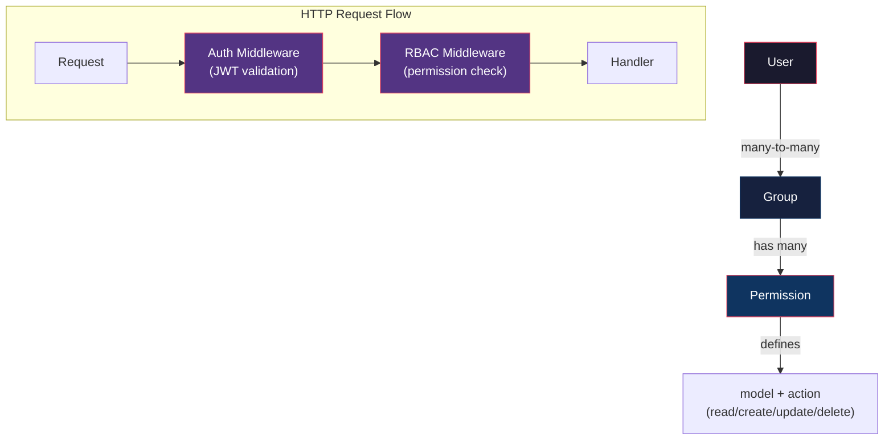

# نظام المصادقة والصلاحيات الكامل (Auth & RBAC)

## السياق

المشروع لديه بالفعل بنية تحتية أساسية للمصادقة:

| المكون | الحالة | الموقع |
|--------|--------|--------|
| JWT Token (Generate/Validate) | ✅ موجود | [`token.go`](file:///home/osm/StudioProjects/cashflow_backend/internal/platform/auth/token.go) |
| UserClaims (uid, cid, roles) | ✅ موجود | [`claims.go`](file:///home/osm/StudioProjects/cashflow_backend/internal/platform/auth/claims.go) |
| Auth Middleware (Bearer token) | ✅ موجود | [`middleware.go`](file:///home/osm/StudioProjects/cashflow_backend/internal/platform/auth/middleware.go) |
| RequireRole middleware | ✅ موجود | [`middleware.go`](file:///home/osm/StudioProjects/cashflow_backend/internal/platform/auth/middleware.go#L80-L106) |
| User entity + Login | ✅ موجود | [`user.go`](file:///home/osm/StudioProjects/cashflow_backend/internal/domain/user/user.go) |
| DB: `res_groups` + `res_groups_users_rel` | ✅ موجود | [`migration`](file:///home/osm/StudioProjects/cashflow_backend/migrations/000011_create_core_infrastructure_schema.up.sql#L148-L173) |
| **تطبيق الـ Middleware على الـ Routes** | ❌ مفقود | جميع الـ endpoints مفتوحة بدون حماية |
| **نظام Groups/Permissions كامل** | ❌ مفقود | لا يوجد domain entity للمجموعات |
| **ربط الأدوار بالـ JWT token** | ❌ مفقود | `Login()` يمرر `nil` للأدوار |
| **Refresh Token** | ❌ مفقود | لا يوجد آلية تجديد |
| **Permission-based access (fine-grained)** | ❌ مفقود | فقط role-based |

**الهدف**: بناء نظام RBAC كامل مُستوحى من Odoo (`res.groups` + `ir.model.access`) مع تطبيقه على جميع الـ endpoints.

---

## User Review Required

> [!IMPORTANT]
> **جميع الـ API endpoints حالياً مفتوحة بدون أي حماية.** هذا التغيير سيطبق JWT authentication على جميع الـ business endpoints مع إبقاء `/login` و `/livez` و `/readyz` عامة.

> [!WARNING]
> **Token TTL**: حالياً `24 ساعات`. هل تريد إضافة Refresh Token أم الإبقاء على access token فقط مع مدة أطول؟ الخطة أدناه تتضمن Refresh Token لكن يمكن تأجيله.

---

## Open Questions

> [!IMPORTANT]
> 1. **هل تريد permission-level granularity؟** مثلاً: `sale.order.create`, `sale.order.read` لكل model — أم يكفي group/role-level (مثل: مجموعة "Sales Manager" لديها صلاحية كاملة على المبيعات)؟ الخطة تقترح الاثنين: Groups + Permissions.
> 2. **هل تريد Refresh Token؟** (access token قصير + refresh token طويل) أم access token فقط بمدة 24 ساعة؟
> 3. **ما هي المجموعات الافتراضية (Seed Groups) التي تحتاجها؟** الخطة تقترح:
>    - `User` — وصول قراءة أساسي
>    - `Sales / User` — مبيعات
>    - `Sales / Manager` — مدير مبيعات
>    - `Purchase / User`, `Purchase / Manager`
>    - `Accounting / User`, `Accounting / Manager`
>    - `Inventory / User`, `Inventory / Manager`
>    - `HR / User`, `HR / Manager`
>    - `Administration / Settings` — إعدادات النظام
>    - `Administration / Access Rights` — إدارة المستخدمين والصلاحيات

---

## الهيكل العام لنظام RBAC



---

## Proposed Changes

### 1. Domain Layer — Group & Permission Entities

---

#### [NEW] `internal/domain/group/group.go`

```go
type Group struct {
    ID       int64
    Name     string     // "Sales / Manager"
    Category string     // "Sales", "HR", "Accounting"
    Active   bool
    Audit    audit.Fields
}
```

#### [NEW] `internal/domain/group/permission.go`

```go
type Permission struct {
    ID      int64
    GroupID int64
    Model   string // "sale.order", "partner", "account.move"
    CanRead   bool
    CanCreate bool
    CanUpdate bool
    CanDelete bool
}
```

#### [NEW] `internal/domain/group/ports.go`

- `GroupRepository`: CRUD + `GetByUserID(userID) []Group` + `AssignUser/RemoveUser`
- `PermissionRepository`: CRUD + `GetByGroupIDs(groupIDs) []Permission` + `CheckAccess(userID, model, action) bool`

---

### 2. Database Migration

---

#### [NEW] `migrations/000012_create_rbac_permissions.up.sql`

```sql
-- Permissions table (ir.model.access in Odoo)
CREATE TABLE IF NOT EXISTS res_group_permissions (
    id BIGSERIAL PRIMARY KEY,
    group_id BIGINT NOT NULL REFERENCES res_groups(id) ON DELETE CASCADE,
    model VARCHAR(100) NOT NULL,
    can_read BOOLEAN NOT NULL DEFAULT false,
    can_create BOOLEAN NOT NULL DEFAULT false,
    can_update BOOLEAN NOT NULL DEFAULT false,
    can_delete BOOLEAN NOT NULL DEFAULT false,
    CONSTRAINT uq_group_model UNIQUE (group_id, model)
);

-- Seed: default groups with categories
-- Seed: default permissions for each group
```

الجداول `res_groups` و `res_groups_users_rel` **موجودة بالفعل** في migration 11.

---

### 3. Storage Layer

---

#### [NEW] `internal/adapters/storage/group/postgres_repo.go`

- تنفيذ `GroupRepository` + `PermissionRepository`
- استعلامات JOIN لجلب المجموعات مع الصلاحيات
- `CheckAccess`: `SELECT EXISTS(... JOIN res_groups_users_rel JOIN res_group_permissions WHERE user_id = $1 AND model = $2 AND can_{action} = true)`

#### [NEW] `internal/adapters/storage/group/memory_repo.go`

- تنفيذ in-memory للتطوير والاختبار

---

### 4. UseCase Layer

---

#### [NEW] `internal/usecase/group/group_usecase.go`

```go
type UseCase interface {
    // Group CRUD
    CreateGroup(ctx, input) (*Group, error)
    GetGroup(ctx, id) (*Group, error)
    UpdateGroup(ctx, id, input) (*Group, error)
    DeleteGroup(ctx, id) error
    ListGroups(ctx, filter, page) (PageResult, error)
    
    // User-Group assignment
    AssignUserToGroup(ctx, userID, groupID) error
    RemoveUserFromGroup(ctx, userID, groupID) error
    GetUserGroups(ctx, userID) ([]Group, error)
    
    // Permissions
    SetPermissions(ctx, groupID, []PermissionInput) error
    GetGroupPermissions(ctx, groupID) ([]Permission, error)
    CheckAccess(ctx, userID, model, action) (bool, error)
}
```

#### [MODIFY] `internal/usecase/user/user_usecase.go`

- تعديل `Login()`: جلب مجموعات المستخدم → تضمين الأدوار في JWT بدلاً من `nil`
- إضافة `ChangePassword()` و `GetCurrentUser()`

---

### 5. Platform Auth Enhancement

---

#### [MODIFY] `internal/platform/auth/middleware.go`

- إضافة `RequirePermission(model, action)` middleware جديد (بجانب `RequireRole` الموجود)
- يستدعي `groupUseCase.CheckAccess()` لفحص الصلاحيات من قاعدة البيانات

#### [MODIFY] `internal/platform/auth/claims.go`

- إضافة `Permissions map[string][]string` في الـ claims (اختياري — يمكن الاعتماد على DB check فقط)

---

### 6. HTTP Layer — Group Endpoints

---

#### [NEW] `internal/adapters/http/group/handler.go`, `dto.go`, `routes.go`

```
POST   /api/v1/groups                         Create group
GET    /api/v1/groups                         List groups
GET    /api/v1/groups/{id}                    Get group
PUT    /api/v1/groups/{id}                    Update group
DELETE /api/v1/groups/{id}                    Delete group
GET    /api/v1/groups/{id}/permissions        Get group permissions
PUT    /api/v1/groups/{id}/permissions        Set group permissions
POST   /api/v1/groups/{id}/users              Assign user to group
DELETE /api/v1/groups/{id}/users/{userId}     Remove user from group
GET    /api/v1/users/{id}/groups              Get user's groups
```

---

### 7. تطبيق Auth Middleware على جميع الـ Routes ⚡

---

#### [MODIFY] `internal/adapters/http/router.go`

هذا هو التغيير الأهم — تقسيم الـ routes إلى:

```go
// عام — لا يحتاج مصادقة
r.Get("/livez", ...)
r.Get("/readyz", ...)
r.Post("/api/v1/users/login", ...)

// محمي — يحتاج JWT
r.Route("/api/v1", func(v1 chi.Router) {
    v1.Use(auth.Middleware(cfg.JWTSecret))  // ← هذا السطر يحمي كل شيء
    
    // Admin only
    v1.Group(func(admin chi.Router) {
        admin.Use(auth.RequireRole("admin", "Administration / Access Rights"))
        // users, groups management
    })
    
    // Sales
    v1.Group(func(sales chi.Router) {
        // sale-orders endpoints
    })
    
    // ... باقي الموديولات
})
```

#### [MODIFY] `internal/adapters/http/user/routes.go`

- نقل `/login` خارج الـ protected group
- إضافة `GET /api/v1/users/me` (current user profile)
- إضافة `POST /api/v1/users/refresh-token` (اختياري)

---

### 8. Wiring في main.go

---

#### [MODIFY] `cmd/server/main.go`

- إضافة `groupRepo`, `groupUseCase`, `groupHandler`
- تمرير `cfg.JWTSecret` للـ router

---

### ملخص الملفات

| ملف | حالة | الوصف |
|-----|------|-------|
| `internal/domain/group/group.go` | NEW | Group entity + validation |
| `internal/domain/group/permission.go` | NEW | Permission entity |
| `internal/domain/group/ports.go` | NEW | Repository interfaces |
| `internal/adapters/storage/group/postgres_repo.go` | NEW | PostgreSQL implementation |
| `internal/adapters/storage/group/memory_repo.go` | NEW | In-memory implementation |
| `internal/usecase/group/group_usecase.go` | NEW | Group & permission business logic |
| `internal/adapters/http/group/handler.go` | NEW | HTTP handlers |
| `internal/adapters/http/group/dto.go` | NEW | Request/Response DTOs |
| `internal/adapters/http/group/routes.go` | NEW | Route registration |
| `migrations/000012_create_rbac_permissions.up.sql` | NEW | Permissions table + seed data |
| `migrations/000012_create_rbac_permissions.down.sql` | NEW | Rollback |
| `internal/adapters/http/router.go` | MODIFY | Apply auth middleware globally |
| `internal/adapters/http/user/routes.go` | MODIFY | Separate public/protected routes |
| `internal/usecase/user/user_usecase.go` | MODIFY | Load roles on login |
| `cmd/server/main.go` | MODIFY | Wire group dependencies |

---

## Default Groups & Permissions (Seed Data)

| Group | Category | Permissions |
|-------|----------|-------------|
| Internal User | Internal | Read على جميع الموديلات الأساسية |
| Sales / User | Sales | CRUD على `sale.order`, Read على `partner`, `product` |
| Sales / Manager | Sales | CRUD + delete على `sale.order`, `partner` |
| Purchase / User | Purchase | CRUD على `purchase.order` |
| Purchase / Manager | Purchase | CRUD + delete على `purchase.order` |
| Accounting / User | Accounting | CRUD على `account.move`, `account.payment` |
| Accounting / Manager | Accounting | CRUD + delete + reports |
| Inventory / User | Inventory | CRUD على `stock.picking`, `stock.move` |
| Inventory / Manager | Inventory | CRUD + delete على المخزون |
| HR / User | HR | Read على `hr.employee` |
| HR / Manager | HR | CRUD على `hr.employee`, `hr.leave` |
| Administration / Settings | Administration | إدارة الإعدادات |
| Administration / Access Rights | Administration | إدارة المستخدمين والمجموعات |

---

## Verification Plan

### Automated Tests

```bash
# جميع الاختبارات الحالية + الجديدة
make test

# اختبار الـ race conditions
make test-race

# بناء المشروع
go build ./...
```

- Unit tests: Group domain validation, Permission entity
- UseCase tests: `CheckAccess`, `Login` مع roles, group assignment
- Middleware tests: protected routes ترفض بدون token, تقبل مع token صالح
- Integration test: `Login → Get Token → Access protected endpoint → Success`

### Manual Verification

- `POST /api/v1/users/login` → يعيد token مع الأدوار
- `GET /api/v1/partners` بدون token → `401 Unauthorized`
- `GET /api/v1/partners` مع token → `200 OK`
- `DELETE /api/v1/accounts/1` بمستخدم `Sales / User` → `403 Forbidden`
- `DELETE /api/v1/accounts/1` بمستخدم `Accounting / Manager` → `200 OK`
