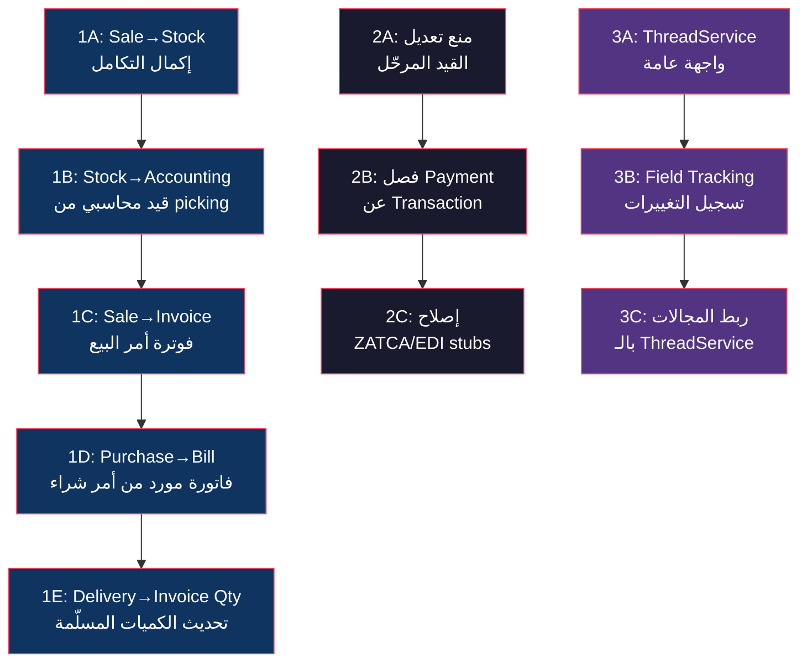

# المرحلة الأولى: التكاملات + إصلاح التناقضات + Mail/Chatter — خطة تنفيذية مفصلة

## السياق

المشروع يملك **26 مجال domain** و **468 ملف Go** (~103K سطر). الأنظمة الأساسية موجودة لكنها تعمل بمعزل عن بعضها.

**حالة التكاملات الحالية:**
- [sale_stock_usecase.go](file:///home/osm/StudioProjects/cashflow/cashflow_backend/internal/usecase/sale/sale_stock_usecase.go) — يُنشئ picking عند تأكيد أمر البيع ✅
- [purchase_stock_usecase.go](file:///home/osm/StudioProjects/cashflow/cashflow_backend/internal/usecase/purchase/purchase_stock_usecase.go) — يُنشئ receipt عند تأكيد أمر الشراء ✅
- [route_engine.go](file:///home/osm/StudioProjects/cashflow/cashflow_backend/internal/usecase/stock/route_engine.go) — `runBuy()` و `runManufacture()` هما stubs فقط ❌
- **لا يوجد stock↔accounting** — تأكيد picking لا يُنشئ قيد محاسبي ❌
- **لا يوجد sale→invoice** — لا يوجد إنشاء فاتورة تلقائية من أمر البيع ❌

---

## نظرة عامة



---

## المحور 1: خدمات التكامل (Glue Services)

### 1A: إكمال Sale↔Stock Integration

**الوضع الحالي:** [sale_stock_usecase.go](file:///home/osm/StudioProjects/cashflow/cashflow_backend/internal/usecase/sale/sale_stock_usecase.go) يُنشئ picking فقط. لا يوجد:
- تحديث `qty_delivered` عند تأكيد التسليم
- تحديث `delivery_status` تلقائياً
- Backorder (تسليم جزئي → picking جديد للباقي)
- إلغاء picking عند إلغاء أمر البيع

#### [MODIFY] `internal/usecase/sale/sale_stock_usecase.go`

إضافة الدوال التالية:

```go
// UpdateDeliveredQuantities يُحدّث qty_delivered في أسطر أمر البيع
// بعد تأكيد التسليم (ActionValidate على picking).
// المُحفِّز: يُستدعى من stock usecase بعد picking.ActionValidate()
func (uc *SaleStockUseCase) UpdateDeliveredQuantities(ctx context.Context, pickingID int64) error

// CreateBackorder يُنشئ picking جديد للكميات غير المسلّمة
// عندما يتم تأكيد التسليم بكمية أقل من المطلوب.
func (uc *SaleStockUseCase) CreateBackorder(ctx context.Context, pickingID int64) (*stock.StockPicking, error)

// CancelDeliveries يُلغي جميع pickings المرتبطة بأمر بيع ملغي.
func (uc *SaleStockUseCase) CancelDeliveries(ctx context.Context, orderID int64) error
```

#### [NEW] `internal/usecase/stock/stock_integration_hooks.go`

نقطة الربط — بعد `ActionValidate` على picking:

```go
// StockIntegrationHooks هي واجهة callback تسمح للأنظمة الأخرى
// بالاستجابة لأحداث المخزون دون coupling مباشر.
type StockIntegrationHooks interface {
    // OnPickingValidated يُستدعى بعد نجاح ActionValidate على picking.
    OnPickingValidated(ctx context.Context, picking *stock.StockPicking) error
    
    // OnPickingCancelled يُستدعى بعد إلغاء picking.
    OnPickingCancelled(ctx context.Context, picking *stock.StockPicking) error
}
```

#### [MODIFY] `internal/domain/stock/move.go`

إضافة حقل `SaleLineID` و `PurchaseLineID` لربط حركات المخزون بأسطر الطلبات:

```go
type StockMove struct {
    // ... الحقول الحالية
    SaleLineID     *int64 `json:"sale_line_id,omitempty"`     // ربط بسطر أمر البيع
    PurchaseLineID *int64 `json:"purchase_line_id,omitempty"` // ربط بسطر أمر الشراء
}
```

> [!NOTE]
> نحتاج التأكد إن كانت هذه الحقول موجودة بالفعل في migration. إذا لم تكن موجودة، نحتاج migration جديد.

---

### 1B: Stock↔Accounting Integration (الأهم)

**الوضع الحالي:** تأكيد picking لا يُنشئ أي قيد محاسبي. Odoo يُنشئ قيود تلقائية عند:
- استلام بضاعة (Goods Receipt) — `stock_account`
- تسليم بضاعة (Goods Issue) — `stock_account`
- تعديل مخزون (Inventory Adjustment)
- خردة (Scrap)

#### [NEW] `internal/usecase/stock/stock_account_service.go`

```go
package stockusecase

// StockAccountService يُنشئ قيود محاسبية تلقائية من حركات المخزون.
// مقابل Odoo: addons/stock_account
type StockAccountService struct {
    stockRepo      stock.Repository
    accountingRepo accounting.Repository
    valuationUC    *ValuationUseCase
    logger         *slog.Logger
}

// CreateValuationEntries يُنشئ القيد المحاسبي المقابل لحركة مخزون مؤكدة.
// يُستدعى تلقائياً عند تأكيد picking إذا كان المنتج بتقييم real_time.
//
// منطق القيد:
//   استلام (incoming):
//     مدين: حساب تقييم المخزون (Stock Valuation Account)
//     دائن: حساب استلام المخزون (Stock Input Account)
//
//   تسليم (outgoing):
//     مدين: حساب إخراج المخزون (Stock Output Account) / تكلفة البضاعة المباعة (COGS)
//     دائن: حساب تقييم المخزون (Stock Valuation Account)
//
//   تحويل داخلي (internal):
//     لا يُنشئ قيد (نفس القيمة تنتقل بين مواقع)
func (s *StockAccountService) CreateValuationEntries(
    ctx context.Context,
    picking *stock.StockPicking,
    productConfigs map[int64]*stock.ProductValuationConfig,
) error
```

#### [NEW] `internal/domain/stock/account_config.go`

```go
// StockAccountConfig يحمل الحسابات المحاسبية المرتبطة بالمخزون.
// يُعدّ على مستوى الشركة أو فئة المنتج.
type StockAccountConfig struct {
    StockValuationAccountID int64  // حساب تقييم المخزون
    StockInputAccountID     int64  // حساب استلام المخزون (Goods Received)
    StockOutputAccountID    int64  // حساب إخراج المخزون (COGS)
    StockJournalID          int64  // دفتر حركات المخزون
    PriceDiffAccountID      *int64 // حساب فرق السعر (اختياري)
}
```

#### [NEW] Migration: `migrations/000049_stock_account_config.up.sql`

```sql
CREATE TABLE IF NOT EXISTS stock_account_config (
    id BIGSERIAL PRIMARY KEY,
    company_id BIGINT NOT NULL REFERENCES res_companies(id),
    product_category_id BIGINT REFERENCES product_categories(id),
    stock_valuation_account_id BIGINT REFERENCES account_accounts(id),
    stock_input_account_id BIGINT REFERENCES account_accounts(id),
    stock_output_account_id BIGINT REFERENCES account_accounts(id),
    stock_journal_id BIGINT REFERENCES account_journals(id),
    price_diff_account_id BIGINT REFERENCES account_accounts(id),
    CONSTRAINT uq_stock_account_config UNIQUE (company_id, product_category_id)
);
```

---

### 1C: Sale→Invoice (إنشاء فاتورة من أمر بيع)

**الوضع الحالي:** الربط موجود بشكل linking فقط (`sale.Repository.LinkInvoice`). لا يوجد إنشاء فعلي للفاتورة من أسطر أمر البيع.

#### [NEW] `internal/usecase/sale/invoice_service.go`

```go
// InvoiceService يُنشئ فواتير عملاء من أوامر البيع المؤكدة.
// مقابل Odoo: sale.order._create_invoices()
type InvoiceService struct {
    saleRepo       sale.Repository
    accountingRepo accounting.Repository
    logger         *slog.Logger
}

// CreateInvoiceFromOrder يُنشئ فاتورة عميل (out_invoice) من أمر بيع مؤكد.
// القواعد:
//   1. الأمر يجب أن يكون بحالة 'sale' أو 'done'
//   2. invoice_status يجب أن يكون 'to_invoice'
//   3. يُنشئ AccountMove من نوع out_invoice
//   4. لكل سطر في أمر البيع: (qty - qty_invoiced) > 0 → سطر في الفاتورة
//   5. يُحدّث qty_invoiced في أسطر الأمر
//   6. يُحدّث invoice_status في أمر البيع
//   7. يربط الفاتورة بالأمر عبر LinkInvoice
func (s *InvoiceService) CreateInvoiceFromOrder(ctx context.Context, orderID int64) (*accounting.AccountMove, error)

// InvoicePolicy تحدد متى يمكن إنشاء الفاتورة:
//   "order" — فور تأكيد الأمر (بحسب الكمية المطلوبة)
//   "delivery" — بعد التسليم (بحسب الكمية المسلّمة)
type InvoicePolicy string

const (
    InvoicePolicyOrder    InvoicePolicy = "order"
    InvoicePolicyDelivery InvoicePolicy = "delivery"
)
```

---

### 1D: Purchase→Vendor Bill (فاتورة مورد من أمر شراء)

#### [NEW] `internal/usecase/purchase/bill_service.go`

```go
// BillService يُنشئ فواتير موردين من أوامر شراء مؤكدة.
// مقابل Odoo: purchase.order.action_create_invoice()
type BillService struct {
    purchaseRepo   purchase.Repository
    accountingRepo accounting.Repository
    logger         *slog.Logger
}

// CreateBillFromOrder يُنشئ فاتورة مورد (in_invoice) من أمر شراء مؤكد.
// القواعد:
//   1. الأمر بحالة 'purchase' أو 'done'
//   2. لكل سطر: (qty_received - qty_invoiced) > 0 → سطر في الفاتورة
//   3. يُحدّث qty_invoiced وinvoice_status
//   4. يربط الفاتورة بالأمر
func (s *BillService) CreateBillFromOrder(ctx context.Context, orderID int64) (*accounting.AccountMove, error)
```

---

### 1E: Delivery↔Invoice Quantities (تحديث الكميات عبر الأنظمة)

#### [NEW] `internal/usecase/integration/quantity_sync_service.go`

```go
// QuantitySyncService يُزامن الكميات بين الأنظمة:
//   picking.validate → sale.qty_delivered
//   picking.validate → purchase.qty_received  
//   invoice.post → sale.qty_invoiced
//   bill.post → purchase.qty_invoiced
type QuantitySyncService struct {
    saleRepo     sale.Repository
    purchaseRepo purchase.Repository
    stockRepo    stock.Repository
    logger       *slog.Logger
}

// SyncDeliveredQty يُحدّث qty_delivered في أسطر أمر البيع
// استناداً إلى الكميات المؤكدة في pickings المرتبطة.
func (s *QuantitySyncService) SyncDeliveredQty(ctx context.Context, orderID int64) error

// SyncReceivedQty يُحدّث qty_received في أسطر أمر الشراء
// استناداً إلى الكميات المؤكدة في receipts المرتبطة.
func (s *QuantitySyncService) SyncReceivedQty(ctx context.Context, orderID int64) error

// SyncInvoicedQty يُحدّث qty_invoiced بعد ترحيل فاتورة مرتبطة.
func (s *QuantitySyncService) SyncInvoicedQty(ctx context.Context, moveID int64) error
```

---

## المحور 2: إصلاح تناقضات المحاسبة

### 2A: منع تعديل القيد المرحّل

**المشكلة:** حالياً يمكن استدعاء `UpdateMove` على قيد مرحّل (`posted`) بدون قيود.
**سلوك Odoo:** القيد المرحّل لا يمكن تعديله. للتصحيح يجب عمل عكس (reversal) أو إشعار دائن.

#### [MODIFY] `internal/domain/accounting/move.go`

```go
// CanEdit يتحقق من إمكانية تعديل القيد.
// القيد المرحّل لا يمكن تعديله — يجب عكسه أولاً.
func (m *AccountMove) CanEdit() error {
    if m.State == MoveStatePosted {
        return platformerrors.Conflict(
            "cannot edit a posted journal entry; create a reversal or credit note instead",
        )
    }
    if m.State == MoveStateCancel {
        return platformerrors.Conflict(
            "cannot edit a cancelled journal entry; reset to draft first",
        )
    }
    return nil
}
```

#### [MODIFY] `internal/usecase/accounting/move_usecase.go`

إضافة استدعاء `CanEdit()` قبل أي تحديث:

```go
func (uc *MoveUseCase) UpdateMove(ctx context.Context, move *AccountMove) error {
    existing, err := uc.repo.GetMoveByID(ctx, move.ID)
    if err != nil {
        return err
    }
    
    // ⛔ منع تعديل القيد المرحّل
    if err := existing.CanEdit(); err != nil {
        return err
    }
    
    // ... باقي المنطق
}
```

#### [MODIFY] `internal/domain/accounting/move.go` — Cancel()

تقييد إلغاء القيد المرحّل (يجب عكسه بدلاً من إلغائه):

```go
func (m *AccountMove) Cancel() error {
    if m.State == MoveStateCancel {
        return nil
    }
    // القيد المرحّل يجب عكسه وليس إلغاؤه مباشرة
    if m.State == MoveStatePosted {
        return platformerrors.Conflict(
            "cannot cancel a posted entry; use CreateReverseMove() instead",
        )
    }
    m.State = MoveStateCancel
    return nil
}
```

---

### 2B: فصل Payment عن Payment Transaction

**المشكلة:** [payment.go](file:///home/osm/StudioProjects/cashflow/cashflow_backend/internal/domain/payment/payment.go) يخلط بين الدفع المحاسبي الداخلي وعملية الدفع الخارجية.
**سلوك Odoo:** `account.payment` (داخلي) ≠ `payment.transaction` (بوابة خارجية).

#### [NEW] `internal/domain/payment/transaction.go`

```go
// PaymentTransaction تمثل عملية دفع عبر بوابة خارجية (Stripe, PayPal, etc.).
// مقابل Odoo: payment.transaction
type PaymentTransaction struct {
    ID              int64              `json:"id"`
    ProviderID      int64              `json:"provider_id"`
    ProviderRef     string             `json:"provider_reference"`
    Amount          float64            `json:"amount"`
    Currency        string             `json:"currency"`
    State           TransactionState   `json:"state"`
    PartnerID       int64              `json:"partner_id"`
    SaleOrderID     *int64             `json:"sale_order_id,omitempty"`
    InvoiceID       *int64             `json:"invoice_id,omitempty"`
    PaymentID       *int64             `json:"payment_id,omitempty"` // الدفع الداخلي المقابل
    IdempotencyKey  string             `json:"idempotency_key"`
    ReturnURL       string             `json:"return_url,omitempty"`
    WebhookReceived bool               `json:"webhook_received"`
    LastError       string             `json:"last_error,omitempty"`
    CreatedAt       time.Time          `json:"created_at"`
    UpdatedAt       time.Time          `json:"updated_at"`
}

type TransactionState string

const (
    TxStateDraft      TransactionState = "draft"
    TxStatePending    TransactionState = "pending"
    TxStateAuthorized TransactionState = "authorized"
    TxStateDone       TransactionState = "done"
    TxStateCancel     TransactionState = "cancel"
    TxStateError      TransactionState = "error"
)

// Transition يُنفذ انتقال حالة آمن مع التحقق من المسارات المسموحة.
func (t *PaymentTransaction) Transition(to TransactionState) error
```

#### [NEW] `internal/domain/payment/provider.go`

```go
// PaymentProvider تمثل مزود دفع خارجي (Stripe, PayPal, إلخ).
type PaymentProvider struct {
    ID           int64  `json:"id"`
    Name         string `json:"name"`
    Code         string `json:"code"` // stripe, paypal, custom
    State        string `json:"state"` // enabled, disabled, test
    CompanyID    int64  `json:"company_id"`
}
```

#### [NEW] Migration: `migrations/000050_payment_transactions.up.sql`

```sql
CREATE TABLE IF NOT EXISTS payment_providers (
    id BIGSERIAL PRIMARY KEY,
    name VARCHAR(255) NOT NULL,
    code VARCHAR(50) NOT NULL,
    state VARCHAR(20) NOT NULL DEFAULT 'disabled',
    company_id BIGINT NOT NULL REFERENCES res_companies(id),
    created_at TIMESTAMPTZ NOT NULL DEFAULT NOW(),
    updated_at TIMESTAMPTZ NOT NULL DEFAULT NOW()
);

CREATE TABLE IF NOT EXISTS payment_transactions (
    id BIGSERIAL PRIMARY KEY,
    provider_id BIGINT NOT NULL REFERENCES payment_providers(id),
    provider_reference VARCHAR(255),
    amount NUMERIC(15,4) NOT NULL,
    currency VARCHAR(10) NOT NULL,
    state VARCHAR(20) NOT NULL DEFAULT 'draft',
    partner_id BIGINT NOT NULL REFERENCES res_partners(id),
    sale_order_id BIGINT REFERENCES sale_orders(id),
    invoice_id BIGINT REFERENCES account_moves(id),
    payment_id BIGINT REFERENCES account_payments(id),
    idempotency_key VARCHAR(255) NOT NULL,
    return_url TEXT,
    webhook_received BOOLEAN DEFAULT FALSE,
    last_error TEXT,
    created_at TIMESTAMPTZ NOT NULL DEFAULT NOW(),
    updated_at TIMESTAMPTZ NOT NULL DEFAULT NOW(),
    CONSTRAINT uq_payment_tx_idempotency UNIQUE (provider_id, idempotency_key)
);
```

---

### 2C: إصلاح ZATCA/EDI Stubs

**المشكلة:** الدوال في [zatca_processor.go](file:///home/osm/StudioProjects/cashflow/cashflow_backend/internal/usecase/accounting/zatca_processor.go) ترجع نتائج تجريبية.

#### [MODIFY] `internal/usecase/accounting/zatca_processor.go`

- `ValidateXML()` — يجب أن يُرجع خطأ بدلاً من نجاح وهمي:

```go
func (p *ZATCAProcessor) ValidateXML(xml []byte) error {
    // حالياً: return nil (نجاح وهمي)
    // يجب: return ErrNotImplemented أو تنفيذ XSD validation حقيقي
    return platformerrors.NotImplemented("ZATCA XML validation not yet implemented; do not use in production")
}
```

- `SignXML()` — يجب أن يُرجع خطأ واضح:

```go
func (p *ZATCAProcessor) SignXML(xml []byte, cert *EDICertificate) ([]byte, error) {
    return nil, platformerrors.NotImplemented("ZATCA XML signing not yet implemented; XAdES-BES required")
}
```

- `GenerateQRCode()` — يجب أن يُحسب TLV الفعلي أو يُرجع خطأ:

```go
func (p *ZATCAProcessor) GenerateQRCode(move *AccountMove) (string, error) {
    return "", platformerrors.NotImplemented("ZATCA QR code generation not yet implemented; TLV encoding required")
}
```

> [!IMPORTANT]
> هذا يمنع استخدام ZATCA في production بدون تنفيذ حقيقي — الكود الحالي يُعطي إيحاء كاذب بأن التوقيع والتحقق يعملان.

---

## المحور 3: Mail/Chatter Service

### 3A: ThreadService — واجهة عامة

**الوضع الحالي:** [activity/thread.go](file:///home/osm/StudioProjects/cashflow/cashflow_backend/internal/domain/activity/thread.go) يحتوي على `Follower`, `MessageSubtype`, `TrackingValue`, `ThreadContext` — بنية جيدة لكن لا توجد خدمة عامة.

#### [NEW] `internal/usecase/activity/thread_service.go`

```go
// ThreadService يُدير Chatter/Thread لكل سجل قابل للمراسلة.
// مقابل Odoo: mail.thread mixin
type ThreadService struct {
    messageRepo    activity.MessageRepository
    followerRepo   activity.FollowerRepository
    subtypeRepo    activity.SubtypeRepository
    notifRepo      activity.NotificationRepository
    bus            activity.Bus
    logger         *slog.Logger
}

// Threadable هي واجهة لأي domain entity يدعم Chatter.
type Threadable interface {
    ThreadModel() string  // e.g. "sale.order", "crm.lead"
    ThreadID() int64
    ThreadCompanyID() int64
}

// PostMessage يُنشئ رسالة في thread السجل، ويُرسل إشعارات للمتابعين.
func (s *ThreadService) PostMessage(ctx context.Context, thread Threadable, msg PostMessageInput) (*activity.Message, error)

// Subscribe يُضيف متابع لسجل مع subtypes محددة.
func (s *ThreadService) Subscribe(ctx context.Context, thread Threadable, partnerID int64, subtypeIDs []int64) error

// Unsubscribe يُزيل متابع من سجل.
func (s *ThreadService) Unsubscribe(ctx context.Context, thread Threadable, partnerID int64) error

// ListThread يُرجع رسائل thread لسجل معين.
func (s *ThreadService) ListThread(ctx context.Context, resModel string, resID int64, page pagination.PageRequest) (pagination.PageResult[activity.Message], error)

// ListFollowers يُرجع متابعي سجل.
func (s *ThreadService) ListFollowers(ctx context.Context, resModel string, resID int64) ([]activity.Follower, error)

type PostMessageInput struct {
    Body        string
    MessageType activity.MessageType
    SubtypeID   *int64
    AuthorID    *int64
    ParentID    *int64
}
```

---

### 3B: Field Tracking (تسجيل التغييرات)

#### [NEW] `internal/usecase/activity/tracking_service.go`

```go
// TrackingService يُسجل تغيّرات الحقول المهمة كـ TrackingValues.
type TrackingService struct {
    threadService *ThreadService
    logger        *slog.Logger
}

// TrackedField يصف حقل يجب تتبع تغييراته.
type TrackedField struct {
    Name      string // field name e.g. "state"
    FieldDesc string // human readable e.g. "Status"
    OldValue  string
    NewValue  string
}

// TrackChanges يُقارن القيم القديمة والجديدة، ويُنشئ رسالة tracking إذا تغيّرت.
func (s *TrackingService) TrackChanges(
    ctx context.Context,
    thread Threadable,
    authorID int64,
    changes []TrackedField,
) error
```

#### مثال: تتبع تغيير مرحلة CRM Lead

```go
// في crm usecase عند تحديث المرحلة:
func (uc *CRMUseCase) UpdateLeadStage(ctx context.Context, leadID int64, newStageID int64) error {
    lead, _ := uc.repo.GetLeadByID(ctx, leadID)
    oldStage, _ := uc.stageRepo.GetByID(ctx, lead.StageID)
    newStage, _ := uc.stageRepo.GetByID(ctx, newStageID)
    
    lead.StageID = newStageID
    uc.repo.UpdateLead(ctx, lead)
    
    // تسجيل التغيير في Chatter
    uc.trackingService.TrackChanges(ctx, lead, userID, []TrackedField{
        {Name: "stage_id", FieldDesc: "المرحلة", OldValue: oldStage.Name, NewValue: newStage.Name},
    })
}
```

---

### 3C: ربط المجالات بالـ Threadable Interface

#### المجالات التي يجب أن تُنفذ `Threadable`:

| المجال | ThreadModel | الحقول المتتبعة |
|---|---|---|
| `sale.SaleOrder` | `"sale.order"` | state, partner_id, amount_total |
| `purchase.PurchaseOrder` | `"purchase.order"` | state, partner_id, amount_total |
| `accounting.AccountMove` | `"account.move"` | state, payment_state |
| `crm.Lead` | `"crm.lead"` | stage_id, probability, user_id |
| `stock.StockPicking` | `"stock.picking"` | state |
| `hr.Employee` | `"hr.employee"` | department_id, job_id |
| `project.Task` | `"project.task"` | stage_id, assigned_ids |
| `maintenance.MaintenanceRequest` | `"maintenance.request"` | stage_id, assigned_user_id |

#### مثال تنفيذ على SaleOrder:

```go
// في internal/domain/sale/order.go
func (o *SaleOrder) ThreadModel() string    { return "sale.order" }
func (o *SaleOrder) ThreadID() int64        { return o.ID }
func (o *SaleOrder) ThreadCompanyID() int64 {
    if o.CompanyID != nil { return *o.CompanyID }
    return 0
}
```

---

## خطة الاختبار والتحقق

### اختبارات وحدة جديدة

| الملف | الاختبارات |
|---|---|
| `sale/sale_stock_usecase_test.go` | Backorder, CancelDeliveries, qty sync |
| `stock/stock_account_service_test.go` | قيد استلام، قيد تسليم، تحويل بدون قيد |
| `sale/invoice_service_test.go` | فاتورة كاملة، فاتورة جزئية، policy |
| `purchase/bill_service_test.go` | فاتورة مورد كاملة وجزئية |
| `accounting/move_test.go` | منع تعديل مرحّل، منع إلغاء مرحّل |
| `activity/thread_service_test.go` | PostMessage + notifications |
| `activity/tracking_service_test.go` | TrackChanges |

### اختبارات تكامل (سيناريوهات End-to-End)

```
السيناريو 1: دورة بيع كاملة
  إنشاء أمر بيع → تأكيد → إنشاء picking تلقائياً →
  تأكيد التسليم → تحديث qty_delivered →
  إنشاء فاتورة → ترحيل الفاتورة → تحديث qty_invoiced →
  التحقق: invoice_status = "invoiced", delivery_status = "full"

السيناريو 2: دورة شراء كاملة
  إنشاء أمر شراء → تأكيد → إنشاء receipt تلقائياً →
  تأكيد الاستلام → قيد محاسبي + تحديث qty_received →
  إنشاء فاتورة مورد → تحديث qty_invoiced

السيناريو 3: تسليم جزئي
  أمر بيع بـ 10 وحدات → تسليم 6 → backorder بـ 4 →
  فاتورة بكمية 6 → invoice_status = "to_invoice"

السيناريو 4: Chatter
  تغيير مرحلة CRM → رسالة tracking تلقائية →
  إشعار للمتابعين
```

---

## ملخص الملفات

### ملفات جديدة (10 ملفات)

| الملف | الوصف |
|---|---|
| `internal/usecase/stock/stock_account_service.go` | قيود محاسبية من حركات المخزون |
| `internal/usecase/stock/stock_integration_hooks.go` | واجهة callback للأنظمة المرتبطة |
| `internal/domain/stock/account_config.go` | تهيئة حسابات المخزون |
| `internal/usecase/sale/invoice_service.go` | فوترة أوامر البيع |
| `internal/usecase/purchase/bill_service.go` | فواتير الموردين |
| `internal/usecase/integration/quantity_sync_service.go` | مزامنة الكميات |
| `internal/domain/payment/transaction.go` | عمليات الدفع الخارجية |
| `internal/domain/payment/provider.go` | مزودو الدفع |
| `internal/usecase/activity/thread_service.go` | ThreadService العام |
| `internal/usecase/activity/tracking_service.go` | تتبع تغيّر الحقول |

### ملفات معدّلة (8+ ملفات)

| الملف | التعديل |
|---|---|
| `internal/usecase/sale/sale_stock_usecase.go` | Backorder + Cancel + qty sync |
| `internal/domain/accounting/move.go` | CanEdit(), تقييد Cancel() |
| `internal/usecase/accounting/move_usecase.go` | فرض CanEdit() |
| `internal/usecase/accounting/zatca_processor.go` | NotImplemented بدل stubs |
| `internal/domain/sale/order.go` | Threadable interface |
| `internal/domain/purchase/order.go` | Threadable interface |
| `internal/domain/crm/lead.go` | Threadable interface |
| `internal/usecase/stock/stock_usecase.go` | استدعاء hooks |

### Migrations جديدة (2+)

| Migration | الجداول |
|---|---|
| `000049_stock_account_config.up.sql` | `stock_account_config` |
| `000050_payment_transactions.up.sql` | `payment_providers`, `payment_transactions` |

---

## الترتيب المقترح للتنفيذ

```
الأسبوع 1: المحور 2A + 2C (إصلاح تناقضات — أسرع وأبسط)
الأسبوع 2: المحور 1B (stock↔accounting — الأهم)
الأسبوع 3: المحور 1C + 1D (فوترة من أوامر البيع والشراء)
الأسبوع 4: المحور 1A + 1E (إكمال sale↔stock + qty sync)
الأسبوع 5: المحور 3A + 3B + 3C (Mail/Chatter)
الأسبوع 6: اختبارات تكامل + مراجعة
```
