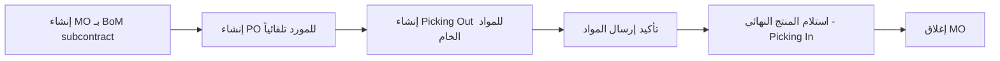
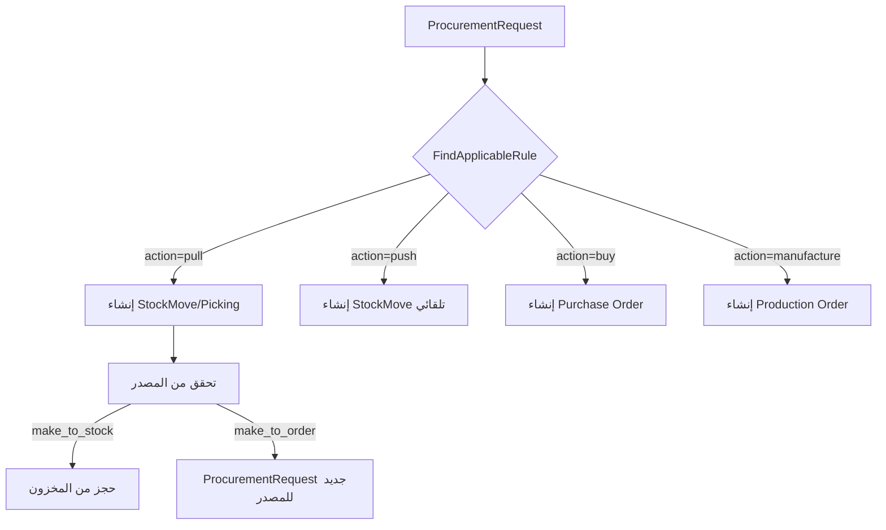
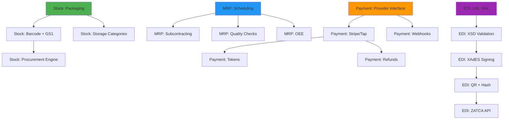

# خطة تنفيذية شاملة — المرحلة الثانية: إكمال الأنظمة الموجودة

## الملخص التنفيذي

المرحلة الثانية تركز على **تعميق وإكمال 4 أنظمة موجودة** لتصل لمستوى Odoo 19.0:

1. 🏭 **إكمال MRP** — routing, scheduling, subcontracting
2. 📦 **إكمال Stock** — packaging, barcode rules, advanced procurement
3. 💰 **Payment Providers** — transaction state machine, webhooks, tokens
4. 📄 **EDI حقيقي** — XML generation, XSD validation, XAdES signing

> [!IMPORTANT]
> هذه الخطة مبنية على مراجعة فعلية للكود الموجود في كل domain. كل بند يوضح **ما هو موجود** و**ما ينقص** بالضبط.

---

## تحليل الوضع الحالي

### ما هو موجود في كل نظام

| النظام | الملفات الموجودة | الكيانات المنفذة | الفجوات الرئيسية |
| -------- | ----------------- | ------------------- | ----------------- |
| **MRP** | 9 ملفات (bom, production, workcenter, workorder, unbuild, ports) | BOM + Lines + ByProducts, RoutingOperation, ProductionOrder, Workcenter, Workorder, UnbuildOrder, BomExplosion | لا يوجد scheduling, subcontracting, capacity planning, quality checks |
| **Stock** | 21 ملف (picking, move, quant, lot, location, warehouse, orderpoint, valuation, rule, etc.) | StockPicking, StockMove, StockMoveLine, StockQuant, StockLot, Warehouse, Orderpoint, LandedCost, Valuation, ProcurementGroup, StockRoute, StockRule | packaging, barcode, storage categories, advanced procurement engine |
| **Payment** | 6 ملفات (payment, transaction, aging, reconciliation, ports) | Payment + state machine, PaymentTransaction + state machine, PaymentProvider, PaymentReconciliation | لا يوجد provider SDK integration, webhooks, tokenization, refund flow |
| **EDI** | 1 ملف (edi.go) + l10n/ | EDIDocument, EDICertificate, formats/states enums | كل شيء تجريبي — XML/XSD/XAdES/QR كلها stubs |

---

## المحور الأول: 🏭 إكمال MRP (التصنيع المتقدم)

### 1.1 نظام التوجيه والجدولة (Routing & Scheduling)

#### الوضع الحالي

- [RoutingOperation](file:///home/osm/StudioProjects/cashflow/cashflow_backend/internal/domain/mrp/bom.go#L83-L91) موجود كـ struct بسيط (name, sequence, time_cycle)
- [Workorder](file:///home/osm/StudioProjects/cashflow/cashflow_backend/internal/domain/mrp/workorder.go) لديه state machine أساسي (blocked→ready→progress→done)
- [OEE](file:///home/osm/StudioProjects/cashflow/cashflow_backend/internal/domain/mrp/workcenter.go#L58-L66) موجود كـ placeholder فقط

#### المطلوب تنفيذه

##### 1.1.1 Capacity Planning & Scheduling Engine

```
internal/domain/mrp/
├── scheduling.go           [NEW] — محرك الجدولة
├── capacity.go             [NEW] — تخطيط السعة
├── workcenter_capacity.go  [NEW] — تقويم وفترات العمل لكل مركز
```

**الكيانات الجديدة:**

| Entity | الوصف | الحقول الرئيسية |
| -------- | ------- | ---------------- |
| `WorkcenterCalendar` | تقويم عمل لكل مركز إنتاج | `workcenter_id`, `day_of_week`, `hour_from`, `hour_to`, `attendance_type` |
| `CapacitySlot` | فترة سعة متاحة | `workcenter_id`, `date_start`, `date_end`, `available_hours`, `allocated_hours` |
| `SchedulingResult` | نتيجة الجدولة لأمر إنتاج | `production_id`, `planned_start`, `planned_end`, `workorder_schedules[]` |

**منطق الأعمال:**

```go
// ScheduleProduction يحسب مواعيد البدء والانتهاء لكل workorder
// بناءً على سعة مراكز العمل وتبعيات العمليات
func (s *SchedulingEngine) ScheduleProduction(ctx context.Context, mo *ProductionOrder) (*SchedulingResult, error)

// Forward Scheduling: من تاريخ البدء → حساب تاريخ الانتهاء
func (s *SchedulingEngine) ForwardSchedule(ctx context.Context, startDate time.Time, operations []RoutingOperation) ([]WorkorderSchedule, error)

// Backward Scheduling: من تاريخ التسليم → حساب تاريخ البدء المطلوب
func (s *SchedulingEngine) BackwardSchedule(ctx context.Context, deadline time.Time, operations []RoutingOperation) ([]WorkorderSchedule, error)

// CheckCapacity يتحقق من توفر السعة في مركز العمل
func (s *SchedulingEngine) CheckCapacity(ctx context.Context, workcenterID int64, dateFrom, dateTo time.Time) (*CapacitySlot, error)
```

**جدول قاعدة البيانات:**

```sql
-- migrations/XXXX_mrp_scheduling.up.sql
CREATE TABLE mrp_workcenter_calendar (
    id            BIGSERIAL PRIMARY KEY,
    workcenter_id BIGINT NOT NULL REFERENCES mrp_workcenters(id),
    day_of_week   SMALLINT NOT NULL CHECK (day_of_week BETWEEN 0 AND 6),
    hour_from     NUMERIC(4,2) NOT NULL,
    hour_to       NUMERIC(4,2) NOT NULL,
    company_id    BIGINT NOT NULL REFERENCES companies(id),
    UNIQUE(workcenter_id, day_of_week, hour_from)
);

CREATE TABLE mrp_capacity_slots (
    id              BIGSERIAL PRIMARY KEY,
    workcenter_id   BIGINT NOT NULL REFERENCES mrp_workcenters(id),
    date_start      TIMESTAMPTZ NOT NULL,
    date_end        TIMESTAMPTZ NOT NULL,
    available_hours NUMERIC(10,2) NOT NULL DEFAULT 0,
    allocated_hours NUMERIC(10,2) NOT NULL DEFAULT 0,
    company_id      BIGINT NOT NULL REFERENCES companies(id)
);
CREATE INDEX idx_capacity_slots_wc_date ON mrp_capacity_slots(workcenter_id, date_start, date_end);
```

##### 1.1.2 OEE (Overall Equipment Effectiveness) الحقيقي

```
internal/domain/mrp/
├── oee.go                  [NEW] — كيانات OEE الكاملة
├── oee_calculator.go       [NEW] — حساب OEE
```

**الكيانات:**

| Entity | الوصف |
| -------- | ------- |
| `WorkcenterProductivity` | تسجيل فترة عمل/توقف مع سبب الخسارة |
| `ProductivityLoss` | أنواع الخسائر (Availability, Performance, Quality) |
| `OEEMetrics` | مقاييس OEE المحسوبة (Availability × Performance × Quality) |

```go
type WorkcenterProductivity struct {
    ID            int64     `json:"id"`
    WorkcenterID  int64     `json:"workcenter_id"`
    WorkorderID   *int64    `json:"workorder_id,omitempty"`
    LossID        int64     `json:"loss_id"`
    LossType      LossType  `json:"loss_type"` // productive, performance, availability, quality
    DateStart     time.Time `json:"date_start"`
    DateEnd       *time.Time `json:"date_end,omitempty"`
    Duration      float64   `json:"duration"` // minutes
    Description   string    `json:"description,omitempty"`
    CompanyID     int64     `json:"company_id"`
}

type OEEMetrics struct {
    WorkcenterID  int64   `json:"workcenter_id"`
    DateFrom      time.Time
    DateTo        time.Time
    Availability  float64 `json:"availability"`  // 0-100%
    Performance   float64 `json:"performance"`   // 0-100%
    Quality       float64 `json:"quality"`       // 0-100%
    OEE           float64 `json:"oee"`           // A × P × Q
}
```

##### 1.1.3 Workorder Time Tracking

تعديل [workorder.go](file:///home/osm/StudioProjects/cashflow/cashflow_backend/internal/domain/mrp/workorder.go) لإضافة:

```go
// TimeLog يسجل فترات العمل الفعلية على أمر عمل
type WorkorderTimeLog struct {
    ID          int64      `json:"id"`
    WorkorderID int64      `json:"workorder_id"`
    UserID      int64      `json:"user_id"`
    DateStart   time.Time  `json:"date_start"`
    DateEnd     *time.Time `json:"date_end,omitempty"`
    Duration    float64    `json:"duration"` // minutes (computed)
    LossID      *int64     `json:"loss_id,omitempty"`
}

// Start يبدأ تسجيل الوقت على أمر العمل
func (w *Workorder) Start() error
// Pause يوقف العمل مؤقتاً
func (w *Workorder) Pause() error
// Resume يستأنف العمل
func (w *Workorder) Resume() error
// Finish ينهي أمر العمل ويحسب المدة الفعلية
func (w *Workorder) Finish(qtyProduced float64) error
```

---

### 1.2 التصنيع بالتعاقد الخارجي (Subcontracting)

#### الوضع الحالي

- لا يوجد أي شيء متعلق بـ subcontracting

#### المطلوب تنفيذه

```
internal/domain/mrp/
├── subcontracting.go       [NEW] — كيانات التعاقد الخارجي
```

**الكيانات:**

```go
// BomType يُضاف إليه نوع جديد
const BomTypeSubcontract BomType = "subcontract"

// SubcontractingBom يربط BoM بمورد خارجي
type SubcontractingBom struct {
    BomID         int64 `json:"bom_id"`
    SubcontractorID int64 `json:"subcontractor_id"` // partner_id
    LeadTime      int   `json:"lead_time"`          // أيام
    CostPerUnit   float64 `json:"cost_per_unit"`
}

// SubcontractingOrder أمر تصنيع خارجي
type SubcontractingOrder struct {
    ID                int64              `json:"id"`
    Name              string             `json:"name"`
    ProductionID      int64              `json:"production_id"`
    SubcontractorID   int64              `json:"subcontractor_id"`
    PurchaseOrderID   *int64             `json:"purchase_order_id,omitempty"`
    PickingOutID      *int64             `json:"picking_out_id,omitempty"`  // إرسال مواد
    PickingInID       *int64             `json:"picking_in_id,omitempty"`   // استلام منتج
    State             SubcontractState   `json:"state"`
    CompanyID         int64              `json:"company_id"`
}
```

**سير العمل:**



**جدول قاعدة البيانات:**

```sql
CREATE TABLE mrp_subcontracting_bom (
    id                BIGSERIAL PRIMARY KEY,
    bom_id            BIGINT NOT NULL REFERENCES mrp_boms(id),
    subcontractor_id  BIGINT NOT NULL REFERENCES partners(id),
    lead_time_days    INT NOT NULL DEFAULT 0,
    cost_per_unit     NUMERIC(15,4) NOT NULL DEFAULT 0,
    company_id        BIGINT NOT NULL REFERENCES companies(id),
    UNIQUE(bom_id, subcontractor_id)
);

CREATE TABLE mrp_subcontracting_orders (
    id                BIGSERIAL PRIMARY KEY,
    name              VARCHAR(64) NOT NULL,
    production_id     BIGINT NOT NULL REFERENCES mrp_productions(id),
    subcontractor_id  BIGINT NOT NULL REFERENCES partners(id),
    purchase_order_id BIGINT REFERENCES purchase_orders(id),
    picking_out_id    BIGINT REFERENCES stock_pickings(id),
    picking_in_id     BIGINT REFERENCES stock_pickings(id),
    state             VARCHAR(32) NOT NULL DEFAULT 'draft',
    company_id        BIGINT NOT NULL REFERENCES companies(id),
    created_at        TIMESTAMPTZ NOT NULL DEFAULT NOW(),
    updated_at        TIMESTAMPTZ NOT NULL DEFAULT NOW()
);
```

---

### 1.3 فحوصات الجودة المرتبطة بالتصنيع

```
internal/domain/mrp/
├── quality_check.go        [NEW] — فحوصات جودة مرتبطة بـ workorder
```

```go
type QualityCheckType string

const (
    QualityCheckPassFail   QualityCheckType = "pass_fail"
    QualityCheckMeasure    QualityCheckType = "measure"
    QualityCheckText       QualityCheckType = "text"
    QualityCheckPicture    QualityCheckType = "picture"
)

type QualityPoint struct {
    ID            int64            `json:"id"`
    Name          string           `json:"name"`
    ProductID     *int64           `json:"product_id,omitempty"`
    OperationID   *int64           `json:"operation_id,omitempty"`
    WorkcenterID  *int64           `json:"workcenter_id,omitempty"`
    CheckType     QualityCheckType `json:"check_type"`
    NormMin       *float64         `json:"norm_min,omitempty"`
    NormMax       *float64         `json:"norm_max,omitempty"`
    Instructions  string           `json:"instructions,omitempty"`
    CompanyID     int64            `json:"company_id"`
    Active        bool             `json:"active"`
}

type QualityCheck struct {
    ID            int64            `json:"id"`
    PointID       int64            `json:"point_id"`
    WorkorderID   *int64           `json:"workorder_id,omitempty"`
    ProductionID  int64            `json:"production_id"`
    ProductID     int64            `json:"product_id"`
    Result        string           `json:"result"` // pass, fail
    MeasureValue  *float64         `json:"measure_value,omitempty"`
    Note          string           `json:"note,omitempty"`
    State         string           `json:"state"` // none, pass, fail
    CompanyID     int64            `json:"company_id"`
}
```

---

### 1.4 ملخص ملفات MRP

| الطبقة | الملف | الحالة | الوصف |
| -------- | ------- | -------- | ------- |
| **Domain** | `scheduling.go` | [NEW] | محرك الجدولة Forward/Backward |
| **Domain** | `capacity.go` | [NEW] | تخطيط السعة والتقويمات |
| **Domain** | `oee.go` | [NEW] | OEE + Productivity + Loss |
| **Domain** | `subcontracting.go` | [NEW] | التصنيع بالتعاقد الخارجي |
| **Domain** | `quality_check.go` | [NEW] | فحوصات جودة مرتبطة بالإنتاج |
| **Domain** | `workorder.go` | [MODIFY] | إضافة TimeLog + Start/Pause/Resume/Finish |
| **Domain** | `bom.go` | [MODIFY] | إضافة `BomTypeSubcontract` |
| **Domain** | `ports.go` | [MODIFY] | إضافة Repository methods جديدة |
| **Usecase** | `usecase/mrp/usecase.go` | [MODIFY] | إضافة scheduling + subcontracting + quality usecases |
| **Storage** | `storage/mrp/` | [MODIFY] | إضافة SQL للكيانات الجديدة |
| **HTTP** | `http/mrp/` | [MODIFY] | إضافة endpoints جديدة |
| **Migration** | `migrations/XXXX_mrp_phase2.up.sql` | [NEW] | جداول جديدة |

**عدد الملفات المقدر:** ~12 ملف جديد + ~6 تعديل

---

## المحور الثاني: 📦 إكمال Stock (المخزون المتقدم)

### 2.1 نظام التعبئة والطرود (Packaging)

#### الوضع الحالي

- لا يوجد أي ملف packaging في [stock domain](file:///home/osm/StudioProjects/cashflow/cashflow_backend/internal/domain/stock/)

#### المطلوب تنفيذه

```
internal/domain/stock/
├── packaging.go            [NEW] — كيانات التعبئة
├── package.go              [NEW] — كيانات الطرود
```

**الكيانات:**

```go
// ProductPackaging تعريف تعبئة للمنتج (كرتونة، صندوق، باليت...)
type ProductPackaging struct {
    ID          int64   `json:"id"`
    Name        string  `json:"name"`          // "Box of 12", "Pallet of 48"
    ProductID   int64   `json:"product_id"`
    Barcode     string  `json:"barcode,omitempty"`
    Qty         float64 `json:"qty"`           // عدد الوحدات في العبوة
    PackageType *int64  `json:"package_type_id,omitempty"`
    CompanyID   int64   `json:"company_id"`
    Active      bool    `json:"active"`
}

// StockPackageType نوع العبوة الفيزيائية
type StockPackageType struct {
    ID       int64   `json:"id"`
    Name     string  `json:"name"`          // "Carton Box", "Euro Pallet"
    Height   float64 `json:"height"`        // cm
    Width    float64 `json:"width"`
    Length   float64 `json:"length"`
    MaxWeight float64 `json:"max_weight"`   // kg
    Barcode  string  `json:"barcode,omitempty"`
    Sequence int     `json:"sequence"`
    CompanyID *int64  `json:"company_id,omitempty"`
}

// StockPackage طرد فعلي يحتوي على منتجات
type StockPackage struct {
    ID            int64     `json:"id"`
    Name          string    `json:"name"`          // PACK/2026/00001
    PackageTypeID *int64    `json:"package_type_id,omitempty"`
    LocationID    int64     `json:"location_id"`
    CompanyID     int64     `json:"company_id"`
    Weight        float64   `json:"weight"`
    CreatedAt     time.Time `json:"created_at"`
}
```

**التأثير على الكيانات الموجودة:**

تعديل [StockMoveLine](file:///home/osm/StudioProjects/cashflow/cashflow_backend/internal/domain/stock/move_line.go) لإضافة:

```go
type StockMoveLine struct {
    // ... الحقول الموجودة ...
    PackageID       *int64 `json:"package_id,omitempty"`        // الطرد المصدر
    ResultPackageID *int64 `json:"result_package_id,omitempty"` // الطرد النتيجة
}
```

تعديل [StockQuant](file:///home/osm/StudioProjects/cashflow/cashflow_backend/internal/domain/stock/quant.go) لإضافة:

```go
type StockQuant struct {
    // ... الحقول الموجودة ...
    PackageID *int64 `json:"package_id,omitempty"`
}
```

**جدول قاعدة البيانات:**

```sql
CREATE TABLE stock_package_types (
    id         BIGSERIAL PRIMARY KEY,
    name       VARCHAR(128) NOT NULL,
    height     NUMERIC(10,2) NOT NULL DEFAULT 0,
    width      NUMERIC(10,2) NOT NULL DEFAULT 0,
    length     NUMERIC(10,2) NOT NULL DEFAULT 0,
    max_weight NUMERIC(10,2) NOT NULL DEFAULT 0,
    barcode    VARCHAR(128),
    sequence   INT NOT NULL DEFAULT 10,
    company_id BIGINT REFERENCES companies(id)
);

CREATE TABLE stock_packages (
    id              BIGSERIAL PRIMARY KEY,
    name            VARCHAR(64) NOT NULL UNIQUE,
    package_type_id BIGINT REFERENCES stock_package_types(id),
    location_id     BIGINT NOT NULL REFERENCES stock_locations(id),
    company_id      BIGINT NOT NULL REFERENCES companies(id),
    weight          NUMERIC(10,4) NOT NULL DEFAULT 0,
    created_at      TIMESTAMPTZ NOT NULL DEFAULT NOW()
);

CREATE TABLE product_packagings (
    id              BIGSERIAL PRIMARY KEY,
    name            VARCHAR(128) NOT NULL,
    product_id      BIGINT NOT NULL REFERENCES products(id),
    barcode         VARCHAR(128),
    qty             NUMERIC(15,4) NOT NULL DEFAULT 1,
    package_type_id BIGINT REFERENCES stock_package_types(id),
    company_id      BIGINT NOT NULL REFERENCES companies(id),
    active          BOOLEAN NOT NULL DEFAULT TRUE
);

-- إضافة أعمدة للجداول الموجودة
ALTER TABLE stock_move_lines ADD COLUMN package_id BIGINT REFERENCES stock_packages(id);
ALTER TABLE stock_move_lines ADD COLUMN result_package_id BIGINT REFERENCES stock_packages(id);
ALTER TABLE stock_quants ADD COLUMN package_id BIGINT REFERENCES stock_packages(id);
```

---

### 2.2 نظام الباركود (Barcode Rules & Nomenclature)

```
internal/domain/stock/
├── barcode.go              [NEW] — قواعد الباركود
```

```go
type BarcodeEncoding string

const (
    BarcodeEAN13  BarcodeEncoding = "ean13"
    BarcodeEAN8   BarcodeEncoding = "ean8"
    BarcodeUPCA   BarcodeEncoding = "upca"
    BarcodeCode128 BarcodeEncoding = "code128"
    BarcodeGS1    BarcodeEncoding = "gs1_128"
    BarcodeQR     BarcodeEncoding = "qr"
)

type BarcodeRuleType string

const (
    BarcodeRuleProduct  BarcodeRuleType = "product"
    BarcodeRuleWeight   BarcodeRuleType = "weight"
    BarcodeRulePrice    BarcodeRuleType = "price"
    BarcodeRuleCustomer BarcodeRuleType = "customer"
    BarcodeRuleLot      BarcodeRuleType = "lot"
    BarcodeRulePackage  BarcodeRuleType = "package"
    BarcodeRuleLocation BarcodeRuleType = "location"
)

// BarcodeNomenclature مجموعة قواعد الباركود
type BarcodeNomenclature struct {
    ID        int64  `json:"id"`
    Name      string `json:"name"`
    CompanyID int64  `json:"company_id"`
    Rules     []BarcodeRule `json:"rules,omitempty"`
}

// BarcodeRule قاعدة تفسير باركود
type BarcodeRule struct {
    ID             int64           `json:"id"`
    NomenclatureID int64           `json:"nomenclature_id"`
    Name           string          `json:"name"`
    Sequence       int             `json:"sequence"`
    Encoding       BarcodeEncoding `json:"encoding"`
    Type           BarcodeRuleType `json:"type"`
    Pattern        string          `json:"pattern"`        // regex pattern
    GS1ContentType string          `json:"gs1_content_type,omitempty"` // AI code for GS1
    Associated     bool            `json:"associated"`     // embedded data in barcode
}

// BarcodeParser يحلل الباركود حسب القواعد المعرفة
type BarcodeParser struct {
    nomenclature *BarcodeNomenclature
}

// ParseResult نتيجة تحليل الباركود
type ParseResult struct {
    Type      BarcodeRuleType `json:"type"`
    Value     string          `json:"value"`       // القيمة المستخرجة
    BaseCode  string          `json:"base_code"`   // الباركود الأساسي
    Quantity  *float64        `json:"quantity,omitempty"`
    Price     *float64        `json:"price,omitempty"`
    LotName   string          `json:"lot_name,omitempty"`
}

func (p *BarcodeParser) Parse(barcode string) (*ParseResult, error)
```

**GS1 Support:**

```go
// GS1Parser يدعم تحليل GS1-128 و GS1 DataMatrix
type GS1Parser struct{}

type GS1Element struct {
    AI    string `json:"ai"`    // Application Identifier
    Value string `json:"value"`
    Label string `json:"label"` // Human readable label
}

// ParseGS1 يحلل باركود GS1 ويستخرج العناصر
// مثال: (01)09501101530003(17)260930(10)BATCH123
func (g *GS1Parser) ParseGS1(barcode string) ([]GS1Element, error)
```

---

### 2.3 فئات التخزين (Storage Categories)

```
internal/domain/stock/
├── storage_category.go     [NEW] — فئات وسياسات التخزين
```

```go
// StorageCategory فئة تخزين تحدد سياسة وضع المنتجات
type StorageCategory struct {
    ID            int64  `json:"id"`
    Name          string `json:"name"`
    MaxWeight     float64 `json:"max_weight"`      // الوزن الأقصى
    AllowNewProduct string `json:"allow_new_product"` // empty, same, mixed
    CompanyID     int64   `json:"company_id"`
    CapacityIDs   []StorageCategoryCapacity `json:"capacities,omitempty"`
}

// StorageCategoryCapacity سعة فئة تخزين لنوع عبوة
type StorageCategoryCapacity struct {
    ID                int64  `json:"id"`
    StorageCategoryID int64  `json:"storage_category_id"`
    PackageTypeID     int64  `json:"package_type_id"`
    Quantity          int    `json:"quantity"` // عدد الطرود المسموح
}

// PutawayRule قاعدة تخصيص موقع تخزين
type PutawayRule struct {
    ID                  int64  `json:"id"`
    ProductID           *int64 `json:"product_id,omitempty"`
    CategoryID          *int64 `json:"category_id,omitempty"`
    LocationInID        int64  `json:"location_in_id"`    // الموقع المصدر
    LocationOutID       int64  `json:"location_out_id"`   // الموقع المقترح
    StorageCategoryID   *int64 `json:"storage_category_id,omitempty"`
    Sequence            int    `json:"sequence"`
    CompanyID           int64  `json:"company_id"`
    Active              bool   `json:"active"`
}
```

---

### 2.4 محرك التوريد المتقدم (Advanced Procurement Engine)

#### الوضع الحالي

- [ProcurementGroup](file:///home/osm/StudioProjects/cashflow/cashflow_backend/internal/domain/stock/procurement.go) — 16 سطر فقط، struct بدون أي منطق
- [StockRule](file:///home/osm/StudioProjects/cashflow/cashflow_backend/internal/domain/stock/rule.go) — types + struct بدون engine

#### المطلوب تنفيذه

```
internal/domain/stock/
├── procurement_engine.go   [NEW] — محرك التوريد
```

```go
// ProcurementRequest طلب توريد من أي نظام
type ProcurementRequest struct {
    ProductID     int64              `json:"product_id"`
    Quantity      float64            `json:"quantity"`
    UoMID         int64              `json:"uom_id"`
    LocationID    int64              `json:"location_id"`    // أين نحتاج المنتج
    Origin        string             `json:"origin"`         // "SO/2026/001"
    GroupID       *int64             `json:"group_id,omitempty"`
    RouteIDs      []int64            `json:"route_ids,omitempty"` // مسارات مفضلة
    Values        map[string]any     `json:"values,omitempty"`    // قيم إضافية
    DatePlanned   time.Time          `json:"date_planned"`
    CompanyID     int64              `json:"company_id"`
    WarehouseID   *int64             `json:"warehouse_id,omitempty"`
}

// ProcurementEngine محرك التوريد المركزي
type ProcurementEngine interface {
    // RunProcurement ينفذ طلب توريد واحد
    RunProcurement(ctx context.Context, req *ProcurementRequest) error
    
    // RunScheduler ينفذ كل طلبات التوريد المعلقة (cron job)
    RunScheduler(ctx context.Context) error
    
    // FindApplicableRule يجد القاعدة المناسبة لطلب التوريد
    FindApplicableRule(ctx context.Context, req *ProcurementRequest) (*StockRule, error)
}
```

**سير عمل المحرك:**



---

### 2.5 ملخص ملفات Stock

| الطبقة | الملف | الحالة | الوصف |
| -------- | ------- | -------- | ------- |
| **Domain** | `packaging.go` | [NEW] | ProductPackaging |
| **Domain** | `package.go` | [NEW] | StockPackage + StockPackageType |
| **Domain** | `barcode.go` | [NEW] | BarcodeNomenclature + Rules + Parser + GS1 |
| **Domain** | `storage_category.go` | [NEW] | StorageCategory + PutawayRule |
| **Domain** | `procurement_engine.go` | [NEW] | محرك التوريد المتقدم |
| **Domain** | `move_line.go` | [MODIFY] | إضافة package_id, result_package_id |
| **Domain** | `quant.go` | [MODIFY] | إضافة package_id |
| **Domain** | `ports.go` | [MODIFY] | إضافة Repository methods |
| **Usecase** | `usecase/stock/usecase.go` | [MODIFY] | إضافة packaging + barcode + procurement usecases |
| **Storage** | `storage/stock/` | [MODIFY] | SQL للكيانات الجديدة |
| **HTTP** | `http/stock/` | [MODIFY] | endpoints جديدة |
| **Migration** | `migrations/XXXX_stock_phase2.up.sql` | [NEW] | جداول جديدة |

**عدد الملفات المقدر:** ~8 ملفات جديدة + ~6 تعديل

---

## المحور الثالث: 💰 Payment Providers (مزودو الدفع)

### 3.1 تحليل الوضع الحالي

#### ما هو موجود وقوي ✅

- [Payment](file:///home/osm/StudioProjects/cashflow/cashflow_backend/internal/domain/payment/payment.go) — كيان كامل مع state machine (Draft→Posted→Reconciled→Cancelled)
- [PaymentTransaction](file:///home/osm/StudioProjects/cashflow/cashflow_backend/internal/domain/payment/transaction.go) — state machine متقدم (Draft→Pending→Authorized→Confirmed→Done)
- [PaymentProvider](file:///home/osm/StudioProjects/cashflow/cashflow_backend/internal/domain/payment/transaction.go#L22-L31) — struct أساسي
- [PaymentReconciliation](file:///home/osm/StudioProjects/cashflow/cashflow_backend/internal/domain/payment/reconciliation.go) — ربط الدفع بالفاتورة

#### ما ينقص ❌

- Provider SDK integration (Stripe, Tap, PayPal...)
- Webhook handling
- Token management (حفظ بطاقات)
- Refund flow
- Provider configuration (API keys, secrets)

---

### 3.2 Provider Interface Pattern

```
internal/domain/payment/
├── provider_interface.go   [NEW] — واجهة موحدة لمزودي الدفع
├── provider_config.go      [NEW] — إعدادات المزود
├── token.go                [NEW] — إدارة التوكنات (بطاقات محفوظة)
├── refund.go               [NEW] — عمليات الاسترجاع
├── webhook.go              [NEW] — معالجة webhooks
```

```go
// PaymentProviderInterface واجهة موحدة لكل مزودي الدفع
type PaymentProviderInterface interface {
    // GetCode يعيد كود المزود الفريد
    GetCode() string
    
    // InitiatePayment يبدأ عملية الدفع ويعيد URL أو بيانات للعميل
    InitiatePayment(ctx context.Context, tx *PaymentTransaction) (*PaymentInitResult, error)
    
    // CapturePayment يؤكد عملية دفع مفوضة (authorized)
    CapturePayment(ctx context.Context, tx *PaymentTransaction) error
    
    // VoidPayment يلغي عملية دفع مفوضة قبل التأكيد
    VoidPayment(ctx context.Context, tx *PaymentTransaction) error
    
    // Refund يسترجع مبلغاً جزئياً أو كلياً
    Refund(ctx context.Context, tx *PaymentTransaction, amount float64) (*PaymentRefund, error)
    
    // HandleWebhook يعالج إشعار webhook من المزود
    HandleWebhook(ctx context.Context, payload []byte, headers map[string]string) (*WebhookResult, error)
    
    // Tokenize يحفظ وسيلة دفع للاستخدام المستقبلي
    Tokenize(ctx context.Context, partnerID int64, tokenData map[string]string) (*PaymentToken, error)
    
    // GetPaymentMethods يعيد وسائل الدفع المتاحة
    GetPaymentMethods(ctx context.Context) ([]ProviderPaymentMethod, error)
}

// PaymentInitResult نتيجة بدء عملية الدفع
type PaymentInitResult struct {
    RedirectURL   string         `json:"redirect_url,omitempty"`   // URL لتحويل العميل
    ClientSecret  string         `json:"client_secret,omitempty"`  // للدفع client-side
    FormData      map[string]string `json:"form_data,omitempty"`   // بيانات form
    TransactionRef string        `json:"transaction_ref"`
}
```

### 3.3 Provider Configuration

```go
// ProviderConfig إعدادات مزود الدفع
type ProviderConfig struct {
    ID            int64             `json:"id"`
    ProviderID    int64             `json:"provider_id"`
    Key           string            `json:"key"`           // config key
    Value         string            `json:"value"`         // encrypted value
    IsSecret      bool              `json:"is_secret"`
    Environment   string            `json:"environment"`   // "test", "production"
    CompanyID     int64             `json:"company_id"`
}

// تعديل PaymentProvider الموجود
type PaymentProvider struct {
    // ... الحقول الموجودة ...
    
    // حقول جديدة
    ModuleState     string `json:"module_state"`      // "installed", "not_installed"
    InlineFormView  bool   `json:"inline_form"`       // عرض نموذج مضمن
    SupportRefund   string `json:"support_refund"`    // "none", "partial", "full"
    SupportTokenize bool   `json:"support_tokenize"`
    SupportAuthorize bool  `json:"support_authorize"` // يدعم authorize + capture
    WebhookSecret   string `json:"webhook_secret,omitempty"`
    AllowTokenize   bool   `json:"allow_tokenize"`    // مفعل من المدير
    CaptureManually bool   `json:"capture_manually"`  // التأكيد اليدوي
    
    JournalID     int64  `json:"journal_id"`          // يومية محاسبية
    CompanyID     int64  `json:"company_id"`
}
```

### 3.4 Payment Token (حفظ البطاقات)

```go
// PaymentToken وسيلة دفع محفوظة
type PaymentToken struct {
    ID              int64     `json:"id"`
    ProviderID      int64     `json:"provider_id"`
    PartnerID       int64     `json:"partner_id"`
    ProviderRef     string    `json:"provider_ref"`      // Token ID من المزود
    DisplayName     string    `json:"display_name"`      // "Visa •••• 4242"
    PaymentDetails  string    `json:"payment_details"`   // آخر 4 أرقام
    Active          bool      `json:"active"`
    Verified        bool      `json:"verified"`
    CompanyID       int64     `json:"company_id"`
    CreatedAt       time.Time `json:"created_at"`
}
```

### 3.5 Refund Flow

```go
type RefundReason string

const (
    RefundReasonCustomerRequest RefundReason = "customer_request"
    RefundReasonDuplicate       RefundReason = "duplicate"
    RefundReasonFraudulent      RefundReason = "fraudulent"
    RefundReasonProductIssue    RefundReason = "product_issue"
)

// PaymentRefund عملية استرجاع
type PaymentRefund struct {
    ID                  int64        `json:"id"`
    OriginalTxID        int64        `json:"original_transaction_id"`
    RefundTxID          *int64       `json:"refund_transaction_id,omitempty"`
    Amount              float64      `json:"amount"`
    Currency            string       `json:"currency"`
    Reason              RefundReason `json:"reason"`
    ProviderReference   string       `json:"provider_reference,omitempty"`
    State               string       `json:"state"` // pending, done, error
    CompanyID           int64        `json:"company_id"`
    CreatedAt           time.Time    `json:"created_at"`
}
```

### 3.6 Webhook Handler

```go
// WebhookResult نتيجة معالجة webhook
type WebhookResult struct {
    TransactionRef string           `json:"transaction_ref"`
    NewState       TransactionState `json:"new_state"`
    ProviderRef    string           `json:"provider_ref,omitempty"`
    Amount         *float64         `json:"amount,omitempty"`
    ErrorMessage   string           `json:"error_message,omitempty"`
    RawPayload     []byte           `json:"-"`
}

// WebhookLog سجل webhooks المستلمة
type WebhookLog struct {
    ID            int64     `json:"id"`
    ProviderCode  string    `json:"provider_code"`
    EventType     string    `json:"event_type"`
    Payload       []byte    `json:"payload"`
    Processed     bool      `json:"processed"`
    ProcessError  string    `json:"process_error,omitempty"`
    IdempotencyKey string   `json:"idempotency_key"`
    ReceivedAt    time.Time `json:"received_at"`
    ProcessedAt   *time.Time `json:"processed_at,omitempty"`
}
```

### 3.7 Provider SDK Implementations

```
internal/infrastructure/payment/
├── provider_registry.go    [NEW] — سجل المزودين
├── stripe/
│   └── stripe_provider.go  [NEW] — Stripe implementation
├── tap/
│   └── tap_provider.go     [NEW] — Tap implementation (للخليج)
├── paypal/
│   └── paypal_provider.go  [NEW] — PayPal implementation
├── manual/
│   └── manual_provider.go  [NEW] — مزود يدوي (تحويل بنكي)
```

```go
// ProviderRegistry سجل مزودي الدفع
type ProviderRegistry struct {
    providers map[string]payment.PaymentProviderInterface
}

func NewProviderRegistry() *ProviderRegistry
func (r *ProviderRegistry) Register(code string, provider payment.PaymentProviderInterface)
func (r *ProviderRegistry) Get(code string) (payment.PaymentProviderInterface, error)
```

### 3.8 جداول قاعدة البيانات

```sql
CREATE TABLE payment_provider_configs (
    id          BIGSERIAL PRIMARY KEY,
    provider_id BIGINT NOT NULL REFERENCES payment_providers(id),
    key         VARCHAR(128) NOT NULL,
    value       TEXT NOT NULL,            -- مشفر للبيانات الحساسة
    is_secret   BOOLEAN NOT NULL DEFAULT FALSE,
    environment VARCHAR(16) NOT NULL DEFAULT 'test',
    company_id  BIGINT NOT NULL REFERENCES companies(id),
    UNIQUE(provider_id, key, environment)
);

CREATE TABLE payment_tokens (
    id              BIGSERIAL PRIMARY KEY,
    provider_id     BIGINT NOT NULL REFERENCES payment_providers(id),
    partner_id      BIGINT NOT NULL REFERENCES partners(id),
    provider_ref    VARCHAR(256) NOT NULL,
    display_name    VARCHAR(128) NOT NULL,
    payment_details VARCHAR(64),
    active          BOOLEAN NOT NULL DEFAULT TRUE,
    verified        BOOLEAN NOT NULL DEFAULT FALSE,
    company_id      BIGINT NOT NULL REFERENCES companies(id),
    created_at      TIMESTAMPTZ NOT NULL DEFAULT NOW()
);
CREATE INDEX idx_tokens_partner ON payment_tokens(partner_id, active);

CREATE TABLE payment_refunds (
    id                      BIGSERIAL PRIMARY KEY,
    original_transaction_id BIGINT NOT NULL REFERENCES payment_transactions(id),
    refund_transaction_id   BIGINT REFERENCES payment_transactions(id),
    amount                  NUMERIC(15,4) NOT NULL,
    currency                VARCHAR(3) NOT NULL,
    reason                  VARCHAR(64) NOT NULL,
    provider_reference      VARCHAR(256),
    state                   VARCHAR(32) NOT NULL DEFAULT 'pending',
    company_id              BIGINT NOT NULL REFERENCES companies(id),
    created_at              TIMESTAMPTZ NOT NULL DEFAULT NOW()
);

CREATE TABLE payment_webhook_logs (
    id              BIGSERIAL PRIMARY KEY,
    provider_code   VARCHAR(64) NOT NULL,
    event_type      VARCHAR(128) NOT NULL,
    payload         JSONB NOT NULL,
    processed       BOOLEAN NOT NULL DEFAULT FALSE,
    process_error   TEXT,
    idempotency_key VARCHAR(256) NOT NULL UNIQUE,
    received_at     TIMESTAMPTZ NOT NULL DEFAULT NOW(),
    processed_at    TIMESTAMPTZ
);
CREATE INDEX idx_webhook_logs_idempotency ON payment_webhook_logs(idempotency_key);

-- تعديل جدول payment_providers
ALTER TABLE payment_providers ADD COLUMN IF NOT EXISTS support_refund VARCHAR(16) DEFAULT 'none';
ALTER TABLE payment_providers ADD COLUMN IF NOT EXISTS support_tokenize BOOLEAN DEFAULT FALSE;
ALTER TABLE payment_providers ADD COLUMN IF NOT EXISTS support_authorize BOOLEAN DEFAULT FALSE;
ALTER TABLE payment_providers ADD COLUMN IF NOT EXISTS webhook_secret TEXT;
ALTER TABLE payment_providers ADD COLUMN IF NOT EXISTS journal_id BIGINT REFERENCES account_journals(id);
ALTER TABLE payment_providers ADD COLUMN IF NOT EXISTS capture_manually BOOLEAN DEFAULT FALSE;
```

### 3.9 HTTP Endpoints

```go
// Payment Provider endpoints
POST   /api/v1/payments/initiate          // بدء عملية دفع
POST   /api/v1/payments/{id}/capture      // تأكيد عملية مفوضة
POST   /api/v1/payments/{id}/void         // إلغاء عملية مفوضة
POST   /api/v1/payments/{id}/refund       // استرجاع
POST   /api/v1/payments/webhook/{code}    // استقبال webhook
GET    /api/v1/payments/providers          // قائمة المزودين
GET    /api/v1/payments/methods/{provider} // وسائل الدفع المتاحة

// Token endpoints
GET    /api/v1/payments/tokens             // بطاقات محفوظة
POST   /api/v1/payments/tokens             // حفظ بطاقة جديدة
DELETE /api/v1/payments/tokens/{id}        // حذف بطاقة
POST   /api/v1/payments/tokens/{id}/pay    // دفع ببطاقة محفوظة
```

### 3.10 ملخص ملفات Payment

| الطبقة | الملف | الحالة | الوصف |
| -------- | ------- | -------- | ------- |
| **Domain** | `provider_interface.go` | [NEW] | واجهة موحدة |
| **Domain** | `provider_config.go` | [NEW] | إعدادات المزود |
| **Domain** | `token.go` | [NEW] | إدارة التوكنات |
| **Domain** | `refund.go` | [NEW] | عمليات الاسترجاع |
| **Domain** | `webhook.go` | [NEW] | Webhook processing |
| **Domain** | `transaction.go` | [MODIFY] | إضافة حقول Token |
| **Domain** | `ports.go` | [MODIFY] | Repository methods جديدة |
| **Infrastructure** | `provider_registry.go` | [NEW] | سجل المزودين |
| **Infrastructure** | `stripe/stripe_provider.go` | [NEW] | Stripe SDK |
| **Infrastructure** | `tap/tap_provider.go` | [NEW] | Tap SDK |
| **Infrastructure** | `manual/manual_provider.go` | [NEW] | مزود يدوي |
| **Usecase** | `payment_usecase.go` | [MODIFY] | تكامل مع providers |
| **HTTP** | `payment/handler.go` | [MODIFY] | endpoints جديدة |
| **Migration** | `migrations/XXXX_payment_phase2.up.sql` | [NEW] | جداول جديدة |

**عدد الملفات المقدر:** ~10 ملفات جديدة + ~4 تعديل

---

## المحور الرابع: 📄 EDI حقيقي (الفوترة الإلكترونية)

### 4.1 تحليل الوضع الحالي

#### ما هو موجود ✅

- [EDIDocument](file:///home/osm/StudioProjects/cashflow/cashflow_backend/internal/domain/accounting/edi.go#L42-L55) — كيان كامل مع formats و states
- [EDICertificate](file:///home/osm/StudioProjects/cashflow/cashflow_backend/internal/domain/accounting/edi.go#L57-L72) — شهادات ZATCA
- أنواع معاملات EDI (standard, simplified, self_billing...)

#### ما ينقص (كله تجريبي) ❌

- لا يوجد XML generation حقيقي
- لا يوجد XSD validation
- لا يوجد XAdES signing
- لا يوجد QR code حقيقي (TLV encoding)
- لا يوجد ZATCA API integration
- لا يوجد invoice hash chaining

---

### 4.2 بنية الملفات الجديدة

```
internal/infrastructure/edi/
├── xml/
│   ├── ubl_builder.go          [NEW] — بناء UBL 2.1 XML
│   ├── ubl_templates.go        [NEW] — قوالب XML
│   ├── ubl_types.go            [NEW] — أنواع UBL
│   └── ubl_builder_test.go     [NEW] — اختبارات
├── xsd/
│   ├── validator.go            [NEW] — XSD validation engine
│   ├── schemas/                [NEW] — ملفات XSD
│   │   ├── UBL-Invoice-2.1.xsd
│   │   ├── UBL-CreditNote-2.1.xsd
│   │   └── zatca/
│   │       └── zatca-invoice.xsd
│   └── validator_test.go       [NEW]
├── signing/
│   ├── xades_signer.go         [NEW] — XAdES-BES signing
│   ├── certificate_manager.go  [NEW] — إدارة الشهادات
│   └── xades_signer_test.go    [NEW]
├── qrcode/
│   ├── tlv_encoder.go          [NEW] — TLV encoding لـ ZATCA QR
│   ├── qr_generator.go         [NEW] — QR code generation
│   └── tlv_encoder_test.go     [NEW]
├── zatca/
│   ├── api_client.go           [NEW] — ZATCA API client
│   ├── compliance.go           [NEW] — Compliance CSID
│   ├── production.go           [NEW] — Production CSID
│   ├── clearance.go            [NEW] — Invoice clearance (B2B)
│   ├── reporting.go            [NEW] — Invoice reporting (B2C)
│   └── api_client_test.go      [NEW]
├── hash/
│   ├── invoice_hash.go         [NEW] — PIH (Previous Invoice Hash)
│   └── invoice_hash_test.go    [NEW]
└── edi_service.go              [NEW] — خدمة EDI الرئيسية
```

---

### 4.3 UBL 2.1 XML Builder

```go
// UBLInvoiceBuilder يبني فاتورة UBL 2.1 XML
type UBLInvoiceBuilder struct {
    invoice *accounting.AccountMove
    company *company.Company
    partner *partner.Partner
    lines   []accounting.AccountMoveLine
    format  accounting.EDIFormat
}

// Build يبني XML الفاتورة الكامل
func (b *UBLInvoiceBuilder) Build() ([]byte, error)

// الهيكل الرئيسي للفاتورة
type UBLInvoice struct {
    XMLName              xml.Name `xml:"Invoice"`
    XMLNs                string   `xml:"xmlns,attr"`
    XMLNsCac             string   `xml:"xmlns:cac,attr"`
    XMLNsCbc             string   `xml:"xmlns:cbc,attr"`
    XMLNsExt             string   `xml:"xmlns:ext,attr"`
    
    // Header
    ProfileID            string   `xml:"cbc:ProfileID"`
    ID                   string   `xml:"cbc:ID"`
    UUID                 string   `xml:"cbc:UUID"`
    IssueDate            string   `xml:"cbc:IssueDate"`
    IssueTime            string   `xml:"cbc:IssueTime"`
    InvoiceTypeCode      InvoiceTypeCode `xml:"cbc:InvoiceTypeCode"`
    DocumentCurrencyCode string   `xml:"cbc:DocumentCurrencyCode"`
    TaxCurrencyCode      string   `xml:"cbc:TaxCurrencyCode,omitempty"`
    
    // Parties
    AccountingSupplierParty *AccountingParty `xml:"cac:AccountingSupplierParty"`
    AccountingCustomerParty *AccountingParty `xml:"cac:AccountingCustomerParty"`
    
    // Payment
    PaymentMeans         *PaymentMeans `xml:"cac:PaymentMeans,omitempty"`
    
    // Tax
    TaxTotal             []TaxTotal    `xml:"cac:TaxTotal"`
    LegalMonetaryTotal   *MonetaryTotal `xml:"cac:LegalMonetaryTotal"`
    
    // Lines
    InvoiceLines         []InvoiceLine `xml:"cac:InvoiceLine"`
}
```

### 4.4 XSD Validator

```go
// XSDValidator يتحقق من صحة XML مقابل مخططات XSD
type XSDValidator struct {
    schemas map[accounting.EDIFormat]*xsd.Schema
}

func NewXSDValidator() (*XSDValidator, error)

// Validate يتحقق من XML مقابل XSD المناسب
func (v *XSDValidator) Validate(xmlContent []byte, format accounting.EDIFormat) error

// ValidateZATCA يتحقق من متطلبات ZATCA الإضافية
func (v *XSDValidator) ValidateZATCA(xmlContent []byte, txType accounting.EDITransactionType) []ValidationError

type ValidationError struct {
    Line    int    `json:"line"`
    Column  int    `json:"column"`
    Message string `json:"message"`
    Code    string `json:"code"`
}
```

### 4.5 XAdES-BES Signing

```go
// XAdESSigner يوقع XML رقمياً وفق معيار XAdES-BES
type XAdESSigner struct {
    certManager *CertificateManager
}

// Sign يوقع فاتورة XML ويضيف عنصر Signature
func (s *XAdESSigner) Sign(xmlContent []byte, cert *accounting.EDICertificate) ([]byte, error)

// الخطوات:
// 1. Canonicalize XML (C14N)
// 2. حساب digest للمستند
// 3. إنشاء SignedInfo مع Reference
// 4. توقيع SignedInfo بالمفتاح الخاص (RSA-SHA256 أو ECDSA-SHA256)
// 5. إضافة KeyInfo مع الشهادة
// 6. إضافة SignedProperties (signing time, cert digest)

// CertificateManager يدير شهادات التوقيع
type CertificateManager struct {
    repo accounting.Repository
}

// GenerateCSR ينشئ Certificate Signing Request
func (m *CertificateManager) GenerateCSR(ctx context.Context, companyID int64) (csrPEM string, privateKeyPEM string, err error)

// InstallCertificate يثبت شهادة من ZATCA
func (m *CertificateManager) InstallCertificate(ctx context.Context, cert *accounting.EDICertificate) error

// RotateCertificate يجدد الشهادة قبل انتهائها
func (m *CertificateManager) RotateCertificate(ctx context.Context, certID int64) error
```

### 4.6 ZATCA QR Code (TLV Encoding)

```go
// TLV Tag-Length-Value encoding وفق مواصفات ZATCA
type TLVTag int

const (
    TLVSellerName   TLVTag = 1
    TLVVATNumber    TLVTag = 2
    TLVTimestamp    TLVTag = 3
    TLVTotalWithVAT TLVTag = 4
    TLVVATAmount    TLVTag = 5
    TLVInvoiceHash  TLVTag = 6  // Phase 2
    TLVECDSASignature TLVTag = 7 // Phase 2
    TLVECDSAPublicKey TLVTag = 8 // Phase 2
    TLVCertSignature  TLVTag = 9 // Phase 2
)

// EncodeTLV يشفر بيانات QR بصيغة TLV
func EncodeTLV(fields map[TLVTag]string) ([]byte, error)

// GenerateQRCode ينشئ QR code من بيانات TLV
func GenerateQRCode(tlvData []byte, size int) ([]byte, error) // PNG bytes

// GenerateZATCAQR ينشئ QR كامل لفاتورة ZATCA
func GenerateZATCAQR(invoice *accounting.AccountMove, hash string, signature string) (string, error) // base64
```

### 4.7 ZATCA API Client

```go
// ZATCAClient عميل API لهيئة الزكاة والضريبة
type ZATCAClient struct {
    baseURL    string // sandbox أو production
    httpClient *http.Client
}

// الـ API endpoints
const (
    ZATCASandboxURL    = "https://gw-fatoora.zatca.gov.sa/e-invoicing/developer-portal"
    ZATCAProductionURL = "https://gw-fatoora.zatca.gov.sa/e-invoicing/core"
)

// ComplianceCSID يحصل على CSID للامتثال
func (c *ZATCAClient) ComplianceCSID(ctx context.Context, csr string, otp string) (*CSIDResponse, error)

// ComplianceCheck يتحقق من امتثال فاتورة
func (c *ZATCAClient) ComplianceCheck(ctx context.Context, invoice []byte, invoiceHash string, uuid string) (*ComplianceResult, error)

// ProductionCSID يحصل على CSID للإنتاج
func (c *ZATCAClient) ProductionCSID(ctx context.Context, complianceCSID string, requestID string) (*CSIDResponse, error)

// ClearInvoice يقدم فاتورة B2B للتصفية
func (c *ZATCAClient) ClearInvoice(ctx context.Context, req *ClearanceRequest) (*ClearanceResponse, error)

// ReportInvoice يبلغ عن فاتورة B2C
func (c *ZATCAClient) ReportInvoice(ctx context.Context, req *ReportingRequest) (*ReportingResponse, error)

type ClearanceRequest struct {
    InvoiceXML   string `json:"invoice"`       // Base64 encoded
    InvoiceHash  string `json:"invoiceHash"`
    UUID         string `json:"uuid"`
}

type ClearanceResponse struct {
    Status           string `json:"reportingStatus"` // "REPORTED", "NOT_REPORTED"
    ClearedInvoice   string `json:"clearedInvoice,omitempty"` // Base64
    ValidationResults struct {
        Status   string              `json:"status"`
        Warnings []ValidationMessage `json:"warningMessages"`
        Errors   []ValidationMessage `json:"errorMessages"`
        Info     []ValidationMessage `json:"infoMessages"`
    } `json:"validationResults"`
}
```

### 4.8 Invoice Hash Chaining (PIH)

```go
// InvoiceHashChain يدير سلسلة هاش الفواتير
type InvoiceHashChain struct {
    repo accounting.Repository
}

// ComputeHash يحسب هاش الفاتورة (SHA-256 of canonicalized XML)
func (h *InvoiceHashChain) ComputeHash(xmlContent []byte) (string, error)

// GetPreviousHash يجلب هاش الفاتورة السابقة
func (h *InvoiceHashChain) GetPreviousHash(ctx context.Context, companyID int64) (string, error)

// ValidateChain يتحقق من سلامة سلسلة الهاش
func (h *InvoiceHashChain) ValidateChain(ctx context.Context, companyID int64) ([]ChainError, error)
```

### 4.9 EDI Service الرئيسية

```go
// EDIService خدمة الفوترة الإلكترونية الرئيسية
type EDIService struct {
    xmlBuilder   *UBLInvoiceBuilder
    xsdValidator *XSDValidator
    signer       *XAdESSigner
    hashChain    *InvoiceHashChain
    zatcaClient  *ZATCAClient
    qrGenerator  *QRGenerator
    repo         accounting.Repository
}

// GenerateEDI ينشئ مستند EDI كامل لفاتورة
func (s *EDIService) GenerateEDI(ctx context.Context, moveID int64) (*accounting.EDIDocument, error) {
    // 1. جلب الفاتورة مع الأطراف والأسطر
    // 2. بناء UBL XML
    // 3. التحقق من XSD
    // 4. حساب هاش الفاتورة
    // 5. جلب PIH (Previous Invoice Hash)
    // 6. توقيع XML (XAdES-BES)
    // 7. إنشاء QR Code (TLV)
    // 8. إضافة QR والتوقيع للـ XML
    // 9. حفظ EDIDocument
}

// SubmitToZATCA يرسل الفاتورة لـ ZATCA
func (s *EDIService) SubmitToZATCA(ctx context.Context, ediDocID int64) error {
    // B2B (standard) → Clearance API
    // B2C (simplified) → Reporting API
}

// OnboardZATCA يسجل الشركة في ZATCA
func (s *EDIService) OnboardZATCA(ctx context.Context, companyID int64, otp string) error {
    // 1. Generate CSR
    // 2. Get Compliance CSID
    // 3. Run compliance checks (6 فواتير نموذجية)
    // 4. Get Production CSID
    // 5. Store certificate
}
```

### 4.10 جداول قاعدة البيانات

```sql
-- تعديلات على الجدول الموجود
ALTER TABLE edi_documents ADD COLUMN IF NOT EXISTS uuid VARCHAR(36);
ALTER TABLE edi_documents ADD COLUMN IF NOT EXISTS previous_hash VARCHAR(128);
ALTER TABLE edi_documents ADD COLUMN IF NOT EXISTS signature TEXT;
ALTER TABLE edi_documents ADD COLUMN IF NOT EXISTS zatca_status VARCHAR(32);
ALTER TABLE edi_documents ADD COLUMN IF NOT EXISTS zatca_request_id VARCHAR(128);
ALTER TABLE edi_documents ADD COLUMN IF NOT EXISTS cleared_xml TEXT;

-- سجل تقديمات ZATCA
CREATE TABLE edi_zatca_submissions (
    id              BIGSERIAL PRIMARY KEY,
    edi_document_id BIGINT NOT NULL REFERENCES edi_documents(id),
    submission_type VARCHAR(16) NOT NULL, -- 'clearance', 'reporting'
    request_body    TEXT NOT NULL,
    response_body   TEXT,
    response_status VARCHAR(32),
    warnings        JSONB,
    errors          JSONB,
    submitted_at    TIMESTAMPTZ NOT NULL DEFAULT NOW(),
    company_id      BIGINT NOT NULL REFERENCES companies(id)
);

-- تعديل جدول الشهادات
ALTER TABLE edi_certificates ADD COLUMN IF NOT EXISTS compliance_csid VARCHAR(512);
ALTER TABLE edi_certificates ADD COLUMN IF NOT EXISTS production_csid VARCHAR(512);
ALTER TABLE edi_certificates ADD COLUMN IF NOT EXISTS compliance_request_id VARCHAR(128);
ALTER TABLE edi_certificates ADD COLUMN IF NOT EXISTS onboarding_status VARCHAR(32) DEFAULT 'pending';
```

### 4.11 ملخص ملفات EDI

| الطبقة | الملف | الحالة | الوصف |
| -------- | ------- | -------- | ------- |
| **Infrastructure** | `xml/ubl_builder.go` | [NEW] | بناء UBL 2.1 XML |
| **Infrastructure** | `xml/ubl_templates.go` | [NEW] | قوالب XML |
| **Infrastructure** | `xml/ubl_types.go` | [NEW] | أنواع UBL |
| **Infrastructure** | `xsd/validator.go` | [NEW] | XSD validation |
| **Infrastructure** | `signing/xades_signer.go` | [NEW] | XAdES-BES |
| **Infrastructure** | `signing/certificate_manager.go` | [NEW] | إدارة شهادات |
| **Infrastructure** | `qrcode/tlv_encoder.go` | [NEW] | TLV encoding |
| **Infrastructure** | `qrcode/qr_generator.go` | [NEW] | QR generation |
| **Infrastructure** | `zatca/api_client.go` | [NEW] | ZATCA API |
| **Infrastructure** | `zatca/compliance.go` | [NEW] | Compliance flow |
| **Infrastructure** | `zatca/clearance.go` | [NEW] | B2B clearance |
| **Infrastructure** | `zatca/reporting.go` | [NEW] | B2C reporting |
| **Infrastructure** | `hash/invoice_hash.go` | [NEW] | PIH chain |
| **Infrastructure** | `edi_service.go` | [NEW] | خدمة رئيسية |
| **Domain** | `edi.go` | [MODIFY] | إضافة حقول UUID, PIH, signature |
| **Usecase** | `accounting/usecase.go` | [MODIFY] | ربط EDI service |
| **HTTP** | `accounting/handler.go` | [MODIFY] | EDI endpoints |
| **Migration** | `migrations/XXXX_edi_phase2.up.sql` | [NEW] | جداول + تعديلات |

**عدد الملفات المقدر:** ~16 ملف جديد + ~4 تعديل

---

## جدول التنفيذ الزمني

```
┌──────────────────────────────────────────────────────────────────┐
│              الجدول الزمني — المرحلة الثانية                      │
├──────────┬───────────────────────────┬──────────┬────────────────┤
│ الأسبوع   │ المهمة                     │ الملفات  │ الأولوية       │
├──────────┼───────────────────────────┼──────────┼────────────────┤
│  1-2     │ MRP: Scheduling Engine    │  ~6      │ 🔴 عالية       │
│  2-3     │ MRP: Subcontracting       │  ~4      │ 🟡 متوسطة      │
│  3       │ MRP: Quality Checks       │  ~3      │ 🟡 متوسطة      │
│  3-4     │ MRP: OEE + Time Tracking  │  ~4      │ 🟡 متوسطة      │
├──────────┼───────────────────────────┼──────────┼────────────────┤
│  4-5     │ Stock: Packaging          │  ~5      │ 🔴 عالية       │
│  5-6     │ Stock: Barcode + GS1      │  ~4      │ 🔴 عالية       │
│  6       │ Stock: Storage Categories │  ~3      │ 🟢 منخفضة      │
│  6-7     │ Stock: Procurement Engine │  ~4      │ 🔴 عالية       │
├──────────┼───────────────────────────┼──────────┼────────────────┤
│  7-8     │ Payment: Provider Interface│  ~5     │ 🔴 عالية       │
│  8-9     │ Payment: Stripe + Tap     │  ~4      │ 🔴 عالية       │
│  9       │ Payment: Tokens + Refunds │  ~4      │ 🟡 متوسطة      │
│  9-10    │ Payment: Webhooks         │  ~3      │ 🔴 عالية       │
├──────────┼───────────────────────────┼──────────┼────────────────┤
│ 10-11    │ EDI: UBL XML Builder      │  ~4      │ 🔴 عالية       │
│ 11-12    │ EDI: XSD + XAdES Signing  │  ~5      │ 🔴 عالية       │
│ 12       │ EDI: QR + Hash Chain      │  ~4      │ 🔴 عالية       │
│ 12-13    │ EDI: ZATCA API Client     │  ~5      │ 🔴 عالية       │
│ 13-14    │ EDI: Integration + E2E    │  ~3      │ 🔴 عالية       │
├──────────┼───────────────────────────┼──────────┼────────────────┤
│ 14       │ اختبارات شاملة + توثيق   │  ~10     │ 🔴 عالية       │
└──────────┴───────────────────────────┴──────────┴────────────────┘
```

---

## إحصائيات المرحلة الثانية

```
┌─────────────────────────────────┬──────────────┐
│         المقياس                  │    القيمة    │
├─────────────────────────────────┼──────────────┤
│ ملفات جديدة (تقدير)             │    ~46       │
│ ملفات معدلة (تقدير)             │    ~20       │
│ جداول قاعدة بيانات جديدة        │    ~12       │
│ تعديلات جداول موجودة            │    ~6        │
│ HTTP Endpoints جديدة             │    ~25       │
│ اختبارات وحدة جديدة             │    ~20       │
│ أسطر كود Go تقديرية             │   ~12,000    │
│ المدة الزمنية المقدرة            │   14 أسبوع   │
└─────────────────────────────────┴──────────────┘
```

---

## خطة التحقق والاختبار

### اختبارات آلية

```bash
# اختبارات الوحدة لكل محور
go test ./internal/domain/mrp/... -v -count=1
go test ./internal/domain/stock/... -v -count=1
go test ./internal/domain/payment/... -v -count=1
go test ./internal/infrastructure/edi/... -v -count=1

# اختبارات التكامل
go test ./internal/usecase/mrp/... -v -tags=integration
go test ./internal/usecase/stock/... -v -tags=integration
go test ./internal/usecase/payment/... -v -tags=integration

# اختبار EDI end-to-end
go test ./internal/infrastructure/edi/... -v -tags=integration -run TestZATCAOnboarding
go test ./internal/infrastructure/edi/... -v -tags=integration -run TestFullInvoiceCycle
```

### تحقق يدوي

1. **MRP**: إنشاء أمر إنتاج → جدولة → تنفيذ workorders → تسجيل وقت → OEE report
2. **Stock**: إنشاء طرد → مسح باركود → تطبيق putaway rule → تتبع بالباركود
3. **Payment**: بدء دفع Stripe → webhook → تأكيد → حفظ بطاقة → دفع متكرر → استرجاع
4. **EDI**: إنشاء فاتورة → توليد XML → XSD validation → توقيع → QR → تقديم ZATCA sandbox

---

## ترتيب التبعيات



> [!TIP]
> المحاور الأربعة **مستقلة عن بعضها** ويمكن تنفيذها بالتوازي. داخل كل محور، يجب اتباع ترتيب التبعيات المبين أعلاه.

> [!WARNING]
> محور EDI يتطلب حساب ZATCA sandbox نشط للاختبار. يجب التقدم للحصول عليه مبكراً (الأسبوع 8-9) لضمان جاهزيته في الأسبوع 10.
