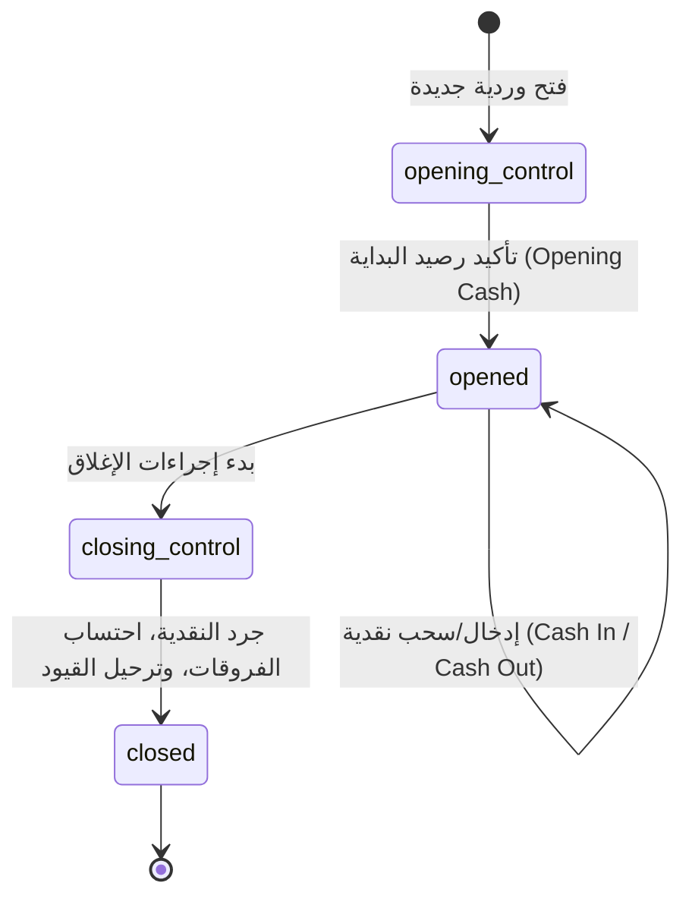
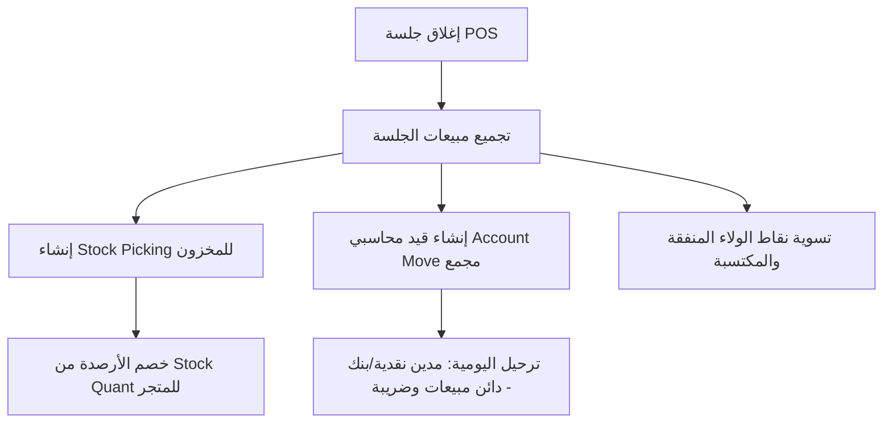
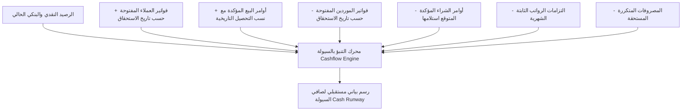
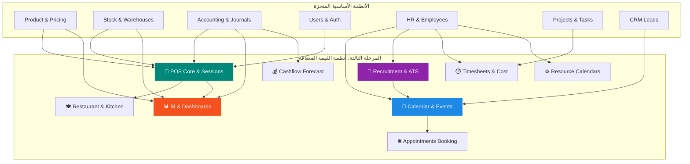

# خطة تنفيذية شاملة — المرحلة الثالثة: أنظمة القيمة المضافة العالية

## الملخص التنفيذي

المرحلة الثالثة تركز على بناء **4 أنظمة استراتيجية كبرى ذات قيمة مضافة عالية** تنقل نظام Cashflow Backend من مجرد نظام ERP خلفي وإداري إلى منظومة تشغيلية، تجارية، وتحليلية متكاملة تتفوق على Odoo 19.0 في الأداء والصلابة المعمارية:

1. 🏪 **نقطة البيع المتقدمة (Point of Sale - POS)** — إدارة المبيعات الميدانية، الجلسات والورديات، التحكم بالنقدية والصناديق، وضع المطاعم وإدارة الطاولات (Restaurant Floor & Tables)، دعم العمل دون اتصال (Offline Sync)، والتكامل التلقائي مع المخزون والمحاسبة والولاء.
2. 📅 **التقويم والمواعيد والفعاليات (Calendar & Appointments)** — إدارة الاجتماعات والفعاليات، محرك التكرار المتوافق مع معيار RFC 5545 (RRULE)، منصة حجز المواعيد الذاتية (Self-service Bookings)، كشف التعارضات التلقائي، والتكامل مع CRM والموارد البشرية.
3. 👥 **الموارد البشرية المتقدمة (Recruitment, Timesheets & Resources)** — نظام تتبع المرشحين والتوظيف (ATS)، مسار المقابلات والتقييم، تحويل المرشح لموظف بضغطة واحدة، سجلات الوقت للمشاريع والمهام (Timesheets)، احتساب تكلفة ساعة العمل وربحية المشاريع، وتقاويم الموارد وفترات العمل (Work Entries).
4. 📊 **التقارير المتقدمة ولوحات المؤشرات وذكاء الأعمال (BI, Analytics & Cashflow Forecasting)** — محرك التحليلات متعدد الأبعاد (OLAP Pivot Cube)، لوحات معلومات تنفيذية تفاعلية وقابلة للتخصيص (Dynamic Dashboards)، محرك التنبؤ المالي بالتدفقات النقدية (Cashflow Forecasting)، ونظام الجدولة والتصدير التلقائي للتقارير (Excel/PDF).

> [!IMPORTANT]
> هذه الخطة مبنية على مراجعة دقيقة لطبقات المشروع الحالي (Clean Architecture في Go: `domain`, `usecase`, `adapters/storage`, `adapters/http`). كل محور يوضح الكيانات بالكامل، منطق الأعمال، جداول قاعدة البيانات (PostgreSQL DDL)، نقاط النهاية (HTTP Endpoints)، وتكاملات Glue Modules العابرة.

---

## تحليل الوضع الحالي

### المقارنة الوظيفية مع Odoo 19.0

| النظام | الملفات الحالية في المشروع | الكيانات المنفذة | الفجوات الرئيسية ومجالات النقص |
| -------- | ----------------- | ------------------- | ----------------- |
| **POS** | 0 ملفات (غير موجود بالكامل) | لا يوجد | دورة نقاط البيع كاملة: الجلسات، الورديات، الصندوق، أوامر POS، طرق الدفع المتعددة، المطاعم/الطاولات، المزامنة غير المتصلة، وتكامل المخزون والمحاسبة والولاء. |
| **Calendar** | 5 ملفات جزئية في `activity` | Activity, ActivityType, Message, Thread | لا يوجد أحداث تقويم متعددة الأطراف، لا تكرار RRULE، لا تنبيهات مواعيد، لا حجز مواعيد ذاتية، لا كشف تعارضات، ولا دعم iCal. |
| **HR Mgt** | 7 ملفات في `hr` + 7 في `project` | Employee, Department, Job, Attendance, Leave / Project, Task | غياب كامل لـ Recruitment (وظائف، مرشحون، مقابلات، عروض)، غياب كامل لـ Timesheets وربط الوقت بالتكلفة والمشاريع، غياب Resource Calendars و Work Entries. |
| **Analytics** | 3 ملفات في `report` | Report, ReportLine, DashboardKPI (مبسط) | لا يوجد محرك تجميع متعدد الأبعاد (OLAP Cube)، لا توجد لوحات معلومات ديناميكية تفاعلية، لا يوجد محرك للتنبؤ بالتدفقات النقدية (Cashflow Forecast)، ولا جدولة وتصدير آلي للتقارير. |

---

## المحور الأول: 🏪 نقطة البيع المتقدمة (Point of Sale - POS)

### 1.1 بنية النظام والمفهوم المعماري

نظام نقطة البيع في Cashflow صُمم ليخدم قطاعي **التجزئة (Retail)** و**المطاعم والمقاهي (Restaurant/Café)** عبر بنية معمارية قوية تدعم العمل في بيئات الاتصال الضعيف أو المنقطع، مع تكامل فوري أو دفعي مع دفاتر المحاسبة العامة ومواقع المخزون.

```
internal/domain/pos/
├── config.go               [NEW] — إعدادات محطة البيع والشروط
├── session.go              [NEW] — دورة حياة الجلسة وإدارة الصندوق
├── order.go                [NEW] — أوامر البيع وأسطر الطلبات
├── payment.go              [NEW] — طرق الدفع وتسويات المعاملات
├── cash_in_out.go          [NEW] — حركة المقبوضات والمسحوبات النقدية
├── restaurant.go           [NEW] — صالات المطاعم والطاولات وأوامر المطبخ
├── sync.go                 [NEW] — بروتوكول المزامنة غير المتصلة وحل التعارضات
├── errors.go               [NEW] — أخطاء نطاق نقاط البيع
└── ports.go                [NEW] — واجهات المستودعات ومحركات الربط
```

---

### 1.2 دورة حياة الجلسة والصندوق (POS Session & Cash Control)



#### الكيانات الأساسية

```go
package pos

import (
	"time"
	platformerrors "cashflow_backend/internal/platform/errors"
)

type SessionState string

const (
	SessionStateOpeningControl SessionState = "opening_control"
	SessionStateOpened         SessionState = "opened"
	SessionStateClosingControl SessionState = "closing_control"
	SessionStateClosed         SessionState = "closed"
)

// PosConfig إعدادات نقطة البيع ومحددات المحطة
type PosConfig struct {
	ID                     int64     `json:"id"`
	Name                   string    `json:"name"`
	WarehouseID            int64     `json:"warehouse_id"`
	StockLocationID        int64     `json:"stock_location_id"`        // موقع صرف المخزون للمتجر
	JournalID              int64     `json:"journal_id"`               // اليومية المحاسبية لنقطة البيع
	InvoiceJournalID       *int64    `json:"invoice_journal_id,omitempty"` // اليومية في حال إصدار فاتورة رسمية
	PaymentMethodIDs       []int64   `json:"payment_method_ids"`
	IfaceCashdrawer        bool      `json:"iface_cashdrawer"`
	IfaceElectronicScale   bool      `json:"iface_electronic_scale"`
	CustomerFacingDisplay  bool      `json:"customer_facing_display"`
	ModulePosRestaurant    bool      `json:"module_pos_restaurant"`    // تفعيل وضع المطاعم
	UpdateStockAtClosing   bool      `json:"update_stock_at_closing"`  // تحديث المخزون عند إغلاق الجلسة أم لحظياً
	ReceiptHeader          string    `json:"receipt_header,omitempty"`
	ReceiptFooter          string    `json:"receipt_footer,omitempty"`
	AllowDiscount          bool      `json:"allow_discount"`
	ManualDiscountLimit    float64   `json:"manual_discount_limit"`    // الحد الأقصى للخصم اليدوي %
	Active                 bool      `json:"active"`
	CompanyID              int64     `json:"company_id"`
	CreatedAt              time.Time `json:"created_at"`
	UpdatedAt              time.Time `json:"updated_at"`
}

// PosSession جلسة نقطة البيع (الوردية)
type PosSession struct {
	ID                   int64        `json:"id"`
	ConfigID             int64        `json:"config_id"`
	UserID               int64        `json:"user_id"`                 // الكاشير المسؤول
	Name                 string       `json:"name"`                    // e.g. POS/2026/03/0001
	State                SessionState `json:"state"`
	StartAt              time.Time    `json:"start_at"`
	StopAt               *time.Time   `json:"stop_at,omitempty"`
	CashRegisterBalanceStart float64  `json:"cash_register_balance_start"` // رصيد البداية
	CashRegisterBalanceEnd   float64  `json:"cash_register_balance_end"`   // الرصيد الفعلي المعدود
	CashRegisterBalanceReal  float64  `json:"cash_register_balance_real"`  // الرصيد المتوقع دفترياً
	CashRegisterDifference   float64  `json:"cash_register_difference"`    // عجز أو فائض
	TotalOrdersCount     int          `json:"total_orders_count"`
	TotalPaymentsAmount  float64      `json:"total_payments_amount"`
	StockPickingID       *int64       `json:"stock_picking_id,omitempty"`  // قيد صرف المخزون المجمع
	AccountMoveID        *int64       `json:"account_move_id,omitempty"`   // قيد المحاسبة المجمع
	CompanyID            int64        `json:"company_id"`
	CreatedAt            time.Time    `json:"created_at"`
	UpdatedAt            time.Time    `json:"updated_at"`
}

// CashInOutMovement حركة إدخال أو سحب نقدية سريعة أثناء الوردية
type CashInOutMovement struct {
	ID          int64     `json:"id"`
	SessionID   int64     `json:"session_id"`
	Type        string    `json:"type"`        // "in" or "out"
	Amount      float64   `json:"amount"`
	Reason      string    `json:"reason"`      // سبب الإيداع أو الصرف
	UserID      int64     `json:"user_id"`
	AccountID   *int64    `json:"account_id,omitempty"` // حساب المصروفات المقابل
	CreatedAt   time.Time `json:"created_at"`
}
```

---

### 1.3 أوامر البيع وطرق الدفع والباركود (POS Orders & Multi-Payment)

```go
type OrderState string

const (
	OrderStateDraft     OrderState = "draft"
	OrderStatePaid      OrderState = "paid"
	OrderStateDone      OrderState = "done"
	OrderStateInvoiced  OrderState = "invoiced"
	OrderStateCancelled OrderState = "cancelled"
)

// PosOrder أمر البيع من نقطة البيع
type PosOrder struct {
	ID               int64          `json:"id"`
	Name             string         `json:"name"`              // كود العرض: Order 00012-001-0004
	ClientUUID       string         `json:"client_uuid"`       // UUID تم توليده في جهاز الكاشير (Offline Resilience)
	SessionID        int64          `json:"session_id"`
	PartnerID        *int64         `json:"partner_id,omitempty"` // العميل (اختياري)
	UserID           int64          `json:"user_id"`           // الكاشير
	TableID          *int64         `json:"table_id,omitempty"` // الطاولة (وضع المطاعم)
	CustomerCount    int            `json:"customer_count"`    // عدد الضيوف
	State            OrderState     `json:"state"`
	AmountUntaxed    float64        `json:"amount_untaxed"`
	AmountTax        float64        `json:"amount_tax"`
	AmountTotal      float64        `json:"amount_total"`
	AmountPaid       float64        `json:"amount_paid"`
	AmountReturn     float64        `json:"amount_return"`     // المتبقي المرتجع للعميل (الباقي)
	TipAmount        float64        `json:"tip_amount"`
	Lines            []PosOrderLine `json:"lines"`
	Payments         []PosPayment   `json:"payments"`
	AccountMoveID    *int64         `json:"account_move_id,omitempty"` // في حال إصدار فاتورة ضريبية رسمية
	FiscalPositionID *int64         `json:"fiscal_position_id,omitempty"`
	LoyaltyCardID    *int64         `json:"loyalty_card_id,omitempty"`
	PointsWon        float64        `json:"points_won"`
	PointsSpent      float64        `json:"points_spent"`
	Note             string         `json:"note,omitempty"`
	CompanyID        int64          `json:"company_id"`
	CreatedAt        time.Time      `json:"created_at"`
	UpdatedAt        time.Time      `json:"updated_at"`
}

// PosOrderLine بند من بنود أمر نقطة البيع
type PosOrderLine struct {
	ID             int64     `json:"id"`
	OrderID        int64     `json:"order_id"`
	ProductID      int64     `json:"product_id"`
	FullBundleName string    `json:"full_bundle_name,omitempty"`
	Qty            float64   `json:"qty"`
	PriceUnit      float64   `json:"price_unit"`
	Discount       float64   `json:"discount"`          // نسبة الخصم
	PriceSubtotal  float64   `json:"price_subtotal"`     // قبل الضريبة
	PriceSubtotalIncl float64 `json:"price_subtotal_incl"` // شامل الضريبة
	TaxIDs         []int64   `json:"tax_ids"`
	PackLotNames   []string  `json:"pack_lot_names,omitempty"` // الأرقام التسلسلية / التشغيلات الممسوحة
	PackagingID    *int64    `json:"packaging_id,omitempty"`
	CustomerNote   string    `json:"customer_note,omitempty"`
	CompanyID      int64     `json:"company_id"`
}

// PosPayment طريقة الدفع المنفذة لأمر البيع
type PosPayment struct {
	ID              int64     `json:"id"`
	OrderID         int64     `json:"order_id"`
	SessionID       int64     `json:"session_id"`
	PaymentMethodID int64     `json:"payment_method_id"`
	Amount          float64   `json:"amount"`
	PaymentDate     time.Time `json:"payment_date"`
	CardType        string    `json:"card_type,omitempty"`     // Visa, Mada, Mastercard
	TransactionID   string    `json:"transaction_id,omitempty"` // مرجع شبكة الدفع POS Terminal
	CompanyID       int64     `json:"company_id"`
}
```

---

### 1.4 وضع المطاعم وإدارة الصالات (POS Restaurant & Kitchen Displays)

```go
// RestaurantFloor صالة أو دور في المطعم
type RestaurantFloor struct {
	ID        int64             `json:"id"`
	Name      string            `json:"name"`       // "الدور الأرضي", "التراس الخارجي"
	PosConfigID int64           `json:"pos_config_id"`
	Sequence  int               `json:"sequence"`
	Tables    []RestaurantTable `json:"tables,omitempty"`
	CompanyID int64             `json:"company_id"`
	Active    bool              `json:"active"`
}

// RestaurantTable طاولة داخل الصالة
type RestaurantTable struct {
	ID        int64   `json:"id"`
	FloorID   int64   `json:"floor_id"`
	Name      string  `json:"name"`       // "T1", "VIP-4"
	Seats     int     `json:"seats"`      // سعة الطاولة
	Shape     string  `json:"shape"`      // "square", "round"
	PositionX float64 `json:"position_x"` // إحداثيات الرسم
	PositionY float64 `json:"position_y"`
	Width     float64 `json:"width"`
	Height    float64 `json:"height"`
	Active    bool    `json:"active"`
	CompanyID int64   `json:"company_id"`
}

type KitchenOrderStatus string

const (
	KitchenOrderPending   KitchenOrderStatus = "pending"
	KitchenOrderPreparing KitchenOrderStatus = "preparing"
	KitchenOrderReady     KitchenOrderStatus = "ready"
	KitchenOrderServed    KitchenOrderStatus = "served"
)

// KitchenOrderTicket تذكرة طلب للمطبخ (KOT)
type KitchenOrderTicket struct {
	ID          int64              `json:"id"`
	OrderID     int64              `json:"order_id"`
	TableID     *int64             `json:"table_id,omitempty"`
	FloorName   string             `json:"floor_name,omitempty"`
	TableName   string             `json:"table_name,omitempty"`
	Status      KitchenOrderStatus `json:"status"`
	Course      string             `json:"course"` // مقبلات، طبق رئيسي، حلويات
	Notes       string             `json:"notes,omitempty"`
	Lines       []KitchenOrderLine `json:"lines"`
	CreatedAt   time.Time          `json:"created_at"`
	UpdatedAt   time.Time          `json:"updated_at"`
}

type KitchenOrderLine struct {
	ID          int64  `json:"id"`
	ProductID   int64  `json:"product_id"`
	ProductName string `json:"product_name"`
	Qty         float64`json:"qty"`
	Notes       string `json:"notes,omitempty"` // e.g. "بدون بصل", "استواء متوسط"
}
```

---

### 1.5 محرك التكامل التلقائي (POS Glue Engine)

عند اعتماد وإغلاق الوردية (`ActionCloseSession`)، ينفذ المحرك التالي تلقائياً:



```go
// PosGlueService ينسق التكامل بين نقطة البيع والمخزون والمحاسبة والولاء
type PosGlueService interface {
	// SyncOrdersToStock يُنشئ حركة مخزنية Picking بكل مبيعات الجلسة
	SyncOrdersToStock(ctx context.Context, session *PosSession) (*stock.StockPicking, error)

	// SyncSessionToAccounting يُنشئ قيد اليومية المجمع للجلسة
	SyncSessionToAccounting(ctx context.Context, session *PosSession) (*accounting.AccountMove, error)

	// ProcessLoyaltyForOrder يُعالج النقاط المكتسبة أو المستخدمة في أمر البيع
	ProcessLoyaltyForOrder(ctx context.Context, order *PosOrder) error
}
```

---

### 1.6 جداول قاعدة البيانات لنظام POS

```sql
-- migrations/000059_pos_schema.up.sql

CREATE TABLE pos_configs (
    id                      BIGSERIAL PRIMARY KEY,
    name                    VARCHAR(128) NOT NULL,
    warehouse_id            BIGINT NOT NULL REFERENCES warehouses(id),
    stock_location_id       BIGINT NOT NULL REFERENCES stock_locations(id),
    journal_id             BIGINT NOT NULL REFERENCES account_journals(id),
    invoice_journal_id      BIGINT REFERENCES account_journals(id),
    iface_cashdrawer        BOOLEAN NOT NULL DEFAULT TRUE,
    iface_electronic_scale  BOOLEAN NOT NULL DEFAULT FALSE,
    customer_facing_display BOOLEAN NOT NULL DEFAULT FALSE,
    module_pos_restaurant   BOOLEAN NOT NULL DEFAULT FALSE,
    update_stock_at_closing BOOLEAN NOT NULL DEFAULT TRUE,
    receipt_header          TEXT,
    receipt_footer          TEXT,
    allow_discount          BOOLEAN NOT NULL DEFAULT TRUE,
    manual_discount_limit   NUMERIC(5,2) NOT NULL DEFAULT 100.00,
    active                  BOOLEAN NOT NULL DEFAULT TRUE,
    company_id             BIGINT NOT NULL REFERENCES companies(id),
    created_at              TIMESTAMPTZ NOT NULL DEFAULT NOW(),
    updated_at              TIMESTAMPTZ NOT NULL DEFAULT NOW()
);

CREATE TABLE pos_payment_methods (
    id              BIGSERIAL PRIMARY KEY,
    name            VARCHAR(64) NOT NULL,
    journal_id      BIGINT NOT NULL REFERENCES account_journals(id),
    is_cash_count   BOOLEAN NOT NULL DEFAULT FALSE,
    split_transactions BOOLEAN NOT NULL DEFAULT FALSE,
    company_id      BIGINT NOT NULL REFERENCES companies(id),
    active          BOOLEAN NOT NULL DEFAULT TRUE
);

CREATE TABLE pos_config_payment_method_rel (
    config_id         BIGINT NOT NULL REFERENCES pos_configs(id) ON DELETE CASCADE,
    payment_method_id BIGINT NOT NULL REFERENCES pos_payment_methods(id) ON DELETE CASCADE,
    PRIMARY KEY (config_id, payment_method_id)
);

CREATE TABLE pos_sessions (
    id                          BIGSERIAL PRIMARY KEY,
    config_id                   BIGINT NOT NULL REFERENCES pos_configs(id),
    user_id                     BIGINT NOT NULL REFERENCES users(id),
    name                        VARCHAR(64) NOT NULL UNIQUE,
    state                       VARCHAR(32) NOT NULL DEFAULT 'opening_control',
    start_at                    TIMESTAMPTZ NOT NULL DEFAULT NOW(),
    stop_at                     TIMESTAMPTZ,
    cash_register_balance_start NUMERIC(15,4) NOT NULL DEFAULT 0,
    cash_register_balance_end   NUMERIC(15,4) NOT NULL DEFAULT 0,
    cash_register_balance_real  NUMERIC(15,4) NOT NULL DEFAULT 0,
    cash_register_difference    NUMERIC(15,4) NOT NULL DEFAULT 0,
    total_orders_count          INT NOT NULL DEFAULT 0,
    total_payments_amount       NUMERIC(15,4) NOT NULL DEFAULT 0,
    stock_picking_id            BIGINT REFERENCES stock_pickings(id),
    account_move_id             BIGINT REFERENCES account_moves(id),
    company_id                  BIGINT NOT NULL REFERENCES companies(id),
    created_at                  TIMESTAMPTZ NOT NULL DEFAULT NOW(),
    updated_at                  TIMESTAMPTZ NOT NULL DEFAULT NOW()
);

CREATE TABLE pos_orders (
    id                  BIGSERIAL PRIMARY KEY,
    name                VARCHAR(64) NOT NULL,
    client_uuid         VARCHAR(64) NOT NULL UNIQUE,
    session_id          BIGINT NOT NULL REFERENCES pos_sessions(id),
    partner_id          BIGINT REFERENCES partners(id),
    user_id             BIGINT NOT NULL REFERENCES users(id),
    state               VARCHAR(32) NOT NULL DEFAULT 'draft',
    amount_untaxed      NUMERIC(15,4) NOT NULL DEFAULT 0,
    amount_tax          NUMERIC(15,4) NOT NULL DEFAULT 0,
    amount_total        NUMERIC(15,4) NOT NULL DEFAULT 0,
    amount_paid         NUMERIC(15,4) NOT NULL DEFAULT 0,
    amount_return       NUMERIC(15,4) NOT NULL DEFAULT 0,
    tip_amount          NUMERIC(15,4) NOT NULL DEFAULT 0,
    account_move_id     BIGINT REFERENCES account_moves(id),
    loyalty_card_id     BIGINT REFERENCES loyalty_cards(id),
    points_won          NUMERIC(15,2) NOT NULL DEFAULT 0,
    points_spent        NUMERIC(15,2) NOT NULL DEFAULT 0,
    note                TEXT,
    company_id          BIGINT NOT NULL REFERENCES companies(id),
    created_at          TIMESTAMPTZ NOT NULL DEFAULT NOW(),
    updated_at          TIMESTAMPTZ NOT NULL DEFAULT NOW()
);
CREATE INDEX idx_pos_orders_session ON pos_orders(session_id);
CREATE INDEX idx_pos_orders_partner ON pos_orders(partner_id);

CREATE TABLE pos_order_lines (
    id                  BIGSERIAL PRIMARY KEY,
    order_id            BIGINT NOT NULL REFERENCES pos_orders(id) ON DELETE CASCADE,
    product_id          BIGINT NOT NULL REFERENCES products(id),
    full_bundle_name    VARCHAR(256),
    qty                 NUMERIC(15,4) NOT NULL DEFAULT 1,
    price_unit          NUMERIC(15,4) NOT NULL DEFAULT 0,
    discount            NUMERIC(5,2) NOT NULL DEFAULT 0,
    price_subtotal      NUMERIC(15,4) NOT NULL DEFAULT 0,
    price_subtotal_incl NUMERIC(15,4) NOT NULL DEFAULT 0,
    packaging_id        BIGINT,
    customer_note       TEXT,
    company_id          BIGINT NOT NULL REFERENCES companies(id)
);

CREATE TABLE pos_payments (
    id                  BIGSERIAL PRIMARY KEY,
    order_id            BIGINT NOT NULL REFERENCES pos_orders(id) ON DELETE CASCADE,
    session_id          BIGINT NOT NULL REFERENCES pos_sessions(id),
    payment_method_id   BIGINT NOT NULL REFERENCES pos_payment_methods(id),
    amount              NUMERIC(15,4) NOT NULL,
    payment_date        TIMESTAMPTZ NOT NULL DEFAULT NOW(),
    card_type           VARCHAR(32),
    transaction_id      VARCHAR(128),
    company_id          BIGINT NOT NULL REFERENCES companies(id)
);

CREATE TABLE pos_cash_in_outs (
    id          BIGSERIAL PRIMARY KEY,
    session_id  BIGINT NOT NULL REFERENCES pos_sessions(id),
    type        VARCHAR(8) NOT NULL CHECK (type IN ('in', 'out')),
    amount      NUMERIC(15,4) NOT NULL,
    reason      VARCHAR(256) NOT NULL,
    user_id     BIGINT NOT NULL REFERENCES users(id),
    account_id  BIGINT REFERENCES accounts(id),
    created_at  TIMESTAMPTZ NOT NULL DEFAULT NOW()
);

-- migrations/000063_pos_restaurant_schema.up.sql
CREATE TABLE restaurant_floors (
    id            BIGSERIAL PRIMARY KEY,
    name          VARCHAR(64) NOT NULL,
    pos_config_id BIGINT NOT NULL REFERENCES pos_configs(id),
    sequence      INT NOT NULL DEFAULT 10,
    active        BOOLEAN NOT NULL DEFAULT TRUE,
    company_id    BIGINT NOT NULL REFERENCES companies(id)
);

CREATE TABLE restaurant_tables (
    id          BIGSERIAL PRIMARY KEY,
    floor_id    BIGINT NOT NULL REFERENCES restaurant_floors(id) ON DELETE CASCADE,
    name        VARCHAR(32) NOT NULL,
    seats       INT NOT NULL DEFAULT 4,
    shape       VARCHAR(16) NOT NULL DEFAULT 'square', -- square, round
    position_x  NUMERIC(10,2) NOT NULL DEFAULT 0,
    position_y  NUMERIC(10,2) NOT NULL DEFAULT 0,
    width       NUMERIC(10,2) NOT NULL DEFAULT 100,
    height      NUMERIC(10,2) NOT NULL DEFAULT 100,
    active      BOOLEAN NOT NULL DEFAULT TRUE,
    company_id  BIGINT NOT NULL REFERENCES companies(id)
);

CREATE TABLE pos_kitchen_tickets (
    id          BIGSERIAL PRIMARY KEY,
    order_id    BIGINT NOT NULL REFERENCES pos_orders(id) ON DELETE CASCADE,
    table_id    BIGINT REFERENCES restaurant_tables(id),
    status      VARCHAR(32) NOT NULL DEFAULT 'pending',
    course      VARCHAR(32) NOT NULL DEFAULT 'main',
    notes       TEXT,
    created_at  TIMESTAMPTZ NOT NULL DEFAULT NOW(),
    updated_at  TIMESTAMPTZ NOT NULL DEFAULT NOW()
);
```

---

### 1.7 مسارات واجهة التطبيق البرمجية (POS HTTP Endpoints)

```go
// POS Configurations
GET    /api/v1/pos/configs
POST   /api/v1/pos/configs
GET    /api/v1/pos/configs/{id}
PUT    /api/v1/pos/configs/{id}

// Sessions & Cash Control
POST   /api/v1/pos/sessions/open             // فتح وردية جديدة
POST   /api/v1/pos/sessions/{id}/cash-in-out // سحب أو إيداع نقدية
POST   /api/v1/pos/sessions/{id}/closing     // بدء مرحلة الجرد
POST   /api/v1/pos/sessions/{id}/close       // إغلاق الوردية وترحيل المخزون والقيود
GET    /api/v1/pos/sessions/{id}/summary     // ملخص مبيعات الوردية

// Orders & Offline Sync
POST   /api/v1/pos/orders/sync               // مزامنة حزمة طلبات مجمعة (Batch Offline Sync)
POST   /api/v1/pos/orders                    // إنشاء أو دفع طلب فردي
GET    /api/v1/pos/orders/{id}
POST   /api/v1/pos/orders/{id}/invoice       // تحويل أمر POS إلى فاتورة ضريبية رسمية

// Restaurant
GET    /api/v1/pos/floors/{config_id}        // جلب خريطة الطاولات والصالات
POST   /api/v1/pos/kitchen/tickets           // إرسال طلب للمطبخ
PUT    /api/v1/pos/kitchen/tickets/{id}/status // تحديث حالة الطبق في المطبخ
```

---

## المحور الثاني: 📅 التقويم والمواعيد والفعاليات (Calendar & Appointments)

### 2.1 بنية النظام والمفهوم المعماري

محور التقويم ينقل الأنشطة والمهام إلى بيئة تعاونية متطورة تدعم الجدولة المتقدمة، الاجتماعات الافتراضية، وحجز المواعيد عبر الإنترنت (مثل Calendly داخل ERP):

```
internal/domain/calendar/
├── event.go                [NEW] — كيان الحدث والاجتماع
├── attendee.go             [NEW] — المشاركون وحالات القبول
├── recurrence.go           [NEW] — محرك قواعد التكرار RFC 5545 RRULE
├── alarm.go                [NEW] — التنبيهات والتذكيرات (Push/Mail/SMS)
├── appointment_type.go     [NEW] — أنواع روابط حجز المواعيد
├── appointment_slot.go     [NEW] — فترات التوفر وحساب الشواغر
├── appointment_booking.go  [NEW] — حجز وتأكيد مواعيد العملاء
├── ical.go                 [NEW] — مولد ومحلل ملفات التقويم iCal (.ics)
├── ports.go                [NEW] — واجهات التخزين وخدمات التقويم
└── errors.go               [NEW] — أخطاء نطاق التقويم والمواعيد
```

---

### 2.2 الكيانات الأساسية ومحرك التكرار (RRULE)

```go
package calendar

import (
	"time"
)

type EventPrivacy string

const (
	PrivacyPublic       EventPrivacy = "public"
	PrivacyPrivate      EventPrivacy = "private"
	PrivacyConfidential EventPrivacy = "confidential"
)

type AttendeeStatus string

const (
	StatusNeedsAction AttendeeStatus = "needs_action"
	StatusAccepted    AttendeeStatus = "accepted"
	StatusDeclined    AttendeeStatus = "declined"
	StatusTentative   AttendeeStatus = "tentative"
)

// CalendarEvent الحدث أو الاجتماع في التقويم
type CalendarEvent struct {
	ID                 int64          `json:"id"`
	Name               string         `json:"name"`               // عنوان الاجتماع / الحدث
	Description        string         `json:"description,omitempty"`
	Start              time.Time      `json:"start"`
	Stop               time.Time      `json:"stop"`
	Duration           float64        `json:"duration"`           // بالساعات
	Allday             bool           `json:"allday"`
	Location           string         `json:"location,omitempty"`
	VideoUrl           string         `json:"video_url,omitempty"` // Google Meet / Teams link
	Privacy            EventPrivacy   `json:"privacy"`
	ShowAs             string         `json:"show_as"`            // "busy" or "free"
	UserID             int64          `json:"user_id"`            // منشئ الحدث
	ResModel           string         `json:"res_model,omitempty"` // مرتبط بـ "crm.lead", "hr.applicant", إلخ
	ResID              *int64         `json:"res_id,omitempty"`
	RecurrenceID       *int64         `json:"recurrence_id,omitempty"`
	RecurrenceRule     string         `json:"recurrence_rule,omitempty"` // RFC 5545 RRULE
	Attendees          []Attendee     `json:"attendees,omitempty"`
	Alarms             []EventAlarm   `json:"alarms,omitempty"`
	CompanyID          int64          `json:"company_id"`
	CreatedAt          time.Time      `json:"created_at"`
	UpdatedAt          time.Time      `json:"updated_at"`
}

// Attendee مشارك في الاجتماع
type Attendee struct {
	ID        int64          `json:"id"`
	EventID   int64          `json:"event_id"`
	PartnerID *int64         `json:"partner_id,omitempty"`
	Email     string         `json:"email"`
	Name      string         `json:"name"`
	Status    AttendeeStatus `json:"status"`
	IsOwner   bool           `json:"is_owner"`
	Token     string         `json:"token"` // رابط استجابة سريع من البريد (Accept/Decline)
}

// EventAlarm منبه أو تذكير قبل الحدث
type EventAlarm struct {
	ID            int64  `json:"id"`
	EventID       int64  `json:"event_id"`
	AlarmType     string `json:"alarm_type"` // "notification", "email", "sms"
	DurationMinutes int  `json:"duration_minutes"` // مثلاً قبل 15 دقيقة
	Message       string `json:"message,omitempty"`
}

// RecurrenceRuleEngine محرك تكرار المواعيد
type RecurrenceRule struct {
	Freq       string     `json:"freq"`        // DAILY, WEEKLY, MONTHLY, YEARLY
	Interval   int        `json:"interval"`    // كل N أسابيع/أشهر
	Count      *int       `json:"count,omitempty"`      // عدد التكرارات
	Until      *time.Time `json:"until,omitempty"`      // تاريخ الانتهاء
	ByDay      []string   `json:"by_day,omitempty"`     // MO, TU, WE, TH, FR, SA, SU
	Exceptions []time.Time `json:"exceptions,omitempty"` // تواريخ مستثناة
}
```

---

### 2.3 منصة حجز المواعيد الذاتية (Self-Service Appointments)

```go
type AssignMethod string

const (
	AssignMethodRandom     AssignMethod = "random"
	AssignMethodRoundRobin AssignMethod = "round_robin"
	AssignMethodChosen     AssignMethod = "chosen"
)

// AppointmentType نوع الموعد القابل للحجز أونلاين
type AppointmentType struct {
	ID                 int64        `json:"id"`
	Name               string       `json:"name"`                // e.g. "جلسة استشارة مجانية"
	Slug               string       `json:"slug"`                // booking URL path
	DurationMinutes    int          `json:"duration_minutes"`    // 30, 45, 60
	MinScheduleHours   int          `json:"min_schedule_hours"`  // أقل وقت للحجز المسبق (مثلاً قبل 4 ساعات)
	MaxScheduleDays    int          `json:"max_schedule_days"`   // أقصى حد للأيام المستقبلية (مثلاً 30 يوماً)
	AssignationMethod  AssignMethod `json:"assignation_method"`
	StaffUserIDs       []int64      `json:"staff_user_ids"`      // الموظفون المتاحون لهذا النوع
	Location           string       `json:"location,omitempty"`
	ReminderMinutes    []int        `json:"reminder_minutes"`    // تذكيرات تلقائية
	Active             bool         `json:"active"`
	CompanyID          int64        `json:"company_id"`
}

// AppointmentSlot فترات العمل المحددة لاستقبال المواعيد
type AppointmentSlot struct {
	ID                int64     `json:"id"`
	AppointmentTypeID int64     `json:"appointment_type_id"`
	DayOfWeek         int       `json:"day_of_week"`         // 0=Sunday, 6=Saturday
	HourFrom          float64   `json:"hour_from"`           // 09.00
	HourTo            float64   `json:"hour_to"`             // 17.00
}

// AppointmentBooking طلب حجز موعد وارد من العميل
type AppointmentBooking struct {
	AppointmentTypeID int64     `json:"appointment_type_id"`
	StaffID           int64     `json:"staff_id"`
	CustomerName      string    `json:"customer_name"`
	CustomerEmail     string    `json:"customer_email"`
	CustomerPhone     string    `json:"customer_phone"`
	StartTime         time.Time `json:"start_time"`
	Notes             string    `json:"notes,omitempty"`
}

// AvailabilityEngine محرك حساب الفترات الشاغرة ومنع التعارض
type AvailabilityEngine interface {
	// GetAvailableSlots يحسب الفترات المتاحة للموظف مع فحص التقويم والإجازات
	GetAvailableSlots(ctx context.Context, appointmentTypeID int64, from, to time.Time) ([]time.Time, error)
}
```

---

### 2.4 جداول قاعدة البيانات لنظام Calendar & Appointments

```sql
-- migrations/000060_calendar_appointments_schema.up.sql

CREATE TABLE calendar_recurrences (
    id          BIGSERIAL PRIMARY KEY,
    rrule       VARCHAR(256) NOT NULL,
    count       INT,
    until       TIMESTAMPTZ,
    company_id  BIGINT NOT NULL REFERENCES companies(id),
    created_at  TIMESTAMPTZ NOT NULL DEFAULT NOW()
);

CREATE TABLE calendar_events (
    id              BIGSERIAL PRIMARY KEY,
    name            VARCHAR(256) NOT NULL,
    description     TEXT,
    start_date      TIMESTAMPTZ NOT NULL,
    stop_date       TIMESTAMPTZ NOT NULL,
    duration        NUMERIC(6,2) NOT NULL DEFAULT 1.0,
    allday          BOOLEAN NOT NULL DEFAULT FALSE,
    location        VARCHAR(256),
    video_url       VARCHAR(512),
    privacy         VARCHAR(32) NOT NULL DEFAULT 'public',
    show_as         VARCHAR(16) NOT NULL DEFAULT 'busy',
    user_id         BIGINT NOT NULL REFERENCES users(id),
    res_model       VARCHAR(64),
    res_id          BIGINT,
    recurrence_id   BIGINT REFERENCES calendar_recurrences(id) ON DELETE SET NULL,
    company_id      BIGINT NOT NULL REFERENCES companies(id),
    created_at      TIMESTAMPTZ NOT NULL DEFAULT NOW(),
    updated_at      TIMESTAMPTZ NOT NULL DEFAULT NOW()
);
CREATE INDEX idx_calendar_events_dates ON calendar_events(start_date, stop_date);
CREATE INDEX idx_calendar_events_user ON calendar_events(user_id);
CREATE INDEX idx_calendar_events_ref ON calendar_events(res_model, res_id);

CREATE TABLE calendar_attendees (
    id          BIGSERIAL PRIMARY KEY,
    event_id    BIGINT NOT NULL REFERENCES calendar_events(id) ON DELETE CASCADE,
    partner_id  BIGINT REFERENCES partners(id),
    email       VARCHAR(128) NOT NULL,
    name        VARCHAR(128) NOT NULL,
    status      VARCHAR(32) NOT NULL DEFAULT 'needs_action',
    is_owner    BOOLEAN NOT NULL DEFAULT FALSE,
    token       VARCHAR(64) NOT NULL UNIQUE
);

CREATE TABLE calendar_event_alarms (
    id                BIGSERIAL PRIMARY KEY,
    event_id          BIGINT NOT NULL REFERENCES calendar_events(id) ON DELETE CASCADE,
    alarm_type        VARCHAR(32) NOT NULL DEFAULT 'notification',
    duration_minutes  INT NOT NULL DEFAULT 15,
    message           TEXT
);

CREATE TABLE appointment_types (
    id                  BIGSERIAL PRIMARY KEY,
    name                VARCHAR(128) NOT NULL,
    slug                VARCHAR(64) NOT NULL UNIQUE,
    duration_minutes    INT NOT NULL DEFAULT 30,
    min_schedule_hours  INT NOT NULL DEFAULT 2,
    max_schedule_days   INT NOT NULL DEFAULT 30,
    assignation_method  VARCHAR(32) NOT NULL DEFAULT 'round_robin',
    location            VARCHAR(256),
    active              BOOLEAN NOT NULL DEFAULT TRUE,
    company_id          BIGINT NOT NULL REFERENCES companies(id),
    created_at          TIMESTAMPTZ NOT NULL DEFAULT NOW(),
    updated_at          TIMESTAMPTZ NOT NULL DEFAULT NOW()
);

CREATE TABLE appointment_type_users (
    appointment_type_id BIGINT NOT NULL REFERENCES appointment_types(id) ON DELETE CASCADE,
    user_id             BIGINT NOT NULL REFERENCES users(id) ON DELETE CASCADE,
    PRIMARY KEY (appointment_type_id, user_id)
);

CREATE TABLE appointment_slots (
    id                  BIGSERIAL PRIMARY KEY,
    appointment_type_id BIGINT NOT NULL REFERENCES appointment_types(id) ON DELETE CASCADE,
    day_of_week         SMALLINT NOT NULL CHECK (day_of_week BETWEEN 0 AND 6),
    hour_from           NUMERIC(4,2) NOT NULL,
    hour_to             NUMERIC(4,2) NOT NULL
);
```

---

### 2.5 مسارات واجهة التطبيق البرمجية (Calendar HTTP Endpoints)

```go
// Calendar Events
GET    /api/v1/calendar/events               // جلب الأحداث في نطاق زمني (view=month/week/day)
POST   /api/v1/calendar/events               // إنشاء موعد / حدث
GET    /api/v1/calendar/events/{id}
PUT    /api/v1/calendar/events/{id}
DELETE /api/v1/calendar/events/{id}
POST   /api/v1/calendar/attendee/respond     // قبول أو رفض الدعوة (Accept/Decline)
GET    /api/v1/calendar/export/{id}.ics      // تصدير ملف تقويم قياسي RFC 5545

// Appointments (Public & Staff)
GET    /api/v1/calendar/appointments/types   // أنواع المواعيد
POST   /api/v1/calendar/appointments/types
GET    /api/v1/public/appointments/{slug}/slots // فحص الفترات الشاغرة المتاحة للحجز العام
POST   /api/v1/public/appointments/{slug}/book  // تأكيد حجز موعد للعميل الخارجي
```

---

## المحور الثالث: 👥 الموارد البشرية المتقدمة: التوظيف وسجلات الوقت والموارد (HR Advanced)

### 3.1 بنية النظام والمفهوم المعماري

يرتقي هذا المحور بإدارة الموارد البشرية من مجرد حفظ الموظفين والإجازات إلى دورة شاملة تبدأ من استقطاب المواهب وتوظيفهم، مروراً بتسجيل ساعات العمل والإنتاجية وربطها بربحية المشاريع وتكلفة مراكز التكلفة، وصولاً إلى جداول عمل الموارد وإدخالات العمل لتهيئة الرواتب.

```
internal/domain/
├── recruitment/
│   ├── job_position.go      [NEW] — تحديث وظائف التوظيف والشواغر
│   ├── applicant.go         [NEW] — ملفات المرشحين والمرفقات
│   ├── stage.go             [NEW] — مراحل مسار التوظيف
│   ├── interview.go         [NEW] — مقابلات التوظيف والتقييمات
│   ├── hire_workflow.go     [NEW] — سير عمل التعيين والتحويل لموظف
│   └── ports.go             [NEW] — واجهات تخزين التوظيف
├── timesheet/
│   ├── entry.go             [NEW] — سجلات ساعات العمل على المهام
│   ├── timer.go             [NEW] — مؤقت المهام الحي
│   ├── validation.go        [NEW] — دورة مراجعة واعتماد الساعات
│   ├── cost_engine.go       [NEW] — محرك احتساب تكلفة الساعات وربحية المشاريع
│   └── ports.go             [NEW] — واجهات تخزين السجلات
└── resource/
    ├── calendar.go          [NEW] — تقاويم الموارد وساعات العمل الرسمية
    ├── work_entry.go        [NEW] — إدخالات العمل المجهزة لمسير الرواتب
    └── ports.go             [NEW] — واجهات الموارد
```

---

### 3.2 نظام التوظيف وتتبع المرشحين (Recruitment & ATS)


#### الكيانات الأساسية للتوظيف

```go
package recruitment

import (
	"time"
)

type JobRecruitmentState string

const (
	RecruitStateRecruiting JobRecruitmentState = "recruiting"
	RecruitStateClosed     JobRecruitmentState = "closed"
)

// RecruitmentStage مرحلة من مراحل مسار التوظيف
type RecruitmentStage struct {
	ID          int64  `json:"id"`
	Name        string `json:"name"`       // "فرز مبدئي", "مقابلة أولى", "عرض عمل"
	Sequence    int    `json:"sequence"`
	Folded      bool   `json:"folded"`
	TemplateID  *int64 `json:"template_id,omitempty"` // قالب بريد إلكتروني تلقائي
	CompanyID   int64  `json:"company_id"`
}

// Applicant المرشح للوظيفة
type Applicant struct {
	ID              int64     `json:"id"`
	PartnerName     string    `json:"partner_name"`
	Email           string    `json:"email"`
	Phone           string    `json:"phone"`
	JobID           int64     `json:"job_id"`
	DepartmentID    *int64    `json:"department_id,omitempty"`
	StageID         int64     `json:"stage_id"`
	RecruiterUserID *int64    `json:"recruiter_user_id,omitempty"`
	Priority        int       `json:"priority"`          // تقييم أولي 1-3 نجوم
	SalaryExpected  float64   `json:"salary_expected"`
	SalaryProposed  float64   `json:"salary_proposed"`
	Availability    time.Time `json:"availability,omitempty"`
	RefusalReasonID *int64    `json:"refusal_reason_id,omitempty"`
	ResumeURL       string    `json:"resume_url,omitempty"`
	EmployeeID      *int64    `json:"employee_id,omitempty"` // الموظف المنشأ بعد التعيين
	CompanyID       int64     `json:"company_id"`
	CreatedAt       time.Time `json:"created_at"`
	UpdatedAt       time.Time `json:"updated_at"`
}

// ApplicantInterview مقابلة توظيف
type ApplicantInterview struct {
	ID            int64     `json:"id"`
	ApplicantID   int64     `json:"applicant_id"`
	InterviewerID int64     `json:"interviewer_id"` // الموظف المقابل
	EventID       *int64    `json:"event_id,omitempty"` // مرتبط بالتقويم
	InterviewDate time.Time `json:"interview_date"`
	Score         int       `json:"score"`          // 1 - 10
	Feedback      string    `json:"feedback"`
	Recommendation string   `json:"recommendation"` // hire, consider, reject
}
```

---

### 3.3 سجلات الوقت وربحية المشاريع (Project Timesheets & Hourly Cost)

```go
package timesheet

import (
	"time"
)

type TimesheetState string

const (
	TimesheetDraft     TimesheetState = "draft"
	TimesheetSubmitted TimesheetState = "submitted"
	TimesheetApproved  TimesheetState = "approved"
	TimesheetRejected  TimesheetState = "rejected"
)

// Entry سطر تسجيل الوقت لمهمة أو مشروع
type Entry struct {
	ID                int64          `json:"id"`
	ProjectID         int64          `json:"project_id"`
	TaskID            *int64         `json:"task_id,omitempty"`
	EmployeeID        int64          `json:"employee_id"`
	UserID            int64          `json:"user_id"`
	Date              time.Time      `json:"date"`
	UnitAmount        float64        `json:"unit_amount"`        // عدد الساعات المبذولة
	Name              string         `json:"name"`               // وصف العمل المنجز
	HourlyCost        float64        `json:"hourly_cost"`        // تكلفة ساعة الموظف وقت التسجيل
	AmountTotalCost   float64        `json:"amount_total_cost"`  // UnitAmount * HourlyCost
	AnalyticAccountID *int64         `json:"analytic_account_id,omitempty"`
	State             TimesheetState `json:"state"`
	Billable          bool           `json:"billable"`           // هل تفرغ في فاتورة العميل؟
	InvoicedTimesheet bool           `json:"invoiced_timesheet"`
	CompanyID         int64          `json:"company_id"`
	CreatedAt         time.Time      `json:"created_at"`
	UpdatedAt         time.Time      `json:"updated_at"`
}

// TaskTimer مؤقت زمني مباشر يبدأه الموظف أثناء أداء المهمة
type TaskTimer struct {
	ID         int64     `json:"id"`
	TaskID     int64     `json:"task_id"`
	EmployeeID int64     `json:"employee_id"`
	StartTime  time.Time `json:"start_time"`
	IsRunning  bool      `json:"is_running"`
}
```

---

### 3.4 تقاويم الموارد وفترات العمل (Resource Calendars & Work Entries)

```go
package resource

import (
	"time"
)

// Calendar تقويم ساعات العمل للشركة أو الفرع
type Calendar struct {
	ID               int64   `json:"id"`
	Name             string  `json:"name"`              // "دوام رسمي 40 ساعة"
	HoursPerDay      float64 `json:"hours_per_day"`     // 8.0
	FullTimeRequiredHours float64 `json:"full_time_required_hours"` // 40.0
	CompanyID        int64   `json:"company_id"`
	Active           bool    `json:"active"`
}

// WorkEntry فترة عمل محسوبة لغرض تجهيز مسير الرواتب
type WorkEntry struct {
	ID             int64     `json:"id"`
	Name           string    `json:"name"`           // "حضور اعتيادي", "ساعات إضافية"
	EmployeeID     int64     `json:"employee_id"`
	WorkEntryType  string    `json:"work_entry_type"` // attendance, overtime, leave, sick
	DateStart      time.Time `json:"date_start"`
	DateStop       time.Time `json:"date_stop"`
	DurationHours  float64   `json:"duration_hours"`
	State          string    `json:"state"`          // "draft", "validated", "conflict"
	CompanyID      int64     `json:"company_id"`
}
```

---

### 3.5 جداول قاعدة البيانات لنظام HR Advanced

```sql
-- migrations/000061_hr_recruitment_timesheet_schema.up.sql

-- Recruitment
CREATE TABLE recruitment_stages (
    id          BIGSERIAL PRIMARY KEY,
    name        VARCHAR(64) NOT NULL,
    sequence    INT NOT NULL DEFAULT 10,
    folded      BOOLEAN NOT NULL DEFAULT FALSE,
    company_id  BIGINT NOT NULL REFERENCES companies(id)
);

CREATE TABLE recruitment_applicants (
    id                  BIGSERIAL PRIMARY KEY,
    partner_name        VARCHAR(128) NOT NULL,
    email               VARCHAR(128) NOT NULL,
    phone               VARCHAR(32),
    job_id              BIGINT NOT NULL REFERENCES hr_jobs(id),
    department_id       BIGINT REFERENCES hr_departments(id),
    stage_id            BIGINT NOT NULL REFERENCES recruitment_stages(id),
    recruiter_user_id   BIGINT REFERENCES users(id),
    priority            INT NOT NULL DEFAULT 0,
    salary_expected     NUMERIC(15,2) NOT NULL DEFAULT 0,
    salary_proposed     NUMERIC(15,2) NOT NULL DEFAULT 0,
    availability        DATE,
    resume_url          TEXT,
    employee_id         BIGINT REFERENCES hr_employees(id),
    company_id          BIGINT NOT NULL REFERENCES companies(id),
    created_at          TIMESTAMPTZ NOT NULL DEFAULT NOW(),
    updated_at          TIMESTAMPTZ NOT NULL DEFAULT NOW()
);
CREATE INDEX idx_applicants_job ON recruitment_applicants(job_id);
CREATE INDEX idx_applicants_stage ON recruitment_applicants(stage_id);

CREATE TABLE recruitment_interviews (
    id              BIGSERIAL PRIMARY KEY,
    applicant_id    BIGINT NOT NULL REFERENCES recruitment_applicants(id) ON DELETE CASCADE,
    interviewer_id  BIGINT NOT NULL REFERENCES hr_employees(id),
    event_id        BIGINT REFERENCES calendar_events(id),
    interview_date  TIMESTAMPTZ NOT NULL,
    score           INT NOT NULL DEFAULT 0,
    feedback        TEXT,
    recommendation  VARCHAR(32) NOT NULL DEFAULT 'consider'
);

-- Timesheets
CREATE TABLE project_timesheets (
    id                  BIGSERIAL PRIMARY KEY,
    project_id          BIGINT NOT NULL REFERENCES projects(id),
    task_id             BIGINT REFERENCES tasks(id),
    employee_id         BIGINT NOT NULL REFERENCES hr_employees(id),
    user_id             BIGINT NOT NULL REFERENCES users(id),
    date                DATE NOT NULL,
    unit_amount         NUMERIC(6,2) NOT NULL,
    name                TEXT NOT NULL,
    hourly_cost         NUMERIC(15,4) NOT NULL DEFAULT 0,
    amount_total_cost   NUMERIC(15,4) NOT NULL DEFAULT 0,
    analytic_account_id BIGINT REFERENCES analytic_accounts(id),
    state               VARCHAR(32) NOT NULL DEFAULT 'draft',
    billable            BOOLEAN NOT NULL DEFAULT TRUE,
    invoiced_timesheet  BOOLEAN NOT NULL DEFAULT FALSE,
    company_id          BIGINT NOT NULL REFERENCES companies(id),
    created_at          TIMESTAMPTZ NOT NULL DEFAULT NOW(),
    updated_at          TIMESTAMPTZ NOT NULL DEFAULT NOW()
);
CREATE INDEX idx_timesheets_employee_date ON project_timesheets(employee_id, date);
CREATE INDEX idx_timesheets_project ON project_timesheets(project_id);
CREATE INDEX idx_timesheets_task ON project_timesheets(task_id);

-- Resources
CREATE TABLE resource_calendars (
    id                        BIGSERIAL PRIMARY KEY,
    name                      VARCHAR(128) NOT NULL,
    hours_per_day             NUMERIC(4,2) NOT NULL DEFAULT 8.0,
    full_time_required_hours  NUMERIC(4,2) NOT NULL DEFAULT 40.0,
    company_id                BIGINT NOT NULL REFERENCES companies(id),
    active                    BOOLEAN NOT NULL DEFAULT TRUE
);

CREATE TABLE hr_work_entries (
    id              BIGSERIAL PRIMARY KEY,
    name            VARCHAR(128) NOT NULL,
    employee_id     BIGINT NOT NULL REFERENCES hr_employees(id),
    work_entry_type VARCHAR(32) NOT NULL DEFAULT 'attendance',
    date_start      TIMESTAMPTZ NOT NULL,
    date_stop       TIMESTAMPTZ NOT NULL,
    duration_hours  NUMERIC(6,2) NOT NULL,
    state           VARCHAR(32) NOT NULL DEFAULT 'draft',
    company_id      BIGINT NOT NULL REFERENCES companies(id)
);
CREATE INDEX idx_work_entries_emp_dates ON hr_work_entries(employee_id, date_start, date_stop);
```

---

### 3.6 مسارات واجهة التطبيق البرمجية (HR Advanced HTTP Endpoints)

```go
// Recruitment
GET    /api/v1/hr/recruitment/stages
GET    /api/v1/hr/recruitment/applicants
POST   /api/v1/hr/recruitment/applicants
PUT    /api/v1/hr/recruitment/applicants/{id}/stage  // تغيير مرحلة المرشح
POST   /api/v1/hr/recruitment/applicants/{id}/hire   // تعيين المرشح وتحويله لموظف
POST   /api/v1/hr/recruitment/interviews             // جدولة وتقييم مقابلة

// Timesheets
GET    /api/v1/timesheets                            // استعراض السجلات مع فلاتر التاريخ والمشروع
POST   /api/v1/timesheets                            // إضافة سطر وقت يدوي
POST   /api/v1/timesheets/timer/start                // بدء المؤقت المباشر
POST   /api/v1/timesheets/timer/stop                 // إيقاف المؤقت وتحويله لسطر مسجل
POST   /api/v1/timesheets/submit                     // تقديم ساعات الفترة للاعتماد
POST   /api/v1/timesheets/approve                    // اعتماد ساعات العمل من قِبل المدير
```

---

## المحور الرابع: 📊 التقارير المتقدمة ومحرك ذكاء الأعمال ولوحات المؤشرات (Advanced BI, Analytics & Dashboards)

### 4.1 بنية النظام والمفهوم المعماري

يُمكّن هذا المحور الإدارة والملاك من استكشاف الأداء المالي والتشغيلي بمرونة كاملة من خلال محرك تحليلي متعدد الأبعاد (OLAP / Pivot Engine)، لوحات مؤشرات حية وديناميكية (Dynamic Dashboards)، ومحرك توقعات مالية وتدفقات نقدية (Cashflow Forecasting):

```
internal/domain/analytics/
├── bi_cube.go              [NEW] — محرك التجميع والتحليل متعدد الأبعاد
├── dashboard.go            [NEW] — هيكل اللوحات التفاعلية ومخطط الودجات
├── widget.go               [NEW] — عناصر ومؤشرات الأداء (KPIs, Charts, Pivot)
├── cashflow_forecast.go    [NEW] — محرك التنبؤ المالي وتوقع السيولة
├── executive_kpi.go        [NEW] — حساب مقاييس الصحة المالية الشاملة
├── report_scheduler.go     [NEW] — جدولة وتوزيع التقارير الدورية بالبريد
├── export_engine.go        [NEW] — محرك إنتاج ملفات Excel و PDF عالية الدقة
└── ports.go                [NEW] — واجهات المستودعات ومحركات التقارير
```

---

### 4.2 محرك التحليلات متعدد الأبعاد (OLAP Pivot Cube)

```go
package analytics

type MeasureType string

const (
	MeasureSum   MeasureType = "sum"
	MeasureAvg   MeasureType = "avg"
	MeasureCount MeasureType = "count"
	MeasureMin   MeasureType = "min"
	MeasureMax   MeasureType = "max"
)

// PivotQuery استعلام تحليلي متعدد الأبعاد
type PivotQuery struct {
	Model      string       `json:"model"`       // e.g. "sale.order.line", "stock.move"
	Dimensions []string     `json:"dimensions"`  // e.g. ["partner_id", "product_category_id", "date:month"]
	Measures   []MeasureReq `json:"measures"`    // e.g. [{"field": "price_subtotal", "type": "sum"}]
	Filters    map[string]any `json:"filters"`
	CompanyID  int64        `json:"company_id"`
}

type MeasureReq struct {
	Field string      `json:"field"`
	Type  MeasureType `json:"type"`
	Alias string      `json:"alias"`
}

// PivotResult نتيجة الاستعلام التحليلي
type PivotResult struct {
	Dimensions []string         `json:"dimensions"`
	Rows       []map[string]any `json:"rows"`
	Totals     map[string]any   `json:"totals"`
}
```

---

### 4.3 لوحات المؤشرات التفاعلية (Dynamic Executive Dashboards)

```go
type WidgetType string

const (
	WidgetKPI       WidgetType = "kpi_card"
	WidgetLineChart WidgetType = "line_chart"
	WidgetBarChart  WidgetType = "bar_chart"
	WidgetPieChart  WidgetType = "pie_chart"
	WidgetPivotGrid WidgetType = "pivot_grid"
	WidgetDataTable WidgetType = "data_table"
)

// Dashboard لوحة مؤشرات مخصصة
type Dashboard struct {
	ID              int64             `json:"id"`
	Title           string            `json:"title"`
	Description     string            `json:"description,omitempty"`
	UserID          *int64            `json:"user_id,omitempty"`       // خاصة بالمستخدم أو عامة
	IsDefault       bool              `json:"is_default"`
	LayoutGridJSON  string            `json:"layout_grid_json"`        // مواقع الودجات (x, y, w, h)
	Widgets         []DashboardWidget `json:"widgets,omitempty"`
	RefreshInterval int               `json:"refresh_interval"`       // بالثواني
	CompanyID       int64             `json:"company_id"`
}

// DashboardWidget ودجت فردي داخل اللوحة
type DashboardWidget struct {
	ID           int64          `json:"id"`
	DashboardID  int64          `json:"dashboard_id"`
	Title        string         `json:"title"`
	Type         WidgetType     `json:"type"`
	ConfigJSON   string         `json:"config_json"`    // استعلام البيانات ومصادره
	PositionX    int            `json:"position_x"`
	PositionY    int            `json:"position_y"`
	Width        int            `json:"width"`          // أعمدة العرض (1-12)
	Height       int            `json:"height"`
	ColorPalette string         `json:"color_palette,omitempty"`
}
```

---

### 4.4 محرك التنبؤ المالي بالتدفقات النقدية (Cashflow Forecasting Engine)

يقوم المحرك برسم بياني مستقبلي للسيولة النقدية المتوقعة عبر الفترات الزمنية القادمة (30 / 60 / 90 / 180 يوماً):



```go
type ForecastScenario string

const (
	ScenarioRealistic   ForecastScenario = "realistic"
	ScenarioOptimistic  ForecastScenario = "optimistic"
	ScenarioPessimistic ForecastScenario = "pessimistic"
)

// CashflowForecastPoint نقطة تنبؤ بالسيولة لتاريخ مستقبلي
type CashflowForecastPoint struct {
	Date                time.Time `json:"date"`
	StartingBalance     float64   `json:"starting_balance"`
	ExpectedInflows     float64   `json:"expected_inflows"`     // مقبوضات متوقعة (AR + Sales)
	ExpectedOutflows    float64   `json:"expected_outflows"`    // مدفوعات متوقعة (AP + Purchases + Payroll)
	NetChange           float64   `json:"net_change"`
	EndingBalance       float64   `json:"ending_balance"`
	IsInDeficit         bool      `json:"is_in_deficit"`        // تحذير في حال هبوط الرصيد تحت الصفر
}

type CashflowForecastReport struct {
	Scenario        ForecastScenario        `json:"scenario"`
	HorizonDays     int                     `json:"horizon_days"`
	CurrentBalance  float64                 `json:"current_balance"`
	LowestPointDate time.Time               `json:"lowest_point_date"`
	LowestBalance   float64                 `json:"lowest_balance"`
	Points          []CashflowForecastPoint `json:"points"`
}
```

---

### 4.5 جداول قاعدة البيانات لنظام Analytics & Dashboards

```sql
-- migrations/000062_analytics_dashboards_schema.up.sql

CREATE TABLE bi_dashboards (
    id                BIGSERIAL PRIMARY KEY,
    title             VARCHAR(128) NOT NULL,
    description       TEXT,
    user_id           BIGINT REFERENCES users(id) ON DELETE CASCADE,
    is_default        BOOLEAN NOT NULL DEFAULT FALSE,
    layout_grid_json  TEXT NOT NULL DEFAULT '[]',
    refresh_interval  INT NOT NULL DEFAULT 300,
    company_id        BIGINT NOT NULL REFERENCES companies(id),
    created_at        TIMESTAMPTZ NOT NULL DEFAULT NOW(),
    updated_at        TIMESTAMPTZ NOT NULL DEFAULT NOW()
);

CREATE TABLE bi_dashboard_widgets (
    id            BIGSERIAL PRIMARY KEY,
    dashboard_id  BIGINT NOT NULL REFERENCES bi_dashboards(id) ON DELETE CASCADE,
    title         VARCHAR(128) NOT NULL,
    widget_type   VARCHAR(32) NOT NULL,
    config_json   TEXT NOT NULL,
    position_x    INT NOT NULL DEFAULT 0,
    position_y    INT NOT NULL DEFAULT 0,
    width         INT NOT NULL DEFAULT 6,
    height        INT NOT NULL DEFAULT 4,
    color_palette VARCHAR(64),
    created_at    TIMESTAMPTZ NOT NULL DEFAULT NOW()
);

CREATE TABLE bi_report_schedules (
    id              BIGSERIAL PRIMARY KEY,
    report_name     VARCHAR(128) NOT NULL,
    cron_expression VARCHAR(64) NOT NULL, -- e.g. "0 8 * * 1" (كل اثنين صباحاً)
    recipients      TEXT[] NOT NULL,
    export_format   VARCHAR(16) NOT NULL DEFAULT 'pdf', -- 'pdf' or 'xlsx'
    filters_json    TEXT,
    active          BOOLEAN NOT NULL DEFAULT TRUE,
    company_id      BIGINT NOT NULL REFERENCES companies(id),
    created_at      TIMESTAMPTZ NOT NULL DEFAULT NOW()
);
```

---

### 4.6 مسارات واجهة التطبيق البرمجية (Analytics HTTP Endpoints)

```go
// BI Pivot Engine
POST   /api/v1/analytics/pivot               // استعلام تحليلي متعدد الأبعاد

// Dashboards & Widgets
GET    /api/v1/analytics/dashboards          // استعراض لوحات المؤشرات
POST   /api/v1/analytics/dashboards          // إنشاء لوحة جديدة
GET    /api/v1/analytics/dashboards/{id}
PUT    /api/v1/analytics/dashboards/{id}
DELETE /api/v1/analytics/dashboards/{id}
POST   /api/v1/analytics/dashboards/{id}/widgets
PUT    /api/v1/analytics/widgets/{id}
DELETE /api/v1/analytics/widgets/{id}

// Financial Forecasting & Exports
GET    /api/v1/analytics/cashflow/forecast   // تقرير التنبؤ بالتدفقات النقدية (30/60/90 يوماً)
GET    /api/v1/analytics/executive/kpis      // مؤشرات الإدارة العليا (EBITDA, Net Margin, Runway)
POST   /api/v1/analytics/export/xlsx         // تصدير فوري لتقرير إكسل متقدم
POST   /api/v1/analytics/export/pdf          // تصدير فوري لتقرير تنفيذي بصيغة PDF
```

---

## جدول التنفيذ الزمني ومسار العمل (Timeline)

```
┌────────────────────────────────────────────────────────────────────────────────────────┐
│                          الجدول الزمني الشامل — المرحلة الثالثة                        │
├──────────┬───────────────────────────────────────────┬───────────────┬────────────────┤
│ الأسبوع   │ الحزمة والمهمة                            │ الملفات       │ الأولوية       │
├──────────┼───────────────────────────────────────────┼───────────────┼────────────────┤
│  1-2     │ POS: النواة، الإعدادات، وإدارة الجلسات    │  ~8           │ 🔴 عالية       │
│  3-4     │ POS: أوامر البيع، المدفوعات، والباركود    │  ~7           │ 🔴 عالية       │
│  4-5     │ POS: وضع المطاعم، الطاولات، وأوامر المطبخ │  ~6           │ 🟡 متوسطة      │
│  5-6     │ POS: المزامنة غير المتصلة + Glue Integration│ ~6          │ 🔴 عالية       │
├──────────┼───────────────────────────────────────────┼───────────────┼────────────────┤
│  7-8     │ Calendar: الأحداث، المشاركون، ومحرك RRULE │  ~6           │ 🔴 عالية       │
│  8-9     │ Calendar: المواعيد الذاتية وتوليد iCal    │  ~6           │ 🟡 متوسطة      │
│  9-10    │ Calendar: تكامل CRM والموارد والتعارضات    │  ~4           │ 🟡 متوسطة      │
├──────────┼───────────────────────────────────────────┼───────────────┼────────────────┤
│ 10-11    │ HR: مسار التوظيف، المرشحون، والتعيين بضغطة│  ~7           │ 🔴 عالية       │
│ 11-12    │ HR: سجلات الوقت Timesheets، المؤقت، والتكلفة│ ~7          │ 🔴 عالية       │
│ 12-13    │ HR: تقاويم الموارد وإدخالات العمل الرواتب │  ~5           │ 🟡 متوسطة      │
├──────────┼───────────────────────────────────────────┼───────────────┼────────────────┤
│ 13-14    │ Analytics: محرك OLAP Pivot ولوحات Dashboards│ ~8          │ 🔴 عالية       │
│ 14-15    │ Analytics: توقع السيولة النقدية والتصدير  │  ~6           │ 🔴 عالية       │
├──────────┼───────────────────────────────────────────┼───────────────┼────────────────┤
│ 15-16    │ اختبارات تكاملية شاملة + توثيق + مراجعة   │  ~12          │ 🔴 حرجة        │
└──────────┴───────────────────────────────────────────┴───────────────┴────────────────┘
```

---

## إحصائيات ونطاق المرحلة الثالثة

```
┌─────────────────────────────────┬──────────────┐
│         المقياس التقديري        │    القيمة    │
├─────────────────────────────────┼──────────────┤
│ ملفات Go جديدة في Domain         │    ~28       │
│ ملفات Go جديدة في Usecase        │    ~18       │
│ ملفات Go جديدة في Storage        │    ~18       │
│ ملفات Go جديدة في HTTP           │    ~16       │
│ ملفات اختبارات الوحدة (Tests)    │    ~25       │
│ جداول قاعدة بيانات جديدة (Tables)│     22       │
│ تعديلات وإضافات على جداول سابقة  │      6       │
│ مسارات HTTP Endpoints جديدة      │    ~48       │
│ إجمالي أسطر كود Go المقدرة      │   ~16,500    │
│ مدة التنفيذ الإجمالية            │   16 أسبوع   │
└─────────────────────────────────┴──────────────┘
```

---

## خطة التحقق والاختبار (Verification & QA Plan)

### 1. اختبارات الوحدة والمنطق الصارم (Unit Tests)

```bash
# اختبارات نطاق نقطة البيع والحسابات الضريبية والصناديق
go test ./internal/domain/pos/... -v -count=1

# اختبارات محرك التكرار RRULE وحساب الشواغر
go test ./internal/domain/calendar/... -v -count=1

# اختبارات احتساب تكلفة الساعات ومسار التوظيف
go test ./internal/domain/recruitment/... -v -count=1
go test ./internal/domain/timesheet/... -v -count=1

# اختبارات استعلامات OLAP ومحرك التنبؤ بالسيولة
go test ./internal/domain/analytics/... -v -count=1
```

### 2. اختبارات التكامل وسيناريوهات العمل الشاملة (E2E Integration Scenarios)

1. **دورة نقطة البيع الكاملة (POS Lifecycle):**
   - فتح وردية نقدية بمبلغ افتتاحي (500 ريال).
   - تسجيل 5 طلبات بيع بمزيج من الدفع النقدي، البطاقات، والخصم.
   - إغلاق الوردية وإجراء جرد النقدية.
   - **التحقق:** التأكد من إنشاء أمر `stock.picking` صادر من موقع المتجر تلقائياً، وإنشاء قيد محاسبي متزن ومرحل في دفتر اليومية المخصص.

2. **دورة المواعيد والتقويم (Calendar Booking):**
   - إنشاء نوع موعد "استشارة فنية" مدته 45 دقيقة.
   - استدعاء مسار فحص الشواغر لعميل خارجي.
   - حجز موعد في فترة شاغرة.
   - **التحقق:** التأكد من ظهور الموعد في تقويم الموظف، وحجبه عن أي محاولة حجز أخرى لنفس الوقت، وتوليد ملف `.ics` وإرسال تذكير.

3. **دورة التوظيف وسجلات الوقت (Recruitment & Timesheets):**
   - تقديم طلب ترشيح على وظيفة شاغرة ➔ نقله لمرحلة المقابلة ➔ تقييم المقابلة.
   - النقر على زر "Hire" ➔ التحقق من إنشاء سجل موظف في `hr_employees` وشريك في `partners`.
   - تسجيل ساعات عمل للموظف الجديد على مهمة مشروع محدد ➔ التحقق من احتساب تكلفة الساعات بناءً على راتبه ومقارنتها بميزانية المشروع.

4. **دورة التحليلات والتنبؤ بالسيولة (Analytics & Cashflow):**
   - إضافة فواتير عملاء مفتوحة بتواريخ استحقاق قادمة وفواتير موردين.
   - استدعاء محرك `CashflowForecast` لـ 90 يوماً.
   - **التحقق:** التأكد من مطابقة نقاط التنبؤ الحسابية مع رصيد البداية والتدفقات الصافية واكتشاف أي فترات عجز مالي محتملة.

---

## خريطة التبعيات المعمارية (Architectural Dependency Graph)



> [!TIP]
> جميع محاور المرحلة الثالثة صُممت بحيث تُبنى وفق استقلالية تامة على مستوى Domain، وترتبط عبر طبقة Usecase و Adapters، مما يتيح لفريق التطوير العمل بالتوازي على محوري POS و HR دون أي تعارضات كودية.
