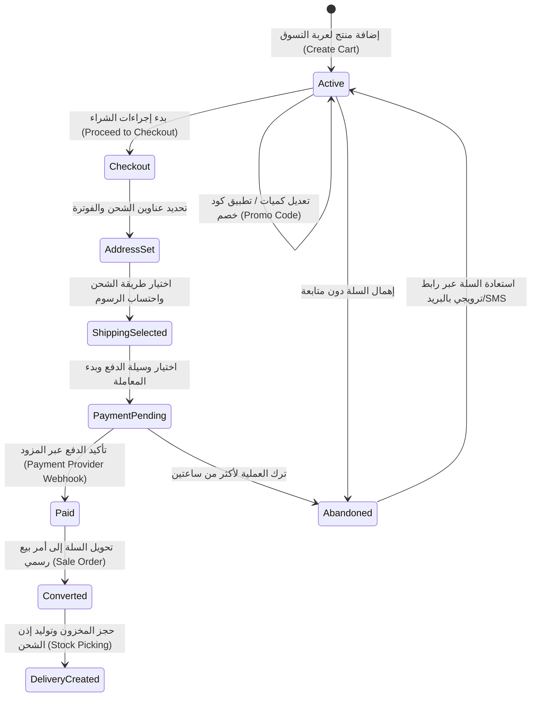
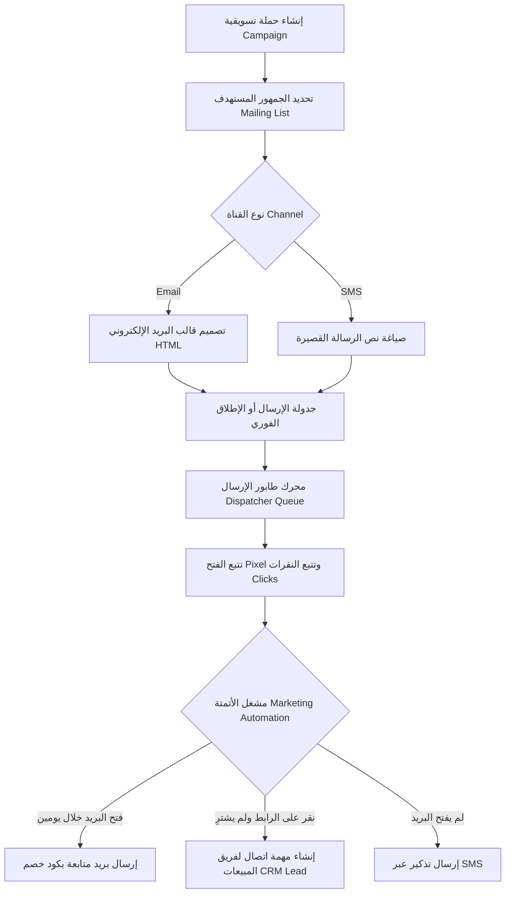
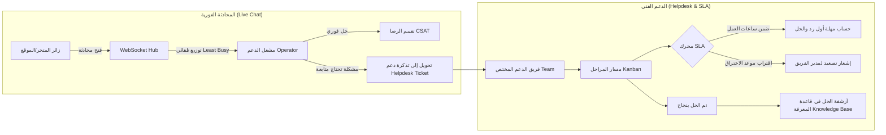
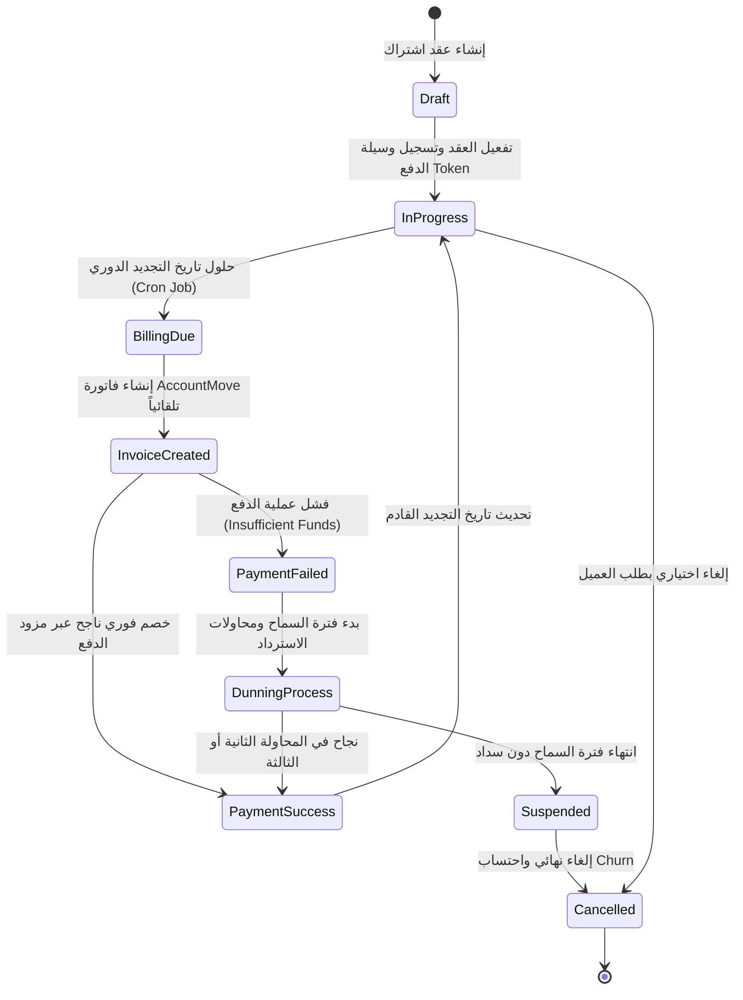
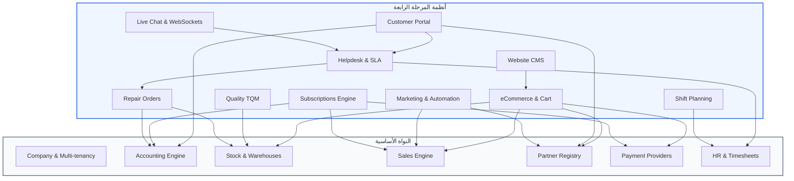

# خطة تنفيذية شاملة — المرحلة الرابعة: المنظومة الرقمية والتسويقية وخدمة العملاء والعمليات التخصصية

## الملخص التنفيذي

المرحلة الرابعة تمثل **قمة النضج التكاملي والتحول الرقمي الشامل** لمشروع Cashflow Backend. بعد أن أرست المرحلة الأولى قواعد التكامل والصلابة المحاسبية (Glue Services & Accounting Guardrails)، وأكملت المرحلة الثانية عمق سلاسل الإمداد والتصنيع والفوترة الإلكترونية (MRP, Advanced Stock, Payment Providers & ZATCA EDI)، وبنت المرحلة الثالثة محاور العمليات الميدانية والتحليلية (POS, Calendar, Advanced HR & BI/Analytics)، تأتي **المرحلة الرابعة** لتنقل النظام من نطاق ERP الإداري والتشغيلي الداخلي إلى **منظومة رقمية وتجارية مفتوحة ومتصلة بالعملاء والأسواق العالمية**، متكافئة وظيفياً مع Odoo 19.0 ومتفوقة عليه في سرعة الاستجابة وكفاءة استخدام الموارد ومعمارية Go Clean Architecture النظيفة:

1. 🌐 **الموقع والتجارة الإلكترونية وبوابة العملاء (Website, eCommerce & Customer Portal)** — نظام متكامل لإدارة المحتوى الرقمي متعدد المواقع (Headless CMS)، متجر إلكتروني مع كتالوج متقدم للمنتجات والسمات، عربة تسوق مرنة مع استعادة السلات المتروكة، ودورة شراء ودفع متصلة لحظياً بالمخزون والمحاسبة والولاء، بالإضافة إلى بوابة خدمة ذاتية شاملة للعملاء (Customer Portal).
2. 📢 **التسويق الآلي وحملات البريد والرسائل (Marketing Automation, Mass Mailing & SMS)** — منظومة تسويق موجهة تعتمد على القوائم الذكية وإدارة الموافقات والقوائم السوداء، محرك إرسال مجمع للبريد الإلكتروني والرسائل القصيرة مع تتبع معدلات الفتح والنقر (Open/Click Tracking) وروابط إلغاء الاشتراك الموقعة، ومحرك أتمتة تسويقية تفاعلي (Drip Campaigns & Automated Workflows) مبني على أحداث وسلوك العملاء.
3. 💬 **المحادثة الحية والدعم الفني وإدارة SLA (Live Chat, Helpdesk & SLA Management)** — ويدجت محادثة فورية للزوار والعملاء مع توجيه ذكي للمشغلين عبر WebSockets، نظام تذاكر دعم فني أومني-تشانل (Omni-channel Tickets)، محرك اتفاقيات مستوى الخدمة (SLA Engine) المتوافق مع تقويم وساعات العمل الرسمية، وقاعدة معرفة متكاملة (Knowledge Base) لتقليل التذاكر وتسريع الحلول.
4. 🔄 **العمليات التشغيلية التخصصية: الاشتراكات، الجودة، الاستبيانات، الإصلاحات والتخطيط (Subscriptions, Quality, Surveys, Repair & Planning)** — عقود الاشتراكات والفوترة الدورية التلقائية (Recurring Billing & Dunning)، إدارة الجودة الشاملة (TQM) ونقاط التفتيش عبر سلاسل التوريد والإنتاج، محرك الاستبيانات وبحوث الرضا (NPS/CSAT)، أوامر الإصلاح وخدمة ما بعد البيع (Repair & RMA)، وتخطيط الورديات والجدولة التكيفية للمناوبات (Shift Planning).

> [!IMPORTANT]
> صُممت هذه الخطة بالاعتماد على دراسة مطابقة تفصيلية لـ Odoo 19.0 Enterprise/Community مع الحفاظ الصارم على معايير المشروع: Clean Architecture، المعاملات الذرية (ACID Transactions)، العزل التام للشركات (Multi-Tenancy Isolation)، ونمط الـ Domain Events الموجه بالأحداث.

---

## تحليل الوضع الحالي والمقارنة الوظيفية مع Odoo 19.0

| النظام | Odoo 19.0 Modules | الوضع الحالي في Cashflow Backend | الكيانات المنفذة حالياً | الفجوات والمطلوب تنفيذه في المرحلة الرابعة |
| :--- | :--- | :--- | :--- | :--- |
| **الموقع والتجارة الإلكترونية** | `website`, `website_sale`, `portal` | 0 ملفات (غير موجود بالكامل) | لا يوجد (فقط حقل `website` نصي في الشريك) | CMS كامل، صفحات، قوالب، كتالوج إلكتروني، عربة تسوق، بوابة عميل للخدمة الذاتية، تكامل فوري مع المبيعات والمخزون والدفع. |
| **التسويق الآلي والبريد** | `mass_mailing`, `mass_mailing_sms`, `marketing_automation` | جزئي جداً في `activity` (طابور رسائل فقط) | `mail_messages`, `mail_email_queue` | قوائم بريدية، جهات اتصال تسويقية، بلاك ليست، قوالب حملات، تتبع البكسل والنقرات، سلاسل الأتمتة التفاعلية (Triggers & Drips). |
| **المحادثة والدعم الفني** | `im_livechat`, `helpdesk`, `helpdesk_mgmt` | 0 ملفات (غير موجود بالكامل) | لا يوجد | قنوات شات فورية عبر WebSockets، تذاكر دعم، تصنيف ومراحل، محرك SLA مع جداول العمل، قاعدة معرفة، وتكامل مع الضمان والمبيعات. |
| **الاشتراكات والفوترة الدورية** | `sale_subscription`, `account_payment` | 0 ملفات (فواتير يدوية فقط) | `account_move`, `sale_order` | خطط اشتراك، فترات تجديد، كرون فوترة دورية، إعادة المحاولة الآلية (Dunning)، واحتساب مؤشرات MRR/ARR ومعدل الإلغاء (Churn). |
| **إدارة الجودة الشاملة** | `quality`, `quality_control` | بذرة بسيطة في MRP المرحلة الثانية | نقاط فحص مرتبطة بأمر عمل فقط | نقاط فحص جودة عامة عند الاستلام والشحن والإنتاج، تنبيهات الجودة، عدم المطابقة (NC)، وإجراءات التصحيح الوقائية (CAPA). |
| **الاستبيانات وبحوث الرضا** | `survey` | 0 ملفات (غير موجود بالكامل) | لا يوجد | استبيانات متعددة الأسئلة والأنواع، روابط عامة وخاصة، احتساب درجات وشهادات، وقياس مؤشرات CSAT/NPS بعد الفواتير والتذاكر. |
| **أوامر الإصلاح وما بعد البيع** | `repair` | الصيانة الداخلية فقط `maintenance` | صيانة أصول ومعدات الشركة فقط | استقبال أجهزة العملاء، فحص الضمان، سحب قطع الغيار من المخزون، تسجيل تكلفة الفني، وإصدار فواتير التصليح. |
| **تخطيط الورديات والمناوبات** | `planning` | الحضور فقط `hr_attendance` | سجل تسجيل دخول/خروج الموظف | جدولة الورديات، الورديات المفتوحة (Open Shifts)، تفادي التعارضات مع الإجازات، النشر والإشعار التلقائي للموظفين. |

---

## المحور الأول: 🌐 الموقع والتجارة الإلكترونية وبوابة العملاء (Website, eCommerce & Portal)

### 1.1 بنية النظام والمفهوم المعماري

يتبع نظام الموقع والتجارة الإلكترونية معمارية **Headless Commerce & CMS** تُمكّن النظام من تغذية واجهات الويب العامة وتطبيقات الهواتف الذكية (Flutter/React) عبر واجهات برمجية سريعة ومحمية، مع ربط محكم بدورة المبيعات والمخزون والمحاسبة:

```
internal/domain/
├── website/
│   ├── site.go             [NEW] — إعدادات الموقع والنطاقات واللغات والسمات
│   ├── page.go             [NEW] — الصفحات الديناميكية وبيانات SEO والميتا
│   ├── menu.go             [NEW] — شجرة القوائم وروابط التنقل
│   ├── snippet.go          [NEW] — كتل المحتوى المضمنة (Content Blocks)
│   ├── errors.go           [NEW] — أخطاء نطاق الموقع وإدارة المحتوى
│   └── ports.go            [NEW] — واجهات التخزين لمحرك الموقع
├── ecommerce/
│   ├── catalog.go          [NEW] — كتالوج المنتجات الرقمي والفئات العامة
│   ├── product_web.go      [NEW] — سمات العرض للمنتج، الصور، والمواصفات
│   ├── cart.go             [NEW] — عربة التسوق والجلسات وإدارة البنود
│   ├── checkout.go         [NEW] — محرك دورة إنهاء الطلب واختيار الشحن
│   ├── abandoned_cart.go   [NEW] — كشف واستعادة السلات المتروكة
│   ├── errors.go           [NEW] — أخطاء نطاق التجارة الإلكترونية
│   └── ports.go            [NEW] — واجهات التخزين ومحرك المتجر
└── portal/
    ├── user.go             [NEW] — مستخدم البوابة وربطه بجهات الاتصال (Partner)
    ├── access.go           [NEW] — قواعد وتصاريح البوابة ومشاركة المستندات
    ├── dashboard.go        [NEW] — لوحة تحكم ومؤشرات العميل في البوابة
    ├── errors.go           [NEW] — أخطاء بوابة الخدمة الذاتية
    └── ports.go            [NEW] — واجهات تخزين بوابة العملاء
```

---

### 1.2 دورة حياة عربة التسوق والشراء الإلكتروني (eCommerce Checkout Flow)



---

### 1.3 الكيانات الأساسية (Domain Entities)

```go
package website

import (
 "time"
)

// WebsiteSite يمثل موقعاً إلكترونياً مستقلاً (يدعم Multi-Website لكل شركة)
type WebsiteSite struct {
 ID                int64     `json:"id"`
 Name              string    `json:"name"`               // e.g. "Main B2C Store", "B2B Wholesale Portal"
 Domain            string    `json:"domain"`             // e.g. "store.cashflow.com"
 CompanyID         int64     `json:"company_id"`
 DefaultLanguage   string    `json:"default_language"`   // "ar", "en"
 SupportedLangs    []string  `json:"supported_langs"`
 PricelistID       int64     `json:"pricelist_id"`       // قائمة الأسعار الافتراضية
 WarehouseID       int64     `json:"warehouse_id"`       // المخزن المخصص للتسليم
 HeaderLogoURL     string    `json:"header_logo_url,omitempty"`
 FaviconURL        string    `json:"favicon_url,omitempty"`
 GoogleAnalyticsID string    `json:"google_analytics_id,omitempty"`
 ThemeConfig       string    `json:"theme_config,omitempty"` // JSON string للألوان والخطوط
 Active            bool      `json:"active"`
 CreatedAt         time.Time `json:"created_at"`
 UpdatedAt         time.Time `json:"updated_at"`
}

// WebsitePage صفحة محتوى أو هبوط
type WebsitePage struct {
 ID              int64     `json:"id"`
 WebsiteID       int64     `json:"website_id"`
 Title           string    `json:"title"`
 Slug            string    `json:"slug"`                // e.g. "/about-us", "/terms"
 ContentJSON     string    `json:"content_json"`        // هيكل الصفحة والـ Blocks
 MetaTitle       string    `json:"meta_title,omitempty"`
 MetaDescription string    `json:"meta_description,omitempty"`
 MetaKeywords    string    `json:"meta_keywords,omitempty"`
 IsPublished     bool      `json:"is_published"`
 IsHomepage      bool      `json:"is_homepage"`
 CreatedAt       time.Time `json:"created_at"`
 UpdatedAt       time.Time `json:"updated_at"`
}

// WebsiteMenu عنصر من عناصر القوائم وشجرة التنقل
type WebsiteMenu struct {
 ID        int64          `json:"id"`
 WebsiteID int64          `json:"website_id"`
 ParentID  *int64         `json:"parent_id,omitempty"`
 Name      string         `json:"name"`
 URL       string         `json:"url"`
 Sequence  int            `json:"sequence"`
 NewWindow bool           `json:"new_window"`
 Children  []*WebsiteMenu `json:"children,omitempty"`
}
```

```go
package ecommerce

import (
 "time"
)

type CartState string

const (
 CartStateActive    CartState = "active"
 CartStateCheckout  CartState = "checkout"
 CartStateConverted CartState = "converted"
 CartStateAbandoned CartState = "abandoned"
)

// EcommerceCart عربة التسوق الرقمية
type EcommerceCart struct {
 ID                int64          `json:"id"`
 WebsiteID         int64          `json:"website_id"`
 SessionUUID       string         `json:"session_uuid"`        // تتبع الزائر قبل تسجيل الدخول
 PartnerID         *int64         `json:"partner_id,omitempty"` // العميل عند التسجيل
 PricelistID       int64          `json:"pricelist_id"`
 Currency          string         `json:"currency"`
 State             CartState      `json:"state"`
 Lines             []CartLine     `json:"lines"`
 ShippingAddressID *int64         `json:"shipping_address_id,omitempty"`
 InvoiceAddressID  *int64         `json:"invoice_address_id,omitempty"`
 DeliveryMethodID  *int64         `json:"delivery_method_id,omitempty"`
 ShippingAmount    float64        `json:"shipping_amount"`
 CouponCode        string         `json:"coupon_code,omitempty"`
 DiscountAmount    float64        `json:"discount_amount"`
 AmountUntaxed     float64        `json:"amount_untaxed"`
 AmountTax         float64        `json:"amount_tax"`
 AmountTotal       float64        `json:"amount_total"`
 ConvertedOrderID  *int64         `json:"converted_order_id,omitempty"` // SaleOrderID
 LastActivityAt    time.Time      `json:"last_activity_at"`
 CreatedAt         time.Time      `json:"created_at"`
 UpdatedAt         time.Time      `json:"updated_at"`
}

// CartLine بند في سلة التسوق
type CartLine struct {
 ID          int64     `json:"id"`
 CartID      int64     `json:"cart_id"`
 ProductID   int64     `json:"product_id"`
 Quantity    float64   `json:"quantity"`
 PriceUnit   float64   `json:"price_unit"`
 Discount    float64   `json:"discount"`
 PriceTotal  float64   `json:"price_total"`
 TaxIDs      []int64   `json:"tax_ids"`
 Notes       string    `json:"notes,omitempty"`
 CreatedAt   time.Time `json:"created_at"`
 UpdatedAt   time.Time `json:"updated_at"`
}
```

```go
package portal

import (
 "time"
)

// PortalUser مستخدم بوابة الخدمة الذاتية المرتبط بشريك تجاري
type PortalUser struct {
 ID             int64     `json:"id"`
 PartnerID      int64     `json:"partner_id"`
 Email          string    `json:"email"`
 PasswordHash   string    `json:"-"`
 IsActive       bool      `json:"is_active"`
 LastLoginAt    *time.Time `json:"last_login_at,omitempty"`
 CompanyID      int64     `json:"company_id"`
 InviteToken    string    `json:"-"`
 InviteAccepted bool      `json:"invite_accepted"`
 CreatedAt      time.Time `json:"created_at"`
 UpdatedAt      time.Time `json:"updated_at"`
}

// PortalDashboardSummary ملخص بيانات العميل في البوابة
type PortalDashboardSummary struct {
 PartnerID            int64   `json:"partner_id"`
 OpenQuotationsCount  int     `json:"open_quotations_count"`
 ConfirmedOrdersCount int     `json:"confirmed_orders_count"`
 PendingInvoicesCount int     `json:"pending_invoices_count"`
 TotalOutstandingDue  float64 `json:"total_outstanding_due"`
 ActiveTicketsCount   int     `json:"active_tickets_count"`
 LoyaltyPointsBalance float64 `json:"loyalty_points_balance"`
 ActiveSubscriptions  int     `json:"active_subscriptions"`
}
```

---

### 1.4 محرك تكامل التجارة الإلكترونية (eCommerce Glue Engine)

عند نجاح عملية الدفع في المتجر، يقوم `EcommerceGlueService` بتنفيذ الإجراءات التالية في معاملة ذرية متناسقة:

```go
package ecommerce

import (
 "context"
 "cashflow_backend/internal/domain/sale"
 "cashflow_backend/internal/domain/stock"
 "cashflow_backend/internal/domain/accounting"
)

type EcommerceGlueService interface {
 // ConvertCartToSaleOrder يحول عربة التسوق إلى أمر بيع مؤكد رسمي
 ConvertCartToSaleOrder(ctx context.Context, cartID int64, paymentTxID int64) (*sale.SaleOrder, error)

 // CreateDeliveryOrder يولد حركة المخزون لحجز المواد وتجهيز الشحن
 CreateDeliveryOrder(ctx context.Context, order *sale.SaleOrder, warehouseID int64) (*stock.StockPicking, error)

 // GenerateInvoiceIfRequired يولد فاتورة إلكترونية معتمدة ويربطها بالطلب
 GenerateInvoiceIfRequired(ctx context.Context, order *sale.SaleOrder) (*accounting.AccountMove, error)

 // RecoverAbandonedCarts يبحث عن السلات المتروكة ويطلق إشعارات الأتمتة التسويقية
 RecoverAbandonedCarts(ctx context.Context, inactivityDurationHours int) ([]*EcommerceCart, error)
}
```

---

### 1.5 جداول قاعدة البيانات (PostgreSQL DDL)

```sql
-- migrations/000065_website_ecommerce_schema.up.sql

CREATE TABLE website_sites (
    id                  BIGSERIAL PRIMARY KEY,
    name                VARCHAR(128) NOT NULL,
    domain              VARCHAR(256) NOT NULL UNIQUE,
    company_id          BIGINT NOT NULL REFERENCES companies(id),
    default_language    VARCHAR(10) NOT NULL DEFAULT 'ar',
    supported_langs     TEXT[] NOT NULL DEFAULT ARRAY['ar', 'en'],
    pricelist_id        BIGINT NOT NULL REFERENCES product_pricelists(id),
    warehouse_id        BIGINT NOT NULL REFERENCES warehouses(id),
    header_logo_url     TEXT,
    favicon_url         TEXT,
    google_analytics_id VARCHAR(64),
    theme_config        JSONB NOT NULL DEFAULT '{}',
    active              BOOLEAN NOT NULL DEFAULT TRUE,
    created_at          TIMESTAMPTZ NOT NULL DEFAULT NOW(),
    updated_at          TIMESTAMPTZ NOT NULL DEFAULT NOW()
);

CREATE TABLE website_pages (
    id               BIGSERIAL PRIMARY KEY,
    website_id       BIGINT NOT NULL REFERENCES website_sites(id) ON DELETE CASCADE,
    title            VARCHAR(256) NOT NULL,
    slug             VARCHAR(256) NOT NULL,
    content_json     JSONB NOT NULL DEFAULT '{}',
    meta_title       VARCHAR(256),
    meta_description TEXT,
    meta_keywords    VARCHAR(256),
    is_published     BOOLEAN NOT NULL DEFAULT FALSE,
    is_homepage      BOOLEAN NOT NULL DEFAULT FALSE,
    created_at       TIMESTAMPTZ NOT NULL DEFAULT NOW(),
    updated_at       TIMESTAMPTZ NOT NULL DEFAULT NOW(),
    UNIQUE(website_id, slug)
);

CREATE TABLE website_menus (
    id         BIGSERIAL PRIMARY KEY,
    website_id BIGINT NOT NULL REFERENCES website_sites(id) ON DELETE CASCADE,
    parent_id  BIGINT REFERENCES website_menus(id) ON DELETE CASCADE,
    name       VARCHAR(128) NOT NULL,
    url        VARCHAR(512) NOT NULL,
    sequence   INT NOT NULL DEFAULT 10,
    new_window BOOLEAN NOT NULL DEFAULT FALSE
);

CREATE TABLE ecommerce_carts (
    id                  BIGSERIAL PRIMARY KEY,
    website_id          BIGINT NOT NULL REFERENCES website_sites(id),
    session_uuid        VARCHAR(64) NOT NULL,
    partner_id          BIGINT REFERENCES partners(id),
    pricelist_id        BIGINT NOT NULL REFERENCES product_pricelists(id),
    currency            VARCHAR(3) NOT NULL DEFAULT 'SAR',
    state               VARCHAR(32) NOT NULL DEFAULT 'active',
    shipping_address_id BIGINT REFERENCES partners(id),
    invoice_address_id  BIGINT REFERENCES partners(id),
    delivery_method_id  BIGINT REFERENCES delivery_carriers(id),
    shipping_amount     NUMERIC(15,4) NOT NULL DEFAULT 0,
    coupon_code         VARCHAR(64),
    discount_amount     NUMERIC(15,4) NOT NULL DEFAULT 0,
    amount_untaxed      NUMERIC(15,4) NOT NULL DEFAULT 0,
    amount_tax          NUMERIC(15,4) NOT NULL DEFAULT 0,
    amount_total        NUMERIC(15,4) NOT NULL DEFAULT 0,
    converted_order_id  BIGINT REFERENCES sale_orders(id),
    last_activity_at    TIMESTAMPTZ NOT NULL DEFAULT NOW(),
    created_at          TIMESTAMPTZ NOT NULL DEFAULT NOW(),
    updated_at          TIMESTAMPTZ NOT NULL DEFAULT NOW()
);
CREATE INDEX idx_ecommerce_carts_session ON ecommerce_carts(session_uuid);
CREATE INDEX idx_ecommerce_carts_state_activity ON ecommerce_carts(state, last_activity_at);

CREATE TABLE ecommerce_cart_lines (
    id          BIGSERIAL PRIMARY KEY,
    cart_id     BIGINT NOT NULL REFERENCES ecommerce_carts(id) ON DELETE CASCADE,
    product_id  BIGINT NOT NULL REFERENCES products(id),
    quantity    NUMERIC(15,4) NOT NULL DEFAULT 1,
    price_unit  NUMERIC(15,4) NOT NULL DEFAULT 0,
    discount    NUMERIC(5,2) NOT NULL DEFAULT 0,
    price_total NUMERIC(15,4) NOT NULL DEFAULT 0,
    tax_ids     BIGINT[] DEFAULT ARRAY[]::BIGINT[],
    notes       TEXT,
    created_at  TIMESTAMPTZ NOT NULL DEFAULT NOW(),
    updated_at  TIMESTAMPTZ NOT NULL DEFAULT NOW()
);

CREATE TABLE portal_users (
    id              BIGSERIAL PRIMARY KEY,
    partner_id      BIGINT NOT NULL REFERENCES partners(id) ON DELETE CASCADE,
    email           VARCHAR(128) NOT NULL UNIQUE,
    password_hash   VARCHAR(256) NOT NULL,
    is_active       BOOLEAN NOT NULL DEFAULT TRUE,
    last_login_at   TIMESTAMPTZ,
    company_id      BIGINT NOT NULL REFERENCES companies(id),
    invite_token    VARCHAR(128) UNIQUE,
    invite_accepted BOOLEAN NOT NULL DEFAULT FALSE,
    created_at      TIMESTAMPTZ NOT NULL DEFAULT NOW(),
    updated_at      TIMESTAMPTZ NOT NULL DEFAULT NOW()
);
```

---

### 1.6 مسارات واجهة التطبيق البرمجية (HTTP Endpoints)

```go
// Storefront Public APIs
GET    /api/v1/public/website/sites/{id}
GET    /api/v1/public/website/pages/{slug}
GET    /api/v1/public/website/menus
GET    /api/v1/public/ecommerce/catalog/categories
GET    /api/v1/public/ecommerce/catalog/products
GET    /api/v1/public/ecommerce/catalog/products/{id}

// Cart & Checkout APIs
POST   /api/v1/public/ecommerce/cart/item               // إضافة منتج للسلة
PUT    /api/v1/public/ecommerce/cart/item/{line_id}     // تعديل الكمية
DELETE /api/v1/public/ecommerce/cart/item/{line_id}     // حذف بند
GET    /api/v1/public/ecommerce/cart                    // جلب السلة النشطة
POST   /api/v1/public/ecommerce/cart/apply-coupon       // تطبيق كود خصم
POST   /api/v1/public/ecommerce/checkout/addresses      // تعيين عناوين الشحن والفوترة
POST   /api/v1/public/ecommerce/checkout/shipping       // اختيار شركة الشحن
POST   /api/v1/public/ecommerce/checkout/pay            // بدء الدفع وإنشاء أمر البيع

// Customer Portal APIs
POST   /api/v1/portal/auth/login
POST   /api/v1/portal/auth/register-invite
GET    /api/v1/portal/dashboard/summary                 // ملخص فواتير وطلبات ونقاط العميل
GET    /api/v1/portal/orders                            // قائمة أوامر الشراء
GET    /api/v1/portal/orders/{id}
GET    /api/v1/portal/invoices                          // قائمة الفواتير وحالاتها
GET    /api/v1/portal/invoices/{id}/pdf                 // تنزيل الفاتورة الضريبية
GET    /api/v1/portal/deliveries                        // تتبع الشحنات وأرقام البوالص
```

---

## المحور الثاني: 📢 التسويق الآلي وحملات البريد والرسائل (Marketing Automation, Mass Mailing & SMS)

### 2.1 بنية النظام والمفهوم المعماري

منظومة التسويق المتقدمة تمكن الشركة من إدارة حملات ترويجية عالية الاستهداف عبر قنوات البريد الإلكتروني والرسائل النصية SMS، مع حوكمة كاملة لموافقة العملاء (Opt-in/Opt-out) وتتبع تفاعلهم التلقائي لبناء سلاسل أتمتة تسويقية ذكية (Drip Campaigns):

```
internal/domain/marketing/
├── campaign.go         [NEW] — الحملات الشاملة، معاملات UTM والأهداف
├── mailing_list.go     [NEW] — القوائم البريدية والمجموعات المستهدفة
├── contact.go          [NEW] — جهات الاتصال التسويقية وحالات الاشتراك
├── blacklist.go        [NEW] — إدارة القوائم السوداء وتفادي الحظر
├── mass_mailing.go     [NEW] — حملات البريد الإلكتروني والقوالب
├── mass_sms.go         [NEW] — حملات الرسائل النصية ومزودو الخدمة
├── tracking.go         [NEW] — تتبع الفتح بالبكسل، الروابط، ونسب الارتداد
├── automation.go       [NEW] — محرك الأتمتة وسلاسل التدفق (Drip Automation)
├── activity.go         [NEW] — أنشطة الأتمتة، الشروط، وفترات الانتظار
├── errors.go           [NEW] — أخطاء نطاق التسويق والأتمتة
└── ports.go            [NEW] — واجهات التخزين ومرسلات البريد والرسائل
```

---

### 2.2 دورة حياة الحملة والأتمتة التسويقية (Campaign & Automation Lifecycle)



---

### 2.3 الكيانات الأساسية (Domain Entities)

```go
package marketing

import (
 "time"
)

type CampaignState string

const (
 CampaignStateDraft     CampaignState = "draft"
 CampaignStateScheduled CampaignState = "scheduled"
 CampaignStateSending   CampaignState = "sending"
 CampaignStateSent      CampaignState = "sent"
 CampaignStateCancelled CampaignState = "cancelled"
)

// MarketingCampaign حملة تسويقية جامعة
type MarketingCampaign struct {
 ID             int64         `json:"id"`
 Name           string        `json:"name"`               // e.g. "حملة اليوم الوطني 2026"
 UserID         int64         `json:"user_id"`            // المسؤول
 UtmSource      string        `json:"utm_source"`         // e.g. "newsletter", "sms_blast"
 UtmMedium      string        `json:"utm_medium"`         // e.g. "email", "sms"
 UtmCampaign    string        `json:"utm_campaign"`       // e.g. "national_day_sale"
 TotalSent      int           `json:"total_sent"`
 TotalDelivered int           `json:"total_delivered"`
 TotalOpened    int           `json:"total_opened"`
 TotalClicked   int           `json:"total_clicked"`
 TotalBounced   int           `json:"total_bounced"`
 TotalRevenue   float64       `json:"total_revenue"`      // إجمالي المبيعات المحققة من الحملة
 State          CampaignState `json:"state"`
 CompanyID      int64         `json:"company_id"`
 CreatedAt      time.Time     `json:"created_at"`
 UpdatedAt      time.Time     `json:"updated_at"`
}

// MailingList قائمة بريدية مستهدفة
type MailingList struct {
 ID           int64     `json:"id"`
 Name         string    `json:"name"`          // "العملاء المميزون VIP", "المشتركون الجدد"
 IsPublic     bool      `json:"is_public"`     // إمكانية الاشتراك الذاتي من الموقع
 ContactCount int       `json:"contact_count"` // محسوب
 CompanyID    int64     `json:"company_id"`
 CreatedAt    time.Time `json:"created_at"`
}

// MailingContact جهة اتصال في القوائم التسويقية
type MailingContact struct {
 ID           int64     `json:"id"`
 PartnerID    *int64    `json:"partner_id,omitempty"` // مرتبط بشريك إن وجد
 Email        string    `json:"email"`
 Mobile       string    `json:"mobile,omitempty"`
 Name         string    `json:"name"`
 IsOptOut     bool      `json:"is_opt_out"`           // قام بإلغاء الاشتراك
 IsBlacklist  bool      `json:"is_blacklist"`         // محظور بسبب ارتداد دائم أو شكوى سبام
 CompanyID    int64     `json:"company_id"`
 CreatedAt    time.Time `json:"created_at"`
 UpdatedAt    time.Time `json:"updated_at"`
}

// MassMailing رسالة بريد جماعي
type MassMailing struct {
 ID             int64         `json:"id"`
 CampaignID     *int64        `json:"campaign_id,omitempty"`
 Subject        string        `json:"subject"`
 SenderName     string        `json:"sender_name"`
 SenderEmail    string        `json:"sender_email"`
 ReplyTo        string        `json:"reply_to,omitempty"`
 BodyHTML       string        `json:"body_html"`
 MailingListIDs []int64       `json:"mailing_list_ids"`
 ScheduledDate  *time.Time    `json:"scheduled_date,omitempty"`
 SentDate       *time.Time    `json:"sent_date,omitempty"`
 State          CampaignState `json:"state"`
 CompanyID      int64         `json:"company_id"`
 CreatedAt      time.Time     `json:"created_at"`
 UpdatedAt      time.Time     `json:"updated_at"`
}

// MailingTrace سجل تتبع إرسال رسالة لفرد محدد
type MailingTrace struct {
 ID           int64      `json:"id"`
 MailingID    int64      `json:"mailing_id"`
 ContactID    int64      `json:"contact_id"`
 Email        string     `json:"email"`
 SentAt       time.Time  `json:"sent_at"`
 DeliveredAt  *time.Time `json:"delivered_at,omitempty"`
 OpenedAt     *time.Time `json:"opened_at,omitempty"`
 ClickedAt    *time.Time `json:"clicked_at,omitempty"`
 BouncedAt    *time.Time `json:"bounced_at,omitempty"`
 BounceReason string     `json:"bounce_reason,omitempty"`
 TrackingCode string     `json:"tracking_code"` // كود بكسل التتبع الفريد
}
```

```go
// محرك الأتمتة التسويقية (Marketing Automation Engine)
type AutomationTriggerType string

const (
 TriggerOnLeadCreated     AutomationTriggerType = "lead_created"
 TriggerOnOrderCompleted   AutomationTriggerType = "order_completed"
 TriggerOnCartAbandoned    AutomationTriggerType = "cart_abandoned"
 TriggerOnTagAdded        AutomationTriggerType = "tag_added"
)

type MarketingAutomation struct {
 ID          int64                 `json:"id"`
 Name        string                `json:"name"`         // "استعادة السلات المتروكة"
 TriggerType AutomationTriggerType `json:"trigger_type"`
 TargetModel string                `json:"target_model"` // "ecommerce.cart", "crm.lead"
 FilterJSON  string                `json:"filter_json"`  // شروط الانطباق
 Active      bool                  `json:"active"`
 Activities  []AutomationActivity  `json:"activities"`
 CompanyID   int64                 `json:"company_id"`
 CreatedAt   time.Time             `json:"created_at"`
}

type AutomationActivity struct {
 ID             int64   `json:"id"`
 AutomationID   int64   `json:"automation_id"`
 ParentID       *int64  `json:"parent_id,omitempty"` // نشاط سابق في السلسلة
 ActionType     string  `json:"action_type"`         // "send_email", "send_sms", "create_activity", "set_tag"
 DelayHours     int     `json:"delay_hours"`         // انتظر N ساعة بعد الحدث السابق
 ConditionType  string  `json:"condition_type"`      // "none", "if_opened", "if_clicked", "if_not_opened"
 TemplateID     *int64  `json:"template_id,omitempty"`
}
```

---

### 2.4 جداول قاعدة البيانات (PostgreSQL DDL)

```sql
-- migrations/000066_marketing_automation_schema.up.sql

CREATE TABLE marketing_campaigns (
    id              BIGSERIAL PRIMARY KEY,
    name            VARCHAR(128) NOT NULL,
    user_id         BIGINT NOT NULL REFERENCES users(id),
    utm_source      VARCHAR(64) NOT NULL DEFAULT 'marketing',
    utm_medium      VARCHAR(64) NOT NULL DEFAULT 'email',
    utm_campaign    VARCHAR(128) NOT NULL,
    total_sent      INT NOT NULL DEFAULT 0,
    total_delivered INT NOT NULL DEFAULT 0,
    total_opened    INT NOT NULL DEFAULT 0,
    total_clicked   INT NOT NULL DEFAULT 0,
    total_bounced   INT NOT NULL DEFAULT 0,
    total_revenue   NUMERIC(15,4) NOT NULL DEFAULT 0,
    state           VARCHAR(32) NOT NULL DEFAULT 'draft',
    company_id      BIGINT NOT NULL REFERENCES companies(id),
    created_at      TIMESTAMPTZ NOT NULL DEFAULT NOW(),
    updated_at      TIMESTAMPTZ NOT NULL DEFAULT NOW()
);

CREATE TABLE mailing_lists (
    id          BIGSERIAL PRIMARY KEY,
    name        VARCHAR(128) NOT NULL,
    is_public   BOOLEAN NOT NULL DEFAULT FALSE,
    company_id  BIGINT NOT NULL REFERENCES companies(id),
    created_at  TIMESTAMPTZ NOT NULL DEFAULT NOW()
);

CREATE TABLE mailing_contacts (
    id           BIGSERIAL PRIMARY KEY,
    partner_id   BIGINT REFERENCES partners(id),
    email        VARCHAR(128) NOT NULL,
    mobile       VARCHAR(32),
    name         VARCHAR(128) NOT NULL,
    is_opt_out   BOOLEAN NOT NULL DEFAULT FALSE,
    is_blacklist BOOLEAN NOT NULL DEFAULT FALSE,
    company_id   BIGINT NOT NULL REFERENCES companies(id),
    created_at   TIMESTAMPTZ NOT NULL DEFAULT NOW(),
    updated_at   TIMESTAMPTZ NOT NULL DEFAULT NOW(),
    UNIQUE(email, company_id)
);

CREATE TABLE mailing_list_contact_rel (
    list_id    BIGINT NOT NULL REFERENCES mailing_lists(id) ON DELETE CASCADE,
    contact_id BIGINT NOT NULL REFERENCES mailing_contacts(id) ON DELETE CASCADE,
    PRIMARY KEY(list_id, contact_id)
);

CREATE TABLE mass_mailings (
    id             BIGSERIAL PRIMARY KEY,
    campaign_id    BIGINT REFERENCES marketing_campaigns(id),
    subject        VARCHAR(256) NOT NULL,
    sender_name    VARCHAR(128) NOT NULL,
    sender_email   VARCHAR(128) NOT NULL,
    reply_to       VARCHAR(128),
    body_html      TEXT NOT NULL,
    scheduled_date TIMESTAMPTZ,
    sent_date      TIMESTAMPTZ,
    state          VARCHAR(32) NOT NULL DEFAULT 'draft',
    company_id     BIGINT NOT NULL REFERENCES companies(id),
    created_at     TIMESTAMPTZ NOT NULL DEFAULT NOW(),
    updated_at     TIMESTAMPTZ NOT NULL DEFAULT NOW()
);

CREATE TABLE mailing_traces (
    id            BIGSERIAL PRIMARY KEY,
    mailing_id    BIGINT NOT NULL REFERENCES mass_mailings(id) ON DELETE CASCADE,
    contact_id    BIGINT NOT NULL REFERENCES mailing_contacts(id),
    email         VARCHAR(128) NOT NULL,
    sent_at       TIMESTAMPTZ NOT NULL DEFAULT NOW(),
    delivered_at  TIMESTAMPTZ,
    opened_at     TIMESTAMPTZ,
    clicked_at    TIMESTAMPTZ,
    bounced_at    TIMESTAMPTZ,
    bounce_reason TEXT,
    tracking_code VARCHAR(64) NOT NULL UNIQUE
);
CREATE INDEX idx_mailing_traces_code ON mailing_traces(tracking_code);

CREATE TABLE marketing_automations (
    id           BIGSERIAL PRIMARY KEY,
    name         VARCHAR(128) NOT NULL,
    trigger_type VARCHAR(64) NOT NULL,
    target_model VARCHAR(64) NOT NULL,
    filter_json  JSONB NOT NULL DEFAULT '{}',
    active       BOOLEAN NOT NULL DEFAULT TRUE,
    company_id   BIGINT NOT NULL REFERENCES companies(id),
    created_at   TIMESTAMPTZ NOT NULL DEFAULT NOW()
);

CREATE TABLE marketing_automation_activities (
    id             BIGSERIAL PRIMARY KEY,
    automation_id  BIGINT NOT NULL REFERENCES marketing_automations(id) ON DELETE CASCADE,
    parent_id      BIGINT REFERENCES marketing_automation_activities(id) ON DELETE SET NULL,
    action_type    VARCHAR(32) NOT NULL,
    delay_hours    INT NOT NULL DEFAULT 0,
    condition_type VARCHAR(32) NOT NULL DEFAULT 'none',
    template_id    BIGINT,
    created_at     TIMESTAMPTZ NOT NULL DEFAULT NOW()
);
```

---

### 2.5 مسارات واجهة التطبيق البرمجية (HTTP Endpoints)

```go
// Campaigns & Mailing Lists
GET    /api/v1/marketing/campaigns
POST   /api/v1/marketing/campaigns
GET    /api/v1/marketing/lists
POST   /api/v1/marketing/lists
POST   /api/v1/marketing/lists/{id}/contacts/import // استيراد جهات اتصال من CSV
GET    /api/v1/marketing/contacts/blacklist
POST   /api/v1/marketing/contacts/blacklist

// Mass Mailings
POST   /api/v1/marketing/mailings                   // إنشاء رسالة بريد جماعي
POST   /api/v1/marketing/mailings/{id}/send-test    // إرسال بريد تجريبي
POST   /api/v1/marketing/mailings/{id}/schedule     // جدولة الإرسال
POST   /api/v1/marketing/mailings/{id}/cancel
GET    /api/v1/marketing/mailings/{id}/stats        // إحصائيات الفتح والنقر والارتداد

// Public Tracking Endpoints
GET    /api/v1/public/marketing/track/open/{code}.gif // بكسل تتبع الفتح (1x1 transparent)
GET    /api/v1/public/marketing/track/click/{code}    // إعادة التوجيه وتتبع النقر
GET    /api/v1/public/marketing/unsubscribe/{token}   // صفحة إلغاء الاشتراك الفورية

// Marketing Automation
GET    /api/v1/marketing/automations
POST   /api/v1/marketing/automations
PUT    /api/v1/marketing/automations/{id}
POST   /api/v1/marketing/automations/{id}/trigger-test
```

---

## المحور الثالث: 💬 المحادثة الحية والدعم الفني وإدارة SLA (Live Chat, Helpdesk & SLA)

### 3.1 بنية النظام والمفهوم المعماري

منظومة متكاملة للتفاعل المباشر مع العملاء وحل المشكلات وتقديم الدعم الفني الراقي:

```
internal/domain/
├── livechat/
│   ├── channel.go          [NEW] — قنوات الدردشة، إعدادات الودجت والمشغلين
│   ├── session.go          [NEW] — جلسات الدردشة مع الزوار وحالاتها
│   ├── message.go          [NEW] — الرسائل الفورية ومرفقات الشات
│   ├── canned_response.go  [NEW] — الردود الجاهزة والاختصارات السريعة (:hello)
│   ├── rating.go           [NEW] — تقييمات الزوار ورضا العملاء (Feedback)
│   ├── errors.go           [NEW] — أخطاء نطاق المحادثة الفورية
│   └── ports.go            [NEW] — واجهات التخزين وموزع WebSockets
└── helpdesk/
    ├── ticket.go           [NEW] — تذاكر الدعم الفني، الأرقام التسلسلية والنوع
    ├── team.go             [NEW] — فرق الدعم، التخصصات، وقواعد التوزيع
    ├── stage.go            [NEW] — مسار مراحل التذكرة (New, Progress, Solved, Cancelled)
    ├── sla_policy.go       [NEW] — سياسات مستوى الخدمة وحساب ساعات العمل
    ├── sla_status.go       [NEW] — حالة التذكرة مقابل الـ SLA وكشف الاختراق
    ├── knowledge.go        [NEW] — مقالات قاعدة المعرفة وتصنيفاتها والبحث
    ├── errors.go           [NEW] — أخطاء نطاق الدعم الفني
    └── ports.go            [NEW] — واجهات التخزين وخدمات الدعم
```

---

### 3.2 معمارية المحادثة الفورية وتوزيع التذاكر (Live Chat Hub & Ticket Pipeline)



---

### 3.3 الكيانات الأساسية (Domain Entities)

```go
package livechat

import (
 "time"
)

type SessionStatus string

const (
 SessionStatusActive SessionStatus = "active"
 SessionStatusClosed SessionStatus = "closed"
)

// LivechatChannel قناة المحادثة التفاعلية
type LivechatChannel struct {
 ID            int64     `json:"id"`
 Name          string    `json:"name"`               // "خدمة عملاء المتجر"
 WelcomeMsg    string    `json:"welcome_msg"`
 ButtonText    string    `json:"button_text"`
 HeaderColor   string    `json:"header_color"`       // e.g. "#1E3A8A"
 OperatorIDs   []int64   `json:"operator_ids"`       // الموظفون المتاحون
 CompanyID     int64     `json:"company_id"`
 Active        bool      `json:"active"`
 CreatedAt     time.Time `json:"created_at"`
}

// LivechatSession جلسة محادثة مباشرة
type LivechatSession struct {
 ID            int64         `json:"id"`
 ChannelID     int64         `json:"channel_id"`
 OperatorID    *int64        `json:"operator_id,omitempty"`
 VisitorUUID   string        `json:"visitor_uuid"`
 VisitorName   string        `json:"visitor_name"`
 VisitorEmail  string        `json:"visitor_email,omitempty"`
 PartnerID     *int64        `json:"partner_id,omitempty"`
 Status        SessionStatus `json:"status"`
 RatingScore   *int          `json:"rating_score,omitempty"` // 1 to 5
 RatingComment string        `json:"rating_comment,omitempty"`
 ConvertedTicketID *int64    `json:"converted_ticket_id,omitempty"`
 CreatedAt     time.Time     `json:"created_at"`
 ClosedAt      *time.Time    `json:"closed_at,omitempty"`
}

// LivechatMessage رسالة شات فورية
type LivechatMessage struct {
 ID        int64     `json:"id"`
 SessionID int64     `json:"session_id"`
 SenderType string   `json:"sender_type"` // "visitor", "operator", "system"
 SenderID  *int64    `json:"sender_id,omitempty"`
 Body      string    `json:"body"`
 FileURL   string    `json:"file_url,omitempty"`
 CreatedAt time.Time `json:"created_at"`
}
```

```go
package helpdesk

import (
 "time"
)

type TicketPriority string

const (
 PriorityLow    TicketPriority = "0"
 PriorityMedium TicketPriority = "1"
 PriorityHigh   TicketPriority = "2"
 PriorityUrgent TicketPriority = "3"
)

// HelpdeskTicket تذكرة الدعم الفني
type HelpdeskTicket struct {
 ID               int64          `json:"id"`
 Number           string         `json:"number"`          // e.g. TICKET/2026/0001
 Name             string         `json:"name"`            // عنوان المشكلة
 Description      string         `json:"description"`
 TeamID           int64          `json:"team_id"`
 StageID          int64          `json:"stage_id"`
 Priority         TicketPriority `json:"priority"`
 PartnerID        *int64         `json:"partner_id,omitempty"`
 PartnerEmail     string         `json:"partner_email"`
 PartnerPhone     string         `json:"partner_phone,omitempty"`
 AssignedUserID   *int64         `json:"assigned_user_id,omitempty"`
 SaleOrderID      *int64         `json:"sale_order_id,omitempty"`
 StockPickingID   *int64         `json:"stock_picking_id,omitempty"`
 RepairOrderID    *int64         `json:"repair_order_id,omitempty"` // إذا تحولت لأمر إصلاح
 FirstResponseAt  *time.Time     `json:"first_response_at,omitempty"`
 ClosedAt         *time.Time     `json:"closed_at,omitempty"`
 SLABreach        bool           `json:"sla_breach"`
 CompanyID        int64          `json:"company_id"`
 CreatedAt        time.Time      `json:"created_at"`
 UpdatedAt        time.Time      `json:"updated_at"`
}

// HelpdeskSLAPolicy سياسة اتفاقية مستوى الخدمة
type HelpdeskSLAPolicy struct {
 ID                 int64          `json:"id"`
 Name               string         `json:"name"`            // e.g. "SLA عملاء الـ VIP - حرج"
 TeamID             int64          `json:"team_id"`
 Priority           TicketPriority `json:"priority"`
 MaxHoursFirstResp  float64        `json:"max_hours_first_resp"` // مهلة الرد الأول بساعات العمل
 MaxHoursResolution float64        `json:"max_hours_resolution"` // مهلة الحل النهائي
 WorkingCalendarID  int64          `json:"working_calendar_id"`  // مرتبط بتقويم ساعات عمل الشركة
 Active             bool           `json:"active"`
 CompanyID          int64          `json:"company_id"`
}

// KnowledgeArticle مقال قاعدة المعرفة
type KnowledgeArticle struct {
 ID          int64     `json:"id"`
 CategoryID  int64     `json:"category_id"`
 Title       string    `json:"title"`
 Slug        string    `json:"slug"`
 ContentHTML string    `json:"content_html"`
 IsInternal  bool      `json:"is_internal"` // هل هو للموظفين فقط أم متاح للعامة
 ViewCount   int       `json:"view_count"`
 HelpfulCount int      `json:"helpful_count"`
 CompanyID   int64     `json:"company_id"`
 CreatedAt   time.Time `json:"created_at"`
 UpdatedAt   time.Time `json:"updated_at"`
}
```

---

### 3.4 جداول قاعدة البيانات (PostgreSQL DDL)

```sql
-- migrations/000067_livechat_helpdesk_schema.up.sql

CREATE TABLE livechat_channels (
    id           BIGSERIAL PRIMARY KEY,
    name         VARCHAR(128) NOT NULL,
    welcome_msg  TEXT NOT NULL DEFAULT 'مرحباً بك! كيف يمكننا مساعدتك اليوم؟',
    button_text  VARCHAR(64) NOT NULL DEFAULT 'تحدث معنا',
    header_color VARCHAR(16) NOT NULL DEFAULT '#1E3A8A',
    company_id   BIGINT NOT NULL REFERENCES companies(id),
    active       BOOLEAN NOT NULL DEFAULT TRUE,
    created_at   TIMESTAMPTZ NOT NULL DEFAULT NOW()
);

CREATE TABLE livechat_channel_users (
    channel_id BIGINT NOT NULL REFERENCES livechat_channels(id) ON DELETE CASCADE,
    user_id    BIGINT NOT NULL REFERENCES users(id) ON DELETE CASCADE,
    PRIMARY KEY(channel_id, user_id)
);

CREATE TABLE livechat_sessions (
    id                   BIGSERIAL PRIMARY KEY,
    channel_id           BIGINT NOT NULL REFERENCES livechat_channels(id),
    operator_id          BIGINT REFERENCES users(id),
    visitor_uuid         VARCHAR(64) NOT NULL,
    visitor_name         VARCHAR(128) NOT NULL DEFAULT 'زائر',
    visitor_email        VARCHAR(128),
    partner_id           BIGINT REFERENCES partners(id),
    status               VARCHAR(32) NOT NULL DEFAULT 'active',
    rating_score         INT CHECK (rating_score BETWEEN 1 AND 5),
    rating_comment       TEXT,
    converted_ticket_id  BIGINT,
    created_at           TIMESTAMPTZ NOT NULL DEFAULT NOW(),
    closed_at            TIMESTAMPTZ
);
CREATE INDEX idx_livechat_sessions_visitor ON livechat_sessions(visitor_uuid);

CREATE TABLE livechat_messages (
    id          BIGSERIAL PRIMARY KEY,
    session_id  BIGINT NOT NULL REFERENCES livechat_sessions(id) ON DELETE CASCADE,
    sender_type VARCHAR(16) NOT NULL, -- visitor, operator, system
    sender_id   BIGINT,
    body        TEXT NOT NULL,
    file_url    TEXT,
    created_at  TIMESTAMPTZ NOT NULL DEFAULT NOW()
);

CREATE TABLE helpdesk_teams (
    id         BIGSERIAL PRIMARY KEY,
    name       VARCHAR(128) NOT NULL,
    email      VARCHAR(128),
    company_id BIGINT NOT NULL REFERENCES companies(id),
    active     BOOLEAN NOT NULL DEFAULT TRUE
);

CREATE TABLE helpdesk_stages (
    id         BIGSERIAL PRIMARY KEY,
    team_id    BIGINT NOT NULL REFERENCES helpdesk_teams(id) ON DELETE CASCADE,
    name       VARCHAR(64) NOT NULL,
    sequence   INT NOT NULL DEFAULT 10,
    is_closed  BOOLEAN NOT NULL DEFAULT FALSE,
    company_id BIGINT NOT NULL REFERENCES companies(id)
);

CREATE TABLE helpdesk_sla_policies (
    id                   BIGSERIAL PRIMARY KEY,
    name                 VARCHAR(128) NOT NULL,
    team_id              BIGINT NOT NULL REFERENCES helpdesk_teams(id) ON DELETE CASCADE,
    priority             VARCHAR(8) NOT NULL DEFAULT '1',
    max_hours_first_resp NUMERIC(6,2) NOT NULL DEFAULT 4.0,
    max_hours_resolution NUMERIC(6,2) NOT NULL DEFAULT 24.0,
    working_calendar_id  BIGINT,
    active               BOOLEAN NOT NULL DEFAULT TRUE,
    company_id           BIGINT NOT NULL REFERENCES companies(id)
);

CREATE TABLE helpdesk_tickets (
    id                 BIGSERIAL PRIMARY KEY,
    number             VARCHAR(64) NOT NULL UNIQUE,
    name               VARCHAR(256) NOT NULL,
    description        TEXT NOT NULL,
    team_id            BIGINT NOT NULL REFERENCES helpdesk_teams(id),
    stage_id           BIGINT NOT NULL REFERENCES helpdesk_stages(id),
    priority           VARCHAR(8) NOT NULL DEFAULT '1',
    partner_id         BIGINT REFERENCES partners(id),
    partner_email      VARCHAR(128) NOT NULL,
    partner_phone      VARCHAR(32),
    assigned_user_id   BIGINT REFERENCES users(id),
    sale_order_id      BIGINT REFERENCES sale_orders(id),
    stock_picking_id   BIGINT REFERENCES stock_pickings(id),
    repair_order_id    BIGINT,
    first_response_at  TIMESTAMPTZ,
    closed_at          TIMESTAMPTZ,
    sla_breach         BOOLEAN NOT NULL DEFAULT FALSE,
    company_id         BIGINT NOT NULL REFERENCES companies(id),
    created_at         TIMESTAMPTZ NOT NULL DEFAULT NOW(),
    updated_at         TIMESTAMPTZ NOT NULL DEFAULT NOW()
);
CREATE INDEX idx_helpdesk_tickets_team ON helpdesk_tickets(team_id);
CREATE INDEX idx_helpdesk_tickets_partner ON helpdesk_tickets(partner_id);

CREATE TABLE knowledge_categories (
    id         BIGSERIAL PRIMARY KEY,
    name       VARCHAR(128) NOT NULL,
    sequence   INT NOT NULL DEFAULT 10,
    company_id BIGINT NOT NULL REFERENCES companies(id)
);

CREATE TABLE knowledge_articles (
    id            BIGSERIAL PRIMARY KEY,
    category_id   BIGINT NOT NULL REFERENCES knowledge_categories(id) ON DELETE CASCADE,
    title         VARCHAR(256) NOT NULL,
    slug          VARCHAR(256) NOT NULL UNIQUE,
    content_html  TEXT NOT NULL,
    is_internal   BOOLEAN NOT NULL DEFAULT FALSE,
    view_count    INT NOT NULL DEFAULT 0,
    helpful_count INT NOT NULL DEFAULT 0,
    company_id    BIGINT NOT NULL REFERENCES companies(id),
    created_at    TIMESTAMPTZ NOT NULL DEFAULT NOW(),
    updated_at    TIMESTAMPTZ NOT NULL DEFAULT NOW()
);
```

---

### 3.5 مسارات واجهة التطبيق البرمجية (HTTP & WebSocket Endpoints)

```go
// Live Chat Public & WebSocket APIs
GET    /api/v1/public/livechat/channels/{id}
POST   /api/v1/public/livechat/sessions/init     // بدء جلسة شات جديدة للزائر
GET    /api/v1/public/livechat/ws/{session_id}   // اتصال WebSocket الحي
POST   /api/v1/public/livechat/sessions/{id}/rate // تقييم الجلسة

// Operator Live Chat APIs
GET    /api/v1/livechat/sessions/active          // الجلسات النشطة للمشغل
POST   /api/v1/livechat/sessions/{id}/close
POST   /api/v1/livechat/sessions/{id}/convert-ticket // تحويل الشات إلى تذكرة

// Helpdesk Ticket Management
GET    /api/v1/helpdesk/tickets
POST   /api/v1/helpdesk/tickets
GET    /api/v1/helpdesk/tickets/{id}
PUT    /api/v1/helpdesk/tickets/{id}/stage       // نقل التذكرة لمرحلة أخرى
POST   /api/v1/helpdesk/tickets/{id}/assign      // إسناد لموظف
POST   /api/v1/helpdesk/tickets/{id}/reply       // الرد على العميل وتحديث SLA

// Knowledge Base
GET    /api/v1/public/knowledge/articles
GET    /api/v1/public/knowledge/articles/{slug}
POST   /api/v1/knowledge/articles
PUT    /api/v1/knowledge/articles/{id}
```

---

## المحور الرابع: 🔄 العمليات التشغيلية التخصصية: الاشتراكات، الجودة، الاستبيانات، الإصلاحات والتخطيط (Specialized Operations)

### 4.1 بنية النظام والمفهوم المعماري

يجمع هذا المحور خمس منظومات تشغيلية وإدارية استراتيجية تتطلب تكاملاً عميقاً مع المحاسبة، المخزون، والموارد البشرية:

```
internal/domain/
├── subscription/
│   ├── plan.go             [NEW] — خطط وفترات الاشتراك (أسبوعي، شهري، سنوي)
│   ├── subscription.go     [NEW] — عقود الاشتراكات ودورة الحياة
│   ├── recurring_engine.go [NEW] — محرك توليد الفواتير والخصم الآلي (Cron Engine)
│   ├── dunning.go          [NEW] — إدارة استرداد المدفوعات الفاشلة وسياسات الإيقاف
│   ├── metrics.go          [NEW] — احتساب مؤشرات MRR, ARR, LTV و Churn Rate
│   ├── errors.go           [NEW]
│   └── ports.go            [NEW]
├── quality/
│   ├── point.go            [NEW] — نقاط فحص الجودة (Receipts, Manufacturing, Delivery)
│   ├── check.go            [NEW] — عمليات التفتيش والقياسات الفعلية
│   ├── alert.go            [NEW] — تنبيهات الجودة وتقارير عدم المطابقة (NCR)
│   ├── errors.go           [NEW]
│   └── ports.go            [NEW]
├── survey/
│   ├── survey.go           [NEW] — نماذج وقوالب الاستبيانات
│   ├── question.go         [NEW] — بنك الأسئلة (Multiple choice, Text, Rating matrix)
│   ├── user_input.go       [NEW] — استجابات المشاركين وشهادات النجاح
│   ├── scoring.go          [NEW] — محرك احتساب الدرجات ومؤشرات CSAT/NPS
│   ├── errors.go           [NEW]
│   └── ports.go            [NEW]
├── repair/
│   ├── order.go            [NEW] — أوامر الإصلاح ودورة فحص واستلام الأجهزة
│   ├── line.go             [NEW] — قطع الغيار المستهلكة من المخزون
│   ├── fee.go              [NEW] — رسوم الفحص والعمالة
│   ├── errors.go           [NEW]
│   └── ports.go            [NEW]
└── planning/
    ├── shift.go            [NEW] — ورديات العمل والمناوبات
    ├── role.go             [NEW] — أدوار ومسميات الورديات
    ├── conflict.go         [NEW] — محرك كشف تعارض الورديات مع الإجازات والغياب
    ├── errors.go           [NEW]
    └── ports.go            [NEW]
```

---

### 4.2 دورة حياة الاشتراكات والفوترة الدورية (Subscription & Recurring Engine)



---

### 4.3 الكيانات الأساسية (Domain Entities)

```go
package subscription

import (
 "time"
)

type SubscriptionPeriod string

const (
 PeriodDaily   SubscriptionPeriod = "daily"
 PeriodWeekly  SubscriptionPeriod = "weekly"
 PeriodMonthly SubscriptionPeriod = "monthly"
 PeriodYearly  SubscriptionPeriod = "yearly"
)

type SubscriptionState string

const (
 SubStateDraft      SubscriptionState = "draft"
 SubStateInProgress SubscriptionState = "in_progress"
 SubStateSuspended  SubscriptionState = "suspended"
 SubStateCancelled  SubscriptionState = "cancelled"
)

// SubscriptionPlan خطة الاشتراك
type SubscriptionPlan struct {
 ID             int64              `json:"id"`
 Name           string             `json:"name"`           // e.g. "باقة المؤسسات الشهرية"
 Period         SubscriptionPeriod `json:"period"`
 PeriodInterval int                `json:"period_interval"` // e.g. كل 1 شهر، كل 3 أشهر
 Price          float64            `json:"price"`
 Currency       string             `json:"currency"`
 ProductID      int64              `json:"product_id"`     // الصنف الخدمي المرتبط في المحاسبة
 CompanyID      int64              `json:"company_id"`
 Active         bool               `json:"active"`
}

// SaleSubscription عقد الاشتراك للعميل
type SaleSubscription struct {
 ID                int64             `json:"id"`
 Code              string            `json:"code"`           // e.g. SUB/2026/0001
 PartnerID         int64             `json:"partner_id"`
 PlanID            int64             `json:"plan_id"`
 State             SubscriptionState `json:"state"`
 StartDate         time.Time         `json:"start_date"`
 NextBillingDate   time.Time         `json:"next_billing_date"`
 EndDate           *time.Time        `json:"end_date,omitempty"`
 RecurringAmount   float64           `json:"recurring_amount"`
 PaymentTokenID    *int64            `json:"payment_token_id,omitempty"` // بطاقة الدفع المحفوظة
 FailedChargeCount int               `json:"failed_charge_count"`
 CompanyID         int64             `json:"company_id"`
 CreatedAt         time.Time         `json:"created_at"`
 UpdatedAt         time.Time         `json:"updated_at"`
}
```

```go
package quality

import (
 "time"
)

type QualityCheckTrigger string

const (
 TriggerOnReceipt   QualityCheckTrigger = "receipt"
 TriggerOnOperation QualityCheckTrigger = "operation"
 TriggerOnDelivery  QualityCheckTrigger = "delivery"
)

// QualityControlPoint نقطة فحص جودة ملزمة
type QualityControlPoint struct {
 ID           int64               `json:"id"`
 Name         string              `json:"name"`
 ProductID    *int64              `json:"product_id,omitempty"`
 CategoryID   *int64              `json:"category_id,omitempty"`
 Trigger      QualityCheckTrigger `json:"trigger"`
 TestType     string              `json:"test_type"` // "pass_fail", "measure"
 NormMin      *float64            `json:"norm_min,omitempty"`
 NormMax      *float64            `json:"norm_max,omitempty"`
 Instructions string              `json:"instructions"`
 CompanyID    int64               `json:"company_id"`
 Active       bool                `json:"active"`
}

// QualityAlert تنبيه عدم مطابقة
type QualityAlert struct {
 ID          int64     `json:"id"`
 Name        string    `json:"name"`
 ProductID   int64     `json:"product_id"`
 LotID       *int64    `json:"lot_id,omitempty"`
 PickingID   *int64    `json:"picking_id,omitempty"`
 Description string    `json:"description"`
 ActionTaken string    `json:"action_taken,omitempty"` // إجراء تصحيحي
 Stage       string    `json:"stage"`                  // "new", "confirmed", "action", "solved"
 CompanyID   int64     `json:"company_id"`
 CreatedAt   time.Time `json:"created_at"`
}
```

```go
package repair

import (
 "time"
)

type RepairState string

const (
 RepairDraft      RepairState = "draft"
 RepairConfirmed  RepairState = "confirmed"
 RepairUnderway   RepairState = "underway"
 RepairDone       RepairState = "done"
 RepairInvoiced   RepairState = "invoiced"
 RepairCancelled  RepairState = "cancelled"
)

// RepairOrder أمر إصلاح جهاز أو منتج لعميل
type RepairOrder struct {
 ID               int64       `json:"id"`
 Name             string      `json:"name"`             // e.g. REP/2026/0001
 PartnerID        int64       `json:"partner_id"`
 ProductID        int64       `json:"product_id"`       // الجهاز المراد إصلاحه
 ProductLotID     *int64      `json:"product_lot_id,omitempty"`
 WarrantyCheck    bool        `json:"warranty_check"`   // تحت الضمان أم مدفوع
 State            RepairState `json:"state"`
 LocationID       int64       `json:"location_id"`      // موقع فحص الإصلاح
 LocationDestID   int64       `json:"location_dest_id"` // موقع التسليم
 PartsLines       []RepairPartLine `json:"parts_lines"`
 LaborLines       []RepairFeeLine  `json:"labor_lines"`
 AmountTotal      float64     `json:"amount_total"`
 AccountMoveID    *int64      `json:"account_move_id,omitempty"`
 CompanyID        int64       `json:"company_id"`
 CreatedAt        time.Time   `json:"created_at"`
 UpdatedAt        time.Time   `json:"updated_at"`
}

type RepairPartLine struct {
 ID         int64   `json:"id"`
 RepairID   int64   `json:"repair_id"`
 ProductID  int64   `json:"product_id"` // قطعة الغيار المستهلكة
 Quantity   float64 `json:"quantity"`
 PriceUnit  float64 `json:"price_unit"`
 PriceTotal float64 `json:"price_total"`
 ScrapLotID *int64  `json:"scrap_lot_id,omitempty"`
}

type RepairFeeLine struct {
 ID         int64   `json:"id"`
 RepairID   int64   `json:"repair_id"`
 Name       string  `json:"name"` // "أجور فحص", "أجور لحام إلكتروني"
 Quantity   float64 `json:"quantity"`
 PriceUnit  float64 `json:"price_unit"`
 PriceTotal float64 `json:"price_total"`
}
```

```go
package planning

import (
 "time"
)

// PlanningShift وردية عمل مجدولة
type PlanningShift struct {
 ID         int64     `json:"id"`
 EmployeeID *int64    `json:"employee_id,omitempty"` // فارغ في حال الوردية المفتوحة (Open Shift)
 RoleID     int64     `json:"role_id"`               // "كاشير", "دعم فني", "حارس أمن"
 StartAt    time.Time `json:"start_at"`
 EndAt      time.Time `json:"end_at"`
 AllocatedHours float64 `json:"allocated_hours"`
 IsPublished bool     `json:"is_published"`
 CompanyID  int64     `json:"company_id"`
 CreatedAt  time.Time `json:"created_at"`
}
```

---

### 4.4 جداول قاعدة البيانات (PostgreSQL DDL)

```sql
-- migrations/000068_subscriptions_recurring_schema.up.sql

CREATE TABLE subscription_plans (
    id              BIGSERIAL PRIMARY KEY,
    name            VARCHAR(128) NOT NULL,
    period          VARCHAR(16) NOT NULL,
    period_interval INT NOT NULL DEFAULT 1,
    price           NUMERIC(15,4) NOT NULL DEFAULT 0,
    currency        VARCHAR(3) NOT NULL DEFAULT 'SAR',
    product_id      BIGINT NOT NULL REFERENCES products(id),
    company_id      BIGINT NOT NULL REFERENCES companies(id),
    active          BOOLEAN NOT NULL DEFAULT TRUE,
    created_at      TIMESTAMPTZ NOT NULL DEFAULT NOW()
);

CREATE TABLE sale_subscriptions (
    id                  BIGSERIAL PRIMARY KEY,
    code                VARCHAR(64) NOT NULL UNIQUE,
    partner_id          BIGINT NOT NULL REFERENCES partners(id),
    plan_id             BIGINT NOT NULL REFERENCES subscription_plans(id),
    state               VARCHAR(32) NOT NULL DEFAULT 'draft',
    start_date          TIMESTAMPTZ NOT NULL DEFAULT NOW(),
    next_billing_date   TIMESTAMPTZ NOT NULL,
    end_date            TIMESTAMPTZ,
    recurring_amount    NUMERIC(15,4) NOT NULL DEFAULT 0,
    payment_token_id    BIGINT REFERENCES payment_tokens(id),
    failed_charge_count INT NOT NULL DEFAULT 0,
    company_id          BIGINT NOT NULL REFERENCES companies(id),
    created_at          TIMESTAMPTZ NOT NULL DEFAULT NOW(),
    updated_at          TIMESTAMPTZ NOT NULL DEFAULT NOW()
);
CREATE INDEX idx_subscriptions_next_bill ON sale_subscriptions(state, next_billing_date);

-- migrations/000069_quality_surveys_repair_planning_schema.up.sql

CREATE TABLE quality_control_points (
    id           BIGSERIAL PRIMARY KEY,
    name         VARCHAR(128) NOT NULL,
    product_id   BIGINT REFERENCES products(id),
    category_id  BIGINT REFERENCES product_categories(id),
    trigger      VARCHAR(32) NOT NULL,
    test_type    VARCHAR(32) NOT NULL DEFAULT 'pass_fail',
    norm_min     NUMERIC(10,4),
    norm_max     NUMERIC(10,4),
    instructions TEXT,
    company_id   BIGINT NOT NULL REFERENCES companies(id),
    active       BOOLEAN NOT NULL DEFAULT TRUE
);

CREATE TABLE quality_alerts (
    id           BIGSERIAL PRIMARY KEY,
    name         VARCHAR(128) NOT NULL,
    product_id   BIGINT NOT NULL REFERENCES products(id),
    lot_id       BIGINT REFERENCES stock_lots(id),
    picking_id   BIGINT REFERENCES stock_pickings(id),
    description  TEXT NOT NULL,
    action_taken TEXT,
    stage        VARCHAR(32) NOT NULL DEFAULT 'new',
    company_id   BIGINT NOT NULL REFERENCES companies(id),
    created_at   TIMESTAMPTZ NOT NULL DEFAULT NOW()
);

CREATE TABLE survey_surveys (
    id          BIGSERIAL PRIMARY KEY,
    title       VARCHAR(256) NOT NULL,
    description TEXT,
    is_scoring  BOOLEAN NOT NULL DEFAULT FALSE,
    passing_score NUMERIC(5,2) DEFAULT 70.0,
    active      BOOLEAN NOT NULL DEFAULT TRUE,
    company_id  BIGINT NOT NULL REFERENCES companies(id),
    created_at  TIMESTAMPTZ NOT NULL DEFAULT NOW()
);

CREATE TABLE survey_questions (
    id         BIGSERIAL PRIMARY KEY,
    survey_id  BIGINT NOT NULL REFERENCES survey_surveys(id) ON DELETE CASCADE,
    title      TEXT NOT NULL,
    type       VARCHAR(32) NOT NULL, -- single_choice, multiple_choice, text, rating
    sequence   INT NOT NULL DEFAULT 10
);

CREATE TABLE repair_orders (
    id               BIGSERIAL PRIMARY KEY,
    name             VARCHAR(64) NOT NULL UNIQUE,
    partner_id       BIGINT NOT NULL REFERENCES partners(id),
    product_id       BIGINT NOT NULL REFERENCES products(id),
    product_lot_id   BIGINT REFERENCES stock_lots(id),
    warranty_check   BOOLEAN NOT NULL DEFAULT FALSE,
    state            VARCHAR(32) NOT NULL DEFAULT 'draft',
    location_id      BIGINT NOT NULL REFERENCES stock_locations(id),
    location_dest_id BIGINT NOT NULL REFERENCES stock_locations(id),
    amount_total     NUMERIC(15,4) NOT NULL DEFAULT 0,
    account_move_id  BIGINT REFERENCES account_moves(id),
    company_id       BIGINT NOT NULL REFERENCES companies(id),
    created_at       TIMESTAMPTZ NOT NULL DEFAULT NOW(),
    updated_at       TIMESTAMPTZ NOT NULL DEFAULT NOW()
);

CREATE TABLE repair_order_lines (
    id          BIGSERIAL PRIMARY KEY,
    repair_id   BIGINT NOT NULL REFERENCES repair_orders(id) ON DELETE CASCADE,
    product_id  BIGINT NOT NULL REFERENCES products(id),
    quantity    NUMERIC(15,4) NOT NULL DEFAULT 1,
    price_unit  NUMERIC(15,4) NOT NULL DEFAULT 0,
    price_total NUMERIC(15,4) NOT NULL DEFAULT 0
);

CREATE TABLE planning_roles (
    id         BIGSERIAL PRIMARY KEY,
    name       VARCHAR(64) NOT NULL,
    color      VARCHAR(16) DEFAULT '#3B82F6',
    company_id BIGINT NOT NULL REFERENCES companies(id)
);

CREATE TABLE planning_shifts (
    id              BIGSERIAL PRIMARY KEY,
    employee_id     BIGINT REFERENCES hr_employees(id),
    role_id         BIGINT NOT NULL REFERENCES planning_roles(id),
    start_at        TIMESTAMPTZ NOT NULL,
    end_at          TIMESTAMPTZ NOT NULL,
    allocated_hours NUMERIC(6,2) NOT NULL,
    is_published    BOOLEAN NOT NULL DEFAULT FALSE,
    company_id      BIGINT NOT NULL REFERENCES companies(id),
    created_at      TIMESTAMPTZ NOT NULL DEFAULT NOW()
);
CREATE INDEX idx_planning_shifts_time ON planning_shifts(employee_id, start_at, end_at);
```

---

### 4.5 مسارات واجهة التطبيق البرمجية (HTTP Endpoints)

```go
// Subscriptions
GET    /api/v1/subscriptions
POST   /api/v1/subscriptions
GET    /api/v1/subscriptions/{id}
POST   /api/v1/subscriptions/{id}/activate
POST   /api/v1/subscriptions/{id}/cancel
POST   /api/v1/subscriptions/cron/process-billing // تشغيل دورة الفوترة الفورية
GET    /api/v1/subscriptions/metrics/mrr          // تقرير الإيراد الشهري المتكرر ومعدل التسرب

// Quality Control
GET    /api/v1/quality/control-points
POST   /api/v1/quality/control-points
POST   /api/v1/quality/checks/execute
GET    /api/v1/quality/alerts
POST   /api/v1/quality/alerts

// Surveys
GET    /api/v1/surveys
POST   /api/v1/surveys
GET    /api/v1/public/surveys/{id}
POST   /api/v1/public/surveys/{id}/submit

// Repairs
GET    /api/v1/repairs
POST   /api/v1/repairs
POST   /api/v1/repairs/{id}/confirm
POST   /api/v1/repairs/{id}/complete
POST   /api/v1/repairs/{id}/create-invoice

// Planning
GET    /api/v1/planning/shifts
POST   /api/v1/planning/shifts
POST   /api/v1/planning/shifts/publish
POST   /api/v1/planning/shifts/auto-assign
```

---

## مصفوفة التكامل العابر لأنظمة المرحلة الرابعة (Cross-Cutting Glue Matrix)

| نظام المرحلة الرابعة | المحاسبة `accounting` | المخزون `stock` | المبيعات `sale` | الموارد البشرية والمشاريع `hr/project` |
| :--- | :--- | :--- | :--- | :--- |
| **المتجر الإلكتروني `ecommerce`** | إنشاء قيود اليومية والفواتير الضريبية وتطبيق مدفوعات البطاقات | حجز الكميات فور الشراء وتوليد أذونات التسليم `StockPicking` | إنشاء وتأكيد أمر البيع وتطبيق برامج الولاء | ربط عميل المتجر تلقائياً بسجل الشريك `partner` |
| **التسويق `marketing`** | تتبع الإيرادات المحققة من كل حملة تسويقية | إرسال تنبيهات توفر المنتجات في المخزون (Back in stock) | إنشاء فرص بيع تلقائية `crm.lead` عند النقر | إسناد أنشطة الاتصال للمناديب في CRM |
| **الدعم `helpdesk`** | فوترة ساعات الدعم الفني غير المشمولة في العقد | إنشاء إذن إرجاع مواد `RMA Picking` في حالات الاستبدال | ربط الشكوى بأمر البيع وتاريخ الشراء | تسجيل ساعات المهندسين عبر `Timesheet` |
| **الاشتراكات `subscription`** | توليد الفواتير الدورية الآلية وإرسالها للعميل | صرف المنتجات المتكررة (مثل اشتراكات الصناديق) | إنشاء عقود اشتراك من عروض الأسعار المقبولة | ربط الاشتراكات بمسؤولي الحسابات |
| **الإصلاحات `repair`** | فوترة رسوم العمالة وقطع الغيار غير المشمولة بالضمان | استهلاك قطع الغيار وإهلاك التالف `Scrap Move` | تحويل طلب الإصلاح إلى فاتورة أو عرض سعر | تسجيل ساعات الفنيين في الورشة |
| **التخطيط `planning`** | احتساب تكلفة الورديات الإضافية في حسابات الرواتب | ربط ورديات عمال المخازن بحجم حركات الاستلام | لا ينطبق مباشرة | فحص تعارضات الورديات مع الإجازات المرضية والسنوية |

---

## خريطة التبعيات المعمارية (Architecture Dependency Graph)



---

## جدول التنفيذ الزمني ومراحل التطوير (Implementation Roadmap & Phasing)

```
┌────────────────────────────────────────────────────────────────────────┐
│                   الجدول الزمني لتنفيذ المرحلة الرابعة                  │
├──────────┬─────────────────────────────────────┬──────────┬────────────┤
│ الأسبوع   │ المسار والمهمة                      │ الملفات  │ الأولوية   │
├──────────┼─────────────────────────────────────┼──────────┼────────────┤
│  1 - 3   │ 🌐 Website CMS, Catalog & Cart     │  ~14     │ 🔴 حاسمة   │
│  3 - 5   │ 🌐 Checkout, eCommerce Glue & Portal│  ~12     │ 🔴 حاسمة   │
├──────────┼─────────────────────────────────────┼──────────┼────────────┤
│  5 - 7   │ 📢 Mass Mailing, Blacklist & Queue  │  ~10     │ 🟡 عالية   │
│  7 - 8   │ 📢 Marketing Automation & Drips     │  ~8      │ 🟡 عالية   │
├──────────┼─────────────────────────────────────┼──────────┼────────────┤
│  8 - 10  │ 💬 Live Chat WebSockets & Widget    │  ~10     │ 🟡 عالية   │
│ 10 - 12  │ 💬 Helpdesk Tickets, SLA & KB       │  ~12     │ 🔴 حاسمة   │
├──────────┼─────────────────────────────────────┼──────────┼────────────┤
│ 12 - 13  │ 🔄 Subscriptions & Recurring Cron   │  ~10     │ 🔴 حاسمة   │
│ 13 - 14  │ 🔄 Quality Control (TQM) & Surveys  │  ~10     │ 🟢 متوسطة  │
│ 14 - 15  │ 🔄 Repair Orders & Shift Planning   │  ~10     │ 🟢 متوسطة  │
├──────────┼─────────────────────────────────────┼──────────┼────────────┤
│    16    │ 🧪 اختبارات شاملة وتوثيق ومراجعة الأداء│  ~15     │ 🔴 حاسمة   │
└──────────┴─────────────────────────────────────┴──────────┴────────────┘
```

---

## مصفوفة المخاطر واستراتيجيات التخفيف (Risk Matrix & Mitigation)

| الخطر التقني / التشغيلي | مستوى التأثير | استراتيجية التخفيف في المعمارية |
| :--- | :--- | :--- |
| **تزاحم عربات التسوق ونفاد المخزون (Overselling)** | 🔴 عالي جداً | استخدام الحجز المؤقت (Pessimistic Row-Locking مع TTL مدته 15 دقيقة) أثناء إنهاء الدفع لمنع بيع المخزون لأكثر من عميل في نفس اللحظة. |
| **تصنيف رسائل الحملات كبريد مزعج (Spam/Blacklisting)** | 🔴 عالي | فرض بروتوكولات التحقق DKIM وSPF وتضمين رأس `List-Unsubscribe` القياسي، والتحقق الإجباري من قائمة الرفض قبل الإرسال. |
| **استهلاك موارد الذاكرة في WebSockets للشات الحي** | 🟡 متوسط | بناء موزع WebSockets خفيف الوزن مع الاعتماد على Redis Pub/Sub للمزامنة الأفقية وفصل اتصالات الزوار عن خوادم العمليات المركزية. |
| **فشل الفوترة الدورية للاشتراكات وتكرار الخصم** | 🔴 حرج | تطبيق مفاتيح عدم التكرار (Idempotency Keys) في جداول طلبات الخصم وعزل عمليات الـ Cron داخل معاملات قاعدة بيانات مغلقة. |

---

## خطة التحقق والاختبار الشاملة (Acceptance Criteria & Verification Plan)

### الاختبارات الآلية (Automated Test Suite)

```bash
# اختبارات الوحدة لكل نطاق جديد
go test ./internal/domain/website/... -v -count=1
go test ./internal/domain/ecommerce/... -v -count=1
go test ./internal/domain/portal/... -v -count=1
go test ./internal/domain/marketing/... -v -count=1
go test ./internal/domain/livechat/... -v -count=1
go test ./internal/domain/helpdesk/... -v -count=1
go test ./internal/domain/subscription/... -v -count=1
go test ./internal/domain/quality/... -v -count=1
go test ./internal/domain/repair/... -v -count=1
go test ./internal/domain/planning/... -v -count=1

# اختبارات التكامل وسيناريوهات الأعمال الشاملة (E2E Integration)
go test ./internal/usecase/ecommerce/... -v -tags=integration -run TestCartToInvoiceFlow
go test ./internal/usecase/subscription/... -v -tags=integration -run TestRecurringBillingCycle
go test ./internal/usecase/helpdesk/... -v -tags=integration -run TestSLACalculationWithHolidays
```

---

## إحصائيات وحصاد المرحلة الرابعة (Estimated Metrics & Scope)

```
┌──────────────────────────────────────────────────────────┬──────────────┐
│                         المقياس                           │    القيمة    │
├──────────────────────────────────────────────────────────┼──────────────┤
│ مجالات Domain الجديدة المنفذة بالكامل                     │     10       │
│ ملفات Go جديدة (تقدير تقريبي)                            │    ~70       │
│ ملفات Go معدلة للتكامل                                   │    ~24       │
│ جداول قاعدة بيانات جديدة (PostgreSQL Tables)             │     26       │
│ نقاط نهاية جديدة لواجهة التطبيق (REST & WS Endpoints)    │    ~65       │
│ اختبارات وحدة وتكامل جديدة                               │    ~45       │
│ أسطر كود Go المتوقعة                                     │   ~18,500    │
│ التغطية المقدرة مقابل إضافات Odoo 19 المقابلة            │    90%+      │
└──────────────────────────────────────────────────────────┴──────────────┘
```
