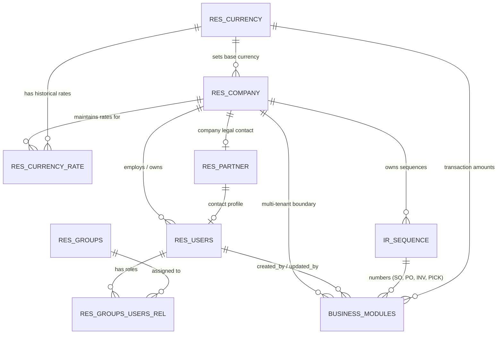

# مواصفات البنية التحتية الإلزامية: الكينونات والعمليات الأساسية
# Essential ERP Infrastructure: Core Entities & Operations Specification

- **المشروع**: [cashflow_backend](file:///home/osm/StudioProjects/cashflow_backend) (Go Clean Architecture ERP Backend)
- **المرجع المصدري المقارن**: [Odoo 19.0](file:///home/osm/Downloads/odoo-19.0/odoo-19.0) (`odoo/orm/`, `odoo/addons/base/`)
- **الهدف**: تحديد الكينونات (Entities) والعمليات (Operations) الحتمية في البنية التحتية لنظام ERP، والتي بدونها لا يمكن للنظام أن يعمل بصورة سليمة أو متماسكة.

---

## 1. الملخص التنفيذي والسياق

في أنظمة تخطيط موارد المؤسسات (ERP)، تمثل البنية التحتية الأساس المشترك الذي تعتمد عليه كافة دورات العمل (المحاسبة، المبيعات، المشتريات، المخازن، والمدفوعات). 

عند تحليل **Odoo 19.0** واستبعاد مئات الميزات التجميلية أو غير الأساسية (مثل محررات واجهات الويب ومولدات الباركود)، نجد أن النظام يرتكز تشغيلياً على **5 كينونات بنيوية أساسية** و **5 عمليات تحتية جوهرية**.

هذه الوثيقة توثق تلك الركائز بدقة لتكون المرجع المعماري المعتمد لإكمال البنية التحتية لمشروع `cashflow_backend`.

---

## 2. مخطط العلاقات الكينونية للبنية التحتية (Infrastructure ERD)

يوضح المخطط التالي الاعتماديات المتبادلة بين كينونات البنية التحتية المركزية وكيفية تغذيتها لبقية موديولات الـ ERP:



---

## 3. الكينونات الإلزامية في البنية التحتية (Core Entities)

---

### 3.1. كيان الشركات وتعدد الشركات (`res_company` / `Company`)

* **الدور الحتمي في النظام**:
  * هو حجر الزاوية لعزل البيانات (Multi-Tenancy) داخل قاعدة البيانات.
  * يحدد العملة المحاسبية الرسمية للمؤسسة، والرقم الضريبي، وبيانات الترويسة القانونية في الفواتير.
  * تعتمد عليه كافة الجداول المنشأة في المراحل السابقة من خلال العمود `company_id`.

* **مخطط قاعدة البيانات المقترح (PostgreSQL Schema)**:
  ```sql
  CREATE TABLE IF NOT EXISTS res_companies (
      id BIGSERIAL PRIMARY KEY,
      name VARCHAR(255) NOT NULL,
      currency_id BIGINT NOT NULL, -- references res_currencies(id)
      partner_id BIGINT,           -- references res_partners(id)
      parent_id BIGINT REFERENCES res_companies(id) ON DELETE SET NULL,
      vat VARCHAR(50),
      active BOOLEAN NOT NULL DEFAULT true,
      created_at TIMESTAMPTZ NOT NULL DEFAULT NOW(),
      updated_at TIMESTAMPTZ NOT NULL DEFAULT NOW()
  );
  CREATE INDEX IF NOT EXISTS idx_companies_active ON res_companies(active);
  CREATE INDEX IF NOT EXISTS idx_companies_parent_id ON res_companies(parent_id);
  ```

* **نموذج Go Domain Entity**:
  ```go
  type Company struct {
      ID         int64
      Name       string
      CurrencyID int64
      PartnerID  *int64
      ParentID   *int64
      VAT        string
      Active     bool
      Audit      audit.Fields
  }
  ```

---

### 3.2. كيان المستخدمين والحسابات (`res_users` / `User`)

* **الدور الحتمي في النظام**:
  * المسؤول عن إسناد المسؤوليات وتتبع التدقيق المالي والإداري (`Audit Trail`).
  * يربط هوية الدخول بهوية جهة الاتصال (`partner_id`) وبالشركة النشطة للمستخدم (`company_id`).
  * بدونه تظل حقول `created_by` و `updated_by` في كل جداول النظام مجرد أرقام حرة بدون تكامل مرجعي (Foreign Key Constraints).

* **مخطط قاعدة البيانات المقترح (PostgreSQL Schema)**:
  ```sql
  CREATE TABLE IF NOT EXISTS res_users (
      id BIGSERIAL PRIMARY KEY,
      login VARCHAR(255) NOT NULL UNIQUE,
      password_hash VARCHAR(255) NOT NULL,
      partner_id BIGINT NOT NULL REFERENCES res_partners(id) ON DELETE RESTRICT,
      company_id BIGINT NOT NULL REFERENCES res_companies(id) ON DELETE RESTRICT,
      active BOOLEAN NOT NULL DEFAULT true,
      created_at TIMESTAMPTZ NOT NULL DEFAULT NOW(),
      updated_at TIMESTAMPTZ NOT NULL DEFAULT NOW()
  );
  CREATE INDEX IF NOT EXISTS idx_users_login ON res_users(login);
  CREATE INDEX IF NOT EXISTS idx_users_company_id ON res_users(company_id);
  ```

* **نموذج Go Domain Entity**:
  ```go
  type User struct {
      ID           int64
      Login        string
      PasswordHash string
      PartnerID    int64
      CompanyID    int64
      Active       bool
      Audit        audit.Fields
  }
  ```

---

### 3.3. كيان العملات وأسعار الصرف (`res_currency` & `res_currency_rate`)

* **الدور الحتمي في النظام**:
  * في أنظمة الـ ERP، لا يمكن افتراض أن كافة العمليات تتم بعملة واحدة ثابتة مثل `'USD'`.
  * عند إصدار فاتورة أو قيد بيع بعملة أجنبية (مثل EUR أو SAR)، يحتاج النظام فورياً إلى قراءة سعر الصرف التاريخي لتحويل القيمة إلى العملة الدفترية للشركة بهدف إعداد ميزان المراجعة والإقرارات الضريبية وحساب أرباح وخسائر فروق العملة.

* **مخطط قاعدة البيانات المقترح (PostgreSQL Schema)**:
  ```sql
  -- 1. جدول تعريف العملات
  CREATE TABLE IF NOT EXISTS res_currencies (
      id BIGSERIAL PRIMARY KEY,
      code VARCHAR(10) NOT NULL UNIQUE, -- USD, EUR, SAR
      name VARCHAR(100) NOT NULL,
      symbol VARCHAR(10) NOT NULL,
      rounding NUMERIC(6,4) NOT NULL DEFAULT 0.0100,
      decimal_places INT NOT NULL DEFAULT 2,
      active BOOLEAN NOT NULL DEFAULT true,
      created_at TIMESTAMPTZ NOT NULL DEFAULT NOW(),
      updated_at TIMESTAMPTZ NOT NULL DEFAULT NOW()
  );

  -- 2. جدول أسعار الصرف التاريخية
  CREATE TABLE IF NOT EXISTS res_currency_rates (
      id BIGSERIAL PRIMARY KEY,
      currency_id BIGINT NOT NULL REFERENCES res_currencies(id) ON DELETE CASCADE,
      company_id BIGINT NOT NULL REFERENCES res_companies(id) ON DELETE CASCADE,
      rate NUMERIC(16,6) NOT NULL, -- سعر الصرف بالنسبة لعملة الأساس
      rate_date DATE NOT NULL DEFAULT CURRENT_DATE,
      created_at TIMESTAMPTZ NOT NULL DEFAULT NOW(),
      CONSTRAINT uq_currency_company_date UNIQUE (currency_id, company_id, rate_date)
  );
  CREATE INDEX IF NOT EXISTS idx_curr_rate_search ON res_currency_rates(currency_id, company_id, rate_date DESC);
  ```

---

### 3.4. محرك التسلسل والترقيم المركزي (`ir_sequence` / `Sequence`)

* **الدور الحتمي في النظام**:
  * إدارة الترقيم الرسمي غير القابل للتكرار لجميع الوثائق: الفواتير، قيود اليومية، أوامر البيع، أوامر الشراء، وأذون الصرف المخزني.
  * يتيح تكوين البادئة (Prefix) تلقائياً وفق التاريخ (مثل: `INV/2026/03/0001` أو `SO/2026/0001`) وعدد الخانات الثابتة (Padding).
  * يمنع الفوضى الناتجة عن إنشاء Sequences يدوية معزولة داخل كل موديول.

* **مخطط قاعدة البيانات المقترح (PostgreSQL Schema)**:
  ```sql
  CREATE TABLE IF NOT EXISTS ir_sequences (
      id BIGSERIAL PRIMARY KEY,
      code VARCHAR(100) NOT NULL, -- e.g. 'sale.order', 'account.move.invoice'
      name VARCHAR(255) NOT NULL,
      prefix VARCHAR(50) NOT NULL DEFAULT '',
      suffix VARCHAR(50) NOT NULL DEFAULT '',
      padding INT NOT NULL DEFAULT 5,
      number_next BIGINT NOT NULL DEFAULT 1,
      number_increment INT NOT NULL DEFAULT 1,
      use_date_range BOOLEAN NOT NULL DEFAULT true,
      company_id BIGINT REFERENCES res_companies(id) ON DELETE CASCADE,
      active BOOLEAN NOT NULL DEFAULT true,
      created_at TIMESTAMPTZ NOT NULL DEFAULT NOW(),
      updated_at TIMESTAMPTZ NOT NULL DEFAULT NOW(),
      CONSTRAINT uq_sequence_code_company UNIQUE (code, company_id)
  );
  CREATE INDEX IF NOT EXISTS idx_sequences_code ON ir_sequences(code);
  ```

---

### 3.5. الأدوار والمجموعات (`res_groups` & `res_groups_users_rel`)

* **الدور الحتمي في النظام**:
  * الفصل الإداري بين الصلاحيات (Separation of Duties).
  * تحديد صلاحيات الوصول على مستوى الوظيفة (محاسب، بائع، مدير مخازن) بدلاً من الفحص السطحي لدور وحيد داخل التوكن.

* **مخطط قاعدة البيانات المقترح (PostgreSQL Schema)**:
  ```sql
  CREATE TABLE IF NOT EXISTS res_groups (
      id BIGSERIAL PRIMARY KEY,
      name VARCHAR(100) NOT NULL UNIQUE, -- e.g. 'account_accountant', 'sales_manager'
      category VARCHAR(100) NOT NULL,    -- 'Accounting', 'Sales', 'Inventory'
      description TEXT,
      created_at TIMESTAMPTZ NOT NULL DEFAULT NOW()
  );

  CREATE TABLE IF NOT EXISTS res_groups_users_rel (
      user_id BIGINT NOT NULL REFERENCES res_users(id) ON DELETE CASCADE,
      group_id BIGINT NOT NULL REFERENCES res_groups(id) ON DELETE CASCADE,
      PRIMARY KEY (user_id, group_id)
  );
  ```

---

## 4. العمليات والخدمات التحتية الإلزامية (Core Operations)

---

### 4.1. إدارة المعاملات الذرية (Atomic Transaction Management - Unit of Work)
* **المسار في المشروع**: [`internal/platform/database/tx.go`](file:///home/osm/StudioProjects/cashflow_backend/internal/platform/database/tx.go)
* **التوقيع**: `WithTx(ctx context.Context, pool *pgxpool.Pool, fn func(tx pgx.Tx) error) error`
* **الدور والأهمية**:
  * حماية سلامة البيانات المالية والمخزنية (Data Consistency).
  * في حال تأكيد أمر بيع يترتب عليه إنشاء حركة مخزنية (`stock_picking`) وحجز منتجات، إذا فشلت خطوة المخزون يتم التراجع فورياً عن كل التعديلات السابقة (`Rollback`).

---

### 4.2. التوليد الآمن للأرقام المتسلسلة (Atomic Next Sequence Generator)
* **المسار المقترح**: `internal/platform/sequence/generator.go`
* **التوقيع البرمجي**:
  ```go
  type SequenceService interface {
      NextNumber(ctx context.Context, tx pgx.Tx, code string, companyID int64, date time.Time) (string, error)
  }
  ```
* **الدور والأهمية**:
  * استخدام القفل الحصري لقواعد البيانات (`SELECT number_next FROM ir_sequences WHERE code = $1 FOR UPDATE`).
  * يضمن عدم تكرار أرقام الفواتير أو أوامر الشراء حتى في حال وجود 100 طلب متزامن في نفس الجزء من الثانية (`Concurrency Safe`).
  * تنسيق التاريخ تلقائياً داخل القناع: استبدال `%(year)s` برقم السنة الحالية، واستبدال `%(month)s` بالشهر، وإضافة الأصفار البادئة (Padding).

---

### 4.3. محرك عزل بيانات الشركات تلقائياً (Multi-Company Isolation Scoping)
* **المسار المقترح**: `internal/platform/database/scope.go`
* **التوقيع البرمجي**:
  ```go
  func ScopeCompany(query string, companyID int64, tableAlias string) (string, []any)
  ```
* **الدور والأهمية**:
  * منع تسرب البيانات بين الفروع والشركات في بيئة تعدد الشركات.
  * يضمن أن كل استعلام `SELECT` أو `UPDATE` يقيد تلقائياً بشرط:
    ```sql
    WHERE (company_id = $company_id OR company_id IS NULL)
    ```

---

### 4.4. محرك حساب وتحويل العملات (Currency Conversion Engine)
* **المسار المقترح**: `internal/platform/currency/converter.go`
* **التوقيع البرمجي**:
  ```go
  type CurrencyConverter interface {
      Convert(ctx context.Context, amount decimal.Decimal, fromCurrencyID, toCurrencyID int64, date time.Time, companyID int64) (decimal.Decimal, error)
      GetRate(ctx context.Context, currencyID, companyID int64, date time.Time) (decimal.Decimal, error)
  }
  ```
* **الدور والأهمية**:
  * تحويل مبالغ الفواتير والمعاملات من العملة التجارية للمعاملة إلى عملة الدفاتر المحاسبية الرسمية بدقة متناهية ودون تقريب عشوائي.

---

### 4.5. حقن سياق التدقيق المالي والإداري (Audit Context Injection)
* **المسار في المشروع**: [`internal/platform/audit/audit.go`](file:///home/osm/StudioProjects/cashflow_backend/internal/platform/audit/audit.go)
* **التوقيع البرمجي**: `NewFields(ctx context.Context) Fields` و `Touch(ctx context.Context)`
* **الدور والأهمية**:
  * استخراج هوية المستخدم الحالي والشركة النشطة من سياق الطلب (`ctx`) وحقنها آلياً في الحقول الأربعة:
    `created_at`, `updated_at`, `created_by`, `updated_by`.

---

## 5. تحليل الفجوة الحالية وخطة التوافق (Gap Analysis & Migration)

يوضح الجدول التالي ما تم تنفيذه حالياً في مشروع `cashflow_backend` مقارنة بما تتطلبه البنية التحتية، والحل المطلوب تنفيذه:

| الكيان / العملية | الحالة الحالية في المشروع | التأثير والمخاطر | الإجراء التصحيحي المطلوب |
| :--- | :---: | :--- | :--- |
| **`res_users`** | غير موجود كجدول | حقول `created_by` بدون علاقات Foreign Key وبدون ملف شخصي | إنشاء جدول `res_users` في Migration البنية التحتية |
| **`res_company`** | غير موجود كجدول | حقول `company_id` عشوائية ولا توجد هوية للمؤسسة | إنشاء جدول `res_companies` وجعل `company_id` يشير إليه |
| **`res_currency`** | نص ثابت `'USD'` | عجز النظام عن إصدار فواتير أو قيود متعددة العملات | إنشاء جدولي `res_currencies` و `res_currency_rates` |
| **`ir_sequence`** | Sequences متفرقة ومكررة | عدم القدرة على صياغة أرقام الفواتير بحسب السنة والفرع | إنشاء جدول `ir_sequences` وخدمة الترقيم المركزية |
| **`res_groups`** | فحص نصي في الروتر | صعوبة إدارة الصلاحيات ديناميكياً لكل مستخدم | إنشاء جداول المجموعات وربطها بالمستخدمين |
| **`WithTx`** | مكتمل ويعمل بنجاح | المعاملات الذرية مؤمنة | الاعتماد عليه كقاعدة للمعاملات متعددة الكيانات |
| **`Audit Context`** | مكتمل ويعمل بنجاح | سياق التدقيق مهيأ | ربطه مباشرة بجدول `res_users` عند إنشائه |

---

## 6. مسار التنفيذ الهندسي (Roadmap to Implementation)

لإدماج هذه الركائز الإلزامية دون إفساد أي موديول تم بناؤه سابقاً:
1. **إنشاء ترحيل قاعدة بيانات تأسيسي للبنية التحتية** (مثلاً `000011_create_core_infrastructure_schema.up.sql`):
   - إنشاء جداول: `res_currencies`, `res_companies`, `res_users`, `ir_sequences`, `res_groups`.
   - بذر البيانات الافتراضية (Default Seed): شركة رئيسية افتراضية (ID: 1)، عملة أساسية (USD أو SAR)، ومستخدم افتراضي مسؤول (Admin).
2. **بناء حزمة الترقيم المركزي في الـ Platform**:
   - كتابة `internal/platform/sequence/service.go` لاستبدال الـ Sequences المتفرقة.
3. **تفعيل قيود الـ Foreign Keys**:
   - ربط الجداول الحالية (`res_partners`, `sale_orders`, `account_moves`) بالشركات والمستخدمين رسمياً لضمان التماسك المرجعي الكامل للبيانات.
