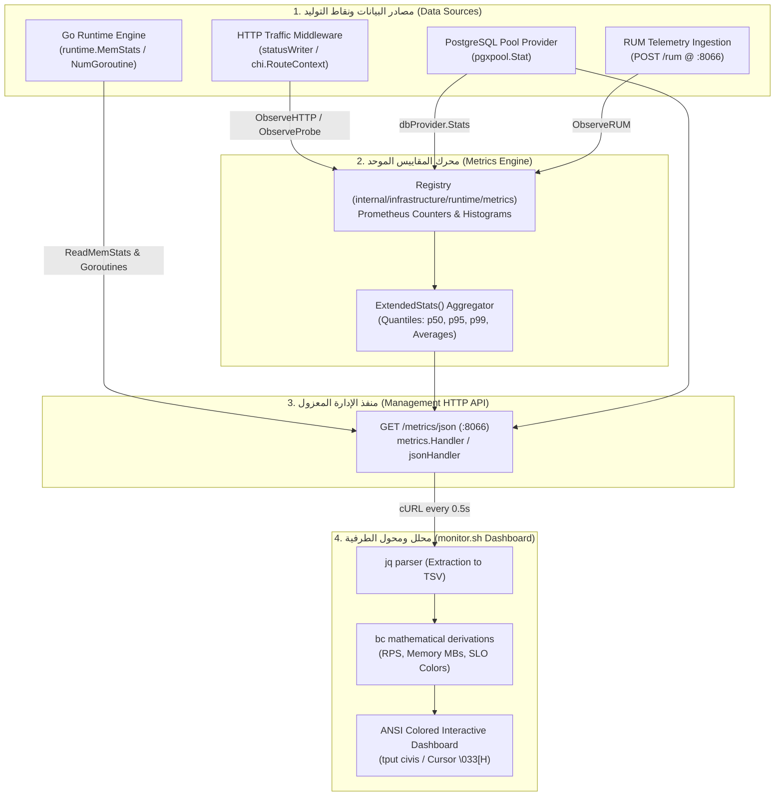

# دليل دورة حياة حقول شاشة المراقبة (Monitor Fields Lifecycle Architecture Guide)

يوثق هذا الدليل دورة الحياة البرمجية الكاملة لجميع الحقول والمؤشرات المعروضة على شاشة المراقبة اللحظية ([tool/monitor.sh](file:///home/osm/StudioProjects/cashflow/cashflow_backend/tool/monitor.sh))، بدءاً من لحظة نشأة البيانات داخل نواة الخادم (Go Runtime و Middleware و PostgreSQL Connection Pool و RUM Telemetry)، مروراً بمحرك تجميع المقاييس وحساب الشرائح الإحصائية، وصولاً إلى تصديرها عبر منفذ الإدارة المعزول ومعالجتها في واجهة الطرفية.

---

## 1. المعمارية العامة لتدفق البيانات (Data Flow Architecture)



---

## 2. أقسام شاشة المراقبة وحقولها التفصيلية

---

### القسم الأول: ترويسة النظام والبيانات الوصفية (Header & System Metadata)

#### 1. الهدف المعلن (`Target`)

- **حقل الـ JSON:** `server_url` (`string`)
- **المصدر والنشأة:** يُسجل عند إقلاع الخادم في [internal/platform/app/app.go](file:///home/osm/StudioProjects/cashflow/cashflow_backend/internal/platform/app/app.go#L293) عبر استدعاء `metrics.RegisterServerURL(a.cfg.BaseURL())`.
- **المعالجة في الذاكرة:** يُخزن كقيمة خيطية آمنة (`atomic.Value`) في بنية [Registry](file:///home/osm/StudioProjects/cashflow/cashflow_backend/internal/infrastructure/runtime/metrics/registry.go#L42).
- **المعالجة في السكريبت:** يستخرجه `jq` عبر `(.server_url // "-")`. إذا لم يكن متاحاً يستخدم رابط المنفذ المحلي الافتراضي.
- **التنبيه واللون:** يُعرض باللون السيان (`CYAN`) للدلالة على الهدف الموجه إليه الفحص.

#### 2. توقيت النظام (`Time`)

- **المصدر والنشأة:** ساعة النظام المحلي على خادم المراقبة.
- **المعالجة في السكريبت:** يتم توليده لحظياً عند كل دورة تحديث (Frame) عبر أمر: `date "+%Y-%m-%d %H:%M:%S %p"`.

#### 3. مدة تشغيل السيرفر (`Uptime`)

- **حقل الـ JSON:** `uptime_seconds` (`float64`)
- **المصدر والنشأة:** يُحسب في دالة `uptimeSeconds()` داخل [internal/infrastructure/runtime/metrics/registry.go](file:///home/osm/StudioProjects/cashflow/cashflow_backend/internal/infrastructure/runtime/metrics/registry.go) بطرح وقت الإقلاع من الوقت الحالي: `time.Since(r.startTime).Seconds()`.
- **المعالجة في السكريبت:** يُقرأ كقيمة عشرية، ثم يُحول حسابياً إلى ساعات ودقائق وثوانٍ:

  ```bash
  UPTIME_INT=$(printf "%.0f" "$UPTIME")
  UPTIME_H=$((UPTIME_INT / 3600))
  UPTIME_M=$((UPTIME_INT % 3600 / 60))
  UPTIME_S=$((UPTIME_INT % 60))
  ```

  ويُنسق بنمط: `00h 25m 14s`.

#### 4. عدد الخيوط الخفيفة (`Goroutines`)

- **حقل الـ JSON:** `num_goroutines` (`int`)
- **المصدر والنشأة:** استدعاء فوري لوظيفة بيئة تشغيل Go: `runtime.NumGoroutine()` عند طلب نقطة النهاية `/metrics/json`.
- **الأهمية البرمجية:** كاشف فوري لأي تسريب في الروتينات (Goroutine Leak). في الوضع العادي يتراوح بين 10 إلى 15، ويتمدد وقت معالجة آلاف الطلبات ثم يعود فوراً إلى مستواه الطبيعي.

#### 5. عدد دورات جامع القمامة (`GCs`)

- **حقل الـ JSON:** `num_gc` (`uint32`)
- **المصدر والنشأة:** مأخوذ من هيكل `runtime.MemStats.NumGC` أثناء قراءة `runtime.ReadMemStats(&m)`. يزداد بمقدار 1 في كل مرة يكمل فيها محرك Go دورة تنظيف ذاكرة (Garbage Collection).

#### 6. إجمالي زمن توقف الـ GC (`GC Pause Total`)

- **حقل الـ JSON:** `gc_pause_seconds_total` (`float64`)
- **المصدر والنشأة:** يُحسب من `float64(m.PauseTotalNs) / float64(time.Second)`، وهو الزمن التراكمي الشامل الذي توقفت فيه معالجات البرنامج لحظياً لأجل تنظيف الذاكرة (Stop-The-World STW pauses).
- **المعالجة في السكريبت:** يُعرض بالثواني المتبوعة بـ `s pause`.

---

### القسم الثاني: استهلاك وإدارة الذاكرة ([ SYSTEM & MEMORY ])

جميع حقول هذا القسم تُستخرج لحظياً عند طلب نقطة النهاية عبر استدعاء [runtime.ReadMemStats](file:///home/osm/StudioProjects/cashflow/cashflow_backend/internal/infrastructure/runtime/metrics/metrics.go#L157-L173):

#### 1. الذاكرة النشطة المخصصة (`Allocated`)

- **حقل الـ JSON:** `memory_alloc_bytes` أو `heap_alloc_bytes` (`uint64`)
- **المصدر:** `m.Alloc` (حجم بايتات كائنات الذاكرة الحية التي لا تزال مستخدمة في الـ Heap ولم يقم جامع القمامة بتحريرها).
- **المعالجة في السكريبت:** تُحول إلى ميجابايت عبر القسمة على `1048576`:

  ```bash
  ALLOC_MB=$(printf "%.2f" $(echo "scale=2; $ALLOC/1048576" | bc -l))
  ```

- **اللون:** أخضر (`GREEN`)، يعبر عن صحة كفاءة إدارة الكائنات الحية.

#### 2. الذاكرة قيد الاستخدام في النطاقات (`In-Use`)

- **حقل الـ JSON:** `heap_inuse_bytes` (`uint64`)
- **المصدر:** `m.HeapInuse` (عدد البايتات المحجوزة في نطاقات الـ Heap Spans التي تحتوي كائناً حياً واحداً على الأقل).

#### 3. ذاكرة النطاقات الخاملة (`Idle`)

- **حقل الـ JSON:** `heap_idle_bytes` (`uint64`)
- **المصدر:** `m.HeapIdle` (حجم بايتات الـ Spans التي لا تحتوي أي كائنات حية حالياً، وهي جاهزة لإعادة الاستخدام من قبل Go أو إعادتها إلى نظام التشغيل عبر `madvise`).
- **اللون:** أصفر (`YELLOW`).

#### 4. إجمالي الذاكرة المحجوزة تراكمياً (`Total`)

- **حقل الـ JSON:** `memory_total_bytes` (`uint64`)
- **المصدر:** `m.TotalAlloc` (العداد التراكمي لجميع البايتات التي تم حجزها للكائنات منذ بدء تشغيل الخادم دون خصم ما تم تنظيفه).
- **اللون:** أزرق (`BLUE`).

#### 5. الذاكرة المطلوبة من نظام التشغيل (`System`)

- **حقل الـ JSON:** `memory_sys_bytes` (`uint64`)
- **المصدر:** `m.Sys` (إجمالي الذاكرة الافتراضية التي حجزها وقت تشغيل Go من نظام تشغيل Linux للـ Heap والـ Stacks وجداول الـ GC).
- **اللون:** ماجنتا (`MAGENTA`).

---

### القسم الثالث: حركة البيانات ومعدل التدفق ([ TRAFFIC & THROUGHPUT ])

#### 1. إجمالي الطلبات (`Requests`)

- **حقل الـ JSON:** `http_requests_total` (`uint64`)
- **المصدر والنشأة:** ينشأ داخل [internal/infrastructure/runtime/metrics/metrics.go](file:///home/osm/StudioProjects/cashflow/cashflow_backend/internal/infrastructure/runtime/metrics/metrics.go#L116-L142) في `httpMiddleware`. عند انتهاء الطلب، يستدعي `r.ObserveHTTP` الذي يزيد عداد الـ Prometheus:

  ```go
  r.httpRequests.WithLabelValues(method, route, statusClass).Inc()
  ```

- **المعالجة في السكريبت:** يُجمع في `ExtendedStats()` عبر جمع قيم جميع الشرائح ويُعرض كقيمة مجردة تعبر عن حجم الحركة الإجمالية.

#### 2. معدل الطلبات في الثانية اللحظي (`Rate / RPS`)

- **المصدر والنشأة:** حقل حسابي ديناميكي مشتق بالكامل داخل سكريبت [tool/monitor.sh](file:///home/osm/StudioProjects/cashflow/cashflow_backend/tool/monitor.sh#L139-L153).
- **المعادلة الرياضية:**
  $$\text{RPS} = \frac{\text{REQS}_{\text{current}} - \text{REQS}_{\text{previous}}}{\text{TIME}_{\text{current}} - \text{TIME}_{\text{previous}}}$$
- **شروط الدقة:** يتم قياس الوقت بدقة النانو ثانية `date +%s.%N`، ولا يتم الحساب إلا إذا كان الفارق الزمني أكبر من 50 ميلي ثانية لتجنب القسمة على صفر أو تشويه المعدل.
- **اللون:** سيان (`CYAN`).

#### 3. توزيع الاستجابات الناجحة (`Responses: 2xx & 3xx`)

- **حقول الـ JSON:** `http_2xx_total` و `http_3xx_total` (`uint64`)
- **المصدر والنشأة:** يتم تتبع كود الحالة عبر `statusWriter.status` في الـ Middleware وتصنيفه عبر `statusClassFor(code)`:
  - الأكواد `200..299` تصنف `2xx`.
  - الأكواد `300..399` تصنف `3xx`.
  - بموجب العقد المعياري، يُدمج عداد `3xx` في مجمل الاستجابات الناجحة داخل كائن الـ JSON: `HTTP2xx = ByClass[Status2xx] + ByClass[Status3xx]`.
- **اللون:** أخضر (`GREEN`) لـ 2xx، وسيان (`CYAN`) لـ 3xx.

#### 4. متوسط حجم الاستجابة (`Avg Size`)

- **حقل الـ JSON:** `avg_response_bytes` (`float64`)
- **المصدر والنشأة:** يقوم `statusWriter` بحساب كل بايت يمر عبر دالة `Write(p []byte)` ويسجل `bytesWritten`. يسجل الـ Middleware الحجم في هيستوغرام `cashflow_http_response_size_bytes`. تقوم دالة `ExtendedStats()` بقسمة إجمالي البايتات على عدد الطلبات.
- **المعالجة في السكريبت:** ينسق ديناميكياً بحسب الحجم:
  - إذا كان $\ge 1\text{ MB}$ يُعرض بوحدة `MB`.
  - إذا كان $\ge 1\text{ KB}$ يُعرض بوحدة `KB`.
  - خلاف ذلك يُعرض بوحدة `Bytes (B)`.

#### 5. أخطاء العميل وأخطاء الخادم (`Errors: 4xx & 5xx`)

- **حقول الـ JSON:** `http_4xx_total` و `http_5xx_total` (`uint64`)
- **المصدر والنشأة:**
  - `4xx`: تُسجل عند إرجاع أكواد مثل `400 Bad Request`, `401 Unauthorized`, `404 Not Found`.
  - `5xx`: تُسجل عند حدوث أعطال الخادم الداخلية `500 Internal Server Error` أو تعطل قاعدة البيانات.

#### 6. نسبة أخطاء الخادم (`5xx Share %`)

- **المصدر والنشأة:** مشتقة في السكريبت: `SHARE_5XX = (E5XX * 100) / REQS`.
- **المنطق والتنبيه (SLO Alert):**
  - مطابقة لقاعدة التنبيه `High5xxShare` في [deploy/monitoring/prometheus-alerts.yml](file:///home/osm/StudioProjects/cashflow/cashflow_backend/deploy/monitoring/prometheus-alerts.yml).
  - إذا كانت النسبة $> 0.5\%$ يتحول المؤشر فوراً إلى **الأحمر العريض (`RED BOLD`)**.
  - إذا كان هناك أي خطأ 5xx يتحول للأصفر (`YELLOW`).
  - إذا كانت صفرية يبقى باللون الطبيعي.

---

### القسم الرابع: أزمنة الاستجابة ومستهدفات الجودة ([ LATENCY & SLO TARGETS (60s Window) ])

تُحسب قيم أزمنة الاستجابة والشرائح المئوية لحظياً عبر **نظام النافذة المنزلقة (Sliding Window)** المدمج في `metrics.WindowTracker` بدلاً من المتوسطات التاريخية التراكمية:

- **المعمارية الهندسية:** حلقة دائرية (`Circular Ring Buffer`) من 60 شريحة (شريحة لكل ثانية)، بدون أي حجز للذاكرة في مسار الطلبات (`0 allocs/op`).
- **السلوك عند الحركة:** تعكس بدقة الأداء الآني اللحظي لآخر 60 ثانية (تستجيب فوراً للبطء المفاجئ دون أن تتأثر بآلاف الطلبات السابقة).
- **السلوك عند الخمول (Baseline Recovery):** عند توقف الطلبات تماماً، تنتهي صلاحية الشرائح القديمة تدريجياً وتعود جميع مؤشرات الكمون تلقائياً إلى `0.00 ms` وحالة `idle (no traffic in last 60s)`.
- **التوافق التام مع Prometheus:** تستمر نقطة `/metrics` الرسمية في تصدير المقاييس التراكمية القياسية (`httpDuration.Observe`)، مع توفير `lifetime_avg_latency_ms` و `lifetime_p95_latency_ms` في JSON لمن يطلب الإحصاء التاريخي الشامل.

#### 1. متوسط زمن معالجة طلبات الأعمال اللحظي (`Business Avg`)

- **حقل الـ JSON:** `avg_latency_ms` (`float64` ضمن نافذة 60 ثانية)
- **المصدر:** حاصل قسمة `totalSum / totalCount * 1000` للشرائح الفعالة داخل آخر 60 ثانية في `WindowTracker.Snapshot()`.
- **المنطق والتنبيه:**
  - أخضر: $\le 100\text{ ms}$.
  - أصفر: $> 100\text{ ms}$.
  - أحمر: $> 400\text{ ms}$.
  - خمول: `0.00 ms` عند عدم وجود طلبات في آخر 60 ثانية.

#### 2. زمن الاستجابة الوسيط اللحظي (`p50 Latency`)

- **حقل الـ JSON:** `p50_latency_ms` (`float64` ضمن نافذة 60 ثانية)
- **المصدر:** يتم استيفاؤه خطياً (Linear Interpolation) عبر الدالة الرياضية `calculateQuantile(0.50)` بناءً على دلاء الهيستوغرام الخاصة بالنافذة المنزلقة (60 ثانية).
- **اللون:** أخضر (`GREEN`).

#### 3. الشريحة 95 لمستهدف جودة الخدمة (`p95 Latency SLO`)

- **حقل الـ JSON:** `p95_latency_ms` (`float64` ضمن نافذة 60 ثانية)
- **المصدر:** يُحسب عبر `calculateQuantile(0.95)` من النافذة المنزلقة.
- **المنطق والتنبيه (SLO Target):**
  - مستهدف الخدمة المتفق عليه في التصميم هو 500ms مع هامش أمان 20% (عتبة الإنذار 400ms).
  - أخضر: $\le 100\text{ ms}$.
  - أصفر: $> 100\text{ ms}$.
  - أحمر: $> 400\text{ ms}$ (خرق لمستهدف الـ SLO).

#### 4. الشريحة 99 للحالات القصوى (`p99 Latency`)

- **حقل الـ JSON:** `p99_latency_ms` (`float64` ضمن نافذة 60 ثانية)
- **المصدر:** يُحسب عبر `calculateQuantile(0.99)` من النافذة المنزلقة.
- **المنطق والتنبيه:**
  - أخضر: $\le 200\text{ ms}$.
  - أصفر: $> 200\text{ ms}$.
  - أحمر: $> 500\text{ ms}$.

#### 5. زمن استجابة مجس الجاهزية (`readyz Latency`)

- **حقل الـ JSON:** `readyz_latency_ms` (`float64`)
- **المصدر والنشأة:** يتم عزل مجسات الفحص `/readyz` في الـ Middleware فلا تُحتسب ضمن حركة الأعمال؛ بل يُقاس زمن فحص جاهزية قاعدة البيانات عبر `r.ObserveProbe("readyz", time.Since(start))`.
- **المنطق والتنبيه:** أخضر $\le 20\text{ ms}$، أصفر $> 20\text{ ms}$، أحمر $> 100\text{ ms}$.

#### 6. زمن استجابة مجس الحياة (`livez Latency`)

- **حقل الـ JSON:** `livez_latency_ms` (`float64`)
- **المصدر والنشأة:** يُسجل زمن التحقق الفوري من قدرة الخادم على استقبال الطلبات بدون فحص الموارد الخارجية.
- **المنطق والتنبيه:** يتميز بالسرعة الفائقة بالميكروثانية (عادة $< 0.1\text{ ms}$).

---

### القسم الخامس: مجمع اتصالات قاعدة البيانات ([ DATABASE POOL ])

تُستخرج هذه المقاييس عبر مزود الإحصائيات [pgxStatsProvider](file:///home/osm/StudioProjects/cashflow/cashflow_backend/internal/platform/app/app.go#L47-L59) المتصل بمكتبة `pgxpool`:

#### 1. الاتصالات النشطة (`Pool Conns: Active`)

- **حقل الـ JSON:** `db.active_conns` (`int32`)
- **المصدر:** `s.TotalConns() - s.IdleConns()` من دالة `pool.Stat()`. يمثل عدد اتصالات الـ TCP المشغولة حالياً بتنفيذ استعلام داخل معاملات قاعدة البيانات.

#### 2. الاتصالات الخاملة (`Pool Conns: Idle`)

- **حقل الـ JSON:** `db.idle_conns` (`int32`)
- **المصدر:** `s.IdleConns()` من دالة `pool.Stat()`. يمثل عدد الاتصالات الجاهزة والمفتوحة في المجمع بانتظار استلام استعلامات جديدة فوراً دون تأخير إنشاء اتصال جديد.

#### 3. الحد الأقصى للمجمع (`Max Conns`)

- **حقل الـ JSON:** `db.max_conns` (`int32`)
- **المصدر:** إعداد التهيئة `MaxConns` (الافتراضي 25 اتصالاً).

#### 4. نسبة تشبع المجمع (`Pool Usage %`)

- **المصدر:** تُحسب في السكريبت: `DB_USAGE = (DB_ACTIVE * 100) / DB_MAX`.
- **المنطق والتنبيه (Alert: DBPoolSaturated):**
  - أخضر: $\le 50\%$.
  - أصفر: $> 50\%$.
  - أحمر: $> 80\%$ (اقتراب تشبع المجمع بالكامل).

#### 5. عداد طلبات وحجز الاتصالات ومقاييس الانتظار (`Acquires & Blocked`)

- **حقول الـ JSON:**
  - `db.wait_count` (`int64`): إجمالي طلبات استعارة اتصال ناجحة (`AcquireCount`).
  - `db.empty_acquire_count` (`int64`): عدد المرات التي فرغ فيها المجمع واضطر الطلب للانتظار (`EmptyAcquireCount`).
  - `db.wait_duration_ns` (`int64` / `time.Duration`): إجمالي زمن الانتظار القسري بالنانوثانية (`AcquireDuration`).
- **الأسماء المعيارية في Prometheus:**
  - `cashflow_db_pool_wait_count_total`
  - `cashflow_db_pool_empty_acquire_count_total`
  - `cashflow_db_pool_wait_duration_seconds_total`
- **التصنيف الإحصائي:** **عدادات تراكمية تصاعدية (`Monotonically Increasing Counters`)**.
- **المصدر البرمجي في Go:** مأخوذة من واجهة `pgxpool.Stat()` في [internal/platform/app/app.go](file:///home/osm/StudioProjects/cashflow/cashflow_backend/internal/platform/app/app.go#L51-L64).

##### أ. دورة الحياة البرمجية ولماذا يزداد فقط ولا ينقص أبداً؟

1. **طبيعة العداد (Counter vs Gauge):**
   - المقاييس الآنية (`Gauges`) مثل `Active Conns` و `Goroutines` ترتفع أثناء تنفيذ الطلبات وتنخفض إلى الصفر بمجرد انتهائها لأنها تعبر عن "الحالة الراهنة في هذه اللحظة".
   - أما `wait_count` فهو عداد تراكمي تاريخي (مثل عداد الكيلومترات في السيارة Odometer أو عداد الطلبات `http_requests_total`). وظيفته تسجيل **إجمالي عدد المرات التراكمية التي استعار فيها الخادم اتصالاً من المجمع** منذ ولادة السيرفر.
   - لذلك، يستحيل برمجياً ورياضياً أن ينقص هذا العداد؛ فكل طلب HTTP يحتاج استعلاماً عن شريك أو منتج أو مصادقة يزيد هذا العداد بمقدار 1، ولا يعود إلى الصفر إلا عند إعادة تشغيل الخادم بالكامل (`Process Restart`).

2. **التمييز الحاسم بين "إجمالي الحجوزات" و"طابور الانتظار اللحظي":**
   - في مكتبة `pgxpool`:
     - `AcquireCount()`: إجمالي طلبات استعارة الاتصال التراكمية الناجحة (يُعرض في الشاشة باسم `Acquires: X total (Y/s)`).
     - `EmptyAcquireCount()`: عدد المرات التي كان فيها المجمع خالياً تماماً واضطر الاستعلام للانتظار القسري حتى يتحرر اتصال (يُعرض في الشاشة باسم `Blocked: Z`).
   - طالما أن عدد الاتصالات النشطة أقل من الحد الأقصى (`Active < Max`)، فإن طابور الانتظار اللحظي الفعلي هو **صفر (0)**، و `Blocked` يبقى دائماً `0`.

##### ب. التحليل الهندسي لشرط التلوين وقواعد الإنذار (Alerting & Color Logic)

- **في نظام التنبيهات الرسمي (Prometheus / Alertmanager):**
  - في [deploy/monitoring/prometheus-alerts.yml](file:///home/osm/StudioProjects/cashflow/cashflow_backend/deploy/monitoring/prometheus-alerts.yml):
    - `DBWaitClimbing`: يراقب معدل زيادة استعارة الاتصالات `rate(cashflow_db_pool_wait_count_total[10m]) > 50`.
    - `DBPoolBlocked`: يراقب الانتظار القسري الفعلي `rate(cashflow_db_pool_empty_acquire_count_total[5m]) > 0`.

- **التحسين المطبق في سكريبت المراقبة اللحظية (`tool/monitor.sh`):**
  - تم إلغاء المقارنة القديمة الخاطئة (`DB_WAIT > 50`) التي كانت تجعل الشاشة حمراء دائماً بعد 50 استعلاماً.
  - بدلاً من ذلك، يُعرض معدل الحجز اللحظي التفاضلي في الثانية `Acquires: X total (Y/s)`.
  - وتلوين `Blocked` يرتبط بحدوث حجب حقيقي (`DB_EMPTY_ACQ > 0`) ونسبة تشبع المجمع (`DB_USAGE > 80%`).

---

### القسم السادس: مؤشرات تجربة المستخدم الحقيقية ([ REAL USER MONITORING - RUM ])

هذا القسم شرطي (`conditional`)، ولا يظهر على الشاشة إلا إذا كان `samples_count > 0`:

#### 1. عدد العينات المستقبلة (`Samples`)

- **حقل الـ JSON:** `rum.samples_count` (`uint64`)
- **المصدر والنشأة:** يزداد بمقدار 1 مع كل عينة تيليمتري صالحة يتم استقبالها عبر `POST /rum` وتمريرها إلى `metrics.ObserveRUM`.

#### 2. زمن وصول أول بايت (`TTFB`)

- **حقل الـ JSON:** `rum.avg_ttfb_ms` (`float64`)
- **المصدر:** يحسب متوسط زمن `Time to First Byte` بالملي ثانية من هيستوغرام `cashflow_rum_ttfb`.
- **اللون:** أخضر (`GREEN`).

#### 3. زمن رندر أكبر عنصر مرئي (`Core Web: LCP`)

- **حقل الـ JSON:** `rum.avg_lcp_ms` (`float64`)
- **المصدر:** يحسب متوسط زمن `Largest Contentful Paint` بالملي ثانية من هيستوغرام `cashflow_rum_lcp`.
- **اللون:** سيان (`CYAN`).

#### 4. زمن التفاعل مع المدخلات (`Core Web: INP`)

- **حقل الـ JSON:** `rum.avg_inp_ms` (`float64`)
- **المصدر:** يحسب متوسط زمن `Interaction to Next Paint` بالملي ثانية من هيستوغرام `cashflow_rum_inp`.
- **اللون:** سيان (`CYAN`).

#### 5. مؤشر التغير التراكمي في التصميم (`Core Web: CLS`)

- **حقل الـ JSON:** `rum.avg_cls` (`float64`)
- **المصدر:** يحسب متوسط قيمة `Cumulative Layout Shift` (مؤشر بلا وحدة بين 0 و 1) من هيستوغرام `cashflow_rum_cls`.
- **اللون:** سيان (`CYAN`).

---

## 3. ملخص مصفوفة الحقول والمسارات المرجعية

| الحقل في الـ Dashboard | مفتاح الـ JSON | نوع البيانات | المصدر البرمجي في الكود | شروط الإنذار واللون |
| :--- | :--- | :--- | :--- | :--- |
| **Target** | `server_url` | String | `metrics.RegisterServerURL` | أزرق / سيان |
| **Uptime** | `uptime_seconds` | Float64 | `time.Since(startTime)` | نص أبيض منسق |
| **Goroutines** | `num_goroutines` | Int | `runtime.NumGoroutine()` | أبيض مجرد |
| **GCs & Pause** | `num_gc` / `gc_pause` | Uint32 / Float64 | `runtime.MemStats` | أبيض مجرد |
| **Allocated MB** | `memory_alloc_bytes` | Uint64 | `MemStats.Alloc` | أخضر |
| **In-Use MB** | `heap_inuse_bytes` | Uint64 | `MemStats.HeapInuse` | أخضر |
| **Idle MB** | `heap_idle_bytes` | Uint64 | `MemStats.HeapIdle` | أصفر |
| **Total MB** | `memory_total_bytes` | Uint64 | `MemStats.TotalAlloc` | أزرق |
| **System MB** | `memory_sys_bytes` | Uint64 | `MemStats.Sys` | ماجنتا |
| **Requests** | `http_requests_total` | Uint64 | `CounterVec.Inc()` في Middleware | عريض |
| **Rate (RPS)** | مشتق لحظياً | Float64 | حساب تفاضلي كل 0.5s في bash | سيان |
| **Responses 2xx/3xx** | `http_2xx_total` | Uint64 | `statusWriter.status < 400` | أخضر / سيان |
| **Avg Size** | `avg_response_bytes` | Float64 | `cashflow_http_response_size_bytes` | عريض منسق (KB/MB) |
| **Errors 4xx** | `http_4xx_total` | Uint64 | `statusWriter.status 400..499` | أصفر عند $> 0$ |
| **Errors 5xx** | `http_5xx_total` | Uint64 | `statusWriter.status >= 500` | أحمر عريض عند $> 0.5\%$ |
| **Avg Latency (1m)** | `avg_latency_ms` | Float64 (نافذة 60 ثانية) | `WindowTracker.Snapshot()` | أخضر $\le 100$، أحمر $> 400$، يعود إلى $0.00$ عند الخمول |
| **p50 Latency (1m)** | `p50_latency_ms` | Float64 (نافذة 60 ثانية) | `calculateQuantile(0.50)` من النافذة | أخضر |
| **p95 Latency (1m)** | `p95_latency_ms` | Float64 (نافذة 60 ثانية) | `calculateQuantile(0.95)` من النافذة | أخضر $\le 100$، أحمر $> 400$ |
| **p99 Latency (1m)** | `p99_latency_ms` | Float64 (نافذة 60 ثانية) | `calculateQuantile(0.99)` من النافذة | أخضر $\le 200$، أحمر $> 500$ |
| **readyz / livez** | `readyz_ms` / `livez_ms` | Float64 | `ProbeTracker.LatenciesMs()` (القياس الأحدث) | أخضر $\le 20$، أحمر $> 100$ |
| **Pool Conns** | `db.active_conns` | Int32 | `pgxpool.Stat()` | أصفر $> 50\%$، أحمر $> 80\%$ |
| **Acquires & Blocked** | `db.wait_count` / `db.empty_acquire_count` | Int64 (Counters تراكمية) | `pgxpool.Stat()`: `AcquireCount` & `EmptyAcquireCount` | Acquires: عداد مجرد + معدل تفاضلي، Blocked: أصفر عند $> 0$، أحمر عند تشبع $> 80\%$ |
| **RUM Web Vitals** | `rum.*` | Object | `cashflow_rum_*` Histograms | يظهر عند العينات $> 0$ |
