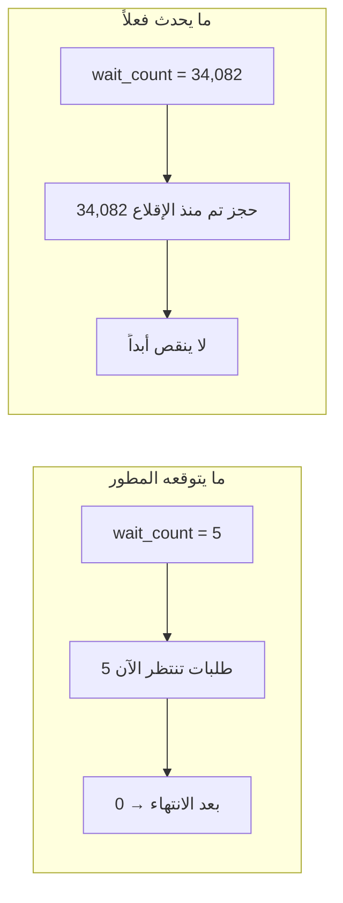
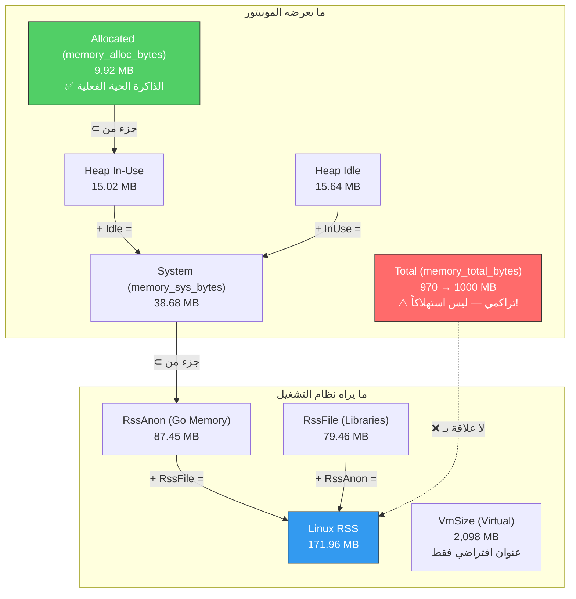

# تحليل مفصّل لدورة حياة حقول شاشة المراقبة (Monitor Fields Lifecycle Analysis)

> **منهجية الاختبار:** تم أخذ 4 لقطات (Snapshots) من نقطة `/metrics/json` في مراحل مختلفة:
>
> 1. **🟦 Baseline** — حالة الخمول (idle) قبل أي حمل
> 2. **🟧 During Load** — أثناء تشغيل 50 عامل بـ 8 ثوانٍ (erp-suite)
> 3. **🟩 Post Load** — فوراً بعد انتهاء الحمل الأول
> 4. **⬜ Final Recovery** — بعد 12 ثانية من انتهاء الحمل الثاني

---

## 1. الحقول الآنية (Gauges) — ✅ تعود لمقياسها الطبيعي

هذه الحقول تعبّر عن **الحالة الراهنة في لحظة القياس**. ترتفع أثناء الحمل وتعود لمستواها الطبيعي بعد انتهاء الطلبات.

### `num_goroutines` — عدد الخيوط الخفيفة

| المرحلة | القيمة | الحالة |
| :--- | :---: | :---: |
| 🟦 Baseline | **12** | ✅ طبيعي |
| 🟧 During Load | **106** | 🔺 ارتفاع (50 عامل + معالجات) |
| 🟩 Post Load | **12** | ✅ عاد |
| ⬜ Final Recovery | **12** | ✅ عاد |

```
Baseline:  ████████████ 12
During:    ████████████████████████████████████████████████████████████████████████████████████████████████████████████ 106
Post Load: ████████████ 12    ← عاد فوراً!
Recovery:  ████████████ 12
```

> [!TIP]
> **الحكم:** ✅ **سليم تماماً.** القيمة 12 هي المستوى الطبيعي (main goroutine + HTTP listeners + DB pool + readyz probe ticker). الارتفاع إلى 106 أثناء الحمل طبيعي ويعود فوراً بعد انتهاء الطلبات. لو لم يعد لـ 12 فهذا يعني **تسريب goroutines**.

---

### `memory_alloc_bytes` (Allocated) — الذاكرة الحية المخصصة

| المرحلة | القيمة (MB) | الحالة |
| :--- | :---: | :---: |
| 🟦 Baseline | **9.4 MB** | ✅ |
| 🟧 During Load | **16.4 MB** | 🔺 ارتفاع |
| 🟩 Post Load | **12.4 MB** | ↘ بدأ يعود |
| ⬜ Final Recovery | **14.6 MB** | ✅ طبيعي |

> [!TIP]
> **الحكم:** ✅ **سليم.** هذا هو `runtime.MemStats.Alloc` — يعبّر فقط عن الكائنات الحية في الـ Heap التي لم يُنظفها GC بعد. يرتفع أثناء الحمل (بسبب JSON marshaling، HTTP buffers، DB rows) ويعود بعد تدخل GC. التذبذب بين 9-16 MB طبيعي جداً لخادم Go.

---

### `heap_inuse_bytes` (In-Use) — نطاقات الذاكرة المشغولة

| المرحلة | القيمة (MB) | الحالة |
| :--- | :---: | :---: |
| 🟦 Baseline | **13.6 MB** | ✅ |
| 🟧 During Load | **18.7 MB** | 🔺 |
| 🟩 Post Load | **16.4 MB** | ↘ |
| ⬜ Final Recovery | **18.9 MB** | ≈ مستقر |

> [!NOTE]
> **الحكم:** ✅ **سليم.** النطاقات المشغولة (Heap Spans) أكبر من Alloc لأنها تحتوي spans بها كائن واحد على الأقل. Go لا يعيد النطاقات للنظام فوراً بل يحتفظ بها لإعادة الاستخدام (وهذا أمر محمود أداءياً).

---

### `heap_idle_bytes` (Idle) — نطاقات الذاكرة الخاملة

| المرحلة | القيمة (MB) | الحالة |
| :--- | :---: | :---: |
| 🟦 Baseline | **9.1 MB** | ✅ |
| 🟧 During Load | **7.1 MB** | 🔻 انخفض (استُهلكت) |
| 🟩 Post Load | **10.4 MB** | ✅ ارتفع (تحررت) |
| ⬜ Final Recovery | **11.7 MB** | ✅ ارتفع أكثر |

> [!TIP]
> **الحكم:** ✅ **سليم.** العلاقة عكسية مع `heap_inuse`: عند الحمل تنخفض Idle (لأن Go يستخدمها)، وبعد الحمل ترتفع (لأن GC ينظف الكائنات ويحرر النطاقات).

---

### `db.active_conns` — اتصالات قاعدة البيانات النشطة

| المرحلة | القيمة | الحالة |
| :--- | :---: | :---: |
| 🟦 Baseline | **1** | ✅ (readyz probe) |
| 🟧 During Load | **19** | 🔺 (19 استعلام متوازي) |
| 🟩 Post Load | **1** | ✅ عاد |
| ⬜ Final Recovery | **1** | ✅ عاد |

> [!TIP]
> **الحكم:** ✅ **سليم تماماً.** هذا مقياس آني (Gauge) = `TotalConns - IdleConns`. أثناء الحمل 19 اتصال مشغول من أصل 25 (76% تشبع). عاد فوراً لـ 1 بعد انتهاء الطلبات.

---

### `db.idle_conns` — اتصالات قاعدة البيانات الخاملة

| المرحلة | القيمة | الحالة |
| :--- | :---: | :---: |
| 🟦 Baseline | **24** | ✅ |
| 🟧 During Load | **6** | 🔻 (24-19+1) |
| 🟩 Post Load | **24** | ✅ عاد |
| ⬜ Final Recovery | **24** | ✅ عاد |

> [!TIP]
> **الحكم:** ✅ **سليم.** العلاقة العكسية مع `active_conns` واضحة.

---

## 2. الحقول التراكمية (Counters) — ⚠️ تزيد فقط بالتصميم

هذه الحقول **عدادات تاريخية** مثل عداد الكيلومترات في السيارة. لا تنقص أبداً ولا يُفترض أن تعود لقيمتها الأصلية. هذا **سلوك صحيح ومتوقع**.

### `memory_total_bytes` (Total) — إجمالي الذاكرة المحجوزة تراكمياً

| المرحلة | القيمة (MB) | الزيادة |
| :--- | :---: | :---: |
| 🟦 Baseline | **193.5 MB** | — |
| 🟧 During Load | **466.5 MB** | +273 MB |
| 🟩 Post Load | **236.7 MB** | +43 MB عن Baseline |
| ⬜ Final Recovery | **873.1 MB** | +679.6 MB عن Baseline |

```diff
- ❌ هذا ليس "كم ذاكرة يستخدمها السيرفر الآن"
+ ✅ هذا "كم بايت حجزها السيرفر منذ ولادته تراكمياً"
```

> [!IMPORTANT]
> **`runtime.MemStats.TotalAlloc`** هو مجموع كل عمليات الحجز منذ إقلاع البرنامج. كل `json.Marshal`، كل `rows.Scan`، كل `http.Request` تزيد هذا العداد. حتى بعد أن ينظف GC الذاكرة، **لا يُخصم من هذا العداد**.
>
> **المقياس الصحيح للذاكرة المستهلكة فعلياً هو `memory_alloc_bytes` (Allocated)** وليس Total.

---

### `num_gc` — عدد دورات جامع القمامة

| المرحلة | القيمة | الزيادة |
| :--- | :---: | :---: |
| 🟦 Baseline | **36** | — |
| 🟧 During Load | **73** | +37 دورة |
| 🟩 Post Load | **42** | +6 عن Baseline |
| ⬜ Final Recovery | **125** | +89 عن Baseline |

> [!NOTE]
> **الحكم:** ⚠️ **تراكمي بالتصميم.** كل مرة يُنظف GC الذاكرة يزيد العداد بـ 1. زيادة كبيرة أثناء الحمل (37 دورة في 3 ثوانٍ) تعني أن GC يعمل بكفاءة لتنظيف الكائنات المؤقتة. هذا **أمر صحي وليس مشكلة**.

---

### `gc_pause_seconds_total` — إجمالي زمن توقف GC

| المرحلة | القيمة (ms) | الزيادة |
| :--- | :---: | :---: |
| 🟦 Baseline | **9.5 ms** | — |
| 🟧 During Load | **57.4 ms** | +47.9 ms |
| ⬜ Final Recovery | **113.6 ms** | +104.1 ms |

> [!NOTE]
> **الحكم:** ⚠️ **تراكمي بالتصميم.** الزمن الإجمالي الذي توقف فيه البرنامج للـ GC. بعد 22,945 طلب و 125 دورة GC، إجمالي التوقف 113ms فقط = **متوسط 0.9ms لكل دورة GC**. أداء ممتاز.

---

### `http_requests_total` — إجمالي الطلبات

| المرحلة | القيمة | الزيادة |
| :--- | :---: | :---: |
| 🟦 Baseline | **2,724** | — |
| 🟧 During Load | **10,819** | +8,095 |
| ⬜ Final Recovery | **22,945** | +20,221 |

> [!NOTE]
> **الحكم:** ⚠️ **تراكمي بالتصميم.** هذا عداد Prometheus من نوع `Counter` — يزيد بـ 1 مع كل طلب HTTP. لا يُفترض أن ينقص. في Prometheus يُحسب `rate()` منه للحصول على RPS.

---

### `db.wait_count` — 🔴 أكثر حقل يسبب لبساً

| المرحلة | القيمة | الزيادة |
| :--- | :---: | :---: |
| 🟦 Baseline | **4,081** | — |
| 🟧 During Load | **15,898** | +11,817 |
| 🟩 Post Load | **5,791** | +1,710 |
| ⬜ Final Recovery | **34,082** | +30,001 |

> [!CAUTION]
> **هذا أخطر لبس في المونيتور.** رغم اسمه `wait_count`، فهو **ليس** "عدد الطلبات المنتظرة الآن".
>
> المصدر في الكود ([app.go:57](file:///home/osm/StudioProjects/cashflow/cashflow_backend/internal/platform/app/app.go#L57)):
>
> ```go
> WaitCount: s.AcquireCount(),  // ← إجمالي الحجوزات التراكمية!
> ```
>
> `AcquireCount()` = **إجمالي عدد المرات التي طلب فيها الكود اتصالاً من المجمع منذ إقلاع السيرفر**. هذا مكافئ لـ `http_requests_total` لكن لقاعدة البيانات.

### لماذا الاسم مضلل؟



### ما الفرق بين الأسماء في `pgxpool`؟

| دالة pgxpool | المعنى | النوع | هل ينقص؟ |
| :--- | :--- | :---: | :---: |
| `AcquireCount()` ← **المستخدم** | إجمالي الحجوزات الناجحة | Counter | ❌ لا |
| `EmptyAcquireCount()` | مرات الانتظار القسري (المجمع ممتلئ) | Counter | ❌ لا |
| `AcquireDuration()` | إجمالي وقت انتظار الحجز | Counter | ❌ لا |
| `TotalConns() - IdleConns()` ← **active_conns** | الاتصالات المشغولة الآن | Gauge | ✅ نعم |

---

## 3. الحقول التراكمية المتوسطة (Cumulative Averages) — ⚠️ تتحرك ببطء

هذه حقول ليست counters ولا gauges بالمعنى الحرفي، بل هي **متوسطات تراكمية** تحسب على مجمل عمر السيرفر.

### `avg_latency_ms` — متوسط زمن الاستجابة

| المرحلة | القيمة | الملاحظة |
| :--- | :---: | :--- |
| 🟦 Baseline | **9.61 ms** | متوسط 2,724 طلب |
| 🟧 During Load | **11.39 ms** | ارتفع بسبب الحمل العالي |
| ⬜ Final Recovery | **13.00 ms** | متوسط 22,945 طلب |

> [!WARNING]
> **هذا ليس "زمن الاستجابة الآن"** بل متوسط **كل** الطلبات منذ إقلاع السيرفر. لو معالجة آخر طلب استغرقت 1ms، لن تراها هنا لأنها تُذاب في متوسط 22,945 طلب.
>
> نفس المشكلة تنطبق على `p50_latency_ms`، `p95_latency_ms`، `p99_latency_ms`، `avg_response_bytes`.

---

## 4. ملخص التصنيف الشامل

| الحقل | النوع | يعود بعد الحمل؟ | بيان |
| :--- | :---: | :---: | :--- |
| `num_goroutines` | Gauge آني | ✅ نعم | 12 → 106 → 12 |
| `memory_alloc_bytes` | Gauge آني | ✅ نعم | يتذبذب مع GC |
| `heap_inuse_bytes` | Gauge آني | ✅ نعم | يتذبذب |
| `heap_idle_bytes` | Gauge آني | ✅ نعم | علاقة عكسية مع inuse |
| `db.active_conns` | Gauge آني | ✅ نعم | 1 → 19 → 1 |
| `db.idle_conns` | Gauge آني | ✅ نعم | 24 → 6 → 24 |
| `memory_total_bytes` | **Counter تراكمي** | ❌ لا | **بالتصميم** — مجموع كل الحجوزات |
| `num_gc` | **Counter تراكمي** | ❌ لا | **بالتصميم** — عدد دورات GC |
| `gc_pause_seconds_total` | **Counter تراكمي** | ❌ لا | **بالتصميم** — إجمالي وقت التوقف |
| `http_requests_total` | **Counter تراكمي** | ❌ لا | **بالتصميم** — عداد الطلبات |
| `http_2xx/4xx/5xx_total` | **Counter تراكمي** | ❌ لا | **بالتصميم** — عدادات حسب الكود |
| `db.wait_count` | **Counter تراكمي** | ❌ لا | **بالتصميم** — إجمالي الحجوزات |
| `avg_latency_ms` | متوسط تراكمي | ⚠️ يتحرك ببطء | متوسط كل الطلبات منذ الإقلاع |
| `p50/p95/p99_latency_ms` | شريحة تراكمية | ⚠️ تتحرك ببطء | محسوبة على كامل العمر |
| `avg_response_bytes` | متوسط تراكمي | ⚠️ يتحرك ببطء | متوسط كل الاستجابات |
| `rum.samples_count` | **Counter تراكمي** | ❌ لا | عدد العينات المستقبلة |
| `rum.avg_*` | متوسط تراكمي | ⚠️ يتحرك ببطء | متوسط كل العينات |

---

## 5. المشاكل الهندسية المكتشفة والتوصيات

### 🔴 مشكلة 1: `wait_count` يستخدم `AcquireCount()` بدلاً من مقياس فعلي للانتظار

**المشكلة:** الاسم `wait_count` يوحي بأنه "طابور انتظار"، لكنه فعلياً "إجمالي حجوزات".

**التوصية:**

```diff
 func (p *pgxStatsProvider) Stats() metrics.DBStats {
     s := p.pool.Stat()
     return metrics.DBStats{
         MaxConns:    s.MaxConns(),
         ActiveConns: s.TotalConns() - s.IdleConns(),
         IdleConns:   s.IdleConns(),
-        WaitCount:   s.AcquireCount(),
+        WaitCount:         s.AcquireCount(),
+        EmptyAcquireCount: s.EmptyAcquireCount(),  // ← الانتظار الحقيقي
+        AcquireDuration:   s.AcquireDuration(),     // ← مدة الانتظار
     }
 }
```

### 🔴 مشكلة 2: تلوين `wait_count` في `monitor.sh` يقارن القيمة التراكمية المطلقة

**المشكلة:** في [monitor.sh:204-209](file:///home/osm/StudioProjects/cashflow/cashflow_backend/tool/monitor.sh#L204-L209):

```bash
if [ "$DB_WAIT" -gt 50 ]; then   # ← يصبح أحمر بعد 50 حجز فقط!
    WAIT_COLOR=$RED
```

**التوصية:** تغييره ليستخدم معدل تفاضلي (مثل حساب RPS) أو ربطه بنسبة تشبع المجمع.

### 🟡 مشكلة 3: المتوسطات والشرائح تراكمية على كامل عمر السيرفر

**المشكلة:** `avg_latency_ms` و `p95_latency_ms` تُحسب على كامل عمر السيرفر، فلا تعكس الأداء الآني.

**التوصية:** إضافة نافذة زمنية (sliding window) مثلاً آخر 5 دقائق.

---

## 6. تحليل تفصيلي لاستهلاك الذاكرة — هل هناك تسرب فعلي؟

### الفحص الأول: خريطة ذاكرة النظام (OS-Level)

تم قياس ذاكرة العملية مباشرة من `/proc/{pid}/status`:

```
┌─────────────────────────────────────────────────────────────────────┐
│ حقول الذاكرة في المونيتور (حالة الخمول)                            │
├─────────────────────────────────────────────────────────────────────┤
│ Allocated (memory_alloc_bytes)  =      9.24 MB  ← الذاكرة الحية   │
│ Heap In-Use (heap_inuse_bytes)  =     15.02 MB  ← النطاقات المشغولة│
│ Heap Idle (heap_idle_bytes)     =     15.64 MB  ← مُحتفظ بها      │
│ Total (memory_total_bytes)      =    970.06 MB  ← تراكمي ⚠️       │
│ System (memory_sys_bytes)       =     38.68 MB  ← مطلوب من OS     │
├─────────────────────────────────────────────────────────────────────┤
│ OS-Level RSS (الاستهلاك الحقيقي) =  171.96 MB  ← ما يراه Linux    │
│ RssAnon (الخصوصية)              =    87.45 MB  ← ذاكرة Go فعلياً  │
│ RssFile (ملفات .so)             =    79.46 MB  ← مكتبات مشتركة   │
│ VmSize (الافتراضية)             = 2,098.80 MB  ← عنوان افتراضي    │
└─────────────────────────────────────────────────────────────────────┘
```

> [!IMPORTANT]
> **النسب الحرجة:**
> - `Total / Allocated = 102.4x` — Total يبدو أكبر بـ **102 ضعف** من الاستهلاك الفعلي!
> - `RSS / Sys = 4.3x` — RSS أعلى من memory_sys_bytes بسبب المكتبات المشتركة وملف البرنامج
> - **Total ليس استهلاكاً فعلياً** — هو مجرد عداد تاريخي

### الفحص الثاني: اختبار تسرب الذاكرة (5 جولات حمل متتالية)

تم تشغيل 5 جولات حمل متتالية (1000 طلب × 20 عامل لكل جولة) مع قياس كل حقل بعد كل جولة:

```
الجولة     Alloc MB   InUse MB    Idle MB   Total MB   Sys MB   RSS MB   GCs   Goroutines
──────────────────────────────────────────────────────────────────────────────────────────
قبل            9.92      15.02      15.64     970.06    38.68   171.96   143           12
بعد 1         10.34      15.08      15.58     976.25    38.68   171.96   144           12
بعد 2          9.44      15.00      15.72     982.14    38.68   171.96   145           12
بعد 3          7.93      13.99      16.76     988.14    38.68   171.96   146           12
بعد 4          7.49      13.66      17.15     994.01    38.68   171.96   147           12
بعد 5         13.53      17.64      13.14    1000.05    38.68   171.96   147           12
```

### النتائج:

#### ✅ `Allocated` (الذاكرة الحية) — لا يوجد تسرب
```
البداية: 9.92 MB → النهاية: 13.53 MB (نمو: +3.60 MB)
```
التذبذب بين 7-14 MB طبيعي بالكامل — GC يعمل بكفاءة ويعيد تنظيف الكائنات.

#### ✅ `RSS` (استهلاك النظام) — مستقر تماماً
```
البداية: 171.96 MB → النهاية: 171.96 MB (نمو: 0.00 MB)
```
**صفر نمو** في RSS عبر 5 جولات = **لا يوجد تسرب ذاكرة على مستوى نظام التشغيل**.

#### ✅ `System` (ما طلبه Go) — ثابت
```
38.68 MB في كل الجولات (لم يتغير)
```
Go لم يطلب ذاكرة إضافية من Linux.

#### ⚠️ `Total` (تراكمي) — يزداد بالتصميم
```
البداية: 970.06 MB → النهاية: 1000.05 MB (نمو: +29.99 MB)
```
**هذا ليس تسرباً!** هذا `runtime.MemStats.TotalAlloc` — عداد تراكمي مثل عداد الكيلومترات.

### خريطة العلاقة بين حقول الذاكرة:



### الخلاصة:

> [!TIP]
> **لا يوجد تسرب ذاكرة.** حقل `Total` (memory_total_bytes) يعرض `runtime.MemStats.TotalAlloc` وهو عداد تراكمي صُمم ليزداد فقط. المقاييس الصحيحة لمراقبة صحة الذاكرة هي:
> 1. **`Allocated`** — الكائنات الحية (9 MB — ممتاز)
> 2. **`RSS`** من نظام التشغيل — الاستهلاك الحقيقي (172 MB — مستقر)
> 3. **`Goroutines`** — مؤشر غير مباشر لتسرب الموارد (12 — ممتاز)
