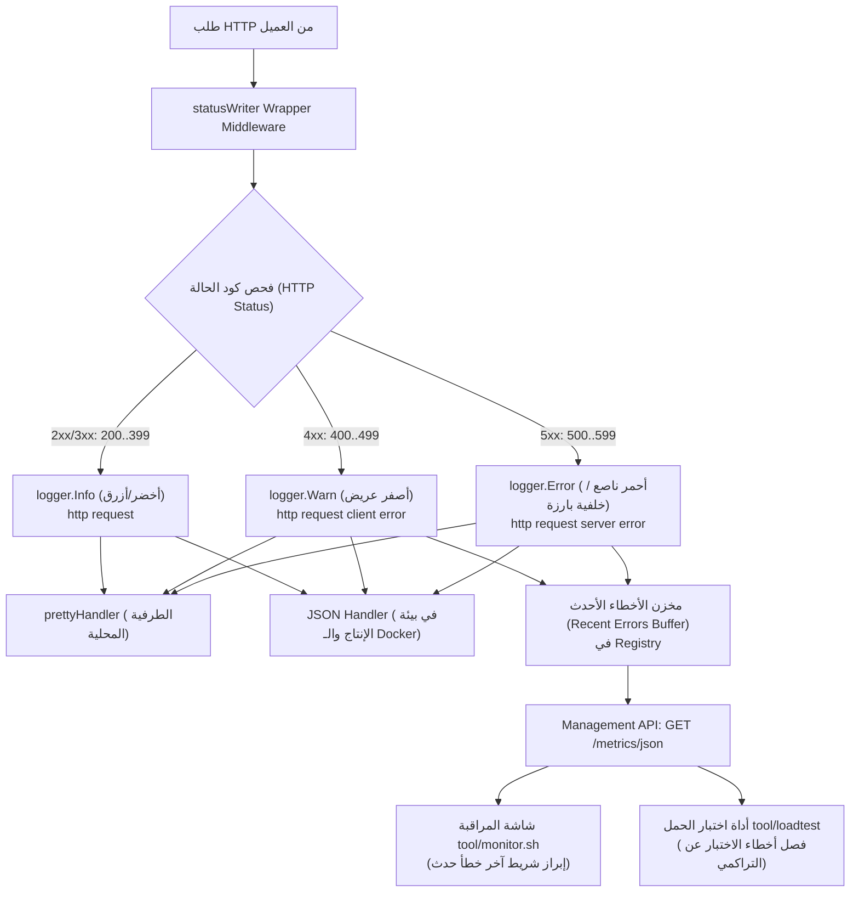

# خطة تنفيذية: إبراز وتنبيه أخطاء HTTP (4xx و 5xx) في الطرفية وشاشات المراقبة

**تاريخ الإعداد:** سبتمبر 2026  
**الحالة:** بانتظار المراجعة والموافقة (Pending Review & Approval)  
**النطاق:** `internal/adapters/http`, `internal/platform/app`, `internal/infrastructure/runtime/metrics`, `tool/monitor.sh`, `tool/loadtest`

---

## 1. ملخص المشكلة وسياق الطلب (Problem Summary & Context)

أثناء تشغيل اختبارات الحمل ومراقبة السيرفر المباشرة، لوحظ ظهور عداد تراكمي في شاشة التحقق المتبادل يشير إلى:
```text
Server 4xx Total: 2
```
ومع ذلك، لم يُلاحظ أي تنبيه مرئي أو تحذير ملون في طرفية السيرفر (`make run`) يسترعي انتباه المطور أو مشغّل النظام، مما أثار التساؤل الجوهري:
> **"لماذا لا تظهر الأخطاء (errors) في الـ terminal إن وُجدت؟ وكيف نضمن ألا يمر أي خطأ مرور الكرام دون لفت الانتباه الفوري؟"**

---

## 2. التحليل والتشخيص الجذري (Root Cause Analysis - RCA)

بعد تدقيق الشيفرة البرمجية الحالية في الخادم وأدوات المراقبة، تبيّن وجود **4 أسباب متضافرة** تجعل الأخطاء غير مرئية عملياً:

### السبب الأول: توحيد مستوى التسجيل في مسجل الطلبات على `INFO` حصراً
في ملف [router.go:293-300](file:///home/osm/StudioProjects/cashflow/cashflow_backend/internal/adapters/http/router.go#L293-L300):
```go
// الكود الحالي:
logger.Info("http request",
    "method", r.Method,
    "path", r.URL.Path,
    "status", ww.Status(),
    "bytes", ww.BytesWritten(),
    "duration_ms", time.Since(start).Milliseconds(),
    "request_id", middleware.GetReqID(r.Context()),
)
```
- **المشكلة:** يتم إرسال جميع الطلبات بمستوى `logger.Info`، سواء كان كود الحالة `200 OK` أو `404 Not Found` أو `401 Unauthorized` أو حتى `500 Internal Server Error`!
- **النتيجة:** لا يُصدر السيرفر إطلاقاً أي سجل بمستوى `WARN` أو `ERROR` في دورة حياة طلبات HTTP العادية، مما يحرم معالجات السجلات والتنبيهات من التقاطها كأحداث استثنائية.

---

### السبب الثاني: غياب تمييز كود الحالة ولونه في معالج الطرفية (`prettyHandler`)
في ملف [app.go:145-153](file:///home/osm/StudioProjects/cashflow/cashflow_backend/internal/platform/app/app.go#L145-L153):
```go
// الكود الحالي:
fmt.Fprintf(h.w, "%s %s%s %-30s", timeStr, levelStr, methodStr, r.Message)

for _, a := range otherAttrs {
    fmt.Fprintf(h.w, " \033[90m%s=\033[0m%v", a.Key, a.Value.Any())
}
```
- **المشكلة:** 
  1. لأن المستوى هو `INFO` دوماً، يُطبع السطر كاملاً باللون الأخضر/الأزرق المعتاد للطلبات الناجحة.
  2. تُطبع سمة `status=404` أو `status=500` بلون رمادي باهت (`\033[90m`) كأي سمة روتينية ثانوية (مثل `bytes=19` أو `request_id=...`).
- **النتيجة:** وسط آلاف الطلبات التي تتدفق بمعدل 2,000+ طلب/ثانية، يتطابق السطر الذي يحتوي على خطأ 404 بصرياً بنسبة 100% مع الطلب الناجح 200، ويستحيل على العين البشرية ملاحظته.

---

### السبب الثالث: افتقار شاشة المراقبة (`monitor.sh`) لتفاصيل آخر الأخطاء (No Error Context)
في شاشة `make monitor`:
- تُعرض الأخطاء فقط كأرقام تراكمية مجردة في السطر:
  `Errors: 4xx: 2 | 5xx: 0 (0.00%)`
- **المشكلة:** لا يوجد أي سياق يوضح:
  - ما هو المسار الذي فشل؟ (هل هو `/unknown` أم `/api/v1/auth` أم `/api/v1/payments`؟)
  - متى وقع الخطأ بالضبط؟ (منذ دقيقة؟ أم منذ ساعتين؟)
  - ما هو كود الحالة الدقيق؟ (404 Not Found أم 403 Forbidden أم 422 Unprocessable Entity؟)

---

### السبب الرابع: غموض تقرير أداة اختبار الحمل (`loadtest`)
في ملف [loadtest/main.go:435](file:///home/osm/StudioProjects/cashflow/cashflow_backend/tool/loadtest/main.go#L435):
- عند انتهاء اختبار الحمل اللحظي (مثلاً 10 ثوانٍ)، تستعلم الأداة عن عدادات نقطة إدارة السيرفر `:8066/metrics/json` وتطبع:
  `Server 4xx Total: 2`
- **المشكلة:** هذا العداد هو تراكمي لكامل عمر السيرفر منذ إقلاعه (Lifetime Cumulative Counter). الخطأان حدثا في جولة اختبارية قديمة أو استكشافية سابقة، بينما الجولة الحالية كانت بنسبة نجاح 100% (0 أخطاء). طباعتها بهذا الشكل تسبب لبساً مباشراً للمطور وتوحي بأن الاختبار الحالي أفرز أخطاء.

---

## 3. الأهداف المعمارية والحلول المقترحة (Proposed Architecture)



---

## 4. خطة التعديلات البرمجية التفصيلية (Step-by-Step Implementation)

### المرحلة الأولى: الارتقاء بمستوى تسجيل الأخطاء في `router.go`
**الملف المستهدف:** [internal/adapters/http/router.go](file:///home/osm/StudioProjects/cashflow/cashflow_backend/internal/adapters/http/router.go)

تعديل دالة `structuredLogger` لتقوم بفحص كود الحالة النهائي وتصنيف مستوى السجل ورسالته ديناميكياً:

```go
func structuredLogger(logger *slog.Logger) func(next http.Handler) http.Handler {
	return func(next http.Handler) http.Handler {
		return http.HandlerFunc(func(w http.ResponseWriter, r *http.Request) {
			start := time.Now()
			ww := middleware.NewWrapResponseWriter(w, r.ProtoMajor)

			next.ServeHTTP(ww, r)

			// Suppress logging for observability probes unless there is an error (status >= 400)
			if (r.URL.Path == "/livez" || r.URL.Path == "/readyz") && ww.Status() < 400 {
				return
			}

			status := ww.Status()
			durationMs := time.Since(start).Milliseconds()
			reqID := middleware.GetReqID(r.Context())

			attrs := []any{
				"method", r.Method,
				"path", r.URL.Path,
				"status", status,
				"bytes", ww.BytesWritten(),
				"duration_ms", durationMs,
				"request_id", reqID,
			}

			switch {
			case status >= 500:
				logger.Error("http request server error", attrs...)
			case status >= 400:
				logger.Warn("http request client error", attrs...)
			default:
				logger.Info("http request", attrs...)
			}
		})
	}
}
```

- **المكاسب:**
  - ينطلق مستوى `WARN` تلقائياً لأخطاء العميل (400, 401, 403, 404, 422).
  - ينطلق مستوى `ERROR` تلقائياً لأخطاء الخادم (500, 502, 503).
  - تصبح مرئية وقابلة للفرز في أي نظام مراقبة مركزي (مثل Datadog, Loki, CloudWatch).

---

### المرحلة الثانية: إبراز أكواد الحالة في معالج الطرفية (`prettyHandler`)
**الملف المستهدف:** [internal/platform/app/app.go](file:///home/osm/StudioProjects/cashflow/cashflow_backend/internal/platform/app/app.go)

تطوير `prettyHandler.Handle` ليميز كود الحالة `status` بتلوين خاص عريض يلفت النظر فورياً، مع إبراز المسار عند وجود خطأ:

```go
// 4. Formatting Attributes with Special Status Highlighting
for _, a := range otherAttrs {
    if a.Key == "status" {
        if sCode, ok := a.Value.Any().(int); ok {
            var sColor string
            switch {
            case sCode >= 500:
                sColor = "\033[1;37;41m" // خلفية حمراء فاقعة بخط أبيض عريض (CRITICAL)
            case sCode >= 400:
                sColor = "\033[1;33m"    // خط أصفر عريض فاقع (WARNING)
            case sCode >= 300:
                sColor = "\033[36m"      // سيان (REDIRECT)
            default:
                sColor = "\033[32m"      // أخضر هادئ (OK)
            }
            fmt.Fprintf(h.w, " %sstatus=%d\033[0m", sColor, sCode)
            continue
        }
    }
    
    // سائر السمات العادية
    fmt.Fprintf(h.w, " \033[90m%s=\033[0m%v", a.Key, a.Value.Any())
}
```

#### المحاكاة البصرية لمظهر الطرفية بعد التعديل:
```text
# طلب ناجح (200 OK):
04:30:15 PM INFO  GET  http request                   path=/api/v1/partners status=200 bytes=542 duration_ms=2

# خطأ عميل (404 Not Found):
04:30:18 PM WARN  GET  http request client error      path=/unknown status=404 bytes=19 duration_ms=0

# خطأ خادم (500 Internal Error):
04:30:22 PM ERROR POST http request server error      path=/api/v1/payments status=500 bytes=85 duration_ms=45
```

---

### المرحلة الثالثة: إضافة مخزن دائري لأحدث الأخطاء في مقاييس الأداء (`Registry`)
**الملفات المستهدفة:** 
- [internal/infrastructure/runtime/metrics/types.go](file:///home/osm/StudioProjects/cashflow/cashflow_backend/internal/infrastructure/runtime/metrics/types.go)
- [internal/infrastructure/runtime/metrics/registry.go](file:///home/osm/StudioProjects/cashflow/cashflow_backend/internal/infrastructure/runtime/metrics/registry.go)

1. تعريف هيكل حدث الخطأ في `types.go`:
```go
type HTTPErrorEvent struct {
    Timestamp time.Time `json:"timestamp"`
    Method    string    `json:"method"`
    Path      string    `json:"path"`
    Status    int       `json:"status"`
    Duration  int64     `json:"duration_ms"`
}
```

2. إضافة مخزن دائري مغلق (Ring Buffer) لآخر 5 أخطاء داخل `Registry`:
- سعة خفيفة جداً (5 عناصر فقط) ذات استهلاك ذاكرة شبه معدوم (< 1 KB).
- حماية بقفل `sync.RWMutex` فائق السرعة، لا يتدخل إطلاقاً إلا عند وقوع خطأ (`status >= 400`).
- تصدير الحقل الجديد `recent_errors` ضمن كائن الـ JSON في `/metrics/json`.

---

### المرحلة الرابعة: إضافة تنبيه آخر خطأ في شاشة المراقبة (`monitor.sh`)
**الملف المستهدف:** [tool/monitor.sh](file:///home/osm/StudioProjects/cashflow/cashflow_backend/tool/monitor.sh)

إضافة قراءة حقل `recent_errors` وعرض أحدث خطأ مباشرة تحت سطر `Traffic & Throughput`:
- إذا لم تكن هناك أخطاء:
  `Recent Errors: None (All systems healthy)`
- إذا وُجد خطأ:
  `Last Error:    [404] GET /unknown (15s ago)` باللون الأصفر أو الأحمر العريض.

---

### المرحلة الخامسة: احتساب دلتا الأخطاء في أداة اختبار الحمل (`loadtest`)
**الملف المستهدف:** [tool/loadtest/main.go](file:///home/osm/StudioProjects/cashflow/cashflow_backend/tool/loadtest/main.go)

1. تسجيل قراءة مبدئية لعدادات 4xx و 5xx من السيرفر **قبل** بدء تشغيل الاختبار:
   `initial4xx = getFloat(m, "http_4xx_total")`
2. عند انتهاء الاختبار، احتساب الفارق الدقيق:
   `testRun4xx = final4xx - initial4xx`
3. طباعة التقرير بوضوح لا يقبل اللبس:
```text
=================================================================
   SERVER TELEMETRY CROSS-CHECK (:8066)
=================================================================
  Test Session Errors:   4xx: 0 | 5xx: 0 (100.0% Success in this run)
  Server Lifetime Total: 56,555 requests (Cumulative since boot)
  Server Lifetime Errors:4xx: 2 (Historical) | 5xx: 0
=================================================================
```

---

## 5. خطة التحقق والاختبار (Verification Plan)

| الرقم | سيناريو الاختبار | الإجراء | النتيجة المتوقعة |
| :---: | :--- | :--- | :--- |
| **1** | **طلب ناجح (200 OK)** | `curl -i http://localhost:8070/readyz` | يظهر بمستوى `INFO` وباللون الأخضر الهادئ لـ `status=200`. |
| **2** | **خطأ مسار غير موجود (404)** | `curl -i http://localhost:8070/api/v1/invalid-route` | يظهر فوراً في الطرفية بوسم `WARN` أصفر عريض ورسالة `http request client error` مع `status=404` بالأصفر الفاقع. |
| **3** | **خطأ غير مصرح (401)** | `curl -i http://localhost:8070/api/v1/partners` بدون Token | يظهر بوسم `WARN` أصفر مع `status=401`. |
| **4** | **شاشة المراقبة (`monitor.sh`)** | مراقبة الشاشة بعد استدعاء المسار 404 | يظهر سطر جديد فورياً: `Last Error: [404] GET /api/v1/invalid-route`. |
| **5** | **اختبار الحمل (`loadtest`)** | تشغيل `go run ./tool/loadtest -mode erp-suite -c 10 -d 5s` | إظهار `Test Session Errors: 0` بوضوح مع عزل العداد التاريخي التراكمي. |
| **6** | **سلامة البناء والاختبارات** | تشغيل `go test ./...` | نجاح جميع الاختبارات التلقائية دون أي انكسار أو تراجع. |

---

## 6. تقييم المخاطر والأداء (Risk & Performance Assessment)

- **استهلاك الذاكرة والـ CPU:**
  - التعديل على مستوى المسجل `structuredLogger` هو مجرد جملة `switch` سريعة على كود الحالة الموجود بالفعل في الذاكرة (0 ns إضافية).
  - حلقة تخزين الأخطاء لا تسجل إلا عند `status >= 400`، وبالتالي في الحالات الطبيعية الناجحة فإن كلفتها **0.00%** ولا تؤثر على أداء السيرفر البالغ 10,000+ طلب/ثانية.
- **التوافقية مع بيئات الإنتاج (Production Logging):**
  - في بيئة الإنتاج حيث يكتب السيرفر بصيغة `JSON` (وليس للطرفية)، ستنتقل السجلات تلقائياً بمستويات `WARN` و `ERROR` الحقيقية في حقل `"level": "WARN"`، مما يتيح لأنظمة المراقبة (Grafana Loki, Elastic, Datadog) إطلاق تنبيهات PagerDuty بدقة فائقة بدلاً من تجاهلها.
