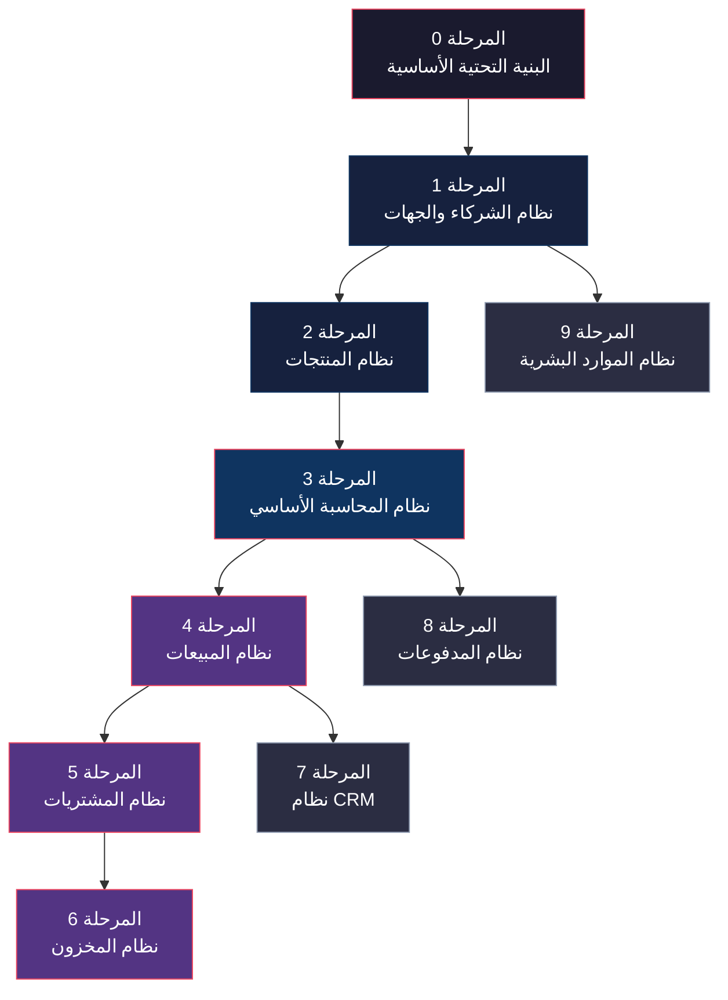
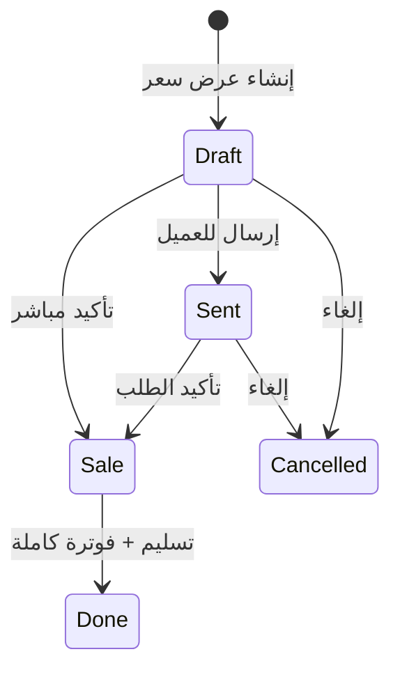

# إعادة بناء Odoo 19.0 كـ Go Backend — خطة تنفيذية مرحلية

## السياق

**المشروع الحالي**: [cashflow_backend](file:///home/osm/StudioProjects/cashflow_backend) — خادم Go بهيكل Clean Architecture (Chi + pgx + slog) يدير معاملات مالية بسيطة.

**المصدر**: [Odoo 19.0](file:///home/osm/Downloads/odoo-19.0/odoo-19.0) — نظام ERP كامل بـ Python يحتوي على **632 موديول** تشمل: محاسبة، مبيعات، مشتريات، مخزون، CRM، موارد بشرية، تصنيع، وغيرها.

**الهدف**: إعادة بناء الأنظمة الأساسية لـ Odoo كـ Go REST API backend باستخدام بنية المشروع الحالية (Clean Architecture).

---

## User Review Required

> [!IMPORTANT]
> هذا مشروع ضخم جداً. Odoo هو نظام ERP كامل تم بناؤه على مدار **20+ سنة** بواسطة مئات المطورين. لا يمكن إعادة بنائه بالكامل في جلسة واحدة أو حتى شهر واحد.
>
> الخطة أدناه مقسمة إلى **10 مراحل مستقلة**، كل مرحلة تُنتج نظاماً قابلاً للاستخدام بمفرده. يمكنك التوقف بعد أي مرحلة والحصول على منتج فعال.

> [!WARNING]
> **لن نستنسخ الـ ORM الخاص بـ Odoo** (Python metaclasses + magic fields). بدلاً من ذلك سنستخدم الـ Go idioms: structs + interfaces + repository pattern. هذا أنظف وأسرع.

---

## Open Questions

> [!IMPORTANT]
>
> 1. **أي الأنظمة لها الأولوية؟** هل تحتاج فقط المحاسبة والمبيعات؟ أم تريد كل الأنظمة؟
> 2. **هل تريد نظام Multi-Tenant** (شركات متعددة) كما في Odoo؟
> 3. **هل تريد نظام Auth/ACL** كامل (users, groups, permissions) أم ستستخدم حل خارجي؟
> 4. **هل تريد نظام Localization (l10n)** للدول المختلفة (ضرائب، فواتير)؟
> 5. **هل هذا المشروع سيظل باسم `cashflow_backend`** أم تريد تغيير الاسم (مثل `erp_backend`)؟

---

## نظرة عامة على المراحل



---

## المرحلة 0: البنية التحتية الأساسية (Foundation)

**الهدف**: تطوير البنية الحالية لتدعم نظام ERP كامل — هذه المرحلة **لا تضيف أي business logic** بل تجهز الأساس.

**مصدر Odoo المقابل**: `odoo/orm/`, `odoo/api/`, `odoo/fields/`, `odoo/service/security.py`

### المكونات

#### [NEW] `internal/platform/database/migrator.go`

- نظام database migrations تلقائي (مثل `golang-migrate`)
- إنشاء وتعديل الجداول تلقائياً عند إضافة domain entities جديدة

#### [NEW] `internal/platform/database/pagination.go`

- Generic pagination: `PageRequest{Page, Size, Sort}` → `PageResult{Items, Total, Pages}`
- يدعم cursor-based و offset-based pagination

#### [NEW] `internal/platform/database/filters.go`

- Dynamic filtering system مُستوحى من Odoo domains: `[("field","operator","value")]`
- Go implementation: `Filter{Field, Op, Value}` → SQL WHERE clause builder

#### [NEW] `internal/platform/auth/` (اختياري)

- JWT authentication middleware
- RBAC: `User`, `Role`, `Permission` entities
- Session management

#### [NEW] `internal/platform/audit/audit.go`

- Audit trail لجميع العمليات (من يعدل ماذا ومتى) — مقابل `create_uid`, `write_uid` في Odoo

#### [MODIFY] `internal/infrastructure/config/config.go`

- إضافة App-level config: `APP_NAME`, `APP_VERSION`, `COMPANY_MODE` (single/multi)

#### [MODIFY] `Makefile`

- إضافة أوامر: `make migrate-up`, `make migrate-down`, `make seed`

#### [MODIFY] `docker-compose.yml`

- إضافة Redis (للـ caching والـ sessions)

### الملفات المتأثرة

| ملف | حالة | الوصف |
| ------ | ------ | ------ |
| `internal/platform/database/migrator.go` | NEW | Database migration engine |
| `internal/platform/database/pagination.go` | NEW | Generic pagination |
| `internal/platform/database/filters.go` | NEW | Domain-style filters |
| `internal/platform/database/tx.go` | NEW | Transaction manager (Unit of Work) |
| `internal/platform/audit/audit.go` | NEW | Audit trail fields |
| `internal/platform/errors/errors.go` | NEW | Standardized error types |
| `go.mod` | MODIFY | Add golang-migrate, uuid, jwt deps |
| `Makefile` | MODIFY | Migration commands |
| `docker-compose.yml` | MODIFY | Redis service |

**تقدير الجهد**: ~2-3 أيام

---

## المرحلة 1: نظام الشركاء والجهات (Contacts / Partners)

**الهدف**: بناء نظام `res.partner` — العمود الفقري لكل نظام ERP (عملاء، موردين، موظفين).

**مصدر Odoo المقابل**: `addons/contacts/`, `odoo/addons/base/models/res_partner.py`

### Domain Entities

```go
// internal/domain/partner/partner.go
type Partner struct {
    ID           int64
    Name         string
    Email        string
    Phone        string
    Mobile       string
    Type         PartnerType      // company | individual
    IsCustomer   bool
    IsSupplier   bool
    VATNumber    string
    Website      string
    CompanyID    *int64           // parent company
    Street       string
    City         string
    State        string
    Country      string
    ZipCode      string
    Active       bool
    CreatedAt    time.Time
    UpdatedAt    time.Time
    CreatedBy    int64
    UpdatedBy    int64
}
```

### API Endpoints

```
POST   /api/v1/partners          Create partner
GET    /api/v1/partners          List partners (with filters & pagination)
GET    /api/v1/partners/{id}     Get partner by ID
PUT    /api/v1/partners/{id}     Update partner
DELETE /api/v1/partners/{id}     Soft delete partner
GET    /api/v1/partners/customers List customers only
GET    /api/v1/partners/suppliers List suppliers only
```

### بنية الملفات

```
internal/domain/partner/
├── partner.go          # Entity + validation
├── ports.go            # Repository interface
internal/usecase/partner/
├── partner_usecase.go  # Business logic
internal/adapters/http/partner/
├── handler.go          # HTTP handlers
├── dto.go              # Request/Response DTOs
├── routes.go           # Chi routes
internal/adapters/storage/partner/
├── postgres_repo.go    # PostgreSQL implementation
```

**تقدير الجهد**: ~2 أيام

---

## المرحلة 2: نظام المنتجات (Products)

**الهدف**: بناء كتالوج المنتجات بالكامل — من أهم الأنظمة التي يعتمد عليها المبيعات والمشتريات والمخزون.

**مصدر Odoo المقابل**: `addons/product/models/`, `addons/uom/`

### Domain Entities

```go
// Product Template (مثل Odoo product.template)
type ProductTemplate struct {
    ID          int64
    Name        string
    Type        ProductType     // goods | service | consumable
    Category    *ProductCategory
    InternalRef string          // SKU
    Barcode     string
    SalePrice   decimal.Decimal
    CostPrice   decimal.Decimal
    UoM         *UnitOfMeasure
    Active      bool
    Attributes  []ProductAttribute
}

// Product Variant (مثل Odoo product.product)
type ProductVariant struct {
    ID         int64
    TemplateID int64
    Attributes []AttributeValue // color=red, size=XL
    Barcode    string
    ExtraPrice decimal.Decimal
}

// Product Category
type ProductCategory struct {
    ID       int64
    Name     string
    ParentID *int64
    Path     string  // hierarchical path
}

// Unit of Measure
type UnitOfMeasure struct {
    ID         int64
    Name       string
    Category   string  // Weight, Volume, Unit
    Ratio      float64
}

// Pricelist (قوائم الأسعار)
type Pricelist struct {
    ID       int64
    Name     string
    Currency string
    Items    []PricelistItem
}
```

### API Endpoints

```
# Products
POST   /api/v1/products
GET    /api/v1/products
GET    /api/v1/products/{id}
PUT    /api/v1/products/{id}
DELETE /api/v1/products/{id}
GET    /api/v1/products/{id}/variants

# Categories
CRUD   /api/v1/product-categories

# Pricelists
CRUD   /api/v1/pricelists

# Units of Measure
CRUD   /api/v1/uom
```

**تقدير الجهد**: ~3 أيام

---

## المرحلة 3: نظام المحاسبة الأساسي (Core Accounting)

**الهدف**: بناء نظام محاسبة مزدوج القيد (Double-Entry Bookkeeping) — قلب Odoo.

**مصدر Odoo المقابل**: `addons/account/models/` (40+ ملف)

> [!IMPORTANT]
> هذه أعقد مرحلة. نظام المحاسبة في Odoo يحتوي على 40+ model. سنبني الأساسيات فقط.

### Domain Entities

```go
// دليل الحسابات (Chart of Accounts)
type Account struct {
    ID         int64
    Code       string          // "1001", "4001"
    Name       string
    Type       AccountType     // asset, liability, equity, income, expense
    Currency   string
    Reconcile  bool
    Active     bool
}

// دفتر اليومية (Journal)
type Journal struct {
    ID   int64
    Name string
    Code string           // "INV", "BILL", "CASH", "BANK"
    Type JournalType      // sale, purchase, cash, bank, general
}

// القيد المحاسبي (Account Move = Invoice/Bill/Entry)
type AccountMove struct {
    ID          int64
    Name        string        // "INV/2026/0001"
    MoveType    MoveType      // out_invoice, in_invoice, entry
    JournalID   int64
    PartnerID   *int64
    Date        time.Time
    State       MoveState     // draft, posted, cancelled
    Lines       []AccountMoveLine
    AmountTotal decimal.Decimal
    AmountDue   decimal.Decimal
}

// سطر القيد (Account Move Line)
type AccountMoveLine struct {
    ID        int64
    MoveID    int64
    AccountID int64
    PartnerID *int64
    Name      string
    Debit     decimal.Decimal
    Credit    decimal.Decimal
    Balance   decimal.Decimal
    TaxIDs    []int64
}

// الضرائب
type Tax struct {
    ID      int64
    Name    string
    Rate    decimal.Decimal  // 15.0 (%)
    Type    TaxType          // percent, fixed
    Scope   TaxScope         // sale, purchase
}

// شروط الدفع
type PaymentTerm struct {
    ID    int64
    Name  string
    Lines []PaymentTermLine
}
```

### Business Rules (القواعد المحاسبية الحيوية)

- **Balanced Entries**: كل قيد يجب أن يكون `SUM(debit) == SUM(credit)`
- **Sequence Generation**: أرقام الفواتير التسلسلية `INV/2026/0001`
- **State Machine**: `draft → posted → cancelled` (لا يمكن تعديل المنشور)
- **Auto-compute**: حساب الضريبة والإجمالي تلقائياً

### API Endpoints

```
# Chart of Accounts
CRUD   /api/v1/accounts

# Journals
CRUD   /api/v1/journals

# Invoices & Bills (Account Moves)
POST   /api/v1/invoices                    Create invoice
GET    /api/v1/invoices                    List invoices
GET    /api/v1/invoices/{id}               Get invoice
PUT    /api/v1/invoices/{id}               Update draft invoice
POST   /api/v1/invoices/{id}/post          Post (confirm) invoice
POST   /api/v1/invoices/{id}/cancel        Cancel invoice

# Taxes
CRUD   /api/v1/taxes

# Reports
GET    /api/v1/reports/trial-balance       ميزان المراجعة
GET    /api/v1/reports/profit-loss         قائمة الدخل
GET    /api/v1/reports/balance-sheet       الميزانية العمومية
```

**تقدير الجهد**: ~5-7 أيام

---

## المرحلة 4: نظام المبيعات (Sales)

**الهدف**: بناء دورة المبيعات الكاملة: عرض سعر → أمر بيع → فاتورة.

**مصدر Odoo المقابل**: `addons/sale/models/`

### Domain Entities

```go
type SaleOrder struct {
    ID           int64
    Name         string         // "SO001"
    PartnerID    int64          // العميل
    DateOrder    time.Time
    State        SOState        // draft, sent, sale, done, cancel
    Lines        []SaleOrderLine
    AmountUntaxed decimal.Decimal
    AmountTax     decimal.Decimal
    AmountTotal   decimal.Decimal
    PricelistID   *int64
    PaymentTermID *int64
    InvoiceIDs    []int64        // الفواتير المرتبطة
}

type SaleOrderLine struct {
    ID          int64
    OrderID     int64
    ProductID   int64
    Description string
    Quantity    decimal.Decimal
    UoMID       int64
    UnitPrice   decimal.Decimal
    Discount    decimal.Decimal  // %
    TaxIDs      []int64
    Subtotal    decimal.Decimal
    QtyInvoiced decimal.Decimal
    QtyDelivered decimal.Decimal
}
```

### Workflow



### API Endpoints

```
CRUD   /api/v1/sale-orders
POST   /api/v1/sale-orders/{id}/confirm     Confirm quotation → Sale Order
POST   /api/v1/sale-orders/{id}/cancel      Cancel order
POST   /api/v1/sale-orders/{id}/invoice     Create invoice from SO
```

**تقدير الجهد**: ~3-4 أيام

---

## المرحلة 5: نظام المشتريات (Purchase)

**الهدف**: بناء دورة المشتريات: طلب شراء → أمر شراء → فاتورة مورد.

**مصدر Odoo المقابل**: `addons/purchase/models/`

### Domain Entities

```go
type PurchaseOrder struct {
    ID           int64
    Name         string         // "PO001"
    PartnerID    int64          // المورد
    DateOrder    time.Time
    DatePlanned  time.Time      // تاريخ التوريد المتوقع
    State        POState        // draft, sent, purchase, done, cancel
    Lines        []PurchaseOrderLine
    AmountTotal  decimal.Decimal
    BillIDs      []int64        // فواتير الموردين المرتبطة
}
```

### API Endpoints

```
CRUD   /api/v1/purchase-orders
POST   /api/v1/purchase-orders/{id}/confirm
POST   /api/v1/purchase-orders/{id}/cancel
POST   /api/v1/purchase-orders/{id}/bill     Create vendor bill
```

**تقدير الجهد**: ~2-3 أيام (مشابه جداً للمبيعات)

---

## المرحلة 6: نظام المخزون (Inventory / Stock)

**الهدف**: بناء نظام إدارة المخازن والمخزون.

**مصدر Odoo المقابل**: `addons/stock/models/`

### Domain Entities

```go
type Warehouse struct {
    ID       int64
    Name     string
    Code     string
    Location StockLocation
}

type StockLocation struct {
    ID       int64
    Name     string
    Type     LocationType  // internal, supplier, customer, transit
    ParentID *int64
}

type StockMove struct {
    ID             int64
    ProductID      int64
    SourceLocation int64
    DestLocation   int64
    Quantity       decimal.Decimal
    UoMID          int64
    State          MoveState  // draft, confirmed, done, cancelled
    PickingID      *int64
}

type StockPicking struct {
    ID            int64
    Name          string      // "WH/OUT/00001"
    PickingType   PickingType // incoming, outgoing, internal
    PartnerID     *int64
    SourceOrderID *int64      // SO or PO reference
    State         PickingState
    Moves         []StockMove
}

type StockQuant struct {  // الرصيد الفعلي
    ProductID  int64
    LocationID int64
    Quantity   decimal.Decimal
    LotID      *int64
}
```

### API Endpoints

```
CRUD   /api/v1/warehouses
CRUD   /api/v1/stock-locations
CRUD   /api/v1/stock-pickings
POST   /api/v1/stock-pickings/{id}/validate   Confirm delivery/receipt
GET    /api/v1/stock/on-hand                  Current stock levels
GET    /api/v1/stock/moves                    Stock movement history
```

**تقدير الجهد**: ~4-5 أيام

---

## المرحلة 7: نظام CRM (إدارة علاقات العملاء)

**الهدف**: بناء pipeline المبيعات وإدارة الفرص.

**مصدر Odoo المقابل**: `addons/crm/models/`

### Domain Entities

```go
type Lead struct {
    ID           int64
    Name         string
    PartnerID    *int64
    Type         LeadType     // lead, opportunity
    StageID      int64
    SalespersonID *int64
    ExpectedRevenue decimal.Decimal
    Probability     float64
    Source       string
    LostReasonID *int64
    DateDeadline *time.Time
    Notes        string
}

type Stage struct {
    ID       int64
    Name     string       // New, Qualified, Proposal, Won, Lost
    Sequence int
    IsClosed bool
}
```

### API Endpoints

```
CRUD   /api/v1/leads
POST   /api/v1/leads/{id}/convert      Convert lead → opportunity
POST   /api/v1/leads/{id}/won          Mark as won → create SO
POST   /api/v1/leads/{id}/lost         Mark as lost
GET    /api/v1/crm/pipeline             Pipeline view (grouped by stage)
GET    /api/v1/crm/stats                Win rate, revenue stats
```

**تقدير الجهد**: ~2-3 أيام

---

## المرحلة 8: نظام المدفوعات (Payments)

**الهدف**: تسجيل المدفوعات ومطابقتها مع الفواتير.

**مصدر Odoo المقابل**: `addons/account_payment/`, `addons/account/models/account_payment.py`

### Domain Entities

```go
type Payment struct {
    ID           int64
    Name         string        // "PAY/2026/0001"
    PartnerID    int64
    Amount       decimal.Decimal
    PaymentType  PaymentType   // inbound (تحصيل), outbound (صرف)
    PaymentMethod string       // cash, bank_transfer, check
    JournalID    int64         // البنك أو الصندوق
    Date         time.Time
    State        PaymentState  // draft, posted, reconciled, cancelled
    InvoiceIDs   []int64       // الفواتير المطبقة عليها
    MoveID       *int64        // القيد المحاسبي التلقائي
}
```

### API Endpoints

```
CRUD   /api/v1/payments
POST   /api/v1/payments/{id}/post
POST   /api/v1/payments/{id}/reconcile    Match with invoices
GET    /api/v1/payments/receivable        Aging report (تقادم المستحقات)
GET    /api/v1/payments/payable           Aging report (تقادم الموردين)
```

**تقدير الجهد**: ~3 أيام

---

## المرحلة 9: نظام الموارد البشرية الأساسي (HR)

**الهدف**: إدارة الموظفين، الأقسام، الإجازات.

**مصدر Odoo المقابل**: `addons/hr/`, `addons/hr_holidays/`, `addons/hr_expense/`

### Domain Entities

```go
type Employee struct {
    ID           int64
    Name         string
    PartnerID    *int64        // linked partner
    DepartmentID *int64
    JobID        *int64
    ManagerID    *int64
    WorkEmail    string
    WorkPhone    string
    HireDate     time.Time
    Active       bool
}

type Department struct {
    ID       int64
    Name     string
    ParentID *int64
    ManagerID *int64
}

type LeaveRequest struct {
    ID           int64
    EmployeeID   int64
    LeaveType    string
    DateFrom     time.Time
    DateTo       time.Time
    Days         float64
    State        LeaveState   // draft, confirm, validate, refuse
    Description  string
}
```

### API Endpoints

```
CRUD   /api/v1/employees
CRUD   /api/v1/departments
CRUD   /api/v1/leave-requests
POST   /api/v1/leave-requests/{id}/approve
POST   /api/v1/leave-requests/{id}/refuse
GET    /api/v1/employees/{id}/leave-balance
```

**تقدير الجهد**: ~3 أيام

---

## ملخص المراحل والتبعيات

| المرحلة | النظام | يعتمد على | الجهد | الأولوية | الحالة |
| --------- | -------- | ----------- | ------ | --------- | ------ |
| **0** | البنية التحتية الأساسية | — | 2-3 أيام | 🔴 حرج | ✅ مكتملة |
| **1** | الشركاء والجهات (res.partner) | M0 | 2 أيام | 🔴 حرج | ✅ مكتملة |
| **2** | نظام المنتجات (product.template) | M0 | 3 أيام | 🔴 حرج | ✅ مكتملة |
| **3** | المحاسبة (account.move) | M0, M1, M2 | 5-7 أيام | 🔴 حرج | ⏳ المرحلة القادمة |
| **4** | المبيعات (sale.order) | M1, M2, M3 | 3-4 أيام | 🟡 مهم | ⏳ قيد الانتظار |
| **5** | المشتريات (purchase.order) | M1, M2, M3 | 2-3 أيام | 🟡 مهم | ⏳ قيد الانتظار |
| **6** | المخزون (stock.picking) | M2, M4, M5 | 4-5 أيام | 🟡 مهم | ⏳ قيد الانتظار |
| **7** | CRM (crm.lead) | M1 | 2-3 أيام | 🟢 اختياري | ⏳ قيد الانتظار |
| **8** | المدفوعات (account.payment) | M3 | 3 أيام | 🟡 مهم | ⏳ قيد الانتظار |
| **9** | الموارد البشرية (hr.employee) | M1 | 3 أيام | 🟢 اختياري | ⏳ قيد الانتظار |

**الإجمالي التقريبي**: 30-40 يوم عمل للأنظمة الأساسية

---

## البنية المعمارية النهائية

```
cashflow_backend/
├── cmd/server/main.go
├── internal/
│   ├── domain/                    # Pure business entities & rules
│   │   ├── partner/               # M1
│   │   ├── product/               # M2
│   │   ├── accounting/            # M3
│   │   ├── sale/                  # M4
│   │   ├── purchase/              # M5
│   │   ├── stock/                 # M6
│   │   ├── crm/                   # M7
│   │   ├── payment/               # M8
│   │   └── hr/                    # M9
│   ├── usecase/                   # Application business logic
│   │   ├── partner/
│   │   ├── product/
│   │   └── ...
│   ├── adapters/
│   │   ├── http/                  # REST API handlers
│   │   │   ├── partner/
│   │   │   ├── product/
│   │   │   └── ...
│   │   └── storage/               # PostgreSQL repos
│   │       ├── partner/
│   │       ├── product/
│   │       └── ...
│   ├── infrastructure/            # Server, config, health
│   └── platform/                  # M0: Shared utilities
│       ├── database/              # Migration, pagination, filters
│       ├── auth/                  # Authentication & authorization
│       ├── audit/                 # Audit trail
│       └── errors/                # Standardized errors
├── migrations/                    # SQL migration files
├── Makefile
├── docker-compose.yml
└── go.mod
```

---

## Verification Plan

### Automated Tests

- كل مرحلة تشمل unit tests للـ domain و usecase
- Integration tests للـ storage مع PostgreSQL فعلي (testcontainers)
- HTTP handler tests باستخدام `httptest`
- `make test` و `make test-race` بعد كل مرحلة

### Manual Verification

- `make run` ثم اختبار الـ APIs يدوياً عبر curl أو Postman
- التحقق من صحة القيود المحاسبية (balanced entries)
- اختبار الـ workflows (draft → confirmed → done)

---

## التوصية: من أين نبدأ؟

أوصي بالبدء بـ **المرحلة 0 + المرحلة 1** معاً لأنهما أساس كل شيء. بعد إتمامهما يمكنك اختيار أي مرحلة حسب أولوية عملك.

**هل توافق على هذه الخطة؟ وأي المراحل تريد أن نبدأ بها أولاً؟**
