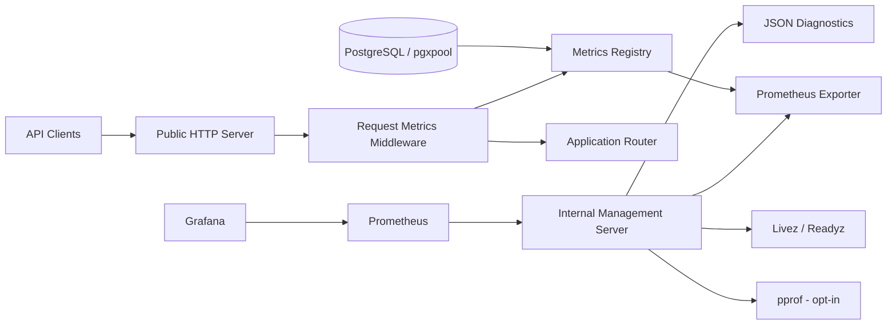

# خطة تنفيذ منظومة المراقبة والمقاييس

## المرجع

هذه الخطة مبنية على تقرير [مقارنة أدوات المراقبة والمقاييس](compare_metrics_analysis.md)، وتهدف إلى نقل منظومة المراقبة في `cashflow_backend` من مخرجات JSON تجميعية فقط إلى منظومة قابلة للربط مباشرة مع Prometheus وGrafana، مع الحفاظ على واجهات الصحة الحالية والتوافق مع التشغيل المحلي وDocker.

## الهدف التنفيذي

إنشاء منظومة Observability عملية وآمنة تحقق الآتي:

1. إبقاء `GET /metrics` بصيغة JSON للتشخيص المحلي والتوافق الرجعي.
2. إضافة نقطة Prometheus قياسية بصيغة OpenMetrics/Prometheus.
3. توفير مقاييس HTTP وقاعدة البيانات والنظام بمقاييس قابلة للتجميع والتنبيه.
4. فصل واجهات الإدارة والمراقبة عن واجهة API العامة أو حمايتها بخيار واضح عند تعذر الفصل.
5. تأمين `pprof` وعدم كشفه افتراضياً على الإنترنت.
6. توفير Dashboard وملفات تشغيل قابلة للاستخدام مع Prometheus وGrafana.
7. تغطية السلوك باختبارات وحدات وتكامل واختبارات تشغيل وإيقاف.

## نطاق الإصدار الأول

### داخل النطاق

- Prometheus exposition endpoint.
- عدادات وHistogram لطلبات HTTP.
- مقاييس صحة وحالة حوض PostgreSQL.
- مقاييس Go runtime والذاكرة ومدة التشغيل.
- إعدادات منفذ الإدارة، تفعيل المقاييس، وتفعيل pprof.
- خادم إدارة منفصل اختياري، مع graceful shutdown ضمن دورة حياة الخادم.
- ملف scrape لـ Prometheus ولوحة Grafana أولية.
- توثيق التشغيل، الأمن، واختبارات التحقق.

### خارج النطاق المبدئي

- جمع RUM من المتصفح أو تطبيقات الجوال.
- نظام plugins لتجميع مقاييس خارجية.
- تتبع موزع كامل عبر OpenTelemetry وtraces.
- مقاييس تفصيلية لكل استعلام SQL قبل وجود حدود واضحة للتكلفة والخصوصية.
- إرسال Telemetry خارجي مجهول الهوية.

## مبادئ التصميم والقرارات

1. **التوافق الرجعي:** لا يزال `/metrics` JSON متاحاً، وتضاف نقطة Prometheus جديدة مثل `/metrics/prometheus` أو `/metrics` على منفذ الإدارة وفق قرار التنفيذ النهائي. يجب تثبيت المسار في توثيق API قبل دمجه.
2. **عزل الإدارة:** الخيار المفضل هو خادم إدارة داخلي مستقل. إن تعذر ذلك في بيئة معينة، يستخدم Middleware تقييد شبكة أو مصادقة قوية، ولا يعتمد على إخفاء المسار.
3. **لا توجد مقاييس عالية الكاردينالية:** لا تستخدم URL الخام أو `user_id` أو `request_id` كوسوم. يستخدم route template المنطقي مثل `/api/v1/partners/{id}`.
4. **الفصل بين health وmetrics:** لا تدخل طلبات `/metrics`, `/livez`, `/readyz` في عدادات حركة API، كما هو مطبق حالياً.
5. **pprof مغلق افتراضياً في الإنتاج:** تفعيله يتطلب إعداداً صريحاً، ويستمع على واجهة الإدارة فقط.
6. **مصدر واحد للحقيقة:** يسجل نظام المقاييس القيم داخلياً، ثم يصدّرها بصيغتي JSON وPrometheus دون تكرار عدادات مستقلة.
7. **عدم كسر بنية Clean Architecture:** تبقى معرفة Prometheus داخل طبقة runtime/metrics أو adapter مخصص، ولا تتسرب إلى domain أو usecase.

## المعمارية المستهدفة



## خطة التنفيذ المرحلية

### المرحلة 0: تثبيت خط الأساس والجرد

**الهدف:** توثيق السلوك الحالي قبل التغيير، وتحديد نقاط الدمج الفعلية.

**المهام:**

- جرد تسجيل المسارات في `internal/adapters/http/router.go`، بما في ذلك `/metrics`, `/livez`, `/readyz`, و`/debug` إن كان مسجلاً فعلاً.
- تتبع دورة حياة الخادم في `internal/infrastructure/runtime/server/server.go` و`internal/platform/app/app.go` لتحديد مكان تشغيل وإيقاف خادم الإدارة.
- توثيق شكل JSON الحالي من `internal/infrastructure/runtime/metrics/metrics.go` وعدم تغيير أسماء الحقول في الإصدار الأول.
- إضافة اختبارات baseline للمسارات الحالية: status code، `Content-Type`، واستثناء مسارات المراقبة من عدادات HTTP.
- التحقق من أن فشل readiness لا يغير liveness وأن الإيقاف يمر عبر drain ثم graceful shutdown.

**المخرجات:** قائمة مسارات معتمدة، اختبارات baseline، وقرار نهائي لمسار Prometheus.

**معيار الإتمام:** يمكن تشغيل `go test ./...` قبل أي تغيير معماري وتوجد اختبارات تصف السلوك المراد الحفاظ عليه.

### المرحلة 1: عقد المقاييس وRegistry داخلي

**الهدف:** فصل جمع المقاييس عن طريقة التصدير.

**الملفات المتوقعة:**

| الملف | الإجراء | المسؤولية |
| --- | --- | --- |
| `internal/infrastructure/runtime/metrics/metrics.go` | تعديل | الحفاظ على counters الحالية وتوسيع snapshot الداخلي |
| `internal/infrastructure/runtime/metrics/registry.go` | جديد | Registry آمن للتسجيل والتجميع والتصدير |
| `internal/infrastructure/runtime/metrics/types.go` | جديد أو دمج | تعريف Metric families وlabels المسموح بها |
| `internal/infrastructure/runtime/metrics/metrics_test.go` | تعديل/جديد | اختبارات atomicity، snapshot، والقيم الصفرية |

**التصميم المقترح:**

- `Counter` للطلبات والأخطاء وعدد الاتصالات.
- `Histogram` لزمن الطلب، مع buckets ثابتة بالثواني مثل `0.005`, `0.01`, `0.025`, `0.05`, `0.1`, `0.25`, `0.5`, `1`, `2.5`, `5`, `10`.
- `Gauge` للقيم الحالية مثل الاتصالات النشطة وعدد Goroutines.
- واجهة snapshot لا تعتمد على HTTP أو Chi.
- تسجيل labels من قائمة محددة ومراجعة؛ route template وmethod وstatus class فقط في الإصدار الأول.

**معيار الإتمام:** كل قيمة تصدّرها JSON أو Prometheus تأتي من نفس registry، ولا توجد عدادات متنافسة لنفس الحدث.

### المرحلة 2: تصدير Prometheus/OpenMetrics

**الهدف:** توفير endpoint قياسي قابل للسحب من Prometheus وVictoriaMetrics وGrafana.

**المهام:**

- اختيار الاعتماد الرسمي `github.com/prometheus/client_golang` بعد قياس أثره على `go.mod` وحجم البناء؛ لا يضاف dependency مكرر إذا كان موجوداً بالفعل.
- تعريف naming convention موحد، مثلاً:
  - `cashflow_http_requests_total{method,route,status_class}`
  - `cashflow_http_request_duration_seconds{method,route}`
  - `cashflow_process_uptime_seconds`
  - `cashflow_go_goroutines`
  - `cashflow_go_memory_alloc_bytes`
  - `cashflow_db_pool_max_connections`
  - `cashflow_db_pool_active_connections`
  - `cashflow_db_pool_idle_connections`
  - `cashflow_db_pool_wait_count_total`
- إضافة handler مستقل يضبط `Content-Type` الصحيح ويمنع cache غير المقصود.
- اختبار exposition باستخدام parser رسمي أو parser بسيط من المكتبة، والتحقق من عدم وجود أسماء أو labels غير صالحة.
- توثيق ما إذا كانت القيم cumulative counters أم gauges، وعدم إعادة تصفيرها أثناء runtime.

**معيار الإتمام:** يستطيع Prometheus scrape endpoint بنجاح، وتظهر المقاييس في `/api/v1/query` دون أخطاء parse.

### المرحلة 3: مقاييس HTTP وقاعدة البيانات بمستوى تفصيل مضبوط

**الهدف:** الانتقال من المتوسط العام إلى مؤشرات تساعد في تحديد الوحدة أو route البطيئة دون انفجار cardinality.

**المهام:**

- تعديل `metrics.Middleware` لتسجيل method وroute template وstatus class بعد اكتمال route resolution؛ يمنع تسجيل URL الخام.
- تعريف سياسة route normalization للمسارات الديناميكية، مع fallback باسم `unknown` عند تعذر معرفة route.
- تسجيل total requests، errors، request duration histogram، وحجم الاستجابة إن أمكن دون تكلفة عالية.
- ربط `DBStatsProvider` الحالي بمقاييس gauges وwait count، مع حماية nil provider وحالات storage driver `memory`.
- إضافة قياسات اختيارية لزمن ping الجاهزية، مع إبقاء طلبات health خارج حركة API الأساسية.
- إضافة اختبارات concurrent تحت `-race`، واختبار أن routes الديناميكية تنتج label واحدة لا قيمة لكل ID.

**معيار الإتمام:** يمكن التمييز بين `/api/v1/accounting`, `/api/v1/sale`, `/api/v1/stock` أو route templates المكافئة، وتبقى cardinality محدودة ومعلنة.

### المرحلة 4: منفذ الإدارة والأمن

**الهدف:** عزل metrics وhealth وpprof عن حركة API العامة.

**الملفات المتوقعة:**

| الملف | الإجراء | المسؤولية |
| --- | --- | --- |
| `internal/platform/config/config.go` | تعديل | إعدادات management address/port وflags التفعيل |
| `internal/platform/config/spec.go` | تعديل | validation للتعارضات والمنافذ والقيم الآمنة |
| `internal/infrastructure/runtime/server/server.go` | تعديل | إدارة خادمين، startup failure، drain، shutdown |
| `internal/adapters/http/management_router.go` | جديد | routes المراقبة والإدارة فقط |
| `internal/platform/app/app.go` | تعديل | إنشاء وربط management server والـ registry |
| `config/cashflow.json` | تعديل | قيم تطوير واضحة وغير حساسة |
| `docker-compose.yml` | تعديل | نشر منفذ الإدارة داخلياً أو على شبكة الإدارة فقط |

**الإعدادات المقترحة:**

```text
management.enabled = true
management.interface = "127.0.0.1" أو عنوان شبكة داخلية
management.port = "8071"
management.metrics_enabled = true
management.pprof_enabled = false
management.require_auth = false عند العزل الشبكي فقط
```

**قواعد أمنية:**

- لا تجعل `0.0.0.0` القيمة الافتراضية لخادم الإدارة في الإنتاج.
- لا تسمح بتفعيل pprof من query parameter أو header.
- إذا لم يتوفر عزل شبكي، أضف مصادقة إدارية منفصلة أو allowlist للشبكات، مع تسجيل محاولات الرفض.
- لا تعرض أسرار الإعدادات أو DSN أو tokens في metrics labels أو أخطاء readiness.
- لا تسجل body أو authorization headers في middleware الخاص بالمراقبة.

**معيار الإتمام:** لا يمكن الوصول إلى metrics أو pprof عبر منفذ API العام عند تفعيل العزل، ويستمر public server في تقديم business API فقط.

### المرحلة 5: دمج دورة الحياة والموثوقية التشغيلية

**الهدف:** جعل خادم الإدارة جزءاً صحيحاً من startup/shutdown وليس goroutine منفصلة بلا إدارة.

**المهام:**

- بدء الخادمين مع التقاط فشل bind أو Serve كخطأ fatal.
- عدم إعلان readiness قبل نجاح الخوادم المطلوبة وتهيئة registry والاعتماديات.
- عند بدء drain: `MarkNotReady` أولاً، ثم انتظار مدة drain، ثم graceful shutdown للخادمين مع timeout موحد.
- إغلاق خادم الإدارة حتى لو كان public server هو الذي فشل أو تلقى signal.
- منع shutdown race أو double close باستخدام قناة/آلية lifecycle واحدة.
- دعم `SetListener` أو equivalent في الاختبارات للمنافذ الديناميكية.
- إضافة logs structured: `server_role`, `addr`, `shutdown_reason`, `duration` دون تسريب أسرار.

**معيار الإتمام:** اختبارات التشغيل تثبت أن فشل منفذ الإدارة يمنع startup عندما يكون إلزامياً، وأن الإيقاف يغلق الخادمين ولا يترك goroutines أو listeners معلقة.

### المرحلة 6: Grafana وPrometheus وعمليات التشغيل

**الهدف:** تقديم مسار تشغيل جاهز للفريق، لا مجرد endpoint تقني.

**الملفات المتوقعة:**

| الملف | الإجراء | المسؤولية |
| --- | --- | --- |
| `deploy/monitoring/prometheus.yml` | جديد | scrape config وlabels الأساسية |
| `deploy/monitoring/grafana/dashboards/cashflow-overview.json` | جديد | Dashboard تشغيلية |
| `deploy/monitoring/grafana/provisioning/` | جديد عند الحاجة | provisioning محلي اختياري |
| `docker-compose.monitoring.yml` | جديد أو تعديل | Prometheus/Grafana للتطوير فقط |
| `docs/monitoring_operations.md` | جديد | تشغيل، تنبيه، وأمن |
| `tool/monitor.sh` | تعديل عند الحاجة | فحوصات محلية مختصرة |

**لوحة Grafana الإصدار الأول:**

- RPS ومعدل 4xx/5xx.
- p50/p95/p99 لزمن HTTP.
- Goroutines وheap alloc وGC.
- اتصالات PostgreSQL النشطة/الخاملة/المنتظرة.
- حالة readiness والـ scrape success.
- متغيرات dashboard للبيئة أو instance فقط، دون labels عالية الكاردينالية.

**تنبيهات أولية مقترحة:**

- `5xx` أعلى من العتبة لفترة متصلة.
- p95 latency أعلى من SLO.
- readiness أو scrape target down.
- pool saturation أو wait count متصاعد.
- heap growth أو goroutines growth غير طبيعي.

يجب تعريف العتبات بعد قياس baseline في بيئة staging، لا اختيارها عشوائياً داخل الكود.

**معيار الإتمام:** يمكن تشغيل Prometheus وGrafana محلياً، استيراد dashboard، ورؤية بيانات حقيقية من الخادم.

### المرحلة 7: التحقق، الإطلاق التدريجي، والتوثيق

**اختبارات مطلوبة:**

| النوع | التغطية |
| --- | --- |
| Unit | registry، labels، histogram، JSON compatibility، config validation |
| HTTP handler | content type، status codes، empty registry، auth/allowlist |
| Middleware | route normalization، status classes، exclusion paths، concurrent requests |
| Integration | Prometheus scrape، pgxpool stats، management listener، readiness |
| Lifecycle | startup failure، signal shutdown، drain، timeout، double shutdown |
| Race | `go test -race ./...` على metrics وserver packages |
| Static | `go vet ./...`، ثم lint إذا توفر في البيئة |
| Manual | pprof disabled/enabled، public port isolation، Docker compose |

**أوامر التحقق الأساسية:**

```bash
go test ./...
go test -race ./...
go vet ./...
go test ./internal/infrastructure/runtime/metrics ./internal/infrastructure/runtime/server ./internal/platform/config
curl -fsS http://127.0.0.1:<management-port>/metrics/prometheus
curl -fsS http://127.0.0.1:<management-port>/livez
curl -fsS http://127.0.0.1:<management-port>/readyz
```

**الإطلاق:**

1. تفعيل exporter مع إبقاء JSON الحالي.
2. تشغيله على staging بجمع baseline لمدة لا تقل عن دورة تشغيل كاملة.
3. تفعيل dashboard دون alerts blocking.
4. تفعيل alerts بعد ضبط SLO والعتبات من البيانات الواقعية.
5. تفعيل management isolation وpprof policy في الإنتاج.
6. إزالة أي مسار قديم أو dependency غير مستخدمة فقط بعد فترة توافق موثقة.

## ترتيب الأولويات والتقدير

| الأولوية | المرحلة | النتيجة | تقدير تقريبي |
| --- | --- | --- | --- |
| P0 | 0 | baseline وقرار العقد | 0.5-1 يوم |
| P0 | 1 | registry موحد واختبارات | 1-2 يوم |
| P0 | 2 | Prometheus endpoint | 1-2 يوم |
| P0 | 3 | labels وHTTP/DB metrics | 2-3 أيام |
| P0 | 4-5 | عزل الإدارة ودورة الحياة | 2-4 أيام |
| P1 | 6 | Prometheus/Grafana والتوثيق | 1-2 يوم |
| P0 | 7 | اختبارات وإطلاق تدريجي | 1-2 يوم |

التقديرات تخص مطوراً يعرف بنية المشروع، ولا تشمل بناء نظام RUM أو tracing موزع.

## مخاطر وخطط تخفيفها

| الخطر | الأثر | التخفيف |
| --- | --- | --- |
| cardinality مرتفعة بسبب URL أو ID | استهلاك ذاكرة وتكلفة Prometheus | route templates وقائمة labels مغلقة واختبار حد أقصى |
| تعارض منفذ الإدارة | فشل startup | validation مبكر ومنفذ ديناميكي للاختبارات |
| كشف pprof أو بيانات حساسة | خطر أمني وتشغيلي | disabled by default، عزل شبكي، audit للتفعيل |
| تغيير JSON الحالي | كسر أدوات محلية | snapshot tests وتوافق رجعي في الإصدار الأول |
| ازدواجية lifecycle | تسريب listeners أو shutdown race | كائن lifecycle واحد واختبارات signal/failure |
| overhead من histogram | زيادة latency واستهلاك CPU | buckets ثابتة، benchmark، وعدم تسجيل body |
| اعتماد Prometheus جديد | زيادة حجم dependency | قياس الأثر ومراجعة `go.mod` قبل الدمج |
| تنبيهات بلا baseline | alert fatigue | staging وSLO قبل تفعيل التنبيهات |

## تعريف الإنجاز النهائي

تعتبر الخطة منفذة عندما تتحقق جميع النقاط التالية:

- endpoint Prometheus موثق ويُسحب بنجاح.
- `/metrics` JSON لا يزال يعمل دون تغيير breaking.
- المقاييس تتضمن HTTP latency/status، runtime، وDB pool.
- labels محدودة ومراجعة ولا تحتوي IDs أو URLs خام.
- الإدارة وpprof غير مكشوفين على public API في إعداد الإنتاج.
- `livez` لا يفحص PostgreSQL، و`readyz` يظل مرتبطاً بالاعتماديات ودورة drain.
- shutdown يغلق public وmanagement servers بشكل منظم.
- dashboard وscrape config يعملان محلياً.
- `go test ./...` و`go test -race ./...` و`go vet ./...` ناجحة، مع توثيق أي اختبار بيئي لا يمكن تشغيله محلياً.

## قرارات تحتاج اعتماداً قبل التنفيذ

1. هل يكون مسار Prometheus الجديد `/metrics/prometheus` أم `/metrics` على منفذ الإدارة فقط؟
2. هل خادم الإدارة إلزامي في الإنتاج أم يسمح بخيار protected shared port؟
3. ما SLO المستهدف لـ p95 latency ومعدل 5xx؟
4. هل يعتمد المشروع `client_golang` أم exporter داخلي لتقليل التبعيات؟
5. هل توجد حاجة فعلية في الإصدار التالي لـ RUM أو tracing موزع؟
