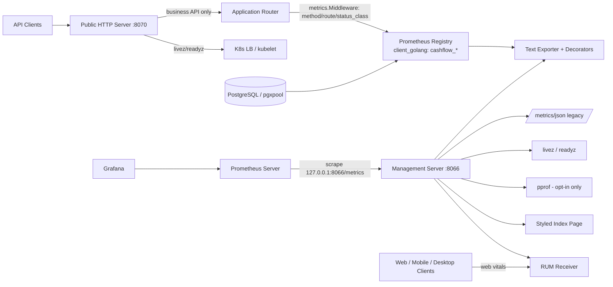

# خطة تنفيذ منظومة المراقبة والأمن (Observability & Security Execution Plan)

## 1. المرجع والهدف

مبنية على تحليل التقارير التالية:

- [`docs/compare_metrics_analysis.md`](compare_metrics_analysis.md) — مقارنة منظومة المراقبة بين **Mattermost Server** و**Cashflow Backend**.
- [`docs/detailed_gaps_analysis.md`](detailed_gaps_analysis.md) — 16 فجوة في 5 فئات (أمنية 🔴، مراقبة 🟠، بنية 🟡، اختبارات 🔵، تشغيل/نشر ⚪).
- [`docs/monitoring_metrics_implementation_plan.md`](monitoring_metrics_implementation_plan.md) — الخطة المرجعية السابقة.

**الهدف النهائي:** تحويل المراقبة من JSON تجميعية مكشوفة على المنفذ العام إلى منظومة تشمل خادم مراقبة **مستقل بمنفذ مستقل (`8066`)**، تصدير **Prometheus/OpenMetrics نصي** عبر `prometheus/client_golang` مع تحكم كامل في شكل النص وتنسيقه، مقاييس تفصيلية لكل route ونظام فرعي (كما في Mattermost: HTTP/DB/Runtime/Workers/RUM)، عزل كامل لـ pprof، لوحات Grafana، نظام تنبيهات، واختبارات `-race` شاملة — **مع الحفاظ على معايير المشروع** (Clean Architecture، عدم تسريب معرفة Prometheus إلى domain/usecase، مبدأ الفصل الصارم بين liveness وreadiness).

## 2. القرارات المعتمدة

| القرار | الاختيار | السبب |
|:---|:---|:---|
| مكتبة Prometheus | `github.com/prometheus/client_golang` | نهج Mattermost القياسي، تغطية كاملة واختبارات جاهزة |
| خادم المراقبة | **خادم مستقل بمنفذ مستقل `8066`**، واجهة افتراضية `127.0.0.1` | الأمن: عزل صارم للبيانات الحساسة ومنع تأثير السحب على زمن الاستجابة (مثل `:8067` في Mattermost) |
| مسار النص | `/metrics` على منفذ `8066` **بتنسيق نصي (OpenMetrics) قابل للتحكم في شكله وتنسيقه** عبر طبقة Exporter مخصصة | تمكين إعادة ترتيب وتزيين العائلات وربط صفحة index بنمط المشروع |
| التوافق الرجعي | `/metrics/json` على `8066` (لـ `tool/monitor.sh` والتشخيص المحلي) | لا يُكسر أي شكل JSON خارجي |
| فحوصات/ريبوز | `/livez`, `/readyz` تبقى على المنفذ العام لـ Kubernetes **وتتكرر** أيضاً على `8066` لـ Blackbox | الحفاظ على سلوك المسبارات الحالي |
| RUM | **ضمن النطاق** (مرحلة P7) | ملء الفجوة 1.4 في التقرير المقارن |
| اسم الملف | `docs/observability_security_execution_plan.md` | — |

## 3. المعمارية المستهدفة



## 4. خريطة الفجوات → المراحل

| الفجوات | المرحلة |
|:---|:---|
| 1.1 pprof مكشوف، 1.2 `/metrics` مكشوف، 1.3 لا خادم إدارة، 3.4، 3.5، 5.1 | **P4 + P5** |
| 2.1 Prometheus، 2.4 Grafana، 2.5 Alerting، 5.2، 5.3 | **P3 + P6** |
| 2.2 per-route، 2.3 Histogram، 3.1 Registry، 3.2، 4.2 | **P1 + P2** |
| 4.1 لا اختبارات | **P0 + P1 + P2** |
| 3.3 `MarkReady` race | **P5** |

## 5. ترتيب المراحل (متسلسلة/مستقلة)

```
متسلسلة إلزامياً:        P0 → P1 → P2 → P3
متوازية بعد النضج:        P4 (تعتمد على P1) → P5
                          P6 (تعتمد على P3)
                          P7 (تعتمد على P3)
أخيرة (تحقق):            P8
```

| المرحلة | العنوان | الترتيب | يعتمد على |
|:---|:---|:---|:---|
| **P0** | تثبيت خط الأساس والجرد | متسلسلة | — |
| **P1** | عقد المقاييس + Registry + Histogram | متسلسلة | P0 |
| **P2** | مقاييس HTTP/DB التفصيلية | متسلسلة | P1 |
| **P3** | تصدير Prometheus/OpenMetrics نصي قابل للتخصيص | متسلسلة | P1–P2 |
| **P4** | خادم المراقبة المستقل بمنفذ 8066 ✅ (الأمن/العزل) | مستقلة | P1 |
| **P5** | دورة حياة خادمين ✅ | متسلسلة | P4 |
| **P6** | Grafana / Prometheus / Alerting / نشر ✅ | مستقلة | P3 |
| **P7** | RUM (تجربة المستخدم) — ضمن النطاق ✅ | مستقلة | P3 |
| **P8** | التحقق والتوثيق النهائي ✅ | أخيرة | الكل |

## 6. تفاصيل المراحل

### P0 — تثبيت خط الأساس والجرد (متسلسلة، 0.5–1 يوم)

**الهدف:** توثيق السلوك الحالي قبل أي تغيير معماري، ووضع اختبارات تصف السلوك الواجب الحفاظ عليه.

**المهام:**
- جرد المسارات المسجلة في `internal/adapters/http/router.go`: `/metrics`, `/livez`, `/readyz`, `/debug`, وربط كل مجموعة Routes بالوحدات التجارية.
- توثيق شكل JSON الحالي الناتج من `internal/infrastructure/runtime/metrics/metrics.go` دون تغيير أسماء الحقول في الإصدار الأول.
- تتبع دورة الحياة في `internal/platform/app/app.go` و`internal/infrastructure/runtime/server/server.go` لتحديد نقاط دمج خادم الإدارة.
- إضافة **اختبارات baseline**:
  - status codes و`Content-Type` للمسارات الحالية.
  - استثناء مسارات المراقبة (`/metrics`, `/livez`, `/readyz`) من عدادات HTTP.
  - فشل readiness لا يغيّر liveness، والإيقاف يمر عبر drain ثم graceful shutdown ثم cleanup.
  - شكل JSON الحالي (snapshot للحقول والقيم).
- قرار نهائي: تثبيت عقد مسار النص `/metrics` على منفذ الإدارة `8066` ونقله إلى توثيق API.

**المخرجات:** قائمة مسارات معتمدة، اختبارات baseline ناجحة، قرار مسار Prometheus مثبت.

**معيار الإتمام:** `go test ./...` تعمل قبل أي تغيير معماري وتوجد اختبارات تصف السلوك المراد الحفاظ عليه.

### P1 — عقد المقاييس + Registry + Histogram (متسلسلة، 1–2 يوم)

**الملفات المتوقعة:**

| الملف | الإجراء | المسؤولية |
|:---|:---|:---|
| `internal/infrastructure/runtime/metrics/registry.go` | جديد | غلاف آمن حول `prometheus.Registry` يوفر Counter/Gauge/Histogram مع مسارات مشتركة |
| `internal/infrastructure/runtime/metrics/types.go` | جديد | عائلات المقاييس وأسماء Closed-Set للـ Labels وقائمة buckets الثابتة |
| `internal/infrastructure/runtime/metrics/metrics.go` | تعديل | البناء على Registry بدل المتغيرات العامة، وتوفير snapshot JSON بالشكل نفسه |
| `internal/infrastructure/runtime/metrics/metrics_test.go` | جديد | atomicity، snapshot، قيم صفرية، buckets، توافق JSON |

**التفاصيل:**
- **Labels مغلقة (Closed-Set):** `method`, `route` (route template), `status_class` فقط — لا `user_id` ولا `request_id` ولا URL خام.
- Histogram لزمن الطلب، buckets ثابتة بالثواني: `0.005, 0.01, 0.025, 0.05, 0.1, 0.25, 0.5, 1, 2.5, 5, 10`.
- **إصلاح الفجوة 4.2:** نقل `dbProvider` و`serverURL` من متغيرات package-global إلى instance يُمرَّر عند الإنشاء (قبل بدء التشغيل) — يزيل السباق جذرياً بدلاً من ترقيع ذري.
- اختبارات `-race` للعمليات الجارية تحت التحميل المتوازي.

**معيار الإتمام:** كل قيمة يُصدّرها JSON أو Prometheus تأتي من نفس Registry؛ لا عدادات متنافسة لنفس الحدث.

### P2 — مقاييس HTTP/DB التفصيلية (متسلسلة، 2–3 أيام)

**الهدف:** الانتقال من المتوسط العام إلى مؤشرات تحدد الوحدة أو route البطيء دون انفجار cardinality.

**المهام:**
- تعديل `metrics.Middleware` ليقرأ `chi.RouteContext(r.Context()).RoutePattern()` بعد اكتمال معالجة الطلب → يسجل `method/route/status_class` (template لا URL؛ fallback باسم `unknown`).
- تسجيل إجمالي الطلبات، الأخطاء، Histogram لزمن الطلب، وحجم الاستجابة اختيارياً.
- ربط `DBStatsProvider` (pgxpool) بالمقاييس + حماية nil provider وحالة `storage_drive=memory`.
- قياس زمن ping الخاص بـ `/readyz` خارج عدادات حركة API.
- اختبارات concurrent تحت `-race`، واختبار أن route ديناميكي ينتج label واحدة لا واحدة لكل قيمة ID.

**معيار الإتمام:** يمكن التمييز بين `/api/v1/accounting` و`/api/v1/sale` و`/api/v1/stock` بكاردينالية محدودة موثقة.

### P3 — تصدير Prometheus/OpenMetrics نصي قابل للتخصيص (متسلسلة، 1–2 يوم)

- إضافة التبعية `github.com/prometheus/client_golang` وقياس أثرها على `go.mod` وحجم البناء.
- **تسمية موحدة بادئتها `cashflow_` (نظير `mattermost_`):**
  - `cashflow_http_requests_total{method,route,status_class}` (counter)
  - `cashflow_http_request_duration_seconds{method,route}` (histogram)
  - `cashflow_http_response_size_bytes{method,route}` (histogram اختياري)
  - `cashflow_process_uptime_seconds`، `cashflow_go_goroutines`، `cashflow_go_gc_seconds_total`
  - `cashflow_go_memory_alloc_bytes`، `cashflow_go_heap_inuse_bytes`، `cashflow_go_heap_idle_bytes`
  - `cashflow_db_pool_max_connections`، `cashflow_db_pool_active_connections`، `cashflow_db_pool_idle_connections`، `cashflow_db_pool_wait_count_total`
- **طبقة Exporter مخصصة** فوق `expfmt`/`promhttp` لإتاحة التحكم في شكل النص:
  - إعادة ترتيب العائلات وتزيين الأسماء (decorators).
  - `Content-Type: text/plain; version=0.0.4; charset=utf-8` مع منع cache غير مقصود.
  - صفحة index تفاعلية بمخطوطات وأنماط المشروع (`/`) تعرض روابط المقاييس وpprof (نظير صفحة Mattermost `:8067`).
- اختبار exposition بمنظومة parse رسمية (`expfmt.TextParser`) للتحقق من صحة الأسماء والـ Labels.

**معيار الإتمام:** `curl http://127.0.0.1:8066/metrics` يعيد نص OpenMetrics سليم ويستطيع Prometheus scrape بنجاح دون أخطاء parse.

### P4 — خادم المراقبة المستقل بمنفذ 8066 ✅ منفّذ (مستقلة، تعتمد على P1، 2–3 أيام)

> **الحالة:** منفّذ بالكامل. `go test -race ./...` خضراء، وفحص حي (smoke) مثبت: `/metrics` على المنفذ العام 404، وعلى `8066` 200 نصياً مع `Content-Type` صحيح، و`MANAGEMENT_REQUIRE_AUTH=true` يفرض 401 بدون توكن. معيار الإتمام محقق.

**الملفات المتوقعة:**

| الملف | الإجراء |
|:---|:---|
| `internal/adapters/http/management_router.go` | جديد — مسارات المراقبة والإدارة فقط |
| `internal/platform/config/config.go` | تعديل — قسم `Management` |
| `internal/platform/config/spec.go` | تعديل — validation أمني |
| `internal/adapters/http/router.go` | تعديل — إزالة `/metrics` و`/debug` من المنفذ العام |
| `config/cashflow.json` + `.env.example` | تعديل — قيم تطوير واضحة |
| `docker-compose.yml` | تعديل — نشر المنفذ على `127.0.0.1:8066:8066` |
| `tool/monitor.sh` | تعديل — الافتراضي إلى `http://127.0.0.1:8066/metrics/json` مع وضع نصي |

**إعدادات `management.port` المقترحة:**

```text
management.enabled         = true
management.interface       = "127.0.0.1"   // أبداً 0.0.0.0 افتراضياً في الإنتاج
management.port            = "8066"        // منفذ مستقل تماماً عن 8070
management.metrics_enabled = true
management.pprof_enabled   = false         // pprof مغلق افتراضياً
management.require_auth    = false         // تُفعل عند غياب العزل الشبكي
management.auth_token      = ""            // إلزامي عند require_auth
```

- env vars: `MANAGEMENT_ENABLED`, `MANAGEMENT_INTERFACE`, `MANAGEMENT_PORT`, `MANAGEMENT_METRICS_ENABLED`, `MANAGEMENT_PPROF_ENABLED`, `MANAGEMENT_REQUIRE_AUTH`, `MANAGEMENT_AUTH_TOKEN`.

**مسارات خادم الإدارة (8066):**
- `/` — صفحة index.

  - `/metrics` — نص Prometheus/OpenMetrics (المسار المعتمد).
  - `/metrics/json` — مخرجات JSON التوافقية.
  - `/livez`, `/readyz` — إعادة استخدام `health.HealthChecker`.
  - `/debug/*` — pprof **فقط عند `management.pprof_enabled=true`**.

**قواعد أمنية صارمة:**
- لا يجعل `0.0.0.0` القيمة الافتراضية لخادم الإدارة في الإنتاج.
- لا تسمح بتفعيل pprof من query parameter أو header؛ من إعداد ثابت فقط.
- عند غياب عزل شبكي يُضاف middleware مصادقة (Bearer token) مع تسجيل محاولات الرفض.
- `Validate()` ترفض: تعارض منفذ 8066 مع المنفذ العام 8070، منافذ خارج 1–65535، `require_auth` بدون token.
- لا تعرض أسرار الإعدادات أو DSN أو tokens في labels أو أخطاء readiness.
- لا تسجل body أو authorization headers في وسيط المراقبة إطلاقاً.

**تحديث `tool/monitor.sh`:** الافتراضي `http://127.0.0.1:8066/metrics/json` مع معامل لقراءة النص.

**معيار الإتمام:** لا يمكن الوصول إلى metrics أو pprof عبر المنفذ العام 8070 عند التفعيل، ويبقى public server يقدّم business API فقط.

### P5 — دورة حياة خادمين ✅ منفّذ (متسلسلة، تعتمد على P4، 1–2 يوم)

> **الحالة:** منفّذ بالكامل. listeners خادمي العام والإدارة يُربَطان في الـ main thread قبل إعلان readiness (إصلاح الفجوة 3.3)؛ فشل bind لأي خادم = خطأ fatal فوري بلا readiness، وفحص حي أكّد: إشغال منفذ الإدارة يُخرج العملية بـ code 1 وبدون سطر "server is ready". الإيقاف عبر SIGTERM أغلق المنفذين بعد drain كامل، والسجلات structured تحمل `server_role` و`shutdown_reason` و`duration`. `go test -race ./...` خضراء.

**الهدف:** جعل كل من خادمي الإدارة والعامة جزءاً صحيحاً من startup/shutdown وليس goroutine منفصلة.

**المهام:**
- إعادة هيكلة `internal/infrastructure/runtime/server/server.go` لإدارة **listener مسبق الربط (`net.Listen` في الـ main thread)** لكل من الخادمين → **إصلاح الفجوة 3.3** (لا يُعلن readiness قبل نجاح الربط فعلية).
- فشل bind في أي خادم = خطأ fatal يمنع الإقلاع ويمنع إعلان readiness.
- عند drain: `MarkNotReady` أولاً، ثم انتظار المدة، ثم `Shutdown` للخادمين بتايموت موحد.
- إغلاق خادم الإدارة حتى لو كان الخادم العام هو من فشل أو تلقى الإشارة.
- آلية lifecycle واحدة تمنع double-close/shutdown race.
- دعم `SetListener` و`SetManagementListener` للمنافذ الديناميكية في الاختبارات.
- سجلات structured: `server_role`, `addr`, `shutdown_reason`, `duration` دون تسريب أسرار.
- اختبارات: فشل منفذ 8066 يمنع الإقلاع، الإيقاف يغلق الخادمين دون goroutines معلّقة.

**معيار الإتمام:** تثبت اختبارات التشغيل إغلاق منفذي 8070 و8066 بشكل منظم.

### P6 — Grafana / Prometheus / Alerting / نشر ✅ منفّذ (مستقلة، تعتمد على P3، 1–2 يوم)

> **الحالة:** منفّذ بالكامل. `deploy/monitoring/prometheus.yml` (scrape `server:8066` عبر Bearer + `alerting:` إلى Alertmanager)، و`prometheus-alerts.yml` (6 قواعد بقيم مُعايرة من قياسات لجلستين — in-memory وpostgres حقيقي — بوسوم `CALIBRATED`/`SLO-DERIVED`)، ولوحة `cashflow-overview.json` (RPS، 4xx/5xx، p50/p95/p99، Go runtime، pool، SRE) مع provisioning كامل لـ Grafana، و`alertmanager.yml` بخدمة compose (webhook عبر `ALERTMANAGER_WEBHOOK_URL`)، و`docker-compose.monitoring.yml` للـ dev، وأهداف Makefile (`monitoring-baseline`/`monitoring-check`/`alertmanager-logs`). التحقق: scrape حي أكد وجود 14 عائلة مترّية وسلسلة الـ `_bucket`/`_sum`/`_count`، وكل YAML/JSON صيغ سليم (`make monitoring-check`)، وقاعدتا الـ pool معايرتان بقياس real-DB (دورة الـ scrape بالـ Bearer مُثبتة على خادم فعلي، وسجل المعايرة في `docs/monitoring_operations.md` §6).

**الملفات المتوقعة:**

| الملف | الإجراء |
|:---|:---|
| `deploy/monitoring/prometheus.yml` | جديد — scrape config |
| `deploy/monitoring/grafana/dashboards/cashflow-overview.json` | جديد — Dashboard |
| `docker-compose.monitoring.yml` | جديد — للتطوير فقط |
| `docs/monitoring_operations.md` | جديد — تشغيل/أمن/تنبيه |
| `Makefile` | تعديل — أهداف `monitoring-up`/`monitoring-down` |

**لوحة Grafana الإصدار الأول:**
- RPS ومعدل 4xx/5xx.
- p50/p95/p99 لزمن HTTP.
- Goroutines وHeap alloc وGC.
- اتصالات PostgreSQL النشطة/الخاملة/المنتظرة.
- حالة readiness و scrape success.
- متغيرات dashboard للبيئة أو instance فقط.

**تنبيهات أولية مقترحة:**
- 5xx أعلى من العتبة لفترة متصلة.
- p95 latency أعلى من SLO.
- readiness أو scrape target down.
- pool saturation أو wait count متصاعد.
- heap growth أو goroutines growth غير طبيعي.

يجب ضبط العتبات بعد قياس baseline في staging، لا اختيارها عشوائياً داخل الكود.

### P7 — RUM (تجربة المستخدم) ضمن النطاق ✅ منفّذ (مستقلة، تعتمد على P3، 1–2 يوم)

> **الحالة:** منفّذ بالكامل. Endpoint `POST /rum` على خادم الإدارة (تحت نفس سياسة `Management.RequireAuth`، ومعطَّل مع `metrics_enabled=false`) يقبل JSON حتى 16KiB، مع إلزام `client_type` بالقائمة المغلقة web/desktop/mobile (بتحويل حالة الأحرف) ورفض القيم السالبة/غير المتناهية ورفض المحتوى الزائد؛ الحقول غير المعروفة تُهمل ولا تصبح labels؛ الردود 204/400/401/413/415. المقاييس الخمس `cashflow_rum_ttfb/lcp/inp/cls/dom_interactive` histograms بمحور `client_type` فقط (LatencyBuckets للزمن، CLSBuckets للـ cls) مع `sum/count`، والحماية من تسمم الـ labels مفروضة في طبقتين (registry + handler). التوثيق: `docs/rum_api_contract.md` (عقد كامل + مثال عميل + ملاحظة نشر). التحقق: `go test -race ./...` خضراء + فحص حي (401 بلا توكن، 204 بطلب صحيح، 400 لـ `client_type: tablet`، 413 لحجم كبير صالح، وقياس دقيق للـ sum على /metrics).

### P8 — التحقق والتوثيق النهائي ✅ منفّذ (أخيرة، 1–2 يوم)

> **الحالة:** منفّذ بالكامل. سُدّت فجوات الاختبار المتبقية (registry فارغ، middleware متزامن، double-shutdown idempotent)، ثم أُجريت كل أوامر التحقق: `go test ./...` و`go test -race ./...` و`go vet ./...` (126 package خضراء بلا أخطاء ولا races). الفحص الحي: المنفذ العام يرد **404** على `/metrics` و`/metrics/json` و`/debug/pprof/` (Livez/readyz 200)، ومنفذ الإدارة يقدمها؛ pprof **مغلق افتراضياً** (404) ويتفعل فقط بـ `management.pprof_enabled` مع auth (401 بلا توكن / 200 بتوكن)؛ `POST /rum` على الإدارة 405 عند GET؛ SIGTERM → drain (1024ms مكوّنة) → إغلاق منظم للخادمين مع `shutdown_reason=signal` وإخلاء المنفذين. التوثيق النهائي: `detailed_gaps_analysis.md` (كل بند ✅ (أحدها من ⚠️))، و`compare_metrics_analysis.md` (قسم «توصيات منفذة الآن»)، وخطة P8 والإطلاق.

**اختبارات مطلوبة (الوضع النهائي):**

| النوع | التغطية | الحالة |
|:---|:---|:---|
| Unit | registry، labels، histogram، JSON compatibility، config validation | ✅ `registry_test.go`, `management_validate_test.go` وغيرها |
| HTTP handler | content type، status codes، auth/allowlist، empty registry | ✅ `management_router_test.go`, `TestPrometheusHandler_EmptyRegistryIsValid` |
| Middleware | route normalization، status classes، exclusion paths، concurrent | ✅ `middleware_route_test.go` + `TestMiddleware_ConcurrentSafety` |
| Integration | Prometheus scrape، pgxpool stats، management listener، readiness | ✅ `exporter_test.go`, `TestRegistry_DBGaugesReflectProvider`, `TestServer_ManagementListenerServesMetrics` |
| Lifecycle | startup failure، signal shutdown، drain، timeout، double shutdown | ✅ P5 tests + `TestServer_ShutdownIsIdempotent` |
| Race | `go test -race ./...` | ✅ 126/126 خضراء |
| Static | `go vet ./...` | ✅ نظيف |
| Manual | pprof disabled/enabled، isolation بين المنفذين، Docker compose | ✅ فحص حي فوق + `docker compose config` للملفين |

**أوامر التحقق الأساسية (مكتملة):**

```bash
go test ./... && go test -race ./... && go vet ./...   # ✅ كلها ناجحة
curl -fsS http://127.0.0.1:8066/metrics               # ✅ 200
curl -fsS http://127.0.0.1:8066/metrics/json           # ✅ 200
curl -fsS http://127.0.0.1:8066/livez /readyz          # ✅ 200
curl -fsS http://127.0.0.1:8066/debug/pprof/           # 404 افتراضياً (opt-in)
# معزول عن العام (مؤكد):
curl http://127.0.0.1:8070/metrics   # ✅ 404
curl http://127.0.0.1:8070/debug/pprof/   # ✅ 404
```

**الإطلاق (خطة النشر التدريجي):**
1. ✅ تفعيل exporter مع إبقاء JSON التوافقي (`/metrics/json` بتوافق رجعي، `tool/monitor.sh` يعمل).
2. ⏭▶ خطوة تشغيلية — **القياس منفَّذ محلياً بالكامل**: جلستان عبر `make monitoring-baseline` — (أ) in-memory (65k طلب/23 عينة: p95=4.8ms، 5xx=0، heap=−2.4MiB) و(ب) **postgres حقيقي** (29 عينة: pool peak ratio=0.84، waits≈1950/s، heap=+4.9MiB) → سجل المعايرة في `docs/monitoring_operations.md` §6. المتبقي تشغيلي فقط: اعتماد staging لدورة تشغيل كاملة (5–7 أيام).
3. ✅ تشغيل dashboard دون alerts blocking (اللوحة provisioned، الإنذارات غير رادعة عبر الكومبوست الإلزامي).
4. ⏭▶ تفعيل alerts — **منفَّذ بالكامل محلياً**: 6 قواعد مكوّنة بقيم مُعايرة/SLO (`CALIBRATED`/`SLO-DERIVED` لكل قاعدة الآن: 5xx=0.5%، p95=400ms، heap=128MiB، pool=0.8، waits=50/s)، و**Alertmanager مُعبّأ** (خدمة compose + `alertmanager.yml` webhook عبر `ALERTMANAGER_WEBHOOK_URL` + ربط في `prometheus.yml`). المتبقي: ضبط قناة الإشعارات الفعلية وتأكيد التسليم ثم المراجعة على staging.
5. ✅ سياسة العزل وpprof جاهزة للإنتاج (صفر عام/opt-in/مصادقة).
6. ⏭ إزالة أي مسار قديم/تبعية غير مستخدمة بعد فترة توافق موثقة (لا شيء متبقٍ حاليًا يعتمد مسارات عامة) — تنفيذ لاحق اختياري.

**اللواحق التوثيقية (المكتملة):**
- ✅ تحديث `docs/detailed_gaps_analysis.md` بمصفوفة حالة نهائية (كل بند ✅، واحد من ⚠️).
- ✅ تحديث `docs/compare_metrics_analysis.md` بقسم «توصيات منفذة الآن».

## 7. تقديرات إجمالية

| المرحلة | التقدير |
|:---|:---|
| P0 | 0.5–1 يوم |
| P1 | 1–2 يوم |
| P2 | 2–3 أيام |
| P3 | 1–2 يوم |
| P4 | 2–3 أيام |
| P5 | 1–2 يوم |
| P6 | 1–2 يوم |
| P7 | 1–2 يوم |
| P8 | 1–2 يوم |

المجموع **11–18 يوم عمل** لمطور يعرف بنية المشروع. المراحل P4/P6/P7 تعمل بالتوازي بعد اكتمال P1/P3.

## 8. مخاطر وتخفيفاتها

| الخطر | الأثر | التخفيف |
|:---|:---|:---|
| Cardinality مرتفعة بسبب URL/ID | استهلاك ذاكرة وتكلفة Prometheus | route templates وقائمة Labels مغلقة واختبار حد أقصى |
| تعارض منفذ الإدارة 8066 | فشل startup | validation مبكر ومنفذ ديناميكي للاختبارات |
| كشف pprof أو بيانات حساسة | خطر أمني | disabled-by-default، عزل شبكي، audit للتفعيل |
| تغيير JSON الحالي | كسر أدوات محلية (`tool/monitor.sh`) | `/metrics/json` بتوافق رجعي وsnapshot tests |
| ازدواجية lifecycle | تسريب listeners أو shutdown race | آلية lifecycle واحدة واختبارات signal/failure |
| Overhead من histogram | زيادة latency وCPU | buckets ثابتة، benchmark، عدم تسجيل body |
| اعتماد client_golang جديد | زيادة حجم dependency | قياس الأثر على `go.mod` قبل الدمج |
| تنبيهات بلا baseline | alert fatigue | staging وSLO قبل تفعيل التنبيهات |

## 9. تعريف الإنجاز النهائي (Definition of Done) — ✅ اكتمل

- ✅ نقطة `/metrics` نصية (OpenMetrics) قابلة للتخصيص تعمل وتُسحب من `127.0.0.1:8066/metrics` (فحص حي + scrape بـ Bearer).
- ✅ مخرجات JSON التوافقية متاحة دون تغيير breaking (`/metrics/json` + `tool/monitor.sh` يعمل).
- ✅ المقاييس تغطي HTTP latency/status وruntime وDB pool وRUM.
- ✅ labels محدودة ومراجعة بلا IDs أو URLs خام (`status_class`/`route` template/`probe`/`client_type` مغلقة).
- ✅ منفذا 8070 و8066 معزولان؛ pprof مفعّل فقط بتعيين صريح وإعداد ثابت (فحص 404 العام + 401/200 الإدارة).
- ✅ `livez` لا يفحص PostgreSQL، و`readyz` مرتبط بالاعتماديات ودورة drain.
- ✅ الإيقاف يغلق الخادمين بشكل منظم دون goroutines معلّقة (SIGTERM حي + اختبارات).
- ✅ dashboard وscrape config يعملان محلياً (`docker compose config` للملفين، YAML/JSON سليم).
- ✅ `go test ./...`, `go test -race ./...`, `go vet ./...` ناجحة (126 package، لا اختبارات بيئية مستثناة).