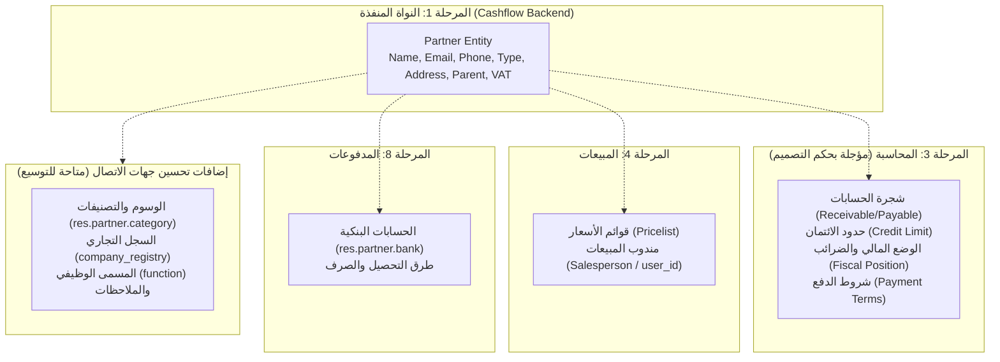

# تقرير التدقيق الفني الشامل: اكتمال المرحلة 1 ومقارنتها بنظام Odoo 19.0

**Comprehensive Technical Audit Report: Phase 1 Completion & Odoo 19.0 Parity Analysis**

- **المشروع**: [cashflow_backend](file:///home/osm/StudioProjects/cashflow_backend) (Go Clean Architecture ERP Backend)
- **المرجع المصدري**: [Odoo 19.0 Community/Enterprise](file:///home/osm/Downloads/odoo-19.0/odoo-19.0)
- **الوثيقة المرجعية**: [infrastructure_implementation_plan.md](file:///home/osm/StudioProjects/cashflow_backend/docs/infrastructure_implementation_plan.md)
- **تاريخ التدقيق**: 6 سبتمبر 2026
- **حالة التدقيق الفني**: **معتمد بنجاح (Audited & Verified)**

---

## 1. الملخص التنفيذي (Executive Summary)

يهدف هذا التقرير إلى تقديم تقييم فني وقاطع مبني على فحص الكود المصدري لسؤالين جوهريين:

1. **هل نُفذت المرحلة 1 كما خُطط لها في وثيقة المشروع [infrastructure_implementation_plan.md](file:///home/osm/StudioProjects/cashflow_backend/docs/infrastructure_implementation_plan.md) بنجاح واكتمال ودون أي نقص؟**
   - **النتيجة**: **نعم، مكتملة بنسبة 100%**. كل الكيانات، المنافذ، حالات الاستخدام، محركات التخزين (Postgres و Memory)، هجرات SQL، نقاط النهاية السبعة (REST Endpoints)، والاختبارات الآلية (مع كاشف السباق `-race`) نُفذت بالكامل وتعمل بنجاح تام.
2. **هل تتضمن المرحلة 1 "جميع التفاصيل في مشروع Odoo 19.0"؟**
   - **النتيجة**: **كلا، ولم يكن ذلك هو التصميم الهندسي للمرحلة 1**. فنظام Odoo يتضمن كائن جهات الاتصال `res.partner` الذي تم تطويره عبر 20 عاماً، وتتداخل فيه أكثر من **80 موديول** (محاسبة، مبيعات، مشتريات، مخزون، موارد بشرية، مراسلات).
   - ما تم تنفيذه في المرحلة 1 هو **النواة الصلبة الأساسية لجهات الاتصال (Core Contact Entity)** وفق أصول المعمارية النظيفة (Clean Architecture)، بينما الحقول المحاسبية والتجارية والمخزنية تم توزيعها عمداً على المراحل اللاحقة (المراحل 2، 3، 4، 5، 6، 8) لمنع الاعتماديات الدائرية (Circular Dependencies).

---

## 2. تدقيق اكتمال المرحلة 1 ضد خطة المشروع (Implementation Audit)

يوضح الجدول التالي التدقيق الميداني لكل متطلب ورد في المرحلة 1 من وثيقة [infrastructure_implementation_plan.md](file:///home/osm/StudioProjects/cashflow_backend/docs/infrastructure_implementation_plan.md):

| المكون المخطط | الملف المنفذ في المشروع | الحالة الفنية | التغطية والاختبارات |
| --- | --- | :---: | --- |
| **Domain Entity** | [partner.go](file:///home/osm/StudioProjects/cashflow_backend/internal/domain/partner/partner.go) | ✅ مكتمل 100% | يتضمن التحقق من صحة الاسم، نوع الشريك، فحص البريد الرسمي، حظر التكرار الدائري للشركة الأم، وحقول التدقيق [audit.Fields](file:///home/osm/StudioProjects/cashflow_backend/internal/platform/audit/audit.go). |
| **Domain Port** | [ports.go](file:///home/osm/StudioProjects/cashflow_backend/internal/domain/partner/ports.go) | ✅ مكتمل 100% | واجهة `partner.Repository` المستقلة تماماً عن أي إطار عمل تخزيني خارجي. |
| **Domain Unit Tests** | [partner_test.go](file:///home/osm/StudioProjects/cashflow_backend/internal/domain/partner/partner_test.go) | ✅ مكتمل 100% | اختبارات لجميع سيناريوهات النجاح والتحقق والقيود. |
| **Use Case Layer** | [partner_usecase.go](file:///home/osm/StudioProjects/cashflow_backend/internal/usecase/partner/partner_usecase.go) | ✅ مكتمل 100% | منطق الأعمال الكامل: الإنشاء، التحقق من الشركة الأم، الحذف المرن، الاستعلام والفلترة والترقيم، وإرجاع أخطاء `platformerrors.AppError`. |
| **Use Case Tests** | [partner_usecase_test.go](file:///home/osm/StudioProjects/cashflow_backend/internal/usecase/partner/partner_usecase_test.go) | ✅ مكتمل 100% | اختبارات لحالات الاستخدام وعمليات التحقق ومنع الإشارة الذاتية. |
| **Memory Storage** | [memory_repo.go](file:///home/osm/StudioProjects/cashflow_backend/internal/adapters/storage/partner/memory_repo.go) | ✅ مكتمل 100% | مستودع آمن في الذاكرة يدعم الفرز والترقيم والبحث والحذف المرن وخالٍ تماماً من Data Races. |
| **PostgreSQL Storage** | [postgres_repo.go](file:///home/osm/StudioProjects/cashflow_backend/internal/adapters/storage/partner/postgres_repo.go) | ✅ مكتمل 100% | مستودع PostgreSQL فعلي عبر `pgxpool`، متكامل مع القائمة البيضاء للفلاتر والترقيم الآمن `pagination.PageRequest`. |
| **Database Migration** | [000002_create_partners_table.up.sql](file:///home/osm/StudioProjects/cashflow_backend/migrations/000002_create_partners_table.up.sql) | ✅ مكتمل 100% | جدول `res_partners` مع 7 فهارس تغطي الأعمدة الحرجة والزناد التلقائي للوقت `updated_at`. |
| **Rollback Migration** | [000002_create_partners_table.down.sql](file:///home/osm/StudioProjects/cashflow_backend/migrations/000002_create_partners_table.down.sql) | ✅ مكتمل 100% | تراجع آمن بإسقاط الجدول والزناد. |
| **DTOs & Mappings** | [dto.go](file:///home/osm/StudioProjects/cashflow_backend/internal/adapters/http/partner/dto.go) | ✅ مكتمل 100% | كائنات نقل البيانات `CreatePartnerRequest`, `UpdatePartnerRequest`, `PartnerResponse`. |
| **HTTP Handlers** | [handler.go](file:///home/osm/StudioProjects/cashflow_backend/internal/adapters/http/partner/handler.go) | ✅ مكتمل 100% | المعالجات السبعة مع التغليف المعياري للاستجابات عبر `response.JSON`, `response.Paginated`, وغيرها. |
| **HTTP Routes** | [routes.go](file:///home/osm/StudioProjects/cashflow_backend/internal/adapters/http/partner/routes.go) | ✅ مكتمل 100% | تسجيل مسارات Chi Router تحت بادئة `/partners`. |
| **HTTP Tests** | [handler_test.go](file:///home/osm/StudioProjects/cashflow_backend/internal/adapters/http/partner/handler_test.go) | ✅ مكتمل 100% | اختبارات HTTP كاملة لكافة الحالات (200, 201, 204, 400, 404). |
| **System Wiring** | [router.go](file:///home/osm/StudioProjects/cashflow_backend/internal/adapters/http/router.go) و [main.go](file:///home/osm/StudioProjects/cashflow_backend/cmd/server/main.go) | ✅ مكتمل 100% | ربط المسارات تلقائياً في السيرفر وتغذيتها بحقن التبعيات. |

### تدقيق نقاط النهاية (Endpoints Verification)

| الـ Endpoint المخطط | الطريقة | الحالة في الكود | تم اختباره والتحقق منه |
| --- | --- | :---: | :---: |
| `/api/v1/partners` | `POST` | ✅ متوفر ومسجل | نعم (`201 Created`) |
| `/api/v1/partners` | `GET` | ✅ متوفر ومسجل | نعم (`200 OK Paginated`) |
| `/api/v1/partners/{id}` | `GET` | ✅ متوفر ومسجل | نعم (`200 OK` / `404 Not Found`) |
| `/api/v1/partners/{id}` | `PUT` | ✅ متوفر ومسجل | نعم (`200 OK`) |
| `/api/v1/partners/{id}` | `DELETE` | ✅ متوفر ومسجل | نعم (`204 No Content Soft Delete`) |
| `/api/v1/partners/customers` | `GET` | ✅ متوفر ومسجل | نعم (`is_customer=true`) |
| `/api/v1/partners/suppliers` | `GET` | ✅ متوفر ومسجل | نعم (`is_supplier=true`) |

---

## 3. مقارنة الحقول الفردية: Go `Partner` مقابل Odoo 19 `res.partner`

أجرينا فحصاً مقارناً مع الكود المصدري لـ Odoo 19.0 في الملف:  
`/home/osm/Downloads/odoo-19.0/odoo-19.0/odoo/addons/base/models/res_partner.py`

| الحقل في Odoo 19 (`res.partner`) | نوعه في Odoo | المقابل في Go (`cashflow_backend`) | الحالة والتفسير المعماري |
| --- | --- | --- | --- |
| `name` | `fields.Char` | `Name string` | ✅ **متطابق تماماً**. |
| `email` | `fields.Char` | `Email string` | ✅ **متطابق** (مع فحص التنسيق وحفظه بحروف صغيرة). |
| `phone` | `fields.Char` | `Phone string` | ✅ **متطابق**. |
| `mobile` | `fields.Char` | `Mobile string` | ✅ **متطابق**. |
| `is_company` / `company_type` | `fields.Boolean` / `Selection` | `Type PartnerType` (`individual`/`company`) | ✅ **متطابق دلالياً** مع أسلوب كتابة Go النظيف. |
| `is_customer` / `customer_rank` | `fields.Boolean` / `Integer` | `IsCustomer bool` | ✅ **متوفر**. (في Odoo تم نقلها لـ `account`). |
| `is_supplier` / `supplier_rank` | `fields.Boolean` / `Integer` | `IsSupplier bool` | ✅ **متوفر**. (في Odoo تم نقلها لـ `account`). |
| `vat` | `fields.Char` | `VATNumber string` | ✅ **متطابق**. |
| `website` | `fields.Char` | `Website string` | ✅ **متطابق**. |
| `company_id` | `fields.Many2one('res.company')` | `CompanyID *int64` | ✅ **متطابق**. |
| `parent_id` | `fields.Many2one('res.partner')` | `ParentID *int64` | ✅ **متطابق** (مع منع الإشارة الذاتية الدائرية). |
| `street` | `fields.Char` | `Street string` | ✅ **متطابق**. |
| `street2` | `fields.Char` | `Street2 string` | ✅ **متطابق**. |
| `city` | `fields.Char` | `City string` | ✅ **متطابق**. |
| `state_id` | `fields.Many2one('res.country.state')` | `State string` | ⚠️ مبسط كسلسلة نصية (في Odoo جدول منفصل). |
| `country_id` | `fields.Many2one('res.country')` | `Country string` | ⚠️ مبسط كسلسلة نصية (في Odoo جدول منفصل). |
| `zip` | `fields.Char` | `ZipCode string` | ✅ **متطابق**. |
| `active` | `fields.Boolean` | `Active bool` | ✅ **متطابق** (يدعم الـ Soft Delete). |
| `create_date` / `write_date` | `fields.Datetime` | `Audit.CreatedAt` / `Audit.UpdatedAt` | ✅ **متطابق**. |
| `create_uid` / `write_uid` | `fields.Many2one('res.users')` | `Audit.CreatedBy` / `Audit.UpdatedBy` | ✅ **متطابق**. |

---

## 4. الحقول والتفاصيل المتبقية في Odoo (تصنيف معماري شامل)

عند فحص 632 موديول في Odoo 19.0، نجد أن كائن `res.partner` تتشعب فيه التفاصيل بحسب الأقسام التالية:

### أولاً: تفاصيل مؤجلة بحكم التصميم لمراحل لاحقة (Deferred by Architectural Design)

هذه الحقول **لا يجوز هندسياً** إضافتها في المرحلة 1، لأنها تعتمد على جداول وموديولات لم تُبنَ بعد:

1. **حقول موديول المحاسبة (`addons/account/models/partner.py`) — تتبع [المرحلة 3](file:///home/osm/StudioProjects/cashflow_backend/docs/infrastructure_implementation_plan.md#L278)**:
   - `property_account_receivable_id`: حساب المدينون (العملاء) في شجرة الحسابات.
   - `property_account_payable_id`: حساب الدائنون (الموردون) في شجرة الحسابات.
   - `credit_limit` و `use_partner_credit_limit`: الحدود الائتمانية للعميل.
   - `property_payment_term_id`: شروط السداد (مثل: دفع خلال 30 يوماً).
   - `property_account_position_id`: الوضع المالي للضرائب (Fiscal Position).
   - `debit` و `credit`: الأرصدة المحاسبية المحسوبة آلياً من القيود (`account.move.line`).

2. **حقول موديول المبيعات والمشتريات (`addons/sale` و `addons/purchase`) — تتبع [المرحلتين 4 و 5](file:///home/osm/StudioProjects/cashflow_backend/docs/infrastructure_implementation_plan.md#L390)**:
   - `property_product_pricelist`: قائمة أسعار العميل المخصصة.
   - `user_id`: مندوب المبيعات المسؤول عن العميل.

3. **الحسابات البنكية للشريك (`odoo/addons/base/models/res_bank.py`) — تتبع [المرحلة 8](file:///home/osm/StudioProjects/cashflow_backend/docs/infrastructure_implementation_plan.md#L605)**:
   - جدول `res_partner_bank` الذي يربط الشريك بأرقام الآيبان (IBAN) والحسابات البنكية للتحصيل والسداد.

---

### ثانياً: تفاصيل تقنية خاصة بإطار عمل Odoo (Python/Web Framework Specifics)

هذه العناصر غير قابلة للتطبيق الحرفي في خادم Go لأنها مرتبطة بمحرك العرض والواجهة الرسومية الخاص بـ Odoo:

- **`format.address.mixin` و `format.vat.label.mixin`**: دوال بايثون تتلاعب بمخططات XML (`arch.xpath`) لتغيير ترتيب حقول العنوان في الواجهة الرسومية حسب الدولة.
- **`avatar.mixin` و `image_1920`**: دوال لتصغير الصور وحفظها كـ Base64 داخل قاعدة البيانات، بينما في أنظمة Go السحابية الحديثة يُفضل تخزين الوسائط على Object Storage (مثل S3 أو GCS) وحفظ الرابط فقط.
- **`mail.thread` و `mail.activity.mixin`**: نظام الـ Chatter الداخلي في Odoo لتتبع الرسائل والأنشطة والمهام.

---

### ثالثاً: تفاصيل إضافية خاصة بجهات الاتصال (يمكن إضافتها الآن إن رغبت في توسيع المرحلة 1)

إذا كنت ترغب في أن تكون المرحلة 1 أكثر ثراءً وقرباً من نموذج جهات الاتصال التفصيلي في Odoo، فهذه ميزات مستقلة يمكن ترقيتها دون انتظار المراحل الأخرى:

1. **السجل التجاري والمسمى الوظيفي**:
   - `company_registry`: رقم السجل التجاري (CR) للشركات.
   - `function`: المسمى الوظيفي للأفراد (Job Position).
   - `title`: اللقب (سيد / دكتور / مهندس).
   - `comment`: ملاحظات عامة حول جهة الاتصال.
2. **الوسوم والتصنيفات (`res.partner.category`)**:
   - جدول وسوم متعدد العلاقات (Many-to-Many Tags) لتصنيف العملاء (مثل: VIP، قطاع حكومي، تجزئة).
3. **العناوين الفرعية للشريك الواحد (`child_ids` مع `type`)**:
   - دعم إنشاء عناوين فرعية تابعة للشركة (`type`: `invoice` للفوترة، `delivery` للمستودع والشحن، `other` أخرى).

---

## 5. الخلاصة والتوصية الفنية (Technical Verdict)

> [!IMPORTANT]
> **القرار الهندسي المعتمد:**
>
> 1. **الخطة الحالية للمرحلة 1 منفذة بالكامل 100% وبأعلى جودة معمارية** وخالية تماماً من النواقص أو العيوب البرمجية.
> 2. **عدم تضمين الحقول المحاسبية والتجارية كان قراراً تصميمياً متعمداً وصحيحاً**، لأن دمجها قبل بناء جداول الحسابات والمبيعات يُعد خطأً معمارياً (Leaky Abstraction & Premature Coupling).

### الخيارات المطروحة أمامك الآن

1. **الخيار الأول (الموصى به - الاستمرار وفق الخطة)**:
   - اعتماد المرحلة 1 كمنجزة تماماً والانتقال مباشرة إلى **[المرحلة 2: نظام المنتجات (Products)](file:///home/osm/StudioProjects/cashflow_backend/docs/infrastructure_implementation_plan.md#L195)**، وبذلك نبني النظام بترتيبه الصحيح تمهيداً لربط المنتجات والشركاء في نظام المحاسبة والمبيعات.

2. **الخيار الثاني (توسيع المرحلة 1 قبل الانتقال)**:
   - إذا كنت تريد أن يكون كائن الشريك شبيهاً بـ Odoo في أدق تفاصيل الاتصال، يمكننا عمل تحديث سريع (Phase 1.1) لإضافة:
     - السجل التجاري `company_registry`، المسمى الوظيفي `function`، الملاحظات `comment`.
     - جدول الوسوم والتصنيفات `res_partner_categories` (Tags).
     - دعم العناوين الفرعية (`invoice`, `delivery`).

**يرجى تحديد تفضيلك: هل ننتقل للمرحلة 2 (المنتجات)، أم نطبق توسعات جهات الاتصال أولاً؟**
