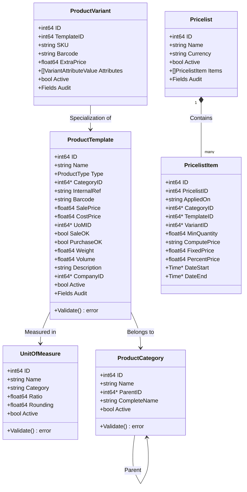
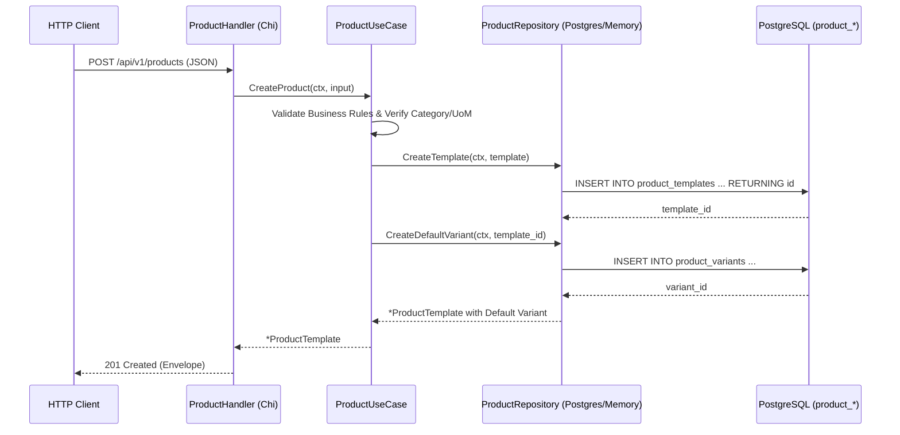

# خطة تنفيذ المرحلة 2: نظام المنتجات والكتالوج (Products Catalog System)

بناء نظام المنتجات والكتالوج الشامل (`product.template`, `product.product`, `product.category`, `uom.uom`, `product.pricelist`) استناداً إلى Odoo 19.0، وفق معمارية Clean Architecture المعتمدة في المشروع، ليكون الركيزة الأساسية للأنظمة اللاحقة: المحاسبة (المرحلة 3)، المبيعات (المرحلة 4)، المشتريات (المرحلة 5)، والمخزون (المرحلة 6).

---

## User Review Required

> [!IMPORTANT]
> **1. الفصل المعماري بين قالب المنتج (Product Template) والنسخ المتغيرة (Product Variants)**:
> تماماً كما في Odoo (`product.template` و `product.product`)، يمثل القالب الخصائص العامة المشتركة للمنتج (الاسم، التصنيف، وحدة القياس، السعر الأساسي، الضريبة، كونه قابلاً للبيع/الشراء)، بينما تمثل النسخة المتغيرة (Variant) التوليفة المحددة للمنتج (مثل المقاس واللون والباركود الخاص والسعر الإضافي). إذا لم يكن للمنتج متغيرات، يتم إنشاء نسخة متغيرة افتراضية وحيدة تلقائياً (Default Variant) لضمان اتساق العمليات في المخازن والفواتير.

> [!IMPORTANT]
> **2. استراتيجية الحذف المرن (Soft Delete) والحفاظ على السلامة المرجعية**:
> المنتجات ووحدات القياس وقوائم الأسعار ترتبط بعمليات محاسبية ومخزنية سابقة؛ لذا يتم تطبيق الحذف المرن `active = false` على جميع الكيانات، مع منع حذف وحدة قياس أو تصنيف في حال وجود منتجات نشطة مرتبطة به.

> [!NOTE]
> **3. التعامل مع الأسعار والعملات (Precision & Pricing)**:
> نستخدم نوع `float64` بدقة سنتية/عشرية عالية (أو تمثيل دقيق في قاعدة البيانات `NUMERIC(15, 4)`) لحساب الأسعار والخصومات وهوامش الربح بدقة دون فقدان الكسور في عمليات التحويل بين وحدات القياس وقوائم الأسعار.

---

## Open Questions

> [!NOTE]
> 1. **توليد المتغيرات تلقائياً (Variant Matrix Generation)**:
>    عند إضافة خصائص للمنتج (مثلاً اللون: أحمر، أزرق | المقاس: S, M, L)، هل ترغب في أن يقوم النظام تلقائياً بتوليد الـ Cartesion Product (6 متغيرات) أم يتم إنشاؤها يدوياً حسب الطلب؟ (المقترح: دعم التوليد التلقائي لجميع التباديل مع السماح بتعطيل أي متغير غير متوفر).
> 2. **قوائم الأسعار المتعددة (Pricelists)**:
>    في Odoo تدعم قوائم الأسعار 3 طرق حساب: (سعر ثابت Fixed، خصم نسبي Percentage Discount، أو معادلة Formula مع هامش ربح وتدوير). هل نطبق الطرق الثلاث بالكامل في هذه المرحلة؟ (المقترح: نعم، لأنها توفر المرونة الكاملة لربط العملاء بأسعار الجملة والتجزئة في مرحلة المبيعات).

---

## Architecture & Data Model

### مخطط الكيانات والعلاقات (Class Diagram)



### تسلسل تدفق دورة الحياة (Clean Architecture Flow)



---

## Proposed Changes

### 1. Database Migrations (`migrations/`)

إنشاء هجرة SQL جديدة برقم تسلسلي `000003` تُنشئ جداول الكتالوج متكاملة مع الفهارس والقيود وتحديث `updated_at`.

#### [NEW] [000003_create_products_schema.up.sql](file:///home/osm/StudioProjects/cashflow_backend/migrations/000003_create_products_schema.up.sql)
- **جدول وحدات القياس `uom_uoms`**:
  - `id BIGSERIAL PRIMARY KEY`
  - `name VARCHAR(100) NOT NULL` (e.g. "Unit", "Dozen", "kg", "g", "Meter", "Hour")
  - `category VARCHAR(50) NOT NULL` (e.g. "unit", "weight", "volume", "length", "time")
  - `ratio NUMERIC(15, 6) NOT NULL DEFAULT 1.0`
  - `rounding NUMERIC(15, 6) NOT NULL DEFAULT 0.001`
  - `active BOOLEAN NOT NULL DEFAULT true`
  - `created_at`, `updated_at`
- **جدول تصنيفات المنتجات `product_categories`**:
  - `id BIGSERIAL PRIMARY KEY`
  - `name VARCHAR(255) NOT NULL`
  - `parent_id BIGINT REFERENCES product_categories(id) ON DELETE SET NULL`
  - `complete_name VARCHAR(500) NOT NULL` (e.g. "All / Electronics / Laptops")
  - `active BOOLEAN NOT NULL DEFAULT true`
  - `created_at`, `updated_at`
- **جدول قوالب المنتجات `product_templates`**:
  - `id BIGSERIAL PRIMARY KEY`
  - `name VARCHAR(255) NOT NULL`
  - `type VARCHAR(20) NOT NULL DEFAULT 'consu'` (`consu` / goods, `service`, `combo`)
  - `category_id BIGINT REFERENCES product_categories(id) ON DELETE RESTRICT`
  - `internal_ref VARCHAR(100)` (SKU)
  - `barcode VARCHAR(100)`
  - `sale_price NUMERIC(15, 4) NOT NULL DEFAULT 0.0`
  - `cost_price NUMERIC(15, 4) NOT NULL DEFAULT 0.0`
  - `uom_id BIGINT REFERENCES uom_uoms(id) ON DELETE RESTRICT`
  - `sale_ok BOOLEAN NOT NULL DEFAULT true`
  - `purchase_ok BOOLEAN NOT NULL DEFAULT true`
  - `weight NUMERIC(15, 4) NOT NULL DEFAULT 0.0`
  - `volume NUMERIC(15, 4) NOT NULL DEFAULT 0.0`
  - `description TEXT`
  - `company_id BIGINT`
  - `active BOOLEAN NOT NULL DEFAULT true`
  - `created_at`, `updated_at`, `created_by`, `updated_by`
- **جداول الخصائص والقيم `product_attributes` و `product_attribute_values`**:
  - إدارة خصائص المنتجات (مثل اللون، الحجم، السعة).
- **جدول متغيرات المنتجات `product_variants`**:
  - `id BIGSERIAL PRIMARY KEY`
  - `template_id BIGINT NOT NULL REFERENCES product_templates(id) ON DELETE CASCADE`
  - `sku VARCHAR(100)`
  - `barcode VARCHAR(100)`
  - `extra_price NUMERIC(15, 4) NOT NULL DEFAULT 0.0`
  - `active BOOLEAN NOT NULL DEFAULT true`
  - `created_at`, `updated_at`, `created_by`, `updated_by`
- **جدول ربط قيم المتغيرات `product_variant_attributes`**:
  - جدول وسيط يربط المتغير بقيم الخصائص المحددة.
- **جداول قوائم الأسعار `product_pricelists` و `product_pricelist_items`**:
  - `product_pricelists`: (`id`, `name`, `currency`, `active`, `created_at`, `updated_at`)
  - `product_pricelist_items`: (`id`, `pricelist_id`, `applied_on`, `category_id`, `template_id`, `variant_id`, `min_quantity`, `compute_price`, `fixed_price`, `percent_price`, `date_start`, `date_end`)
- **الفهارس والـ Triggers**:
  - فهارس للبحث السريع بالاسم، الباركود، الرمز الداخلي، والتصنيف.
  - فهارس جزئية على `active = true`.
  - مشغلات (Triggers) لتحديث `updated_at`.
- **بيانات أولية أساسية (Seed Data)**:
  - إدراج وحدات القياس المعيارية (Units, Dozen, kg, g, Liter, Hour).
  - إدراج التصنيف الجذري الأساسي ("All").
  - إدراج قائمة أسعار افتراضية ("Public Pricelist" - USD/SAR).

#### [NEW] [000003_create_products_schema.down.sql](file:///home/osm/StudioProjects/cashflow_backend/migrations/000003_create_products_schema.down.sql)
- إسقاط جميع الجداول بترتيب عكسي آمن مع `CASCADE`.

---

### 2. Domain Layer (`internal/domain/product/`)

طبقة الأعمال الصافية الخالية من أي إطارات عمل خارجية.

#### [NEW] [product.go](file:///home/osm/StudioProjects/cashflow_backend/internal/domain/product/product.go)
- تعريف الثوابت: `ProductTypeGoods = "consu"`, `ProductTypeService = "service"`, `ProductTypeCombo = "combo"`.
- تعريف `PricelistComputeType`: `Fixed`, `Percentage`, `Formula`.
- تعريف هياكل البيانات:
  - `UnitOfMeasure` + `Validate()`
  - `ProductCategory` + `Validate()`
  - `ProductTemplate` + `Validate()` (فحص صحة الأسعار >= 0، التحقق من الاسم والنوع)
  - `ProductVariant` + `VariantAttributeValue` + `Validate()`
  - `ProductAttribute` + `ProductAttributeValue`
  - `Pricelist` + `PricelistItem` + `Validate()`
  - دالة `CalculatePrice(basePrice float64, qty float64) float64` في `PricelistItem`.

#### [NEW] [ports.go](file:///home/osm/StudioProjects/cashflow_backend/internal/domain/product/ports.go)
- تعريف واجهات التخزين (Repository Interfaces):
  - `TemplateRepository`: إنشاء، تعديل، قراءة، حذف مرن، قائمة مصفاة ومقسمة صفحات.
  - `VariantRepository`: إنشاء، قراءة، استعلام متغيرات القالب، تعديل السعر الإضافي.
  - `CategoryRepository`: إدارة شجرة التصنيفات والتحقق من منع الحلقات التكرارية.
  - `UoMRepository`: إدارة واسترجاع وحدات القياس.
  - `PricelistRepository`: إدارة قوائم الأسعار وقواعد البنود.

#### [NEW] [product_test.go](file:///home/osm/StudioProjects/cashflow_backend/internal/domain/product/product_test.go)
- اختبارات الوحدات لجميع قواعد التحقق الحسابية والشجرية.

---

### 3. Storage Adapters (`internal/adapters/storage/product/`)

#### [NEW] [memory_repo.go](file:///home/osm/StudioProjects/cashflow_backend/internal/adapters/storage/product/memory_repo.go)
- مستودع ذاكرة آمن تماماً ضد السباق بالتزامن (`sync.RWMutex`).
- يدعم الفلترة بالاسم، الباركود، الكود الداخلي، التصنيف، مع دعم الترقيم والفرز والتصنيف الشجري.
- توفير بيانات أولية افتراضية تلقائياً (Default UoMs & Root Category).

#### [NEW] [postgres_repo.go](file:///home/osm/StudioProjects/cashflow_backend/internal/adapters/storage/product/postgres_repo.go)
- مستودع PostgreSQL عالي الكفاءة باستخدام `pgxpool.Pool`.
- استعلامات JOIN ذكية تجمع بيانات المنتج وتصنيفه ووحدة قياسه ومتغيراته في استعلام واحد.
- تكامل تام مع `filter.Filter.BuildWhereClause` و `allowedFields` لمنع ثغرات SQL Injection.
- تكامل مع `pagination.PageRequest`.

#### [NEW] [memory_repo_test.go](file:///home/osm/StudioProjects/cashflow_backend/internal/adapters/storage/product/memory_repo_test.go)
- تغطية شاملة لعمليات الذاكرة واختبار التزامن والفرز.

---

### 4. Use Case Layer (`internal/usecase/product/`)

تنسيق منطق الأعمال للكتالوج:

#### [NEW] [product_usecase.go](file:///home/osm/StudioProjects/cashflow_backend/internal/usecase/product/product_usecase.go)
- واجهة `UseCase`:
  - **المنتجات والقوالب**:
    - `CreateProduct(ctx, in CreateProductInput) (*ProductTemplate, error)`
    - `GetProduct(ctx, id int64) (*ProductTemplate, error)`
    - `UpdateProduct(ctx, id int64, in UpdateProductInput) (*ProductTemplate, error)`
    - `DeleteProduct(ctx, id int64) error` (Soft delete)
    - `ListProducts(ctx, f *filter.Filter, page pagination.PageRequest) (pagination.PageResult[ProductTemplate], error)`
  - **المتغيرات**:
    - `GetProductVariants(ctx, templateID int64) ([]ProductVariant, error)`
    - `CreateProductVariant(ctx, templateID int64, in CreateVariantInput) (*ProductVariant, error)`
  - **التصنيفات**:
    - `CreateCategory(ctx, in CreateCategoryInput) (*ProductCategory, error)`
    - `ListCategories(ctx) ([]ProductCategory, error)`
    - `GetCategory(ctx, id int64) (*ProductCategory, error)`
    - `UpdateCategory(ctx, id int64, in UpdateCategoryInput) (*ProductCategory, error)`
    - `DeleteCategory(ctx, id int64) error`
  - **وحدات القياس (UoM)**:
    - `CreateUoM(ctx, in CreateUoMInput) (*UnitOfMeasure, error)`
    - `ListUoMs(ctx) ([]UnitOfMeasure, error)`
  - **قوائم الأسعار وحساب السعر**:
    - `CreatePricelist(ctx, in CreatePricelistInput) (*Pricelist, error)`
    - `ListPricelists(ctx) ([]Pricelist, error)`
    - `GetPricelist(ctx, id int64) (*Pricelist, error)`
    - `AddPricelistItem(ctx, pricelistID int64, in CreatePricelistItemInput) (*PricelistItem, error)`
    - `ComputePrice(ctx, pricelistID int64, productID int64, quantity float64) (float64, error)`
- التحقق التلقائي من وجود التصنيف ووحدة القياس وتوليد المسار الشجري الكامل للتصنيف `parent_name / name`.
- إنشاء المتغير الافتراضي آلياً للمنتج الجديد.

#### [NEW] [product_usecase_test.go](file:///home/osm/StudioProjects/cashflow_backend/internal/usecase/product/product_usecase_test.go)
- اختبارات حالات النجاح، حالات الأخطاء (400, 404, 409)، احتساب قوائم الأسعار، وحظر الحلقات في التصنيفات.

---

### 5. HTTP Adapter Layer (`internal/adapters/http/product/`)

#### [NEW] [dto.go](file:///home/osm/StudioProjects/cashflow_backend/internal/adapters/http/product/dto.go)
- DTOs الخاصة بجميع الطلبات والاستجابات:
  - `CreateProductRequest`, `UpdateProductRequest`, `ProductResponse`
  - `CreateVariantRequest`, `VariantResponse`
  - `CreateCategoryRequest`, `CategoryResponse`
  - `CreateUoMRequest`, `UoMResponse`
  - `CreatePricelistRequest`, `PricelistResponse`, `ComputePriceRequest`, `ComputePriceResponse`

#### [NEW] [handler.go](file:///home/osm/StudioProjects/cashflow_backend/internal/adapters/http/product/handler.go)
- معالجة طلبات HTTP واستخراج البارامترات والترقيم والتصفية، واستخدام مغلفات الاستجابة المعيارية `response.JSON`, `response.Created`, `response.Paginated`, `response.Error`.

#### [NEW] [routes.go](file:///home/osm/StudioProjects/cashflow_backend/internal/adapters/http/product/routes.go)
- تسجيل مسارات RESTful واضحة ومنظمة:
  - `POST /api/v1/products`
  - `GET /api/v1/products`
  - `GET /api/v1/products/{id}`
  - `PUT /api/v1/products/{id}`
  - `DELETE /api/v1/products/{id}`
  - `GET /api/v1/products/{id}/variants`
  - `POST /api/v1/products/{id}/variants`
  - `POST /api/v1/product-categories`
  - `GET /api/v1/product-categories`
  - `GET /api/v1/product-categories/{id}`
  - `PUT /api/v1/product-categories/{id}`
  - `DELETE /api/v1/product-categories/{id}`
  - `POST /api/v1/uom`
  - `GET /api/v1/uom`
  - `POST /api/v1/pricelists`
  - `GET /api/v1/pricelists`
  - `GET /api/v1/pricelists/{id}`
  - `POST /api/v1/pricelists/{id}/items`
  - `POST /api/v1/pricelists/{id}/compute-price`

#### [NEW] [handler_test.go](file:///home/osm/StudioProjects/cashflow_backend/internal/adapters/http/product/handler_test.go)
- اختبارات شاملة لجميع المسارات عبر `httptest`.

---

### 6. الربط والتهيئة (System Wiring)

#### [MODIFY] [router.go](file:///home/osm/StudioProjects/cashflow_backend/internal/adapters/http/router.go)
- استقبال `productHandler *producthttp.Handler` وتسجيل مسارات المنتجات تحت `/api/v1`.

#### [MODIFY] [main.go](file:///home/osm/StudioProjects/cashflow_backend/cmd/server/main.go)
- تهيئة مستودع المنتجات `productRepo` (PostgreSQL أو In-Memory).
- تهيئة `productUseCase` و `productHandler`.
- تمرير معالج المنتجات إلى دالة `NewRouter`.

---

## Verification Plan

### Automated Tests
1. **اختبارات الوحدات والمعمارية**:
   ```bash
   go test -v ./internal/domain/product/...
   go test -v ./internal/usecase/product/...
   go test -v ./internal/adapters/storage/product/...
   go test -v ./internal/adapters/http/product/...
   ```
2. **فحص الـ Race Conditions والنزاهة الكاملة**:
   ```bash
   go test -race ./...
   ```
3. **تطبيق هجرة قاعدة البيانات والتأكد من نجاحها**:
   ```bash
   # سيتم تطبيقها تلقائياً عند إقلاع السيرفر أو عبر الأداة المساعدة
   ```

### Manual Verification
1. **تشغيل الخادم**:
   ```bash
   STORAGE_DRIVER=memory make run
   ```
2. **إنشاء فئة منتجات (Category)**:
   ```bash
   curl -s -X POST http://localhost:8080/api/v1/product-categories \
     -H "Content-Type: application/json" \
     -d '{"name":"Electronics"}'
   ```
3. **إنشاء منتج جديد (Product)**:
   ```bash
   curl -s -X POST http://localhost:8080/api/v1/products \
     -H "Content-Type: application/json" \
     -d '{"name":"Laptop Pro 16","type":"consu","sale_price":1500.0,"cost_price":1100.0,"internal_ref":"LP-16","category_id":1}'
   ```
4. **استرجاع المنتجات مع الفلترة والترقيم**:
   ```bash
   curl -s "http://localhost:8080/api/v1/products?page=1&limit=10"
   ```
5. **استعلام واحتساب الأسعار عبر قوائم الأسعار (Compute Price)**:
   ```bash
   curl -s -X POST http://localhost:8080/api/v1/pricelists/1/compute-price \
     -H "Content-Type: application/json" \
     -d '{"product_id":1,"quantity":5}'
   ```
