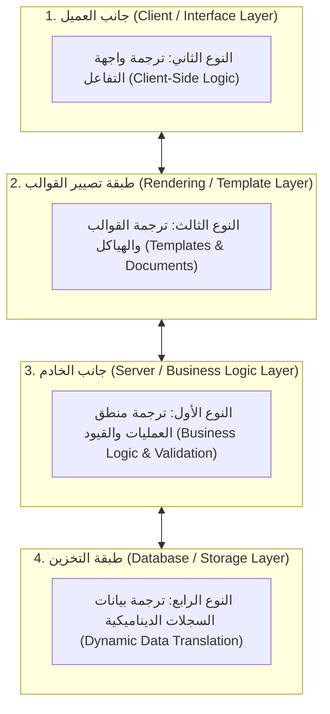
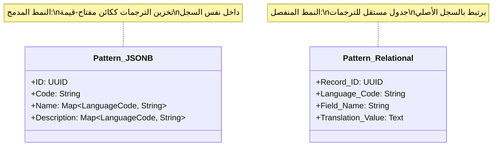
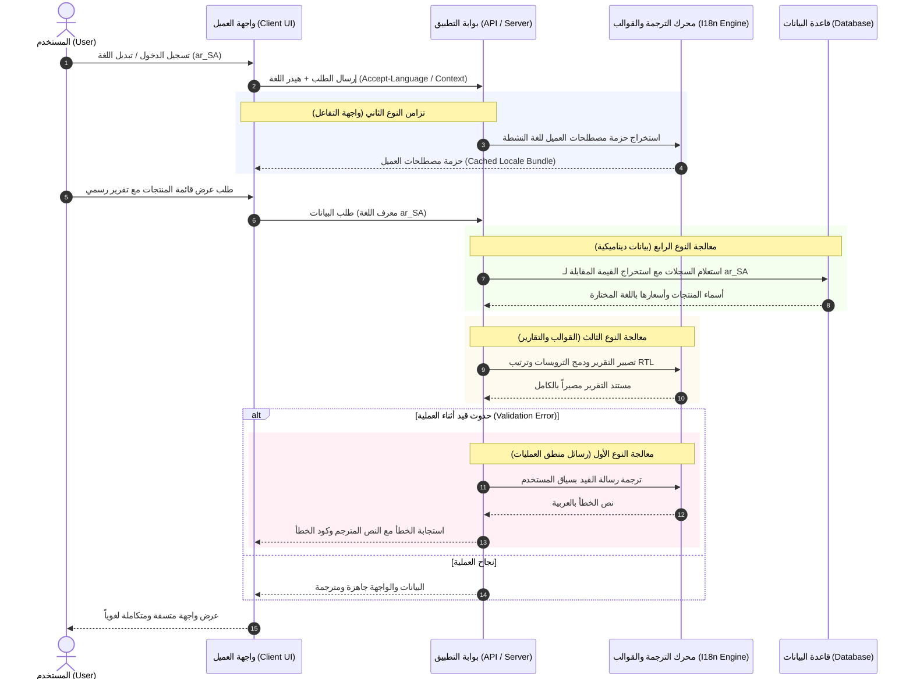

# المفاهيم المعمارية لأنظمة الترجمة والتدويل (I18n & L10n) في الأنظمة المؤسسية

---

## 1. نظرة عامة ومقدمة معمارية

في الأنظمة البرمجية الحديثة متعددة الطبقات (Enterprise Multi-Tier Applications)، لا تقتصر الترجمة على مجرد "استبدال كلمة بأخرى"، بل تُعدّ جزءاً لا يتجزأ من بنية النظام وتدفّق البيانات بين طبقات المعالجة (Processing Layer)، وطبقة التقديم والعرض (Presentation Layer)، وطبقة تخزين البيانات (Persistence Layer).

تُقسّم النصوص في أي نظام برمجي إلى فئتين رئيسيتين:

1. **النصوص الثابتة (Static / Metadata Texts):** وهي النصوص المُنشأة من قِبل مطوري النظام، وتشمل أسماء الأزرار، ترويسات الجداول، رسائل التنبيه والتحقق، وتسميات النماذج.
2. **النصوص الديناميكية (Dynamic / Business Data Texts):** وهي البيانات التي يُدخلها مستخدمو النظام وتُخزّن في قاعدة البيانات، مثل أسماء الأصناف، التوصيفات التجارية، بنود الشروط والأحكام، وغيرها.

وفقاً لهذا التوزيع المعماري، تنبثق **أربعة أنواع رئيسية للترجمة**، لكل نوع طبيعته الخاصة، ومسار استخراجه، وتوقيت تنفيذه، واستراتيجيته التخزينية.

---

---

## 2. النوع الأول: ترجمة منطق العمليات والخادم (Server-Side Logic Translation)

### أ. طبيعة هذا النوع

يرتبط هذا النوع بالنصوص المكتوبة في صلب منطق الأعمال (Business Logic) على جانب الخادم. تتضمن هذه النصوص:

- رسائل الأخطاء الاستثنائية (Exceptions).
- قيود التحقق من صحة المدخلات (Business Constraints & Validations)؛ مثل: "لا يمكن تأكيد المعاملة قبل تعيين تاريخ الاستحقاق".
- السجلات الإجرائية وتتبّع تدقيق النظام (Audit Trails) الموجهة للمستخدم.
- الرسائل الإشعارية والإجرائية التلقائية الصادرة من الخادم.

### ب. التوقيت وآلية التنفيذ

- **وقت التنفيذ (Runtime Evaluation):** تتم الترجمة في لحظة استدعاء الدالة أو رمي الاستثناء على الخادم.
- **تحديد السياق (Context Resolution):** يحدد الخادم اللغة المستهدفة استناداً إلى:
  - لغة الجلسة الحالية للمستخدم (User Session Language).
  - أو لغة الطرف المستقبل للعملية (Recipient Language)؛ على سبيل المثال: عند إصدار إشعار لعميل محدد، يجب ترجمة الرسالة إلى لغة العميل المخزنة في ملفه وليس لغة الموظف الذي قام بالعملية.

### ج. التحديات المعمارية

1. **التعامل مع المتغيرات والمقاطع المركبة:** لا ينبغي دمج النصوص المتغيرة بطريقة التجميع البسيط (String Concatenation)، لأن ترتيب الكلمات يختلف بين اللغات (مثل الفرق بين اللغات التي تبدأ بالفعل واللغات التي تبدأ بالفاعل). لذلك يُستخدم نظام التعويض النصي (Named Placeholders).
2. **الترجمة المتأخرة (Lazy Translation):** في بعض الحالات، لا يُراد ترجمة النص لحظة كتابته في الكود (مثل تعريف خيارات القوائم المنسدلة عند تشغيل النظام)، بل تُحفظ ككائن مرجعي يُترجم فقط عند طلبه من قبل مستخدم محدد بلغة محددة.

---

## 3. النوع الثاني: ترجمة واجهات وتفاعل المستخدم (Client-Side Interface Translation)

### أ. طبيعة هذا النوع

يختص هذا النوع بالنصوص التي تحكم سلوك وتفاعل المستخدم اللحظي داخل التطبيق أو المتصفح، دون الحاجة للاتصال بالخادم في كل حركة. يشمل ذلك:

- نصوص النوافذ المنبثقة التفاعلية (Dialogs & Confirmation Prompts).
- التلميحات الإرشادية الفورية (Tooltips) وحالات التحميل (Loading states).
- رسائل التحقق اللحظية في المتصفح قبل إرسال النموذج.
- أسماء أدوات لوحة التحكم وتفضيلات العرض المؤقتة.

### ب. التوقيت وآلية التوزيع والتراسل

- **حزم المصطلحات (Translation Catalogs / Dictionaries):** لا يطلب العميل ترجمة كل جملة على حدة، بل يطلب الخادم تزويده بـ "حزمة مصطلحات" مجمعة للغة النشطة للمستخدم عند بدء الجلسة أو عند فتح الشاشة.
- **التخزين المؤقت في جانب العميل (Client-Side Caching):** تُخزّن هذه الحزم في ذاكرة التطبيق أو التخزين المحلي (Local Storage / Indexed Storage) لتوفير أداء فوري وتفادي استهلاك النطاق الترددي للشبكة.
- **البصمة الزمنية والتحقق (Hash / ETag Comparison):** تُرسل الحزم برمز تجزئة (Hash)؛ إذا لم تتغير الترجمات على الخادم، يستخدم العميل نسخته المخزنة مؤقتاً مباشرة.

### ج. التحديات المعمارية

- **تضارب سياق الكلمات المشتركة:** كلمة مثل "Open" قد تعني في سياق أمر عمل "قيد التشغيل"، وفي سياق ملف "فتح"، وفي سياق حساب "مفتوح". يتطلب النظام المعماري المتين تزويد الترجمة بما يُعرف بـ (Context Namespace) لتفادي ترجمة الكلمة الواحدة بترجمة غير ملائمة لسياق النافذة.

---

## 4. النوع الثالث: ترجمة قوالب العرض والواجهات الهيكلية (Templates & Structural Presentation)

### أ. طبيعة هذا النوع

يتعامل هذا النوع مع المكونات الهيكلية المرئية الثابتة للنظام، وتشمل:

- تسميات الحقول في النماذج والجداول (Form Labels & Table Column Headers).
- العناوين، الترويسات، والأزرار الثابتة في تصميم الصفحات.
- قوالب المستندات الرسمية المطبوعة (مثل الفواتير، سندات القبض، كشوف الحسابات).
- قوالب رسائل البريد الإلكتروني ذات التنسيق الثابت.

### ب. التوقيت وآلية العمل

- **مرحلة التصيير والتجميع (Compilation / Rendering Phase):**
  - **التجميع المسبق (Pre-compilation):** تُحلل القوالب أثناء البناء أو التهيئة، وتُستخرج النصوص منها لتكوين قواميس الترجمة.
  - **التصيير الحي (Runtime Rendering):** عند طلب الصفحة أو التقرير، تُدمج شجرة البيانات مع القالب الهيكلي مع استبدال التسميات بلغة العرض المطلوبة.
- **دعم الاتجاهات (Bi-directional Support / RTL & LTR):** لا يقتصر هذا النوع على النص فقط، بل يشمل تكيف الهيكل البصري مع اللغة، مثل قلب اتجاه الجداول، الهوامش، وترتيب الأعمدة عند التبديل إلى اللغات التي تُكتب من اليمين إلى اليسار.

### ج. التحديات المعمارية

- تقليل الحمل الحسابي لعملية استبدال النصوص داخل القوالب الضخمة أو التقارير كثيرة الصفحات عن طريق التخزين المؤقت لشجرة العرض بعد ترجمتها (Rendered Tree Caching).

---

## 5. النوع الرابع: ترجمة محتوى البيانات والسجلات (Dynamic Data / Stored Content Translation)

### أ. طبيعة هذا النوع

يُمثل هذا النوع التحدي الأكبر في معمارية قواعد البيانات، حيث لا تكون النصوص مكتوبة داخل الكود المصدري ولا داخل ملفات النظام، بل يُنشئها المستخدمون يومياً أثناء استخدام النظام. أمثلة ذلك:

- اسم المنتج ووصفه (مثال: منتج يُعرض باللغة العربية باسم "مكتب تنفيذي" وللعميل باللغة الإنجليزية باسم "Executive Desk").
- مسميات الحسابات في شجرة الحسابات المالية.
- شروط وسياسات التسليم والدفع.
- تصنيفات العملاء والموردين.

### ب. الأنماط المعمارية لتخزين البيانات متعددة اللغات

هناك استراتيجيتان معماريتان شهيرتان لإدارة هذا النوع في طبقة التخزين:

#### 1. النمط المدمج في السجل (Document/Field-Level Localization - Map Pattern)

- تُخزن القيم اللغوية للحقل داخل نفس الحقل ككائن مركب (مفتاح: لغة، قيمة: النص).
- **المزايا:** سرعة عالية في القراءة دون الحاجة لعمليات ربط جداول معقدة (No JOINs)، وسهولة إضافة لغة جديدة دون تعديل المخطط.
- **العيوب:** يتطلب دعماً لمحركات قواعد بيانات حديثة تدعم البحث والفهرسة داخل الحقول المركبة.

#### 2. نمط جدول الترجمات المنفصل (External Translation Table Pattern)

- يُخزن السجل بلغته الأصلية، وتُنشأ علاقة مع جدول فرعي يحتوي على (معرف السجل، اسم الحقل، رمز اللغة، النص المترجم).
- **المزايا:** فصل كامل بين البيانات الأساسية وتفاصيل اللغات، وملاءمة لقواعد البيانات العلائقية التقليدية.
- **العيوب:** تكلفة إضافية في وقت الاستعلام بسبب كثرة عمليات الربط (JOIN overhead).

### ج. سياسة الاحتياط والتعويض اللغوي (Fallback Mechanism)

عند طلب سجل بلغة غير متوفرة بعد (مثلاً: تم طلب اسم المنتج باللغة الإسبانية، والمنتج مُدخل فقط بالعربية والإنجليزية):

1. يحاول النظام قراءة اللغة المطلوبة (مثل `es_ES`).
2. إن لم يجد، يعود إلى لغة النظام الافتراضية (System Fallback Language؛ مثلاً `en_US`).
3. إن لم يجد، يعود إلى اللغة الأصلية التي أُنشئ بها السجل (Source Creation Language).
4. يضمن هذا التدفق عدم ظهور نصوص فارغة أو انهيار واجهة العرض.

---

## 6. مصفوفة المقارنة المعمارية الشاملة

| معيار المقارنة | 1. منطق العمليات (Backend Logic) | 2. واجهة التفاعل (Client Interface) | 3. القوالب والهياكل (Templates) | 4. البيانات الديناميكية (Dynamic Data) |
| :--- | :--- | :--- | :--- | :--- |
| **مصدر النص** | كود المعالجة الخلفية والخدمات | ملفات منطق العميل والمتصفح | ملفات القوالب والشاشات والتقارير | مدخلات المستخدمين في قاعدة البيانات |
| **توقيت الترجمة** | لحظة التنفيذ (On Execution / Throw) | عند تفاعل المستخدم أو تحميل الشاشة | عند تصيير الشاشة أو توليد التقرير | عند استعلام قاعدة البيانات (Query Time) |
| **مكان تخزين القاموس** | ملفات لغوية مجمعة على الخادم | حزم ذاكرة مؤقتة على المتصفح/العميل | قواميس القوالب المدمجة | جداول أو حقول قاعدة البيانات |
| **المسؤول عن التعديل** | المطورون / مترجمو النظام | المطورون / مصممو الواجهات | مصممو الواجهات والتقارير | المستخدم النهائي / مدخل البيانات |
| **آلية الاسترجاع** | دالة الترجمة بالسياق الممرر | البحث في معجم الذاكرة المحلي للعميل | استبدال أثناء بناء الشجرة المرئية | استعلام الفلترة أو تفكيك الكائن اللغوي |
| **تأثير الأداء** | حسابي طفيف جداً في الذاكرة | منعدم على الخادم (يتحمله معالج العميل) | يعتمد على فاعلية كاش تصيير القوالب | يعتمد على فهارس قاعدة البيانات وحجم السجلات |

---

## 7. بروتوكول التراسل وتنسيق اللغة بين الطبقات (End-to-End Orchestration)

كيف تعمل هذه الأنواع الأربعة معاً في منظومة متناسقة؟

---

## 8. أفضل الممارسات العامة للتصميم المعماري للترجمة

1. **فصل المعرّف (Key) عن التمثيل (Value):**
   - لا ينبغي الاعتماد على النص ذاته كمعرف وحيد في جميع الطبقات إذا كان النص قابلاً للتعديل، بل يُفضل استخدام رموز فريدة (Error Codes / Localization Keys) للتواصل بين الخادم والعميل، بحيث يستطيع العميل ترجمتها محلياً إن لزم.
2. **عزل سياق الترجمة (Context Segregation):**
   - التفريق الحاسم بين "لغة واجهة المستخدم الذي ينفذ العملية" ولغة "العميل أو الشريك المتلقي لنتيجة العملية".
3. **التصميم الداعم لتعدد الاتجاهات منذ اليوم الأول (RTL/LTR Agnostic):**
   - تصميم هياكل القوالب والصفحات بمفاهيم البداية والنهاية (`Start/End` أو `Inline/Block`) بدلاً من اليمين واليسار الثابت (`Left/Right`).
4. **استراتيجية تخزين احتياطي متعددة الدرجات (Robust Fallback Hierarchy):**
   - ضمان ألا يؤدي فقدان ترجمة كلمة أو سجل إلى فشل استجابة الخدمة (Graceful Degradation).
5. **حيادية التدويل في طبقة التخزين:**
   - الحفاظ على العملات، التواريخ، والأرقام بصيغها القياسية الموحدة (ISO 8601 للتواريخ، وأرقام خام غير منسقة) داخل قواعد البيانات، وتأجيل التنسيق اللغوي الموضعي (Formatting / Locale Representation) إلى لحظة العرض النهائية فقط.
